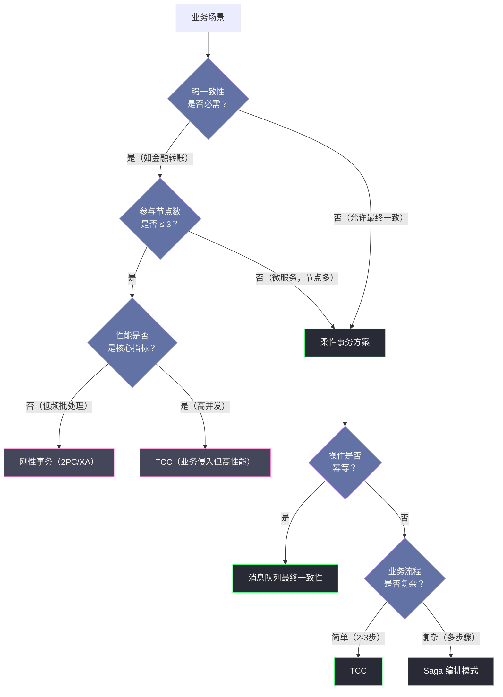

# 01 分布式事务的本质与挑战

**摘要：**

本文是分布式事务专栏的开篇，目标是为后续所有协议与框架的学习构建清晰的"问题域"认知。文章从单机数据库事务的 ACID 属性出发，深入剖析每个属性的本质语义与实现代价，然后回答一个关键问题：为什么将这套机制搬到分布式系统中会遭遇根本性困难？进而引出 CAP 定理的严格含义与常见误解、BASE 理论的工程哲学，最终建立起"刚性事务 vs 柔性事务"的认知框架，为整个专栏后续的 2PC、TCC、Saga 等解法提供逻辑起点。

---

## 第 1 章 为什么需要事务？从一次转账说起

在思考分布式事务之前，先回到最原始的问题：**事务（Transaction）到底是什么，它解决了什么问题？**

设想一个最经典的银行转账场景：用户 A 向用户 B 转账 100 元。从数据库的角度，这个操作拆解为两条 SQL：

```sql
UPDATE account SET balance = balance - 100 WHERE user_id = 'A';
UPDATE account SET balance = balance + 100 WHERE user_id = 'B';
```

这两条 SQL 必须**要么全部成功，要么全部失败**。如果第一条执行成功而第二条因系统崩溃未能执行，那么 A 的钱凭空消失了——这是一个无法接受的数据错误。

这个场景描述的恰好是事务要解决的核心问题：**如何将多个操作绑定为一个不可分割的逻辑单元，保证在任何异常情况下数据始终处于正确的状态？**

单机数据库通过 [[ACID]] 模型给出了答案。在单机世界里，所有的操作都发生在同一个进程、同一块内存、同一块磁盘上，数据库可以通过 [[WAL（Write-Ahead Log）]]、[[MVCC（多版本并发控制）]]、[[锁机制]] 等技术手段精确地控制事务的执行与回滚。这套机制运转了数十年，非常成熟可靠。

然而，当业务规模超过单机极限，系统被迫拆分为多个微服务、数据被分散到多个独立的数据库时，原本在单机内部可以精确控制的事务边界被打破了——参与事务的各方不再共享同一个进程、同一块内存，它们之间只能通过网络通信来协调。**而网络，是不可靠的**。

这就是分布式事务问题的起点。

---

## 第 2 章 ACID 的本质：四个属性背后的代价

在深入分布式的困难之前，必须把 ACID 的每一个字母真正理解透彻。很多人背过 ACID 的定义，但对于每个属性"为什么需要这样""不满足会怎样"却未必清晰。

### 2.1 原子性（Atomicity）：事务是最小的执行单元

**原子性**要求事务中的所有操作，要么全部提交成功，要么全部回滚，不允许出现部分成功的中间状态。

原子性解决的是**故障场景下的一致性**问题。它的实现依赖两个核心机制：

**（1）[[Undo Log（回滚日志）]]**：在执行数据修改之前，先将修改前的旧值记录到 Undo Log 中。一旦事务失败或被回滚，数据库可以根据 Undo Log 将数据恢复到事务开始前的状态。

**（2）[[WAL（Write-Ahead Log）]]**：所有修改在真正落盘到数据文件之前，必须先写入 Redo Log。这保证了即使系统在数据落盘前崩溃，重启后也能通过 Redo Log 重放未完成的操作，或根据 Undo Log 回滚未提交的事务。

> [!note] 原子性 ≠ 瞬间完成
> 原子性并不意味着事务的所有操作在物理时间上是同时发生的。它的含义是：**从外部观察者角度看，事务的中间状态是不可见的**。数据库通过隔离机制屏蔽了其他事务对中间状态的观察。

原子性在单机上的实现成本相对可控，因为 Undo Log 和 Redo Log 都在同一台机器的磁盘上，崩溃恢复是一个单机问题。但在分布式场景下，"回滚"意味着需要通知所有参与节点撤销各自的操作——如果某个节点在收到回滚通知之前就已崩溃，或者回滚通知本身在网络中丢失，原子性就无法保证了。

### 2.2 一致性（Consistency）：数据库始终满足完整性约束

ACID 的"一致性"是四个属性中最容易被误解的一个，尤其是它与 CAP 定理中的"一致性（Consistency）"含义完全不同。

**ACID 的 C**：事务执行前后，数据库必须从一个合法状态（满足所有完整性约束）转变到另一个合法状态。这里的完整性约束包括主键约束、外键约束、CHECK 约束、业务规则约束（如账户余额不能为负）等。

**CAP 的 C**：在分布式系统中，所有节点在同一时间看到的数据是相同的，即线性一致性（[[Linearizability]]）——写操作一旦完成，后续所有读操作都必须能看到这次写入的结果。

这是两个截然不同的语义。混淆它们是很多技术讨论产生歧义的根源。

> [!warning] 关键区别
> ACID-C 是**语义层面**的约束，描述的是"数据满足业务规则"；CAP-C 是**时序层面**的约束，描述的是"多副本的写可见性"。前者由应用逻辑保证，后者由分布式协议保证。

ACID 模型中，一致性在某种意义上是其他三个属性（AID）的目标：正是通过原子性、隔离性和持久性的共同保证，才使得数据库能够维持一致的状态。

### 2.3 隔离性（Isolation）：并发事务互不干扰

**隔离性**处理的是多个事务并发执行时的相互影响问题。在没有隔离性保障的情况下，并发事务会产生四类经典问题：

| 问题 | 描述 | 举例 |
| :--- | :--- | :--- |
| **脏读（Dirty Read）** | 读取到其他事务未提交的修改 | 事务 B 读取了事务 A 修改但未提交的余额 |
| **不可重复读（Non-Repeatable Read）** | 同一事务内两次读取同一行，结果不同 | 事务 A 两次读取余额，期间事务 B 完成了转账 |
| **幻读（Phantom Read）** | 同一事务内两次相同范围查询，结果集不同 | 事务 A 两次统计账户数量，期间事务 B 新增了账户 |
| **丢失更新（Lost Update）** | 两个事务同时修改同一行，后者覆盖前者 | 事务 A 和 B 同时对余额加 100，最终只加了 100 |

SQL 标准定义了四个隔离级别，用不同的权衡来处理这些问题：

| 隔离级别 | 脏读 | 不可重复读 | 幻读 | 实现机制 |
| :--- | :--- | :--- | :--- | :--- |
| **读未提交（Read Uncommitted）** | 可能 | 可能 | 可能 | 无锁 |
| **读已提交（Read Committed）** | 不可能 | 可能 | 可能 | 读时获取行共享锁 |
| **可重复读（Repeatable Read）** | 不可能 | 不可能 | 可能（InnoDB 已解决）| MVCC + 间隙锁 |
| **可串行化（Serializable）** | 不可能 | 不可能 | 不可能 | 全表锁或 SSI |

隔离性的实现代价随级别升高而显著增加。[[MySQL InnoDB]] 的默认隔离级别是"可重复读"，通过 [[MVCC]] 解决了大部分并发问题，同时在性能和正确性之间取得了较好的平衡。

在分布式场景下，隔离性面临的挑战更为严峻：要保证跨节点事务的隔离性，要么需要全局锁（严重影响性能），要么需要复杂的分布式 MVCC 协议（实现代价极高）。这正是分布式数据库（如 [[Google Spanner]]、[[TiDB]]）在工程上极为复杂的原因之一。

### 2.4 持久性（Durability）：已提交的数据永不丢失

**持久性**保证：事务一旦提交，其结果就是永久性的，即使系统随后发生崩溃，已提交的数据也不会丢失。

持久性的实现同样依赖 [[WAL（Write-Ahead Log）]]：事务提交时，必须确保对应的 Redo Log 已经刷新到持久化存储（通常是磁盘）。只要 Redo Log 存在，系统重启后可以重放日志恢复已提交事务的结果。

持久性在分布式场景下的含义被扩展为：**已提交的事务结果必须在足够多的副本上持久化**，以防止单点故障导致数据丢失。这引出了"写入多数派（Quorum Write）"的设计理念，是 [[Raft]] 和 [[Paxos]] 等分布式一致性算法的重要基础。

---

## 第 3 章 从单机到分布式：ACID 在哪里断裂

现在我们清楚了 ACID 的每个属性及其实现机制。接下来的关键问题是：**当系统从单机扩展到分布式时，ACID 的哪些假设被打破了？**

### 3.1 网络的不可靠性：分布式系统的第一性原理

在单机数据库中，所有操作都发生在同一个进程内，组件之间通过函数调用或共享内存通信。这种通信方式有一个重要特性：**要么成功，要么明确失败**——你不会遇到"不知道是否成功"的情况。

但在分布式系统中，节点之间只能通过网络通信，而网络具备三种根本性的不确定性：

**（1）消息延迟**：网络延迟不可预测，消息可能在几毫秒内到达，也可能延迟数秒。你无法区分"消息还在路上"和"对方节点已崩溃"。

**（2）消息丢失**：网络包可能在传输过程中丢失，或者被中间设备（路由器、防火墙）丢弃。

**（3）消息乱序**：即使消息都到达了，也不保证按发送顺序到达。先发出的消息可能后收到。

这三种不确定性导致了一个经典问题，在学术上被称为**两将军问题（Two Generals Problem）**。

> [!info] 两将军问题
> 两支军队的将军要通过信使协调同时进攻敌军。然而信使必须穿越敌军阵地，可能被截获。将军 A 发出进攻信号后，无法确认将军 B 是否收到；将军 B 回复确认后，也无法确认将军 A 是否收到了确认。无论增加多少轮通信，都存在最后一条消息不确定的问题。
>
> 这个问题已被数学证明**无解**——在不可靠的网络上，两个节点无法通过有限次通信达成 100% 确定的共识。

两将军问题揭示了分布式系统的本质困境：**确认本身需要再次确认，形成无限递归**。现实中的分布式协议（如 2PC、Paxos）并非解决了这个问题，而是通过引入约束条件（如协调者、超时机制、多数派决策）来**在实际场景中规避这个问题的影响**。

### 3.2 原子性的困难：跨节点回滚谁来保证

假设一个分布式转账场景：服务 A 的账户在数据库节点 DB1 上，服务 B 的账户在数据库节点 DB2 上。转账操作需要在 DB1 上执行扣款，在 DB2 上执行入账。

```
转账服务
    ↓
 DB1 (扣款 -100)    DB2 (入账 +100)
```

要保证这个操作的原子性，至少需要解决以下问题：

- **DB1 扣款成功，但转账服务在通知 DB2 之前崩溃了**：DB2 的入账永远不会执行，钱凭空消失。
- **DB1 扣款成功，DB2 入账也成功了，但 DB2 的确认消息在网络中丢失了**：转账服务以为事务失败，尝试回滚，结果 DB1 扣款被撤销，但 DB2 的入账无法撤销——钱凭空多出来了。
- **DB1 在执行扣款时崩溃，状态未知**：扣款究竟有没有成功？回滚指令应该发出吗？

这些场景都无法通过单节点的 Undo Log 和 WAL 解决，因为这两个机制只在本地节点有效。**在分布式环境中保证原子性，需要一个专门的跨节点协调协议——这正是两阶段提交（2PC）被发明的原因**。

### 3.3 隔离性的困难：全局时序如何定义

在单机数据库中，"时序"是明确的——所有操作都发生在同一台机器上，CPU 的时钟就是全局时序基准。[[MVCC]] 可以利用这个确定性时序为每个事务打上时间戳，实现高效的并发控制。

但在分布式系统中，不同节点的时钟并不完全同步。即使使用 NTP（网络时间协议）校准，节点间的时钟偏差（Clock Skew）仍可能达到数百毫秒。这意味着：

- 节点 A 上发生的事件"时间戳 T"和节点 B 上发生的事件"时间戳 T+1"，在物理时间上谁先谁后是不确定的。
- 全局事务的快照隔离（Snapshot Isolation）需要一个全局一致的"快照时间点"，在缺乏精确全局时钟的情况下，这非常难以实现。

Google 为此专门研发了 [[TrueTime API]]——通过 GPS 和原子钟的组合，将全局时钟不确定性压缩到 7ms 以内，并在 [[Spanner]] 中以此实现了全球范围内的外部一致性（External Consistency）。但这套方案的硬件成本极高，不适合普通企业。

### 3.4 一个不可能定理：FLP 与分布式共识的边界

1985 年，Fischer、Lynch 和 Paterson 三位计算机科学家发表了一篇影响深远的论文，证明了著名的 **FLP 不可能定理（FLP Impossibility）**：

> [!info] FLP 不可能定理
> **在完全异步的分布式系统中，即使只有一个进程可能发生故障（Crash Failure），也不存在一个确定性算法能够保证所有进程最终达成共识。**
>
> 原文：Fischer, M. J., Lynch, N. A., & Paterson, M. S. (1985). Impossibility of distributed consensus with one faulty process. *Journal of the ACM, 32*(2), 374–382.

这个定理的影响是深远的：它告诉我们，**在异步网络模型下，分布式共识问题是不可解的**。我们设计的任何分布式事务协议，都不可能同时满足"安全性（Safety）"、"活性（Liveness）"和"容错性"三者。

实际工程中的所有分布式协议（2PC、Paxos、Raft）都是通过**引入额外假设**来绕过这个定理的：
- 2PC 假设协调者最终可达（若协调者崩溃则协议阻塞，牺牲活性）。
- Paxos/Raft 假设"多数派节点可用"（牺牲部分可用性）。
- 引入超时机制（假设网络延迟有上界，将问题从纯异步模型降格为部分同步模型）。

---

## 第 4 章 CAP 定理：分布式系统设计的基础公理

理解了分布式系统面临的根本困难后，CAP 定理就是将这些困难形式化为一个简洁命题的尝试。

### 4.1 CAP 定理的严格含义

**CAP 定理**由 Eric Brewer 在 2000 年的 PODC 会议上提出（当时称为"Brewer 猜想"），2002 年由 Gilbert 和 Lynch 给出了正式证明：

> 对于一个分布式数据系统，以下三个性质**不可能同时满足**：
>
> - **C（Consistency，一致性）**：这里特指**线性一致性（Linearizability）**——即所有操作按实时顺序线性化，写操作完成后，后续所有读操作都能看到这次写入的最新值。
> - **A（Availability，可用性）**：每个非故障节点必须对收到的请求给出响应（不讨论响应速度）。
> - **P（Partition Tolerance，分区容错性）**：系统在发生网络分区（部分节点之间无法通信）时仍能继续运行。

> [!warning] "3 选 2"是误导性的表述
> CAP 定理并不是"三个属性任意选两个"的自由组合。在真实的分布式系统中，网络分区（P）是客观存在的，**不是一个可以选择放弃的属性**。真正的权衡是：**当网络分区发生时，你必须在 C（线性一致性）和 A（可用性）之间做选择**。

### 4.2 为什么 CA 不可能并存

有人可能会问：如果我选择牺牲 P（不容忍网络分区），就能同时保证 C 和 A 吗？

从理论上看似乎可以——但"不容忍网络分区"在分布式系统中意味着：一旦发生网络分区，系统要么停止服务（失去 A），要么允许节点间数据不一致（失去 C）。而网络分区在任何真实的分布式系统中都是无法完全避免的客观现象。

因此，**唯一真正能够同时满足 CA 的系统是单机系统**——它只有一个节点，既不存在分区问题，也没有副本同步的问题。

### 4.3 CP 与 AP 的工程权衡

当网络分区发生时，系统只能二选一：

**选择 CP（一致性优先）**：当分区发生时，系统拒绝处理可能导致数据不一致的请求，或者等待分区恢复后再继续服务。典型代表：
- [[ZooKeeper]]：当集群中少数派节点无法与 Leader 通信时，少数派节点拒绝写请求和某些读请求，宁可不可用也要保证数据一致性。
- [[HBase]]：RegionServer 在无法与 Master 通信时会停止写服务。
- [[Google Spanner]]：通过 Paxos 多数派写入保证强一致，少数派节点不可用时系统等待。

**选择 AP（可用性优先）**：当分区发生时，系统允许不同节点返回可能不一致的数据，但所有节点都保持可用。典型代表：
- [[Cassandra]]：允许多个节点同时接受写请求，通过最终一致性机制（Anti-Entropy）在分区恢复后合并数据。
- [[Eureka]]：各节点保存本地的服务注册表副本，即使部分节点不可达，剩余节点仍继续提供服务注册与发现。
- DNS 系统：允许存在短期内不同节点解析结果不一致，但所有节点都会响应查询。

> [!note] PACELC：CAP 之外的延迟权衡
> CAP 定理只讨论了"分区发生时"的权衡。Daniel J. Abadi 在 2012 年提出了 PACELC 理论，将这个讨论扩展到"无分区时"的场景：即使没有网络分区，分布式系统仍需在**延迟（Latency）**和**一致性（Consistency）**之间权衡。
>
> 例如，MySQL 的主从复制可以选择异步复制（低延迟但主从可能不一致）或半同步复制（等待从库确认，高一致但高延迟）。这个权衡在 CAP 框架内无法描述，但在实际系统设计中同样重要。

### 4.4 分布式事务的语境下 CAP 意味着什么

在分布式事务的具体语境中，CAP 定理的含义可以这样理解：

- 一个**强一致的分布式事务系统（CP 倾向）**：在所有参与节点确认提交之前，事务不算成功。如果某个节点不可达，事务必须等待或回滚。这就是 2PC 协议的本质——它优先保证数据一致性，但在协调者崩溃或网络分区时会阻塞。
- 一个**高可用的分布式事务系统（AP 倾向）**：允许事务在部分节点确认前就返回成功，通过后续的补偿机制（回滚、重试）来最终达到一致状态。这就是 TCC、Saga、消息队列等柔性事务方案的设计哲学。

---

## 第 5 章 BASE 理论：AP 系统的工程实践哲学

如果说 CAP 定理告诉我们"鱼和熊掌不可兼得"，那么 **BASE 理论**就是告诉我们"选择了 AP 的系统，应该如何有纪律地牺牲一致性"。

### 5.1 BASE 的由来

BASE 理论由 eBay 的架构师 Dan Pritchett 于 2008 年在 ACM 发表的论文《Base: An ACID Alternative》中提出。它的名称本身就是一种对 ACID 的调侃——"BASE"在化学上是"碱"，是"酸"（ACID）的对立面；而这个缩写代表的三个要素，也恰恰是对 ACID 强约束的逐步放松。

BASE 三要素：
- **BA（Basically Available，基本可用）**
- **S（Soft State，软状态）**
- **E（Eventually Consistent，最终一致性）**

### 5.2 基本可用（Basically Available）

**基本可用**并不是说系统随时都是"部分可用"的，而是说：**在出现故障时，系统被允许通过有损降级来维持核心功能的可用性**，而不是选择完全停机等待恢复。

这种降级通常有两种形式：

**（1）响应时间降级**：正常情况下，用户请求在 100ms 内返回。但在系统过载或故障时，允许响应时间延长到 1s 甚至更长，只要最终能给出响应即可。

**（2）功能降级**：双十一大促期间，电商系统可以临时关闭"查看历史订单"等非核心功能，集中资源保障"下单"和"支付"核心链路的可用性。

> [!warning] 基本可用 ≠ 可以随意降级
> "基本可用"是有边界的——它允许的降级必须是**可控的、有预案的、可恢复的**。随意的无计划降级不是 BASE，而是系统缺乏韧性的表现。生产中的限流、熔断、降级策略，都是"基本可用"原则的工程实践。

### 5.3 软状态（Soft State）

**软状态**的含义是：系统被允许在某一时刻存在数据不一致的**中间状态**，前提是这个中间状态是**临时的、有界的、可以被最终消除的**。

这与 ACID 的原子性形成鲜明对比。ACID 要求事务必须从一个一致状态到另一个一致状态，不允许外部观察到中间态；而 BASE 则承认中间态是分布式系统的客观存在，甚至主动设计出能够容纳中间态的系统架构。

以电商下单流程为例：

```
T0: 用户点击"下单"按钮
T1: 库存服务：库存 -1（中间态：库存已减，订单未创建）
T2: 订单服务：创建订单记录（中间态：订单已创建，支付未发起）
T3: 支付服务：扣减余额（终态：事务完成）
```

在 T1 到 T3 的时间窗口内，数据处于软状态。用户如果在这段时间内查询，可能看到"库存已减但订单不存在"的中间状态。BASE 理论认为这是可以接受的，只要系统最终能消除这个不一致即可。

软状态设计的关键工程问题是：**这个中间状态的持续时间有多长？如果中间态无法被消除（例如补偿服务也失败了），该如何处理？** 这引出了超时、重试、死信队列等一系列工程实践。

### 5.4 最终一致性（Eventually Consistent）

**最终一致性**是 BASE 三要素中最重要的一个，也是柔性事务方案的理论基础。

其含义是：**如果系统在某段时间内没有新的更新操作，那么最终所有的数据副本都会收敛到相同的状态**。这个"最终"可以是毫秒级（局域网内），也可以是分钟甚至小时级（跨地域复制）。

在分布式事务的语境下，最终一致性有更具体的含义：一个跨多个服务的业务操作（如转账），允许在一段时间内存在中间状态（A 扣款了但 B 还未到账），但系统必须保证**最终**达到一个明确的终态——要么全部成功，要么全部回滚，不能永远停留在中间态。

实现最终一致性的核心手段：

| 手段 | 原理 | 适用场景 |
| :--- | :--- | :--- |
| **重试（Retry）** | 对失败的操作进行有限次重试，直到成功 | 幂等的操作 |
| **补偿（Compensation）** | 对已执行的操作执行语义相反的补偿操作 | TCC、Saga 模式 |
| **对账（Reconciliation）** | 定期比对多个系统的数据，发现并修复不一致 | 金融、支付系统 |
| **消息队列（MQ）** | 通过可靠消息传递保证操作最终被执行 | 跨服务异步调用 |

> [!warning] 最终一致性不等于"随便不一致"
> 最终一致性有一个隐含的承诺：**不一致的状态最终一定会被消除**。这需要系统具备故障检测、自动恢复、数据对账等能力。一个只有"写入失败不处理"策略的系统，不是最终一致性，而是数据丢失。

---

## 第 6 章 刚性事务与柔性事务：分布式事务的两条路

基于以上对 ACID 边界、CAP 困境和 BASE 理论的理解，我们可以将分布式事务的解决方案分为两大类。

### 6.1 刚性事务：追求分布式场景下的 ACID

**刚性事务**是指试图在分布式环境中保持 ACID 级别强一致性的事务方案。

> [!info] 核心思路
> 通过一个**协调者（Coordinator）**来统一调度所有参与节点的事务提交/回滚，在所有参与者都确认可以提交之前，不允许任何参与者单独提交；一旦任何参与者表示无法提交，所有参与者都必须回滚。

典型代表是 **2PC（Two-Phase Commit，两阶段提交）** 和 **3PC（Three-Phase Commit，三阶段提交）**，以及数据库原生的 **XA 协议**。

刚性事务的特点与代价：

| 优点 | 代价 |
| :--- | :--- |
| 提供 ACID 级别的强一致性保证 | 同步阻塞：所有参与者必须等待协调者指令 |
| 对业务代码透明，无需业务感知 | 单点故障：协调者崩溃导致事务无限阻塞 |
| 与数据库原生支持（XA）结合好 | 性能差：锁持有时间长，吞吐量低 |
| | 不适合微服务：要求参与者支持 XA 协议 |

刚性事务适合的场景：**强一致性要求极高、参与节点数量少（2-3 个）、对性能要求不极端**的场景，例如单库跨实例的分布式事务、传统金融系统的批处理业务。

### 6.2 柔性事务：用最终一致性换取高可用

**柔性事务**是指放弃强 ACID 保证、基于 BASE 理论设计的分布式事务方案。它的核心思路是：**允许系统在一段时间内处于不一致状态，但通过补偿机制保证最终达到一致**。

柔性事务不试图用一个协调者来"锁住"所有参与者，而是让每个参与者**独立执行本地事务**，然后通过：
1. **业务补偿（Compensation）**：如果某一步失败，通过逆向操作撤销已完成的步骤（TCC、Saga）。
2. **可靠消息传递（Reliable Messaging）**：通过消息队列保证操作最终被执行，即使中途失败也会重试（事务消息、本地消息表）。

典型代表：

| 方案 | 核心机制 | 一致性级别 |
| :--- | :--- | :--- |
| **TCC** | Try/Confirm/Cancel 三阶段业务补偿 | 最终一致（有短暂不一致窗口）|
| **Saga** | 本地事务序列 + 补偿事务 | 最终一致（允许软状态）|
| **本地消息表** | 本地 DB 存消息 + 轮询发送 | 最终一致（异步）|
| **事务消息（RocketMQ）** | Half Message + 事务回查 | 最终一致（异步）|

柔性事务的特点与代价：

| 优点 | 代价 |
| :--- | :--- |
| 高可用：无单点阻塞 | 需要业务代码感知事务逻辑 |
| 高性能：无长时间持锁 | 补偿逻辑实现复杂 |
| 适合微服务架构 | 存在短暂的数据不一致窗口 |
| 支持跨语言、跨技术栈 | 幂等性设计要求高 |

### 6.3 如何选择：一个决策框架

面对具体业务场景时，如何选择刚性还是柔性事务？可以从以下维度进行判断：



---

## 第 7 章 分布式事务的全局问题空间

在结束本文之前，我们来俯瞰一下分布式事务这个问题域的全貌，明确后续各篇文章分别解决哪些子问题。

### 7.1 三类核心难题

分布式事务的所有挑战，可以归纳为三类核心难题：

**（1）跨节点原子性（Cross-Node Atomicity）**：如何保证多个独立节点上的操作要么全部成功、要么全部失败？这是 2PC、3PC 解决的核心问题。

**（2）跨服务补偿（Cross-Service Compensation）**：当部分操作已经成功提交、无法物理回滚时，如何通过业务层的补偿操作来恢复一致性？这是 TCC 和 Saga 解决的核心问题。

**（3）异步可靠性（Asynchronous Reliability）**：如何在不阻塞调用方的前提下，保证操作最终被执行？这是消息队列事务方案解决的核心问题。

### 7.2 三个关键工程挑战

无论选择哪种分布式事务方案，都会面临三个贯穿始终的工程挑战：

**（1）幂等性（Idempotency）**：由于重试是分布式事务保证最终一致性的核心手段，所有参与操作都必须是幂等的——同一个操作执行一次和执行多次的结果必须相同。

**（2）空回滚与悬挂（Empty Rollback & Suspension）**：这两个问题是 TCC 模式特有的：
- **空回滚**：Cancel 操作在 Try 从未执行的情况下被调用（网络分区导致 Try 超时后，协调者发出 Cancel 指令，此时 Try 可能根本没到达目标服务）。
- **悬挂**：Try 操作在 Cancel 执行之后才到达目标服务（Cancel 先执行，后来迟到的 Try 不应再执行，否则资源将被永久锁定）。

**（3）事务隔离性（Isolation）**：柔性事务方案通常不提供完整的事务隔离性。在事务执行过程中，中间状态可能对外可见，导致其他业务逻辑读取到"脏数据"。如何在业务层面实现适当的隔离，是柔性事务方案设计的重要课题。

### 7.3 专栏后续内容预告

基于以上对问题空间的梳理，专栏后续各篇将深入探讨各个解决方案：

- **[[02 2PC 两阶段提交协议深度解析]]**：深入 2PC 的状态机模型，剖析协议阻塞的根因，分析 MySQL XA 的工程实现细节和生产踩坑。
- **[[03 3PC 三阶段提交与协议演进]]**：理解 3PC 在 2PC 基础上的改进思路，以及它仍然无法解决的根本问题。
- **[[04 TCC 柔性事务模型原理与实践]]**：从业务层面重新定义"事务边界"，深入 Try/Confirm/Cancel 的语义设计，以及幂等、空回滚、悬挂的完整工程解法。
- **[[05 Saga 长事务编排模式深度解析]]**：面向复杂业务流程的长事务解决方案，对比编排（Choreography）与协调（Orchestration）两种实现模式。
- **[[06 基于消息队列的最终一致性方案]]**：利用消息队列的可靠传递特性实现异步最终一致性，深入 RocketMQ 事务消息的 Half Message 机制。
- **[[07 Seata 框架原理与工程实战]]**：工业级分布式事务框架的完整解析，重点剖析 AT 模式的 undo_log 机制与全局锁实现。
- **[[08 分布式事务在大数据场景下的实践]]**：Flink Checkpoint 的 exactly-once 语义与 Hudi/Iceberg 数据湖事务的工程落地实践。

---

## 参考资料

1. Brewer, E. A. (2000). Towards robust distributed systems. *PODC 2000 Keynote*.
2. Gilbert, S., & Lynch, N. (2002). Brewer's conjecture and the feasibility of consistent, available, partition-tolerant web services. *ACM SIGACT News, 33*(2), 51–59.
3. Fischer, M. J., Lynch, N. A., & Paterson, M. S. (1985). Impossibility of distributed consensus with one faulty process. *Journal of the ACM, 32*(2), 374–382.
4. Pritchett, D. (2008). Base: An acid alternative. *ACM Queue, 6*(3), 48–55.
5. Gray, J. (1978). Notes on data base operating systems. *Operating Systems: An Advanced Course*, 393–481.
6. Abadi, D. J. (2012). Consistency tradeoffs in modern distributed database system design. *IEEE Computer, 45*(2), 37–42.
7. Lamport, L., Shostak, R., & Pease, M. (1982). The Byzantine generals problem. *ACM Transactions on Programming Languages and Systems, 4*(3), 382–401.

---

> [!note] 思考题
> 1. 本地事务依赖数据库的 ACID 保证。分布式事务需要跨多个数据库/服务保证一致性——但 CAP 定理告诉我们在网络分区时不可能同时保证一致性和可用性。在实际的微服务架构中，你更倾向于 CP（牺牲可用性保证一致性，如 2PC）还是 AP（牺牲强一致性保证可用性，如最终一致性）？选择的依据是什么？
> 2. 分布式事务的'一致性'有多个层次：强一致性（线性一致性）、因果一致性、最终一致性。在电商的'下单扣库存'场景中，需要什么级别的一致性？如果允许最终一致性——在'扣库存'延迟几秒的窗口内可能出现超卖。你如何在不使用强一致性的情况下防止超卖？
> 3. 分布式事务的性能开销远高于本地事务——2PC 需要多次网络往返和日志持久化。在高并发场景中（如秒杀），分布式事务可能成为瓶颈。你是否应该在架构层面避免分布式事务（如通过数据本地化、事件驱动）？在什么场景下分布式事务是不可避免的？
