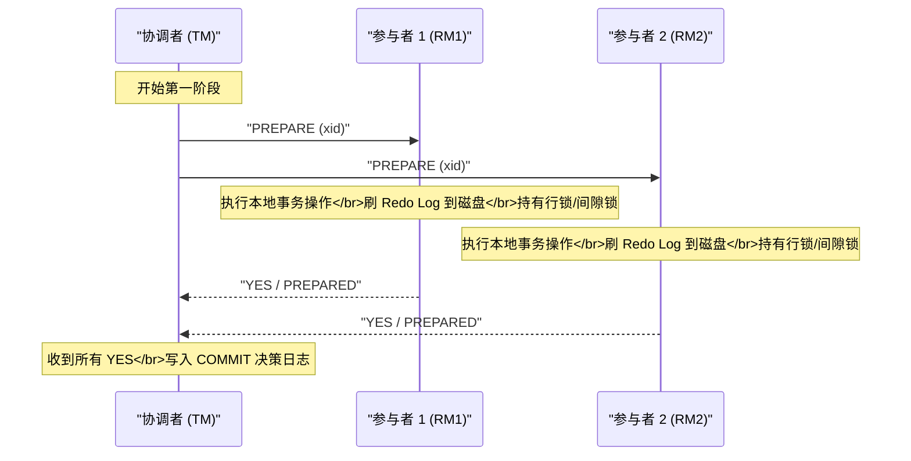
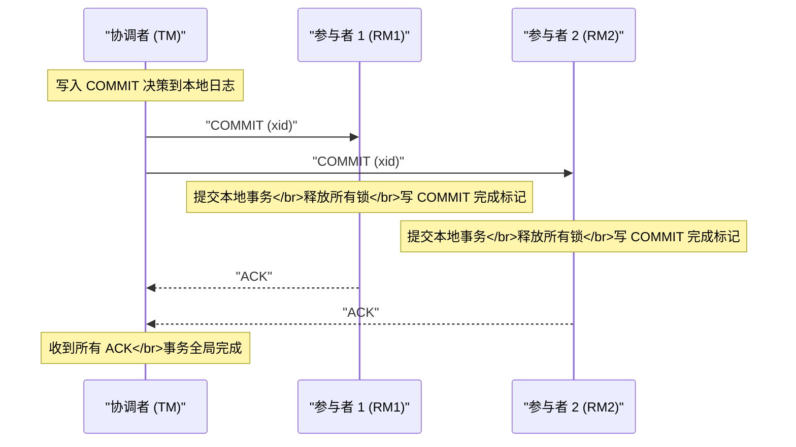
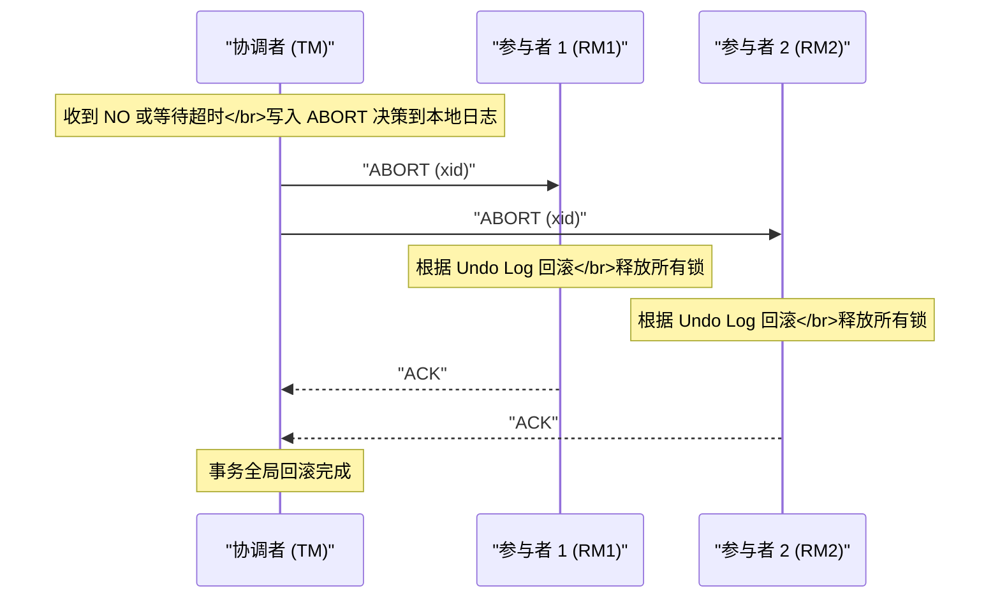
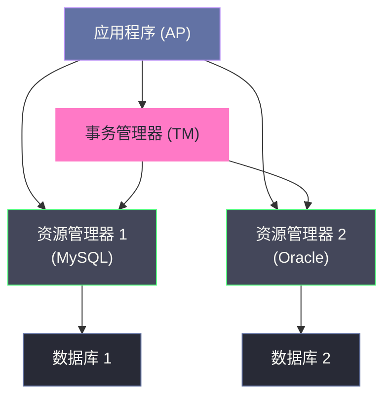

# 02 2PC 两阶段提交协议深度解析

**摘要：**

两阶段提交（Two-Phase Commit，2PC）是分布式事务领域历史最悠久、理论最成熟的强一致性协议，也是理解所有后继协议（3PC、Paxos、Raft）的基础起点。本文从 2PC 被发明的原始动机切入，完整呈现协议的两个阶段状态机；随后以"故障注入"的视角逐一剖析协调者崩溃、参与者崩溃、网络分区三类场景下协议的真实表现，深入揭示阻塞问题的根因；进而分析 XA 规范作为 2PC 标准化实现的架构，深入 MySQL InnoDB 的 XA 事务实现细节，包括 Prepare 阶段的 redo/undo log 刷盘机制与 xa_recover 的崩溃恢复流程；最后给出 2PC 的工程使用边界与生产踩坑总结。

---

## 第 1 章 2PC 的诞生背景：协调多节点提交的第一次尝试

### 1.1 问题的起点：为什么需要一个专门的提交协议

在 [[01 分布式事务的本质与挑战]] 中，我们已经建立了一个认知：分布式事务的原子性难以保证，根本原因在于参与事务的各节点无法通过网络通信达成"对结果的确定性共识"。

在 2PC 被提出之前，最朴素的分布式事务实现方式是"最后一个提交者"模式：应用程序逐一向各个数据库节点发送提交命令，只要有一个失败就尝试逐一回滚。这种做法存在显而易见的问题：

- **回滚成功性无法保证**：如果第 3 个节点的提交成功了，第 4 个节点失败了，应用程序去回滚第 3 个节点时，第 3 个节点可能已经崩溃，回滚指令无法送达。
- **中间状态对外可见**：在应用程序逐一提交的过程中，已提交节点的数据变更是立即对外可见的，其他并发事务可能读取到部分提交的数据。
- **没有明确的协调点**：没有任何节点知道全局事务的最终结果，每个节点只知道自己的本地状态。

1978 年，Jim Gray 在其里程碑式的论文《Notes on Data Base Operating Systems》中正式提出了两阶段提交协议，给出了在分布式环境中实现原子提交的第一个严格方案。

> [!info] Jim Gray 与 2PC 的历史地位
> Jim Gray 是数据库领域的传奇人物，1998 年图灵奖得主。他提出的 2PC 协议影响了此后数十年的分布式数据库设计。尽管 2PC 有诸多局限性，但它所建立的"协调者/参与者"架构模型至今仍是分布式事务领域的基础范式。

### 1.2 核心设计思想：先问能否提交，再统一决策

2PC 的核心思想可以用一句话概括：**在真正提交之前，先向所有参与者询问"你能提交吗"，只有全部确认可以，才统一发出提交指令。**

这个思想对应于现实中的"集体表决"机制。想象一个会议室里的投票场景：主席（协调者）在宣布决议之前，必须先收集所有与会者（参与者）的意见。如果所有人都同意，才宣布决议通过；只要有一个人反对，决议就取消。

2PC 将这个过程拆分为两个明确的阶段：
- **第一阶段（Prepare/表决阶段）**：协调者向所有参与者发送 PREPARE 消息，询问"你能提交吗？请做好准备并告诉我你的答案"。
- **第二阶段（Commit/执行阶段）**：协调者根据收集到的所有回复，决定提交或回滚，并将这个决定通知所有参与者执行。

这个设计有一个关键的隐含假设：**参与者在回复 YES（准备好提交）之后，必须保证自己无论如何都能在后续执行提交——它的本地数据已经以某种方式被"锁定"**。这意味着在 Prepare 阶段，参与者必须将事务的 redo log 刷新到持久化存储（磁盘），并持有相关资源的锁，直到收到协调者的最终指令。

---

## 第 2 章 协议的完整状态机：两个阶段的精确定义

### 2.1 角色定义

在 2PC 中，有两类参与角色：

**协调者（Coordinator / Transaction Manager，TM）**：
- 全局事务的发起者和决策者
- 负责向所有参与者发送 PREPARE 和 COMMIT/ABORT 指令
- 维护事务的全局状态（PREPARING → COMMITTING/ABORTING）
- 将事务状态持久化到本地日志（Transaction Log）

**参与者（Participant / Resource Manager，RM）**：
- 本地事务的执行者
- 负责响应协调者的 PREPARE 请求，并记录自己的本地状态
- 在收到 COMMIT/ABORT 后执行对应操作
- 维护本地事务状态（INIT → PREPARED → COMMITTED/ABORTED）

### 2.2 第一阶段：Prepare（准备/表决阶段）

第一阶段的目标是：**让每个参与者就"能否提交"这件事给出一个具有约束力的承诺**。



**参与者在 Prepare 阶段做了什么？**

这是理解 2PC 的关键。当参与者收到 PREPARE 请求时，它并非"口头答应"，而是必须完成以下实质性工作：

1. **执行本地事务的所有 SQL 操作**（如果尚未执行）
2. **将事务的 Undo Log 和 Redo Log 强制刷新到磁盘（fsync）**：这是"即使崩溃重启，也能恢复到这个状态"的保证
3. **持有事务涉及的所有行锁、间隙锁**：禁止其他事务修改这些数据，直到收到 COMMIT 或 ABORT
4. **向协调者回复 YES**：这个 YES 是一个具有约束力的承诺——从此刻起，参与者不能因为自身原因拒绝提交

> [!warning] Prepare 是最昂贵的操作
> 参与者在 Prepare 阶段要做的最昂贵操作是 **fsync**——强制将日志刷入磁盘。这是一个同步 I/O 操作，通常耗时 1~10ms。在高并发场景下，这个操作会成为显著的性能瓶颈。MySQL 为此提供了 `innodb_flush_log_at_trx_commit` 参数来权衡持久性与性能，但在 XA 事务中，Prepare 阶段的 fsync 是强制的，无法绕过。

如果参与者在执行 Prepare 过程中发现无法提交（如约束冲突、磁盘空间不足），它会回复 **NO**，协调者收到 NO 后立即进入 ABORT 流程。

### 2.3 第二阶段：Commit/Abort（提交/回滚执行阶段）

**路径 A：全部 YES → 提交**



**路径 B：任意 NO 或超时 → 回滚**



### 2.4 协议的核心不变量（Invariant）

理解 2PC 的行为，关键是牢记以下两条核心不变量：

**不变量 1（安全性）**：一旦任何参与者提交了事务，所有参与者最终都必须提交；一旦任何参与者回滚了事务，所有参与者最终都必须回滚。两种决策不能并存。

**不变量 2（参与者约束）**：参与者一旦回复了 YES（PREPARED），就不能单方面回滚事务，除非收到协调者的 ABORT 指令或等待超时触发了特定的超时策略（但标准 2PC 不支持超时单方面决策）。

这两条不变量合在一起，保证了 2PC 的正确性。但它们也埋下了 2PC 阻塞问题的根源——后文会详细分析。

---

## 第 3 章 故障分析：2PC 在各种异常场景下的真实行为

理解 2PC 的局限性，最好的方式是系统性地进行"故障注入"分析——在协议执行的每个时间点注入不同类型的故障，观察协议如何响应。

### 3.1 参与者在第一阶段崩溃

**场景**：协调者发出 PREPARE 后，参与者 P1 在执行本地操作过程中崩溃，没有回复。

**协议行为**：
- 协调者等待 P1 的回复，直到超时
- 超时后，协调者判定为 NO，进入 ABORT 流程
- 协调者向所有已回复 YES 的参与者发送 ABORT 指令
- 这些参与者根据 Undo Log 回滚本地事务，释放锁

**结论**：**安全，无数据一致性问题**。协调者此时尚未做出最终决策（还未写 COMMIT 日志），选择 ABORT 是安全的。P1 崩溃重启后，由于 Prepare 阶段的 Redo Log 尚未完全落盘（或未写入 PREPARED 标记），本地事务会被自动回滚。

> [!note] 超时时间的设置
> 第一阶段的等待超时是 2PC 能够在部分节点失联时仍能推进的关键机制。生产中，这个超时通常设置在 5~30 秒。时间过短可能导致网络抖动触发误判；时间过长会阻塞协调者的后续处理。

### 3.2 参与者在第二阶段崩溃（已回复 YES 后）

**场景**：所有参与者都回复了 YES，协调者写入了 COMMIT 日志，并向 P1 发送了 COMMIT 指令。P1 在收到 COMMIT 后、执行提交操作之前崩溃。

**协议行为**：
- P1 崩溃，无法确认提交
- 协调者收不到 P1 的 ACK
- 协调者**会持续重试向 P1 发送 COMMIT 指令**
- P1 重启后，检查本地事务日志：发现有一个处于 PREPARED 状态的事务，且该事务 ID 在协调者的日志中对应 COMMIT 决策
- P1 重新执行提交，向协调者发送 ACK

**结论**：**安全，最终一致**。这里的关键在于 P1 崩溃重启后能够根据本地的 PREPARED 状态"悬挂"在那里，等待协调者的重试指令。这正是 Prepare 阶段强制 fsync 的意义——它保证了 P1 即使崩溃重启，也知道自己处于 PREPARED 状态，进而知道不能单方面决定回滚。

### 3.3 协调者在第一阶段崩溃（发出 PREPARE 后）

**场景**：协调者向所有参与者发出 PREPARE 后立即崩溃，此时参与者们正在执行 Prepare 操作并等待发送回复。

**协议行为**：
- 参与者执行完 Prepare 操作，回复 YES，但协调者已崩溃，收不到回复
- 参与者处于 PREPARED 状态：锁被持有，资源被冻结
- **没有任何机制告诉参与者应该提交还是回滚**
- 参与者只能等待，直到协调者重启并恢复

**协调者重启后**：
- 检查本地日志，发现有一个事务处于 PREPARING 状态（尚未写入最终决策）
- 由于没有写入 COMMIT 日志，安全决策是 ABORT
- 重新向所有参与者发送 ABORT 指令

**结论**：**安全，但存在阻塞窗口**。从协调者崩溃到它重启恢复这段时间内，所有参与者都处于阻塞状态——它们持有锁、占用连接，但无法推进。这个阻塞时间等于协调者的故障恢复时间（MTTR），可能是几秒到几分钟不等。

### 3.4 协调者在第二阶段崩溃（最危险的场景）

**场景**：协调者收到所有 YES，写入 COMMIT 日志，向 P1 发送了 COMMIT 指令（P1 成功提交），然后协调者崩溃，P2 还没有收到 COMMIT 指令。

这是 2PC 最棘手的故障场景：

```
时间线：
[协调者] 写入 COMMIT 日志 → 向 P1 发送 COMMIT → P1 提交成功
[协调者] 崩溃！
[P2] 处于 PREPARED 状态，持有锁，等待指令
```

**协议行为**：
- P2 处于 PREPARED 状态，无法单方面决定提交或回滚
- **P2 阻塞，直到协调者重启**

**协调者重启后**：
- 检查本地日志，发现该事务有 COMMIT 决策记录
- 重新向 P2 发送 COMMIT 指令
- P2 提交，事务最终完成

**结论**：**最终安全，但阻塞时间不可控**。这个场景揭示了 2PC 阻塞问题的本质：**参与者在回复 YES 之后，完全失去了自主决策的能力，只能依赖协调者的指令才能推进**。如果协调者长时间不可用（崩溃、网络隔离），参与者的阻塞时间就是协调者的不可用时间。

### 3.5 网络分区场景：最难处理的情况

**场景**：第一阶段所有 YES 都到达了协调者，协调者写入 COMMIT 日志，但在发送 COMMIT 时，网络发生分区——P1 在一个分区，P2 在另一个分区，协调者在 P1 那边。

```
网络分区后：
分区 A：协调者 + P1（P1 成功收到 COMMIT 并提交）
分区 B：P2（处于 PREPARED 状态，阻塞等待）
```

**结果**：
- 分区 A 中的 P1 数据已经提交，对外可见
- 分区 B 中的 P2 阻塞，既不能提交，也不能回滚
- 如果 P2 的超时机制触发单方面回滚（标准 2PC 不允许，但某些实现会这么做），就会出现 **P1 提交、P2 回滚** 的数据不一致状态

> [!warning] 网络分区下的"脑裂"风险
> 这个场景暴露了 2PC 无法解决的根本问题：**在网络分区发生后，如果参与者无法联系到协调者，且允许参与者超时自决，则可能出现全局数据不一致**。标准 2PC 的应对方式是"永远等待"——参与者绝对不超时自决，但这以系统可用性为代价。

### 3.6 协调者永久故障：最坏情况

如果协调者在发出部分 COMMIT 指令后**永久故障**（磁盘损毁，无法恢复日志），那么：

- 部分参与者已提交，部分处于 PREPARED 状态
- 没有任何节点知道全局事务的决策
- 其他节点尝试向已提交的参与者查询事务状态，但该参与者只知道自己"提交了"，不知道这是全局决策还是只有自己提交

这种情况被称为 **不确定性（In-Doubt）事务**，是分布式系统中非常棘手的问题。解决方案包括：
1. 协调者部署高可用（主从切换），保证日志不丢失
2. 通过人工介入，查询各参与者状态后手动决策
3. 引入第三方仲裁节点（这正是 Paxos/Raft 的设计思路）

---

## 第 4 章 阻塞问题的本质：为什么 2PC 无法避免阻塞

### 4.1 从协议设计看阻塞的必然性

2PC 的阻塞问题不是实现缺陷，而是协议设计的**必然结果**。要理解这一点，需要回到协议的核心约束：

在第一阶段，参与者回复 YES 后，它放弃了单方面回滚的权利；但在第二阶段，它又必须等待协调者才能提交。这意味着**参与者在 PREPARED 状态下完全没有自主决策能力**。

为什么不能让参与者超时自决呢？

假设参与者 P2 处于 PREPARED 状态，等待超时后单方面回滚了事务。此时如果协调者实际上已经做出了 COMMIT 决策，并且 P1 也已经成功提交了，那么 P2 的单方面回滚就造成了不一致：P1 提交了，P2 回滚了。

**这个困境无法通过在协议内部增加超时机制来解决**，因为参与者不知道协调者的决策——它不知道自己回滚是不是安全的。这正是 2PC 协议的根本局限，由 [[FLP不可能定理]] 在理论上给出了证明。

### 4.2 持锁时间：吞吐量杀手

2PC 的阻塞不仅仅是"系统停顿"的问题，还带来了严重的性能影响：**参与者在整个 Prepare 到 Commit 的时间段内必须持有行锁**。

这段时间包括：
- 协调者收集所有参与者 YES 回复的网络往返时间（RTT）
- 协调者写入决策日志的 fsync 时间
- 协调者向所有参与者发送 COMMIT/ABORT 指令的网络往返时间

在局域网内，整个 2PC 流程的锁持有时间通常是 **5~20ms**。这听起来不长，但对于高并发的 OLTP 系统，持锁 10ms 意味着每个锁每秒只能支持约 100 个事务——这个吞吐量上限极低。

```
吞吐量上限 ≈ 1000ms / 锁持有时间(ms)
锁持有 10ms → 每行数据最多支持 100 TPS
锁持有 20ms → 每行数据最多支持 50 TPS
```

这是 2PC 不适合高并发 OLTP 场景的核心原因。

### 4.3 单点故障：协调者的脆弱性

在标准 2PC 中，协调者是一个单点。一旦协调者崩溃：

- 处于 PREPARED 状态的参与者永远阻塞
- 所有持有的锁不会释放
- 其他依赖这些资源的事务全部被阻塞

解决协调者单点问题的常见方案是**主备协调者**：将协调者的事务日志同步复制到备用节点，主协调者崩溃后备用节点接管，读取事务日志并继续推进未完成的事务。但这又引入了协调者主备切换的复杂性和延迟。

> [!note] MySQL 5.7+ 的改进
> MySQL 5.7 针对内部 XA（binlog 与 InnoDB 的协调）引入了组提交（Group Commit）优化，将多个并发事务的 Prepare fsync 操作合并为一次批量 fsync，显著降低了 I/O 压力。但对于外部 XA（跨数据库实例），这个优化无法适用。

---

## 第 5 章 XA 规范：2PC 的标准化接口

### 5.1 XA 是什么

**XA 规范**是 X/Open 组织（后并入 The Open Group）于 1991 年发布的分布式事务处理标准，全称为《Distributed Transaction Processing: The XA Specification》。它定义了在分布式系统中实现 2PC 协议的标准接口，让不同厂商的数据库、消息队列等资源管理器能够参与到同一个分布式事务中。

XA 规范定义了三个角色：
- **应用程序（AP，Application Program）**：事务的发起者，负责调用各个 RM 执行业务操作
- **事务管理器（TM，Transaction Manager）**：2PC 的协调者，负责协调全局事务的提交/回滚
- **资源管理器（RM，Resource Manager）**：2PC 的参与者，即数据库、消息队列等，负责执行本地事务



### 5.2 XA 接口定义

XA 规范定义了 RM 必须实现的接口（以 C 语言形式描述）：

```c
// TM 调用，通知 RM 开始一个新的事务分支
int xa_start(XID *xid, int rmid, long flags);

// TM 调用，结束事务分支的关联（标记 AP 已完成对 RM 的操作）
int xa_end(XID *xid, int rmid, long flags);

// TM 调用，请求 RM 进入 Prepared 状态（第一阶段）
int xa_prepare(XID *xid, int rmid, long flags);

// TM 调用，通知 RM 提交事务（第二阶段 - 提交路径）
int xa_commit(XID *xid, int rmid, long flags);

// TM 调用，通知 RM 回滚事务（第二阶段 - 回滚路径）
int xa_rollback(XID *xid, int rmid, long flags);

// TM 调用，查询 RM 中处于 Prepared 状态的事务（崩溃恢复使用）
int xa_recover(XID *xids, long count, int rmid, long flags);

// TM 调用，遗忘一个已 Heuristically Completed 的事务（处理悬挂事务）
int xa_forget(XID *xid, int rmid, long flags);
```

其中 `XID`（Transaction ID）是全局事务标识符，包含三个字段：
- `formatID`：XID 格式版本号
- `gtrid`（Global Transaction ID）：全局事务 ID，由 TM 生成，在整个分布式事务中唯一
- `bqual`（Branch Qualifier）：分支限定符，区分同一全局事务中不同的 RM 分支

### 5.3 MySQL 的 XA 事务实现

MySQL 从 5.0 版本开始在 InnoDB 存储引擎中支持 XA 协议。MySQL XA 事务分为两个层面：

**外部 XA**：跨多个 MySQL 实例（或与其他数据库）的分布式事务，应用程序或中间件作为 TM，MySQL 实例作为 RM。

**内部 XA**：MySQL 实例内部，InnoDB 存储引擎与 Binlog 之间的协调——每次写操作需要同时写入 InnoDB 的 Redo Log 和 MySQL 的 Binlog，这两者之间的一致性本身就是一个两阶段提交问题。

**MySQL 外部 XA 的 SQL 语法：**

```sql
-- 第一步：开启一个 XA 事务分支
XA START 'global_txn_id_001', 'branch_001';

-- 第二步：执行业务 SQL
UPDATE account SET balance = balance - 100 WHERE user_id = 'A';

-- 第三步：结束事务分支
XA END 'global_txn_id_001', 'branch_001';

-- 第四步：Prepare（第一阶段）
XA PREPARE 'global_txn_id_001', 'branch_001';

-- 第五步（由 TM 决策后执行）：提交或回滚
XA COMMIT 'global_txn_id_001', 'branch_001';
-- 或
XA ROLLBACK 'global_txn_id_001', 'branch_001';

-- 查询处于 PREPARED 状态的事务（崩溃恢复用）
XA RECOVER;
```

---

## 第 6 章 MySQL InnoDB XA 的底层实现机制

### 6.1 内部 XA：Binlog 与 InnoDB 的一致性挑战

理解 MySQL 的 XA 实现，必须先理解 MySQL 内部的一个根本性挑战：**Binlog 和 InnoDB Redo Log 是两个独立的日志系统，写入 MySQL 的每个事务需要同时保证这两个日志的一致性**。

为什么需要两个日志？

- **InnoDB Redo Log**：存储引擎级别的日志，用于 InnoDB 的崩溃恢复（ARIES 协议）。它只在本节点有意义。
- **MySQL Binlog**：Server 层的日志，记录所有数据变更，用于主从复制和时间点恢复（Point-In-Time Recovery）。它需要被传送到从库。

如果不协调这两个日志的写入顺序，可能出现：
- Redo Log 提交了，Binlog 没写成功 → 主库有数据，从库没有 → 主从不一致
- Binlog 写了，Redo Log 没提交 → 从库有数据，主库没有 → 主从不一致

MySQL 通过**内部 XA（Two-Phase Commit for binlog）**解决这个问题：

```
第一阶段（Prepare）：
  1. InnoDB 将事务 Redo Log 写入磁盘（fsync），标记状态为 PREPARED
  2. 此时事务处于"已准备但未提交"状态，崩溃重启后可以恢复

第二阶段（Commit）：
  1. MySQL Server 将事务写入 Binlog（fsync）
  2. InnoDB 将 Redo Log 中的事务标记为 COMMITTED
```

这个设计让 Binlog 成为了"裁判"：如果系统崩溃后恢复，MySQL 会以 Binlog 中的记录为准：
- Binlog 中有该事务 → InnoDB 提交该事务
- Binlog 中没有该事务 → InnoDB 回滚该事务（即使 Redo Log 已 Prepared）

### 6.2 Prepare 阶段的 Redo Log 刷盘细节

当 MySQL 执行 `XA PREPARE` 时，InnoDB 内部的核心操作链路如下：

```
XA PREPARE 执行流程：

1. 事务执行阶段（XA START 到 XA END）：
   - SQL 执行，修改 Buffer Pool 中的数据页
   - 生成 Undo Log（写入 Undo Tablespace）
   - 生成 Redo Log（写入 Redo Log Buffer）

2. XA PREPARE 调用时：
   a. 将 Redo Log Buffer 中该事务的日志记录写入 Redo Log 文件
   b. 执行 fsync，确保 Redo Log 刷入磁盘
   c. 在 Redo Log 中写入一条特殊的 "XA PREPARE" 标记
   d. 将事务状态从 ACTIVE 改为 PREPARED
   e. 持有该事务涉及的所有行锁，直到 COMMIT 或 ROLLBACK

3. 返回 OK 给 TM
```

在 MySQL 源码（`storage/innobase/trx/trx0trx.cc`）中，`trx_prepare_for_mysql` 函数负责处理 XA Prepare，其核心逻辑是调用 `trx_flush_log_if_needed` 触发 Redo Log 的强制刷盘：

```cpp
// 简化版核心逻辑（MySQL 8.0 源码）
dberr_t trx_prepare_for_mysql(trx_t *trx) {
    // 1. 标记事务状态为 PREPARED
    trx->state = TRX_STATE_PREPARED;
    
    // 2. 将 XA PREPARE 记录写入 Redo Log
    // 这条记录包含了 XID，用于崩溃恢复时识别 in-doubt 事务
    trx_prepare_low(trx, ...);
    
    // 3. 强制刷新 Redo Log（这是 Prepare 的性能瓶颈）
    // innodb_flush_log_at_trx_commit 参数在 XA Prepare 时被强制为 1
    log_write_up_to(*log_sys, trx->no, true);
    
    return DB_SUCCESS;
}
```

> [!warning] 生产踩坑：XA Prepare 无法绕过 fsync
> 在普通事务中，`innodb_flush_log_at_trx_commit=2` 可以让 Redo Log 先写入 OS Buffer 再异步刷盘，以牺牲少量持久性换取性能提升。但在 XA 事务的 Prepare 阶段，无论这个参数如何设置，InnoDB 都会强制执行 fsync——因为 Prepare 的承诺必须是持久的。这是 XA 事务比普通事务慢的根本原因之一。

### 6.3 xa_recover 与崩溃恢复机制

MySQL 崩溃重启后，InnoDB 的恢复流程会处理处于 PREPARED 状态的 XA 事务：

**步骤 1：InnoDB 日志恢复**
- 重放 Redo Log，将所有已写入日志的变更恢复到 Buffer Pool
- 对于 PREPARED 状态的事务，保留其 Undo Log 和行锁（不回滚，等待 TM 的指令）

**步骤 2：TM 执行 xa_recover**
- TM 在重启后，通过 `XA RECOVER` 命令查询 MySQL 中所有处于 PREPARED 状态的事务列表
- TM 对比自己的本地事务日志，对每个 PREPARED 事务做出决策：
  - 如果 TM 日志中有 COMMIT 记录 → 向 MySQL 发送 `XA COMMIT`
  - 如果 TM 日志中有 ABORT 记录 → 向 MySQL 发送 `XA ROLLBACK`
  - 如果 TM 日志中没有记录（TM 在写决策日志前崩溃）→ 发送 `XA ROLLBACK`（保守决策）

```sql
-- TM 重启后执行，查询 in-doubt 事务
XA RECOVER;
-- 输出示例：
-- +----------+--------------+--------------+--------------------+
-- | formatID | gtrid_length | bqual_length | data               |
-- +----------+--------------+--------------+--------------------+
-- |        1 |           10 |            6 | global_txn_id_001  |
-- +----------+--------------+--------------+--------------------+

-- TM 根据自己的日志决策后执行：
XA COMMIT 'global_txn_id_001', 'branch_001';
-- 或
XA ROLLBACK 'global_txn_id_001', 'branch_001';
```

> [!warning] 生产踩坑：悬挂的 XA 事务
> 如果 TM（通常是应用服务器）在崩溃重启后没有正确执行 xa_recover 流程（例如中间件配置错误、TM 日志损毁），MySQL 中处于 PREPARED 状态的事务会永远悬挂。这些事务持有行锁，阻塞所有访问相关行的后续操作，且不会自动超时释放（不同于普通事务的锁等待超时）。
>
> **发现悬挂 XA 事务的方法：**
> ```sql
> XA RECOVER;
> -- 如果这个查询返回记录，说明有悬挂的 XA 事务
> -- 可以手动决策：
> XA COMMIT 'xid' / XA ROLLBACK 'xid';
> ```
>
> **最佳实践：** 部署时务必配置 TM 的高可用，并在应用启动时自动执行 xa_recover 扫描和处理悬挂事务。

### 6.4 MySQL 内部 XA 与 Binlog 的组提交优化

MySQL 5.6 之前的内部 XA 实现有一个严重的性能问题：每个事务在 Prepare 阶段都需要独立执行一次 fsync，在高并发场景下，大量并发事务的 fsync 操作会打满磁盘 IOPS。

MySQL 5.6 引入了 **Binlog 组提交（Group Commit for Binary Log）**，5.7 进一步完善了**Redo Log 组提交**，通过将多个并发事务的日志操作合并，显著降低了 fsync 次数：

**优化前（MySQL 5.5）**：每个事务独立执行 Prepare fsync + Binlog fsync，N 个并发事务需要 2N 次 fsync。

**优化后（MySQL 5.6+）**：
- **Flush 阶段**：多个事务并发将 Binlog 写入 OS Buffer，积累成一批
- **Sync 阶段**：对这批 Binlog 执行一次 fsync
- **Commit 阶段**：多个事务按 binlog_order_commits 设定的顺序提交

N 个并发事务理论上可以压缩为 2 次 fsync（Redo Log 一次 + Binlog 一次），显著提升了高并发写入的吞吐量。

---

## 第 7 章 2PC 的工程边界与适用场景

### 7.1 2PC 的本质限制总结

经过深入分析，2PC 的局限性可以归纳为三点：

| 问题 | 根因 | 影响 |
| :--- | :--- | :--- |
| **同步阻塞** | 参与者在 PREPARED 状态无自主决策能力 | 故障期间所有参与者阻塞，锁不释放 |
| **单点故障** | 协调者是中心化决策节点 | 协调者崩溃导致全局事务无法推进 |
| **性能低** | Prepare 阶段强制 fsync + 持锁时间长 | 吞吐量低，不适合高并发场景 |
| **数据不确定性** | 协调者永久故障时 In-Doubt 事务无法自动决策 | 需要人工干预或第三方仲裁 |

### 7.2 什么场景适合使用 2PC/XA

尽管有这些限制，2PC/XA 在以下场景仍然是合理选择：

**（1）参与节点数量少（2~3 个）**：2PC 的阻塞时间与参与者数量成正比。节点越少，协议开销越小，故障影响范围越有限。

**（2）强一致性要求不可妥协**：对于金融核心系统（资金账务、清结算）、库存扣减等对数据一致性要求极高的场景，2PC 提供的强 ACID 保证无法被柔性事务替代。

**（3）参与节点支持 XA 协议且高可用**：当 RM 本身具备高可用部署（如 MySQL 主从切换），且 TM 也有主备保护时，2PC 的单点和阻塞问题可以被有效缓解。

**（4）低并发批处理场景**：批量对账、报表生成等低并发场景，对吞吐量要求不高，2PC 的性能劣势不明显，而其强一致性优势更突出。

### 7.3 不适合 2PC 的场景

- **高并发 OLTP**（如互联网电商下单、支付）：2PC 的持锁时间和 fsync 开销会严重限制吞吐量
- **微服务架构**：参与者众多，且各服务可能不支持 XA；网络拓扑复杂，故障概率高
- **跨语言/跨技术栈**：XA 规范主要面向关系型数据库，NoSQL、消息队列等对 XA 支持有限
- **对可用性要求高**：一旦协调者故障，所有相关事务阻塞，不可接受

### 7.4 生产建议：如何正确使用 MySQL XA

如果在生产中必须使用 MySQL XA，以下几点是重要的工程实践：

1. **TM 必须高可用**：使用主备 TM，TM 日志需要持久化。推荐使用 Seata-XA 模式或 Atomikos 等成熟中间件，而非自研 TM。

2. **应用启动时执行 xa_recover 扫描**：每次应用服务重启，必须调用 `XA RECOVER` 查询并处理 MySQL 中的悬挂事务，防止行锁泄漏。

3. **监控 XA RECOVER 返回结果**：将 `XA RECOVER` 的返回条数纳入监控告警，非零值意味着有悬挂事务需要人工介入。

4. **合理设置事务超时**：TM 层面设置合理的全局事务超时时间，超时的事务主动回滚，避免无限阻塞。

5. **避免 XA 事务跨越外部 HTTP 调用**：XA 事务的持锁时间内绝对不能进行任何外部 HTTP/RPC 调用——外部调用的延迟不可预测，会导致锁持有时间暴增。

> [!warning] 最常见的生产事故
> 笔者见过最多的 XA 事务生产事故，都是"XA 事务内部嵌套了 HTTP 调用"——开发者在 XA START 和 XA COMMIT 之间调用了一个耗时几百毫秒甚至几秒的外部接口。这导致 MySQL 行锁被持有数秒，阻塞了大量并发读写请求，引发连锁的慢查询和连接池耗尽。

---

## 第 8 章 2PC 的继承者：协议演进的方向

### 8.1 3PC：解决阻塞问题的尝试

3PC（Three-Phase Commit）在 2PC 基础上增加了一个 CanCommit 阶段，并引入了超时机制，试图在协调者故障时让参与者能够安全地做出自主决策。我们将在下一篇文章 [[03 3PC 三阶段提交与协议演进]] 中详细剖析 3PC 的设计思路及其仍然无法解决的问题。

### 8.2 Paxos/Raft：分布式共识的新路径

2PC 的根本问题是协调者单点——一旦协调者故障，协议就无法推进。[[Paxos]] 和 [[Raft]] 通过让"协调者角色"本身也变成分布式的来解决这个问题：只要多数派节点可用，协议就能推进。这是现代分布式数据库（[[TiDB]]、[[CockroachDB]]、[[Google Spanner]]）的基础。

### 8.3 TCC/Saga：业务层面的妥协

当强一致性不再是必需品，更多系统选择在业务层面进行妥协——通过 TCC 或 Saga 模式，以"最终一致性"替换"强一致性"，换取系统的高可用性和高并发能力。这也是后续专栏的重点内容。

---

## 参考资料

1. Gray, J. (1978). Notes on Data Base Operating Systems. *Operating Systems: An Advanced Course*, LNCS 60, 393–481.
2. Lampson, B., & Sturgis, H. (1979). Crash Recovery in a Distributed Data Storage System. Unpublished manuscript, Xerox PARC.
3. The Open Group. (1991). *Distributed Transaction Processing: The XA Specification*. X/Open Company Ltd.
4. Mohan, C., et al. (1992). ARIES: A Transaction Recovery Method Supporting Fine-Granularity Locking and Partial Rollbacks Using Write-Ahead Logging. *ACM TODS, 17*(1), 94–162.
5. MySQL 8.0 Reference Manual: XA Transactions. https://dev.mysql.com/doc/refman/8.0/en/xa.html
6. Bernstein, P. A., & Goodman, N. (1981). Concurrency Control in Distributed Database Systems. *ACM Computing Surveys, 13*(2), 185–221.
7. Tanenbaum, A. S., & Van Steen, M. (2007). *Distributed Systems: Principles and Paradigms* (2nd ed.). Prentice Hall.
