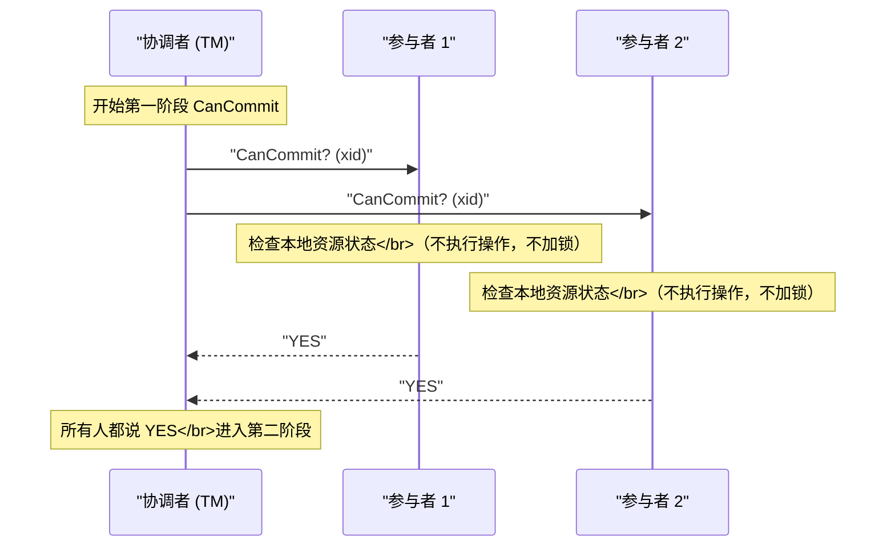
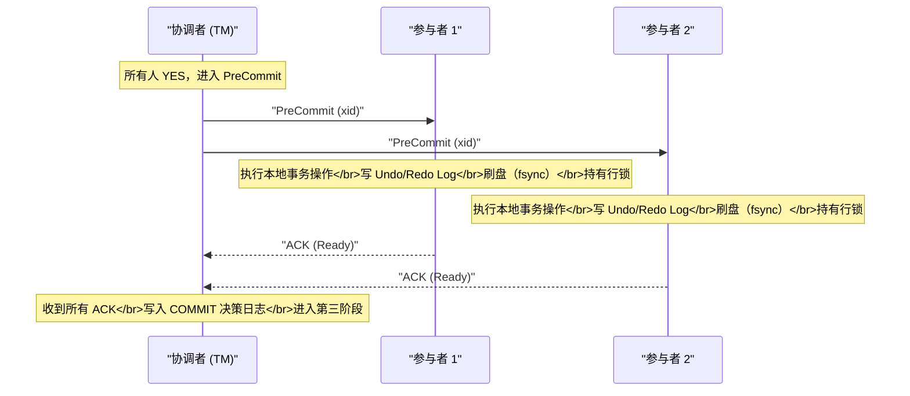
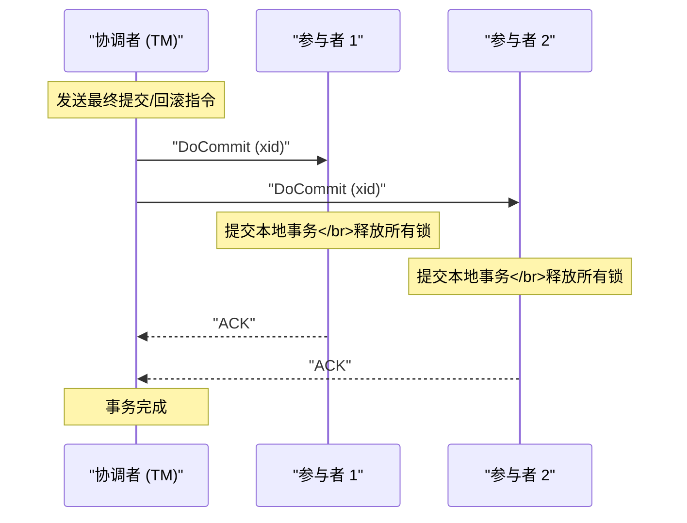
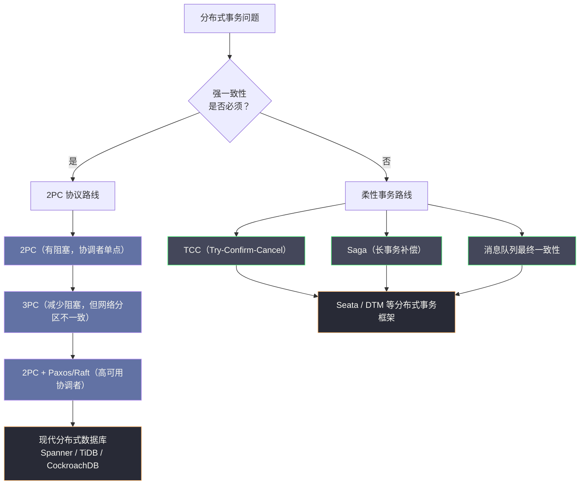

# 03 3PC 三阶段提交与协议演进

**摘要：**

三阶段提交（Three-Phase Commit，3PC）是对 2PC 阻塞问题的第一次严肃改良尝试。本文从 2PC 的阻塞根因切入，推导出 3PC 为何要引入第三个阶段 CanCommit，以及超时自决机制的设计逻辑；随后以同样的"故障注入"视角分析 3PC 在各类故障场景下的表现，揭示 3PC 虽然消除了大部分阻塞，却在网络分区场景下引入了新的数据不一致风险；最后从协议设计哲学的角度，梳理从 2PC 到 3PC 再到 Paxos/Raft 的演进脉络，解释为什么实际工程中 3PC 几乎没有落地，以及现代分布式系统选择了怎样的替代路径。

---

## 第 1 章 回顾：2PC 的阻塞问题究竟卡在哪里

在深入 3PC 之前，必须把 2PC 阻塞问题的根因精确地钉住——因为 3PC 的每一个设计决策，都是针对这个根因的直接回应。

### 1.1 参与者的困境：被剥夺的决策权

在 [[02 2PC 两阶段提交协议深度解析]] 中，我们详细分析了 2PC 的各类故障场景。其中最棘手的是这个：

> 参与者回复了 YES（进入 PREPARED 状态）后，协调者在发送 COMMIT/ABORT 指令过程中崩溃。此时参与者既不能单方面提交（万一协调者的决策是 ABORT），也不能单方面回滚（万一协调者的决策是 COMMIT，其他参与者已经提交了），只能死等。

这里的关键矛盾是：**参与者在回复 YES 的那一刻，就永久性地放弃了自主决策的权利，但获得最终决策的途径（协调者）却可能永久失联**。

用更形象的比喻：参与者就像一个签下了"我同意"的当事人，但协议书的最终内容要等另一方（协调者）填写。如果另一方失踪了，这个当事人被永远卡在"已同意但不知道具体结果"的状态。

### 1.2 根因分析：为什么不能超时自决

有人会问：为什么不给参与者加一个超时机制——等待协调者一段时间后，自行决定提交或回滚？

问题在于：**参与者在 PREPARED 状态下，无论选择超时提交还是超时回滚，都可能造成数据不一致**。

**如果超时后自行提交**：假设协调者的实际决策是 ABORT，另一个参与者已经根据 ABORT 指令回滚了。这时候这个参与者自行提交，就出现了"一个提交、一个回滚"的不一致。

**如果超时后自行回滚**：假设协调者的实际决策是 COMMIT，另一个参与者已经成功提交了。这时候这个参与者自行回滚，同样不一致。

参与者无法做出安全的自主决策，原因是它对全局状态一无所知——它不知道协调者究竟有没有做出决策，更不知道其他参与者的状态如何。

### 1.3 破局的关键洞察：让参与者能够互相询问

3PC 的设计者 Dale Skeen 在 1981 年的论文《Nonblocking Commit Protocols》中指出了破局的关键：

> **2PC 阻塞的根本原因是"信息不对称"——参与者在需要自主决策时，没有足够的信息来判断安全的决策方向。**

Skeen 的解决思路是：通过引入额外的协议阶段，让参与者在需要自主决策时，能够从以下两个维度获得足够信息：

1. **协调者是否已经做出了最终决策？**（如果协调者已决策但消息未送达，可以从其他参与者处查询）
2. **所有参与者是否都已经准备好提交？**（如果有任何参与者未准备好，则安全决策是回滚）

基于这两点洞察，3PC 的设计思路逐渐清晰：**在 PREPARE 阶段之前，增加一个"预备"阶段，使参与者能够在不锁定资源的情况下先探测所有参与者的意愿；同时引入超时机制，让参与者在协调者失联时能做出有依据的自主判断。**

---

## 第 2 章 3PC 协议的完整设计

### 2.1 三个阶段的定义

3PC 将 2PC 的两个阶段扩展为三个阶段：

| 阶段 | 名称 | 目的 |
| :--- | :--- | :--- |
| **Phase 1** | CanCommit | 询问参与者"你能提交吗"，但**不要求参与者锁定资源** |
| **Phase 2** | PreCommit | 通知参与者"准备提交"，参与者正式锁定资源并执行 Prepare 操作 |
| **Phase 3** | DoCommit | 通知参与者执行最终提交或回滚 |

与 2PC 的对比：

```
2PC：
  [Phase 1: Prepare]   → 锁资源 + 问能不能提交（合并在一步）
  [Phase 2: Commit]    → 执行提交/回滚

3PC：
  [Phase 1: CanCommit] → 只问能不能提交，不锁资源
  [Phase 2: PreCommit] → 确认所有人都能提交后，再锁资源 + Prepare
  [Phase 3: DoCommit]  → 执行提交/回滚
```

这个拆分的核心意图是：**在锁定任何资源之前，先确认所有参与者都有意愿提交**。如果有任何参与者在 CanCommit 阶段拒绝，协调者可以直接 ABORT，完全不需要锁定任何资源，也不会出现"部分参与者已锁资源"的麻烦状态。

### 2.2 第一阶段：CanCommit



**参与者在 CanCommit 阶段做什么？**

关键在于：**参与者在这个阶段只做意愿检查，不执行任何会改变状态的操作**。它可以检查：
- 当前是否有足够的系统资源（磁盘空间、内存）来执行这个事务？
- 当前的系统负载是否允许接受新的事务？
- 业务规则层面，这个事务有没有明显的冲突？

如果检查通过，回复 YES；否则回复 NO。

如果协调者收到任何 NO，或者等待超时（有参与者没有响应），直接 ABORT——此时什么资源都没有锁定，代价极低。

> [!note] CanCommit 的代价与价值
> CanCommit 阶段增加了一次网络往返（RTT），这看起来是额外的开销。但它带来的好处是：将"发现事务无法提交"的时机提前到资源锁定之前，避免了 2PC 中"先锁资源、后发现无法提交、再解锁"的浪费。在参与者本地检查失败率较高的场景，这个提前探测可以显著减少无效的资源锁定。

### 2.3 第二阶段：PreCommit

当协调者收到所有参与者的 YES 后，进入 PreCommit 阶段：



PreCommit 阶段与 2PC 的 Prepare 阶段在本地操作上基本相同：执行 SQL、写 Undo/Redo Log、fsync、持锁。本质区别在于：**PreCommit 是在"已知所有参与者都愿意提交"的前提下才发出的**——这个前提信息将在后续的超时自决中发挥关键作用。

> [!warning] 3PC 与 2PC 的重要区别：超时行为
> 在 2PC 中，参与者进入 PREPARED 状态后如果超时，**无法安全自决**；
> 在 3PC 中，参与者进入 PreCommit 状态（收到 PreCommit 指令）后如果超时，可以**安全地选择超时提交**——因为它知道所有参与者都已经通过了 CanCommit 检查，协调者在发出 PreCommit 时已经知晓所有人都同意提交，所以协调者的决策大概率是 COMMIT。

### 2.4 第三阶段：DoCommit



DoCommit 阶段与 2PC 的 Commit 阶段完全相同，不再赘述。

### 2.5 3PC 的超时自决规则

3PC 引入超时机制的核心在于：**在不同阶段设计不同的超时行为**，使参与者在协调者失联时能够基于自己所处的状态做出有依据的自主决策：

| 参与者当前状态 | 超时行为 | 理由 |
| :--- | :--- | :--- |
| **等待 CanCommit 响应** | 不适用（这是协调者的等待） | — |
| **等待 PreCommit 指令**（刚回复了 YES） | 超时后**回滚** | 不知道协调者是否收到了所有 YES；协调者可能已决定 ABORT |
| **已收到 PreCommit，等待 DoCommit 指令** | 超时后**提交** | 协调者在发出 PreCommit 时已确认所有参与者同意；大概率决策是 COMMIT |
| **等待 DoCommit 的 ACK**（这是协调者的等待） | 协调者持续重试 | — |

这套超时规则是 3PC 的核心创新，也是它与 2PC 最本质的区别。

---

## 第 3 章 故障分析：3PC 在各类场景下的表现

### 3.1 协调者在 CanCommit 后崩溃

**场景**：协调者发出 CanCommit 后崩溃，参与者等待 PreCommit 指令超时。

**协议行为**：
- 参与者处于"已回复 YES，等待 PreCommit"状态
- 超时触发，参与者根据超时规则执行**回滚**
- 协调者重启后，发现事务处于 CANCELING 状态，向所有参与者发送 ABORT（参与者已回滚，无害）

**结论**：**安全，无阻塞**。相比 2PC，这个场景不再阻塞——参与者能够自主超时回滚，无需等待协调者恢复。

### 3.2 协调者在 PreCommit 后崩溃

**场景**：协调者发出 PreCommit，所有参与者回复了 ACK，协调者写入 COMMIT 日志后崩溃，没有发出 DoCommit 指令。

**协议行为**：
- 参与者处于"已收到 PreCommit、等待 DoCommit"状态
- 超时触发，参与者根据超时规则执行**提交**

**结论**：**安全，无阻塞**。参与者超时自提交，事务最终完成。协调者重启后发现事务已被参与者提交，无需额外操作。

### 3.3 参与者在 PreCommit 后崩溃

**场景**：参与者 P2 在收到 PreCommit、执行 Prepare 操作过程中崩溃，没有回复 ACK。

**协议行为**：
- 协调者等待 P2 的 ACK 超时
- 协调者发出 ABORT 指令
- P1 收到 ABORT，回滚
- P2 重启后，发现有处于 PREPARED 状态的事务，通过 xa_recover 查询协调者，得知决策是 ABORT，执行回滚

**结论**：**安全**。

### 3.4 网络分区场景：3PC 的致命弱点

这是 3PC 最重要也是最复杂的故障场景，也是 3PC 在工程实践中几乎无法采用的根本原因。

**场景**：所有参与者都收到了 PreCommit 并回复了 ACK。协调者写入 COMMIT 日志，向 P1 和 P2 发出 DoCommit 指令。此时发生网络分区：
- **分区 A**：协调者 + P1（P1 成功收到 DoCommit 并提交）
- **分区 B**：P2（没有收到 DoCommit，等待超时）

```
时间线：
[P1] 收到 DoCommit → 提交事务 ✓
[网络分区发生]
[P2] 等待 DoCommit 超时...
[P2] 根据 3PC 规则：已收到 PreCommit → 超时后自行提交 ✓
```

这个场景下，**3PC 表现良好**——两个参与者都提交了，结果一致。

**但是，考虑另一个场景**：

**场景**：协调者收到了所有 CanCommit 的 YES。此时网络分区发生：
- **分区 A**：协调者（准备发 PreCommit，但被分区阻断）
- **分区 B**：P1 + P2（等待 PreCommit 超时）

```
时间线：
[协调者] 准备发 PreCommit，被分区阻断
[P1, P2] 等待 PreCommit 超时...
[P1, P2] 根据 3PC 规则：处于"已回复 YES，等待 PreCommit"状态 → 超时回滚
```

分区恢复后，协调者重试发送 PreCommit，但参与者已经回滚了。协调者最终只能 ABORT。这个场景也是安全的。

**真正危险的场景**：在 PreCommit 之后、DoCommit 之前，网络分区导致**部分参与者收到了 DoCommit，部分没有**，而没有收到 DoCommit 的参与者触发了超时自提交：

```
时间线：
[协调者] 发出 DoCommit 给 P1 ✓
[协调者] 准备发 DoCommit 给 P2，被分区阻断
[P1] 收到 DoCommit → 提交 ✓
[P2] 等待 DoCommit 超时，处于 PreCommit 状态 → 超时自提交 ✓
```

这个场景下两者都提交了，没有不一致。

**真正无解的场景**：

假设网络分区发生在 PreCommit 阶段，P2 没有收到 PreCommit（因而也没有回复 ACK），协调者一直等待 P2 的 ACK 超时，决定 ABORT：

```
[协调者] 发 PreCommit 给 P1 ✓（P1 回复 ACK）
[协调者] 发 PreCommit 给 P2，被分区阻断
[协调者] 等待 P2 的 ACK 超时 → 决定 ABORT
[协调者] 向 P1 发送 ABORT，P1 回滚

此时新协调者选出（假设原协调者崩溃）：
[新协调者] 无法联系到原协调者，询问参与者状态
[P1] 状态：已 ABORT（因为收到了 ABORT 指令）
[P2] 状态：处于"已回复 CanCommit YES，等待 PreCommit"状态

[P2 超时规则] 此时 P2 如果超时，应该 ABORT → 安全，一致
```

但如果换一种时序，P1 收到了 PreCommit 并回复了 ACK，P2 也收到了 PreCommit 并回复了 ACK，然后：

```
[协调者] 收到所有 ACK，写 COMMIT 日志，向 P1 发 DoCommit ✓
[P1] 收到 DoCommit → 提交 ✓
[协调者崩溃]
[P2] 等待 DoCommit 超时，处于 PreCommit 状态 → 超时自提交 ✓
```

两者都提交，安全。

**真正有问题的场景**：网络分区使部分参与者处于不同阶段，且超时行为指向不同决策：

```
分区发生时刻：PreCommit 只发到了 P1，P2 尚未收到

[P1] 状态：已收到 PreCommit，等待 DoCommit → 超时后会自行提交
[P2] 状态：已回复 CanCommit YES，等待 PreCommit → 超时后会自行回滚

结果：P1 提交，P2 回滚 → 数据不一致！
```

> [!warning] 3PC 在网络分区下的不一致风险
> 上面这个场景揭示了 3PC 的根本缺陷：**当网络分区导致不同参与者处于不同的协议阶段时，它们各自的超时规则可能指向相反的决策方向——P1 超时提交，P2 超时回滚——从而造成全局数据不一致。**
>
> 2PC 通过"永远阻塞"来避免了这个问题；3PC 通过"允许超时自决"消除了阻塞，但付出的代价是在特定网络分区场景下可能出现数据不一致。
>
> 这是一个典型的 CAP 权衡：2PC 选择了 CP（一致性优先，牺牲可用性）；3PC 试图同时拥有 CA（既不阻塞，又保持一致），但在 P（网络分区）存在的情况下，这是做不到的。

---

## 第 4 章 2PC vs 3PC：一个清醒的横向比较

### 4.1 协议特性对比

| 维度 | 2PC | 3PC |
| :--- | :--- | :--- |
| **协议阶段数** | 2 | 3 |
| **网络往返次数** | 2 RTT | 3 RTT |
| **协调者崩溃后阻塞** | 是（参与者永久阻塞）| 否（参与者超时自决）|
| **参与者超时自决** | 不支持（会导致不一致）| 支持（基于阶段判断方向）|
| **网络分区下的一致性** | 保证（代价是阻塞）| 不保证（特定场景下不一致）|
| **消息复杂度** | O(n) 每阶段 | O(n) 每阶段（但多一个阶段）|
| **性能** | 较低（2 RTT + 强制 fsync）| 更低（3 RTT + 强制 fsync）|
| **工程落地** | 广泛（XA 标准、各类中间件）| 极少（几乎无生产落地）|

### 4.2 3PC 解决了什么，没解决什么

**3PC 解决了**：
- 协调者崩溃后参与者的无限阻塞问题（通过超时自决）
- "参与者不知道协调者是否已决策"的信息不对称问题（通过 CanCommit 阶段的信息共享）

**3PC 没有解决**：
- 网络分区下的数据一致性问题（这是 CAP 定理决定的，无法在保持 AP 的同时保证 C）
- 协调者单点问题（仍然依赖协调者做最终决策）
- 性能问题（增加了一个阶段，消息往返更多）
- XA 规范的约束（工业界没有广泛采用 3PC 的标准接口）

### 4.3 为什么 3PC 在工程界几乎没有落地

3PC 在理论上是 2PC 的改进，但在实际工程中几乎找不到真正的生产落地案例，原因是多方面的：

**（1）代价高于收益**：多一个阶段意味着多一次网络往返，对于已经很昂贵的分布式事务，这个额外开销在大多数场景下超过了"减少阻塞"带来的收益。

**（2）网络分区的不一致风险难以接受**：在金融等强一致性场景，"宁可阻塞也不要不一致"是无条件的工程准则。3PC 的超时提交在网络分区场景下可能导致的不一致，让这类场景的工程师完全无法接受。

**（3）更好的替代方案出现了**：在 3PC 被提出后不久，Paxos 算法（1989 年）给出了一个更彻底的解决方案——通过让协调者角色本身也分布化（多数派决策）来根本解决单点问题，同时在保证安全性（不一致不会发生）的前提下，提供比 2PC 更好的可用性。

**（4）没有形成标准**：XA 规范只定义了 2PC 的接口，没有 3PC 的对应标准。各数据库厂商也没有动力实现一个复杂度更高、性能更差、且有一致性风险的协议。

> [!note] 3PC 的历史价值
> 尽管 3PC 在工程上几乎没有落地，但它的理论价值不可低估。Skeen 的论文首次从信息论角度严格分析了分布式提交协议的阻塞性，证明了"完全非阻塞的原子提交协议"在异步网络下不可能同时保证安全性，为后续的 Paxos、Raft 等协议设计提供了重要的理论基础。

---

## 第 5 章 协议演进的视角：从 2PC 到现代分布式共识

### 5.1 2PC 与分布式共识的关系

从更高的视角看，2PC 本质上是一个**原子提交协议（Atomic Commitment Protocol）**，而不是一个**分布式共识协议（Distributed Consensus Protocol）**。

这两者的目标看起来相似，但有一个关键区别：

- **原子提交协议**：所有参与者必须对事务的提交/回滚达成一致，且如果任何参与者投票 NO，最终决策必须是 ABORT。**参与者有否决权。**
- **分布式共识协议**：一组节点对某个值达成一致，任何节点都可以提出值，最终只要多数派同意即可。**没有否决权，少数服从多数。**

这个区别导致了 2PC 无法用 Paxos 直接替换——因为 2PC 需要保证"任何一个参与者的 NO 都能导致 ABORT"，而 Paxos 是多数派决策。

但是，2PC 中的协调者单点问题，可以通过在协调者层面引入 Paxos/Raft 来解决——即让"协调者"本身变成一个高可用的 Paxos/Raft 集群，这正是 [[Google Spanner]] 等现代分布式数据库的设计思路。

### 5.2 Paxos：解决协调者单点的正确路径

[[Paxos]] 算法由 Leslie Lamport 于 1989 年提出（论文 1998 年正式发表），它解决的问题是：**在一个可能有节点故障和消息丢失的异步网络中，如何让多个节点对一个值达成一致？**

Paxos 的核心思想是**多数派（Quorum）**：只要参与共识的节点中有多数派（超过半数）能够通信，共识就能达成。少数节点的故障不会阻塞协议的推进。

这直接解决了 2PC 的协调者单点问题：将协调者替换为一个 Paxos 集群（通常 3 或 5 个节点），只要多数派节点存活，协调者就不会失去决策能力，也就不会导致参与者无限阻塞。

### 5.3 Raft：Paxos 的工程化实现

[[Raft]] 由 Diego Ongaro 和 John Ousterhout 于 2014 年提出，目标是提供一个与 Paxos 等价但更易理解和实现的共识算法。

Raft 将共识问题拆分为三个相对独立的子问题：
1. **Leader 选举**：集群中始终只有一个 Leader，处理所有写请求
2. **日志复制**：Leader 将日志复制到所有 Follower，多数派确认后即提交
3. **安全性**：保证任意时刻所有节点的日志都保持一致性

Raft 在工程实践中被广泛采用：[[etcd]]、[[TiKV]]、[[CockroachDB]] 等分布式系统都以 Raft 为底层一致性保障。

### 5.4 现代分布式数据库的协议选择

下表梳理了不同现代分布式数据库的事务协议选型：

| 系统 | 分布式事务协议 | 一致性保证 | 特点 |
| :--- | :--- | :--- | :--- |
| **[[Google Spanner]]** | 2PC + Paxos（协调者高可用）| 外部一致性 | TrueTime API 提供全球时钟，全球强一致 |
| **[[TiDB]]** | 2PC + Raft（TiKV 层）| 快照隔离（SI）| Percolator 模型，乐观锁 |
| **[[CockroachDB]]** | 2PC + Raft | 可串行化（SSI）| 无中心协调者，每个 Range 有 Raft 组 |
| **[[YugabyteDB]]** | 2PC + Raft | 可串行化 | 基于 DocDB，支持 PostgreSQL 协议 |
| **[[OceanBase]]** | 2PC + Paxos（Paxos 日志同步）| 强一致 | Multi-Paxos，分布式日志 |

这些现代系统都没有采用 3PC，而是选择了**2PC + 分布式共识（Paxos/Raft）**的组合：用 2PC 保证跨节点事务的原子性，用 Paxos/Raft 保证参与节点（特别是协调者）本身的高可用性。这是目前工程界解决分布式事务问题的主流路径。

### 5.5 从强一致到柔性事务：另一条演进路线

与"让 2PC 变得更高可用"的路线并行，还有另一条演进路线：**从根本上放弃强一致性，转向柔性事务**。

这条路线的核心逻辑是：对于大量互联网业务场景，强一致性的代价（持锁、阻塞、低吞吐）远超业务实际需要。很多业务场景只需要最终一致性——允许短暂的不一致窗口，但最终必须收敛到正确状态。

这条路线催生了 TCC、Saga、消息队列事务等柔性事务方案，我们将在后续文章中逐一深入探讨。



---

## 第 6 章 小结：3PC 告诉我们什么

3PC 在学术上是一次有意义的尝试，它的价值在于：

**（1）明确了 2PC 阻塞的根因**：信息不对称，而非协议本身的设计失误。这个洞察是后续所有改进方案的基础。

**（2）证明了"部分非阻塞"是可能的**：通过引入 CanCommit 阶段，3PC 确实在大多数非网络分区场景下消除了阻塞。

**（3）揭示了 CAP 的工程现实**：3PC 在网络分区场景下引入的不一致风险，是对 CAP 定理的一次具体诠释——你不可能在保持 AP 的同时，在所有场景下都保证 C。

**（4）指明了正确的演进方向**：强一致性的正确路径不是修补 2PC，而是解决协调者单点——这个认知直接导向了 Paxos/Raft 等分布式共识算法的实用化。

从 2PC 到 3PC 的演进，是分布式系统研究史上一次经典的"发现问题 → 提出改进 → 发现新问题 → 寻找更根本的解法"的迭代过程。理解这个过程，比记住 3PC 的协议细节更有工程价值。

在下一篇文章 [[04 TCC 柔性事务模型原理与实践]] 中，我们将转换视角，离开"强一致性"的路线，进入柔性事务的领域，看看 TCC 如何通过重新定义"事务边界"来绕过 2PC 的所有困难。

---

## 参考资料

1. Skeen, D. (1981). Nonblocking Commit Protocols. *Proceedings of the 1981 ACM SIGMOD International Conference on Management of Data*, 133–142.
2. Gray, J., & Lamport, L. (2006). Consensus on Transaction Commit. *ACM TODS, 31*(1), 133–160.
3. Fischer, M. J., Lynch, N. A., & Paterson, M. S. (1985). Impossibility of distributed consensus with one faulty process. *Journal of the ACM, 32*(2), 374–382.
4. Lamport, L. (1998). The Part-Time Parliament. *ACM TODS, 16*(2), 133–169.
5. Ongaro, D., & Ousterhout, J. (2014). In Search of an Understandable Consensus Algorithm. *USENIX ATC 2014*, 305–319.
6. Corbett, J. C., et al. (2012). Spanner: Google's Globally Distributed Database. *OSDI 2012*.
7. Bernstein, P. A., Hadzilacos, V., & Goodman, N. (1987). *Concurrency Control and Recovery in Database Systems*. Addison-Wesley.

---

> [!note] 思考题
> 1. TCC 将事务拆分为 Try（预留资源）→ Confirm（确认提交）→ Cancel（回滚释放）三个业务操作。与 2PC 的技术层面补偿不同，TCC 是业务层面的补偿——需要业务开发者实现三个接口。在'转账'场景中，Try 阶段冻结余额、Confirm 阶段扣减余额、Cancel 阶段解冻余额。如果 Confirm 失败但 Try 已成功——协调者如何保证最终要么 Confirm 要么 Cancel？
> 2. TCC 的幂等性要求——Confirm 和 Cancel 可能被重试多次（如网络超时后重试）。如果 Confirm 被执行两次——余额被扣减两次。你如何在 Confirm 和 Cancel 中实现幂等（如使用事务 ID 去重）？
> 3. TCC 的空回滚和悬挂问题——如果 Try 因网络原因未到达参与者但协调者已超时触发 Cancel，参与者收到 Cancel 但没有对应的 Try（空回滚）。之后 Try 延迟到达——但事务已经 Cancel 了（悬挂）。你如何通过'事务状态表'来防止空回滚和悬挂？
