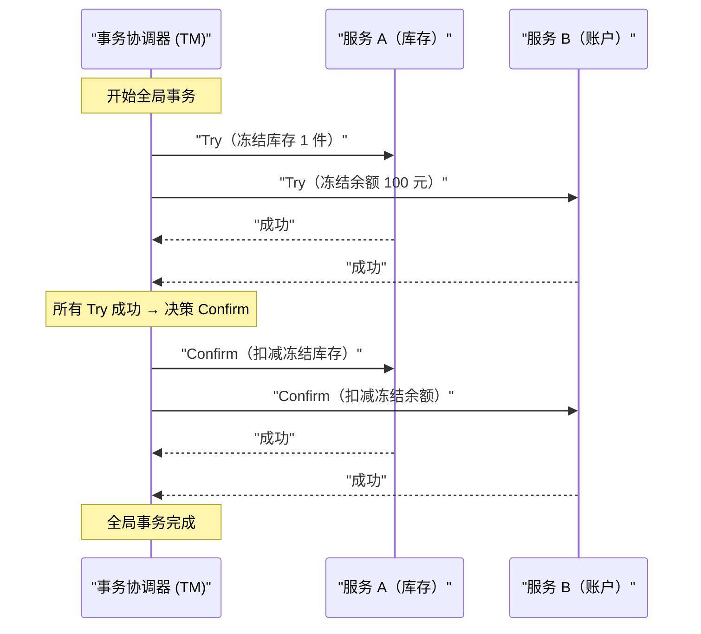
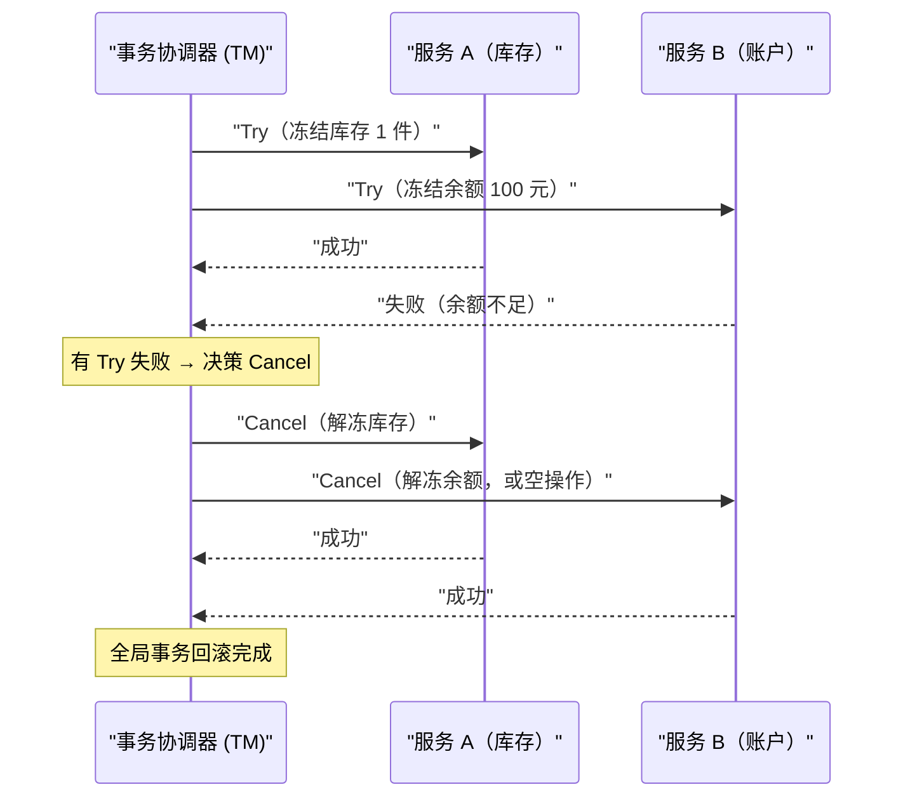

# 04 TCC 柔性事务模型原理与实践

**摘要：**

TCC（Try-Confirm-Cancel）是目前互联网业务中应用最广泛的分布式事务解决方案之一。它不依赖数据库的 XA 协议，而是将事务的提交与回滚语义下沉到业务代码层面，通过"资源预留 → 确认执行 → 取消回滚"三个阶段实现分布式事务的最终一致性。本文从 TCC 被发明的动机切入，深入剖析 Try/Confirm/Cancel 三个阶段的语义边界；重点解析 TCC 实践中最棘手的三类工程问题——幂等性设计、空回滚（Empty Rollback）与悬挂（Suspension）；并通过电商库存扣减的完整案例，展示 TCC 在生产环境中的落地要点。最后对比 TCC 与 2PC 的本质差异，给出 TCC 的适用边界。

---

## 第 1 章 TCC 的诞生：从 2PC 的困境寻找出路

### 1.1 2PC 的三个核心痛点在微服务时代被放大

在讲 TCC 之前，先回顾一下促使 TCC 被发明的历史背景。

2PC 在设计上有三个根本性的约束，在传统单体应用时代或许尚可接受，但在微服务架构爆发之后，这三个约束变成了难以忍受的障碍：

**约束一：所有参与者必须支持 XA 协议**

XA 规范主要面向关系型数据库，而微服务架构中，一个分布式事务的参与者可能包括：MySQL 数据库、Redis 缓存、Kafka 消息队列、甚至是另一个微服务的 HTTP 接口。Redis 不支持 XA，Kafka 不支持 XA，HTTP 接口更不支持 XA。2PC 在这种异构环境下根本无从施展。

**约束二：持锁时间长，高并发场景吞吐量低**

2PC 的 Prepare 阶段开始到 Commit 阶段结束，参与者必须持有行锁。整个流程包含至少 2 次网络往返，在微服务化的系统中，这个往返延迟通常在几十毫秒量级——意味着热点数据的锁竞争会严重限制吞吐量。

**约束三：业务逻辑与事务协议强耦合**

在 XA 事务中，应用程序需要直接参与协议状态的管理（XA START、XA PREPARE、XA COMMIT）。这要求业务代码对数据库连接和事务状态有精细的控制，与通常的 ORM 框架（Hibernate、MyBatis）的抽象层次不兼容，实际开发体验极差。

### 1.2 TCC 的核心洞察：把事务语义交还给业务

2000 年，Pat Helland 在 Microsoft 发表了一篇名为《Life beyond Distributed Transactions: an Apostate's Opinion》的论文（在分布式事务领域被戏称为"异教徒的意见"）。这篇论文影响深远，核心观点是：

> **对于大规模分布式系统，我们不应该试图用事务来"掩盖"分布式的复杂性，而应该让业务逻辑本身具备处理不一致状态的能力。**

这个思想与 2008 年 eBay 架构师 Dan Pritchett 提出的 BASE 理论高度吻合。在这个背景下，TCC 模式逐渐从实践中浮现——它不是某一篇论文的产物，而是业界工程师在解决实际问题过程中总结出来的模式，后来被 Atomikos 等中间件厂商和学术界（Parisa Kordi 等）正式化为"TCC"这个术语。

TCC 的核心洞察是：**数据库级别的原子性（通过 XA 锁定资源）可以被业务级别的原子性（通过资源预留 + 补偿操作）所替代**。这两者的语义不完全相同，但对于大量业务场景而言，业务级别的原子性已经足够。

---

## 第 2 章 TCC 的三阶段语义：精确定义每个阶段的职责

### 2.1 整体流程概览

TCC 将一个分布式事务拆分为三个阶段，每个阶段对应业务层的一个接口：



如果任何一个 Try 失败：



### 2.2 Try 阶段：资源预留，而非直接提交

Try 阶段是 TCC 最核心、也是设计难度最高的阶段。

**Try 阶段的本质语义**：检查业务约束是否满足，并对后续操作需要的资源进行**预留（Reserve）**，但**不做最终的业务操作**。

这里的"资源预留"是理解 TCC 的关键。与 2PC 的 Prepare 阶段通过数据库行锁来锁定资源不同，TCC 的 Try 阶段通过**业务语义上的冻结**来预留资源——这需要业务数据模型的配合。

以电商库存扣减为例：

**2PC 的做法（数据库层面锁定）**：
```sql
-- Prepare 阶段：直接扣减，依赖数据库行锁
UPDATE inventory SET stock = stock - 1 WHERE product_id = 'P001';
-- 数据库在此期间持有行锁，直到 COMMIT
```

**TCC 的做法（业务层面预留）**：
```sql
-- Try 阶段：不直接扣减，而是将库存从"可用"移入"冻结"
UPDATE inventory 
SET available_stock = available_stock - 1,
    frozen_stock = frozen_stock + 1
WHERE product_id = 'P001' 
  AND available_stock >= 1;  -- 检查资源是否充足

-- 此时：available_stock 减少了，但 total_stock 不变
-- frozen_stock 代表"已预留给某个进行中事务的库存"
```

这个设计将"资源锁定"从数据库层面的行锁，转移到了业务层面的字段状态——`frozen_stock` 字段代替了数据库行锁，扮演了"已预留"的语义。

> [!note] 业务字段冻结 vs 数据库行锁的关键区别
> 数据库行锁会阻塞其他事务的读写，且会随着持有时间增长而拖累系统性能；而业务字段冻结（`frozen_stock`）不阻塞任何操作，其他事务可以读取库存状态，只是需要判断 `available_stock` 而不是 `total_stock`。这是 TCC 高并发性能的来源之一。

**Try 阶段必须做到的事情**：
1. **完整性检查（Feasibility Check）**：验证所有业务约束（余额是否充足、库存是否足够、权限是否满足）
2. **资源预留（Resource Reservation）**：将资源从"可用"状态转为"预留"状态
3. **幂等性保证**：如果同一 Try 被重复调用（网络重试），结果必须一致（后文详述）

**Try 阶段不能做的事情**：
- 不能直接执行不可逆的最终业务操作（如发送短信通知、调用外部支付接口）
- 不能在 Try 阶段就修改用户可见的核心数据状态（如直接扣减可用余额）

### 2.3 Confirm 阶段：执行真正的业务操作

当所有参与服务的 Try 都成功后，协调器发出 Confirm 指令。

**Confirm 阶段的本质语义**：基于 Try 阶段已预留的资源，执行真正的业务操作，**完成资源的最终转移**。

继续库存扣减的例子：

```sql
-- Confirm 阶段：将冻结的库存正式扣减
UPDATE inventory 
SET frozen_stock = frozen_stock - 1,
    total_stock = total_stock - 1
WHERE product_id = 'P001'
  AND frozen_stock >= 1;

-- 此时：total_stock 真正减少，frozen_stock 归还为 0
-- 库存已被最终扣减，事务完成
```

**Confirm 阶段的设计要点**：

1. **Confirm 操作必须是幂等的**：协调器会在 Confirm 失败时持续重试，直到成功。因此 Confirm 操作必须能够被安全地重复执行。

2. **Confirm 操作不应该失败**：如果 Try 阶段已经验证了所有约束并预留了资源，Confirm 阶段在正常情况下不应该失败（因为资源已经被预留了，不会被其他事务占用）。Confirm 阶段的失败通常只来自于技术原因（网络超时、服务宕机），而非业务逻辑失败。这是 TCC 区别于 2PC 的一个重要隐含假设。

3. **Confirm 操作是最终不可逆的**：Confirm 完成后，事务就彻底提交了，无法再通过业务手段撤销（只能通过新的业务操作，如退款、退货来弥补）。

### 2.4 Cancel 阶段：通过业务补偿实现回滚

当任何参与服务的 Try 失败，或者事务协调器决定回滚时，向所有已成功执行 Try 的服务发出 Cancel 指令。

**Cancel 阶段的本质语义**：释放 Try 阶段预留的资源，将资源从"预留"状态恢复到"可用"状态。

```sql
-- Cancel 阶段：将冻结的库存解冻，归还给可用库存
UPDATE inventory 
SET available_stock = available_stock + 1,
    frozen_stock = frozen_stock - 1
WHERE product_id = 'P001'
  AND frozen_stock >= 1;
```

**Cancel 阶段的设计要点**：

1. **Cancel 操作必须是幂等的**：与 Confirm 一样，协调器会重试直到成功，因此必须支持幂等。

2. **Cancel 操作必须处理"空回滚"场景**：Cancel 可能在 Try 根本没有执行的情况下被调用（原因后文详述），此时 Cancel 必须能够安全地处理这种情况而不报错。

3. **Cancel 是"业务级补偿"而非"数据库级回滚"**：数据库 ROLLBACK 是物理撤销，好像那些操作从未发生；TCC 的 Cancel 是语义补偿，是一个新的业务操作，它的执行记录会留在数据库中（有 Cancel 操作的日志）。

---

## 第 3 章 TCC 的三大工程难题：幂等、空回滚、悬挂

TCC 的概念看起来简单，但在工程落地时，有三个问题如果处理不好，会导致数据错乱，是 TCC 实践中最容易踩的坑。

### 3.1 幂等性：网络重试的必然要求

**什么是幂等性**

在分布式系统中，由于网络不可靠，消息可能丢失，调用方通常会在超时后进行重试。幂等性（Idempotency）要求：**同一个操作，无论执行一次还是执行多次，最终结果与执行一次相同**。

**为什么 TCC 的三个阶段都必须幂等**

TCC 的协调器在以下情况会发出重试：
- Try 请求网络超时，无法确认是否成功 → 重试 Try
- Confirm 请求网络超时 → 重试 Confirm
- Cancel 请求网络超时 → 重试 Cancel

对于 Confirm 阶段，重复执行的危险是显而易见的：

```sql
-- 如果 Confirm 不幂等，重复执行会造成超额扣减
-- 第一次执行 Confirm：total_stock = 100 → 99
-- 第二次执行 Confirm（重试）：total_stock = 99 → 98  ← 错误！
UPDATE inventory 
SET total_stock = total_stock - 1
WHERE product_id = 'P001';
```

**幂等性的实现方案**

最常见的幂等性实现方案是**幂等控制表（Idempotency Table）**：

**方案一：事务记录表 + 唯一约束**

```sql
-- 创建 TCC 事务记录表
CREATE TABLE tcc_transaction_record (
    xid          VARCHAR(64) NOT NULL COMMENT '全局事务 ID',
    branch_id    VARCHAR(64) NOT NULL COMMENT '分支事务 ID',
    action       VARCHAR(16) NOT NULL COMMENT 'TRY/CONFIRM/CANCEL',
    status       VARCHAR(16) NOT NULL COMMENT 'PROCESSING/SUCCESS/FAILED',
    created_at   DATETIME    NOT NULL,
    updated_at   DATETIME    NOT NULL,
    PRIMARY KEY (xid, branch_id, action),  -- 唯一约束，重复执行会失败
    INDEX idx_xid (xid)
);
```

执行 Confirm 前，先插入一条记录（利用唯一约束保证幂等）：

```java
// 伪代码：幂等 Confirm 执行逻辑
public boolean confirm(String xid, String branchId) {
    try {
        // 1. 尝试插入事务记录（利用唯一约束）
        insertRecord(xid, branchId, "CONFIRM", "PROCESSING");
    } catch (DuplicateKeyException e) {
        // 已存在记录，说明这是重复调用
        String existingStatus = queryStatus(xid, branchId, "CONFIRM");
        if ("SUCCESS".equals(existingStatus)) {
            return true;  // 之前已经成功了，直接返回成功
        }
        // 如果是 PROCESSING，说明上次执行还没完成，继续执行
    }
    
    // 2. 执行业务操作
    deductFrozenStock(xid, branchId);
    
    // 3. 更新状态为成功
    updateStatus(xid, branchId, "CONFIRM", "SUCCESS");
    return true;
}
```

**方案二：状态机约束**

通过检查当前业务数据的状态来判断是否已经执行过：

```sql
-- Confirm 时检查状态，只有处于 FROZEN 状态才执行
UPDATE inventory 
SET status = 'DEDUCTED',
    frozen_stock = frozen_stock - 1,
    total_stock = total_stock - 1
WHERE product_id = 'P001'
  AND reservation_id = 'xid_001'  -- 使用预留时的 xid 关联
  AND status = 'FROZEN';           -- 只有 FROZEN 状态才执行，防止重复扣减
-- affected_rows = 0 说明已经执行过，安全忽略
```

这个方案利用了库存行本身的 `status` 字段作为幂等控制，不需要额外的幂等表，但要求业务数据模型支持状态机设计。

> [!warning] 幂等性的重要性无论怎么强调都不为过
> 在笔者的工程经验中，TCC 生产事故中超过 60% 都与幂等性设计不完善有关。尤其是以下两种情况：（1）Confirm 接口没有幂等，协调器重试导致库存超额扣减；（2）Cancel 接口没有幂等，重复解冻导致可用库存超过原始值。这两类问题都不会立即报错，而是悄悄地破坏数据完整性，往往在对账时才被发现。

### 3.2 空回滚（Empty Rollback）：Try 未执行时的 Cancel

**什么是空回滚**

空回滚是指：**Cancel 接口被调用了，但对应的 Try 操作根本没有执行**。

这种情况的发生路径如下：

```
场景：全局事务包含服务 A 和服务 B 的 Try

[协调器] 向服务 A 发送 Try → 服务 A 网络超时，无响应
[协调器] 向服务 B 发送 Try → 服务 B 执行成功
[协调器] 等待服务 A 的 Try 超时 → 决定 Cancel
[协调器] 向服务 A 发送 Cancel 指令
[服务 A] 收到 Cancel，但本地没有任何 Try 的记录 ← 空回滚场景
[服务 A] 此时 Cancel 应该怎么办？
```

注意：服务 A 没有响应 Try，不代表 Try 没有被执行。可能的情况是：
1. Try 请求在网络中丢失，服务 A 根本没收到 → Try 确实没有执行
2. Try 请求到达服务 A，服务 A 执行了，但响应在网络中丢失 → Try 已经执行了

如果是第 2 种情况，Cancel 应该正常执行解冻。
如果是第 1 种情况，Cancel 什么都不应该做。

**为什么空回滚是危险的**

如果 Cancel 接口没有处理空回滚，而是直接执行解冻操作：

```sql
-- 未处理空回滚的 Cancel（危险）
UPDATE inventory 
SET available_stock = available_stock + 1,
    frozen_stock = frozen_stock - 1
WHERE product_id = 'P001';
-- 如果 Try 从未执行，frozen_stock 可能没有对应的冻结记录
-- available_stock 凭空增加了 1！
```

这会导致库存数据失真——`available_stock` 比实际值多了，后续可能出现超卖。

**正确处理空回滚的方案**

核心思路是：**在 Cancel 执行前，先查询这个 xid 是否有对应的 Try 记录。如果没有，说明是空回滚，直接返回成功（忽略这次 Cancel），同时记录一条"空回滚"标记，防止后续迟到的 Try 执行**。

```java
// 伪代码：正确处理空回滚的 Cancel 逻辑
public boolean cancel(String xid, String branchId) {
    // 1. 查询 Try 是否执行过
    TryRecord tryRecord = queryTryRecord(xid, branchId);
    
    if (tryRecord == null) {
        // Try 从未执行（空回滚场景）
        // 记录一条空回滚标记，防止后续迟到的 Try 执行（防悬挂）
        insertEmptyRollbackMark(xid, branchId);
        return true;  // 直接返回成功，不做任何业务操作
    }
    
    if ("CANCELLED".equals(tryRecord.getStatus())) {
        return true;  // 已经 Cancel 过了（幂等）
    }
    
    // 2. 正常执行 Cancel：解冻预留资源
    releaseFrozenStock(xid, branchId);
    
    // 3. 更新 Try 记录状态为 CANCELLED
    updateTryStatus(xid, branchId, "CANCELLED");
    return true;
}
```

### 3.3 悬挂（Suspension）：Try 在 Cancel 之后才到达

**什么是悬挂**

悬挂是比空回滚更隐蔽、更危险的问题。它的发生路径是：

```
[协调器] 向服务 A 发送 Try，请求在网络中严重延迟
[协调器] 等待超时，决定 Cancel
[协调器] 向服务 A 发送 Cancel → 服务 A 执行 Cancel（空回滚）
[此时，之前延迟的 Try 请求终于到达了服务 A]
[服务 A] Try 执行，冻结了资源
--- 问题：此时没有 Confirm 也没有 Cancel 会再来了 ---
--- 服务 A 的资源被永久冻结（悬挂）！ ---
```

悬挂的危害：**资源被 Try 阶段预留冻结，但既不会被 Confirm 消耗，也不会被 Cancel 释放，造成资源永久泄漏**。在库存场景下，就是 `frozen_stock` 一直不归零，`available_stock` 永远少了几件，业务永远无法卖出这些"幽灵库存"。

> [!warning] 悬挂问题的严重性
> 悬挂问题往往很难被立即发现，因为它不会触发任何异常。从外部看，Try 请求成功了，只是后续没有 Confirm 或 Cancel。被悬挂的资源可能在某次对账时才被发现。在高并发场景下，如果 Try 请求的延迟比较频繁，悬挂积累的量可能非常大，导致大量库存无法正常销售。

**防悬挂的解决方案**

防悬挂的关键是：**Try 接口在执行之前，必须先检查是否已经有对应的 Cancel（空回滚标记）记录。如果有，说明 Cancel 已经先执行了，这次 Try 是"迟到的"，必须拒绝执行**。

```java
// 伪代码：防悬挂的 Try 逻辑
public boolean tryReserve(String xid, String branchId, int quantity) {
    // 1. 检查是否已经有空回滚标记（防悬挂核心检查）
    if (hasEmptyRollbackMark(xid, branchId)) {
        // Cancel 已经先执行了，这是一个"迟到的 Try"
        // 必须拒绝，否则资源会被永久冻结（悬挂）
        return false;  // 或者抛出异常
    }
    
    // 2. 检查幂等：如果 Try 已经执行过
    TryRecord existingRecord = queryTryRecord(xid, branchId);
    if (existingRecord != null) {
        return "SUCCESS".equals(existingRecord.getStatus());
    }
    
    // 3. 执行资源预留
    int affected = updateAvailableStock(xid, branchId, quantity);
    if (affected == 0) {
        return false;  // 库存不足
    }
    
    // 4. 记录 Try 执行记录
    insertTryRecord(xid, branchId, quantity, "SUCCESS");
    return true;
}
```

**空回滚 + 防悬挂的统一方案**

在实际工程中，通常将空回滚标记和 Try 记录合并到同一张表中，通过一张 TCC 事务状态表统一管理：

```sql
CREATE TABLE tcc_branch_record (
    xid          VARCHAR(64)  NOT NULL COMMENT '全局事务 ID',
    branch_id    VARCHAR(64)  NOT NULL COMMENT '分支事务 ID',
    service_name VARCHAR(128) NOT NULL COMMENT '服务名',
    try_status   VARCHAR(16)  NOT NULL DEFAULT 'INIT' COMMENT 'INIT/SUCCESS/EMPTY_ROLLBACK',
    final_status VARCHAR(16)           COMMENT 'CONFIRMED/CANCELLED',
    try_data     TEXT                  COMMENT 'Try 阶段的业务数据快照（用于 Cancel 时参考）',
    created_at   DATETIME     NOT NULL,
    updated_at   DATETIME     NOT NULL,
    PRIMARY KEY (xid, branch_id)
);
```

状态流转：
- `try_status = INIT`（记录已创建但 Try 尚未执行，用于防悬挂标记）→ `try_status = SUCCESS`（Try 成功）
- `final_status = CONFIRMED`（Confirm 完成）或 `final_status = CANCELLED`（Cancel 完成）

> [!info] 三个问题的关联性
> 幂等、空回滚、悬挂三个问题是相互关联的：
> - **幂等** 是 Try/Confirm/Cancel 三个接口的通用要求
> - **空回滚** 是 Cancel 接口需要处理的特殊情况
> - **悬挂** 需要 Try 接口检查"Cancel 是否先于 Try 执行"
>
> 这三个问题的解决方案都指向同一个工程实践：**用一张事务状态表追踪每个分支事务的执行状态**，通过状态查询来做幂等判断、空回滚识别和悬挂防护。

---

## 第 4 章 完整案例：电商订单创建的 TCC 实践

### 4.1 业务场景描述

以一个典型的电商下单流程为例：用户购买 1 件商品，需要同时完成三个操作：
1. **库存服务**：扣减商品库存 1 件
2. **账户服务**：扣减用户余额 100 元
3. **订单服务**：创建订单记录

这三个操作分属不同的微服务，需要通过 TCC 保证它们的原子性。

### 4.2 数据模型设计

**库存表（增加冻结字段）**：
```sql
CREATE TABLE inventory (
    product_id       VARCHAR(64)  NOT NULL,
    total_stock      INT          NOT NULL DEFAULT 0 COMMENT '总库存',
    available_stock  INT          NOT NULL DEFAULT 0 COMMENT '可用库存（total - frozen）',
    frozen_stock     INT          NOT NULL DEFAULT 0 COMMENT '冻结库存（被 TCC Try 预留的）',
    version          INT          NOT NULL DEFAULT 0 COMMENT '乐观锁版本号',
    PRIMARY KEY (product_id)
);
```

**账户表（增加冻结字段）**：
```sql
CREATE TABLE account (
    user_id          VARCHAR(64)   NOT NULL,
    total_balance    DECIMAL(12,2) NOT NULL DEFAULT 0 COMMENT '总余额',
    available_balance DECIMAL(12,2) NOT NULL DEFAULT 0 COMMENT '可用余额',
    frozen_balance   DECIMAL(12,2) NOT NULL DEFAULT 0 COMMENT '冻结余额',
    PRIMARY KEY (user_id)
);
```

**冻结预留表（记录每次 Try 的预留明细，用于 Cancel 时精确解冻）**：
```sql
CREATE TABLE tcc_reservation (
    reservation_id   VARCHAR(64)   NOT NULL COMMENT '预留 ID（= xid + branch_id）',
    xid              VARCHAR(64)   NOT NULL COMMENT '全局事务 ID',
    resource_type    VARCHAR(32)   NOT NULL COMMENT 'INVENTORY / ACCOUNT',
    resource_id      VARCHAR(64)   NOT NULL COMMENT '资源 ID（product_id / user_id）',
    quantity         DECIMAL(12,2) NOT NULL COMMENT '预留数量',
    status           VARCHAR(16)   NOT NULL DEFAULT 'RESERVED' COMMENT 'RESERVED/CONFIRMED/CANCELLED',
    created_at       DATETIME      NOT NULL,
    PRIMARY KEY (reservation_id),
    INDEX idx_xid (xid)
);
```

### 4.3 三个阶段的完整实现逻辑

**库存服务 - Try（冻结库存）**：
```java
@Transactional
public boolean tryDeductStock(String xid, String productId, int quantity) {
    // 防悬挂检查
    if (reservationRepo.existsCancelledReservation(xid, "INVENTORY", productId)) {
        log.warn("悬挂防护：xid={} 已有 Cancel 记录，拒绝 Try", xid);
        return false;
    }
    
    // 幂等检查
    TccReservation existing = reservationRepo.findByXidAndResource(xid, "INVENTORY", productId);
    if (existing != null) {
        return "RESERVED".equals(existing.getStatus()) || "CONFIRMED".equals(existing.getStatus());
    }
    
    // 执行库存冻结（使用乐观锁防并发冲突）
    int affected = inventoryRepo.freezeStock(productId, quantity);
    if (affected == 0) {
        log.warn("库存不足：productId={}, requested={}", productId, quantity);
        return false;
    }
    
    // 记录预留明细
    reservationRepo.insertReservation(xid, "INVENTORY", productId, quantity, "RESERVED");
    return true;
}
```

**库存服务 - Confirm（正式扣减冻结库存）**：
```java
@Transactional
public boolean confirmDeductStock(String xid, String productId) {
    TccReservation reservation = reservationRepo.findByXidAndResource(xid, "INVENTORY", productId);
    
    if (reservation == null) {
        log.error("Confirm 异常：找不到 Try 记录，xid={}", xid);
        return false;  // 理论上不应该发生
    }
    
    if ("CONFIRMED".equals(reservation.getStatus())) {
        return true;  // 幂等：已经 Confirm 过了
    }
    
    // 将冻结库存转为正式扣减（total_stock 减少，frozen_stock 归零）
    inventoryRepo.commitFrozenStock(productId, reservation.getQuantity().intValue());
    
    // 更新预留记录状态
    reservationRepo.updateStatus(xid, "INVENTORY", productId, "CONFIRMED");
    return true;
}
```

**库存服务 - Cancel（解冻库存）**：
```java
@Transactional
public boolean cancelDeductStock(String xid, String productId) {
    TccReservation reservation = reservationRepo.findByXidAndResource(xid, "INVENTORY", productId);
    
    if (reservation == null) {
        // 空回滚场景：Try 从未执行，记录空回滚标记（同时防止后续的悬挂）
        log.info("空回滚：xid={} 的 Try 记录不存在，记录空回滚标记", xid);
        reservationRepo.insertEmptyRollbackMark(xid, "INVENTORY", productId);
        return true;
    }
    
    if ("CANCELLED".equals(reservation.getStatus())) {
        return true;  // 幂等：已经 Cancel 过了
    }
    
    // 解冻：将 frozen_stock 归还给 available_stock
    inventoryRepo.releaseFrozenStock(productId, reservation.getQuantity().intValue());
    
    // 更新预留记录状态
    reservationRepo.updateStatus(xid, "INVENTORY", productId, "CANCELLED");
    return true;
}
```

### 4.4 TCC 协调器的职责

在实际工程中，TCC 协调器通常由框架（如 Seata、Hmily、ByteTCC）提供，其核心职责是：

1. **生成全局事务 ID（xid）**：确保全局唯一
2. **协调 Try 的并发执行**：向所有参与服务发送 Try，等待响应
3. **决策 Confirm 或 Cancel**：基于所有 Try 的结果做决策
4. **持久化事务状态**：将全局事务状态（Try 中、已提交、已回滚）持久化到事务日志
5. **重试直到成功**：对 Confirm 和 Cancel 持续重试，直到所有参与服务确认完成
6. **超时事务的处理**：对长时间未完成的事务触发 Cancel 流程

---

## 第 5 章 TCC 的性能特征与适用边界

### 5.1 TCC 与 2PC 的本质差异

| 维度 | 2PC/XA | TCC |
| :--- | :--- | :--- |
| **锁的类型** | 数据库行锁（DB 层面） | 业务语义冻结（应用层面）|
| **锁持有时间** | Prepare 到 Commit/Rollback（1~2 RTT）| Try 到 Confirm/Cancel（1~2 RTT，类似）|
| **锁的可见性** | 对其他 DB 事务不可见（阻塞） | 通过业务字段可见（不阻塞其他读写）|
| **对资源的要求** | 资源必须支持 XA 协议 | 资源只需支持普通读写（Redis、HTTP 均可）|
| **业务侵入性** | 低（对业务代码透明）| 高（需要设计 Try/Confirm/Cancel 三个接口）|
| **一致性级别** | 强一致（ACID）| 最终一致（允许短暂不一致窗口）|
| **性能** | 较低（阻塞其他 DB 事务）| 较高（不阻塞，冻结字段并发友好）|
| **异构支持** | 差（只支持 XA 兼容资源）| 好（支持任意资源，包括 HTTP 服务）|

### 5.2 TCC 的隔离性问题

TCC 相比 2PC 有一个明显的弱点：**隔离性较弱**。

在 2PC 中，事务未提交之前，修改的数据对其他事务不可见（数据库行锁保证）。但在 TCC 中，Try 阶段对业务字段的修改（如 `available_stock` 减少）是立即可见的——其他并发查询可以看到 `available_stock` 已经减少，但事务还未最终提交。

这带来了一个业务问题：用户可能看到"可用库存 = 0，但商品实际上还有冻结库存未释放"的状态，即使最终事务回滚、库存被解冻。这种中间状态在用户体验上可能造成困惑。

应对方案：
1. **业务层面的展示逻辑**：前端/查询接口展示库存时，使用 `available_stock + frozen_stock` 或 `total_stock` 而非单独的 `available_stock`
2. **适当的超时控制**：给 Try 阶段设置合理的超时时间（通常 30 秒内），避免冻结状态持续时间过长
3. **接受一定程度的中间状态可见**：明确这是 TCC 的设计取舍，从业务角度评估是否可接受

### 5.3 TCC 的适用场景

TCC 是高并发、强业务语义的分布式事务场景的最佳选择，特别适合：

**（1）高并发订单/支付类场景**：需要同时扣减库存、余额、积分等多个资源，各资源在不同微服务中，且需要高吞吐量。2PC 的阻塞问题在这类场景中无法接受，TCC 是最合适的方案。

**（2）跨异构资源的事务**：参与者包含 MySQL、Redis、第三方 HTTP 服务等不支持 XA 的资源。TCC 不依赖 XA，只需业务实现三个接口即可。

**（3）微服务架构下的跨服务事务**：服务间通过 HTTP/RPC 调用，无法使用数据库级别的 XA。TCC 天然适合服务间的事务协调。

**TCC 不适合的场景**：

- **Try 阶段无法实现资源预留的场景**：某些操作本质上不可分（如向外部系统发送一条无法撤销的短信），无法实现 TCC 三阶段。
- **业务逻辑极其复杂、补偿成本极高的场景**：如果 Cancel 的补偿逻辑非常复杂，甚至比业务本身还难实现，此时需要考虑 Saga 模式。
- **严格要求快照隔离的场景**：如果业务要求事务期间的中间状态完全不可见，TCC 的业务字段暴露方式无法满足。

---

## 第 6 章 TCC 的工程演化：从手写到框架支持

### 6.1 手写 TCC 的痛点

在没有框架支持的情况下，手写 TCC 需要：
- 手动生成和管理全局事务 ID（xid）
- 手动协调各服务的 Try 调用，处理部分失败
- 手动实现重试逻辑，直到所有 Confirm/Cancel 成功
- 手动设计和维护事务状态表
- 处理协调器自身的高可用问题

这些工作量非常大，且容易出错。

### 6.2 TCC 框架的核心能力

业界主流的 TCC 框架（Seata TCC 模式、Hmily、ByteTCC）抽象了以下核心能力：

**（1）注解驱动的接口声明**：通过注解标记 Try/Confirm/Cancel 接口，框架自动拦截并加入事务管理：

```java
@TwoPhaseBusinessAction(
    name = "inventoryTccAction",    // 参与者名称
    commitMethod = "confirm",        // Confirm 接口方法名
    rollbackMethod = "cancel"        // Cancel 接口方法名
)
public interface InventoryTccAction {
    boolean tryDeductStock(BusinessActionContext context, 
                           @BusinessActionContextParameter(paramName = "productId") String productId,
                           @BusinessActionContextParameter(paramName = "quantity") int quantity);
    boolean confirm(BusinessActionContext context);
    boolean cancel(BusinessActionContext context);
}
```

**（2）全局事务 ID 的自动传播**：通过 ThreadLocal + RPC 拦截器，将 xid 自动传播到所有下游服务，开发者无需手动传递。

**（3）持久化与重试**：框架负责将事务状态持久化到 TC（Transaction Coordinator）的存储中，并在 Confirm/Cancel 失败时自动重试，直到成功。

**（4）超时与回滚**：框架监控全局事务的超时时间，超时后自动触发 Cancel 流程。

我们将在 [[07 Seata 框架原理与工程实战]] 中详细剖析 Seata TCC 模式的底层实现。

---

## 参考资料

1. Helland, P. (2007). Life beyond Distributed Transactions: an Apostate's Opinion. *CIDR 2007*, 132–141.
2. Pritchett, D. (2008). Base: An Acid Alternative. *ACM Queue, 6*(3), 48–55.
3. Parisa Kordi, et al. (2012). A TCC-based business transaction protocol for multi-party service compositions. *International Journal of Web Services Research*.
4. Seata 官方文档：TCC 模式. https://seata.apache.org/zh-cn/docs/dev/mode/tcc-mode
5. Atomikos 官方文档：TCC Transactions. https://www.atomikos.com/Documentation/TccTransactions
6. 阿里云文档：分布式事务 TCC 最佳实践. https://help.aliyun.com/document_detail/159312.html
