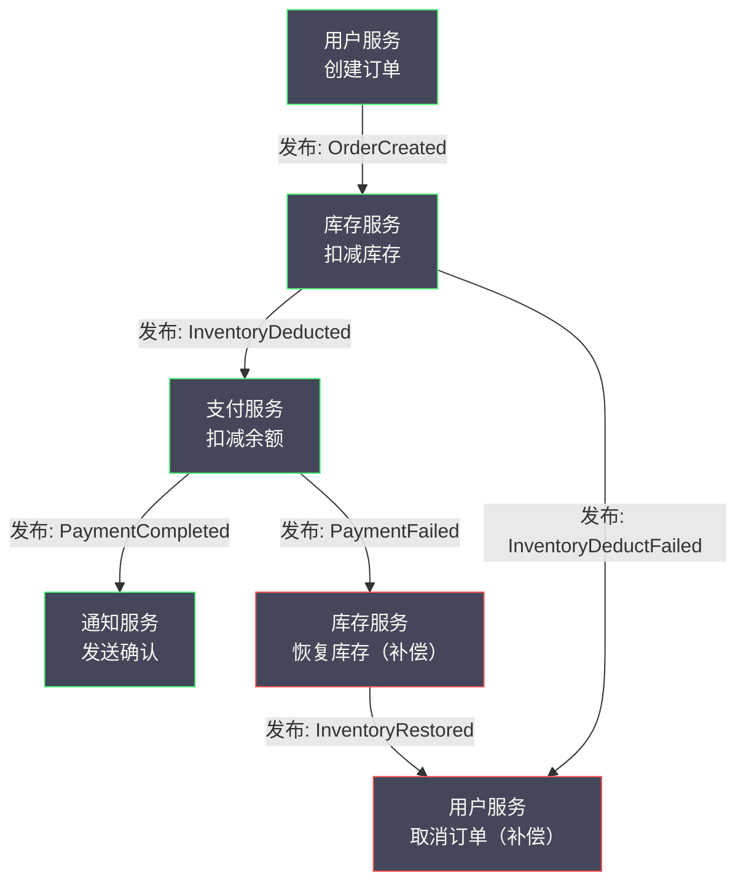
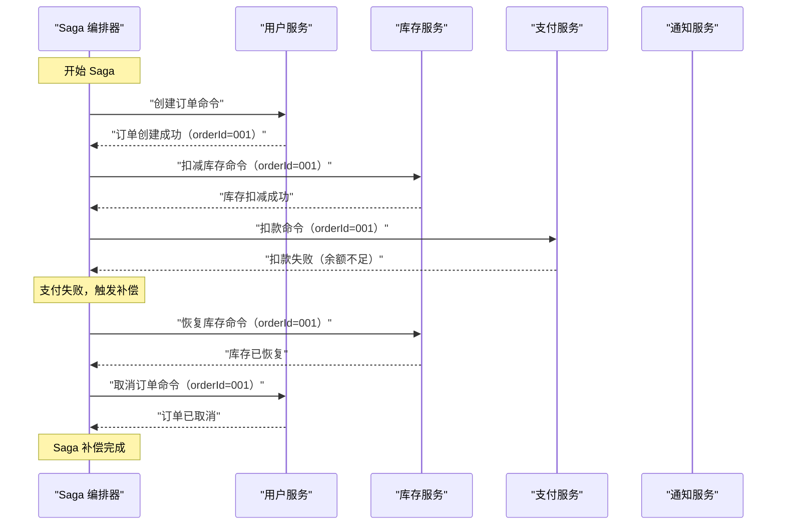
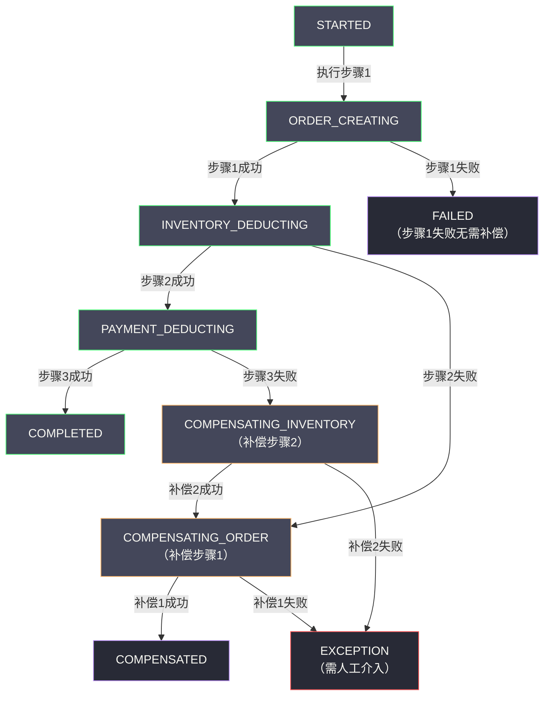
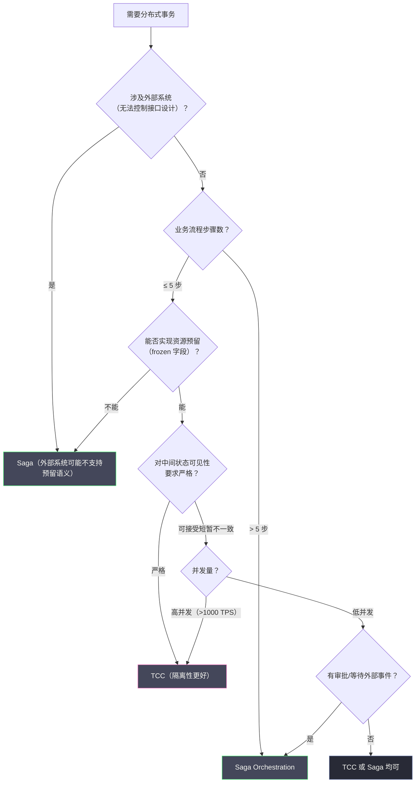

# 05 Saga 长事务编排模式深度解析

**摘要：**

Saga 模式是专为"长事务"场景设计的分布式事务解决方案。与 TCC 不同，Saga 不要求服务提供资源预留接口，而是将一个长事务拆分为一系列按顺序执行的本地事务，每个本地事务都直接提交，一旦某步骤失败，通过执行已完成步骤的"补偿事务"来实现回滚。本文从 Saga 被提出的历史背景切入，深入剖析 Saga 的两种实现模式——编排（Choreography）与协调（Orchestration）的架构差异与权衡；详细分析补偿事务的设计原则及其与 TCC Cancel 的本质区别；通过旅行预订这一经典案例展示 Saga 的完整落地逻辑；最后对比 Saga 与 TCC 的适用边界，给出选型决策框架。

---

## 第 1 章 Saga 的起源：长事务问题的历史背景

### 1.1 什么是长事务，为什么它是一个问题

在数据库领域，一个事务的"长短"通常以它持有数据库锁的时间来衡量。典型的短事务在毫秒级完成；而**长事务（Long-Running Transaction）**则可能持续数秒、数分钟，甚至更长。

长事务的出现，往往不是技术设计的失误，而是业务本身的复杂性决定的。想象一个旅行预订场景：

```
用户发起旅行预订：
  步骤 1：预订机票（需要调用航空公司 API，响应时间 1~5 秒）
  步骤 2：预订酒店（需要调用酒店系统，响应时间 2~8 秒）
  步骤 3：预订租车（需要调用租车系统，响应时间 1~3 秒）
  步骤 4：完成支付（需要调用支付网关，响应时间 0.5~2 秒）

总时长：可能长达 15~20 秒
```

如果用传统的 2PC 来处理这个场景：
- Prepare 阶段：4 个系统同时锁定资源，持续等待
- 在这 15~20 秒内，航空公司系统中对应的座位被锁定，无法被其他用户预订
- 酒店系统中对应的房间被锁定，无法被其他查询正确显示

这种对外部系统（航空公司、酒店系统）施加长时间锁的做法在技术上不可行——外部系统根本不支持你持有它们的资源锁，而且你的锁会严重影响其他用户的正常使用。

### 1.2 Saga 的诞生：1987 年的一篇论文

**Saga 模式**由 Hector Garcia-Molina 和 Kenneth Salem 在 1987 年发表的论文《Sagas》中正式提出。这篇论文发表于 ACM SIGMOD 大会，距今将近 40 年，但它所解决的问题在今天的微服务时代比以往任何时候都更加普遍。

论文的核心观察非常简单：**对于那些必然要"很长"的事务，与其试图将整个过程锁在一个单一的 ACID 事务中，不如将它拆分为一系列更短的本地事务，同时为每个本地事务设计一个对应的"补偿事务（Compensating Transaction）"，用于在发生失败时撤销已经完成的操作。**

Garcia-Molina 在论文中给出了 Saga 的形式化定义：

> 一个 Saga 是一个长事务 `LT`，它可以被拆分为一系列子事务 `T₁, T₂, ..., Tₙ`，其中每个子事务都是一个真实的 ACID 事务（即会立即提交）。对应地，存在一组补偿事务 `C₁, C₂, ..., Cₙ₋₁`（最后一个事务 Tₙ 不需要补偿，因为如果 Tₙ 失败说明什么都不需要撤销）。
>
> Saga 保证以下两种结果之一：
> 1. `T₁, T₂, ..., Tₙ` 全部成功（正向路径）
> 2. `T₁, T₂, ..., Tⱼ, Cⱼ, Cⱼ₋₁, ..., C₁` 对某个 j（0 ≤ j < n）成立（补偿路径）

用人话说：Saga 保证最终要么所有步骤都成功，要么所有已成功的步骤都被补偿（撤销），不会有"部分成功、无法撤销"的中间状态永久存在。

### 1.3 Saga 在微服务时代的复兴

Saga 模式在提出后，长期停留在学术界，在工业界的应用并不广泛。直到 2010 年代微服务架构的兴起，Saga 才重新获得了大量关注。

原因是：微服务架构将一个大型单体应用拆分为数十甚至数百个独立服务，每个服务管理自己的数据库。跨服务的业务操作（如下单、支付、发货）天然就是"长事务"——它们跨越多个服务边界，每个服务独立部署，无法共享数据库事务。

TCC 虽然适合高并发场景，但它要求每个参与服务实现三个接口（Try/Confirm/Cancel），而且 Try 阶段必须能够实现资源预留。对于某些业务场景（如旅行预订、报销审批），资源预留这个概念本身就很难实现——你无法在"Try 阶段预留一个酒店房间 15 分钟，等 Confirm 再正式下单"——因为外部酒店系统不支持这样的预留语义。

Saga 不要求资源预留，每个步骤直接提交，这使得它在无法实现 TCC Try 的场景下成为唯一可行的柔性事务方案。

---

## 第 2 章 补偿事务：Saga 的核心机制

### 2.1 补偿事务不是数据库回滚

理解 Saga，必须首先理解**补偿事务（Compensating Transaction）**这个概念，以及它与数据库 ROLLBACK 的本质区别。

**数据库 ROLLBACK**：物理撤销，好像操作从未发生。执行 ROLLBACK 后，数据库的状态完全恢复到事务开始前，没有任何痕迹留下。

**Saga 补偿事务**：语义撤销，是一个新的正向业务操作，用于在语义上"中和"之前的操作效果。执行补偿事务后，数据库中会留下原始操作和补偿操作的双重痕迹。

以旅行预订为例：

- **正向操作**：调用航空公司 API，创建一张机票订单（订单号 TK001）
- **数据库 ROLLBACK**：如果这是一个 DB 事务，ROLLBACK 会让这条订单记录消失，好像从未创建
- **补偿事务**：调用航空公司 API，取消订单 TK001。数据库中仍然存在这条订单记录，但状态变为"已取消"，并且有一条取消记录

这个区别非常重要：**Saga 补偿事务是业务操作，会有审计日志、会通知相关方、会产生业务副作用**。它不能做到数据库 ROLLBACK 那样的"如同从未发生"。

### 2.2 补偿事务的设计原则

设计一个好的补偿事务，需要遵循以下原则：

**原则一：语义逆向，而非物理撤销**

补偿事务应该在业务语义上逆转原始操作的效果，而不是试图物理删除原始数据。

| 正向操作 | 补偿操作 |
| :--- | :--- |
| 创建订单（状态 = 待支付）| 取消订单（状态 = 已取消）|
| 扣减余额 100 元 | 退款 100 元（或充值 100 元）|
| 锁定库存 1 件 | 释放锁定的 1 件库存 |
| 发送短信通知 | 不可补偿（已发出无法撤回）|

**原则二：补偿操作必须是幂等的**

与 TCC 的 Cancel 一样，Saga 的补偿事务也可能被重复执行（因为 Saga 协调器会在失败时重试补偿）。因此补偿操作必须是幂等的——重复执行多次的结果与执行一次相同。

```java
// 非幂等的补偿（危险）
public void compensateDeductBalance(String orderId, BigDecimal amount) {
    // 每次调用都会加钱，重复调用导致余额超额增加
    accountService.addBalance(userId, amount);
}

// 幂等的补偿
public void compensateDeductBalance(String compensationId, String orderId, BigDecimal amount) {
    // 检查此次补偿是否已经执行过
    if (compensationRepo.exists(compensationId)) {
        return;  // 已经补偿过，幂等返回
    }
    accountService.addBalance(userId, amount);
    compensationRepo.record(compensationId, orderId, amount);
}
```

**原则三：不可补偿操作的识别与处理**

有些操作在执行后无法通过业务手段撤销：

- 发送电子邮件（已发出无法撤回）
- 外部支付扣款已到账（只能退款，但退款是新操作，有时间窗口限制）
- 短信通知（已发出无法撤回）
- 向监管机构提交的报告

对于不可补偿操作，设计 Saga 时有两种策略：

**策略一：将不可补偿操作放到 Saga 的最后一步**。如果最后一步失败，Saga 直接结束（不需要补偿最后一步），前面的步骤可以正常补偿。

**策略二：将不可补偿操作之前的所有步骤设计为可补偿的，并在执行不可补偿操作之前完成所有验证**。一旦不可补偿操作开始执行，整个 Saga 就进入了"只能前进、不能后退"的阶段。

> [!warning] 不可补偿操作是 Saga 设计的最大挑战
> 当 Saga 流程中包含不可补偿操作时，必须非常谨慎地设计执行顺序和错误处理策略。一旦不可补偿操作已经执行，而后续步骤失败，系统需要通过人工干预、客服处理等方式来弥补，而不是通过自动补偿。这是 Saga 在金融场景中使用时需要特别关注的问题。

### 2.3 补偿事务 vs TCC Cancel：本质区别

Saga 的补偿事务与 TCC 的 Cancel 操作看起来相似，但有一个根本区别：

| 维度 | TCC Cancel | Saga 补偿事务 |
| :--- | :--- | :--- |
| **执行时机** | Try 未提交，撤销预留的资源 | 事务已提交，补偿已生效的操作 |
| **数据可见性** | Cancel 后，中间状态消失 | 补偿后，原操作 + 补偿操作都留有记录 |
| **业务副作用** | 无（资源只是被预留，未真正生效）| 有（原操作已对外生效，补偿本身也是业务操作）|
| **原子性粒度** | 业务层的资源预留，接近数据库回滚语义 | 完全的业务语义层面 |
| **适用场景** | 有明确预留/解冻语义的资源操作 | 无法预留的外部系统调用、长流程 |

TCC 是"先预留、再确认或撤销"——在最终状态出现之前，中间状态对外不完全可见；
Saga 是"先提交、后补偿"——每一步都立即生效，补偿是事后追加的新操作。

---

## 第 3 章 Saga 的两种实现模式

Saga 模式有两种截然不同的实现架构，对应不同的系统设计哲学。

### 3.1 模式一：编排（Choreography）——去中心化

**编排模式的核心思想**：没有中央协调器，每个服务在完成自己的操作后，通过发布领域事件（Domain Event）来驱动下一个服务的执行。整个 Saga 的流程是由各服务之间的事件驱动链条隐式编排的。



**编排模式的工作流程**（以下单失败场景为例）：

```
1. 用户服务：创建订单（状态=待处理），发布 OrderCreated 事件
2. 库存服务：监听 OrderCreated，扣减库存，发布 InventoryDeducted 事件
3. 支付服务：监听 InventoryDeducted，尝试扣款，失败！发布 PaymentFailed 事件
4. 库存服务：监听 PaymentFailed，执行补偿——恢复库存，发布 InventoryRestored 事件
5. 用户服务：监听 InventoryRestored，执行补偿——取消订单（状态=已取消）
```

**编排模式的优点**：
- **松耦合**：每个服务只需关注自己的输入事件和输出事件，不需要知道全局流程
- **无中心单点**：没有协调器，去中心化设计，没有单点故障风险
- **易于扩展**：新增服务只需订阅相关事件，不影响其他服务

**编排模式的缺点**：

**（1）全局流程难以追踪**：Saga 的整体流程被分散在各个服务的事件处理逻辑中，没有一个地方可以看到"整个 Saga 的执行状态是什么"。当出现问题时，需要关联多个服务的日志才能还原完整的执行路径，调试难度极高。

**（2）循环依赖风险**：随着业务复杂度增加，事件之间的依赖关系可能形成隐式的循环，且难以通过代码审查发现。

**（3）补偿逻辑分散**：每个服务自己负责监听失败事件并执行补偿，补偿逻辑散落在各服务中，整体可维护性较差。

**（4）事件风暴（Event Storm）**：在复杂流程中，每个步骤都有成功和失败两个事件，N 个步骤可能产生 2N 个事件类型，事件数量急剧膨胀，消息总线压力增大，事件追踪复杂度也随之增加。

> [!note] 编排模式适合的场景
> 编排模式在**步骤数量少（3~5 步）、流程相对固定、团队服务边界清晰**的场景下表现良好。典型案例：微博/Twitter 的发帖流程（发帖 → 更新 Feed 流 → 推送通知），步骤明确，补偿路径简单。

### 3.2 模式二：协调（Orchestration）——中心化

**协调模式的核心思想**：引入一个中央**编排器（Orchestrator / Saga Coordinator）**，由它显式地定义和控制 Saga 的执行流程。编排器向各参与服务发出命令，等待响应，并根据响应决定下一步执行什么或触发补偿。



**协调模式的优点**：

**（1）全局流程清晰可见**：Saga 的执行流程集中在编排器中，一目了然。任何时刻都可以查询编排器，了解当前 Saga 执行到哪一步、整体状态是什么。

**（2）调试和运维友好**：出现问题时，只需查看编排器的状态日志，就能还原整个 Saga 的执行历史，不需要关联多个服务的日志。

**（3）复杂流程的精确控制**：对于包含条件分支、并发子任务、等待外部事件等复杂逻辑的 Saga，编排器可以精确控制执行顺序和分支逻辑，而这在编排模式中极难实现。

**（4）补偿逻辑集中管理**：补偿的触发和执行顺序由编排器统一管理，不依赖各服务自行监听失败事件。

**协调模式的缺点**：

**（1）编排器成为业务逻辑的聚合点**：编排器需要了解各参与服务的接口细节，随着业务增长，编排器可能变成一个"上帝对象（God Object）"，引发关注点混乱。

**（2）编排器是中心节点，需要高可用保护**：编排器本身需要持久化状态（Saga 执行进度），并部署高可用，否则编排器崩溃会导致所有进行中的 Saga 无法推进。

**（3）服务间的耦合通过编排器间接耦合**：虽然参与服务之间不直接耦合，但它们都与编排器耦合，编排器的修改可能影响所有参与服务的接口协议。

### 3.3 两种模式的选型指南

| 场景特征 | 推荐模式 | 理由 |
| :--- | :--- | :--- |
| **步骤 ≤ 3，流程固定** | 编排（Choreography）| 简单场景无需引入编排器的复杂性 |
| **步骤 > 5，流程复杂** | 协调（Orchestration）| 编排器使复杂流程可维护 |
| **需要可视化监控事务进度** | 协调（Orchestration）| 编排器天然提供中心状态查询 |
| **包含条件分支、并发子任务** | 协调（Orchestration）| 编排模式很难清晰表达复杂控制流 |
| **服务完全自治，不想引入中心依赖** | 编排（Choreography）| 去中心化，无中心单点 |
| **团队规模小，跨团队协作少** | 编排（Choreography）| 协调模式的编排器跨越服务边界，需要多团队协作 |
| **有审计合规要求，需要追踪完整流程** | 协调（Orchestration）| 编排器提供完整的执行历史记录 |

实际工程中，**协调模式（Orchestration）应用更为广泛**，尤其是在复杂的企业级业务流程中。阿里的 Seata Saga 模式、Apache Camel、Netflix Conductor 等框架都采用了协调模式的设计。

---

## 第 4 章 Saga 的状态机：编排器的核心数据结构

协调模式的编排器本质上是一个**持久化状态机（Persistent State Machine）**。理解状态机的设计，是深入理解 Saga 的关键。

### 4.1 状态机的定义

一个 Saga 实例的状态机包含以下要素：

**状态（State）**：Saga 当前所处的阶段，例如：
- `STARTED`：Saga 已启动，尚未执行任何步骤
- `STEP_1_EXECUTING`：正在执行第 1 步
- `STEP_1_COMPLETED`：第 1 步执行完成
- `COMPENSATING`：正在执行补偿
- `STEP_1_COMPENSATING`：正在补偿第 1 步
- `COMPLETED`：Saga 正向完成
- `COMPENSATED`：Saga 补偿完成（事务回滚）
- `FAILED`：Saga 遇到无法补偿的错误，需要人工干预

**事件（Event）**：驱动状态迁移的触发器，例如：
- `STEP_1_SUCCEEDED`：第 1 步执行成功
- `STEP_1_FAILED`：第 1 步执行失败
- `COMPENSATION_SUCCEEDED`：当前补偿步骤成功
- `COMPENSATION_FAILED`：补偿步骤也失败了（极端情况）

**转换（Transition）**：状态 + 事件 → 下一个状态 + 动作

### 4.2 一个三步 Saga 的完整状态机

以"创建订单 → 扣减库存 → 扣减余额"为例：



### 4.3 编排器的持久化要求

编排器必须将 Saga 实例的状态持久化到数据库中，原因有两个：

**（1）崩溃恢复**：编排器可能崩溃，重启后必须能够从数据库中恢复所有进行中的 Saga 实例，并继续驱动它们向前推进。

**（2）幂等重试**：编排器向参与服务发送命令后，可能因网络超时收不到响应。重试时，编排器必须基于持久化的状态来判断是否需要重试，以及重试的正确步骤。

典型的 Saga 实例持久化数据模型：

```sql
CREATE TABLE saga_instance (
    saga_id       VARCHAR(64)   NOT NULL COMMENT '全局唯一 Saga ID',
    saga_type     VARCHAR(128)  NOT NULL COMMENT 'Saga 类型（如 CreateOrderSaga）',
    state         VARCHAR(64)   NOT NULL COMMENT '当前状态',
    saga_data     TEXT          NOT NULL COMMENT 'Saga 上下文数据（JSON 格式）',
    last_error    TEXT                   COMMENT '最后一次错误信息',
    created_at    DATETIME      NOT NULL,
    updated_at    DATETIME      NOT NULL,
    PRIMARY KEY (saga_id),
    INDEX idx_state (state),
    INDEX idx_type_state (saga_type, state)
);

CREATE TABLE saga_step_log (
    log_id        BIGINT        NOT NULL AUTO_INCREMENT,
    saga_id       VARCHAR(64)   NOT NULL,
    step_name     VARCHAR(64)   NOT NULL COMMENT '步骤名称',
    step_type     VARCHAR(16)   NOT NULL COMMENT 'FORWARD / COMPENSATE',
    status        VARCHAR(16)   NOT NULL COMMENT 'EXECUTING/SUCCESS/FAILED',
    request_data  TEXT                   COMMENT '请求参数',
    response_data TEXT                   COMMENT '响应结果',
    executed_at   DATETIME      NOT NULL,
    PRIMARY KEY (log_id),
    INDEX idx_saga_id (saga_id)
);
```

---

## 第 5 章 完整案例：旅行预订 Saga 的落地实践

### 5.1 业务场景与步骤定义

以旅行预订为例，Saga 包含以下 4 个步骤，每个步骤对应一个独立的微服务调用：

| 步骤 | 正向操作 | 补偿操作 | 是否可补偿 |
| :--- | :--- | :--- | :--- |
| 1. 创建旅行订单 | `OrderService.createOrder()` | `OrderService.cancelOrder()` | 是 |
| 2. 预订机票 | `FlightService.bookFlight()` | `FlightService.cancelFlight()` | 是（在起飞前）|
| 3. 预订酒店 | `HotelService.bookHotel()` | `HotelService.cancelHotel()` | 是（在入住前）|
| 4. 完成支付 | `PaymentService.processPayment()` | `PaymentService.refund()` | 是（有时间窗口）|

### 5.2 正向执行路径

```
[Saga 编排器] 创建 Saga 实例，state = STARTED

步骤 1：
  [编排器] → OrderService.createOrder({userId, travelPlan})
  [OrderService] 在本地 DB 创建订单记录（status = PENDING），立即提交
  [OrderService] → 编排器：{orderId = "ORDER-001", success = true}
  [编排器] 更新 state = FLIGHT_BOOKING

步骤 2：
  [编排器] → FlightService.bookFlight({orderId, flightId, passengerId})
  [FlightService] 调用航空公司 API 预订机票，本地记录（ticketId = "TK-001"），立即提交
  [FlightService] → 编排器：{ticketId = "TK-001", success = true}
  [编排器] 更新 state = HOTEL_BOOKING

步骤 3：
  [编排器] → HotelService.bookHotel({orderId, hotelId, checkIn, checkOut})
  [HotelService] 调用酒店 API 预订房间，本地记录（roomReservationId = "HR-001"），立即提交
  [HotelService] → 编排器：{reservationId = "HR-001", success = true}
  [编排器] 更新 state = PAYMENT_PROCESSING

步骤 4：
  [编排器] → PaymentService.processPayment({orderId, amount = 3500})
  [PaymentService] 扣减用户余额，记录支付流水，立即提交
  [PaymentService] → 编排器：{paymentId = "PAY-001", success = true}
  [编排器] 更新 state = COMPLETED

[Saga 完成，用户预订成功]
```

### 5.3 补偿执行路径（支付失败）

```
...（步骤 1、2、3 同上，都已成功并提交）...

步骤 4：
  [编排器] → PaymentService.processPayment({orderId, amount = 3500})
  [PaymentService] 检查用户余额：2000 < 3500，余额不足
  [PaymentService] → 编排器：{success = false, error = "INSUFFICIENT_BALANCE"}
  [编排器] 更新 state = COMPENSATING（进入补偿阶段）

补偿步骤 3（补偿酒店预订）：
  [编排器] → HotelService.cancelHotel({orderId, reservationId = "HR-001"})
  [HotelService] 调用酒店 API 取消预订，更新本地状态为 CANCELLED，立即提交
  [HotelService] → 编排器：{success = true}

补偿步骤 2（补偿机票预订）：
  [编排器] → FlightService.cancelFlight({orderId, ticketId = "TK-001"})
  [FlightService] 调用航空公司 API 取消机票，更新本地状态为 CANCELLED，立即提交
  [FlightService] → 编排器：{success = true}

补偿步骤 1（补偿订单创建）：
  [编排器] → OrderService.cancelOrder({orderId = "ORDER-001"})
  [OrderService] 更新订单状态为 CANCELLED，立即提交
  [OrderService] → 编排器：{success = true}

[编排器] 更新 state = COMPENSATED
[Saga 补偿完成，用户预订失败，所有资源已释放]
```

### 5.4 补偿顺序的重要性

注意补偿的顺序是**逆序**的：先补偿最后成功的步骤，再依次向前补偿。

这不是巧合，而是必须遵守的设计原则。原因如下：

假设补偿顺序是正序（先补偿步骤 1，再补偿步骤 2）：
- 补偿步骤 1（取消订单）：成功
- 补偿步骤 2（取消机票）：调用航空公司 API，对方系统要求验证 orderId，但订单已被步骤 1 删除 → 补偿失败！

逆序补偿保证了：**在补偿某个步骤时，它所依赖的上下文数据（如 orderId）仍然有效**，不会因为上游步骤的补偿已经删除了依赖数据而导致补偿失败。

---

## 第 6 章 Saga 的隔离性问题与应对策略

### 6.1 Saga 的隔离性弱点

在所有柔性事务方案中，Saga 的隔离性是最弱的。每个步骤在执行后立即提交，数据变更立即对外可见，其他并发的 Saga 或事务可以读取到这些中间状态。

以旅行预订为例，在步骤 2（机票预订完成）、步骤 3（酒店预订）执行期间，如果另一个用户查询航班座位余量，他会看到座位已减少（因为步骤 2 已提交），但如果步骤 3 或 4 最终失败，这个座位又会被释放——用户看到的座位信息是"中间状态"，在最终结果确定之前可能随时变化。

这被称为**"脏读"问题**：并发请求读取到了一个最终会被补偿（撤销）的中间状态。

### 6.2 隔离性问题的分类

Saga 的隔离性问题有三种主要形式：

**（1）脏读（Lost Updates / Dirty Reads）**：事务 A 读取了事务 B 已提交但最终会被 Saga 补偿的数据，基于这个脏数据做出了错误决策。

**（2）不可重复读（Non-Repeatable Reads）**：Saga 执行期间，同一个查询在不同时刻返回不同结果，因为期间有其他 Saga 的步骤提交了数据。

**（3）丢失更新（Lost Updates）**：两个并发的 Saga 都在修改同一个资源，其中一个 Saga 的中间状态被另一个 Saga 覆盖，最终补偿时产生错误的回滚结果。

### 6.3 应对策略

**策略一：语义锁（Semantic Lock）**

在 Saga 的正向操作中，给数据记录加一个业务层面的"处理中"标记，其他事务在读取时检查这个标记，并做相应处理（等待、拒绝、或返回标记信息）。

```sql
-- 步骤 2 执行时，为订单记录加语义锁
UPDATE travel_order 
SET status = 'PROCESSING'  -- 标记为处理中
WHERE order_id = 'ORDER-001';

-- 其他查询检查语义锁
SELECT * FROM travel_order 
WHERE order_id = 'ORDER-001';
-- 如果 status = 'PROCESSING'，业务层决定：等待 or 提示用户"订单处理中"
```

语义锁不是数据库锁，不会阻塞其他操作，而是通过业务状态字段来表达"这条数据正在被一个 Saga 处理"的语义。

**策略二：乐观并发控制（Optimistic Concurrency Control）**

使用版本号或时间戳，在 Saga 的补偿阶段检查数据是否已被其他事务修改，如果已被修改则拒绝补偿：

```sql
-- 记录步骤执行时的版本号
saga_data.inventory_version = 42  -- 执行步骤时的快照

-- 补偿时检查版本号
UPDATE inventory 
SET available_stock = available_stock + 1, version = version + 1
WHERE product_id = 'P001' 
  AND version = 42;  -- 如果版本号已变，说明中间被其他事务修改过
-- affected_rows = 0 时，触发告警并人工介入
```

**策略三：重排步骤顺序（Reordering Steps）**

通过调整 Saga 步骤的执行顺序，将最容易产生并发冲突的步骤放到最后，减少中间状态暴露的时间窗口。

**策略四：接受并设计业务语义**

在很多业务场景中，中间状态的短暂可见是可以接受的，甚至是合理的业务设计。例如，电商下单后"库存显示减少但订单未最终确认"对用户展示"库存紧张，请尽快完成支付"的提示，这本身就是合理的业务行为。

---

## 第 7 章 Saga vs TCC：选型决策框架

### 7.1 核心差异对比

| 维度 | TCC | Saga |
| :--- | :--- | :--- |
| **事务粒度** | 业务操作 + 资源预留（3 步） | 多个独立本地事务的序列（N 步）|
| **数据一致性窗口** | Try 到 Confirm/Cancel（较短）| 整个 Saga 执行期间（较长）|
| **隔离性** | 较好（资源预留期间不会被其他事务"真正"使用）| 较弱（每步立即提交，中间状态可见）|
| **业务侵入性** | 高（需要实现 Try/Confirm/Cancel 三个接口）| 中（需要实现正向操作 + 补偿操作）|
| **资源预留要求** | 必须（Try 阶段必须能实现资源预留）| 不需要（每步直接提交）|
| **适合步骤数** | 少（通常 2~5 步）| 多（可以处理 10+ 步的长流程）|
| **外部系统支持** | 需要支持预留语义 | 只需支持正向操作和补偿操作 |
| **补偿的业务可见性** | Cancel 后，中间状态消失 | 补偿后，留有操作记录 |
| **典型场景** | 库存扣减、余额扣减等高并发资源操作 | 旅行预订、报销审批等长流程 |

### 7.2 选型决策树



### 7.3 两种方案的生产建议

**TCC 生产建议**：
1. 严格实现幂等性（事务控制表 + 唯一约束）
2. 必须处理空回滚和悬挂问题（统一的 TCC 状态表）
3. 业务数据模型需要增加冻结字段（`frozen_stock`、`frozen_balance`）
4. Try 超时时间设置合理，避免冻结资源长时间无法释放
5. 使用成熟框架（Seata TCC 模式、Hmily）而非手写

**Saga 生产建议**：
1. 优先使用协调（Orchestration）模式，复杂流程更易于维护
2. 编排器必须持久化 Saga 状态，支持崩溃恢复
3. 所有正向操作和补偿操作都必须是幂等的
4. 为每个 Saga 实例设置超时时间，超时后自动触发补偿
5. 设计好补偿失败的处理策略（人工介入、死信队列）
6. 将不可补偿操作放到 Saga 的最后一步或使用语义锁保护

---

## 参考资料

1. Garcia-Molina, H., & Salem, K. (1987). Sagas. *ACM SIGMOD Record, 16*(3), 249–259.
2. Richardson, C. (2018). *Microservices Patterns: With Examples in Java*. Manning Publications. Chapter 4: Managing transactions with sagas.
3. Helland, P. (2007). Life beyond Distributed Transactions: an Apostate's Opinion. *CIDR 2007*.
4. Seata Saga 官方文档. https://seata.apache.org/zh-cn/docs/user/saga
5. Netflix Conductor: Workflow Orchestration Engine. https://github.com/Netflix/conductor
6. Berger, S. (2020). Saga Pattern in Microservices. *InfoQ*.
7. Kleppmann, M. (2017). *Designing Data-Intensive Applications*. O'Reilly Media. Chapter 7: Transactions.

---

> [!note] 思考题
> 1. 本地消息表模式：业务操作和消息写入在同一个本地事务中——保证原子性。后台任务定期扫描消息表将消息发送到 MQ。消费者处理消息后回调确认。这种模式的可靠性来源于'本地事务保证业务操作和消息记录的原子性'。但消息可能被重复发送（如发送成功但确认失败）——消费端如何实现幂等？
> 2. 消息表的扫描和发送增加了数据库的负载——在高写入场景中，消息表可能成为瓶颈。你如何优化消息表的扫描频率和批量大小？定时扫描（如每 5 秒）和事件触发（如写入后立即发送）各有什么优劣？
> 3. 本地消息表 vs Transactional Outbox Pattern（如 Debezium CDC 捕获消息表变更并发送到 Kafka）——CDC 方式不需要定时扫描，延迟更低。但 CDC 增加了基础设施复杂度。在什么规模下引入 CDC 是值得的？
