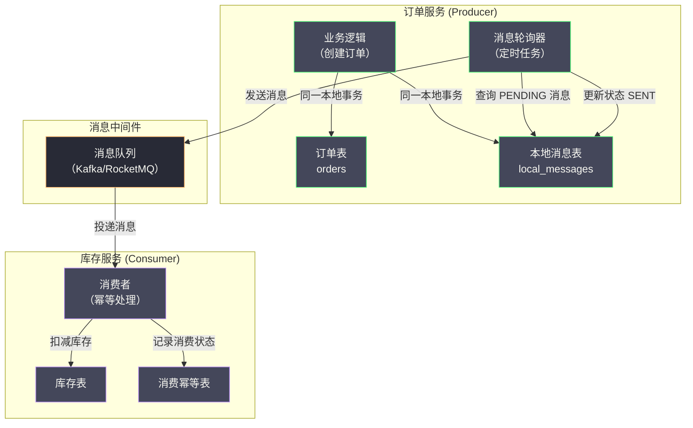
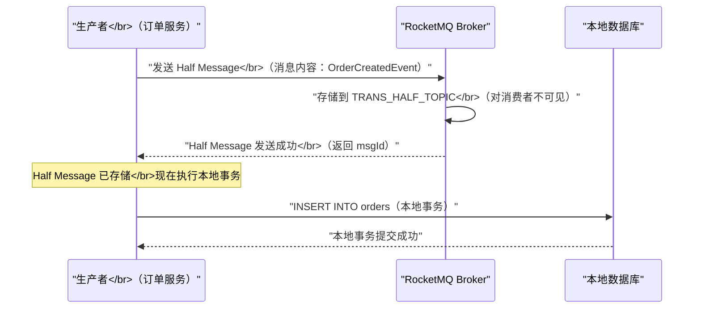
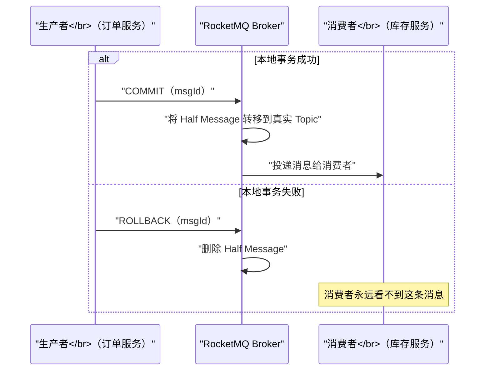
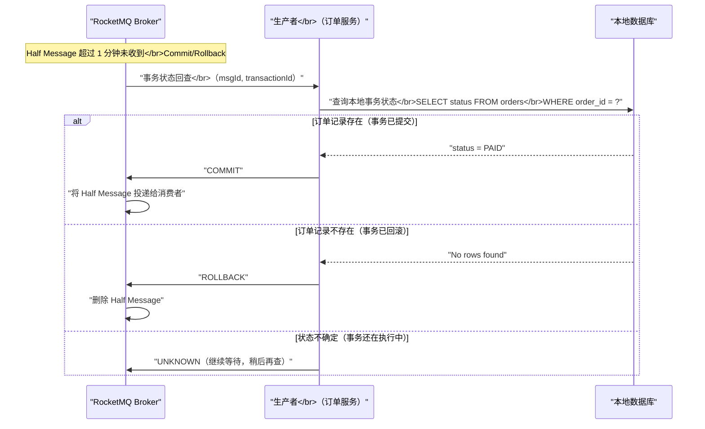

# 06 基于消息队列的最终一致性方案

**摘要：**

基于消息队列的最终一致性方案是分布式事务家族中最"轻量"的一类——它不需要复杂的协调协议，不要求参与方实现特殊接口，而是将"本地数据库操作"与"发送消息"这两件事绑定为一个原子单元，利用消息队列的可靠传递能力来最终驱动所有参与方到达一致状态。本文深入剖析两种主流实现路径：基于本地消息表（Local Message Table）的经典方案与 RocketMQ 事务消息（Half Message）的工业级实现；重点分析两种方案在"写本地 DB 与发消息的原子性"这一核心问题上的不同解法，以及各自面临的消费幂等、消息积压、消息丢失等工程挑战；最后给出方案选型的决策框架。

---

## 第 1 章 为什么需要消息队列方案：TCC/Saga 的适用边界

### 1.1 从同步到异步：一类被忽视的分布式事务场景

在前面的文章中，我们分析了 2PC、TCC 和 Saga 这三类分布式事务解决方案。它们有一个共同的特征：**事务的发起方需要等待所有参与方完成操作后，才能确认事务的最终结果**——这是一种同步的协调模型。

但在实际业务中，有大量场景并不需要同步等待所有参与方完成操作：

- 用户下单成功后，订单服务需要通知库存服务扣减库存——但订单服务不需要等待库存服务完成扣减后才向用户返回"下单成功"
- 支付成功后，支付服务需要通知积分服务增加积分——但支付的核心流程已经完成，积分增加是后续操作，晚几秒完成用户也不在乎
- 用户注册后，需要触发欢迎邮件发送、初始化用户偏好、创建默认设置等多个后续操作——这些后续操作不影响注册流程的成功与否

这类场景的特点是：**主操作（写本地数据库）和后续操作（通知其他服务）之间存在天然的先后依赖，但后续操作可以异步执行，只要最终能够被可靠地触发执行即可。**

对于这类场景，如果使用 TCC：
- 需要为每个后续操作实现 Try/Confirm/Cancel 三个接口
- 主操作需要等待所有后续操作的 Try 成功才能确认
- 实现成本高，而且把本来就应该异步的操作硬变成了同步，反而降低了系统响应速度

如果使用 Saga：
- 需要构建编排器，将所有后续操作编排成 Saga 步骤
- 对于"主操作已完成、后续操作逐步异步触发"的简单流程，Saga 又过于重量级

### 1.2 最朴素的解决思路：先写 DB，再发消息

对于异步驱动型的最终一致性场景，最直觉的做法是：

```java
// 伪代码：最朴素的尝试
@Transactional
public void createOrder(Order order) {
    // 步骤 1：写本地数据库
    orderRepository.save(order);
    
    // 步骤 2：发送消息通知库存服务
    messageQueue.send(new OrderCreatedMessage(order.getId()));
}
```

这个做法看似简单，但存在一个根本性的问题：**步骤 1 和步骤 2 不是原子操作**。会出现以下两种故障：

**故障 1：数据库写成功，但发消息失败**

```
[数据库] INSERT INTO orders → 成功，事务提交
[网络] 发送消息到 MQ → 连接超时，失败
[结果] 订单存在，但库存服务永远收不到通知 → 库存不一致
```

**故障 2：消息发出，但数据库事务最终回滚**

```
[数据库] INSERT INTO orders → 写入内存，事务尚未提交
[MQ] 消息发送成功，库存服务开始扣减库存
[数据库] 后续代码抛出异常，事务回滚，订单不存在
[结果] 库存被扣减，但订单不存在 → 库存不一致（超卖）
```

这两个故障揭示了核心问题：**数据库事务的提交和消息发送是两个独立的操作，两者之间没有原子性保证**。

解决这个问题，需要一种机制让"写本地 DB"和"发送消息"成为一个不可分割的原子操作。本地消息表方案和 RocketMQ 事务消息是目前最主流的两种解法。

---

## 第 2 章 本地消息表方案：eBay 2008 年的经典工程实践

### 2.1 方案的起源与核心思想

本地消息表（Local Message Table）方案最早由 eBay 工程师 Dan Pritchett 在 2008 年的论文《Base: An ACID Alternative》中提出，是与 BASE 理论同期出现的工程实践。

**核心思想**：将"发送消息"这个操作转化为"写本地数据库记录"。由于写消息记录和写业务数据都在同一个本地数据库事务中，它们天然具有原子性——要么都成功，要么都失败。随后，由一个后台任务轮询这张本地消息表，将待发送的消息可靠地投递到消息队列。

### 2.2 方案的完整架构



### 2.3 本地消息表的数据模型

```sql
CREATE TABLE local_messages (
    msg_id          VARCHAR(64)   NOT NULL COMMENT '消息唯一 ID',
    topic           VARCHAR(128)  NOT NULL COMMENT '消息主题（对应 MQ 的 Topic）',
    payload         TEXT          NOT NULL COMMENT '消息内容（JSON 格式）',
    status          VARCHAR(16)   NOT NULL DEFAULT 'PENDING' 
                                  COMMENT 'PENDING/SENT/CONSUMED/FAILED',
    retry_count     INT           NOT NULL DEFAULT 0 COMMENT '已重试次数',
    max_retry       INT           NOT NULL DEFAULT 5 COMMENT '最大重试次数',
    next_retry_at   DATETIME               COMMENT '下次重试时间（指数退避）',
    business_key    VARCHAR(128)           COMMENT '业务主键（用于幂等查询）',
    created_at      DATETIME      NOT NULL,
    updated_at      DATETIME      NOT NULL,
    PRIMARY KEY (msg_id),
    INDEX idx_status_retry (status, next_retry_at),  -- 轮询查询优化
    INDEX idx_business_key (business_key)             -- 幂等查询优化
);
```

### 2.4 生产者端：原子写入业务数据 + 消息记录

```java
@Transactional  // 本地数据库事务
public void createOrder(CreateOrderRequest request) {
    // 步骤 1：写业务数据（订单）
    Order order = new Order(request);
    orderRepository.save(order);  // INSERT INTO orders
    
    // 步骤 2：在同一事务内写消息记录（与步骤 1 原子）
    LocalMessage message = LocalMessage.builder()
        .msgId(UUID.randomUUID().toString())
        .topic("order.created")
        .payload(JSON.toJSONString(new OrderCreatedEvent(order.getId(), order.getProductId(), order.getQuantity())))
        .status("PENDING")
        .businessKey(order.getId())
        .nextRetryAt(LocalDateTime.now())  // 立即可被轮询
        .build();
    localMessageRepository.save(message);  // INSERT INTO local_messages
    
    // 事务提交时，orders 和 local_messages 两张表同时写入成功
    // 如果这里抛出异常，两张表都回滚，不会有任何消息记录
}
```

### 2.5 消息轮询器：可靠投递

消息轮询器是一个定时任务（通常每隔 1~5 秒执行一次），负责将本地消息表中 `PENDING` 状态的消息投递到消息队列：

```java
@Scheduled(fixedDelay = 2000)  // 每 2 秒执行一次
public void pollAndSendMessages() {
    // 查询待发送的消息（考虑重试时间）
    List<LocalMessage> pendingMessages = localMessageRepository
        .findPendingMessages(LocalDateTime.now(), 100);  // 每批最多 100 条
    
    for (LocalMessage message : pendingMessages) {
        try {
            // 投递到消息队列
            mqProducer.send(message.getTopic(), message.getPayload());
            
            // 更新状态为已发送
            localMessageRepository.updateStatus(message.getMsgId(), "SENT");
            
        } catch (Exception e) {
            // 发送失败，增加重试次数，设置下次重试时间（指数退避）
            int retryCount = message.getRetryCount() + 1;
            if (retryCount >= message.getMaxRetry()) {
                // 超过最大重试次数，标记为 FAILED，人工介入
                localMessageRepository.updateStatusWithRetry(
                    message.getMsgId(), "FAILED", retryCount, null);
                alertService.sendAlert("本地消息投递彻底失败，需人工干预: " + message.getMsgId());
            } else {
                // 指数退避：1s, 2s, 4s, 8s, 16s...
                LocalDateTime nextRetry = LocalDateTime.now()
                    .plusSeconds((long) Math.pow(2, retryCount));
                localMessageRepository.updateStatusWithRetry(
                    message.getMsgId(), "PENDING", retryCount, nextRetry);
            }
        }
    }
}
```

> [!note] 指数退避的重要性
> 消息投递失败通常源于 MQ 服务暂时不可用或网络抖动。如果使用固定间隔重试，大量失败消息会在短时间内产生大量重试请求，可能进一步加剧 MQ 的压力。指数退避（每次重试间隔翻倍）可以有效减轻这种"雪上加霜"效应，给 MQ 服务留出恢复时间。

### 2.6 消费者端：幂等消费

由于消息可能被重复投递（轮询器在确认发送前崩溃，重启后会重新投递），消费者必须实现幂等消费。

消费幂等的标准实现是在消费者数据库中维护一张消费记录表：

```sql
CREATE TABLE consumed_messages (
    msg_id      VARCHAR(64) NOT NULL COMMENT '消息唯一 ID',
    topic       VARCHAR(128) NOT NULL,
    consumed_at DATETIME     NOT NULL,
    PRIMARY KEY (msg_id)
);
```

消费逻辑：

```java
@RocketMQMessageListener(topic = "order.created", consumerGroup = "inventory-group")
public class OrderCreatedConsumer implements RocketMQListener<OrderCreatedEvent> {
    
    @Override
    @Transactional
    public void onMessage(OrderCreatedEvent event) {
        String msgId = RocketMQHeaders.getMessageId();  // 获取消息 ID
        
        // 1. 幂等检查：是否已经消费过
        if (consumedMessageRepo.exists(msgId)) {
            log.info("消息已消费，幂等跳过: msgId={}", msgId);
            return;
        }
        
        // 2. 执行业务操作
        inventoryService.deductStock(event.getProductId(), event.getQuantity());
        
        // 3. 记录消费状态（与步骤 2 在同一本地事务中）
        consumedMessageRepo.save(new ConsumedMessage(msgId, event.getTopic()));
        
        // 事务提交：业务操作 + 消费记录 原子完成
    }
}
```

> [!warning] 消费幂等的事务边界
> 注意：消费记录的写入必须与业务操作在同一个本地事务中。如果先执行业务操作（扣减库存）再写消费记录，在两者之间崩溃时：库存已扣，但消费记录未写，重试时库存会被重复扣减。只有将两者放在同一事务中，才能保证幂等性的可靠性。

### 2.7 方案的优缺点分析

**优点**：
- **实现简单**：无需引入任何特殊的 MQ 特性，适用于任何消息队列（Kafka、RabbitMQ、RocketMQ 均可）
- **技术栈无侵入**：对现有代码改动最小，只需增加一张本地消息表和一个定时任务
- **可靠性高**：消息记录持久化在数据库中，不受 MQ 故障影响，MQ 恢复后可自动重发

**缺点**：
- **数据库压力增加**：每次业务写操作都会额外写一条消息记录，高并发场景下本地消息表可能成为写入热点
- **消息延迟**：从业务数据写入到消息被实际投递，存在轮询间隔的延迟（通常 1~5 秒）
- **消息表的存储膨胀**：如果消费确认机制不完善，消息表会持续增大，需要定期归档清理
- **需要维护定时任务**：轮询器本身也是一个服务组件，需要处理其高可用（避免重复运行导致重复发消息）

> [!warning] 轮询器的高可用问题
> 如果同一个应用部署了多个实例，每个实例都运行轮询器，同一条消息记录可能被多个实例同时扫到并投递，导致消息重复。解决方案：
> 1. 使用分布式锁（Redis SETNX）确保同一时刻只有一个实例运行轮询器
> 2. 在更新消息状态时使用乐观锁（CAS：只有 status = 'PENDING' 时才更新为 'SENDING'，防止并发处理）
> 3. 依赖消费者端的幂等消费来容忍少量重复（最终一致性场景下这通常是可接受的）

---

## 第 3 章 RocketMQ 事务消息：Half Message 机制深度解析

### 3.1 为什么需要 RocketMQ 的事务消息

本地消息表方案有效但有一个明显的工程成本：需要为每个业务场景维护一张本地消息表，并运维一个轮询定时任务。随着业务场景增多，这些"基础设施代码"会越来越多，且在不同服务中重复出现。

[[RocketMQ]] 从 4.3.0 版本开始提供了**事务消息（Transaction Message）**功能，将本地消息表的核心逻辑内置到消息队列中，使得"原子性写本地 DB + 发消息"的问题可以在框架层面得到统一解决，而无需在业务代码中维护本地消息表。

### 3.2 Half Message 的核心概念

RocketMQ 事务消息的实现基于一个称为 **Half Message（半消息）**的中间状态。

**Half Message（半消息）**是指：**已经被 RocketMQ Broker 接收并存储，但对消费者不可见的消息**。它被暂存在一个特殊的内部 Topic（`RMQ_SYS_TRANS_HALF_TOPIC`）中，不会被路由到任何消费者队列。

Half Message 就像一个"预登记的消息"——Broker 已经知道它的存在，但在生产者确认之前，它不会对任何消费者产生影响。

### 3.3 事务消息的完整流程

RocketMQ 事务消息将整个流程分为三个阶段：

**阶段一：发送 Half Message**



**阶段二：本地事务执行后发送 Commit/Rollback**



**阶段三：事务状态回查（应对生产者崩溃）**

这是 RocketMQ 事务消息最精妙的设计——当生产者在发送 Commit/Rollback 之前崩溃，导致 Broker 收不到最终状态时，Broker 会主动发起**事务状态回查（Transaction Status Check）**：



### 3.4 事务回查接口的实现

生产者需要实现 RocketMQ 的 `TransactionListener` 接口，包含两个方法：

```java
@Component
public class OrderTransactionListener implements TransactionListener {
    
    @Autowired
    private OrderRepository orderRepository;
    
    /**
     * 执行本地事务（在发送 Half Message 成功后被回调）
     * 返回值决定向 Broker 发送 COMMIT 还是 ROLLBACK
     */
    @Override
    public LocalTransactionState executeLocalTransaction(Message msg, Object arg) {
        CreateOrderRequest request = (CreateOrderRequest) arg;
        
        try {
            // 执行本地事务：写订单数据
            orderRepository.createOrder(request);
            
            // 本地事务成功，通知 Broker COMMIT Half Message
            return LocalTransactionState.COMMIT_MESSAGE;
            
        } catch (InsufficientStockException e) {
            // 业务失败，通知 Broker ROLLBACK Half Message
            log.warn("库存不足，事务回滚: orderId={}", request.getOrderId());
            return LocalTransactionState.ROLLBACK_MESSAGE;
            
        } catch (Exception e) {
            // 未知异常，状态不确定，等 Broker 回查
            log.error("本地事务执行异常: ", e);
            return LocalTransactionState.UNKNOW;
        }
    }
    
    /**
     * 事务状态回查（Broker 在未收到 Commit/Rollback 时调用）
     * 通过查询本地 DB 来判断事务的实际状态
     */
    @Override
    public LocalTransactionState checkLocalTransaction(MessageExt msg) {
        // 从消息中获取业务标识（在发送时放入消息属性）
        String orderId = msg.getUserProperty("orderId");
        
        Order order = orderRepository.findById(orderId);
        
        if (order == null) {
            // 订单不存在：要么事务已回滚，要么事务还未执行完
            // 保守策略：回滚（避免重复操作）
            return LocalTransactionState.ROLLBACK_MESSAGE;
        }
        
        // 订单已存在（无论什么状态），说明本地事务已提交
        return LocalTransactionState.COMMIT_MESSAGE;
    }
}
```

**发送事务消息的代码**：

```java
@Service
public class OrderService {
    
    @Autowired
    private RocketMQTemplate rocketMQTemplate;
    
    public void createOrderWithTxMessage(CreateOrderRequest request) {
        // 构建消息
        Message<OrderCreatedEvent> message = MessageBuilder
            .withPayload(new OrderCreatedEvent(request.getOrderId(), request.getProductId(), request.getQuantity()))
            .setHeader("orderId", request.getOrderId())  // 用于回查时识别
            .build();
        
        // 发送事务消息（内部：先发 Half Message，再执行 executeLocalTransaction 回调）
        TransactionSendResult result = rocketMQTemplate.sendMessageInTransaction(
            "order.created",   // Topic
            message,
            request            // 传递给 executeLocalTransaction 的参数
        );
        
        if (result.getLocalTransactionState() != LocalTransactionState.COMMIT_MESSAGE) {
            throw new BusinessException("订单创建失败：" + result.getLocalTransactionState());
        }
    }
}
```

### 3.5 Half Message 的存储机制：Broker 侧的实现细节

理解 RocketMQ 事务消息的可靠性保证，需要深入 Broker 的存储机制。

**Half Message 的存储**：

RocketMQ Broker 将所有 Half Message 存储在一个特殊的内部 Topic `RMQ_SYS_TRANS_HALF_TOPIC` 的 Queue 0 中，而不是目标 Topic 的队列中。这样消费者在订阅目标 Topic 时，完全不会看到 Half Message。

同时，Broker 维护了一个 `RMQ_SYS_TRANS_OP_HALF_TOPIC`（操作日志 Topic），记录哪些 Half Message 已经被 COMMIT 或 ROLLBACK。

**事务回查的触发时机**：

Broker 有一个后台定时任务（默认每 60 秒执行一次），扫描 `RMQ_SYS_TRANS_HALF_TOPIC` 中存在超过阈值时间（默认 6 秒，可配置）未被 COMMIT/ROLLBACK 的消息，对这些消息发起事务状态回查。

**回查的最大次数与最终处理**：

默认情况下，同一条消息的回查次数上限是 15 次。如果 15 次回查后生产者仍然返回 `UNKNOW`，Broker 会将这条消息标记为 ROLLBACK 并丢弃。

```
RocketMQ 回查配置（broker.conf）：
transactionCheckMax=15         # 最大回查次数
transactionCheckInterval=60000 # 回查间隔（毫秒）
transactionTimeOut=6000        # Half Message 超时阈值（毫秒）
```

> [!warning] 回查接口的设计必须能应对 Broker 重启
> 事务状态回查是 Broker 主动发起的，生产者服务必须处于运行状态才能响应。如果生产者服务也在回查发生时不可用，RocketMQ 会记录回查失败并在下次回查间隔重试。因此，**回查接口的实现必须是纯粹的状态查询，不能有任何副作用**——它只是读取本地数据库来判断事务状态，不执行任何写操作。

### 3.6 事务消息与本地消息表的对比

| 维度 | 本地消息表 | RocketMQ 事务消息 |
| :--- | :--- | :--- |
| **实现复杂度** | 中（需维护消息表 + 轮询器）| 低（框架内置，只需实现回查接口）|
| **消息延迟** | 轮询间隔（秒级）| 极低（本地事务完成后立即 COMMIT）|
| **消息队列依赖** | 无（适用任何 MQ）| 强（必须使用 RocketMQ 或支持事务消息的 MQ）|
| **存储压力** | 业务 DB 有额外消息表写入压力 | Broker 侧承压（Half Message 存储）|
| **可靠性** | 高（消息记录持久化在业务 DB）| 高（Half Message 在 Broker 持久化）|
| **回查机制** | 无（轮询器自行重试）| 有（Broker 主动回查生产者）|
| **消息顺序性** | 依赖 MQ 本身的顺序保证 | 依赖 RocketMQ 的顺序消息特性 |
| **适用场景** | 任意 MQ 环境，兼容性优先 | 已使用 RocketMQ，追求低延迟和框架统一 |

---

## 第 4 章 消费者侧的幂等性：最终一致性的最后一道防线

### 4.1 为什么消费者幂等是必须的

无论使用本地消息表还是 RocketMQ 事务消息，消息都可能被**重复投递**。原因包括：

1. **本地消息表轮询器**：轮询器在更新消息状态前崩溃，重启后会再次投递同一条消息
2. **RocketMQ At-Least-Once 语义**：RocketMQ 默认保证消息至少投递一次（At-Least-Once），不保证恰好一次（Exactly-Once）
3. **消费者处理超时**：消费者处理消息超时，Broker 重新投递给其他消费者实例
4. **网络重传**：消费者 ACK 在传输中丢失，Broker 重新投递

在所有这些情况下，消费者必须能够安全地处理重复消息——即幂等消费。

### 4.2 消费幂等的三种实现方案

**方案一：消息 ID 去重（通用方案）**

使用消息 ID 作为幂等键，在消费前检查这条消息是否已经处理过：

```sql
-- 消费幂等记录表
CREATE TABLE idempotent_consumer (
    idempotent_key VARCHAR(128) NOT NULL COMMENT '幂等键（通常是 msgId）',
    topic          VARCHAR(128) NOT NULL,
    consumer_group VARCHAR(128) NOT NULL,
    status         VARCHAR(16)  NOT NULL DEFAULT 'PROCESSING',
    created_at     DATETIME     NOT NULL,
    PRIMARY KEY (idempotent_key, consumer_group)
);
```

消费逻辑（使用数据库唯一约束实现幂等）：

```java
@Transactional
public void consumeMessage(String msgId, OrderCreatedEvent event) {
    // 利用唯一约束：INSERT 失败说明已处理过（幂等）
    try {
        idempotentRepo.insertProcessing(msgId, "order.created", "inventory-group");
    } catch (DuplicateKeyException e) {
        // 已处理过，幂等跳过
        return;
    }
    
    // 执行业务逻辑
    inventoryService.deductStock(event.getProductId(), event.getQuantity());
    
    // 更新幂等状态为成功
    idempotentRepo.updateSuccess(msgId, "inventory-group");
}
```

**方案二：业务状态机幂等（精准方案）**

通过检查业务数据的当前状态来判断是否已处理：

```java
@Transactional
public void consumeOrderCreated(OrderCreatedEvent event) {
    // 检查库存扣减记录是否存在
    StockDeductRecord record = stockDeductRepo.findByOrderId(event.getOrderId());
    
    if (record != null) {
        // 已经处理过了（幂等）
        return;
    }
    
    // 执行扣减
    inventoryService.deductStock(event.getProductId(), event.getQuantity());
    
    // 记录扣减明细（下次重复消费时通过此记录识别幂等）
    stockDeductRepo.save(new StockDeductRecord(event.getOrderId(), event.getProductId(), event.getQuantity()));
}
```

**方案三：乐观锁版本号幂等（防并发方案）**

在业务数据上维护版本号，消费时基于特定版本号执行更新，防止并发消费同一条消息：

```java
@Transactional
public void consumeBalanceDeduct(BalanceDeductEvent event) {
    // 使用事件中携带的"期望版本号"执行更新
    int affected = accountRepo.deductBalanceWithVersion(
        event.getUserId(),
        event.getAmount(),
        event.getExpectedVersion()  // 消息中携带的账户版本号
    );
    
    if (affected == 0) {
        // 版本号不匹配：要么已经处理过（版本已更新），要么并发冲突
        // 查询当前余额确认是否已处理
        Account account = accountRepo.findById(event.getUserId());
        if (account.getVersion() > event.getExpectedVersion()) {
            return;  // 版本已推进，说明已处理，幂等跳过
        }
        throw new RuntimeException("余额扣减并发冲突，触发重试");
    }
}
```

### 4.3 消息积压的预防与处理

消息队列最终一致性方案有一个特有的运维风险：**消息积压**。当消费者处理速度跟不上生产者发送速度时，消息队列中会积累大量未消费的消息，导致数据不一致的窗口时间越来越长。

**预防措施**：
1. **容量规划**：基于历史峰值 QPS 规划消费者实例数量，预留 30% 余量
2. **消费者扩容**：配置自动扩容策略，在消息积压达到阈值时自动增加消费者实例
3. **合理的 Topic/Queue 数量**：RocketMQ 的单 Topic 并发消费能力与 Queue 数量成正比，根据并发需求合理设置

**处理措施**（积压发生后）：
1. **临时扩容消费者**：快速增加消费者实例数，加速消费
2. **消费者降级**：在积压清理期间，消费者跳过部分非关键逻辑（如发送通知邮件），只保证核心业务操作
3. **转移到"新 Topic"**：将积压消息批量转移到一个新的 Topic，用专门的高并发消费者集群处理积压，原 Topic 正常消费新消息

---

## 第 5 章 消息方案的边界：适用场景与不适用场景

### 5.1 适用场景

基于消息队列的最终一致性方案最适合以下场景：

**（1）业务操作具有天然的主从关系**：有一个"主操作"（写本地 DB），后续的"从操作"（通知其他服务）依赖主操作但不影响主操作的返回结果。

典型例子：
- 下单成功 → 异步扣减库存
- 支付成功 → 异步增加积分
- 用户注册 → 异步初始化用户配置、发送欢迎邮件

**（2）消费者操作是幂等且可重试的**：消费者处理的操作不会因为重试产生副作用（如重复发送短信可以通过消息 ID 去重）。

**（3）允许秒级延迟的最终一致性**：业务上可以接受几秒到几十秒的数据不一致窗口。

**（4）下游操作相对独立，无依赖链**：后续操作不需要等待彼此的结果才能执行。如果后续操作之间有依赖关系（A 完成后才能触发 B），需要考虑 Saga 模式。

### 5.2 不适用场景

**（1）强一致性要求的场景**：金融转账、结算等场景要求所有操作同步完成且结果立即一致，不接受秒级延迟。应使用 TCC 或 2PC。

**（2）消费者操作不可重试**：如果消费者操作有不可撤销的副作用（如立即扣减已售出不可退的外部 API），且无法保证幂等，则消息方案风险极高。

**（3）下游操作有复杂依赖链**：如果后续操作 A 的结果影响 B 的输入，这种复杂依赖链难以用简单的消息驱动处理，应考虑 Saga Orchestration。

**（4）需要同步响应所有操作结果**：如果调用方需要同步知道所有后续操作的结果（如"扣款和库存扣减都成功了，才告诉用户下单成功"），消息方案不能满足，需要 TCC 同步等待所有参与方确认。

---

## 参考资料

1. Pritchett, D. (2008). Base: An Acid Alternative. *ACM Queue, 6*(3), 48–55.
2. RocketMQ 官方文档：事务消息. https://rocketmq.apache.org/zh/docs/featureBehavior/04transactionmessage
3. Kleppmann, M. (2017). *Designing Data-Intensive Applications*. O'Reilly Media. Chapter 11: Stream Processing.
4. Hohpe, G., & Woolf, B. (2003). *Enterprise Integration Patterns*. Addison-Wesley.
5. 程立. (2008). 分布式事务的实现原理——支付宝的经验. 中国软件大会演讲.
6. RocketMQ GitHub: Transaction Message Implementation. https://github.com/apache/rocketmq
