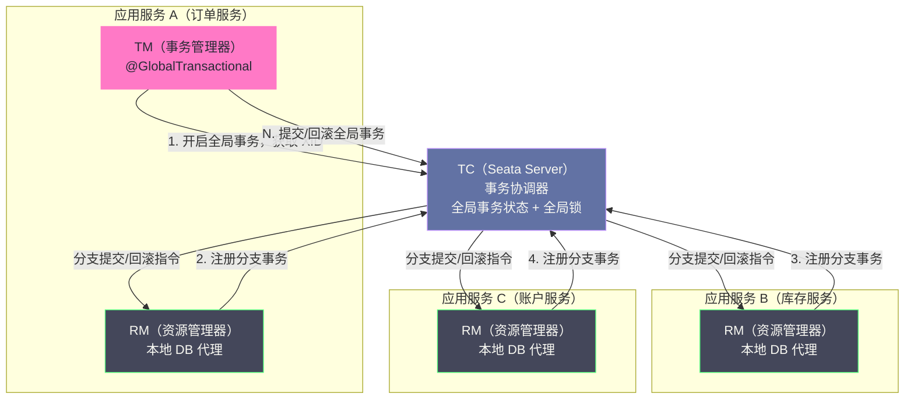
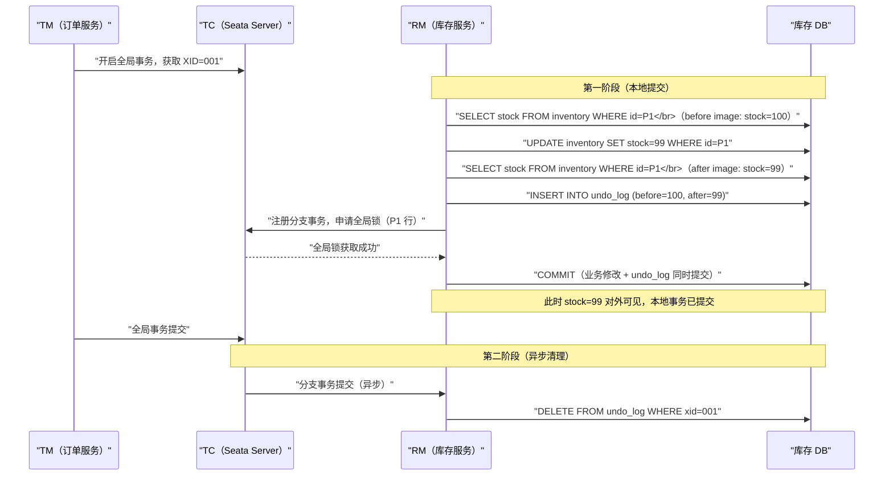
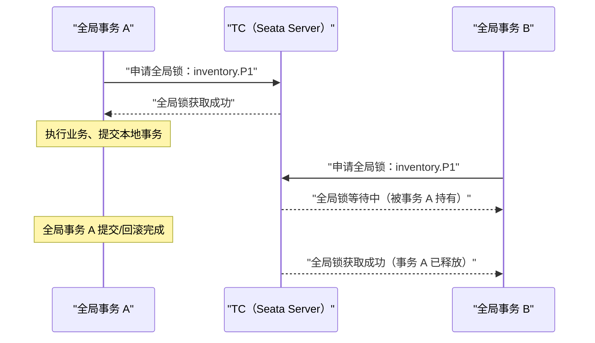
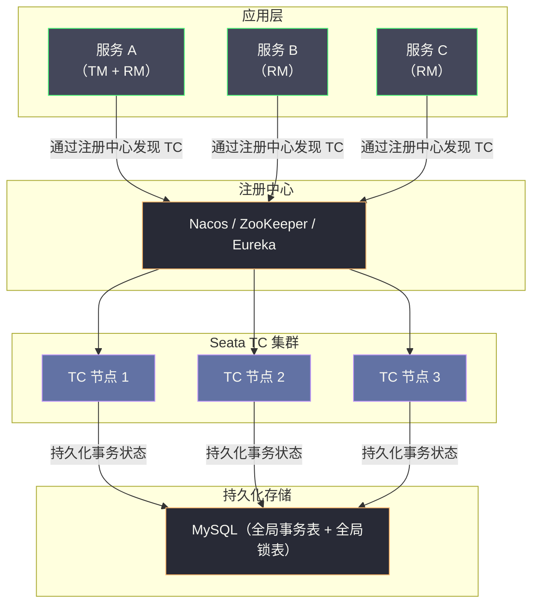

# 07 Seata 框架原理与工程实战

**摘要：**

Seata（Simple Extensible Autonomous Transaction Architecture）是阿里巴巴开源的分布式事务框架，也是目前 Java 生态中应用最广泛的分布式事务解决方案。本文聚焦于 Seata 的核心架构与底层原理，重点深度解析其标志性的 **AT 模式**——它是如何通过自动生成 undo_log、维护全局锁、以及两阶段异步提交来实现对业务代码"几乎零侵入"的分布式事务；同时介绍 TCC、Saga、XA 三种模式的实现机制与各自适用边界；最后通过典型的生产故障案例，揭示 Seata AT 模式的性能瓶颈与正确使用姿势。

---

## 第 1 章 Seata 的诞生背景与核心定位

### 1.1 从 Fescar 到 Seata：阿里巴巴的分布式事务演进

Seata 的前身是阿里巴巴内部的 **TXC（Taobao Transaction Constructor）** 框架，随后以 **GTS（Global Transaction Service）** 的形式在阿里云商业化。2019 年，阿里巴巴将其核心能力以 **Fescar（Fast & EAsy Commit And Rollback）** 为名开源，后更名为 **Seata**，并贡献给 Apache 软件基金会（Apache Seata，2023 年成为 Apache 顶级项目）。

Seata 的核心设计目标可以用一句话概括：**为微服务架构提供高性能、易使用的分布式事务解决方案，在最大程度降低业务侵入性的前提下保证分布式场景下的数据一致性。**

"最大程度降低业务侵入性"是 Seata 与其他分布式事务方案（尤其是 TCC）最大的区别。TCC 要求开发者为每个业务操作实现三个接口，对现有代码改动极大；而 Seata 的 AT 模式通过框架层的自动化机制，让开发者只需在方法上加一个注解（`@GlobalTransactional`），就能获得分布式事务能力，对业务代码几乎零侵入。

### 1.2 Seata 的四种事务模式

Seata 提供了四种分布式事务模式，覆盖了从强一致性到最终一致性的完整谱系：

| 模式 | 全名 | 一致性级别 | 业务侵入性 | 核心机制 |
| :--- | :--- | :--- | :--- | :--- |
| **AT 模式** | Automatic Transaction | 最终一致 | 极低（注解驱动）| 自动 undo_log + 全局锁 |
| **TCC 模式** | Try-Confirm-Cancel | 最终一致 | 高（需实现三接口）| 业务层资源预留 |
| **Saga 模式** | — | 最终一致 | 中（状态机配置）| 业务补偿 + 状态机编排 |
| **XA 模式** | eXtended Architecture | 强一致 | 低（注解驱动）| 数据库原生 XA 协议 |

本文重点解析 AT 模式，因为它是 Seata 的核心创新，也是绝大多数生产场景的首选。

---

## 第 2 章 Seata 的核心架构：三个角色的职责分工

### 2.1 角色定义

Seata 的架构由三个核心角色组成：

**TC（Transaction Coordinator，事务协调器）**：
- Seata Server，独立部署的服务
- 负责维护全局事务和分支事务的状态
- 接收 TM 的全局事务开启/提交/回滚请求
- 接收 RM 的分支事务注册请求
- 协调所有分支事务的提交或回滚
- 维护全局锁（AT 模式）

**TM（Transaction Manager，事务管理器）**：
- 嵌入在应用服务中的 SDK 组件
- 负责定义全局事务的边界（开启、提交、回滚）
- 通常对应 `@GlobalTransactional` 注解所在的方法
- 向 TC 申请开启全局事务，获取全局唯一 XID

**RM（Resource Manager，资源管理器）**：
- 嵌入在应用服务中的 SDK 组件
- 管理本地事务的执行
- 向 TC 注册分支事务，汇报分支事务状态
- 负责驱动分支事务的提交或回滚



### 2.2 XID 的传播机制

XID（全局事务 ID）是贯穿整个 Seata 分布式事务的核心标识符，它必须在所有参与服务之间传播，以便各 RM 能将本地分支事务关联到正确的全局事务。

Seata 的 XID 传播通过以下机制实现：

- **本地线程**：在当前服务的同一线程调用链中，XID 存储在 `RootContext`（基于 ThreadLocal）中，自动跨方法传递
- **RPC 调用**：Seata 提供了 Dubbo、Spring Cloud OpenFeign、gRPC 等主流 RPC 框架的拦截器，在发出 RPC 请求时自动将 XID 写入请求头，在接收端自动从请求头读取并绑定到 ThreadLocal

```java
// Seata 自动在 RPC 请求头中传播 XID
// Header Key: TX_XID (Dubbo) / seata-xid (HTTP)
// 开发者无需手动处理 XID 传播
```

---

## 第 3 章 AT 模式深度解析：自动化两阶段提交的设计哲学

### 3.1 AT 模式的核心创新

AT 模式的核心创新在于：**通过在 JDBC 驱动层（DataSource 代理）拦截 SQL 操作，自动生成 undo_log，将业务开发者从"手写 Try/Confirm/Cancel"的繁琐中解放出来**。

开发者只需：

```java
@GlobalTransactional  // 唯一需要添加的注解
public void placeOrder(String userId, String productId, int quantity) {
    // 以下是普通的业务代码，无需任何分布式事务相关改造
    orderService.createOrder(userId, productId, quantity);  // 调用订单服务
    inventoryService.deductStock(productId, quantity);       // 调用库存服务
    accountService.deductBalance(userId, price);             // 调用账户服务
}
```

Seata 在底层自动完成：
1. 开启全局事务，获取 XID
2. 拦截每个服务中的 SQL 操作，自动生成 undo_log
3. 注册分支事务到 TC
4. 全局提交时：异步通知各 RM 删除 undo_log
5. 全局回滚时：通知各 RM 根据 undo_log 回滚数据

### 3.2 AT 模式的两阶段设计

AT 模式对 2PC 做了一个关键改造：**将第二阶段（提交/回滚）变为异步操作**，从而将 2PC 的同步阻塞转化为异步最终一致性。

**第一阶段（Prepare）**：

1. TM 向 TC 申请开启全局事务，获取 XID
2. 业务代码执行 SQL，Seata DataSource 代理拦截 SQL：
   - 执行 SQL 前：查询数据当前值，保存为 **before image（前镜像）**
   - 执行 SQL
   - 执行 SQL 后：再次查询数据，保存为 **after image（后镜像）**
   - 将 before image 和 after image 组合成 **undo_log**，写入 `undo_log` 表
   - 向 TC 注册分支事务，申请全局锁
3. 本地事务提交（业务数据修改 + undo_log **在同一个本地事务中提交**）

注意：**第一阶段完成后，本地事务已经提交，数据变更立即对外可见**——这与 2PC 的 Prepare 阶段（数据未提交、行锁持有）有本质区别。

**第二阶段（Commit）**：

- 如果全局事务提交：TC 异步通知各 RM 删除对应的 undo_log，清理工作
- 如果全局事务回滚：TC 通知各 RM，RM 根据 undo_log 中的 before image 执行反向 SQL，将数据回滚到事务开始前的状态



### 3.3 undo_log 的数据结构

`undo_log` 表是 AT 模式的核心数据存储，需要在每个参与事务的业务数据库中创建：

```sql
CREATE TABLE undo_log (
    branch_id     BIGINT(20)   NOT NULL COMMENT '分支事务 ID',
    xid           VARCHAR(100) NOT NULL COMMENT '全局事务 ID',
    context       VARCHAR(128) NOT NULL COMMENT '序列化类型（jackson/kryo）',
    rollback_info LONGBLOB     NOT NULL COMMENT '回滚信息（JSON，包含 before/after image）',
    log_status    INT(11)      NOT NULL COMMENT '0=NORMAL / 1=GLOBAL_FINISHED',
    log_created   DATETIME(6)  NOT NULL,
    log_modified  DATETIME(6)  NOT NULL,
    PRIMARY KEY (id),
    UNIQUE KEY ux_undo_log (xid, branch_id)
) ENGINE=InnoDB COMMENT='AT transaction mode undo table';
```

`rollback_info` 字段存储的是 JSON 序列化的前后镜像数据，典型结构如下：

```json
{
  "branchType": "AT",
  "sqlUndoLogs": [
    {
      "sqlType": "UPDATE",
      "tableName": "inventory",
      "beforeImage": {
        "rows": [
          {
            "fields": [
              {"name": "id",    "type": 4,  "value": "P001"},
              {"name": "stock", "type": 4,  "value": 100}
            ]
          }
        ]
      },
      "afterImage": {
        "rows": [
          {
            "fields": [
              {"name": "id",    "type": 4,  "value": "P001"},
              {"name": "stock", "type": 4,  "value": 99}
            ]
          }
        ]
      }
    }
  ]
}
```

### 3.4 回滚时的执行逻辑：数据校验与反向 SQL

当 TC 通知 RM 执行回滚时，RM 的回滚流程并不是简单地"把 before image 写回去"，而是有一套严格的数据校验逻辑：

```
回滚执行流程：

1. 查询当前数据库中该行的实际值（current image）

2. 校验 current image 与 after image 是否一致：
   - 如果一致：说明没有其他事务修改过这行，可以安全回滚
     → 执行反向 SQL（将数据恢复为 before image）
   - 如果不一致：说明在全局事务执行期间，有其他事务修改了这行数据
     → 这是一个"脏写"场景，抛出异常，记录回滚失败日志，需要人工介入
     → Seata 会尝试根据配置的策略处理（如跳过回滚并告警）
```

**为什么需要校验 current image 与 after image 的一致性？**

这是为了防止以下危险场景：

```
时间线：
T1: 全局事务 A：UPDATE inventory SET stock = 99 WHERE id = P1
    （after image: stock=99）
T2: 全局事务 A 决定回滚
T3: 并发的本地事务 B：UPDATE inventory SET stock = 90 WHERE id = P1
    （本地事务，已提交，股=90）
T4: 全局事务 A 的回滚执行：
    current image = 90，after image = 99
    两者不一致！→ 不能盲目将 stock 改回 100（因为事务 B 的修改 90 会被丢失）
    → 回滚失败，需要人工决策
```

这个校验机制保护了数据的完整性，但也说明了 AT 模式的一个重要假设：**在全局事务执行期间，被修改的数据行不能被全局锁之外的其他事务修改**。这正是全局锁的作用。

### 3.5 全局锁：AT 模式的隔离性保障

**全局锁（Global Lock）**是 AT 模式实现隔离性的核心机制。它解决了 AT 模式第一阶段就提交本地事务后，数据对外可见可能导致的"脏读"和"脏写"问题。

**全局锁的获取时机**：RM 在第一阶段提交本地事务之前，向 TC 申请全局锁（锁定被修改的行的主键）。全局锁的粒度是"表名 + 主键值"。

**全局锁的释放时机**：
- 全局事务提交：第二阶段异步删除 undo_log 完成后，全局锁释放
- 全局事务回滚：回滚完成后，全局锁释放

**全局锁如何防止脏写**：

如果另一个 Seata 全局事务也想修改同一行（比如 P1 的库存），它在第一阶段提交前也需要申请全局锁。如果全局锁已被占用，它会等待或超时失败——这防止了两个全局事务同时修改同一行造成的"写写冲突"。



**全局锁的存储**：全局锁的状态存储在 TC（Seata Server）的内存或持久化存储中（取决于 TC 的存储模式：file、db、redis），不存储在业务数据库中。这是 AT 模式"对业务 DB 低侵入"的体现。

> [!warning] 全局锁 vs 数据库行锁
> 全局锁和数据库行锁是两个不同层面的锁：
> - **数据库行锁**：在 SQL 执行和本地事务提交期间持有，持续时间很短（毫秒级）
> - **全局锁**：在整个全局事务期间持有（从第一阶段提交到第二阶段完成），持续时间较长（可能数十毫秒到秒级）
>
> AT 模式用较长时间的**全局锁**替换了 2PC 的**数据库行锁**，换来了本地事务的快速提交（释放 DB 行锁），但全局锁的持有时间决定了不同全局事务之间写同一行的并发吞吐量。

### 3.6 AT 模式的"写隔离"与"读隔离"

AT 模式通过全局锁实现了"写隔离"，但**读隔离需要额外处理**：

**写隔离（Write Isolation）**：
- 全局事务 A 修改了某行，其他全局事务 B 修改同一行时需要竞争全局锁
- 保证了全局事务之间不会出现"脏写"

**读隔离的问题**：
- 全局事务 A 修改了某行后（本地事务已提交，但全局事务未结束），此时普通的 SELECT 查询可以读到这个已修改的值
- 如果全局事务 A 最终回滚，这个读到的值是"脏数据"
- 这是 AT 模式的**读未提交（Dirty Read）**问题

**解决读隔离的方案——SELECT FOR UPDATE**：

Seata 为 AT 模式提供了特殊的 `SELECT FOR UPDATE` 支持。当查询使用 `SELECT ... FOR UPDATE` 时，Seata DataSource 代理会在执行这条查询前，先检查全局锁是否被占用——如果目标行被全局锁占用，查询会等待全局锁释放后再执行，从而避免读到"未全局提交"的数据。

```java
// 使用 SELECT FOR UPDATE 获得读隔离（避免脏读）
@Transactional
public Stock queryStockWithLock(String productId) {
    return stockMapper.selectForUpdate(productId);
    // 对应 SQL: SELECT * FROM inventory WHERE id = ? FOR UPDATE
    // Seata 会检查全局锁，若 P001 行被全局事务占用则等待
}
```

> [!note] SELECT FOR UPDATE 的代价
> 使用 SELECT FOR UPDATE 虽然获得了读隔离，但也引入了额外的全局锁检查开销和可能的等待延迟。对于只读查询且可以接受短暂脏读的场景（如展示库存数量），不需要使用 SELECT FOR UPDATE。

---

## 第 4 章 AT 模式的性能特征与生产瓶颈

### 4.1 AT 模式的性能开销来源

AT 模式相对于普通本地事务有以下额外开销：

| 操作 | 额外开销 | 说明 |
| :--- | :--- | :--- |
| **before image 查询** | 1 次 SELECT | 每个 UPDATE/DELETE 前查询当前值 |
| **after image 查询** | 1 次 SELECT | 每个 UPDATE/DELETE 后查询新值 |
| **写 undo_log** | 1 次 INSERT | 与业务 SQL 在同一本地事务 |
| **向 TC 注册分支** | 1 次 RPC | 注册分支事务到 TC |
| **申请全局锁** | 1 次 RPC | 向 TC 申请全局锁 |
| **第二阶段删除 undo_log** | 1 次 DELETE（异步）| 全局提交后异步清理 |

在一个典型的全局事务中（3 个分支），额外的 SQL 操作约 9 次（3×3），额外的 RPC 约 6 次（3×2）。在局域网内，整体延迟增加约 5~15ms。

### 4.2 全局锁的并发瓶颈

全局锁是 AT 模式性能的核心瓶颈。考虑以下场景：

```
假设：商品 P001 的库存操作 QPS = 1000
全局事务平均持续时间 = 10ms（包括多次 RPC 和 DB 操作）
全局锁持有时间 = 10ms

单行数据的全局事务吞吐量上限：
= 1000ms / 10ms × 全局锁并发数
= 由于全局锁是行级串行化，上限 ≈ 100 TPS（针对 P001 这一行）
```

对于**热点数据**（如抢购商品的库存），全局锁会成为严重瓶颈。在高并发抢购场景，Seata AT 模式不适用，此时需要：
1. 使用 TCC 模式（通过 `frozen_stock` 字段实现无全局锁的并发预留）
2. 使用 Redis 等内存数据库处理热点数据，通过消息队列异步落库

### 4.3 生产典型故障：全局锁死锁

**场景**：两个全局事务互相等待对方持有的全局锁，形成死锁。

```
全局事务 A（XID=001）：
  步骤 1：申请 inventory.P001 全局锁 ✓
  步骤 2：需要申请 account.U001 全局锁...

全局事务 B（XID=002）：
  步骤 1：申请 account.U001 全局锁 ✓
  步骤 2：需要申请 inventory.P001 全局锁...

结果：A 等 B 释放 U001 锁，B 等 A 释放 P001 锁 → 死锁！
```

**解法**：Seata 内置了全局锁的超时机制（默认 30 秒），超时后全局事务回滚，不会永久死锁。但频繁死锁会导致大量事务回滚和重试，严重影响吞吐量。

**根本解法**：保证所有全局事务对同类资源的申请顺序一致（如总是先申请 inventory 锁，再申请 account 锁），避免锁序不一致导致的死锁。

### 4.4 undo_log 膨胀问题

在高并发场景下，`undo_log` 表的写入量与全局事务数量成正比。如果第二阶段的异步删除延迟过高（TC 负载高、网络抖动），`undo_log` 表会持续膨胀，导致：
- 表空间占用过大
- 索引扫描变慢
- 全局回滚时查询 undo_log 耗时增加

**生产建议**：
1. 为 `undo_log` 表设置定期清理任务，清理 7 天前且 `log_status = 1`（已全局完成）的记录
2. 监控 `undo_log` 表的记录数，设置告警阈值
3. 考虑将 `undo_log` 表放在单独的表空间，避免影响业务表的性能

---

## 第 5 章 Seata XA 模式：强一致性的新选项

### 5.1 XA 模式 vs AT 模式的根本区别

Seata 4.0 引入了 XA 模式，基于数据库原生的 XA 协议实现强一致性。

| 维度 | AT 模式 | XA 模式 |
| :--- | :--- | :--- |
| **一致性级别** | 最终一致（允许短暂脏读）| 强一致（读提交或更高）|
| **隔离性** | 全局锁实现写隔离，读隔离需 SELECT FOR UPDATE | 数据库原生隔离级别 |
| **第一阶段** | 本地事务提交，数据立即可见 | 本地事务 Prepare，数据不可见（行锁持有）|
| **侵入性** | 极低（自动 undo_log）| 极低（自动 XA 代理）|
| **性能** | 较高（异步第二阶段）| 较低（行锁持有至第二阶段）|
| **数据库支持** | 支持所有 MySQL 版本 | 需要数据库支持 XA 协议（MySQL 5.7+）|

XA 模式的使用与 AT 模式几乎相同，只需修改数据源配置：

```yaml
# application.yml
seata:
  data-source-proxy-mode: XA  # 切换为 XA 模式（默认是 AT）
```

### 5.2 Seata XA 如何解决了传统 XA 的单点问题

传统 XA 协议的核心问题是协调者单点——TM 崩溃后，处于 PREPARED 状态的分支事务无限阻塞。

Seata 通过让 **TC（Seata Server）承担 TM 的协调职责**，并将 TC 本身设计为可持久化、可高可用的组件来解决这个问题：

- TC 使用 DB 或 Redis 持久化全局事务状态
- TC 支持集群部署（主备或负载均衡）
- TC 崩溃恢复后，自动扫描未完成的全局事务，重新驱动第二阶段（COMMIT 或 ROLLBACK）

这使得 Seata XA 模式比传统 XA/2PC 具有更好的可用性，解决了"协调者永久故障"的问题。

---

## 第 6 章 Seata TCC 与 Saga 模式简述

### 6.1 Seata TCC 模式

Seata TCC 模式在 [[04 TCC 柔性事务模型原理与实践]] 中已经详细讨论过其原理。在 Seata 框架中，TCC 模式通过注解驱动实现：

```java
@TwoPhaseBusinessAction(
    name = "inventoryTccAction",
    commitMethod = "confirm",
    rollbackMethod = "cancel"
)
public interface InventoryTccAction {
    @BusinessActionContextParameter(paramName = "productId")
    boolean tryDeductStock(BusinessActionContext context, String productId, int quantity);
    boolean confirm(BusinessActionContext context);
    boolean cancel(BusinessActionContext context);
}
```

Seata 框架自动处理：
- XID 的传播和分支注册
- Confirm/Cancel 的自动重试
- 防悬挂的状态检查（Seata 1.5.1+ 内置了防悬挂机制）

### 6.2 Seata Saga 模式

Seata Saga 模式采用状态机引擎（基于 JSON 配置的 DSL）实现 Saga 的编排（Orchestration）模式。

状态机配置示例：

```json
{
  "Name": "CreateOrderSaga",
  "StartState": "CreateOrder",
  "States": {
    "CreateOrder": {
      "Type": "ServiceTask",
      "ServiceName": "orderService",
      "ServiceMethod": "createOrder",
      "CompensateState": "CancelOrder",
      "Next": "DeductInventory"
    },
    "DeductInventory": {
      "Type": "ServiceTask",
      "ServiceName": "inventoryService",
      "ServiceMethod": "deductStock",
      "CompensateState": "RestoreInventory",
      "Next": "ProcessPayment"
    },
    "ProcessPayment": {
      "Type": "ServiceTask",
      "ServiceName": "paymentService",
      "ServiceMethod": "processPayment",
      "Next": "Succeed"
    },
    "Succeed": {"Type": "Succeed"},
    "CancelOrder": {"Type": "ServiceTask", "ServiceName": "orderService", "ServiceMethod": "cancelOrder", "Next": "Fail"},
    "RestoreInventory": {"Type": "ServiceTask", "ServiceName": "inventoryService", "ServiceMethod": "restoreStock", "Next": "CancelOrder"},
    "Fail": {"Type": "Fail"}
  }
}
```

---

## 第 7 章 Seata TC 的高可用部署

### 7.1 TC 的存储模式

TC 的核心职责是维护全局事务状态和全局锁，其持久化存储支持三种模式：

| 存储模式 | 说明 | 适用场景 |
| :--- | :--- | :--- |
| **file** | 本地文件存储，性能最高 | 开发/测试环境 |
| **db** | 关系型数据库（MySQL）| 生产环境（高可靠）|
| **redis** | Redis 存储，性能高于 db | 生产环境（高性能，需要 Redis 持久化）|

生产环境推荐使用 `db` 模式，配合 MySQL 主从确保数据不丢失。

### 7.2 TC 集群部署架构



TC 集群的每个节点都连接同一个 MySQL，通过 MySQL 的行锁来保证全局锁的互斥性（避免多个 TC 节点同时为不同全局事务分配同一把全局锁）。

---

## 第 8 章 四种模式的综合选型指南

### 8.1 各模式适用场景汇总

| 场景特征 | 推荐模式 | 理由 |
| :--- | :--- | :--- |
| **普通跨库/跨服务，对业务侵入要求低** | AT 模式 | 零侵入，自动 undo_log，适合大多数场景 |
| **高并发热点数据（如库存扣减）** | TCC 模式 | 无全局锁，通过 frozen 字段实现高并发预留 |
| **强一致性要求（金融对账）** | XA 模式 | 数据库原生强一致，Seata 解决了协调者单点 |
| **复杂长流程（多步骤，有外部调用）** | Saga 模式 | 状态机编排，支持复杂控制流和超时补偿 |
| **跨异构资源（Redis + MySQL + HTTP）** | TCC 模式 或 Saga 模式 | AT/XA 模式依赖数据库代理，异构资源无法使用 |

### 8.2 生产部署 Checklist

在生产环境部署 Seata 时，以下检查项是最容易被遗漏的：

1. **每个业务数据库都创建了 `undo_log` 表**（AT 模式必须）
2. **TC 集群配置了持久化存储（db 或 redis 模式）**，避免 TC 重启后丢失事务状态
3. **TC 注册到了注册中心**，应用服务通过注册中心发现 TC，避免 TC 地址硬编码
4. **设置了合理的全局事务超时**（`seata.tm.commitRetryCount`、`seata.tm.rollbackRetryCount`）
5. **监控 undo_log 表大小**，配置定期清理任务
6. **AT 模式的 SELECT FOR UPDATE 需要显式启用**（对读隔离有要求的场景）
7. **@GlobalTransactional 方法内不能有 try-catch 吞掉异常**——Seata 依赖异常传播来触发全局回滚

> [!warning] 最常见的 AT 模式错误使用
> 在 `@GlobalTransactional` 方法内 try-catch 了子调用的异常，导致异常被吞掉，Seata 认为全局事务正常完成（提交），但实际上部分分支失败了，造成数据不一致：
> ```java
> @GlobalTransactional
> public void placeOrder() {
>     orderService.createOrder();
>     try {
>         inventoryService.deductStock();  // 抛出了异常
>     } catch (Exception e) {
>         log.error("库存扣减失败", e);
>         // 错误！吞掉了异常，Seata 不知道这里失败了
>     }
>     // Seata 以为全局事务成功，提交！但实际库存没扣
> }
> ```
> 正确做法：在 `@GlobalTransactional` 方法中让异常正常向上传播，由调用方决定是否重试或降级。

---

## 参考资料

1. Seata 官方文档. https://seata.apache.org/zh-cn/docs/overview/what-is-seata
2. 蒋岳伦（Seata 核心作者）. (2019). 阿里巴巴分布式事务实践. QCon 演讲.
3. Apache Seata GitHub 仓库. https://github.com/apache/incubator-seata
4. Seata AT 模式白皮书. https://seata.apache.org/zh-cn/docs/dev/mode/at-mode
5. 于毅. (2020). Seata 事务隔离详解. Seata 官方博客.
6. 阿里云 GTS 产品文档. https://help.aliyun.com/product/48444.html
7. Mohan, C., et al. (1992). ARIES: A Transaction Recovery Method. *ACM TODS, 17*(1), 94–162.

---

> [!note] 思考题
> 1. Seata 的 AT（Auto Transaction）模式通过代理数据源拦截 SQL——在执行 SQL 前记录 Before Image（修改前的数据），执行后记录 After Image。回滚时用 Before Image 恢复数据。AT 模式对业务代码几乎无侵入——只需要加 `@GlobalTransactional` 注解。但 AT 的全局锁在 Seata Server 上管理——高并发时 Seata Server 是否成为瓶颈？
> 2. AT 模式的脏写问题——如果全局事务 A 修改了行 X，全局事务 B 也修改了行 X 但先提交——A 回滚时用 Before Image 恢复 X 会覆盖 B 的修改。Seata 通过全局锁（行级锁）防止脏写——但这增加了锁等待。与 TCC 的显式'Try 预留'相比，AT 的隐式全局锁在什么场景下性能更差？
> 3. Seata 支持 AT、TCC、Saga 和 XA 四种模式。在选型时你如何决定——AT 适合简单场景（自动补偿、低侵入），TCC 适合性能要求高的场景（无全局锁），Saga 适合长事务，XA 适合需要强一致性的场景。在一个混合场景中（如部分服务用 AT、部分用 TCC），Seata 能否支持？
