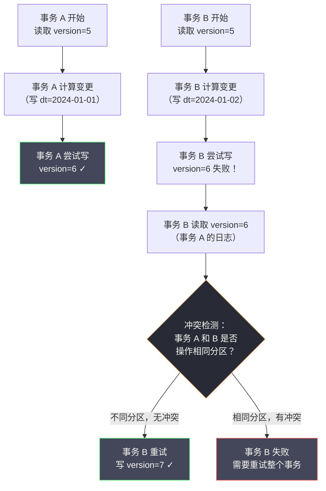

# 08 分布式事务在大数据场景下的实践

**摘要：**

分布式事务在 OLTP 领域已有成熟的解决方案（2PC、TCC、Saga），但在大数据领域，问题的形态完全不同：面对的不是几行记录的原子更新，而是亿级规模数据的一致性写入、跨引擎（Hive/Spark/Flink）的数据一致性协调、以及流批一体架构下的端到端 Exactly-Once 语义。本文系统梳理大数据场景的一致性挑战与主流解决方案：从 Hive 的悲观锁写入困境，到 Delta Lake / Apache Iceberg 通过 ACID 事务支持解决数据湖的并发写问题；深入剖析 Spark 的写幂等性设计；解析 Flink 的两阶段提交 Sink 如何实现端到端 Exactly-Once；最后探讨数据仓库场景下的最终一致性保障策略。

---

## 第 1 章 大数据场景的一致性挑战：与 OLTP 的本质差异

### 1.1 大数据场景的一致性需求有何不同

在前面的文章中，我们深入探讨了 OLTP 场景的分布式事务——它的核心关注点是：多个微服务之间的**业务操作原子性**，以及并发事务的**数据读写隔离性**。

但在大数据场景中，问题的形态发生了根本性的变化：

**（1）数据规模不同**：OLTP 事务通常涉及几行到几千行数据；大数据场景的单次写入可能涉及数亿行、TB 级别的数据。你无法用一个单一的数据库事务来保护这个量级的数据写入。

**（2）计算模型不同**：OLTP 是逐行处理的在线事务；大数据是批量处理（MapReduce、Spark Batch）或流式处理（Flink Streaming），计算任务可能运行数小时，期间任何节点都可能失败并重启。

**（3）存储系统不同**：OLTP 使用关系型数据库，原生支持 ACID 事务；大数据存储通常是 [[HDFS]]（Hadoop Distributed File System）、[[S3]] 等对象存储，或基于它们构建的 [[Hive]] 表，这些系统的原子性模型与关系型数据库截然不同。

**（4）并发模型不同**：OLTP 关注高并发短事务的冲突；大数据关注的是：**一个长时间运行的批处理任务失败后如何安全重试（幂等性）**，以及**多个并发写入任务如何避免相互覆盖数据（写并发控制）**。

**（5）一致性目标不同**：OLTP 追求强一致性，每个读操作都能看到最新提交的数据；大数据通常可以接受分钟级甚至小时级的最终一致性，但对**数据完整性（不重复、不丢失）**有严格要求。

### 1.2 大数据一致性问题的四个核心场景

大数据场景的一致性问题主要体现在以下四个方面：

**场景一：批处理任务的写幂等性**

一个 Spark 批处理任务运行 2 小时后，在最后的写入阶段因为某个 Executor 故障失败。任务重新调度并重跑——问题是：如何保证重跑的任务不会与第一次失败任务已写出的部分数据产生重叠（数据重复）？

**场景二：数据湖的并发写一致性**

多个 Spark 任务同时向同一张 Hive 表的同一个分区写入数据，如何避免并发写入导致的数据相互覆盖？HDFS 和 S3 都不提供文件级别的原子性保障，一个任务写到一半崩溃时，另一个任务可能看到不完整的中间状态。

**场景三：流处理的端到端 Exactly-Once**

一个 Flink 实时流处理任务，从 Kafka 消费数据，经过计算后写入 MySQL 和 HDFS。如何保证：每条输入消息恰好被处理一次，不丢失、不重复？这是流处理领域最难解决的问题之一。

**场景四：跨引擎数据一致性**

上游 Spark ETL 任务向 Hive 写入数据，下游 Hive SQL 查询需要读取这批数据。如何保证下游查询看到的是完整的一批数据，而不是上游写到一半的中间状态？

---

## 第 2 章 Hive 的写入一致性困境与传统解决方案

### 2.1 HDFS 的文件系统语义：原子性有限

理解 Hive 的一致性问题，需要先理解 [[HDFS]] 的文件语义。

HDFS 提供了以下原子性保证：
- **文件重命名（rename）是原子的**：将文件从路径 A 移动到路径 B 是一个原子操作（在同一个 NameNode 元数据管理范围内）
- **目录创建（mkdir）是原子的**
- **文件追加写入（append）不是原子的**：并发追加可能导致数据损坏
- **文件内容写入（write）不是原子的**：写到一半失败会留下不完整的文件

这意味着 HDFS 本身不适合作为多写者并发修改同一文件的存储系统，但可以通过"先写临时目录，再原子 rename 到目标目录"的模式来实现单次写入的原子性。

### 2.2 Hive 的写入过程与一致性保障机制

Hive 在 HDFS 之上实现了一套写入机制，利用 HDFS 的 rename 原子性来保证单次写入操作的原子性：

**Hive 写入的标准流程**：

```
1. 创建临时目录：/user/hive/warehouse/orders/.hive-staging_xxx/
2. 所有 MapReduce/Spark Task 将输出写入临时目录
3. 所有 Task 成功完成后，Hive 将文件从临时目录 rename 到最终目录
4. 最终目录：/user/hive/warehouse/orders/dt=2024-01-01/
```

这个设计保证了：只有当所有 Task 都成功完成时，数据才对读者可见（因为 rename 是原子的）。如果任何 Task 失败，临时目录中的数据被清理，对读者完全不可见。

**这个机制的局限性**：

1. **只保护单次完整写入，不保护并发写入**：如果两个任务同时向同一分区写入，它们各自使用独立的临时目录，最后的 rename 会相互覆盖，导致其中一个任务的数据丢失。

2. **Hive ACID（行级事务）性能差**：Hive 0.13+ 引入了基于 [[ORC]] 文件格式的 ACID 事务支持，但其实现机制（delta 目录 + Compaction）在高并发写入下性能极差，几乎不适合生产使用。

3. **S3 上的 rename 不是原子的**：当 Hive 部署在 AWS S3（而非 HDFS）上时，S3 的 rename 实际上是"复制 + 删除"操作，不是原子的，这使得上述保障机制在 S3 上完全失效。

> [!warning] S3 rename 陷阱
> 这是许多公司迁移到云端数据湖时遇到的第一个重大坑：在本地 HDFS 上运行良好的 ETL 任务，迁移到 S3 后开始出现数据丢失或重复。根本原因就是 S3 的 `rename` 不是原子操作，Hive/Spark 的写入保障假设失效。解决方案是使用支持 S3 原子写入的数据湖格式（Delta Lake / Iceberg），或使用 S3Guard 等辅助工具。

### 2.3 传统的分区级写入策略

在数据湖格式成熟之前，大数据工程师通常采用以下策略来规避并发写入问题：

**策略一：分区隔离写入**

每个写入任务只写入自己专属的分区，不同任务写不同分区，从设计层面避免并发写入冲突：

```sql
-- 任务 A 写入 2024-01-01 的数据
INSERT OVERWRITE TABLE orders PARTITION (dt='2024-01-01')
SELECT * FROM orders_staging WHERE dt = '2024-01-01';

-- 任务 B 写入 2024-01-02 的数据（不冲突）
INSERT OVERWRITE TABLE orders PARTITION (dt='2024-01-02')
SELECT * FROM orders_staging WHERE dt = '2024-01-02';
```

这是最简单有效的方案，但它要求写入任务之间在分区层面没有重叠。

**策略二：INSERT OVERWRITE 而非 INSERT INTO**

`INSERT OVERWRITE` 会完全替换分区内的数据，天然是幂等的——无论执行多少次，结果都是最新一次运行的完整数据：

```sql
-- 幂等：每次运行都完整覆盖整个分区，不会重复
INSERT OVERWRITE TABLE dwd_orders PARTITION (dt='2024-01-01')
SELECT order_id, user_id, amount, status
FROM ods_orders
WHERE dt = '2024-01-01';
```

这个策略的核心思想是：**用"覆盖"代替"追加"，将写入操作从"累加型"变为"幂等型"**。即使任务失败重跑，也不会有数据重复问题。

**策略三：写完整性检验**

在任务结束时，通过比较输出行数与预期行数来验证写入完整性：

```python
# PySpark 示例：写入后验证完整性
result_df.write.mode("overwrite").partitionBy("dt").parquet(output_path)

# 回读验证
written_count = spark.read.parquet(output_path).filter(f"dt='{target_date}'").count()
expected_count = result_df.filter(f"dt='{target_date}'").count()

if written_count != expected_count:
    raise Exception(f"写入完整性验证失败：期望 {expected_count} 行，实际 {written_count} 行")
```

---

## 第 3 章 数据湖格式的 ACID 革命：Delta Lake 与 Apache Iceberg

### 3.1 为什么需要数据湖格式

传统 Hive + HDFS/S3 的架构在以下场景下暴露了严重的局限性：

- **并发写入**：多个任务同时写同一张表，数据相互覆盖
- **小文件问题**：频繁的小批量写入产生大量小文件，严重影响查询性能
- **时间旅行（Time Travel）**：无法查询某个历史时间点的数据快照
- **Schema 演进**：在不影响现有数据的情况下修改表结构非常困难
- **ACID 支持**：无法安全地执行 UPDATE/DELETE 操作

[[Delta Lake]] 和 [[Apache Iceberg]] 正是为了解决这些问题而出现的开放数据湖表格式，它们在 HDFS/S3 之上构建了一套事务日志机制，为数据湖带来了 ACID 语义。

### 3.2 Delta Lake：基于事务日志的 ACID 实现

**Delta Lake** 是 Databricks 于 2019 年开源的数据湖格式，现已成为 Linux Foundation 下的顶级项目。

**Delta Lake 的核心机制：事务日志（Transaction Log）**

Delta Lake 在每张表的根目录下维护一个 `_delta_log` 目录，其中存储了该表所有历史写入操作的事务日志：

```
/user/data/orders/
├── _delta_log/
│   ├── 00000000000000000000.json   # 建表操作日志
│   ├── 00000000000000000001.json   # 第 1 次写入日志
│   ├── 00000000000000000002.json   # 第 2 次写入日志
│   ├── 00000000000000000010.checkpoint.parquet  # 检查点（合并历史日志）
│   └── _last_checkpoint             # 指向最新检查点
├── part-00000-xxxxx.parquet        # 实际数据文件
├── part-00001-xxxxx.parquet
└── ...
```

每个 JSON 日志文件（称为 **commit file**）记录了一次事务的操作内容，包含以下动作类型：

- **add**：新增了哪些数据文件（及其统计信息）
- **remove**：标记删除了哪些数据文件（逻辑删除，物理文件还在）
- **metaData**：表 Schema 或 Partition 信息的变更
- **protocol**：表格式版本信息
- **commitInfo**：提交者信息、时间戳、操作类型

一次典型的 INSERT 操作的日志：

```json
{
  "commitInfo": {
    "timestamp": 1705000000000,
    "operation": "WRITE",
    "operationParameters": {"mode": "Append", "partitionBy": "[\"dt\"]"},
    "isBlindAppend": true
  }
}
{
  "add": {
    "path": "dt=2024-01-01/part-00000-abc123.parquet",
    "partitionValues": {"dt": "2024-01-01"},
    "size": 1234567,
    "modificationTime": 1705000000000,
    "dataChange": true,
    "stats": "{\"numRecords\":50000,\"minValues\":{\"order_id\":1},\"maxValues\":{\"order_id\":50000}}"
  }
}
```

### 3.3 Delta Lake 的并发控制：乐观并发 + 冲突检测

Delta Lake 使用**乐观并发控制（Optimistic Concurrency Control）**来处理并发写入：

**基本流程**：
1. 读取当前最新的事务日志版本号（假设为 version=5）
2. 在本地计算需要新增或删除哪些数据文件
3. 尝试将事务日志原子写入 version=6（下一个版本）
4. 如果写入成功，提交完成
5. 如果写入失败（已有另一个事务占用了 version=6），进入冲突检测

**冲突检测的核心逻辑**：

当两个并发事务都尝试写入 version=6 时，Delta Lake 会检测它们是否真的冲突：

- **如果两个事务写入的是不同分区**（如一个写 dt=2024-01-01，另一个写 dt=2024-01-02）：**无冲突，后写入的事务重试写 version=7**，两者数据都被保留
- **如果两个事务写入的是同一分区**：
  - 如果都是 Append 操作（添加新数据）：通常无冲突，允许并发 Append
  - 如果其中一个是 Overwrite 操作：冲突，后者失败，需要重试



**S3 上的原子性保证**：

Delta Lake 使用 S3 的**条件写入（Conditional PUT）**或文件名唯一性来保证事务日志写入的原子性：每个版本的日志文件名（`00000000000000000006.json`）是全局唯一的，两个并发事务不能同时成功写入同名文件——利用 S3 的"文件不覆盖"语义实现了乐观锁。

### 3.4 Delta Lake 的时间旅行：基于事务日志的历史快照

由于 Delta Lake 保留了完整的事务日志，可以精确重建任意历史时间点的数据快照：

```python
# PySpark：查询 24 小时前的数据快照
df = spark.read.format("delta") \
    .option("timestampAsOf", "2024-01-01 12:00:00") \
    .load("/user/data/orders")

# 或者通过版本号查询
df = spark.read.format("delta") \
    .option("versionAsOf", 5) \
    .load("/user/data/orders")
```

这个能力在数据修复场景中极其有用：当发现某次 ETL 写入了错误数据时，可以直接回滚到上一个版本，而无需从原始数据重跑整个处理链路。

### 3.5 Apache Iceberg：更开放的数据湖格式

[[Apache Iceberg]] 是 Netflix 开源、现为 Apache 顶级项目的数据湖格式，与 Delta Lake 并列为当前最主流的两种数据湖表格式。

Iceberg 的核心架构与 Delta Lake 类似，也是基于快照和元数据文件来实现 ACID：

```
Iceberg 元数据层次结构：

Catalog（目录）
  └── Table（表）
        └── Snapshot（快照，每次写入创建一个新快照）
              ├── Manifest List（清单列表，记录此快照包含哪些 Manifest 文件）
              └── Manifest File（清单文件，记录此批数据文件的路径和统计信息）
                    └── Data Files（实际数据文件，Parquet/ORC/Avro）
```

**Iceberg 与 Delta Lake 的关键差异**：

| 维度 | Delta Lake | Apache Iceberg |
| :--- | :--- | :--- |
| **元数据格式** | JSON 事务日志 | Avro 格式的 Manifest 文件 |
| **并发控制** | 乐观并发 + 冲突检测 | 乐观并发 + 原子 Catalog 替换 |
| **分区演进** | 支持（但有限制）| 支持（更灵活，无需重写数据）|
| **Schema 演进** | 支持 | 支持（更完善，包括列重命名）|
| **引擎支持** | Spark（最佳）、Trino、Hive | Spark、Flink、Trino、Hive（更广泛）|
| **流式写入** | 支持（Delta Streaming）| 支持（Flink Iceberg Sink）|
| **删除文件** | 逻辑删除 + Vacuum 物理清理 | 支持 Position Delete 和 Equality Delete |
| **开源治理** | Linux Foundation | Apache Software Foundation |

> [!info] 如何选择 Delta Lake 还是 Iceberg
> 如果你的大数据栈以 Databricks / Spark 为核心，Delta Lake 是自然选择，与 Databricks 平台深度集成；如果你需要跨多个计算引擎（Spark + Flink + Trino + Hive）统一访问同一张表，Iceberg 的引擎兼容性更好。两者都在快速发展，能力差距在缩小。

---

## 第 4 章 Spark 批处理的幂等写入设计

### 4.1 Spark 任务的失败重试与写入幂等性

Spark 批处理任务在运行过程中可能因为以下原因失败并重试：
- Executor OOM 导致 Task 失败（Spark 会自动重试 Task）
- 节点故障导致 Executor 丢失（Driver 会重新调度）
- 整个 Application 级别的失败（需要外部系统重新提交 Application）

对于 Task 级别的重试（Spark 内部自动处理），Spark 通过**推测执行（Speculative Execution）**和**Task 级别的原子写入**来保证幂等性：每个 Task 将输出写入带有 Task ID 和 Attempt ID 的唯一临时文件名，最终由 Commit Protocol 决定哪些文件被采用。

对于 Application 级别的重跑，需要应用层设计幂等：

**方案一：分区级 Overwrite（最常用）**

```python
# 设置动态分区覆盖（只覆盖本次写入的分区，不影响其他分区）
spark.conf.set("spark.sql.sources.partitionOverwriteMode", "dynamic")

result_df.write \
    .mode("overwrite") \
    .partitionBy("dt") \
    .parquet(output_path)

# 无论重跑多少次，每个分区都是最新一次运行的完整数据
```

这是最简单也是最广泛使用的幂等写入策略。`dynamic` 分区覆盖模式确保只覆盖本次写入涉及的分区，不影响其他分区的数据。

**方案二：基于写入版本的文件命名**

对于不能简单 Overwrite 的场景（如增量写入），使用写入版本号或时间戳作为输出路径的一部分，保证每次运行的输出互不干扰：

```python
import time

run_id = int(time.time())  # 或使用 pipeline 调度系统提供的 run_id

# 每次运行写到独立的版本目录
result_df.write \
    .parquet(f"{base_path}/version={run_id}/")

# 下游通过读取最新版本来获取最新数据
# 可以用一个 "latest" 软链接指向最新版本
```

**方案三：使用 Delta Lake / Iceberg 的 MERGE INTO**

对于需要 UPSERT 语义（更新已有行、插入新行）的场景，Delta Lake 和 Iceberg 都支持 `MERGE INTO` 操作，天然是幂等的：

```python
# Delta Lake MERGE INTO：幂等 UPSERT
from delta.tables import DeltaTable

delta_table = DeltaTable.forPath(spark, "/user/data/orders")

delta_table.alias("target").merge(
    source=new_data_df.alias("source"),
    condition="target.order_id = source.order_id"
).whenMatchedUpdate(set={
    "status": "source.status",
    "updated_at": "source.updated_at"
}).whenNotMatchedInsertAll().execute()

# 无论执行多少次，结果相同（幂等）
```

### 4.2 Spark 写入数据库的幂等性

当 Spark 向关系型数据库（MySQL/PostgreSQL）写入数据时，幂等性需要在 SQL 层面保证：

```python
# 使用 INSERT IGNORE 或 ON DUPLICATE KEY UPDATE 实现幂等写入
def write_to_mysql_idempotent(df, table_name, key_columns):
    # 方案 1：INSERT IGNORE（主键冲突时忽略）
    df.write \
        .format("jdbc") \
        .option("url", jdbc_url) \
        .option("dbtable", table_name) \
        .option("insertMode", "insert_ignore") \  # Spark JDBC 扩展选项
        .save()
    
    # 方案 2：自定义 UPSERT SQL（推荐，灵活性更高）
    # 通过 foreachBatch 执行自定义 SQL
    def upsert_to_mysql(batch_df, batch_id):
        batch_df.createOrReplaceTempView("batch_data")
        # 先写临时表，再 UPSERT 到目标表
        # ...
    
    streaming_query.writeStream.foreachBatch(upsert_to_mysql).start()
```

---

## 第 5 章 Flink 的端到端 Exactly-Once：两阶段提交 Sink

### 5.1 什么是端到端 Exactly-Once

在流处理领域，"恰好一次（Exactly-Once）"语义是指：**每条输入消息对输出的影响，恰好等同于它被处理了一次**。

实现端到端 Exactly-Once 需要在整个链路上协调：
- **消息源（Source）**：支持可重放（Kafka 通过 offset 重放）
- **算子内部状态**：通过 Checkpoint 持久化，崩溃后从 Checkpoint 恢复
- **输出 Sink**：支持事务写入或幂等写入

对于输出 Sink，实现 Exactly-Once 有两种路径：
1. **幂等写入**：每条消息的输出是幂等的，重复处理不影响结果（如写入带主键的数据库表，重复 UPSERT 结果相同）
2. **事务写入**：利用 Flink 的两阶段提交机制，将 Flink 的 Checkpoint 与外部系统的事务绑定

### 5.2 Flink Checkpoint 与两阶段提交 Sink

[[Flink]] 的 Checkpoint 机制通过 Chandy-Lamport 分布式快照算法，定期将所有算子的状态持久化到可靠存储（HDFS/S3）。崩溃后，Flink 从最新的 Checkpoint 恢复，重新处理 Checkpoint 之后的输入数据。

但仅有 Checkpoint 不足以保证 Exactly-Once 端到端：Flink 内部的状态是 Exactly-Once，但如果 Sink 在 Checkpoint 完成后崩溃，已经写出的部分数据不会回滚，重跑时会产生重复。

Flink 的 **TwoPhaseCommitSinkFunction** 正是为了解决这个问题：它将 Sink 的写入过程与 Flink Checkpoint 的两阶段完成过程绑定在一起。

**核心原理**：

```
Flink Checkpoint 的两阶段过程（与 Flink TwoPhaseCommitSink 的绑定）：

Phase 1（Pre-commit，对应 Checkpoint 的 snapshotState）：
  - Sink 将当前批次的数据写入"预提交缓冲"（如 Kafka 事务或文件的临时目录）
  - 将事务 handle 保存到 Checkpoint 状态中
  - Checkpoint 完成时，Flink 触发 notifyCheckpointComplete

Phase 2（Commit，对应 notifyCheckpointComplete）：
  - 收到 Checkpoint 完成通知后，Sink 真正提交事务（Kafka commit / 文件 rename）
  - 如果在 Phase 2 之前崩溃，从 Checkpoint 恢复后 Sink 会重新读取上次的事务 handle 并重新 Commit
```

**以 Flink Kafka Sink 的 Exactly-Once 为例**：

Flink 的 Kafka Producer 在 Exactly-Once 模式下使用 Kafka 的事务 API：

```java
// Flink KafkaSink 的 Exactly-Once 配置
KafkaSink<String> sink = KafkaSink.<String>builder()
    .setBootstrapServers("kafka:9092")
    .setRecordSerializer(KafkaRecordSerializationSchema.builder()
        .setTopic("output-topic")
        .setValueSerializationSchema(new SimpleStringSchema())
        .build())
    .setDeliverGuarantee(DeliveryGuarantee.EXACTLY_ONCE)  // 关键配置
    .setTransactionalIdPrefix("my-flink-job")  // Kafka 事务 ID 前缀
    .build();
```

**内部执行流程**：

```
[Checkpoint n 开始]
Flink Kafka Sink：
  1. 开始 Kafka 事务（beginTransaction）
  2. 将消息写入 Kafka 事务（消息进入 Kafka，但对消费者不可见）
  3. Checkpoint 触发 snapshotState：保存当前 Kafka 事务 ID 到 Checkpoint 状态
  4. Checkpoint 完成（notifyCheckpointComplete 被调用）：
     → Kafka 事务 Commit（消息对消费者可见）
  5. 开始下一个 Checkpoint 的新事务

[如果在步骤 4 之前崩溃]：
  - 从 Checkpoint n 恢复
  - 读取 Checkpoint 中保存的 Kafka 事务 ID
  - 发现该事务未 Commit → 执行 Commit（保证消息被发出）
  - 或者该事务超时已被 Kafka 回滚 → 重新处理这批消息（At-Least-Once，需配合消费者幂等）
```

> [!warning] Kafka 事务超时的陷阱
> Flink + Kafka Exactly-Once 要求 Kafka 的事务超时时间（`transaction.timeout.ms`）大于 Flink 的 Checkpoint 间隔 × 最大重试次数。如果 Kafka 事务超时，处于进行中的事务会被 Kafka 自动回滚，导致 Flink 崩溃恢复后无法 Commit 已写入的消息，必须重新处理。在 Checkpoint 间隔较长（如 5 分钟）的情况下，这个超时设置极易忽略。

### 5.3 Flink 写 HDFS/S3 的 Exactly-Once：StreamingFileSink

[[Flink]] 的 `FileSink`（老版本是 `StreamingFileSink`）实现了向 HDFS/S3 写文件的 Exactly-Once：

```java
FileSink<String> sink = FileSink
    .forRowFormat(new Path("hdfs://namenode:9000/output"), new SimpleStringEncoder<String>("UTF-8"))
    .withRollingPolicy(
        DefaultRollingPolicy.builder()
            .withRolloverInterval(Duration.ofMinutes(5))  // 每 5 分钟滚动一个文件
            .withInactivityInterval(Duration.ofMinutes(1))
            .withMaxPartSize(MemorySize.ofMebiBytes(128))
            .build())
    .build();
```

FileSink 的 Exactly-Once 机制同样基于两阶段提交：

- **进行中状态（In-Progress）**：数据被写入 `.inprogress` 临时文件
- **Pending 状态（Checkpoint 触发时）**：临时文件被重命名为 `.pending` 文件，文件句柄被保存到 Checkpoint
- **Committed 状态（Checkpoint 完成后）**：`.pending` 文件被 rename 为最终文件名

```
文件状态流转：
part-0-0.inprogress  → （Checkpoint 触发）→  part-0-0.pending  → （Checkpoint 完成）→  part-0-0
```

这个机制利用了 HDFS rename 的原子性：只有 Checkpoint 真正完成后，数据文件才从 `.pending` 变为最终可见的文件，对下游查询可见。

---

## 第 6 章 跨引擎数据一致性：数仓 ETL 的最终一致性保障

### 6.1 数仓 ETL 的一致性需求

在典型的数据仓库架构中，数据经过多层 ETL 处理：

```
ODS（操作数据层）→ DWD（明细数据层）→ DWS（汇总数据层）→ ADS（应用数据层）
```

每层之间的 ETL 任务需要保证：
- **完整性**：上游写完整才触发下游读取（不能读到上游写到一半的数据）
- **一致性**：下游看到的上游数据是某个时间点的完整快照
- **幂等性**：下游 ETL 失败重跑时，不会产生重复数据

### 6.2 分区完整性检验：_SUCCESS 文件机制

Hadoop 生态的传统做法是：**任务成功完成后在输出目录写一个 `_SUCCESS` 标记文件**，下游任务读取数据前先检查 `_SUCCESS` 文件是否存在。

```python
# 上游任务：写完数据后创建 _SUCCESS 标记
result_df.write.mode("overwrite").parquet(output_path)
# 写成功后，创建 _SUCCESS 标记（Spark 默认会自动创建）
# /output/dt=2024-01-01/_SUCCESS

# 下游任务：先检查 _SUCCESS 标记
from pathlib import Path
import subprocess

def check_partition_ready(hdfs_path, date):
    success_path = f"{hdfs_path}/dt={date}/_SUCCESS"
    result = subprocess.run(
        ["hdfs", "dfs", "-test", "-e", success_path],
        capture_output=True
    )
    return result.returncode == 0

if not check_partition_ready("/user/data/dwd_orders", "2024-01-01"):
    raise Exception("上游数据未就绪，等待重试")
```

> [!warning] `_SUCCESS` 文件的局限性
> `_SUCCESS` 文件只保证"任务整体成功"，不保证"数据完整性"。如果任务成功但某个 Task 输出的行数异常（如空分区），`_SUCCESS` 文件仍然会存在。建议在关键路径上额外做行数验证。

### 6.3 基于任务调度系统的依赖管理

在工程实践中，数仓 ETL 的任务依赖通常由调度系统（[[Apache Airflow]]、[[DolphinScheduler]]、阿里云 DataWorks）管理：

- 上游任务成功 → 调度系统将下游任务加入执行队列
- 上游任务失败 → 调度系统阻止下游任务执行，并触发告警

这种"任务级依赖"是大数据场景下最实用的最终一致性保障机制——它不依赖任何底层存储的事务特性，而是在调度层面保证"上游数据就绪后才执行下游"。

### 6.4 数据血缘与一致性版本管理

在复杂的数仓系统中，同一份源数据可能被多条 ETL 链路并行处理，产生多张下游表。如何保证这些下游表之间的数据一致性（即它们都基于同一个上游数据版本）？

**解决方案：版本化数据管理**

在 Delta Lake / Iceberg 的 Time Travel 能力支持下，可以实现版本化的 ETL：

```python
# 上游 ETL 写入时记录当前版本号
orders_table = DeltaTable.forPath(spark, "/data/dwd_orders")
current_version = orders_table.history(1).select("version").collect()[0][0]
print(f"dwd_orders 当前版本：{current_version}")

# 下游多个 ETL 任务都基于同一版本号读取上游数据，保证一致
df_for_agg = spark.read.format("delta") \
    .option("versionAsOf", current_version) \
    .load("/data/dwd_orders")
```

这种方式保证了所有基于同一批上游数据的下游 ETL 任务都读到相同的数据快照，避免了"A 任务在版本 N 运行，B 任务在版本 N+1 运行"导致的数据不一致。

---

## 第 7 章 大数据分布式事务的总结与选型矩阵

### 7.1 各场景解决方案速查表

| 场景 | 推荐方案 | 核心机制 |
| :--- | :--- | :--- |
| **Spark 批处理写入 HDFS，幂等重跑** | INSERT OVERWRITE + 动态分区 | 覆盖写替代追加写 |
| **多任务并发写同一张 Hive 表** | Delta Lake / Iceberg + 乐观并发 | 事务日志 + 冲突检测 |
| **Spark 批处理 UPSERT（更新+插入）** | Delta Lake MERGE INTO / Iceberg MERGE INTO | 事务日志原子 UPSERT |
| **需要数据回滚（误操作恢复）** | Delta Lake / Iceberg 时间旅行 | 事务日志版本快照 |
| **Flink 流处理 → Kafka，Exactly-Once** | Flink + Kafka 事务（TwoPhaseCommit）| Checkpoint + Kafka 事务 API |
| **Flink 流处理 → HDFS，Exactly-Once** | Flink FileSink（两阶段提交）| Checkpoint + pending 文件 rename |
| **Flink 流处理 → MySQL，Exactly-Once** | Flink JDBC Sink + 幂等 UPSERT | 主键 ON DUPLICATE KEY UPDATE |
| **数仓 ETL 上下游数据一致性** | 调度系统依赖 + _SUCCESS 标记 | 任务级依赖管理 |
| **跨引擎读写同一张表的版本一致性** | Delta Lake / Iceberg 版本化读取 | 时间旅行 + 版本号绑定 |
| **跨引擎强一致性（极少见）** | [[Apache Hudi]] + Flink CDC | COW/MOR 表格式 + 增量拉取 |

### 7.2 大数据 vs OLTP 分布式事务的范式对比

| 维度 | OLTP 分布式事务 | 大数据分布式一致性 |
| :--- | :--- | :--- |
| **数据规模** | 行级（几行~几千行）| 亿级（GB~TB）|
| **事务时长** | 毫秒~秒 | 分钟~小时 |
| **一致性要求** | 强一致（ACID）| 最终一致（最优先保证完整性）|
| **核心难点** | 原子性 + 隔离性 | 幂等性 + 完整性 + 并发写控制 |
| **主流解决方案** | 2PC、TCC、Saga、Seata | Delta Lake/Iceberg 事务、Flink 两阶段提交、任务调度依赖 |
| **回滚机制** | 数据库 ROLLBACK（毫秒级）| 版本回滚（重新读取历史快照）|
| **并发控制** | 数据库锁（行锁/表锁）| 乐观并发（版本号 + 冲突检测）|
| **读取语义** | 实时强一致读 | 快照隔离读（读到某个完整版本）|

### 7.3 结语：两个世界的汇聚

回顾整个分布式事务专栏，我们从 [[01 分布式事务的本质与挑战]] 出发，经历了 2PC 的阻塞困境、3PC 的改良尝试、TCC 的业务语义重构、Saga 的长流程编排、消息队列的最终一致性、Seata 的框架统一，最终到达大数据场景的一致性实践——可以看到，分布式事务这个问题从来就没有"银弹"。

**不同的场景需要不同的一致性方案，核心取舍始终是：一致性级别 vs 系统可用性和吞吐量。**

在 OLTP 世界，这个取舍体现为"2PC（强一致）vs TCC/Saga（最终一致）"；在大数据世界，这个取舍体现为"Hive 传统写入（低一致保障）vs Delta Lake/Iceberg（ACID 事务）vs 幂等重写（工程实用主义）"。

理解这些方案的底层原理，才能在面对具体的业务问题时，做出既正确又合理的技术选型。

---

## 参考资料

1. Armbrust, M., et al. (2020). Delta Lake: High-Performance ACID Table Storage over Cloud Object Stores. *VLDB 2020*.
2. Apache Iceberg 官方文档. https://iceberg.apache.org/docs/latest/
3. Flink 官方文档：Two-Phase Commit Sink. https://nightlies.apache.org/flink/flink-docs-stable/docs/connectors/datastream/kafka/#fault-tolerance
4. Delta Lake 官方文档. https://docs.delta.io/latest/
5. Zaharia, M., et al. (2016). Apache Spark: A Unified Engine for Big Data Processing. *CACM, 59*(11), 56–65.
6. Carbone, P., et al. (2015). Apache Flink: Stream and Batch Processing in a Single Engine. *IEEE Data Engineering Bulletin, 38*(4).
7. Kleppmann, M. (2017). *Designing Data-Intensive Applications*. O'Reilly Media. Chapter 10-12.
8. Shankar, S., et al. (2022). Apache Iceberg: A Consistent, Scalable Data Lake Format. *Meta Engineering Blog*.
