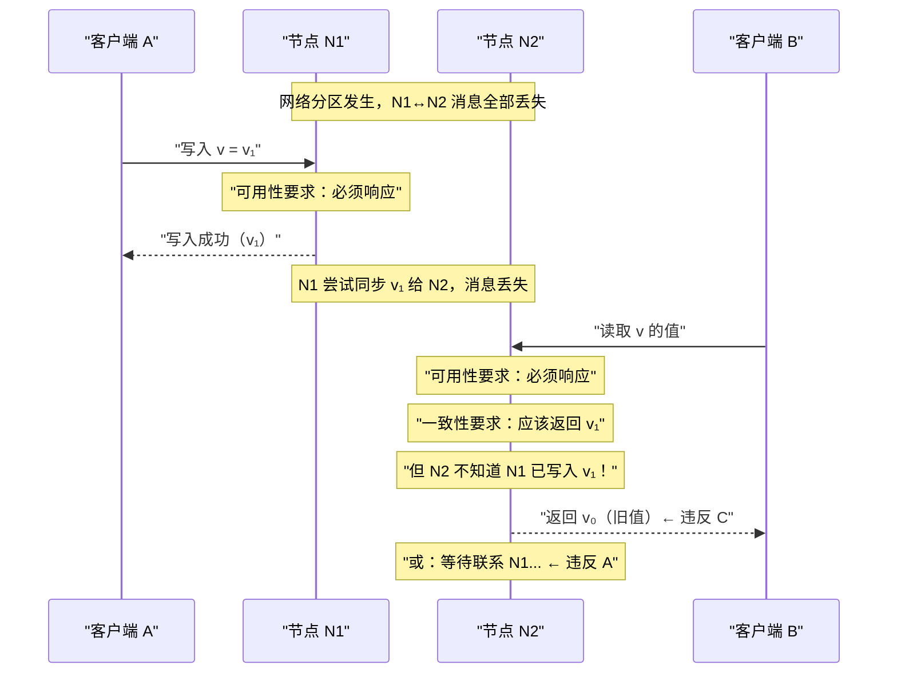
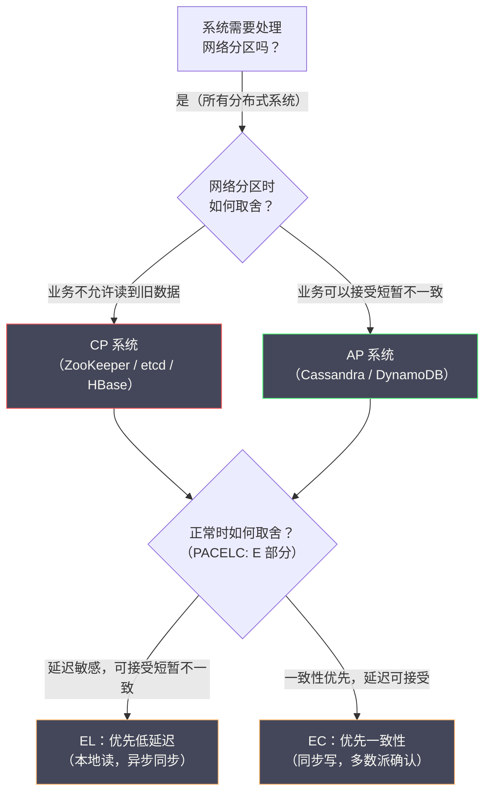

# 02 CAP 定理深度解析

**摘要：**

CAP 定理是分布式系统领域被引用最多、同时也被误解最多的理论成果。很多工程师对它的理解停留在"三选二"的口号层面，但这个口号本身就是对 CAP 的严重简化——它忽略了"P（分区容忍性）为什么不是一个选项"的根本问题，也没有解释"C（一致性）和 A（可用性）到底在什么时候不能兼得"。本文回到 Eric Brewer 2000 年的原始猜想和 Gilbert & Lynch 2002 年的形式化证明，厘清 CAP 三个性质的精确含义，深入分析为什么在网络分区时一致性和可用性必然冲突，并讨论 PACELC 模型对 CAP 的重要补充——分区之外的延迟与一致性权衡同样重要。理解 CAP 定理的真正含义，是做出有依据的系统架构决策的基础。

---

## 第 1 章 CAP 定理的起源：从猜想到证明

### 1.1 Brewer 的猜想：2000 年 PODC 演讲

2000 年，[[Eric Brewer]] 在 ACM [[PODC（Principles of Distributed Computing）]]会议上发表了一篇题为 *Towards Robust Distributed Systems* 的演讲。在演讲中，他提出了一个关于分布式系统的猜想（Conjecture）：

> "互联网服务的一致性（Consistency）、可用性（Availability）和分区容忍性（Partition tolerance）三个属性，最多只能同时满足其中两个。"

这个猜想来自于 Brewer 在工业界多年的实践经验——他是 Inktomi（早期搜索引擎公司）的联合创始人，在构建大规模分布式 Web 服务的过程中，观察到这三个属性之间存在根本性的张力。但在 2000 年，这还只是一个工程直觉，没有形式化的证明。

### 1.2 Gilbert & Lynch 的证明：2002 年

2002 年，[[Seth Gilbert]] 和 [[Nancy Lynch]]（MIT）在 *ACM SIGACT News* 上发表了论文 *Brewer's Conjecture and the Feasibility of Consistent, Available, Partition-Tolerant Web Services*，将 Brewer 的猜想转化为精确的定理并给出了证明。

这篇论文做了两件重要的事情：

**第一件事：给 C、A、P 三个属性以精确的数学定义**（这是理解 CAP 的关键，后面详细展开）。

**第二件事：证明了"三者不可兼得"**——在有网络分区（消息丢失）的异步系统中，不存在一个算法能同时满足一致性和可用性。

从此，CAP 定理（CAP Theorem）作为分布式系统的基础理论之一，深刻影响了工业界的系统架构设计。

### 1.3 Brewer 的反思：2012 年

有趣的是，Brewer 本人在 2012 年写了一篇文章 *CAP Twelve Years Later: How the "Rules" Have Changed*，对 CAP 的常见误解进行了纠正，并建议工程师应该更细致地思考 CAP，而不是简单地用"三选二"来指导设计。

这篇反思文章的核心观点，也将贯穿本篇文章：**CAP 三选二是一个有用的思维框架，但它过于简化，在实际工程中需要更精细的权衡模型**。

---

## 第 2 章 C、A、P 的精确含义

在日常讨论中，CAP 的三个字母被广泛引用，但很少有人能精确说出它们的定义。这种模糊性是 CAP 被广泛误解的根本原因。

### 2.1 C：一致性（Consistency）—— 不是你想的那个"一致性"

**Gilbert & Lynch 的定义**：CAP 中的一致性（Consistency），是指**原子一致性（Atomic Consistency）**，也称为**线性一致性（Linearizability）**。

形式化地说：对于一个分布式存储系统，如果所有操作（读和写）看起来是**瞬间完成**的，且所有操作构成一个符合真实时间顺序的全序（Total Order），则该系统满足线性一致性。

更直观地理解：一个满足线性一致性的系统，**对客户端来说看起来就像只有一台服务器**——客户端看不出数据是分布存储的。任何写操作一旦成功返回，所有后续的读操作都必须能看到这个写入的值（无论请求被路由到哪个节点）。

**一个具体的例子**：

```
系统有两个副本节点：N1 和 N2，存储变量 x，初始值 x = 0

操作序列：
  T1: 客户端 A 向 N1 写入 x = 1（写操作开始）
  T2: 写操作成功返回
  T3: 客户端 B 向 N2 读取 x（读操作在 T2 之后发起）

线性一致性要求：客户端 B 必须读到 x = 1
→ 因为写操作已经在 T2 成功完成，任何在 T2 之后发起的读操作都应该看到新值

如果客户端 B 读到 x = 0（旧值），则系统不满足线性一致性
```

**关键点：CAP 中的 C 不是"所有副本数据相同"**

很多人将一致性理解为"所有副本的数据是相同的"——这是最终一致性（Eventual Consistency）的定义，而不是 CAP 中的 C。CAP 中的线性一致性要求更强：**不仅要求最终相同，还要求在每个操作时刻，系统对外呈现的是一个单一的、最新的数据视图**。

这种混淆导致了大量的误用：很多人说"MySQL 主从复制是 C + A 系统"，但 MySQL 的异步主从复制既不满足 CAP 中的 C（Slave 上可能读到旧数据），也不满足 CAP 中的 A（Master 宕机后 Slave 需要人工介入才能提供服务）——它是一个不满足 CAP 三者中任何一个的系统，被误归类为 CA 系统。

### 2.2 A：可用性（Availability）—— 每个请求都必须得到响应

**Gilbert & Lynch 的定义**：CAP 中的可用性（Availability）是指：**集群中每个正常运行的（Non-faulty）节点，必须对每个收到的请求返回一个响应**（响应可以是成功或失败，但不能是超时或无响应）。

这里有两个关键词需要注意：

**"正常运行的节点"**：可用性的要求只针对没有崩溃的节点。一个节点崩溃了、无法响应，不算违反可用性——因为那是节点故障，不是系统设计的选择。可用性要求的是：那些还活着的节点，必须对每个请求给出响应。

**"必须返回响应"**：不能说"我现在不确定，你等一等"。如果一个节点收到请求后因为不知道全局状态（如是否已发生 Leader 切换）而无限期等待，那就违反了可用性。

**一个不满足可用性的例子**：

```
三节点集群（N1、N2、N3），N1 是 Leader

场景：N1 与 N2、N3 之间的网络分区
→ N1 无法与 N2、N3 通信

如果系统设计为"Leader 必须得到多数派确认才能响应客户端"：
  客户端向 N1 发送读请求
  N1 尝试联系 N2、N3 获取多数派确认
  N1 无法联系到 N2 或 N3（分区中）
  N1 无限期等待，或最终超时返回错误

→ N1 是一个正常运行的节点，但它无法返回有效响应 → 违反可用性
```

### 2.3 P：分区容忍性（Partition Tolerance）—— 不是一个可以"选择"的属性

**Gilbert & Lynch 的定义**：分区容忍性（Partition Tolerance）是指：**系统在任意数量的消息被网络丢失（或任意延迟）的情况下，仍然能够正确运行**。

换句话说，系统的正确性（满足 C 或 A 的程度）不应该依赖于网络的可靠性。

**为什么 P 不是一个可以"选择不要"的属性？**

这是 CAP 最大的误解之一。很多文章中写"CP 系统选择了 C 而放弃 A，AP 系统选择了 A 而放弃 C，CA 系统同时满足 C 和 A 但不支持 P"。但"CA 系统"在真实的分布式环境中是不存在的——你无法"不支持 P"。

原因很简单：**网络分区是现实世界中不可避免的**。无论你的网络设计多么可靠，都无法从根本上消除网络分区的可能性——硬件故障、软件 Bug、数据中心断电、人为操作错误，都可能导致网络分区。

如果你的系统"不支持 P"，意味着当网络分区发生时，系统的行为是未定义的（"不保证任何事情"）。对于一个生产系统，这是不可接受的。

**更精确的理解**：

CAP 定理实际上描述的是一个**条件性**的选择：**当且仅当网络分区发生时**，系统必须在一致性（C）和可用性（A）之间做出选择。在网络正常（没有分区）的情况下，系统可以同时满足 C 和 A。

> [!info] 重新理解"CA 系统"
> 当有人说"MySQL 是 CA 系统"时，他们通常的意思是：在单机环境下（没有网络分区），MySQL 同时满足 C 和 A。这是正确的——单机系统不需要面对网络分区，因此 CAP 定理对其不适用。
>
> 但一旦 MySQL 被部署为主从复制集群，网络分区就成为可能，CAP 定理就适用了。此时系统需要在 C 和 A 之间选择——而 MySQL 的默认行为（异步主从，Slave 可读）是 AP 的（可用但可能读到旧数据）。

---

## 第 3 章 为什么分区时 C 和 A 不能兼得：证明思路

### 3.1 Gilbert & Lynch 证明的核心思路

Gilbert & Lynch 的证明是反证法：假设存在一个算法同时满足一致性（线性一致性）和可用性，然后构造一个网络分区场景，推导出矛盾。

**证明场景构造**：

考虑一个简单的分布式系统：
- 两个节点：N1 和 N2
- 存储一个变量：v，初始值 v₀
- 一个写操作：将 v 改为 v₁
- 一个读操作：读取 v 的值

**步骤 1**：N1 和 N2 之间发生网络分区（所有消息被丢弃）

**步骤 2**：客户端向 N1 发送写请求，将 v 改为 v₁。由于可用性要求，N1 必须响应这个写请求（因为 N1 是正常运行的节点）。N1 本地写入 v₁，返回写入成功。

**步骤 3**：另一个客户端向 N2 发送读请求，读取 v 的值。由于可用性要求，N2 必须响应这个读请求。但是：
- N2 无法联系 N1（分区中），不知道 N1 已经写入了 v₁
- N2 本地存储的仍然是旧值 v₀

**步骤 4**：N2 面临两难：
- 如果 N2 返回 v₀（本地存储的值）：违反了一致性（写操作 v₁ 已经成功，但读操作看不到）
- 如果 N2 等待联系 N1 确认后再响应：违反了可用性（N2 无法响应请求）

**结论**：无论 N2 怎么做，都不能同时满足一致性和可用性。矛盾！因此，不存在在网络分区下同时满足 C 和 A 的算法。

### 3.2 直觉性理解：信息无法穿越分区

这个证明的本质是非常直观的：**写操作发生在分区的一侧（N1），读操作发生在分区的另一侧（N2）。由于分区阻止了 N1 将写入信息传递给 N2，N2 在不知道写入已发生的情况下，要么给出错误答案（违反 C），要么拒绝回答（违反 A）**。

这不是算法设计不够巧妙的问题——信息无法穿越被切断的网络链路，这是物理约束，任何算法都无法突破。



---

## 第 4 章 CP vs AP：权衡的真实含义

### 4.1 选择 CP：牺牲可用性，换取一致性

当网络分区发生时，CP 系统选择**拒绝服务**（或只让多数派侧提供服务），以保证不向客户端返回不一致的数据。

**CP 系统的行为**：

```
网络分区将集群分为两组：
  多数派侧：N1、N2、N3（3个节点，拥有多数）
  少数派侧：N4、N5（2个节点）

CP 系统的处理：
  多数派侧（N1/N2/N3）：继续提供服务，可以确认写操作和读取最新数据
  少数派侧（N4/N5）：停止对外提供服务（返回错误），或只提供只读服务（返回可能旧的数据，但标注"不一定最新"）

→ 少数派侧的节点不可用（违反 A），但保证了数据一致性（C）
```

**典型 CP 系统**：

- **[[ZooKeeper]]**：在网络分区时，少数派节点停止服务（拒绝所有读写请求），只有多数派节点（包含 Leader）继续工作。这保证了 ZooKeeper 写操作的线性一致性，但在分区期间少数派节点不可用。

- **[[HBase]]**：依赖 ZooKeeper 做协调，分区时 HBase RegionServer 可能因为无法联系 ZooKeeper 而停止服务。

- **[[etcd]]**（使用 [[Raft]] 协议）：Raft 要求 Leader 在多数派确认后才能提交操作，少数派分区侧无法提交新操作（因为无法达到多数派），会拒绝写入。

**CP 系统的工程权衡**：

CP 系统并非在所有时候都不可用——它在**分区期间**（通常是短暂的）牺牲可用性。分区恢复后，系统恢复全量服务。对于强一致性要求高的场景（配置中心、分布式锁、Leader 选举），这个权衡是值得的：宁可暂时不服务，也不能返回错误数据。

### 4.2 选择 AP：牺牲一致性，换取可用性

当网络分区发生时，AP 系统选择**继续服务**（分区两侧都对外提供服务），以保证高可用性，代价是可能返回不一致的数据（旧数据或冲突数据）。

**AP 系统的行为**：

```
网络分区将集群分为两组：
  组 A：N1、N2
  组 B：N3、N4

AP 系统的处理：
  组 A：继续接受写入和读取，以组 A 的本地状态响应
  组 B：也继续接受写入和读取，以组 B 的本地状态响应

→ 两组可能接受了不同的写入，数据产生分歧（违反 C）
→ 但两组都能响应请求（满足 A）

分区恢复后：
  需要合并两侧的数据（Reconciliation），解决冲突
```

**典型 AP 系统**：

- **[[Cassandra]]**：分区时，每侧继续接受读写请求，分区恢复后通过反熵（Anti-entropy）机制合并数据。写冲突通过"最后写入者胜（Last-Write-Wins，LWW）"或向量时钟解决。

- **[[CouchDB]]** / **[[DynamoDB]]**（默认配置）：采用最终一致性模型，分区时两侧独立工作，分区恢复后自动同步。

- **[[DNS]]**：DNS 是一个经典的 AP 系统——它的更新需要时间传播，全球各地的 DNS 服务器可能在短时间内返回不同的结果（不一致），但它极少拒绝服务（高可用）。

**AP 系统的工程权衡**：

AP 系统返回的不一致数据并非"随机错误"——大多数 AP 系统都提供**最终一致性**保证：分区恢复后，系统会合并数据，最终所有副本的数据是相同的。在网络正常时，AP 系统也尽力提供最新数据（通过副本同步）。不一致只在分区期间暂时发生。

### 4.3 CP vs AP 的决策框架

| 维度 | CP 系统 | AP 系统 |
| :--- | :--- | :--- |
| **分区时的行为** | 少数派停止服务，保证不返回旧数据 | 所有节点继续服务，可能返回旧数据或冲突数据 |
| **一致性强度** | 强一致（线性一致性）| 最终一致性（弱一致）|
| **可用性** | 分区期间部分节点不可用 | 始终可用（但数据可能不最新）|
| **冲突处理** | 不允许冲突（顺序化所有操作）| 需要冲突检测和合并机制 |
| **典型使用场景** | 分布式锁、配置中心、Leader 选举、金融交易 | 购物车、用户会话、DNS、社交 Feed |
| **代表系统** | ZooKeeper、etcd、HBase | Cassandra、DynamoDB、CouchDB |

**决策的核心问题**：

> "如果我返回了旧数据（不一致），最坏的情况是什么？"

- **不可接受**（金融余额、库存精确数、分布式锁状态）→ 选 CP
- **可以接受，会有 UI 提示或后台同步**（购物车、用户偏好、社交点赞数）→ 选 AP

---

## 第 5 章 CAP 的常见误解

### 5.1 误解一："三选二"意味着可以均衡地选两个

"三选二"的表述让人误以为可以"选 C 和 P，放弃 A"或"选 A 和 P，放弃 C"，好像 C、A、P 是三个地位对等的选项。

事实上，**P（分区容忍性）是任何分布式系统都必须具备的基础属性**——因为分布式环境中网络分区不可避免。真正的选择只有一个：

> **当网络分区发生时，你选择保证 C 还是保证 A？**

CAP 不是"三选二"，而是"**在网络分区时，C 和 A 二选一**"。

### 5.2 误解二：CAP 适用于所有时候

CAP 定理描述的是**网络分区发生时**的权衡。在网络正常（没有分区）的情况下，系统可以同时满足 C 和 A。

大多数生产系统在 99.9% 以上的时间里都没有网络分区，因此大多数时候它们可以同时做到高可用和强一致。只有在那极少数发生分区的时刻，才需要做出取舍。

这意味着：**选择 CP 并不意味着系统大多数时候不可用**——只有在分区期间，系统才会降低可用性。选择 AP 也不意味着系统大多数时候不一致——只有在分区期间，系统才会出现短暂的不一致。

### 5.3 误解三：一致性和可用性是非此即彼的二元选择

现实中，一致性和可用性都是可以**调节的连续谱**，而不是非此即彼的二元选项。

**可调节的一致性**：[[Cassandra]] 提供的一致性级别（`Consistency Level`）允许客户端按请求指定一致性要求：
- `ONE`：只需一个副本确认即可（最低一致性，最高可用性）
- `QUORUM`：需要多数副本确认（中等一致性，中等可用性）
- `ALL`：需要所有副本确认（最高一致性，最低可用性）

同一个 Cassandra 集群，不同的业务可以使用不同的一致性级别——强一致性要求的操作用 `QUORUM`，高可用要求的操作用 `ONE`。

**可调节的可用性**：类似地，系统可以选择"在有多少个节点存活时继续服务"——要求至少 2/3 节点存活（牺牲部分可用性，换取更强一致性），或只要 1 个节点存活就服务（最高可用性，最弱一致性）。

---

## 第 6 章 PACELC：CAP 之外更重要的权衡

### 6.1 CAP 的局限：只描述了分区时的极端情况

CAP 定理的一个重要局限是：它只描述了**网络分区时**的权衡，而网络分区是罕见的极端情况。在 99% 以上正常运行的时间里，系统面临的是另一个同样重要的权衡：**延迟（Latency）vs 一致性（Consistency）**。

即使在网络正常的情况下，如果要保证强一致性（所有副本同步完成后才响应），写操作必须等待所有副本确认，这会带来额外的延迟。而如果选择返回本地副本的数据（不等待所有副本同步），延迟低，但在副本同步完成之前，不同客户端可能看到不同的数据（短暂不一致）。

### 6.2 PACELC 模型：对 CAP 的完整补充

2012 年，[[Daniel Abadi]] 提出了 PACELC 模型，对 CAP 进行了重要补充：

**PACELC 的含义**：

- **P**（Partition）：当网络分区（Partition）发生时
- **A vs C**（Availability vs Consistency）：选择可用性（A）还是一致性（C）
- **E**（Else）：在没有分区的正常情况下
- **L vs C**（Latency vs Consistency）：选择低延迟（L）还是强一致性（C）

用伪代码表达：

```
if partition:
    choice(Availability, Consistency)  # CAP 的范畴
else:
    choice(Latency, Consistency)       # PACELC 新增的范畴
```

### 6.3 PACELC 对主流系统的分类

| 系统 | 分区时 | 正常时 | PACELC 分类 |
| :--- | :--- | :--- | :--- |
| **DynamoDB** | 选 A | 选 L（低延迟）| PA/EL |
| **Cassandra** | 选 A | 选 L（默认）| PA/EL |
| **ZooKeeper** | 选 C | 选 C（强一致）| PC/EC |
| **etcd（Raft）** | 选 C | 选 C（强一致）| PC/EC |
| **MongoDB（默认）** | 选 A | 选 L | PA/EL |
| **MySQL 主从（同步）** | 选 C | 选 C | PC/EC |
| **MySQL 主从（异步）** | 选 A | 选 L | PA/EL |

**为什么 PACELC 比 CAP 更实用？**

在大多数系统的日常运行中，正常时间（无分区）占了 99.9%，分区时间只占 0.1%。因此，PACELC 的 E（Else）部分——正常时的延迟 vs 一致性权衡——对系统的日常性能影响远大于 CAP 的分区时权衡。

以 DynamoDB 和 etcd 为例：
- **DynamoDB（PA/EL）**：分区时选可用性，正常时选低延迟——适合高吞吐量的购物车、会话数据，用户可以接受短暂的不一致
- **etcd（PC/EC）**：分区时选一致性，正常时选强一致——适合 Kubernetes 的配置存储、服务注册，数据必须精确且最新

选型时，需要同时考虑分区时和正常时的行为，而不仅仅是 CAP 的分区时权衡。

---

## 第 7 章 CAP 在工程实践中的指导意义

### 7.1 不要教条地应用 CAP

CAP 定理是一个思维框架，不是一个选型清单。工程实践中需要注意以下几点：

**考量一：不一致的"持续时间"和"严重程度"**

AP 系统不一致，但不一致是暂时的——分区恢复后，数据最终会一致。如果业务能容忍几秒甚至几十秒的短暂不一致，AP 系统完全可行。如果业务连 1 毫秒的不一致都不能接受，则必须用 CP 系统。

**考量二：不可用的"范围"和"持续时间"**

CP 系统在分区期间不可用，但不是整体不可用——通常只有少数派节点不可用，多数派继续服务。以 5 节点 Raft 集群为例，只要不超过 2 个节点故障，整个集群都能正常工作，只有当 3 个以上节点同时故障时集群才停止服务。

**考量三：数据的"可合并性"**

AP 系统产生冲突后，需要合并策略。有些数据天然可合并（计数器用 CRDT，集合用 union），有些数据无法自动合并（账户余额），需要人工干预。选择 AP 系统时，需要考虑冲突解决机制的可实现性。

### 7.2 一张图总结



---

## 参考资料

1. Brewer, E. (2000). Towards Robust Distributed Systems (Keynote). *PODC 2000*. https://people.eecs.berkeley.edu/~brewer/cs262b-2004/PODC-keynote.pdf
2. Gilbert, S., & Lynch, N. (2002). Brewer's Conjecture and the Feasibility of Consistent, Available, Partition-Tolerant Web Services. *ACM SIGACT News, 33*(2), 51–59.
3. Brewer, E. (2012). CAP Twelve Years Later: How the "Rules" Have Changed. *IEEE Computer, 45*(2), 23–29.
4. Abadi, D. (2012). Consistency Tradeoffs in Modern Distributed Database System Design: CAP is Only Part of the Story. *IEEE Computer, 45*(2), 37–42.
5. Kleppmann, M. (2017). *Designing Data-Intensive Applications*. O'Reilly Media. Chapter 9: Consistency and Consensus.
6. Vogels, W. (2009). Eventually Consistent. *Communications of the ACM, 52*(1), 40–44.
7. Bailis, P., & Ghodsi, A. (2013). Eventual Consistency Today: Limitations, Extensions, and Beyond. *ACM Queue, 11*(3).
8. Attiya, H., Bar-Noy, A., & Dolev, D. (1995). Sharing Memory Robustly in Message-Passing Systems. *Journal of the ACM, 42*(1), 124–142.

---

> [!note] 思考题
> 1. Basic Paxos 解决了单值共识问题——多个 Proposer 可能并发提议值，最终所有进程就同一个值达成一致。Paxos 的核心是'两阶段'：Prepare（获取承诺）和 Accept（提交值）。如果两个 Proposer 交替 Prepare 导致'活锁'（互相覆盖对方的 Prepare），如何解决？Multi-Paxos 引入 Leader 来避免这个问题——与 Raft 的 Leader 概念有什么异同？
> 2. Paxos 以难以理解著称——Lamport 的原始论文使用了希腊议会的比喻。Raft 论文的核心贡献是'将 Paxos 的正确性以更容易理解的方式呈现'。你认为 Raft 在算法本质上与 Multi-Paxos 有区别吗？还是只是'包装'不同？
> 3. Paxos 在工业界的实现包括 Google 的 Chubby（分布式锁服务）和 Spanner（分布式数据库）。Spanner 使用 Paxos 保证跨数据中心的强一致性——结合 TrueTime（原子钟+GPS）实现全球一致的事务。TrueTime 的误差范围（通常 <7ms）如何影响事务的等待时间？
