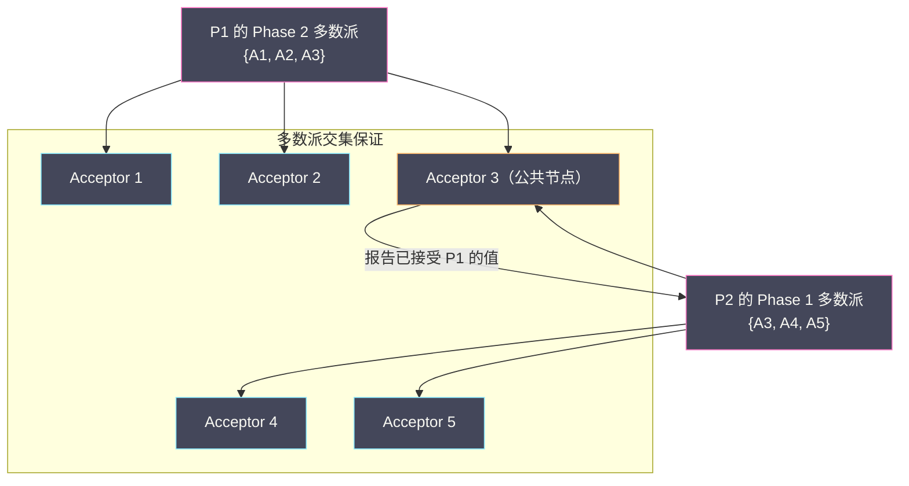
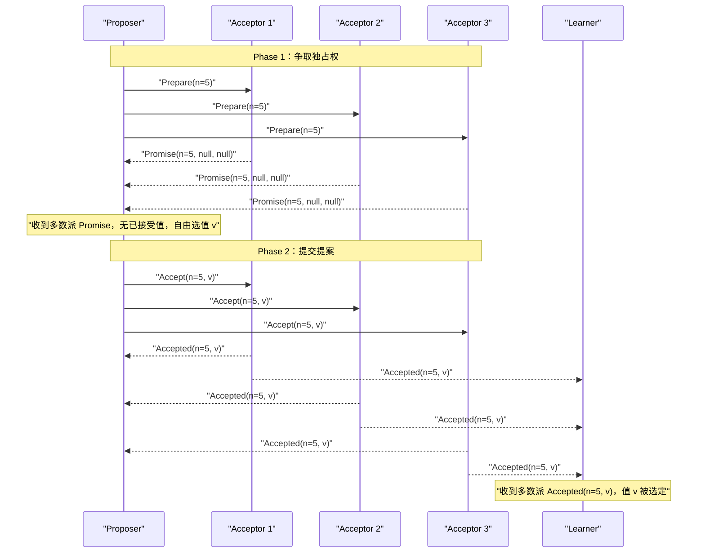
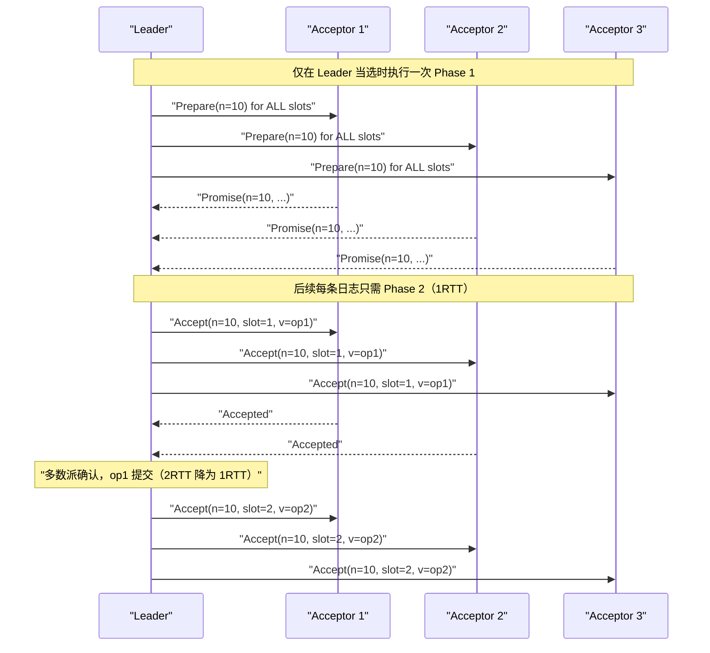

# 04 Paxos 算法原理深度解析

**摘要：**

Paxos 是分布式共识算法的奠基之作。Leslie Lamport 用一个虚构的希腊议会（Paxos 岛）来类比分布式共识协议，在 1989 年写成论文，直到 1998 年才正式发表——据说是因为论文太过晦涩，审稿人多次拒绝。Paxos 解决了一个根本问题：**在消息可能丢失、节点可能崩溃的异步网络中，如何让多个节点就某个值达成安全且持久的共识**。本文从零推导 Basic Paxos 的两阶段设计逻辑，解释每个设计决策背后的"为什么"——为什么需要两个阶段、为什么需要 Proposer 承诺不使用小于某个编号的提案、为什么多数派（Quorum）是安全性的关键。在 Basic Paxos 基础上，进一步分析 Multi-Paxos 的优化思路，以及为什么 Paxos 在工程实现中如此困难——这正是 Raft 诞生的直接原因。

---

## 第 1 章 Paxos 的背景与设计目标

### 1.1 Leslie Lamport 与 Paxos 岛的故事

Paxos 算法由 [[Leslie Lamport]] 于 1989 年设计完成，以古希腊爱琴海上一个名为 Paxos 的小岛命名。论文以寓言方式讲述了 Paxos 岛上的"议会"如何在议员（进程）可能随时离席（崩溃）的情况下，通过信使（网络消息）传递提案并达成法律（共识决定）。

这个框架下，Paxos 算法的角色定义如下：
- **Proposer（提案者）**：提出一个值（Value），希望让所有人接受它
- **Acceptor（接受者）**：对提案进行投票，决定是否接受
- **Learner（学习者）**：不参与投票，但需要知道最终被选定的值

在实际系统中，一个节点通常同时扮演多种角色。

### 1.2 Paxos 要解决的核心问题

在第 03 篇中我们已经知道，共识需要满足三个性质：终止性、协议性、有效性。Paxos 的核心挑战是在以下约束下满足这三个性质：

- 消息可能丢失（但不会被篡改）
- 节点可能在任意时刻崩溃（崩溃后不再响应，但可以恢复）
- 没有全局时钟，没有消息延迟上界

这些约束排除了许多朴素的解法。最简单的"Leader 收集所有人的投票后广播决定"方案，一旦 Leader 崩溃，系统就永远无法达成共识（终止性失败）。

---

## 第 2 章 Basic Paxos：从第一性原理推导两阶段设计

### 2.1 朴素方案的问题：为什么"直接投票"不够

先考虑一个最朴素的共识方案：每个 Proposer 向所有 Acceptor 发送自己的提案值 v，Acceptor 接受第一个收到的提案，如果多数 Acceptor 接受了同一个值，则该值被选定。

**问题**：如果两个 Proposer 同时提案不同的值，可能产生"分票"——没有任何值能获得多数派支持，共识无法达成。

```
Acceptor 集合：A1, A2, A3
Proposer P1 提案 v = "苹果"
Proposer P2 提案 v = "香蕉"

A1 先收到 P1，接受 "苹果"
A2 先收到 P2，接受 "香蕉"
A3 先收到 P1 还是 P2 取决于网络延迟

最坏情况：A3 也无法打破平局，两个值各有 1~2 票，无多数派
→ 共识失败
```

这就引出了 Paxos 的核心设计思想：**在允许值被选定之前，必须先建立一个"独占期"，确保在独占期内只有一个 Proposer 的提案有可能被选定**。

### 2.2 提案编号：建立全序

Paxos 引入了**提案编号（Proposal Number）**，通常记为 `n`，要求全局唯一且全序可比（即任意两个提案编号可以比较大小）。

提案编号的设计：通常用 `(轮次号, 进程 ID)` 的复合格式，轮次号递增，进程 ID 打破平局。这样可以确保全局唯一性（不同进程在同一轮次的编号因 ID 不同而不同）且全序可比。

提案编号的作用：**编号越大的提案，优先级越高**。当一个 Acceptor 面对多个提案时，它总是优先接受编号更大的提案。Proposer 通过"竞争"获得一个足够大的提案编号来"独占"当前的共识过程。

### 2.3 Phase 1：Prepare 阶段——争取"独占权"

**Phase 1a：Proposer 发送 Prepare 请求**

Proposer 选择一个**唯一的提案编号 `n`**，向所有（或多数）Acceptor 发送 `Prepare(n)` 请求：

```
Proposer → Acceptors:  Prepare(n)
含义："我提议一个编号为 n 的提案，请问你之前有没有接受过任何提案？
      如果没有，请承诺不再接受编号小于 n 的任何提案。"
```

**Phase 1b：Acceptor 响应 Promise**

每个 Acceptor 收到 `Prepare(n)` 请求后，做出以下判断：

**情况一**：如果 n 大于该 Acceptor 之前响应过的所有 Prepare 请求的编号（记为 `maxPreparedN`），则：
- 更新 `maxPreparedN = n`
- 返回 `Promise(n, 已接受的最大编号提案)`：承诺不再接受编号小于 n 的提案，并告知自己已经接受过的提案（如果有的话）

**情况二**：如果 n ≤ `maxPreparedN`（这个提案编号已经过时了），则：
- 忽略该请求，或返回拒绝（`Nack`）

```python
# Acceptor 的状态
maxPreparedN = 0   # 承诺过的最大提案编号
acceptedN = None   # 已接受的提案编号
acceptedV = None   # 已接受的提案值

def on_prepare(n):
    if n > maxPreparedN:
        maxPreparedN = n
        return Promise(n, acceptedN, acceptedV)
        # 承诺：不再接受编号 < n 的提案
        # 告知：之前接受过的最大编号提案（如果有）
    else:
        return Nack(maxPreparedN)
        # 拒绝：已有更大编号的 Prepare，这个过时了
```

**Phase 1 的目的**：Proposer 通过发送 `Prepare(n)` 并收到多数派的 `Promise`，完成两件事：
1. **争取独占权**：多数派承诺不再接受编号 < n 的提案，即"旧的提案者"无法让多数派接受它们的提案了
2. **探知已有的提案**：了解是否有任何值已经被之前的 Acceptor 接受过（用于 Phase 2 中的值选择）

### 2.4 Phase 2：Accept 阶段——提交提案

**Phase 2a：Proposer 发送 Accept 请求**

Proposer 收到多数派的 `Promise` 响应后，准备进入 Phase 2，选择一个值 v 并发送 `Accept(n, v)` 请求。

**值的选择规则**（这是 Paxos 安全性的关键！）：

```
如果多数派的 Promise 响应中，没有任何 Acceptor 报告"已接受过提案"：
    → Proposer 可以自由选择任意值 v（通常是 Proposer 自己希望提议的值）

如果多数派的 Promise 响应中，有 Acceptor 报告了"已接受过提案"：
    → Proposer 必须选择"所有响应中，已接受的最大编号提案对应的值"作为 v
    → 而不能使用自己想要的值！
```

这个规则乍看令人困惑——为什么 Proposer 有时必须"放弃"自己的值，而使用另一个 Proposer 之前接受过的值？这正是 Paxos 安全性证明的核心，我们在下一章专门解释。

```python
def on_majority_promise_received(promises):
    # 找到所有已接受提案中编号最大的那个
    max_accepted = max(
        [(p.acceptedN, p.acceptedV) for p in promises if p.acceptedV is not None],
        key=lambda x: x[0],
        default=(None, None)
    )
    
    if max_accepted[1] is not None:
        # 有 Acceptor 已接受过提案，必须用那个值
        v = max_accepted[1]
    else:
        # 没有 Acceptor 接受过提案，可以自由选择
        v = my_proposed_value
    
    # 发送 Accept 请求
    for acceptor in all_acceptors:
        send(acceptor, Accept(n, v))
```

**Phase 2b：Acceptor 响应 Accepted**

每个 Acceptor 收到 `Accept(n, v)` 请求后：

```python
def on_accept(n, v):
    if n >= maxPreparedN:
        # 编号符合承诺（不小于已承诺的最大编号）
        maxPreparedN = n
        acceptedN = n
        acceptedV = v
        # 通知所有 Learner
        for learner in all_learners:
            send(learner, Accepted(n, v))
        return Accepted(n, v)
    else:
        # 编号已过时（在 Phase 1 期间有更大编号的 Prepare 到来）
        return Nack(maxPreparedN)
```

**值被选定（Chosen）的条件**：当多数派 Acceptor 都接受了同一个提案 `(n, v)` 时，值 v 被"选定"（Chosen）。注意"被选定"是一个逻辑上的状态，不需要任何额外的消息来"确认"——多数派接受即是选定。

Learner 通过接收 Acceptor 发送的 `Accepted(n, v)` 消息来感知哪个值被选定：一旦 Learner 收到了来自多数派的 `Accepted(n, v)`，它就知道值 v 被选定了。

---

## 第 3 章 为什么 Paxos 是安全的：正确性的直觉推导

### 3.1 安全性的核心问题：防止两个值同时被选定

Paxos 安全性的核心要求是：**任何时候，最多只有一个值会被选定（Agreement）**。如果两个不同的值 v₁ 和 v₂ 同时被选定，就会产生"双 Leader"式的数据不一致，这是不允许的。

为了防止这种情况，Paxos 的关键不变量（Invariant）是：

> **如果一个值 v 在某个提案编号 n 中被选定，那么任何编号 > n 的提案，其值也必须是 v。**

这个不变量保证了：一旦某个值被选定，后续的提案都不会"覆盖"它，系统永远不会决定两个不同的值。

### 3.2 为什么 Proposer 必须使用"已接受的最大编号值"

Phase 2 中，Proposer 选值的规则（必须使用已接受的最大编号值）正是为了维护上述不变量。

**场景分析**：

```
假设：
  - Acceptor 集合：{A1, A2, A3, A4, A5}（5 个 Acceptor）
  - Proposer P1 先发起提案，提案编号 n=1，提议值 v="苹果"

P1 的执行过程：
  Phase 1：P1 发送 Prepare(1) 给所有 Acceptor
           A1、A2、A3 响应 Promise(1, null, null)（没有已接受提案）
  Phase 2：P1 发送 Accept(1, "苹果") 给所有 Acceptor
           A1、A2 响应 Accepted(1, "苹果")
           [此时 P1 崩溃，还差 1 票就达到多数派]

"苹果" 尚未被选定（只有 2/5 票，不是多数派）

现在 Proposer P2 发起新提案，提案编号 n=2，希望提议 v="香蕉"
  Phase 1：P2 发送 Prepare(2) 给所有 Acceptor
           A1 响应 Promise(2, acceptedN=1, acceptedV="苹果")  ← 已接受过 (1, "苹果")
           A2 响应 Promise(2, acceptedN=1, acceptedV="苹果")  ← 已接受过 (1, "苹果")
           A3 响应 Promise(2, null, null)                     ← 没有已接受提案
           A4 响应 Promise(2, null, null)
           A5 响应 Promise(2, null, null)
           → P2 收到多数派（5/5）的 Promise

  Phase 2：P2 看到 A1、A2 报告了已接受的提案 (1, "苹果")
           根据规则，P2 必须使用 "苹果" 而不是 "香蕉"
           P2 发送 Accept(2, "苹果") 给所有 Acceptor
           → 所有 Acceptor 接受 (2, "苹果")，"苹果" 被选定
```

**关键思想**：P2 通过 Phase 1 探知到 A1 和 A2 已经接受了 `(1, "苹果")`，这意味着 P1 很可能已经让多数派接受了 "苹果"（只是 P2 不知道 A3/A4/A5 是否也接受了）。为了安全起见，P2 必须假设 "苹果" 可能已经被选定，因此 P2 也使用 "苹果" 作为提案值——这样无论 "苹果" 是否已被选定，P2 的提案都与之一致，不会产生冲突。

如果 P2 自作主张地提议 "香蕉"，可能的结果是：P1 的提案（还缺最后一票）被 A3 接受了（"苹果" 被选定），而 P2 的提案（"香蕉"）也被选定——两个值同时被选定，协议性被违反！

### 3.3 多数派机制为何能保证唯一性

多数派（Quorum）机制是 Paxos 安全性的数学基础：

**关键性质：任意两个多数派集合必然有交集。**

对于 n 个 Acceptor，多数派 = 至少 ⌊n/2⌋ + 1 个。任意两个多数派集合的大小都 > n/2，因此两者的并集大小 > n，而总 Acceptor 数量为 n，所以两个多数派必然有至少 1 个公共 Acceptor。

**这个性质如何保证安全性**？

- Phase 1 的多数派承诺：P2 的 Phase 1 多数派 必须与 P1 的 Phase 2 多数派 有交集（至少 1 个公共 Acceptor）
- 公共 Acceptor 会在 P2 的 Phase 1 中报告"我已经接受了 P1 的提案"
- P2 因此得知 P1 的值，并被迫使用该值

这个保证是严密的：**只要 P1 在 Phase 2 让任何 Acceptor 接受了值 v，P2 在 Phase 1 时一定能发现这个事实（通过公共 Acceptor），并被迫使用 v**。



---

## 第 4 章 Basic Paxos 的完整流程与边界情况

### 4.1 完整的消息流

一次完整的 Basic Paxos 共识过程的消息流如下：



### 4.2 Proposer 竞争：活锁（Livelock）问题

Basic Paxos 存在一个著名的活锁场景：两个 Proposer 互相"抢先"，导致没有值能被选定（活性失败）：

```
P1 发送 Prepare(n=1)，收到多数派 Promise
P1 准备发送 Accept(n=1, v1)...

P2 发送 Prepare(n=2)，收到多数派 Promise
（多数派承诺不再接受编号 < 2 的提案，P1 的 Accept(n=1) 被拒绝）

P1 发送 Accept(n=1, v1) → 被所有 Acceptor 拒绝（因为已承诺 n ≥ 2）

P1 重新开始：发送 Prepare(n=3)，收到多数派 Promise
（多数派承诺不再接受编号 < 3 的提案，P2 的 Accept(n=2) 将被拒绝）

P2 发送 Accept(n=2, v2) → 被所有 Acceptor 拒绝

… 如此循环，没有 Proposer 能成功提交值
```

这是一个**活锁（Livelock）**而非死锁——两个进程都在活动，但没有进展。FLP 定理告诉我们这种情况不可完全避免，但实践中可以用**随机退避（Random Backoff）**大幅降低活锁概率：

```python
def propose_with_backoff(value, max_retries=100):
    for i in range(max_retries):
        n = next_proposal_number()
        promises = send_prepare_and_wait(n)
        if len(promises) < quorum_size:
            # 没有收到多数派，等待随机时间后重试
            time.sleep(random.uniform(0.01, 0.1))  # 随机退避，避免活锁
            continue
        
        v = choose_value(promises, value)
        accepted_count = send_accept_and_count(n, v)
        
        if accepted_count >= quorum_size:
            return v  # 成功
        
        time.sleep(random.uniform(0.01, 0.1))
    
    raise ConsensusException("达到最大重试次数")
```

Lamport 在 Paxos 论文中建议的方案是**选举一个 "Distinguished Proposer"（卓越提案者）**：在正常情况下只允许一个 Proposer 提案，避免多 Proposer 竞争。这个想法直接启发了 Multi-Paxos 中的 Leader 概念。

---

## 第 5 章 Multi-Paxos：从单值共识到日志复制

### 5.1 Basic Paxos 的实用局限

Basic Paxos 只解决了**单个值**的共识问题——所有节点就"某一个值是什么"达成一致。但实际的分布式系统需要的是**连续的操作序列**的共识（即日志复制）：第 1 条日志条目是什么？第 2 条是什么？第 N 条是什么？

直接对每条日志条目运行一次 Basic Paxos，需要每次都进行 Phase 1（2 轮消息往返）和 Phase 2（1 轮消息往返），总计 **2 次消息往返（RTT）** 才能提交一条日志。在高吞吐量系统中，这个开销是无法接受的。

### 5.2 Multi-Paxos 的核心优化：固定 Leader + Phase 1 复用

Multi-Paxos 通过两个关键优化将单条日志的提交开销从 2RTT 降低到 1RTT：

**优化一：选举一个稳定的 Leader（卓越提案者）**

选出一个 Leader 节点，在 Leader 任期内，只有 Leader 才能提交新的日志条目。这消除了多 Proposer 竞争的活锁问题。

**优化二：Phase 1 复用（批量 Prepare）**

在 Basic Paxos 中，每次提案都需要独立的 Phase 1（Prepare + Promise）。Multi-Paxos 的关键洞察是：**如果一个 Leader 完成了 Phase 1 并获得了多数派的承诺，它可以复用这个承诺来提交多个值，而无需为每个值重新执行 Phase 1**。

具体地说：Leader 执行一次 `Prepare(n)`（对所有日志条目位置），多数派给出 `Promise`。此后，Leader 可以直接跳过 Phase 1，对每个新的日志条目直接发送 `Accept(n, slot_i, v_i)`——只需 1RTT（Phase 2）即可提交一条日志。



### 5.3 Multi-Paxos 的 Leader 选举问题

Multi-Paxos 假设有一个稳定的 Leader，但 Lamport 的 Paxos 论文对"如何选出 Leader"着墨不多——他只是说选一个"卓越提案者"，但没有给出具体的选举算法。这是 Paxos 难以实现的原因之一。

实践中，Multi-Paxos 通常将 Leader 选举本身也用 Paxos（或类似机制）实现，形成一个递归的结构。这种自举（Bootstrap）的设计使得系统的正确性分析变得复杂。

Raft（下一篇）的出现正是为了解决这个问题：Raft 将 Leader 选举与日志复制作为一个统一的、易于理解的协议设计，避免了 Multi-Paxos 的这种复杂性。

---

## 第 6 章 Paxos 的工程实现难点

### 6.1 Lamport 本人承认的工程挑战

Lamport 在 2001 年发表了一篇题为 *Paxos Made Simple* 的论文，试图用更简单的语言重新解释 Paxos。但工程界很快发现，即使有了"简化版"，实现 Paxos 仍然极其困难。2007 年，Google 的工程师发表了论文 *Paxos Made Live*，详细描述了他们在 Chubby 系统中实现 Paxos 时遇到的各种工程挑战。

### 6.2 主要工程挑战

**挑战一：多值 Paxos（Multi-Paxos）的 Leader 切换**

当 Leader 崩溃后，新 Leader 需要执行 Phase 1 来确定"哪些日志条目已经被接受但尚未提交"。这需要新 Leader 扫描所有日志槽位，找出其中处于"中间状态"的条目，并决定是继续提交它们还是覆盖为 no-op。这个过程称为**日志修复（Log Repair）**，实现细节极其复杂。

**挑战二：日志压缩（Log Compaction）**

日志不能无限增长，需要定期进行快照（Snapshot）和日志压缩。快照需要包含某个时刻系统的完整状态，且在快照过程中不能暂停服务。如何在不影响 Paxos 协议运行的情况下安全地做快照，是一个复杂的工程问题。

**挑战三：成员变更（Cluster Membership Change）**

如果需要向集群中添加或删除节点（如扩容、缩容），如何安全地完成配置变更？配置变更期间，旧配置和新配置可能同时活跃，导致出现两个独立的多数派（脑裂风险）。Paxos 没有提供标准的成员变更算法，需要工程师自行设计。

**挑战四：只读操作的一致性**

如何在 Paxos 集群上安全地进行只读操作？最朴素的做法是让读操作也走 Paxos 协议（完整的两阶段），但这会极大地增加读操作的延迟。实践中通常用"Leader 读"（直接读 Leader 的状态，但需要确保 Leader 仍然是合法的 Leader）或"ReadIndex"（记录当前提交索引，确保读到该索引之前的所有写入）来优化。

**挑战五：网络分区时的"幽灵 Leader"**

一个旧 Leader 因网络分区与多数派失联，但它不知道新 Leader 已被选出，继续以为自己是 Leader 并对外提供"读服务"。客户端向旧 Leader 读取数据，可能读到过期的旧数据（Stale Read），违反了线性一致性。

### 6.3 Paxos 的工程教训

*Paxos Made Live* 论文的结论可以概括为：**Paxos 的核心算法是正确的，但从核心算法到生产级系统，中间有一条充满陷阱的鸿沟**。这些陷阱大多不在算法本身，而在"算法如何与其他系统组件（日志、快照、成员变更、客户端交互）正确地协作"。

这正是 Raft 诞生的直接动因：Raft 的设计者 Diego Ongaro 和 John Ousterhout 在设计 Raft 时，将"可理解性（Understandability）"作为首要设计目标，而不是最小的消息复杂度或最高的容错能力。Raft 通过明确的 Leader 选举算法、清晰的日志复制语义、以及内置的成员变更协议，填补了 Multi-Paxos 留给工程师的那条鸿沟。

---

## 参考资料

1. Lamport, L. (1998). The Part-Time Parliament. *ACM Transactions on Computer Systems, 16*(2), 133–169. （Paxos 原始论文）
2. Lamport, L. (2001). Paxos Made Simple. *ACM SIGACT News, 32*(4), 18–25. （简化版 Paxos）
3. Chandra, T.D., Griesemer, R., & Redstone, J. (2007). Paxos Made Live: An Engineering Perspective. *PODC 2007*.
4. Van Renesse, R., & Altinbuken, D. (2015). Paxos Made Moderately Complex. *ACM Computing Surveys, 47*(3), Article 42.
5. Ongaro, D., & Ousterhout, J. (2014). In Search of an Understandable Consensus Algorithm. *USENIX ATC 2014*.
6. Kleppmann, M. (2017). *Designing Data-Intensive Applications*. O'Reilly Media. Chapter 9.
7. Howard, H. (2019). Flexible Paxos: Quorum Intersection Revisited. *arXiv:1608.06696*.

---

> [!note] 思考题
> 1. Gossip 协议通过'节点间随机交换信息'实现最终一致性——每个节点定期随机选择几个节点交换状态。信息的传播速度是 O(log n)——在 1000 节点集群中约需要 10 轮交换就能让所有节点获得信息。Redis Cluster 和 Consul 都使用 Gossip。Gossip 的'最终一致性'延迟如何量化？在什么场景下 Gossip 的延迟是不可接受的？
> 2. Gossip 协议的三种变体：Anti-Entropy（定期全量交换，带宽高但一致性快）、Rumor Mongering（只传播新信息，带宽低但可能不完整）和 Aggregate（传播聚合值如计数、平均）。Redis Cluster 使用哪种变体？Cassandra 使用哪种？
> 3. Gossip 的'扇出'参数（fanout）控制每轮选择多少个节点通信。fanout 越大传播越快但带宽开销越高。在 100 节点集群中，fanout=3 和 fanout=10 的传播速度和带宽开销差异有多大？
