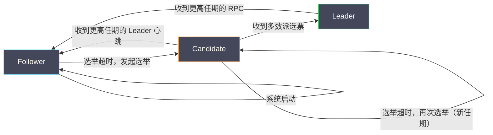

# 05 Raft 共识算法深度解析

**摘要：**

Raft 是 2014 年由 Diego Ongaro 和 John Ousterhout 在论文 *In Search of an Understandable Consensus Algorithm* 中提出的共识算法。它的设计目标与 Paxos 截然不同——Paxos 追求理论上的最优解，而 Raft 以**可理解性（Understandability）**为首要目标，刻意将共识问题分解为三个相对独立的子问题：领导者选举（Leader Election）、日志复制（Log Replication）、以及安全性（Safety）。Raft 的普及程度已经超越了 Paxos——etcd、CockroachDB、TiKV、Consul 等主流分布式系统都使用 Raft 作为一致性内核。本文从 Raft 的设计哲学出发，深入讲解三个子问题的实现机制，重点解析那些不显而易见的安全性保证（为什么拥有最新日志的候选节点才能当选 Leader、为什么不能直接提交前任 Leader 遗留的日志条目），并对比 Raft 与 Paxos 的本质差异。

---

## 第 1 章 为什么 Paxos 之后还需要 Raft

### 1.1 Paxos 的"不可理解性"问题

上一篇（第 04 篇）我们分析了 Paxos 的核心机制，也提到了它的工程实现难题。但问题不仅仅是工程复杂度——即使只是**理解** Paxos，对于大多数工程师来说也是一件困难的事情。

Ongaro 在他的博士论文中做了一个用户研究：让两组学生分别学习 Paxos 和 Raft，然后用测试题评估他们的理解程度。结果，学习 Raft 的学生在测试中显著优于学习 Paxos 的学生，且学习 Raft 的学生主观上认为 Raft 更容易理解。

Paxos 难以理解的根本原因有两个：

**原因一：Paxos 以"单值共识"为基础，没有给出完整的日志复制方案**

Basic Paxos 只解决了"就一个值达成共识"的问题。如何将多个 Basic Paxos 实例组合成一个连续的日志复制系统（Multi-Paxos），Lamport 的原始论文只给出了粗略的方向，没有完整的设计。每个工程团队各自填充细节，导致各种"Paxos 变体"层出不穷，且正确性难以验证。

**原因二：Paxos 的强假设（Proposer 可以自由选择任意值）使得系统状态空间复杂**

Paxos 允许任何 Proposer 在任意时刻发起提案，多个 Proposer 并发提案时的交互状态空间非常复杂。而 Raft 通过"强 Leader"（所有写操作必须经过 Leader）约束了并发度，大幅简化了状态空间。

### 1.2 Raft 的核心设计思路：强 Leader + 问题分解

Raft 的设计哲学可以概括为两点：

**强 Leader（Strong Leader）**：在任意时刻，集群中最多有一个 Leader；所有写操作都必须经过 Leader；Leader 到 Follower 的日志流是单向的（Leader 总是向 Follower 推送日志，而不是 Follower 向 Leader 拉取）。强 Leader 大幅简化了一致性推理——只需要保证 Leader 的日志是权威的，并正确地复制到多数派即可。

**问题分解**：Raft 将共识问题明确分解为三个独立的子问题，每个子问题都有清晰的语义边界：
1. **Leader Election（领导者选举）**：集群如何选出一个 Leader，并在 Leader 失效时选出新 Leader？
2. **Log Replication（日志复制）**：Leader 如何将客户端请求以正确的顺序复制到多数派？
3. **Safety（安全性）**：如何保证集群中的所有副本最终拥有相同的日志（即使 Leader 在中途崩溃）？

---

## 第 2 章 Raft 的基本概念

### 2.1 任期（Term）：Raft 的逻辑时钟

[[任期（Term）]]是 Raft 的核心概念，类似于 Paxos 中的提案编号，用于区分不同时期的 Leader。

**任期的定义**：任期是一个单调递增的整数，每当发生新的选举，任期号就递增。每个任期最多有一个 Leader（可能选举失败，没有 Leader），下一次选举开始新的任期。

```
任期 1: 节点 A 当选 Leader，任期 1 持续直到 A 崩溃
任期 2: 发起选举，但选举失败（无人获得多数票）
任期 3: 节点 C 当选新 Leader，任期 3 持续
```

**任期的作用**：节点用任期号来检测过时的 Leader 和消息。每个节点都记录自己当前所知的最新任期号（`currentTerm`）。如果收到一条消息，其任期号比自己的 `currentTerm` 小，则该消息被视为过时，直接拒绝。如果收到的任期号比自己的大，则更新 `currentTerm`，并立即转换为 Follower 状态（无论当前是什么角色）。

```python
# 每个节点的核心状态
currentTerm = 0    # 当前已知最大任期号（持久化到磁盘）
votedFor = None    # 本任期内投票给谁（持久化，防止重启后重复投票）
log = []           # 日志条目列表（持久化）
commitIndex = 0    # 已提交的最高日志索引（volatile）
lastApplied = 0    # 已应用到状态机的最高日志索引（volatile）

# Leader 特有状态（每次当选后重置）
nextIndex = {}     # 对每个 Follower，下一条待发送日志的索引
matchIndex = {}    # 对每个 Follower，已确认复制的最高日志索引
```

**任期号为什么必须持久化？**

假设节点 A 在任期 5 时投票给节点 B，然后 A 崩溃重启。如果 `currentTerm` 和 `votedFor` 没有持久化，A 重启后可能不记得自己投过票，在同一任期内再次投票给节点 C——这会导致同一任期有两个 Leader，破坏安全性。因此，`currentTerm`、`votedFor` 和 `log` 这三个状态必须在每次修改时持久化到磁盘，即使崩溃重启后也能恢复。

### 2.2 节点的三种状态

Raft 集群中的每个节点处于以下三种状态之一：

**Follower（跟随者）**：被动角色，响应来自 Leader 和 Candidate 的请求；不主动发起任何请求。如果在一段时间内（选举超时）没有收到 Leader 的心跳，会转变为 Candidate 发起选举。

**Candidate（候选者）**：选举期间的过渡状态，正在发起新的选举、收集选票。收到多数派选票后转变为 Leader；收到更高任期的消息后退回 Follower；选举超时未当选则重新发起选举（增加任期号）。

**Leader（领导者）**：处理所有客户端请求；向所有 Follower 复制日志；定期发送心跳（空的 `AppendEntries` RPC）维持权威，防止 Follower 触发选举超时。



---

## 第 3 章 领导者选举：如何选出唯一的 Leader

### 3.1 选举超时触发选举

每个 Follower 维护一个**选举超时计时器（Election Timeout Timer）**。只要在超时时间内收到 Leader 的心跳（或合法的 `AppendEntries` RPC），计时器就重置。如果超时时间内没有收到心跳，Follower 认为 Leader 已失效，发起新一轮选举。

**选举超时的随机化**：Raft 规定选举超时时间从一个区间（通常是 150ms ~ 300ms）中**随机选取**。随机化的目的是避免多个节点同时超时、同时发起选举、分散选票（选票分裂，无人获得多数派）。随机化使得大多数情况下只有一个节点先超时，它能在其他节点超时之前完成选举。

### 3.2 选举过程

**步骤一：Follower 转为 Candidate，自增任期号**

```python
def start_election():
    currentTerm += 1        # 任期号自增
    state = CANDIDATE       # 状态转为 Candidate
    votedFor = self_id      # 先给自己投一票
    votes_received = 1      # 计票：自己的一票
    reset_election_timer()  # 重置计时器（防止立即再次超时）
```

**步骤二：向所有其他节点发送 RequestVote RPC**

```python
RequestVote RPC 的参数：
  term          = currentTerm    # 候选者的当前任期
  candidateId   = self_id        # 候选者的节点 ID
  lastLogIndex  = len(log) - 1   # 候选者最后一条日志的索引
  lastLogTerm   = log[-1].term   # 候选者最后一条日志的任期号
```

**步骤三：Follower 决定是否投票**

每个 Follower 收到 `RequestVote` 时，做两个检查才决定是否投票：

**检查一：任期号检查**
- 如果 `term < currentTerm`：拒绝投票（候选者的任期号过时）
- 如果 `term > currentTerm`：更新 `currentTerm = term`，转为 Follower，继续检查二

**检查二：日志新鲜度检查（Vote for the Most Up-to-date Candidate）**

这是 Raft 安全性的关键约束：**只投票给日志"至少和自己一样新"的候选者**。

"更新"的定义（按以下规则比较）：
1. 如果两者的最后一条日志的任期号不同，任期号更大的更新
2. 如果任期号相同，日志更长（索引更大）的更新

```python
def on_request_vote(term, candidateId, lastLogIndex, lastLogTerm):
    if term < currentTerm:
        return VoteResponse(term=currentTerm, voteGranted=False)
    
    if term > currentTerm:
        currentTerm = term
        state = FOLLOWER
        votedFor = None
    
    # 检查：本任期内是否已经投票
    already_voted = (votedFor is not None and votedFor != candidateId)
    
    # 检查：候选者的日志是否足够新
    my_last_log_term = log[-1].term if log else 0
    my_last_log_index = len(log) - 1
    
    candidate_log_is_newer = (
        lastLogTerm > my_last_log_term or
        (lastLogTerm == my_last_log_term and lastLogIndex >= my_last_log_index)
    )
    
    if not already_voted and candidate_log_is_newer:
        votedFor = candidateId
        reset_election_timer()
        return VoteResponse(term=currentTerm, voteGranted=True)
    else:
        return VoteResponse(term=currentTerm, voteGranted=False)
```

**步骤四：Candidate 统计选票**

- 收到多数派（> n/2）的 `voteGranted=True`：当选 Leader，立即广播心跳，阻止其他节点发起选举
- 收到更高任期的响应：退回 Follower
- 选举超时：增加任期号，重新发起选举

### 3.3 为什么"日志最新"才能当选 Leader

这个约束是 Raft 安全性（"Leader Completeness"性质）的关键，值得深入解释。

**Leader Completeness 性质**：一条日志条目一旦被提交（多数派确认），它就会出现在所有未来 Leader 的日志中。

**为什么需要这个性质？**

考虑这样的场景：Leader A 已经提交了日志条目 X（多数派确认），然后 A 崩溃。如果新选出的 Leader B 没有日志条目 X，B 可能会把 X 对应的日志位置写入其他内容，导致已提交的操作"消失"，破坏线性一致性。

**"日志最新"约束如何保证 Leader Completeness？**

一条日志条目 X 被提交，意味着多数派节点（Quorum Q₁）都有 X。新 Leader 选举需要多数派投票（Quorum Q₂）。由于 Q₁ ∩ Q₂ ≠ ∅（任意两个多数派有交集），至少有一个节点同时在 Q₁ 和 Q₂ 中——它既有日志条目 X，也参与了新 Leader 的选举投票。

这个节点（称为"见证节点"）会拒绝给一个比自己日志旧的候选者投票（因为 Raft 的投票规则要求候选者的日志至少和自己一样新）。如果候选者没有日志条目 X，它的日志就比见证节点"旧"，见证节点会拒绝投票。因此，没有日志条目 X 的节点无法获得多数派选票，无法当选 Leader——日志最新约束保证了 Leader Completeness。

> [!note] 与 Paxos 的对比
> 在 Paxos 中，任何节点都可以成为 Proposer，然后通过 Phase 1 探知已有的提案来修复状态。这意味着 Paxos 允许"日志不完整的节点"发起提案，只要它在 Phase 1 时能发现并修复缺失的日志。
>
> Raft 的做法更严格：在选举阶段就过滤掉日志不完整的候选者，让当选的 Leader 天然拥有最完整的日志，无需 Phase 1 式的"探知和修复"过程。这大幅简化了 Leader 上任后的初始化逻辑，但代价是约束了选举的候选者范围。

---

## 第 4 章 日志复制：Leader 如何将操作同步到所有副本

### 4.1 日志条目的结构

Raft 的日志是一个有序的条目序列，每个条目包含三个字段：

```python
class LogEntry:
    index: int    # 日志索引（从 1 开始，单调递增）
    term: int     # 写入这条日志时的任期号（用于一致性检查）
    command: Any  # 客户端请求的操作（如 "set x = 1"）
```

`term` 字段看似冗余（每条日志不都记录了创建它的任期号吗？），但它是 Raft 安全性检查的关键——通过比较日志条目的 `term`，节点可以检测出日志中是否存在不一致（来自不同 Leader 任期的日志）。

### 4.2 AppendEntries RPC：日志复制的载体

Leader 通过 `AppendEntries` RPC 向 Follower 复制日志（同时用于发送心跳，心跳是不携带日志条目的 `AppendEntries`）：

```python
AppendEntries RPC 的参数：
  term          = currentTerm     # Leader 的当前任期
  leaderId      = self_id         # Leader 的 ID（Follower 转发客户端请求用）
  prevLogIndex  = nextIndex[f]-1  # 新日志条目之前的那条日志的索引
  prevLogTerm   = log[prevLogIndex].term  # 该条目的任期号
  entries       = [...]           # 要复制的日志条目（心跳为空）
  leaderCommit  = commitIndex     # Leader 已提交的最高日志索引
```

**一致性检查（Consistency Check）**：

`prevLogIndex` 和 `prevLogTerm` 这两个字段构成了一个"前缀匹配"检查：Follower 在接受新日志之前，先检查自己在 `prevLogIndex` 处的日志条目的任期号是否等于 `prevLogTerm`。如果不匹配，说明 Follower 的日志在这个位置之前就已经与 Leader 不一致，需要回退并修复。

这个检查保证了一个不变量：**如果 Follower 接受了 `AppendEntries`，那么 Follower 在 `prevLogIndex` 之前的所有日志条目都与 Leader 完全一致**（由归纳法可证）。

```python
def on_append_entries(term, leaderId, prevLogIndex, prevLogTerm, entries, leaderCommit):
    if term < currentTerm:
        return AppendEntriesResponse(term=currentTerm, success=False)
    
    # 重置选举超时（Leader 还活着）
    reset_election_timer()
    currentTerm = term
    state = FOLLOWER
    
    # 一致性检查
    if prevLogIndex > 0:
        if len(log) < prevLogIndex or log[prevLogIndex-1].term != prevLogTerm:
            return AppendEntriesResponse(term=currentTerm, success=False)
    
    # 追加/覆盖日志条目
    for i, entry in enumerate(entries):
        log_idx = prevLogIndex + i  # 0-indexed
        if log_idx < len(log):
            if log[log_idx].term != entry.term:
                # 冲突：截断后面所有日志，用 Leader 的日志覆盖
                log = log[:log_idx]
                log.append(entry)
            # else: 已有相同日志，跳过
        else:
            log.append(entry)
    
    # 更新 commitIndex
    if leaderCommit > commitIndex:
        commitIndex = min(leaderCommit, prevLogIndex + len(entries))
        apply_committed_entries()
    
    return AppendEntriesResponse(term=currentTerm, success=True)
```

### 4.3 日志提交：多数派确认后才能提交

Leader 追踪每个 Follower 的复制进度：
- `nextIndex[f]`：下一条待发送给 Follower f 的日志索引
- `matchIndex[f]`：已确认 Follower f 复制成功的最高日志索引

当某个日志索引 `N` 满足以下条件时，Leader 将 `commitIndex` 更新为 `N`（提交该日志条目）：

```python
def maybe_update_commit_index():
    # 找到最大的 N，满足：
    # 1. N > commitIndex
    # 2. 多数派的 matchIndex >= N
    # 3. log[N].term == currentTerm（关键约束！下文详解）
    
    for N in range(commitIndex + 1, len(log) + 1):
        replication_count = 1  # Leader 自己算一票
        for follower in followers:
            if matchIndex[follower] >= N:
                replication_count += 1
        
        if replication_count > len(cluster) / 2:
            if log[N-1].term == currentTerm:
                commitIndex = N
                apply_committed_entries()
```

**第 3 个条件的约束：只提交当前任期的日志**

注意 `log[N].term == currentTerm` 这个约束——Leader 不能直接提交**前任 Leader 遗留的日志条目**，必须通过提交当前任期的新日志来"间接"提交前任的日志。这是 Raft 中一个关键的、容易被误解的设计决策。

---

## 第 5 章 安全性：为什么不能直接提交旧任期的日志

### 5.1 问题场景：直接提交旧任期日志的危险

考虑以下场景（Raft 论文 Figure 8 的经典场景）：

```
集群有 5 个节点：S1、S2、S3、S4、S5
日志条目：index=2, term=2 的条目（由任期 2 的 Leader S1 写入）

时间线：
T1: S1 在任期 2 将 index=2, term=2 复制到 S2
    （只复制到了 S2，还没提交——只有 2/5 票，不是多数派）

T2: S1 崩溃，任期 3 开始，S5 当选新 Leader
    S5 的日志：只有 index=1 的条目（没有 index=2 的条目）
    S5 在任期 3 写入一些新的日志条目（index=2, term=3）
    但 S5 只复制给了自己

T3: S5 崩溃，任期 4 开始，S1 重启并当选 Leader（S1 的日志包含 index=2, term=2）
    S1 将 index=2, term=2 复制到 S3（现在 S1、S2、S3 都有了 index=2, term=2）
    
问题：此时 S1 能否提交 index=2, term=2？
```

**如果 S1 直接提交 index=2, term=2（旧任期的日志）**：

```
T4: 假设 S1 提交了 index=2, term=2，客户端收到成功响应
T5: S1 崩溃，任期 5 开始
    S5 重新加入集群，S5 的日志更"新"（index=2, term=3 任期号更大）
    S5 有资格当选新 Leader（因为它的 lastLogTerm=3 > S3 的 lastLogTerm=2）
    S5 当选后，将 index=2, term=3 覆盖到 S1、S2、S3
    
→ index=2, term=2 的操作曾经被提交（客户端收到成功），
  现在却被覆盖，对应的状态机操作被抹去
→ 已提交的操作丢失，线性一致性被破坏！
```

### 5.2 Raft 的解决方案：用当前任期的提交来"带动"旧任期

Raft 规定：Leader **不能直接提交旧任期（term < currentTerm）的日志条目**，只能提交当前任期（term == currentTerm）的日志条目。但当当前任期的日志被提交时，它之前所有未提交的日志条目（包括旧任期的）也被**间接提交**（通过 `commitIndex` 向前推进）。

**回到上面的场景，正确的处理方式是**：

```
T4（修正版）：
    S1（任期 4 的 Leader）在任期 4 写入新的日志条目（index=3, term=4）
    将 index=3, term=4 复制到 S2 和 S3（多数派确认）
    S1 提交 index=3, term=4

    提交 index=3 时，commitIndex 从 1 推进到 3，
    index=2, term=2 也被"顺带"提交了

T5: 即使 S1 崩溃，S5 也无法覆盖 index=2, term=2 了——因为 S2 和 S3 已经有了
    index=3, term=4 的日志，S5 的日志（只有到 index=2, term=3）比 S2/S3 更"旧"，
    S5 无法获得 S2 和 S3 的投票，无法当选新 Leader
```

**这个设计的核心逻辑**：通过要求"只提交当前任期的日志"，Raft 确保了一旦某条日志被提交，**没有任何未来的 Leader 能够"合法地"覆盖它**——因为任何能合法当选新 Leader 的节点，其日志必然包含这条提交的条目（由 Leader Completeness 保证）。

> [!warning] 常见误解
> 很多人误解为"Raft 不能提交旧任期的日志"。这是不准确的——Raft 可以**间接**提交旧任期的日志（通过推进 `commitIndex` 覆盖旧条目），只是不能**直接**用旧任期的日志来更新 `commitIndex`。区别在于：直接提交旧任期日志可能导致后来的 Leader 覆盖这条日志（因为新 Leader 不知道它已经被提交），而间接提交通过当前任期的日志来"锚定"旧日志的安全性。

---

## 第 6 章 日志修复：新 Leader 如何处理不一致的 Follower

### 6.1 为什么 Follower 的日志可能不一致

当 Leader 崩溃时，Follower 的日志可能处于各种不一致的状态：

```
正常 Leader 的日志：
[1,T1] [2,T1] [3,T2] [4,T3] [5,T3]

可能的 Follower 状态：
  Follower A（日志更少，正常情况）：
    [1,T1] [2,T1] [3,T2]
    → Leader 还没来得及复制 4、5

  Follower B（多余日志，历史上曾是 Leader）：
    [1,T1] [2,T1] [3,T2] [4,T2] [5,T2]
    → B 在任期 2 时当过 Leader，写入了一些未提交的日志，然后崩溃
    → 现在的 Leader（任期 3）的 index=4、5 与 B 不同
```

### 6.2 nextIndex 回退：自动修复不一致

当 Leader 向 Follower 发送 `AppendEntries` 时，如果 Follower 的一致性检查失败（`prevLogTerm` 不匹配），Follower 返回 `success=False`。Leader 收到后将该 Follower 的 `nextIndex` 减一，重发更早的日志，直到找到两者日志的"公共前缀"，然后从那里开始补发所有缺失的日志，覆盖 Follower 上冲突的部分。

**优化：加速日志回退（Accelerated Log Backtracking）**

朴素的"每次减一"回退在日志差异很大时效率极低（需要多轮 RPC 往返才能找到公共前缀）。Raft 论文中提出了一个优化：Follower 在返回失败时，同时告知 Leader 自己在失败位置的日志的 `term`（以及该 `term` 在自己日志中的最早索引）。Leader 根据这个信息可以跳过整个 `term` 的日志，大幅加速回退过程。

---

## 第 7 章 成员变更：集群配置的安全修改

### 7.1 为什么成员变更是危险的

向 Raft 集群中添加或删除节点（成员变更）是一个充满陷阱的操作。朴素的方案——直接让所有节点切换到新配置——会产生**双多数派（Split Brain）**风险：

```
原配置（3 节点）：{S1, S2, S3}，多数派 = 2 个节点
新配置（5 节点）：{S1, S2, S3, S4, S5}，多数派 = 3 个节点

如果 S1、S2 率先切换到新配置，S3 还在旧配置：
  新配置的多数派（3/5）：{S1, S2, S4}，可以提交日志
  旧配置的多数派（2/3）：{S1, S3}，也可以提交日志

→ 同时存在两个"多数派"，可能提交冲突的日志
```

### 7.2 联合共识（Joint Consensus）

Raft 最初提出的成员变更方案是**联合共识（Joint Consensus）**：引入一个过渡配置 `C_old,new`，在过渡期间同时遵守新旧两个配置的多数派规则（操作需要同时获得旧配置的多数派和新配置的多数派的确认才能提交）。过渡期结束后，切换到纯新配置。

联合共识正确，但实现复杂。

### 7.3 单步成员变更（Single-Server Changes）

Raft 扩展论文（Diego Ongaro 的博士论文）提出了一个更简洁的方案：**每次只添加或删除一个节点**。可以证明，对于奇数节点集群，添加一个节点（偶数→奇数）或删除一个节点（奇数→偶数），新旧两个配置的多数派必然有交集（不存在双多数派风险）。

这个方案的约束是：每次只能改变一个节点，且上一次变更完全提交后才能开始下一次变更。etcd 使用的是这个方案。

---

## 第 8 章 Raft vs Paxos：本质差异对比

| 维度 | Paxos（Multi-Paxos）| Raft |
| :--- | :--- | :--- |
| **设计目标** | 最优的消息复杂度和容错能力 | 可理解性优先 |
| **Leader 选举** | 未明确定义，各实现自行设计 | 明确定义（随机超时 + RequestVote）|
| **日志一致性** | Phase 1 探知 + 修复，允许日志空洞 | AppendEntries 严格顺序复制，无空洞 |
| **旧 Leader 日志的提交** | 新 Proposer 在 Phase 1 时主动修复旧提案 | 只能由当前任期的提交间接触发 |
| **成员变更** | 未定义 | 单步变更或联合共识 |
| **日志空洞** | 允许（不同日志槽位可以并发提案）| 不允许（严格按索引顺序提交）|
| **读操作优化** | 无标准方案 | ReadIndex / Lease Read |
| **工程可实现性** | 困难（大量实现细节未定义）| 较容易（协议完整定义）|
| **代表实现** | Google Chubby、Apache ZooKeeper（ZAB）| etcd、CockroachDB、TiKV、Consul |

**Raft 相比 Paxos 的根本差异**：Raft 通过"强 Leader"约束，将所有写操作序列化经过 Leader，避免了 Paxos 中多 Proposer 并发带来的日志空洞和复杂的修复逻辑。代价是 Leader 成为写操作的瓶颈——所有写请求必须经过单一节点，在极高吞吐量场景下 Leader 可能成为性能瓶颈。Paxos 的多 Proposer 模型理论上可以并发提案到不同日志槽位，但实现复杂度大幅提升。

---

## 第 9 章 Raft 在工程实践中的关键配置与调优

### 9.1 心跳间隔与选举超时的设置原则

Raft 性能对以下参数非常敏感：

**心跳间隔（Heartbeat Interval）**：Leader 向所有 Follower 发送心跳的频率。过长会导致 Follower 频繁触发不必要的选举；过短会增加网络和 CPU 开销。通常设置为选举超时的 1/10。

**选举超时（Election Timeout）**：Follower 等待心跳的最大时间。需满足以下不等式：

```
广播时间（broadcastTime）<< 选举超时（electionTimeout）<< MTBF（平均故障间隔）

其中：
  broadcastTime = Leader 广播一轮 AppendEntries 的往返时间（通常 0.5ms~20ms）
  electionTimeout = 选举超时（通常 150ms~300ms）
  MTBF = 单台服务器的平均故障间隔（通常月级到年级）
```

### 9.2 读操作的线性一致性保证

**直接读 Leader 的状态机并不安全**——如果 Leader 已经被网络分区孤立但还不知道，它可能返回旧数据。Raft 提供了两种线性读方案：

**ReadIndex**：Leader 收到读请求时，先记录当前的 `commitIndex`，然后发一轮心跳确认自己仍然是合法 Leader（收到多数派确认）。确认后等到 `applyIndex >= commitIndex` 时，读取状态机并返回结果。这保证了读到的数据至少是 `commitIndex` 时刻的最新状态。

**Lease Read**：Leader 记录上次心跳的时间，如果距上次多数派心跳确认的时间 < 选举超时，则认为自己仍然是合法 Leader，可以直接读取本地状态机而无需额外的 RPC。Lease Read 性能更高（无额外 RPC），但依赖时钟精度（与前文时钟漂移问题相关）——如果时钟跳跃，可能违反线性一致性。etcd 默认使用 ReadIndex，TiKV 提供 Lease Read 作为可选优化。

---

## 参考资料

1. Ongaro, D., & Ousterhout, J. (2014). In Search of an Understandable Consensus Algorithm (Extended Version). *USENIX ATC 2014*. https://raft.github.io/raft.pdf
2. Ongaro, D. (2014). *Consensus: Bridging Theory and Practice* (PhD Thesis). Stanford University.
3. Howard, H., Schwarzkopf, M., Madhavapeddy, A., & Crowcroft, J. (2015). Raft Refloated: Do We Have Consensus? *ACM SIGOPS Operating Systems Review, 49*(1).
4. etcd 官方文档：Raft implementation. https://github.com/etcd-io/etcd/tree/main/server/etcdserver/api/rafthttp
5. TiKV 官方文档：Raft in TiKV. https://tikv.org/deep-dive/consensus-algorithm/raft/
6. Huang, C., et al. (2020). TiDB: A Raft-based HTAP Database. *VLDB 2020*.
7. Kleppmann, M. (2017). *Designing Data-Intensive Applications*. O'Reilly Media. Chapter 9.
8. The Raft Website. https://raft.github.io/（含可视化动画）

---

> [!note] 思考题
> 1. Lamport 逻辑时钟为每个事件分配一个递增的逻辑时间戳——如果事件 A 'happened before' B，则 L(A) < L(B)。但 L(A) < L(B) 不意味着 A happened before B（可能是并发的）。向量时钟（Vector Clock）通过维护每个节点的计数器解决了这个问题——但向量时钟的空间复杂度是 O(n)。在 1000 节点集群中，每条消息附带 1000 个计数器——这个开销如何优化？
> 2. DynamoDB 使用向量时钟检测数据冲突——当两个节点并发更新同一 Key 时，向量时钟判断为'冲突'而非覆盖。冲突的解决由客户端负责（如'最后写入者胜出'或'合并'）。在什么业务场景下'最后写入者胜出'可能导致数据丢失？Amazon 的购物车为什么使用'合并'策略？
> 3. 混合逻辑时钟（HLC，Hybrid Logical Clock）结合了物理时钟和逻辑时钟——在物理时钟同步良好时使用物理时间戳，在物理时钟跳变时退回到逻辑时钟。CockroachDB 使用 HLC。HLC 相比纯逻辑时钟的优势是什么？它如何在没有原子钟的环境中提供'近似'的全局时间？
