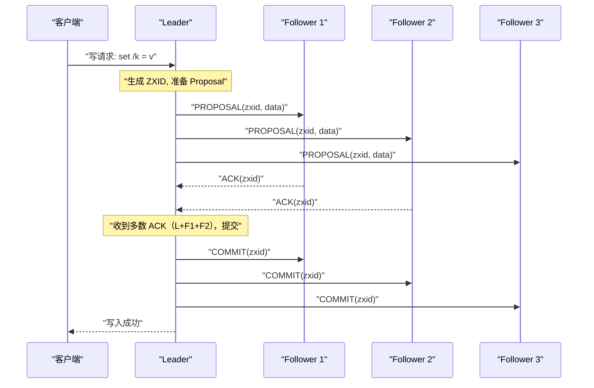

# 06 ZAB 协议：ZooKeeper 的一致性基石

**摘要：**

[[ZooKeeper]] 是分布式系统生态中最重要的协调服务之一，被 [[Hadoop YARN]]、[[HBase]]、[[Kafka]] 等大量系统依赖来实现 Leader 选举、配置管理和分布式锁。支撑 ZooKeeper 高可用和强一致性的核心，是一个鲜为人知却设计精妙的协议——**ZAB（ZooKeeper Atomic Broadcast，ZooKeeper 原子广播协议）**。ZAB 不是 Paxos 的直接实现，也不是 Raft（Raft 诞生时间晚于 ZAB），而是一个针对"**主备模式下的状态机复制**"独立设计的协议，它在某些关键设计上与 Raft 有相似之处，但在 ZXID 的编码方式、崩溃恢复的语义以及 Leader 切换的一致性保证上有其独特之处。本文从 ZooKeeper 的使用场景出发，推导 ZAB 的两种工作模式（崩溃恢复模式和消息广播模式），深入分析 ZXID 的二进制设计之妙、Leader 切换时的数据同步机制，并系统对比 ZAB 与 Raft 的异同。

---

## 第 1 章 ZooKeeper 与 ZAB 的背景

### 1.1 ZooKeeper 解决什么问题

[[Apache ZooKeeper]] 于 2007 年由雅虎开发，设计目标是为分布式应用提供**高可靠的协调服务**。它不是一个通用数据库，而是一个专注于存储少量关键协调数据（配置、状态、命名空间）的系统，强调强一致性和高可用性。

ZooKeeper 的典型应用场景：

**场景一：分布式 Leader 选举**

[[HBase]] 的 HMaster、[[Hadoop YARN]] 的 ResourceManager 都用 ZooKeeper 的临时节点（Ephemeral ZNode）做高可用切换。Leader 在 ZooKeeper 中创建临时节点 `/master`，备节点 Watch 这个节点；Leader 崩溃后临时节点自动删除，备节点监听到删除事件后竞争创建新的 `/master` 临时节点，成功者成为新 Leader。

**场景二：分布式配置中心**

将系统配置存储在 ZooKeeper 的 ZNode 中，所有服务节点 Watch 对应的配置路径。配置变更时，ZooKeeper 向所有 Watcher 推送通知，服务节点拉取新配置并热更新。ZooKeeper 的强一致性保证所有节点最终看到相同的配置。

**场景三：服务注册与发现**

服务节点启动时在 ZooKeeper 中注册自己的地址信息（临时节点），服务消费方 Watch 服务节点目录。节点宕机后临时节点自动清除，消费方实时感知服务节点变化。

**场景四：分布式锁**

如分布式锁专栏（第 04 篇）中详细分析的，ZooKeeper 的临时顺序节点天然支持公平分布式锁，且锁的自动释放（Session 超时）比 Redis TTL 机制更鲁棒。

以上所有场景的共同特点是：**数据量小（KB 级），但对一致性要求极高**——如果两个节点同时以为自己是 Leader，或者两个节点看到不同的配置，后果是灾难性的。这正是 ZAB 协议被设计为强一致协议（CP 系统）的原因。

### 1.2 ZAB 的诞生背景

ZAB 是 [[Flavio Junqueira]]、[[Benjamin Reed]] 和 [[Marco Serafini]] 在 Yahoo! 研究院设计的，正式发表于 2011 年的论文 *Zab: High-performance broadcast for primary-backup systems*。

ZAB 的设计目标和约束与 Paxos 不同：

**Paxos 的设计目标**：在任意 f 个节点崩溃的情况下，任意节点都可以发起提案，系统最终达成共识。

**ZAB 的设计目标**：在主备（Primary-Backup）架构下，由 Leader（Primary）将写操作以**有序、原子**的方式广播给所有 Follower（Backup），且在 Leader 切换时保证操作的全局顺序不被破坏。

ZAB 的核心约束——**有序性（Ordering）**——比 Paxos 的共识要求更强：ZAB 不仅要求所有节点最终接受相同的操作集合（共识），还要求所有节点按相同的顺序执行这些操作。这对于状态机复制至关重要——只有按相同顺序执行相同操作，所有副本的状态才能保持一致。

---

## 第 2 章 ZAB 的两种工作模式

ZAB 协议的运行分为两种截然不同的模式，根据 Leader 是否存在动态切换：

### 2.1 消息广播模式（Message Broadcasting）：正常工作时

当集群有稳定的 Leader 且 Leader 与多数 Follower 保持连接时，ZAB 运行在**消息广播模式**。这是 ZooKeeper 正常工作时的状态，负责处理客户端的写请求。

消息广播模式的工作流程类似于一个简化的两阶段提交（2PC）：

**步骤一：客户端发送写请求**

客户端可以连接到任意 ZooKeeper 节点（Leader 或 Follower）。如果连接到 Follower，Follower 会将写请求转发给 Leader。

**步骤二：Leader 生成 Proposal，广播给所有 Follower**

Leader 收到写请求后，为该请求分配一个全局唯一的事务 ID（ZXID，后文详解），然后将该写操作封装为一个 **Proposal（提案）**，通过 FIFO 消息队列广播给所有 Follower：

```
Leader → Follower_1: PROPOSAL(zxid=0x0001_0003, data="set /config = v2")
Leader → Follower_2: PROPOSAL(zxid=0x0001_0003, data="set /config = v2")
Leader → Follower_3: PROPOSAL(zxid=0x0001_0003, data="set /config = v2")
```

**关键设计：FIFO TCP 队列保证有序性**

ZAB 通过为每个 Leader-Follower 对维护一个 FIFO 的 TCP 连接，保证 Proposal 按照 ZXID 顺序到达每个 Follower。这比 Raft 的 `prevLogIndex` + `prevLogTerm` 一致性检查更简洁——FIFO 队列天然保证了顺序，不需要额外的"前缀匹配"检查。

**步骤三：Follower 写入事务日志，返回 ACK**

Follower 收到 Proposal 后，将其写入本地事务日志（但不立即应用到内存数据树），然后向 Leader 返回 ACK：

```
Follower_1 → Leader: ACK(zxid=0x0001_0003)
Follower_2 → Leader: ACK(zxid=0x0001_0003)
```

**步骤四：Leader 收到多数 ACK，广播 COMMIT**

当 Leader 收到多数 Follower（包含自身）的 ACK 后，广播 **COMMIT** 消息：

```
Leader → All Followers: COMMIT(zxid=0x0001_0003)
```

Follower 收到 COMMIT 后，将对应的 Proposal 从日志中取出，应用到内存数据树，并通知等待的客户端（如果客户端连接到该 Follower）。



**与 2PC 的关键区别**：ZAB 的消息广播与传统 2PC 的根本区别在于：**ZAB 不需要 Follower 的"同意"才能提交**——Leader 一旦收到多数 ACK 就直接提交，Follower 即使返回了 ACK 也没有"否决权"（不像 2PC 中参与者可以投 ABORT）。这消除了 2PC 的阻塞问题：Leader 不需要等待所有节点，只需多数派即可。

### 2.2 崩溃恢复模式（Crash Recovery）：Leader 失效时

当 Leader 崩溃、与多数 Follower 失联，或集群启动初始化时，ZAB 进入**崩溃恢复模式**。这个模式的目标有两个：

**目标一：选出新的合法 Leader**（具有所有已提交事务的节点）

**目标二：确保所有 Follower 与新 Leader 的数据完全同步**，然后再进入消息广播模式

崩溃恢复模式分为两个子阶段：Leader 选举 + 数据同步。

---

## 第 3 章 ZXID：ZAB 设计中最精妙的细节

### 3.1 ZXID 的结构：64 位二进制的巧妙编码

**ZXID（ZooKeeper Transaction ID）** 是 ZAB 协议中标识事务的全局唯一 ID，是一个 64 位整数，分为两部分：

```
ZXID (64 bits):
┌─────────────────────────────────────────────────────┬───────────────────────┐
│                    高 32 位：epoch（纪元号）             │  低 32 位：counter（计数器）│
└─────────────────────────────────────────────────────┴───────────────────────┘
```

- **高 32 位：epoch（纪元号）**：对应 Raft 中的 term（任期号）。每当选出新的 Leader，epoch 递增。每个 epoch 最多对应一个 Leader。
- **低 32 位：counter（计数器）**：在同一个 epoch 内，Leader 为每个新事务分配的单调递增序号。每次选出新 Leader 时，counter 从 0 重置。

**ZXID 的比较规则**：先比较 epoch（高 32 位），epoch 大的 ZXID 更新；epoch 相同时，counter（低 32 位）大的更新。

### 3.2 为什么 epoch 和 counter 要分开编码

这个设计乍看有些过度工程，但其背后有深刻的原因：

**原因一：快速识别"旧 Leader"的遗留事务**

在 Leader 切换时，新 Leader 需要识别哪些是旧 Leader 遗留的未提交事务（需要决定是提交还是丢弃）。通过 ZXID 的高 32 位（epoch），新 Leader 可以立即识别出所有高 32 位不等于当前 epoch 的 ZXID——这些都是旧 Leader 的遗留事务。

如果 ZXID 是一个简单的单调递增整数（如 Raft 的 logIndex），新 Leader 无法仅从 ZXID 判断一个事务是哪个 Leader 产生的，需要额外的元数据来做这个判断。

**原因二：防止"幽灵 ZXID"导致错误的有序性判断**

考虑这个场景：Leader L1（epoch=1）的最后一个事务 ZXID = (1, 100)，L1 崩溃。新 Leader L2（epoch=2）从 0 重新开始计数，新事务 ZXID = (2, 1)、(2, 2)...

如果使用简单的单调整数，L1 的事务 ID = 100，L2 的事务 ID 从 101 开始。这看起来没问题，但如果 L2 崩溃后 L3 再选出（epoch=3），L3 需要知道从哪个数字开始计数——它必须扫描所有节点找到最大的 ZXID，这是一个代价较高的操作。

使用 epoch+counter 的二进制编码，L3 只需知道当前 epoch=3，counter 从 0 重置即可，不需要扫描历史 ZXID。

**原因三：支持 ZXID 的快速 Follower 同步**

在崩溃恢复阶段，Follower 向新 Leader 发送自己最大的 ZXID。新 Leader 通过比较 epoch，可以快速判断 Follower 的日志是否来自同一个 epoch——来自旧 epoch 的日志需要差异化处理（可能需要截断或补发），来自同一 epoch 的日志只需要比较 counter 来决定补发哪些缺失的日志。

### 3.3 ZXID 与 Raft Term+Index 的对比

| 维度 | ZAB 的 ZXID | Raft 的 (term, index) |
| :--- | :--- | :--- |
| **编码方式** | 单个 64 位整数（高 32 位 epoch + 低 32 位 counter）| 两个独立整数（term 和 index）|
| **新 Leader 重置** | counter 重置为 0，epoch 递增 | index 不重置，全局单调递增 |
| **最大日志比较** | 直接比较 ZXID 整数大小 | 先比较 lastLogTerm，再比较 lastLogIndex |
| **旧任期日志识别** | 通过高 32 位 epoch 直接判断 | 通过 log[i].term 字段判断 |
| **全局顺序保证** | ZXID 全局唯一有序 | (term, index) 对全局唯一有序 |

---

## 第 4 章 崩溃恢复：Leader 选举与数据同步

### 4.1 Leader 选举算法：FastLeaderElection

ZooKeeper 使用 **FastLeaderElection** 算法进行 Leader 选举（ZooKeeper 3.4+ 版本）。算法基于 ZXID 选出拥有最新数据的节点作为 Leader：

**选举过程**：

**步骤一**：节点进入 LOOKING 状态（未找到 Leader），发起选举，先投票给自己（包含自己的 `(myId, myZxid)`）

**步骤二**：向所有其他节点广播投票（Vote），包含：
- `epoch`：选举轮次（防止接受旧轮次的投票）
- `leader`：当前认为应该当选的节点 ID
- `zxid`：候选节点的最大 ZXID

**步骤三**：收到其他节点的投票后，根据以下规则更新自己的投票（"选更好的候选人"）：

```python
def compare_votes(my_vote, received_vote):
    """
    返回 True 表示 received_vote 更好，应该更新自己的投票
    比较规则：先比 ZXID（epoch），再比 epoch（选举轮次），最后比 myId（打破平局）
    """
    # 1. 先比 ZXID 的 epoch（高 32 位）
    if received_vote.zxid.epoch > my_vote.zxid.epoch:
        return True
    if received_vote.zxid.epoch < my_vote.zxid.epoch:
        return False
    
    # 2. ZXID epoch 相同，比 ZXID counter（低 32 位）
    if received_vote.zxid.counter > my_vote.zxid.counter:
        return True
    if received_vote.zxid.counter < my_vote.zxid.counter:
        return False
    
    # 3. ZXID 完全相同，比 server ID（ID 更大的优先）
    return received_vote.leader_id > my_vote.leader_id
```

**步骤四**：当某个节点发现自己的投票票数超过集群半数，它就认为自己当选 Leader，切换到 LEADING 状态，并通知其他节点。其他收到通知的节点切换到 FOLLOWING 状态。

**选举的关键性质**：选举确保**拥有最大 ZXID 的节点**当选 Leader（ZXID 最大意味着该节点的数据是所有节点中最新的）。这与 Raft 的"日志最新才能当选"约束是相同的思路，只是 ZAB 用 ZXID 大小来衡量"新鲜度"，Raft 用 (lastLogTerm, lastLogIndex) 来衡量。

### 4.2 数据同步：新 Leader 上任后的第一件事

新 Leader 当选后，**不能立即进入消息广播模式开始处理客户端请求**，必须先完成数据同步，确保所有 Follower 的数据与 Leader 完全一致，然后才能开始服务。

这个阶段称为 **Discovery + Synchronization（发现 + 同步）**，对应 ZAB 论文中的 Phase 1 和 Phase 2：

**Discovery 阶段（类似 Paxos Phase 1）**：

新 Leader 向所有 Follower 发送 `NEWLEADER(epoch)` 消息，宣告新的 epoch。每个 Follower 回复自己的最大 ZXID。Leader 收集所有 Follower 的 ZXID 信息，找到"历史上可能被提交的最大 ZXID"（即所有 Follower 中最大的 ZXID）。

**Synchronization 阶段（数据对齐）**：

根据每个 Follower 的 ZXID 与 Leader 的对比，有三种同步情形：

**情形一：Follower 的数据比 Leader 旧（缺少部分 PROPOSAL）**

Leader 向 Follower 补发缺失的事务：

```
Leader 的日志：[zxid=1001, zxid=1002, zxid=1003, zxid=1004]
Follower 的日志：[zxid=1001, zxid=1002]
→ Leader 向 Follower 发送 PROPOSAL(zxid=1003) 和 PROPOSAL(zxid=1004)
→ Follower 应用后两者数据一致
```

**情形二：Follower 的数据与 Leader 相同**

无需同步，直接进入广播模式。

**情形三：Follower 有旧 Leader 遗留的未提交 PROPOSAL**

这是最复杂的情形。旧 Leader 可能在 COMMIT 发出之前崩溃，某些 Follower 已经收到了 PROPOSAL 并写入了事务日志，但没有收到 COMMIT（因此这些 PROPOSAL 对应的操作还未提交到状态机）。

新 Leader 需要决定：这些遗留的未提交 PROPOSAL 应该**继续提交**（COMMIT）还是**丢弃**（TRUNC）？

ZAB 的规则：
- 如果该 PROPOSAL 的 ZXID **等于**新 Leader 自己拥有的最大 ZXID，或新 Leader 也有这条 PROPOSAL → 继续提交（因为这条 PROPOSAL 可能已经被旧 Leader 提交，只是 COMMIT 消息没有到达这个 Follower）
- 如果该 PROPOSAL 的 ZXID **大于**新 Leader 的最大 ZXID → 截断（TRUNC），丢弃这条 PROPOSAL（因为新 Leader 没有这条 PROPOSAL，说明它从未被多数派接受，旧 Leader 必然没有提交它）

> [!info] ZAB 的提交/截断判断
> 新 Leader 当选时，它拥有所有节点中最大的 ZXID（由选举保证）。因此，任何 Follower 拥有的 ZXID 如果大于新 Leader 的最大 ZXID，说明这是旧 Leader 在当选新 Leader 之后单方面写入的 PROPOSAL，没有被多数派确认，应该截断。
>
> 这与 Raft 中"新 Leader 不提交旧 term 日志"的原则异曲同工：都是为了保证"只有被多数派确认的操作才能最终生效"。

**同步完成后**：Leader 向所有已完成同步的 Follower 发送 `UPTODATE` 消息，宣告数据同步完成。此时，新 Leader 正式进入消息广播模式，开始处理客户端请求。

---

## 第 5 章 ZAB 的有序性保证：两种关键有序性

ZAB 协议设计的核心目标之一是**全局有序性**，它保证了以下两种有序性：

### 5.1 因果有序（Causal Order）

如果事务 T₁ 在事务 T₂ 之前被 Leader 广播，那么任意节点在执行 T₂ 之前必须先执行 T₁。这保证了操作的因果顺序：如果 T₂ 的数据依赖于 T₁ 的结果（例如：T₁ 创建了 ZNode `/config`，T₂ 在 `/config` 下写入数据），那么所有节点都会先看到 `/config` 再看到其下的数据，不会出现"子节点存在但父节点不存在"的状态。

ZAB 通过 FIFO TCP 队列保证因果有序：Leader 按 ZXID 递增顺序发送 PROPOSAL，FIFO TCP 保证 Follower 按相同顺序收到，因此所有 Follower 按相同顺序执行事务。

### 5.2 全局有序（Total Order）

ZAB 保证了更强的全局有序性：所有节点执行的事务序列完全相同（不仅顺序相同，还包括集合相同——没有节点执行了其他节点没有执行的事务）。这是状态机复制的核心要求：只有所有副本执行相同的操作序列，才能保持状态一致。

在 Leader 切换时，全局有序性面临挑战：

**场景**：旧 Leader L1 提交了事务 T₁，发出了 COMMIT(T₁)，但只有部分 Follower 收到了 COMMIT，另一些 Follower 只收到了 PROPOSAL(T₁)。L1 崩溃，新 Leader L2 上任。

ZAB 的处理：L2 在数据同步阶段，会确保所有活跃的 Follower 要么都应用 T₁（已收到 COMMIT 的 Follower 已经应用了；未收到 COMMIT 但有 PROPOSAL 的 Follower，L2 会向其补发 COMMIT），要么 T₁ 被截断（如果 T₁ 从未到达多数派，则截断，保证所有节点都不执行 T₁）。无论是哪种情况，最终所有活跃节点对 T₁ 的处理是一致的——要么都执行，要么都不执行。

---

## 第 6 章 ZAB vs Raft：协议对比

### 6.1 设计目标的差异

ZAB 的设计目标是"**主备模式下的有序原子广播**"，而 Raft 的设计目标是"**可理解的通用共识**"。这个差异导致了两者在某些设计上的取舍：

| 维度 | ZAB | Raft |
| :--- | :--- | :--- |
| **事务 ID 设计** | 64 位 ZXID（epoch + counter）| 独立的 (term, index)，index 全局递增 |
| **新 Leader 上任** | Discovery + Sync 两阶段，严格保证多数派对齐后才服务 | 上任后立即可服务，通过提交当前 term 日志间接同步 |
| **旧 Leader 日志处理** | Sync 阶段显式 COMMIT 或 TRUNC | 由 AppendEntries 的冲突覆盖机制隐式处理 |
| **有序性保证手段** | FIFO TCP 队列天然保证顺序 | AppendEntries 的 prevLogIndex 检查 + 串行提交 |
| **协议状态数** | 3 个状态（LOOKING/LEADING/FOLLOWING）| 3 个状态（Follower/Candidate/Leader）|
| **读操作一致性** | 默认可能读到旧数据（需 sync() 保证）| ReadIndex / Lease Read 保证线性一致 |
| **成员变更** | 不支持动态成员变更（需要重启配置）| 支持单步成员变更或联合共识 |

### 6.2 ZAB 读操作的一个重要局限

ZooKeeper 的默认读操作**不保证线性一致性**——客户端从 Follower 读取数据，可能读到旧版本的数据（Follower 的数据可能落后于 Leader）。

这是 ZooKeeper 在 CAP 权衡中有意为之的设计：**读操作从本地 Follower 服务，不需要经过 Leader，大幅提高了读吞吐量**，但牺牲了读的线性一致性。写操作经过 Leader 多数派确认，保证了写的强一致性。

如果应用需要在读写之间保证线性一致性（如"写入后立即读取，必须能看到刚写入的数据"），ZooKeeper 提供了 `sync()` API：客户端在读取之前先调用 `sync()`，ZooKeeper 会等待直到 Follower 同步到最新的提交点，然后才返回读结果。代价是 `sync()` 会引入额外的延迟（需要一次 Leader 到 Follower 的同步往返）。

> [!warning] 生产避坑：ZooKeeper 读操作的不一致性陷阱
> 在生产中，有一个常见的 Bug 模式：
>
> ```
> 步骤 1：客户端 A 向 ZooKeeper 写入数据（通过 Leader 确认）
> 步骤 2：客户端 A 通知客户端 B："数据已写入，你可以读了"
> 步骤 3：客户端 B 从某个 Follower 读取数据，读到了旧数据
> ```
>
> 这不是 Bug，而是 ZooKeeper 的设计特性。如果你的业务需要"写入后立即读到最新数据"，有两种解法：
> 1. 所有客户端总是从 Leader 读（通过设置 `zookeeper.readonlyclient` 为 false，并只连 Leader）
> 2. 读取前调用 `sync()` 同步到最新状态

### 6.3 ZAB 与 Raft 的核心相似性

尽管设计背景不同，ZAB 和 Raft 在以下核心机制上高度一致，这不是巧合，而是分布式共识的本质决定的：

**相似点一：都依赖 epoch/term 来区分"旧 Leader"**

无论是 ZAB 的 epoch 还是 Raft 的 term，都是为了解决同一个问题：当 Leader 切换时，如何让节点辨别"来自旧 Leader 的消息"并安全地忽略或处理。

**相似点二：都要求"日志最全"的节点才能当选 Leader**

ZAB 选举最大 ZXID 的节点，Raft 选举 (lastLogTerm, lastLogIndex) 最大的节点，本质上都是"只有数据最新的节点才有资格成为权威"，防止新 Leader 覆盖已提交的数据。

**相似点三：都使用多数派（Quorum）保证安全性**

写操作必须被多数派确认才算提交，这是两者（也是所有 CFT 共识协议）的共同基础。任意两个多数派必然有交集，这保证了信息在 Leader 切换时不会丢失。

**相似点四：都区分"写入日志"和"提交到状态机"**

ZAB 的 PROPOSAL（写日志）+ COMMIT（应用到状态机），对应 Raft 的 AppendEntries（写日志）+ commitIndex 推进（应用到状态机）。两阶段的设计让节点可以安全地持有"未提交的暂存操作"，等待多数派确认后再应用。

---

## 第 7 章 ZAB 的生产实践观察

### 7.1 ZooKeeper 集群的典型部署

生产环境中，ZooKeeper 通常部署为 3 节点或 5 节点集群：

- **3 节点**：最多容忍 1 个节点故障；成本最低；适合大多数场景
- **5 节点**：最多容忍 2 个节点故障；适合对可用性要求极高的场景（如金融核心系统）
- **7 节点及以上**：消息广播延迟随节点数增加而增加（每次 Proposal 需要等待多数派 ACK），通常不推荐超过 7 节点

> [!info] 为什么 ZooKeeper 节点数通常是奇数？
> 奇数节点数可以最大化容错率：
> - 3 节点：多数派 = 2，容错 1 个
> - 4 节点：多数派 = 3，容错 1 个（与 3 节点相同，但成本更高）
> - 5 节点：多数派 = 3，容错 2 个
>
> 从 3 增加到 4 节点，容错率不变，成本增加。因此奇数节点数是最优的资源利用方案。

### 7.2 ZooKeeper 的性能特征

ZooKeeper 的性能瓶颈在于**写操作必须经过 Leader 确认多数派**（1 次 Leader 广播 + 多数派 ACK + 1 次 COMMIT 广播，约 2~3 轮网络往返）。在同机房的低延迟网络中：

- 写操作延迟：2ms ~ 10ms
- 读操作延迟（本地 Follower）：0.1ms ~ 1ms（不经过 Leader）
- 单 Leader 写吞吐：约 1000~10000 TPS（取决于硬件和网络）

ZooKeeper 不适合高吞吐写入场景（如消息队列、高并发 KV 存储）——它的设计目标是低频、高一致性的协调数据，而不是高吞吐的数据存储。

---

## 参考资料

1. Junqueira, F., Reed, B., & Serafini, M. (2011). Zab: High-performance broadcast for primary-backup systems. *DSN 2011*.
2. Hunt, P., Konar, M., Junqueira, F.P., & Reed, B. (2010). ZooKeeper: Wait-free coordination for internet-scale systems. *USENIX ATC 2010*.
3. Apache ZooKeeper 官方文档：ZooKeeper Internals. https://zookeeper.apache.org/doc/current/zookeeperInternals.html
4. Apache ZooKeeper 官方文档：ZAB Protocol. https://cwiki.apache.org/confluence/display/ZOOKEEPER/Zab+vs+Paxos
5. Medeiros, A. (2012). ZooKeeper's atomic broadcast protocol: Theory and practice. https://diyhpl.us/~bryan/papers2/distributed/distributed-systems/zab.totally-ordered-broadcast-protocol.2012.pdf
6. Ongaro, D., & Ousterhout, J. (2014). In Search of an Understandable Consensus Algorithm. *USENIX ATC 2014*.
7. Kleppmann, M. (2017). *Designing Data-Intensive Applications*. O'Reilly Media. Chapter 9.
