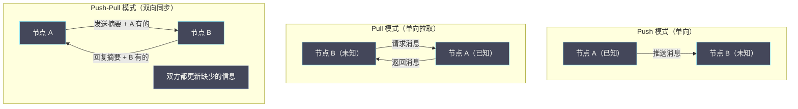

# 08 Gossip 协议：去中心化信息传播

**摘要：**

在 Paxos、Raft、ZAB 等强一致性协议主导的分布式系统世界里，有一类截然不同的协议——它不要求全局协调，没有 Leader，没有多数派投票，每个节点只与随机选择的几个邻居交换信息，系统却能以极高的概率将信息传播到所有节点。这就是 **Gossip 协议**，灵感来源于流行病学中的病毒传播模型（故又称 **Epidemic Protocol**）。Gossip 协议天然具备去中心化、高容错、弱一致性的特点，非常适合**集群成员管理、故障检测、反熵同步**等场景，是 [[Apache Cassandra]]、[[Redis Cluster]]、[[Amazon DynamoDB]]、[[Consul]] 等主流分布式系统的核心组件。本文从 Gossip 的流行病学起源出发，推导三种主要的 Gossip 模式（Push、Pull、Push-Pull），量化分析收敛速度与消息开销，并深入解析 Cassandra 中 Gossip 协议的工程实现细节，以及 Redis Cluster 如何用 Gossip 做节点状态同步。

---

## 第 1 章 为什么需要 Gossip：集中式协调的局限

### 1.1 集中式状态管理的扩展性瓶颈

在 Raft、ZAB 等强一致性协议中，状态信息的传播依赖 Leader：Leader 收到更新后广播给所有 Follower，每次广播需要 O(n) 条消息（n 是节点数）。这对于**少量、关键的一致性数据**（日志条目、配置）是合适的，但对于**大规模、频繁更新的集群状态信息**（如每个节点的健康状态、负载信息、路由表），集中式广播面临严重的扩展性问题：

**问题一：Leader 成为单点瓶颈**

假设集群有 1000 个节点，每个节点每秒向 Leader 报告一次健康状态，Leader 需要处理 1000 条/秒的状态更新，并向 999 个节点各广播 999 条消息（约 10⁶ 条/秒的广播消息量）。Leader 很快成为计算和网络的瓶颈。

**问题二：Leader 故障导致全局状态信息停止更新**

如果负责广播集群状态的中心节点崩溃，整个集群的状态信息就停止更新，直到新的协调节点被选出（可能需要数百毫秒甚至更长）。

**问题三：网络拓扑不均匀导致消息风暴**

在跨机房部署的场景中，Leader 向所有节点广播可能产生大量的跨机房流量，造成网络拥塞。

Gossip 协议解决这些问题的方式是：**不依赖任何中心节点，每个节点随机与少数邻居交换状态，通过指数级的"感染传播"将信息扩散到整个集群**，总消息量 O(n log n)，每个节点的消息发送量恒定为 O(1)（每轮 Gossip 只发给固定数量的随机节点）。

### 1.2 流行病学的启发：SIR 模型

Gossip 协议的设计灵感来源于流行病学的 **SIR（Susceptible-Infected-Recovered）传播模型**：

- **Susceptible（易感者）**：尚未感染病毒的健康人，对应"还没有收到某条信息的节点"
- **Infected（感染者）**：已经感染病毒的人，会主动传播给其他人，对应"已经收到信息并在传播的节点"
- **Recovered（康复者）**：已经感染过、现在不再传播的人，对应"已经收到信息并停止主动传播的节点"

在流行病学中，SIR 模型的核心结论是：只要每个感染者平均能传染的人数（基本再生数 R₀）大于 1，病毒就能在人群中传播；当大多数人已经感染/康复后，新感染者的传播速度会指数级下降（因为遇到易感者的概率降低），最终病毒消亡。

Gossip 协议借鉴了这个模型：每个节点定期随机选择 k 个邻居发送信息（k 通常是 1 到 3），如果 k > 1，信息会以指数级速度扩散，在 O(log n) 轮内传播到整个集群（n 是节点数）。

---

## 第 2 章 Gossip 的三种传播模式

### 2.1 Push 模式：我有新消息，我推送给你

**Push 模式**是最简单的 Gossip 变体：已知信息的节点（Infected）主动向随机选择的节点发送信息。

**算法**：
```
每个节点周期性（如每 1 秒）执行：
  1. 随机选择 k 个邻居节点
  2. 将自己拥有的"新消息"推送给这 k 个节点

接收方：
  如果收到的信息是新的（自己不知道），更新本地状态，并在下一轮继续传播
  如果收到的信息是旧的（自己已知道），忽略
```

**收敛速度分析**：

设集群有 n 个节点，初始时只有 1 个节点知道某条信息，每轮每个感染节点向 1 个随机邻居推送：

- 第 1 轮：感染节点 = 1，传给随机 1 个 → 感染节点 ≈ 2
- 第 2 轮：感染节点 ≈ 2，每个传给随机 1 个 → 感染节点 ≈ 4
- 第 k 轮：感染节点 ≈ 2^k

当 2^k ≈ n 时，k ≈ log₂(n)，信息扩散到整个集群。**Push 模式的收敛轮数是 O(log n)**。

但在传播后期，由于大多数节点已经是感染节点，新的推送消息大概率发给已知节点（冗余推送），导致**传播的最后几个节点（尾部收敛）很慢**——理论上有小概率某些节点永远不会被选中，导致传播不完全。

### 2.2 Pull 模式：我不知道，我去问你

**Pull 模式**的方向相反：不知道信息的节点（Susceptible）主动向随机节点询问是否有新信息。

**算法**：
```
每个节点周期性执行：
  1. 随机选择 k 个邻居节点
  2. 询问这些节点是否有比自己更新的信息（"你有我没有的消息吗？"）
  3. 如果有，拉取并更新本地状态
```

**Pull 模式的特点**：

Pull 模式在传播**后期**比 Push 模式更快。在传播后期，只有少数节点（Susceptible）还不知道信息，这些节点主动去拉取，每次 Pull 请求都能找到已知节点，快速完成"最后一公里"的传播。

但在传播**早期**，Pull 模式比 Push 模式慢——早期只有极少数节点有信息，Susceptible 节点随机选的邻居大概率是其他 Susceptible 节点（没有信息），Pull 请求效率很低。

**收敛速度**：Pull 模式的收敛轮数也是 O(log n)，但常数因子与 Push 不同。理论分析表明，Pull 模式在后期的收敛速度更快，但前期更慢。

### 2.3 Push-Pull 混合模式：兼顾前期和后期

**Push-Pull 模式**结合了 Push 和 Pull 的优点：每次 Gossip 交互时，双方互相交换各自的状态（而不是单方向发送），各自更新自己缺少的部分。

**算法**：
```
节点 A 发起 Gossip（每轮选随机节点 B）：
  1. A 向 B 发送自己的状态摘要（Digest，如版本号或哈希）
  2. B 对比 A 的摘要与自己的状态，找出差异：
     - B 有但 A 没有的信息 → B Push 给 A
     - A 有但 B 没有的信息 → B 请求 A Pull（或 A 直接 Push 给 B）
  3. 双方都更新到最新状态
```

Push-Pull 模式的消息开销比纯 Push 多一倍（每次交互是双向的），但**收敛速度快约 2 倍**——因为每次 Gossip 不仅传播信息，还从对方学习自己不知道的信息。

**这正是 [[Apache Cassandra]] 采用的 Gossip 模式**。Cassandra 的 Gossip 协议是 Push-Pull 的：每次 Gossip 交互，双方互相同步状态，使得集群成员信息和节点状态能够双向、快速地传播。



---

## 第 3 章 Gossip 的收敛性分析

### 3.1 数学模型：离散时间 SIR

用数学来量化 Gossip 的收敛速度。设：
- n：集群节点总数
- I(t)：第 t 轮结束时，已知某条信息的节点数（"感染"节点数）
- S(t) = n - I(t)：还不知道信息的节点数（"易感"节点数）
- k：每个节点每轮向 k 个随机节点发送（Push 模式）

每轮新增的感染节点数约等于：

```
ΔI(t) ≈ I(t) × k × (S(t) / n)
       = I(t) × k × (1 - I(t)/n)
```

当 I(t) 很小（早期）时：ΔI(t) ≈ I(t) × k，感染节点数指数增长（每轮增长 k 倍）

当 I(t) 接近 n（后期）时：ΔI(t) → 0，增速减缓（因为 S(t)/n → 0，随机选到的邻居基本都是已感染节点）

**收敛轮数**：在 k=1（每轮发给 1 个随机邻居）时，信息传播到 99% 的节点大约需要 c × log(n) 轮，c 是一个常数（在 1 到 2 之间）。

**具体数字**（k=1，每轮 1 秒）：
- 100 节点：约 7 轮（7 秒）传播到 99% 的节点
- 1000 节点：约 10 轮（10 秒）传播到 99%
- 10000 节点：约 14 轮（14 秒）传播到 99%

Gossip 的收敛时间随集群规模增长极为缓慢（对数增长），这是 Gossip 能够扩展到数千节点规模的根本原因。

### 3.2 消息复杂度

**Push 模式**：每个节点每轮发送 k 条消息，整个集群每轮发送 n×k 条消息。经过 O(log n) 轮收敛，总消息数 = O(n log n)。对比集中式广播的 O(n²)（Leader 向所有节点广播，每轮发 n-1 条），Gossip 的消息开销小得多。

**每个节点的发送负载**：O(k) 条/轮，与集群大小无关。这使得 Gossip 在大规模集群中保持恒定的单节点网络开销，非常适合大规模水平扩展。

### 3.3 失败概率：Gossip 的概率性保证

Gossip 的一个重要特性是**概率性收敛（Probabilistic Convergence）**：它不能保证 100% 的节点在精确 O(log n) 轮内都收到信息，但能保证以极高的概率（如 1 - 1/n²）在 c×log n 轮内完成传播。

残余"未感染"节点的概率在传播轮数增加时指数递减：经过 2×log(n) 轮后，某个节点仍未收到信息的概率约为 1/n，对于 n=1000，这个概率约为 0.1%——在工程上完全可接受（通过重传、反熵等机制处理）。

---

## 第 4 章 Cassandra 中的 Gossip 协议：工程实现剖析

### 4.1 Cassandra Gossip 的目标

[[Apache Cassandra]] 是一个去中心化的分布式 KV 存储，没有 Leader、没有 ZooKeeper 依赖。Cassandra 用 Gossip 协议来完成两件关键事情：

**目标一：成员管理（Membership）**
- 哪些节点当前在线？
- 哪些节点刚加入集群？
- 哪些节点刚离开集群（正常退出 vs 崩溃）？
- 每个节点负责哪些 Token 范围（数据分片信息）？

**目标二：故障检测（Failure Detection）**
- 哪些节点已经崩溃？
- 崩溃的节点和"网络临时不通"的节点如何区分？

### 4.2 Cassandra Gossip 的数据结构

每个 Cassandra 节点维护一个**本地 Endpoint State 表**，记录集群中每个节点（包括自己）的状态：

```python
# 每个节点的状态（EndpointState）
class EndpointState:
    # HeartBeat State：用于故障检测
    heartbeat_version: int    # 心跳版本号，每次 Gossip 时递增
    heartbeat_timestamp: int  # 上次心跳的时间戳
    
    # Application State：业务相关状态
    application_states: Dict[str, VersionedValue]
    # 常见的 Application State key：
    # STATUS:      NORMAL / LEAVING / LEFT / REMOVING / REMOVED / HIBERNATE
    # LOAD:        当前节点的数据量
    # SCHEMA:      当前节点的 schema 版本（用于 schema 同步）
    # DC:          数据中心名
    # RACK:        机架名
    # TOKENS:      该节点负责的 Token 范围
    # HOST_ID:     节点的 UUID 标识

class VersionedValue:
    value: str
    version: int   # 版本号，单调递增，用于判断哪条信息更新
```

### 4.3 Cassandra Gossip 的交互流程

Cassandra 的 Gossip 每秒触发一次，流程如下：

**步骤一**：随机选择 1~3 个节点（组合方式如下）：
- 1 个活跃节点（随机选）
- 可能：1 个不活跃节点（以一定概率，用于检测已恢复的节点）
- 可能：1 个种子节点（Seed Node，用于新节点加入时的引导）

**步骤二（GossipDigestSyn）**：发送 Digest（摘要）

发送方（节点 A）向目标节点（节点 B）发送 `GossipDigestSyn` 消息，包含 A 所知道的每个节点的 `(ip, heartbeat_version)` 摘要：

```
GossipDigestSyn：
{
  "10.0.0.1": {"heartbeat_version": 100, "application_state_version": 50},
  "10.0.0.2": {"heartbeat_version": 95, "application_state_version": 47},
  ...
}
```

**步骤三（GossipDigestAck）**：B 比较并回复差异

B 收到摘要后，与自己的本地状态对比：
- 对于 A 版本比 B 旧的节点（B 有更新信息）：B 将完整的最新状态包含在响应中（Push 给 A）
- 对于 A 版本比 B 新的节点（A 有更新信息，B 需要拉取）：B 在响应中包含"我需要这些节点的更新"的请求列表

**步骤四（GossipDigestAck2）**：A 回复 B 需要的信息

A 收到 Ack 后，将 B 请求的节点的完整状态发送给 B。

完成这四步后，A 和 B 都持有对方所知道的所有最新状态，实现了双向同步（Push-Pull 模式）。

### 4.4 Cassandra 的故障检测：Phi Accrual Failure Detector

Cassandra 不使用简单的超时机制来检测节点故障，而是使用 **Phi Accrual Failure Detector**（由 Hayashibara 等人在 2004 年提出）。

**简单超时的问题**：固定的超时阈值（如"5 秒没有心跳就判断故障"）无法适应网络延迟的动态变化——在网络拥塞时，5 秒的心跳延迟可能是正常的，但固定超时会误判为故障。

**Phi Accrual 的思路**：动态计算一个"怀疑值 φ（phi）"，而不是二元的"活着/死亡"判断。φ 值越大，该节点越可能已经崩溃；φ 值越小，节点越可能只是延迟。

φ 的计算基于历史心跳间隔的统计分布：

```python
def compute_phi(last_heartbeat_timestamp, heartbeat_intervals_history):
    """
    根据历史心跳间隔，估计当前到达延迟对应的怀疑级别
    """
    elapsed = current_time - last_heartbeat_timestamp
    
    # 用历史数据拟合正态分布
    mean = statistics.mean(heartbeat_intervals_history)
    std = statistics.stdev(heartbeat_intervals_history)
    
    # 计算 elapsed 超过历史正常间隔的概率（用于反映"迟到程度"）
    # 用对数转换为 φ 值（越大越可疑）
    prob_late = 1 - normal_cdf(elapsed, mean, std)
    phi = -math.log10(prob_late)
    return phi

# 在 Cassandra 中，默认 φ 阈值：
# φ < 8：节点认为存活
# φ ≥ 8：节点标记为疑似故障
```

**Phi Accrual 的优点**：
1. **自适应**：阈值根据网络的历史延迟动态调整，而不是固定值，减少误判
2. **渐进式**：不是"活着/死了"的二元判断，而是一个连续的怀疑程度，允许上层系统根据 φ 值做出不同的响应（如 φ=4 时降低读副本优先级，φ=8 时彻底标记为故障）
3. **可调节**：不同业务可以设置不同的 φ 阈值，在敏感度（快速检测故障）和准确率（避免误判）之间取舍

---

## 第 5 章 Redis Cluster 中的 Gossip：节点状态同步

### 5.1 Redis Cluster 的 Gossip 目标

[[Redis Cluster]] 同样使用 Gossip 协议（基于 RESP3 协议的 Cluster Bus）来维护集群状态，目标与 Cassandra 类似：

- **节点发现**：新加入的节点通过 `CLUSTER MEET` 命令与种子节点建立连接，然后通过 Gossip 自动传播到整个集群
- **配置同步**：哪个节点负责哪些 slot？每个节点的主从关系是什么？
- **故障检测**：节点是否可达？是否需要触发故障转移？

### 5.2 Redis Cluster Gossip 的消息格式

Redis Cluster 的 Gossip 消息（PING/PONG）中包含：
- 发送方的 Node ID、IP、端口、Flags（角色状态）
- 发送方所知道的部分其他节点的信息（每条 PING/PONG 随机携带集群中 1/10 节点的状态）

这种"每次携带部分节点信息"的设计，是 Redis Cluster Gossip 与 Cassandra Gossip 的关键区别：Cassandra 每次同步完整的摘要（Digest），而 Redis 每次只带随机采样的节点信息，通过多轮 Gossip 逐渐将状态同步到所有节点。

### 5.3 Redis Cluster 的故障检测与故障转移

**PFAIL（Probable FAIL）**：当节点 A 在超时时间（`cluster-node-timeout`，默认 15 秒）内未收到节点 B 的响应，A 将 B 标记为 PFAIL（可能故障），并在 Gossip 消息中携带这个信息。

**FAIL（确认故障）**：当集群中超过半数的 Master 节点都将 B 标记为 PFAIL，通过 Gossip 汇聚后，某个 Master 会广播 `CLUSTER FAIL B` 消息，将 B 正式标记为 FAIL。此时，B 的 Slave 节点开始发起故障转移选举。

这个"先 PFAIL，再 FAIL"的两阶段故障检测，类似于分布式共识的思想：单个节点的判断（PFAIL）可能是误判（网络瞬断），但多数节点都判断故障（FAIL）的概率极低，大幅减少了误判触发的不必要故障转移。

---

## 第 6 章 Gossip 的局限与适用边界

### 6.1 Gossip 不适合的场景

**场景一：需要强一致性的数据**

Gossip 是最终一致性的——信息会在 O(log n) 轮内传播到几乎所有节点，但"几乎"不是"全部"，且传播过程中存在不一致窗口。如果需要强一致性（如分布式锁、事务协调），必须使用 Paxos/Raft，不能用 Gossip。

**场景二：需要精确、实时的全局视图**

Gossip 传播的信息有延迟（O(log n) 轮），在传播完成之前，不同节点看到的集群状态可能不同。对于需要精确全局视图的场景（如精确的负载均衡决策、精确的集群成员计数），Gossip 的延迟和不一致性可能导致次优决策。

**场景三：消息量大、更新频繁的数据**

Gossip 的每轮消息量与集群节点数成正比（O(n) 条总消息/轮）。如果要同步的数据非常频繁地更新（如每毫秒更新），每个节点需要处理大量的 Gossip 消息，网络和 CPU 开销可能超过 Gossip 的节省。

### 6.2 Gossip 的最佳应用场景

| 应用场景 | 原因 |
| :--- | :--- |
| **集群成员管理** | 成员信息变化不频繁，允许短暂不一致，需要高容错（节点崩溃不影响其他节点的成员视图更新）|
| **故障检测** | 不需要即时精确，允许秒级延迟，高容错（不依赖中心节点）|
| **数据库反熵（Anti-entropy）** | 副本之间的差异同步，不要求实时一致，但需要最终收敛 |
| **路由表同步** | 路由表变化不频繁，允许短暂路由到旧节点，无需强一致 |
| **分布式哈希表（DHT）** | 节点加入/离开需要更新路由信息，Gossip 自然地支持去中心化的路由表维护 |

---

## 参考资料

1. Demers, A., et al. (1987). Epidemic algorithms for replicated database maintenance. *PODC 1987*.
2. Birman, K., Hayden, M., Ozkasap, O., Xiao, Z., Budiu, M., & Minsky, Y. (1999). Bimodal multicast. *ACM Transactions on Computer Systems, 17*(2), 41–88.
3. Hayashibara, N., Défago, X., Yared, R., & Katayama, T. (2004). The φ Accrual Failure Detector. *SRDS 2004*.
4. Apache Cassandra 官方文档：Gossip. https://cassandra.apache.org/doc/latest/cassandra/architecture/gossip.html
5. Redis Cluster 官方文档：Cluster Specification. https://redis.io/docs/reference/cluster-spec/
6. DeCandia, G., et al. (2007). Dynamo: Amazon's Highly Available Key-value Store. *SOSP 2007*.
7. Leitao, J., Pereira, J., & Rodrigues, L. (2007). Epidemic broadcast trees. *SRDS 2007*.
8. Kleppmann, M. (2017). *Designing Data-Intensive Applications*. O'Reilly Media. Chapter 5: Replication.

---

> [!note] 思考题
> 1. 拜占庭容错（BFT）处理节点可能'作恶'（发送错误信息）的场景——而 Raft/Paxos 只处理节点'崩溃'（停止响应）。PBFT（Practical BFT）容忍 f 个恶意节点需要 3f+1 个节点（而 Raft 只需要 2f+1）。为什么 BFT 需要更多节点？在什么场景下你需要 BFT 而非 CFT（Crash Fault Tolerance）？
> 2. 区块链的共识机制（如 PoW、PoS）是 BFT 在开放网络中的应用——参与者不固定且互不信任。PoW 通过计算难题保证'作恶成本高于收益'。但 PoW 的能耗问题导致以太坊转向 PoS。PoS 的安全性假设与 PoW 有什么根本区别？
> 3. 在企业级分布式系统中（如银行间结算网络），节点数量固定且半信任——PBFT 是合适的共识算法。Hyperledger Fabric 使用 PBFT 的变体。与传统的中心化结算系统相比，基于 PBFT 的分布式结算在性能和可靠性方面有什么权衡？
