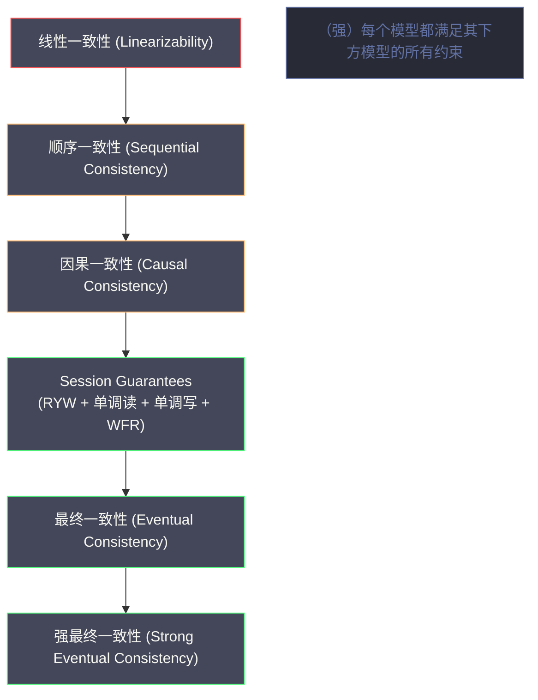
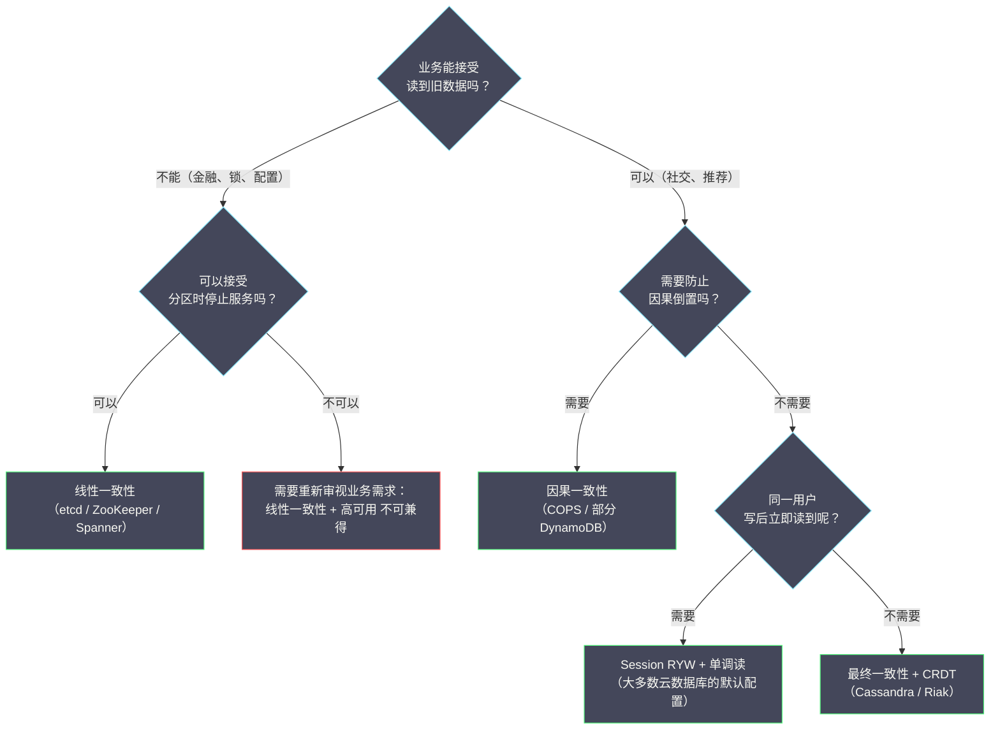

# 09 分布式系统的一致性模型谱系

**摘要：**

"一致性"是分布式系统领域使用频率最高、同时也是歧义最重的词汇之一。同样是"一致性"，数据库 ACID 中的 C（Consistency）、CAP 定理中的 C（Consistency）、副本一致性（Replica Consistency）以及事务隔离级别（Isolation Level）——这四个"一致性"的含义完全不同，混淆它们是工程讨论中最常见的错误来源之一。本文系统梳理分布式系统中真正重要的**一致性模型（Consistency Model）谱系**：从最强的**线性一致性（Linearizability）**，经过**顺序一致性（Sequential Consistency）**、**因果一致性（Causal Consistency）**、**单调读/单调写/读己之写（Session Guarantees）**，到最弱的**最终一致性（Eventual Consistency）**。对每个模型，详细解释它允许什么、不允许什么、用何种异常来区分它们，以及在哪些生产系统中被采用，最终给出一张供工程选型参考的完整对比表。

---

## 第 1 章 先厘清"一致性"的多重含义

### 1.1 四种"一致性"的辨析

在深入一致性模型之前，必须先把这个被滥用的词语梳理清楚。

**第一种：ACID 中的 C（Consistency）**

这是数据库事务的 ACID 模型中的"一致性"，含义是：**事务在执行前后，数据库的状态必须满足所有预定义的约束**（如外键约束、唯一性约束、业务规则如"账户余额不能为负"）。

这个"一致性"**与分布式系统的一致性模型完全无关**——它描述的是数据的业务语义正确性，是应用层定义的，不是系统层保证的。数据库只是确保事务不会破坏这些约束，但"约束是什么"完全由应用程序决定。

**第二种：CAP 中的 C（Consistency）**

CAP 定理中的"一致性"等同于**线性一致性（Linearizability）**——最强的副本一致性模型，要求所有操作看起来是原子性地、瞬间完成的，且所有节点看到的操作顺序符合真实时间顺序。这将在第 2 章详细讲解。

**第三种：副本一致性（Replica Consistency）**

这是本文的主角：描述分布式存储系统中，**多个副本在同一时刻或不同时刻对客户端呈现的数据视图**的一致性程度。一致性模型是一个**合约**：系统承诺满足某个一致性模型，客户端可以依据这个承诺推断系统行为。从线性一致性到最终一致性，构成了一个强弱连续的谱系。

**第四种：事务隔离级别（Transaction Isolation）**

事务隔离级别（Read Uncommitted、Read Committed、Repeatable Read、Serializable）描述的是**并发事务之间的可见性**，防止脏读、不可重复读、幻读等异常。隔离级别与副本一致性有交叉（[[Serializable Snapshot Isolation，SSI]] 与线性一致性有相关性），但它们是不同层次的概念。

> [!info] 为什么要厘清这四种一致性？
> 在工程讨论中，经常出现"我们的系统是强一致的"这样的说法，但没有指明是哪种"一致性"。如果没有精确的语义，这句话可能是指：
> 1. "我们的业务数据满足所有约束"（ACID C）
> 2. "我们实现了线性一致性"（CAP C）
> 3. "我们的副本最终会收敛"（最终一致性）
> 4. "我们的事务是可串行化隔离的"（Serializable Isolation）
> 
> 这四种解读的实现难度和性能代价差距是巨大的。精确的术语是理性讨论的前提。

### 1.2 一致性模型的形式化定义方法

一致性模型定义了分布式存储系统**合法的执行历史（Execution History）**。一个执行历史是一系列操作（读/写）的记录，包含操作的调用时间、完成时间、以及返回值。

**合法性（Validity）**：给定一个一致性模型，如果一个执行历史满足该模型的所有约束，则称这个执行历史对于该模型是"合法的"或"正确的"。如果存在一个执行历史，在某个更强的模型下是合法的，但在更弱的模型下也合法，则说明更弱的模型允许更多的执行历史（对系统实现的约束更少）。

**区分不同模型的"异常（Anomalies）"**：从最强到最弱，每降低一级的一致性模型，都会允许某些"异常行为"——即在更强模型下不会出现，但在更弱模型下可能出现的执行历史。通过这些异常，可以精确地区分不同强度的一致性模型。

---

## 第 2 章 线性一致性（Linearizability）：最强的单操作保证

### 2.1 定义：原子性 + 实时性

**线性一致性（Linearizability）**，由 Herlihy 和 Wing 在 1990 年提出，是副本一致性模型谱系中最强的一种（在不涉及事务的单操作层面）。

**形式化定义**：一个执行历史是线性一致的，当且仅当存在一个**合法的全序（Total Order）**，满足：
1. 这个全序与所有操作的**实时顺序（Real-time Order）**一致——如果操作 A 在操作 B 开始之前已经完成，则 A 在全序中排在 B 之前
2. 在这个全序下，每次读操作返回的值，是同一 key 在这个全序中最近一次写入的值

更直观地理解：**对客户端来说，整个分布式系统看起来就像只有一台服务器**，所有操作在这台"单机服务器"上串行执行，且执行的时间点在操作的调用时间和完成时间之间（即"操作原子地发生在某个瞬间"）。

### 2.2 线性一致性允许和禁止的行为

**禁止的行为（线性一致性异常）**：

**异常一：读到过时值（Stale Read）**
```
时间线（水平方向为时间推进）：

写操作 W：|--写入 x=1--|          （写操作在 T2 完成）
读操作 R：               |--读 x--|（读操作在 T2 之后发起）

线性一致性要求：R 必须读到 x=1
如果 R 读到 x=0（初始值），则违反线性一致性（Stale Read）
```

**异常二：时间倒流（Time Travel）**
```
时间线：
  T1: 客户端 A 写入 x=1，写操作完成，收到成功响应
  T2: 客户端 A 读取 x，发现 x=0（读到了 T1 之前的旧值）

这违反了"写完成后，后续读应该能看到新值"的直觉
```

**允许的行为**：

并发操作（调用时间有重叠的操作）的顺序可以是任意的——只要最终结果与某个合法全序一致即可。线性一致性并不要求所有客户端"实时感知"每个写入，只要求**已完成的操作在全局顺序中的位置是合理的**。

### 2.3 线性一致性的实现代价

线性一致性的实现通常需要**全局协调**（如 Leader 确认多数派后返回），因此：

- **写延迟高**：每次写操作需要多数派确认（至少 1 次 RTT），典型延迟 2ms~20ms（同机房）
- **读延迟也可能高**：如果需要线性一致读（如 etcd 的 ReadIndex），也需要 Leader 确认，增加读延迟
- **可用性受限**：网络分区时，少数派不可用（CP 系统）

**典型线性一致性系统**：[[etcd]]、[[ZooKeeper]]（写操作）、[[Google Spanner]]（通过 TrueTime）、[[CockroachDB]]

---

## 第 3 章 顺序一致性（Sequential Consistency）：允许时间倒流的强一致

### 3.1 定义：有序性但无实时性约束

**顺序一致性（Sequential Consistency）**，由 Lamport 在 1979 年提出（为共享内存多处理器设计），比线性一致性弱一个档次：

**形式化定义**：一个执行历史是顺序一致的，当且仅当存在一个**合法的全序**，满足：
1. 这个全序与每个**单独进程（客户端）内部**的操作顺序一致
2. 在这个全序下，每次读操作返回同一 key 在全序中最近一次写入的值

与线性一致性的区别：**顺序一致性不要求全序与实时顺序一致**——不同客户端的操作全序可以打乱实际的时间先后顺序，只要每个客户端内部的顺序被保留即可。

### 3.2 顺序一致性 vs 线性一致性：一个关键的区分例子

```
系统：两个客户端（C1 和 C2），两个变量（x 和 y），初始值都为 0

C1 的操作：写 x=1，然后读 y
C2 的操作：写 y=1，然后读 x

线性一致性下，如果 C1 的"写 x=1"在 C2 的"读 x"之前完成：
  C2 读 x 必须返回 1（不能返回 0）

顺序一致性下，允许以下结果：
  C1 读 y 返回 0，C2 读 x 返回 0

  这在实时顺序下看起来矛盾（两个写操作都完成了，为什么读到 0？），
  但在顺序一致性下合法——可以构造全序：
  [C1:写x=1] → [C2:写y=1] → [C1:读y=0] → [C2:读x=0]
  等等，这不对——读 y 在写 y 之后，应该返回 1...

  实际上这个例子是用来说明：顺序一致性允许"时间倒流"：
  客户端 C1 写了 x=1，但 C2 可能读到 x=0，如果 C2 的读操作"在全序中"排在 C1 写操作之前
  尽管在实际时间上 C1 的写发生更早
```

**一句话总结**：顺序一致性要求"每个客户端内部操作有序"，但**不要求跨客户端的操作按实际时间先后排序**。线性一致性则要求跨客户端也按实际时间先后排序。

### 3.3 顺序一致性的工程意义

顺序一致性在分布式系统中并不常见——大多数系统要么追求更强的线性一致性，要么为了性能接受更弱的模型。顺序一致性更多出现在**多处理器共享内存**（CPU 缓存一致性协议）和**某些分布式消息队列**的语义描述中。

[[Apache Kafka]] 的 Topic Partition 提供了类似顺序一致性的语义：同一 Partition 内的消息是有序的（生产顺序 = 消费顺序），但不同 Partition 之间的顺序没有全局保证（不满足线性一致性）。

---

## 第 4 章 因果一致性（Causal Consistency）：只保序因果相关操作

### 4.1 定义：因果有序，并发无序

**因果一致性（Causal Consistency）**，在第 07 篇中已经详细讲解，这里做一个精炼的模型层面的总结：

**定义**：一个执行历史满足因果一致性，当且仅当：对于任意两个操作 A 和 B，如果 A 在因果上先于 B（A → B），则所有节点在执行 B 之前必须已经执行了 A。对于没有因果关系的并发操作，不同节点可以以不同顺序执行。

**因果一致性允许的"异常"**（相比顺序一致性）：

```
场景：三个进程 P1、P2、P3

P1 写入 x=1
P2 读到 x=1，然后写入 y=1（P2 的写依赖于 P1 的写，因果关系：x=1 → y=1）
P3 读操作：可能先看到 y=1，再看到 x=1 吗？

因果一致性：不允许！因为 x=1 → y=1，P3 看到 y=1 时必须已经看到 x=1
顺序一致性：也不允许（全序要求严格有序）

现在考虑另一场景：
P1 写入 x=1（在某个时间）
P2 写入 y=1（与 P1 的写并发，没有因果关系）

P3 可以先看到 y=1，再看到 x=1 吗？
因果一致性：允许！x=1 和 y=1 是并发的，没有因果关系，可以任意顺序
顺序一致性：不允许！全序要求所有节点看到相同的 x=1 和 y=1 的顺序
```

### 4.2 因果一致性的工程价值定位

因果一致性在性能与一致性之间的平衡点上具有独特价值：

**比最终一致性强**：消除了因果倒置（答复先于问题）这种最令用户困惑的异常

**比顺序一致性弱**：不需要对并发操作排序，不需要全局协调，可以在 AP 系统（高可用、分区容忍）中实现

**可以在无 Leader 的系统中实现**：通过向量时钟追踪因果依赖，每个节点本地判断是否满足因果前提，不需要全局协调节点

工业实现：[[COPS（Cassandra On PostS）]]（2011）、[[Eiger]]（2013）、部分版本的 [[DynamoDB]] 支持因果读

---

## 第 5 章 Session Guarantees：面向单个客户端的实用一致性

### 5.1 为什么需要 Session Guarantees

线性一致性和顺序一致性都是"全局"的一致性模型——它们约束了所有客户端对系统的视图。但在很多场景下，我们只需要保证**单个客户端（Session）内部的一致性**，不需要跨客户端的强一致性。

**Session Guarantees** 由 Terry 等人在 1994 年提出，定义了四种面向单个客户端会话的一致性保证，它们可以独立组合使用：

### 5.2 四种 Session Guarantees

**Read Your Writes（读己之写，RYW）**

定义：在同一个 Session 内，一个客户端写入了某个值后，该客户端后续的读操作一定能看到这个写入（或更新的值）。

为什么需要这个保证？在高可用系统中，写操作通常经过 Leader，但读操作可能被路由到不同的 Follower，如果 Follower 还没有同步到最新写入，客户端就会读到"自己刚写的值却读不出来"——这在用户体验上是灾难性的（用户更新了个人资料，刷新后发现没变）。

**实现方式**：客户端记录自己写入操作的版本号，每次读取时带上这个版本号，服务端确保读到的数据至少包含这个版本的写入（如果当前副本没有，等待同步或重定向到 Leader）。

**Monotonic Reads（单调读）**

定义：在同一个 Session 内，如果客户端读到了某个值，则该客户端后续的读操作不会读到比这个值更旧的版本。

为什么需要这个保证？在负载均衡系统中，同一个客户端的不同请求可能被路由到不同的 Replica，如果 Replica 之间的同步有延迟，客户端可能第一次读到新值（来自同步快的 Replica），第二次读到旧值（来自同步慢的 Replica）——时间"倒流"。

```
违反单调读的场景：
  T1: 客户端读 Replica A，返回 x=2（最新值）
  T2: 客户端读 Replica B（B 还未同步到最新），返回 x=1（旧值）
  → 客户端看到 x 先是 2，后变成 1，时间倒流！
```

**Monotonic Writes（单调写）**

定义：同一个 Session 内，写操作按照发出的顺序被系统接受。即：如果客户端先写了 W1，再写了 W2，则系统中 W1 必须在 W2 之前被应用。

这对于保证写操作的因果顺序非常重要，特别是当多个写操作存在依赖关系时（如"先创建目录，再在目录下创建文件"）。

**Writes Follow Reads（写跟随读）**

定义：在同一个 Session 内，如果客户端先读到了某个值，随后进行了写操作，则该写操作必须在读操作看到的数据的基础上执行（保证写操作包含了读到的数据版本的因果信息）。

这是因果一致性中"写依赖于读"的轻量版实现——确保"读后写"的因果顺序在系统中被正确维护，防止出现"先读了新版本数据，再写了覆盖旧版本的操作"。

### 5.3 Session Guarantees 的组合与工程实现

四种 Session Guarantees 可以任意组合。实践中，大多数面向用户的系统至少实现了 **Read Your Writes + Monotonic Reads**，这两种保证对用户体验影响最大。

| Session Guarantee | 实现开销 | 用户感知 | 典型使用场景 |
| :--- | :--- | :--- | :--- |
| **Read Your Writes** | 中等（版本追踪）| 高（更新后立即可见）| 用户资料更新、购物车 |
| **Monotonic Reads** | 低（粘性路由或版本检查）| 中（避免时间倒流）| 任何读密集场景 |
| **Monotonic Writes** | 低（写操作排队）| 低（用户不直接感知）| 多步骤写操作 |
| **Writes Follow Reads** | 中等（版本追踪）| 低（用户不直接感知）| 社交评论、协作编辑 |

---

## 第 6 章 最终一致性（Eventual Consistency）：最弱的收敛保证

### 6.1 定义：只保证最终收敛

**最终一致性（Eventual Consistency）**，由 Werner Vogels（Amazon CTO）在 2009 年的论文中系统阐述，是副本一致性模型谱系中最弱的有意义的模型：

**定义**：如果没有新的更新操作，那么最终（经过足够长的时间），所有副本的数据会收敛到相同的状态。

注意这个定义有多弱：
- "最终"：没有时间上界，可能是几毫秒，也可能是几分钟
- "没有新的更新"：如果一直有写入，副本可能永远不收敛
- 对收敛期间的行为没有任何约束：读可能返回任何旧版本的值

**最终一致性的"弱点"**：最终一致性本身并没有定义不同副本之间发生冲突时如何解决（两个副本对同一个 key 各有不同的写入），它只说"最终会一致"，但不说"一致到什么值"。**冲突解决策略**（如 Last-Write-Wins、向量时钟 + 客户端合并、CRDT）是最终一致性系统实现时必须单独定义的。

### 6.2 最终一致性的变体

最终一致性是一个宽泛的模型，有多种增强变体：

**强最终一致性（Strong Eventual Consistency，SEC）**：

由 Shapiro 等人在 2011 年提出，SEC 比最终一致性增加了一个约束：**任何两个节点，只要接收了相同的更新（集合相同，顺序可以不同），就必须达到相同的状态**。这要求更新操作满足交换律（Commutative）和幂等性（Idempotent），即更新的应用顺序不影响最终结果。

**CRDT（Conflict-Free Replicated Data Type，无冲突复制数据类型）** 是实现 SEC 的标准技术：通过将数据结构设计为满足 SEC 要求的数学结构（如计数器、集合、映射），消除了冲突解决的复杂性。

常见的 CRDT 类型：
- **G-Counter（增长计数器）**：只能增加，每个节点维护自己的计数，合并取最大值
- **PN-Counter（正负计数器）**：可以增减，通过两个 G-Counter 实现
- **LWW-Register（最后写入胜寄存器）**：用时间戳决定最终值，时间戳大的胜
- **OR-Set（Observed-Remove Set）**：支持添加和删除，通过唯一 Tag 追踪每次添加，删除时精确移除对应 Tag

CRDT 在 [[Redis CRDT]]（Redis Enterprise 的多主复制）、[[Riak]]、[[SoundCloud 的 Roshi]] 等系统中有广泛应用。

---

## 第 7 章 完整的一致性模型谱系与工程选型

### 7.1 一致性模型的强弱偏序关系

以下图展示了主要一致性模型的强弱关系（从上到下递弱）：



箭头方向表示"强于"：线性一致性最强（满足它的系统一定也满足下方所有模型），最终一致性最弱。

### 7.2 不同一致性模型的异常对比

| 异常类型 | 线性一致 | 顺序一致 | 因果一致 | Session RYW | 最终一致 |
| :--- | :---: | :---: | :---: | :---: | :---: |
| **Stale Read（读到旧值）** | ✗ 不允许 | ✗ 不允许 | ✓ 允许 | ✓ 允许 | ✓ 允许 |
| **时间倒流（跨客户端）** | ✗ 不允许 | ✗ 不允许 | ✓ 允许（并发操作）| ✓ 允许 | ✓ 允许 |
| **因果倒置（答复先于问题）** | ✗ 不允许 | ✗ 不允许 | ✗ 不允许 | ✓ 允许 | ✓ 允许 |
| **单 Session 时间倒流** | ✗ 不允许 | ✗ 不允许 | ✗ 不允许 | ✗ 不允许（单调读）| ✓ 允许 |
| **写后读不到自己写的值** | ✗ 不允许 | ✗ 不允许 | ✗ 不允许 | ✗ 不允许（RYW）| ✓ 允许 |
| **并发写冲突（多版本）** | ✗ 不允许 | ✗ 不允许 | ✓ 允许 | ✓ 允许 | ✓ 允许 |

**注**：Session Guarantees 的行表示同时启用 RYW + 单调读两种保证的情况；不同 Session Guarantee 组合可以防止不同的异常。

### 7.3 主流系统的一致性模型分类

| 系统 | 一致性模型 | 说明 |
| :--- | :--- | :--- |
| **etcd** | 线性一致性（写）/ ReadIndex（读）| Raft 保证写线性一致，ReadIndex 保证读线性一致 |
| **ZooKeeper** | 写线性一致，读顺序一致 | 写经过 Leader 多数派确认；读 Follower 可能读到旧数据 |
| **Google Spanner** | 线性一致性（外部一致性）| TrueTime API 保证跨机房线性一致性 |
| **CockroachDB** | 线性一致性 | 基于 Raft + HLC（混合逻辑时钟）|
| **Cassandra（ONE 级别）** | 最终一致性 | 单副本确认，允许读到旧数据 |
| **Cassandra（QUORUM 级别）** | 近似线性一致性 | 多数派写 + 多数派读，写读多数派必有交集 |
| **DynamoDB（默认）** | 最终一致性（AP 路径）| 异步复制，读可能旧 |
| **DynamoDB（强一致读）** | 线性一致性（可选）| 额外代价，从 Leader 读 |
| **Riak** | 最终一致性 + 版本向量 | AP，冲突通过版本向量检测，客户端合并 |
| **Redis（单机）** | 线性一致性（单线程）| 单线程串行执行，天然线性一致 |
| **Redis（主从+Sentinel）** | 读己之写（主），最终一致性（从）| 主节点强一致，Slave 延迟同步 |
| **MySQL 主从（同步）** | 线性一致性（主）| 同步复制，主节点线性一致 |
| **MySQL 主从（异步）** | 最终一致性（从）| 从节点读可能读到旧数据 |

### 7.4 工程选型决策树



---

## 第 8 章 一致性模型与事务隔离级别的关系

### 8.1 两个维度：单操作一致性 vs 多操作事务语义

一致性模型（本文主题）和事务隔离级别描述的是两个不同维度的语义：

- **一致性模型**：描述的是**单个操作（读/写）**在多副本系统中的可见性保证
- **事务隔离级别**：描述的是**多个操作组成的事务**之间的相互可见性，防止脏读、不可重复读、幻读等异常

**两者的交叉**：在提供事务支持的分布式数据库中，事务语义和一致性模型是叠加的。例如：

- [[Google Spanner]] 提供**可串行化隔离（Serializable Isolation）+ 线性一致性**：事务之间完全隔离，且跨数据中心线性一致
- [[CockroachDB]] 提供**可串行化隔离 + 线性一致性**
- 大多数 [[RDBMS]]（如 MySQL）在单机上提供可串行化隔离，但在多主复制场景下一致性降为最终一致性

### 8.2 最强的组合：可串行化 + 线性一致性

可串行化隔离（Serializable Isolation）+ 线性一致性的组合，有时称为**严格可串行化（Strict Serializability）**或**外部一致性（External Consistency）**：

- **可串行化**：保证所有事务的执行结果等价于某个串行执行序列（防止所有并发异常）
- **线性一致性**：保证这个串行执行序列与真实时间顺序一致（跨客户端可见性）

严格可串行化是分布式数据库中能够提供的最强语义，代价是延迟高、吞吐量低，通常只在对正确性要求极高的核心金融业务中使用。

---

## 参考资料

1. Herlihy, M., & Wing, J. (1990). Linearizability: A correctness condition for concurrent objects. *ACM Transactions on Programming Languages and Systems, 12*(3), 463–492.
2. Lamport, L. (1979). How to make a multiprocessor computer that correctly executes multiprocess programs. *IEEE Transactions on Computers, 28*(9), 690–691.
3. Ahamad, M., et al. (1995). Causal memory: definitions, implementation, and programming. *Distributed Computing, 9*(1), 37–49.
4. Terry, D., Demers, A., Petersen, K., Spreitzer, M., Theimer, M., & Welch, B. (1994). Session guarantees for weakly consistent replicated data. *PDIS 1994*.
5. Vogels, W. (2009). Eventually Consistent. *Communications of the ACM, 52*(1), 40–44.
6. Shapiro, M., Preguiça, N., Baquero, C., & Zawirski, M. (2011). Conflict-free Replicated Data Types. *SSS 2011*.
7. Bailis, P., Davidson, A., Fekete, A., Ghodsi, A., Hellerstein, J.M., & Stoica, I. (2013). Highly Available Transactions: Virtues and Limitations. *VLDB 2014*.
8. Kleppmann, M. (2017). *Designing Data-Intensive Applications*. O'Reilly Media. Chapter 9: Consistency and Consensus.
9. Abadi, D. (2012). Consistency Tradeoffs in Modern Distributed Database System Design. *IEEE Computer, 45*(2).

---

> [!note] 思考题
> 1. NTP 的同步精度在局域网中约 1ms，广域网中约 10-100ms。对于大多数分布式系统，NTP 的精度足够。但 Google Spanner 需要全球一致的事务时间戳——NTP 的精度不够。TrueTime 使用原子钟和 GPS 将误差控制在 <7ms。为什么 Spanner 需要如此精确的时间？CockroachDB 在没有 TrueTime 的情况下如何实现类似的一致性？
> 2. 时钟漂移（Clock Drift）是分布式系统的隐患——如果两个节点的时钟差异超过某个阈值，依赖时间戳的逻辑（如 Lease 过期、事务排序）可能出错。`ntpd` 如何检测和修正时钟漂移？在容器化环境中（容器共享宿主机时钟），时钟同步是否仍然是问题？
> 3. PTP（Precision Time Protocol）的同步精度在局域网中可达 <1μs——远优于 NTP。但 PTP 需要硬件支持（PTP-capable 网卡和交换机）。在什么场景下 PTP 的高精度是必要的（如高频交易、5G 基站同步）？
