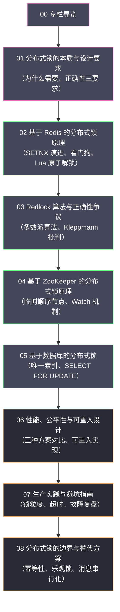

# 分布式锁专栏导览

## 专栏定位

本专栏聚焦于**分布式锁**这一具体技术节点。在单机系统中，`synchronized`、`ReentrantLock` 等 JVM 锁可以保护共享资源；但当系统横向扩展为多节点部署时，这些锁彻底失效——分布式锁应运而生。

本专栏不求面面俱到，而是力求将分布式锁这一技术节点讲透：从它解决的本质问题出发，到主流实现方案的底层原理，再到如何在生产环境中正确使用，以及什么时候不应该用分布式锁。

---

## 专栏目录

| 篇目 | 文章 | 关键问题 |
| :--- | :--- | :--- |
| 01 | [[01 分布式锁的本质与设计要求]] | 单机锁为什么失效？分布式锁的三大正确性要求是什么？ |
| 02 | [[02 基于 Redis 的分布式锁原理深度解析]] | SETNX 的历史演进？Lua 原子解锁的必要性？看门狗如何续期？ |
| 03 | [[03 Redlock 算法正确性争议]] | Redlock 的多数派算法是什么？为什么被质疑？怎么选？ |
| 04 | [[04 基于 ZooKeeper 的分布式锁原理深度解析]] | 临时顺序节点如何实现公平锁？ZK 锁与 Redis 锁的本质区别？ |
| 05 | [[05 基于数据库的分布式锁原理与局限]] | 三种 DB 锁方案各有什么优劣？为何不推荐用于高并发场景？ |
| 06 | [[06 分布式锁的性能公平性与可重入设计]] | 三种方案性能差多少？可重入锁怎么实现？锁超时怎么设？ |
| 07 | [[07 分布式锁的生产实践与避坑指南]] | 锁粒度如何设计？加锁失败怎么降级？生产故障如何复盘？ |
| 08 | [[08 分布式锁的边界与替代方案]] | 分布式锁解决不了哪些问题？幂等设计能否代替锁？ |

---

## 核心概念速查

| 概念 | 一句话解释 |
| :--- | :--- |
| **互斥性（Mutual Exclusion）** | 同一时刻只有一个客户端持有锁 |
| **无死锁（Deadlock-Free）** | 持锁客户端崩溃后，锁必须能自动释放 |
| **容错性（Fault Tolerance）** | 部分节点故障不影响加锁/解锁的正确性 |
| **SETNX** | SET if Not eXists，Redis 原子性加锁原语 |
| **看门狗（Watchdog）** | 持锁期间自动续期，防止业务未完成锁已过期 |
| **Lua 脚本** | 保证 Redis 检查锁归属 + 删除锁的原子性 |
| **Redlock** | 基于 N 个独立 Redis 实例的多数派加锁算法 |
| **临时顺序节点** | ZooKeeper 节点类型，客户端断连时自动删除，天然实现无死锁 |
| **羊群效应（Herd Effect）** | 所有等待者同时被唤醒，形成无效竞争 |
| **可重入锁** | 同一客户端/线程可多次加同一把锁而不死锁 |

---

## 推荐阅读路径

**快速了解全貌**：01 → 02 → 07

**深入技术原理**：01 → 02 → 03 → 04 → 05 → 06

**工程实战优先**：01 → 07 → 08 → 02 或 04（按选型）

---

## 关联专栏

- [[分布式/分布式系统原理与协议/00 专栏导览|分布式系统原理]]：共识协议、CAP 定理等理论基础
- [[中间件/Redis/Redis进阶教程/00 专栏导览|Redis 进阶]]：Redis 分布式锁、Redlock 算法
- [[中间件/Zookeeper/00 专栏导览|ZooKeeper]]：临时顺序节点实现分布式锁
- [[中间件/ETCD/00 专栏导览|etcd]]：Lease + Revision 实现分布式锁
- [[Java/并发编程/00 专栏导览|Java 并发]]：从单机锁（synchronized/ReentrantLock）到分布式锁的演进
- [[中间件/MySQL/MySQL架构与底层原理/00 专栏导览|MySQL]]：基于数据库的分布式锁方案

*创作于 2026-03-03 | 分布式锁专栏*
