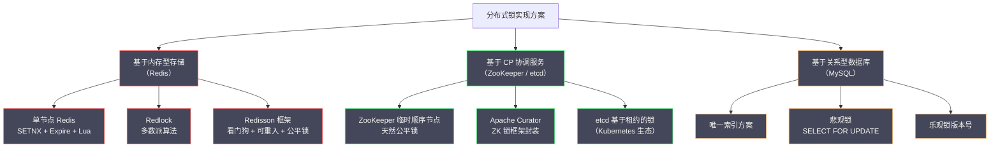

# 01 分布式锁的本质与设计要求

**摘要：**

分布式锁是分布式系统中最常见的并发控制原语之一，但它的正确使用远比表面看起来复杂。本文从单机锁的工作原理出发，分析为什么 JVM 锁在多进程/多节点场景下彻底失效；进而提炼出分布式锁必须满足的三大正确性要求——互斥性、无死锁、容错性——并深入剖析每个要求背后的系统性挑战；最后梳理主流实现方案的技术路线图，为后续各篇的深度解析建立统一的分析框架。

---

## 第 1 章 从单机锁到分布式锁：一个不可避免的演进

### 1.1 单机时代的并发控制：一切都很简单

在单进程、单 JVM 的世界里，并发控制是一个被操作系统和语言运行时很好解决的问题。

Java 的 `synchronized` 关键字基于 JVM 对象头中的 Monitor（管程）机制。每个 Java 对象在堆内存中都有一个对象头，对象头中包含一个指向 Monitor 的指针。当线程尝试进入 `synchronized` 代码块时，JVM 会检查这个 Monitor 是否被其他线程占用：如果未被占用，当前线程获取 Monitor 所有权，进入代码块；如果已被占用，当前线程进入阻塞状态，等待 Monitor 被释放。

```java
// 单机锁：简单且可靠
private final Object lock = new Object();
private int stock = 100;

public boolean deductStock() {
    synchronized (lock) {  // JVM Monitor 保证互斥
        if (stock > 0) {
            stock--;
            return true;
        }
        return false;
    }
}
```

这里有一个关键的前提条件被隐藏了：**`lock` 对象在 JVM 堆内存中是唯一的，所有线程共享同一个 `lock` 对象引用**。正是这个"共享内存"的假设，使得 JVM Monitor 可以作为所有线程竞争的仲裁者。

JVM 还提供了更高层的抽象——`java.util.concurrent.locks.ReentrantLock`，它基于 [[AQS（AbstractQueuedSynchronizer）]] 实现，在底层使用 CAS（Compare-And-Swap）操作原子地修改锁状态变量（`state`），配合一个 CLH 队列管理等待线程的排队。无论是 `synchronized` 还是 `ReentrantLock`，它们的工作前提都是一样的：**所有竞争者共享同一块内存**。

### 1.2 分布式场景：共享内存的假设彻底崩塌

当系统从单机部署演进为分布式架构，这个隐含的"共享内存"假设就彻底崩塌了。

考虑以下场景：一个电商平台的秒杀系统，为了应对流量压力，订单服务部署了 3 个实例（instance-A、instance-B、instance-C），每个实例运行在独立的服务器上。当秒杀开始，3 个实例同时接收到大量请求，都需要竞争"修改库存"这个操作的执行权。

```
instance-A 的内存：lock 对象（地址 0x7f001234）
instance-B 的内存：lock 对象（地址 0x7f001234）  ← 地址相同只是巧合，它们是独立的不同对象
instance-C 的内存：lock 对象（地址 0x7f001234）

每个 JVM 的 synchronized(lock) 只在本 JVM 内部有效。
instance-A 获取了 lock，instance-B 和 instance-C 完全不知道。
```

这就是"分布式"和"单机"在并发控制上的根本差异：**分布式系统中的多个节点之间没有共享内存，JVM 锁的互斥范围只限于单个 JVM 进程内部**。

用具体的故障场景来说明这会造成什么后果：

```
时间线：
T1: 库存 = 1（最后一件）
T2: instance-A 的线程 1 执行 deductStock()，synchronized(lock) 获取 JVM 锁，检查 stock = 1，准备扣减
T3: instance-B 的线程 2 执行 deductStock()，synchronized(lock) 获取 JVM 锁（instance-B 自己的），检查 stock = 1，准备扣减
T4: instance-A 写入 DB：UPDATE stock = stock - 1 WHERE id = P001  → stock = 0，提交
T5: instance-B 写入 DB：UPDATE stock = stock - 1 WHERE id = P001  → stock = -1，提交（！超卖！）
```

两个实例各自获取了自己 JVM 内的锁，互不干扰，都顺利执行到了数据库写入，于是 1 件商品被卖出了 2 次——典型的**超卖（Overselling）**问题。

### 1.3 "加数据库锁不就解决了吗？"

面对上面的超卖问题，最直接的反应是：在数据库层面加锁，比如：

```sql
BEGIN;
SELECT stock FROM inventory WHERE id = 'P001' FOR UPDATE;  -- 行锁
UPDATE inventory SET stock = stock - 1 WHERE id = 'P001' AND stock > 0;
COMMIT;
```

`SELECT ... FOR UPDATE` 会在数据库层面给对应行加排他锁（X 锁），其他事务的 `SELECT ... FOR UPDATE` 会被阻塞，直到当前事务提交或回滚。这确实解决了超卖问题——因为数据库是所有服务实例共享的存储，数据库锁在所有实例之间有效。

但这个方案有明显的局限性：

**（1）数据库连接是宝贵资源**：数据库行锁会持有数据库连接，在高并发场景下，大量等待加锁的请求会耗尽连接池，导致其他正常请求也无法获取连接，整个系统雪崩。

**（2）业务操作不一定都有对应的数据库行**：如果需要保护的临界资源不是数据库中的某一行（比如调用第三方 API 的频率限制），就无法借用数据库行锁。

**（3）跨库操作无法统一保护**：如果业务逻辑需要跨多个数据库实例操作，单个数据库的行锁无法覆盖整个临界区。

**（4）锁的粒度控制不灵活**：数据库锁的粒度取决于 SQL 操作的范围（行锁/表锁），难以实现自定义粒度的业务锁。

这些局限性促使工程师寻找一种更通用的解决方案：**分布式锁（Distributed Lock）**。

### 1.4 分布式锁的本质定位

分布式锁的本质是：**在多个独立进程/节点之间，借助一个所有参与者都能访问的共享存储（Redis、ZooKeeper、数据库等），来模拟单机环境下的"共享内存 + 互斥量"机制**。

```
单机锁的结构：
  竞争者（多个线程）→ 共享内存中的 lock 对象 → JVM Monitor

分布式锁的结构：
  竞争者（多个进程/节点）→ 共享存储中的锁记录 → 存储提供的原子操作
```

换句话说，分布式锁把"互斥仲裁者"从 JVM 内存换成了一个独立的、所有节点都能访问的共享存储服务。这个共享存储必须能够提供足够强的原子性保证，使得"检查锁是否存在 + 写入锁记录"这两个操作能够被原子地执行，不被并发请求打断。

> [!info] 分布式锁的使用场景
> 分布式锁适用于以下场景：
> 1. **防止重复执行**：定时任务在多节点部署时，防止同一个任务被多个节点同时执行
> 2. **资源竞争控制**：多个服务实例竞争有限资源（库存、名额），防止超卖/超发
> 3. **幂等性保证的辅助**：在某些难以实现纯幂等操作的场景下，通过锁串行化请求
> 4. **外部 API 频率限制**：控制多节点对外部 API 的并发调用次数，避免触发限流

---

## 第 2 章 分布式锁的三大正确性要求

任何一个"能用"的分布式锁实现，都必须满足以下三个核心正确性要求。这三个要求是分布式锁的设计公理，缺少任何一个都会导致锁的失效或系统陷入不可恢复的状态。

### 2.1 要求一：互斥性（Mutual Exclusion）

**定义**：在任意时刻，只有一个客户端（进程/线程）可以持有锁。持锁期间，其他所有尝试加锁的客户端必须失败或等待。

这是分布式锁最核心的要求，也是"锁"这个概念的本质含义。如果互斥性不能保证，分布式锁就完全失去了意义——多个节点同时认为自己持有锁，对临界资源并发操作，和完全没有锁没有区别。

**互斥性在分布式场景下面临的挑战**：

在单机锁中，互斥性由 CPU 的原子指令（CAS）和操作系统的线程调度保证，实现简单可靠。在分布式场景中，互斥性面临的最大挑战是：**加锁操作需要在网络上完成，而网络是不可靠的**。

考虑以下场景：

```
T1: 客户端 A 发送加锁请求到 Redis
T2: Redis 执行 SETNX lock_key "client_A"，成功，准备回复
T3: 网络抖动，Redis 的回复包在网络中丢失
T4: 客户端 A 超时，认为加锁失败（实际上已经加锁成功）
T5: 客户端 A 重试，再次发送加锁请求
T6: Redis：lock_key 已存在，加锁失败（客户端 A 已是锁拥有者，但它认为加锁失败）
```

这种"幻象失败（Phantom Failure）"场景会导致客户端 A 错误地认为锁不在自己手中，进而放弃临界操作——虽然此时锁实际上属于它。这不会破坏互斥性，但会造成可用性损失（合法的请求被错误拒绝）。

更危险的是反向场景——**幽灵重复（Ghost Duplication）**：

```
T1: 客户端 A 加锁成功，value = "client_A:token_001"
T2: 客户端 A 执行临界区操作（耗时较长）
T3: 锁的 TTL 到期，Redis 自动删除 lock_key（客户端 A 没有续期）
T4: 客户端 B 加锁成功，value = "client_B:token_002"
T5: 客户端 A 的临界区操作完成，尝试解锁，调用 DEL lock_key
T6: ！客户端 A 删除了客户端 B 的锁！互斥性被破坏！
```

这个场景说明了互斥性不只依赖加锁的正确性，还依赖**解锁的正确性**：客户端只能删除自己持有的锁，不能删除他人的锁。解决方案是在锁的 value 中存储客户端的唯一标识，解锁时先校验 value 再删除，且这两步必须是原子操作（通过 Lua 脚本实现）——这正是第 02 篇的核心内容。

### 2.2 要求二：无死锁（Deadlock-Free）

**定义**：即使持锁的客户端崩溃（进程 OOM、服务宕机、网络断开），锁也必须能在一段时间后自动释放，不能永久阻塞其他客户端的加锁请求。

在单机锁中，如果持锁线程崩溃，JVM 会自动感知（线程死亡），并释放该线程持有的所有 Monitor。这是 JVM 能够做到的，因为 JVM 完全管理了该进程的所有线程生命周期。

但在分布式场景中，锁服务（Redis/ZooKeeper）无法直接感知客户端进程是否存活——它只知道网络连接，而网络连接断开可能意味着：客户端崩溃了、网络暂时断开了、客户端 GC 停顿导致暂时无响应等多种情况。

**死锁场景的还原**：

```
T1: 客户端 A 加锁成功
T2: 客户端 A 所在服务器断电，进程终止
T3: 锁服务中 lock_key 仍然存在（没有人去删除它）
T4: 客户端 B、C、D 尝试加锁，全部失败，永远等待...
T5: [锁资源永久泄漏，系统陷入死锁]
```

**解决方案的核心思路**：为锁设置过期时间（TTL，Time-To-Live）。当客户端崩溃后，锁的 TTL 到期，存储服务自动删除锁记录，其他客户端就可以重新加锁。

不同存储系统的 TTL 实现方式：
- **Redis**：`SET key value NX PX 30000`，30 秒后自动过期
- **ZooKeeper**：使用**临时节点（Ephemeral Node）**，客户端与 ZK 的 Session 断开后，临时节点自动删除——这是 ZK 的天然无死锁保证，不依赖 TTL 超时
- **数据库**：需要额外的定时清理任务或在记录中存储过期时间，业务代码在加锁时检查是否超期

**无死锁要求引出的新问题：TTL 应该设置多长？**

这是一个经典的两难困境：

- **TTL 设置太短**：业务逻辑还未执行完，锁就自动过期了，导致互斥性被破坏（另一个客户端误以为锁已释放，重新加锁，两个客户端同时持有锁）
- **TTL 设置太长**：客户端崩溃后，其他客户端需要等待很长时间才能获取锁，系统可用性降低

解决这个困境的方案是**看门狗（Watchdog）机制**——持锁客户端定期向锁服务续期（延长 TTL），只要业务逻辑还在执行，锁就持续有效；一旦客户端崩溃，续期停止，TTL 自然到期，锁被自动释放。这是 [[Redisson]] 框架的核心设计之一，将在第 02 篇详细分析。

### 2.3 要求三：容错性（Fault Tolerance）

**定义**：锁服务的部分节点故障不应导致整个分布式锁系统失效——客户端应该仍然能够加锁和解锁。

这个要求关注的是锁服务本身的可用性。如果锁服务是单点（Single Point of Failure），那么它一旦故障，所有依赖分布式锁的业务操作都会失败。

**单点 Redis 的容错问题**：

单实例 Redis 最简单，但存在单点故障风险。通常的解决方案是使用 Redis 主从（Master-Slave）架构：

```
Client A → Redis Master → (异步复制) → Redis Slave
```

但主从架构在以下场景下仍然存在问题：

```
T1: 客户端 A 向 Redis Master 加锁成功
T2: Master 将 lock_key 同步到 Slave 之前，Master 宕机
T3: Sentinel 将 Slave 提升为新的 Master
T4: 新 Master 上没有 lock_key（复制未完成）
T5: 客户端 B 向新 Master 加锁，成功（！）
T6: 客户端 A 和客户端 B 同时持有锁，互斥性被破坏！
```

这个问题的根源是 Redis 主从复制是**异步的**——Master 接受写入后立即返回给客户端，然后异步地将数据复制给 Slave。如果 Master 在复制完成前宕机，Slave 就会丢失这部分数据，导致上面描述的问题。

为了解决这个问题，Redis 的作者 Salvatore Sanfilippo（Antirez）提出了 **Redlock 算法**，通过向多个（通常是 5 个）独立的 Redis 实例同时加锁，要求多数（3 个）成功，来避免单节点故障导致的互斥性破坏。但 Redlock 本身也存在争议——这是第 03 篇的核心内容。

**ZooKeeper 的容错方案**：

[[ZooKeeper]] 通过 [[Zab 协议]]（ZooKeeper Atomic Broadcast）实现了分布式一致性：所有写操作必须经过 Leader，Leader 将操作提案广播给所有 Follower，超过半数 Follower 确认后才向客户端返回成功。这意味着写操作是强一致的——只要超过半数的 ZK 节点存活，写操作就能成功，且不会有数据丢失的问题。

ZooKeeper 的容错性内置在其共识协议中，无需像 Redis 那样在应用层实现 Redlock。这是 ZK 在"正确性"维度上优于 Redis 的核心原因之一。

---

## 第 3 章 隐藏的第四个要求：活性（Liveness）

前面提到的三个正确性要求是学术和工程界的共识，但在实际工程中还有一个经常被忽视的要求：**活性（Liveness）**，即系统必须能够持续推进，不能无限期地停滞。

### 3.1 活性与公平性

**活性**要求：如果锁已被释放，且有客户端正在等待，则等待的客户端最终一定能获取到锁（不会永远饿死）。

在非公平锁实现中，多个等待者同时尝试加锁，可能存在某个等待者始终竞争失败（"饿死"）的情况——运气不好的客户端每次都抢输，无限期等待。虽然这不违反互斥性和无死锁要求，但会严重影响系统的公平性和可预测性。

**公平锁（Fair Lock）**：等待者按照请求到达的顺序依次获取锁，先来先得，保证不饿死。

ZooKeeper 的临时顺序节点机制天然实现了公平锁（第 04 篇详述）；Redis 基于简单的 SETNX 是非公平锁，可以通过额外的排队队列实现公平锁，但复杂度大幅增加。

### 3.2 活性与性能的权衡

追求活性（特别是公平锁）往往与性能存在权衡：

- 公平锁需要维护等待队列，每次加锁/解锁都需要额外的操作
- 非公平锁实现更简单，在竞争不激烈时性能更好（直接 SETNX 一步完成）

在大多数业务场景中，公平性不是强制要求，性能优先的非公平锁（Redis SETNX）是更常见的选择；但对于公平性有严格要求的场景（如分布式任务调度），ZooKeeper 的公平锁是更合适的方案。

---

## 第 4 章 时钟、GC 停顿与分布式锁的深层挑战

在前面的分析中，我们已经可以感受到分布式锁的实现比表面复杂得多。但还有两个更深层的挑战需要理解，它们关系到分布式锁在极端情况下的安全性边界。

### 4.1 GC 停顿：持锁进程的"时间冻结"

Java 应用的 GC（Garbage Collection）停顿是分布式锁场景中一个容易被忽视但非常危险的问题。

全量 GC（Full GC / Stop-The-World GC）会导致 JVM 进程的所有线程暂停，包括负责续期的看门狗线程。如果 GC 停顿时间超过了锁的 TTL，锁会在 GC 停顿期间自动过期被释放，而此时持锁线程的临界区代码实际上还在"冻结"中（被 GC 暂停），等 GC 结束后它会"醒来"继续执行，但此时它的锁已经被别人取走了：

```
时间线：
T1: 客户端 A（JVM 进程）加锁成功，TTL = 5 秒
T2: 客户端 A 进入临界区，执行耗时操作
T3: 客户端 A 发生 Full GC，所有线程暂停（包括看门狗线程）
T4: [5 秒过去] 锁 TTL 到期，Redis 自动删除锁
T5: 客户端 B 加锁成功
T6: 客户端 B 开始执行临界区操作
T7: 客户端 A 的 GC 结束，线程恢复，继续执行临界区操作
    ← 此时客户端 A 和 B 同时在临界区！互斥性被破坏！
```

这个问题没有银弹式的完美解决方案。实践中的缓解措施：

1. **使用低延迟 GC 算法**（如 G1、ZGC、Shenandoah），减少 Stop-The-World 停顿时间，降低触发这个问题的概率
2. **合理设置 TTL**：TTL 应该远大于预期的最大 GC 停顿时间（通常 GC 停顿控制在 200ms 以内，TTL 设置 30 秒有很大的安全余量）
3. **使用 Fencing Token（栅栏令牌）**：在锁的每次获取时生成一个单调递增的版本号，临界区操作（如写数据库）时携带这个版本号，服务端拒绝版本号过期的写操作——即使锁已过期被别人获取，旧版本号的操作也会被拒绝。这是 Martin Kleppmann 在批判 Redlock 时提出的方案，详见第 03 篇。

### 4.2 时钟漂移：分布式系统的隐形杀手

分布式系统中的各个节点运行在不同的物理服务器上，每台服务器都有自己的硬件时钟。这些时钟不是完全精确的，会发生**时钟漂移（Clock Drift）**——不同节点的时间可能存在几毫秒到几百毫秒的偏差。

在 Redlock 算法中，时钟漂移会导致严重的正确性问题（详见第 03 篇）。但即使是单节点的 Redis 锁，时钟漂移也可能造成 TTL 计算不准确：

```
例：Redis Server 的系统时钟比客户端快 500ms

客户端 A：SET lock value PX 5000  （期望锁持续 5 秒）
Redis Server：接收到请求时，记录过期时间 = now() + 5000ms
              但 Redis Server 的 now() 比客户端快 500ms
              实际过期时间比预期早 500ms

结果：客户端 A 认为锁还有 500ms，但 Redis 已经将锁删除了
```

在实际生产中，机器之间通过 NTP（Network Time Protocol）进行时钟同步，通常将偏差控制在 10~50ms 以内，对于 TTL 为数十秒的锁影响可忽略不计。但如果 NTP 同步出现问题（如跨机房网络延迟高），时钟漂移问题就会变得不可忽视。

---

## 第 5 章 主流实现方案的技术路线图

理解了分布式锁的三大正确性要求和深层挑战，我们来快速梳理主流实现方案，建立整个专栏的技术全景图。

### 5.1 三大实现路径



### 5.2 三种方案的核心权衡

| 维度 | Redis 方案 | ZooKeeper 方案 | 数据库方案 |
| :--- | :--- | :--- | :--- |
| **性能** | 极高（内存操作，微秒级）| 中（网络往返 + ZAB 协议，毫秒级）| 低（磁盘 I/O，毫秒~十毫秒级）|
| **正确性（单点）** | 中（主从切换有数据丢失窗口）| 高（ZAB 强一致，Leader 确认才返回）| 高（ACID 事务保证）|
| **正确性（集群）** | 中（Redlock 有争议）| 高（Quorum 机制，天然多数派）| 高（单一数据库，无分布式问题）|
| **无死锁** | TTL 过期（需合理设置 + 看门狗）| 临时节点（Session 断开即删除，更可靠）| TTL 字段 + 清理任务 |
| **公平性** | 否（需额外实现）| 是（临时顺序节点天然公平）| 否（需额外实现）|
| **可重入** | 需手动实现（value 中存线程 ID）| 需手动实现 | 需手动实现 |
| **运维复杂度** | 低 | 中（ZK 集群运维有一定复杂度）| 低（已有 DB 直接用）|
| **适用场景** | 高并发、允许极低概率失误的场景 | 强一致性要求、公平锁、长持锁时间 | 低并发、已有 DB 不想引入新组件 |

### 5.3 选型的第一原则

在给出选型建议之前，有一个更重要的问题需要先回答：**你真的需要分布式锁吗？**

分布式锁是解决并发控制问题的一种手段，但它有自己的局限性（第 08 篇详述）。在很多场景下，以下替代方案可能更简单、更可靠：

- **数据库乐观锁（版本号）**：适合写冲突概率低、不需要独占锁的场景
- **幂等性设计**：通过业务操作本身的幂等性来容忍重复执行，从根本上避免对锁的需求
- **消息队列串行化**：将并发请求放入单分区 Topic，通过消费者的串行处理来避免并发

如果评估后确实需要分布式锁，再根据上面的权衡表选择合适的实现方案。

> [!note] 选型简则
> - **默认选 Redis**：大多数互联网业务场景，Redis 分布式锁的性能满足需求，偶发的极端边界情况可以通过业务层的幂等性来兜底
> - **选 ZooKeeper 的场景**：需要强一致性保证（金融级）、需要公平锁、或业务已经依赖 ZooKeeper 时
> - **不要在高并发场景用 DB 锁**：数据库不是为分布式锁设计的，高并发下 DB 锁会成为瓶颈

---

## 参考资料

1. Dijkstra, E.W. (1965). Solution of a Problem in Concurrent Programming Control. *Communications of the ACM, 8*(9), 569.
2. Lamport, L. (1978). Time, Clocks, and the Ordering of Events in a Distributed System. *Communications of the ACM, 21*(7), 558–565.
3. Kleppmann, M. (2016). How to do distributed locking. *Martin Kleppmann's Blog*. https://martin.kleppmann.com/2016/02/08/how-to-do-distributed-locking.html
4. Antirez (Salvatore Sanfilippo). (2016). Is Redlock safe? *Antirez Blog*. http://antirez.com/news/101
5. Redisson 官方文档：分布式锁与同步器. https://redisson.org/docs/data-and-services/locks-and-synchronizers/
6. ZooKeeper Recipes and Solutions. https://zookeeper.apache.org/doc/current/recipes.html
7. Kleppmann, M. (2017). *Designing Data-Intensive Applications*. O'Reilly Media. Chapter 8: The Trouble with Distributed Systems.

---

> [!note] 思考题
> 1. 分布式锁的核心需求：互斥性（同一时刻只有一个客户端持有锁）、避免死锁（锁必须有过期机制）、容错性（即使持有锁的节点崩溃也能释放锁）。在什么业务场景下你真正需要分布式锁（如防止重复支付、库存超卖、定时任务重复执行）？有没有不需要锁的替代方案？
> 2. 分布式锁的实现方式：数据库行锁、Redis、ZooKeeper、etcd。各自的优劣是什么——数据库锁最简单但性能差，Redis 锁性能好但在故障转移时可能丢失，ZooKeeper/etcd 锁可靠但延迟高。在你的技术栈中会选择哪种？
> 3. 分布式锁的'锁粒度'设计——全局锁（如'支付处理锁'）并发度低，细粒度锁（如'用户-123-支付锁'）并发度高但锁数量多。在高并发场景中，你如何选择锁粒度以平衡并发度和管理复杂度？
