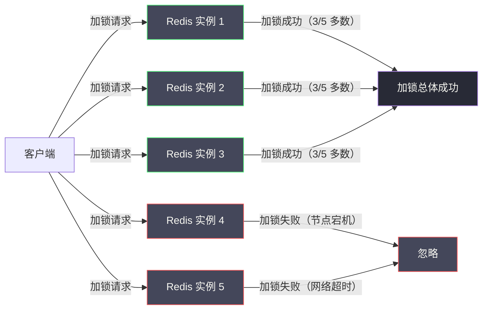

# 03 Redlock 算法正确性争议

**摘要：**

Redlock 是 Redis 作者 Antirez 于 2016 年提出的多实例分布式锁算法，旨在解决单节点 Redis 锁在主从切换时可能丢失锁数据的问题。Redlock 的思路看似优雅：向 N 个独立的 Redis 实例加锁，只要超过半数成功，就认为加锁成功。然而，就在 Redlock 发布后不久，分布式系统领域的著名学者 Martin Kleppmann 发表了一篇深度批评文章，从时钟漂移、GC 停顿等角度指出 Redlock 在面对某些故障场景时仍无法保证互斥性。随后 Antirez 进行了有力反驳，这场公开辩论成为分布式系统社区的经典事件。本文完整还原这场辩论的核心论点，深入分析双方各自的合理之处，并给出工程实践中的选型建议。

---

## 第 1 章 Redlock 的动机：单节点 Redis 锁的致命弱点

### 1.1 主从复制的异步性：无法回避的数据丢失窗口

在第 02 篇中，我们已经分析了单节点 Redis 锁经过 `SET NX PX + Lua 解锁 + 看门狗`的优化后，正确性已经相当可靠。但有一个致命弱点是这些优化完全无法解决的：**Redis 主从复制的异步性**。

为了保证 Redis 服务的高可用，生产环境通常将 Redis 部署为"一主多从 + Sentinel 哨兵"的架构：

```
客户端 → Redis Master（主）
                ↓ 异步复制
         Redis Slave 1（从）
         Redis Slave 2（从）
```

Redis Sentinel 负责监控 Master 的健康状态。当 Master 宕机时，Sentinel 会在 Slave 中选出一个新的 Master（Failover）。

问题的关键在于"异步复制"这四个字。Redis Master 在接受写操作后，会立即向客户端返回"成功"，然后**异步地**将这次写操作复制到 Slave。这个异步复制过程有一个时间窗口，在这个窗口内：

- Master 已经写入了 `lock_key`，并告知客户端加锁成功
- Slave 尚未收到这次复制，还没有 `lock_key`

如果 Master 恰好在这个窗口内宕机：

```
时间线：
T1: 客户端 A 向 Master 加锁：SET lock_key "client_A" NX PX 30000
T2: Master 返回 OK（加锁成功），客户端 A 开始执行临界区
T3: [在复制到 Slave 之前，Master 宕机]
T4: Sentinel 检测到 Master 宕机，将 Slave 1 提升为新 Master
T5: 新 Master（原 Slave 1）上没有 lock_key（复制丢失）
T6: 客户端 B 向新 Master 加锁：SET lock_key "client_B" NX PX 30000，成功！
T7: 客户端 A 和客户端 B 同时持有锁，互斥性被破坏！
```

这个问题不是代码 Bug，而是 Redis 主从复制的架构性设计决定的。如果使用同步复制（`WAIT` 命令可以等待 Slave 确认），虽然可以消除这个窗口，但 Redis 的高性能优势会大打折扣，而且 `WAIT` 命令的可靠性本身也有讨论空间。

这就是 Antirez 设计 Redlock 要解决的核心问题。

### 1.2 Redlock 的设计目标

Redlock 的设计目标简洁清晰：**在不依赖单一 Redis 节点或主从复制的前提下，通过多个独立的 Redis 实例实现分布式锁，使得任意单个节点的故障都不影响锁的正确性。**

---

## 第 2 章 Redlock 算法：多数派加锁的核心逻辑

### 2.1 算法的基本设定

Redlock 算法要求部署**奇数个（通常是 5 个）完全独立的 Redis 实例**——这里的"完全独立"意味着它们之间没有任何主从关系，运行在不同的服务器上，故障互不影响。

为什么是 5 个？这是一个来自分布式共识理论的经典取舍：
- 使用 3 个节点：可以容忍 1 个节点故障（3 个中获得 2 个多数即可）
- 使用 5 个节点：可以容忍 2 个节点故障（5 个中获得 3 个多数即可）
- 使用 1 个节点：就是普通的单节点 Redis，0 容错

5 个节点在可靠性和运维成本之间取得了合理的平衡。



### 2.2 Redlock 加锁的完整步骤

**步骤一：记录开始时间**

```python
start_time = time.time_ns()  # 纳秒级时间戳，用于后续计算
```

**步骤二：向所有 N 个 Redis 实例顺序加锁**

向每个 Redis 实例执行与单节点锁相同的命令：

```redis
SET lock_key <random_value> NX PX <lock_ttl>
```

`random_value` 是一个全局唯一的随机值（UUID），所有 N 个实例使用**同一个** `random_value`——这很重要，因为解锁时需要用这个值来验证锁的归属。

**关键细节**：向每个实例发送加锁请求时，设置一个较短的**超时时间**（通常是 `lock_ttl / (N * 10)`，如锁 TTL 为 10 秒，则单实例请求超时约为 200ms）。如果某个实例在超时时间内未响应，直接跳过，向下一个实例发送请求。这样可以避免因某个 Redis 实例宕机或网络极慢而阻塞整个加锁流程。

**步骤三：计算有效锁时间，判断是否多数成功**

```python
elapsed_time = time.time_ns() - start_time  # 加锁总耗时（纳秒）
elapsed_ms = elapsed_time // 1_000_000       # 转为毫秒

# 有效锁时间 = 原始 TTL - 加锁耗时 - 时钟漂移安全余量
CLOCK_DRIFT_FACTOR = 0.01  # 时钟漂移因子，通常取 0.01（1%）
drift = int(lock_ttl * CLOCK_DRIFT_FACTOR) + 2  # 毫秒

validity_time = lock_ttl - elapsed_ms - drift

success_count = sum(1 for r in results if r == "OK")

if success_count >= (N // 2 + 1) and validity_time > 0:
    # 加锁成功！有效锁时间为 validity_time 毫秒
    return (True, validity_time, random_value)
else:
    # 加锁失败，向所有实例发送解锁请求（清理可能成功的部分锁）
    release_all(redis_instances, lock_key, random_value)
    return (False, 0, None)
```

**步骤三的逻辑为什么要扣除"加锁耗时"？**

这是 Redlock 的一个精妙设计。在向 5 个实例顺序加锁的过程中，会消耗一段时间（假设 50ms）。在这 50ms 内，第 1 个实例上的锁已经在倒计时，当第 5 个实例加锁成功时，第 1 个实例的锁已经用掉了 50ms 的 TTL。因此，"实际有效的锁时间"要从原始 TTL 中减去这段消耗。

如果 `validity_time ≤ 0`，说明加锁过程花费的时间超过了 TTL，即使多数实例加锁成功，锁可能已经在部分实例上过期了，此时认为加锁失败。

**步骤四：在有效锁时间内执行临界区业务**

```python
# 必须在 validity_time 毫秒内完成业务，否则锁可能已过期
execute_critical_section()
```

**步骤五：解锁**

向**所有** N 个 Redis 实例发送解锁请求（包括加锁失败的实例），使用与单节点锁相同的 Lua 脚本：

```python
for redis_instance in redis_instances:
    redis_instance.eval(UNLOCK_SCRIPT, [lock_key], [random_value])
```

向所有实例发送解锁，而不是只向加锁成功的实例发送，是因为"加锁失败"可能是网络超时导致的——实际上 Redis 实例可能已经成功写入了锁，但响应包在网络中丢失了。如果不向这些"疑似失败"的实例解锁，可能会留下一个残存的锁记录，影响后续的加锁请求。

### 2.3 Redlock 的容错分析

**场景 1：一个 Redis 实例宕机（5 个中的 1 个）**

客户端只能向 4 个实例加锁，需要获得 3/4 的多数（实际上 Redlock 仍然要求 3/5 的多数，宕机节点算失败）。3/5 成功，加锁总体成功。宕机实例恢复后，锁的 TTL 已到期或将到期，不影响后续操作。

**场景 2：加锁后一个持有锁信息的实例宕机**

假设客户端 A 在实例 1、2、3 上加锁成功。随后实例 2 宕机，Sentinel 自动重启实例 2（或实例 2 重启后内存清空）。此时：
- 客户端 A 仍持有实例 1、3 上的锁（共 2 个），不满足多数（2 < 3），但客户端 A 已经加锁成功了（加锁时 3/5 成功）
- 客户端 B 尝试加锁：实例 2 已无锁（宕机重启后），所以能在实例 2、4、5 上加锁成功（共 3 个），总体加锁成功

**结果：客户端 A 和客户端 B 同时持有锁！**

这是 Redlock 最被批评的失效场景之一。Antirez 对此的回应是：实例宕机后必须等待至少 TTL 时间才能重启，以保证实例上的锁已过期。但如果实例宕机后立即重启（如机器进行了 OS 重启，内存被清空），就会触发这个问题。

Antirez 提出的解决方案是：给重启的实例设置一个"延迟可用"时间（`delayed_availability = max_lock_ttl`），在这段时间内，重启的实例不响应加锁请求。这样即使实例重启了，其他客户端也无法利用这个"空白"实例来凑足多数，因为延迟期内它不计入可用节点。

---

## 第 3 章 Martin Kleppmann 的批判

2016 年 2 月，分布式系统领域的知名学者、《Designing Data-Intensive Applications》作者 Martin Kleppmann 发表了一篇题为《How to do distributed locking》的博文，对 Redlock 提出了系统性批判。

### 3.1 批判的核心前提：分布式锁的两种用途

Kleppmann 首先区分了分布式锁的两种不同用途，这是理解他批判的关键前提：

**用途一：效率优化（Efficiency）**

使用分布式锁只是为了避免重复执行开销较大的操作——即使锁失效，最坏的结果是某个操作被执行了两次，没有数据损坏的风险。例如：避免重复发送邮件、避免重复触发某个计算任务。

**用途二：正确性保证（Correctness）**

使用分布式锁是为了确保并发操作的正确性——如果锁失效，会导致数据损坏、不一致、丢失等严重问题。例如：防止库存超卖、防止资金重复扣减。

Kleppmann 的观点是：**对于"效率优化"用途，单节点 Redis 锁已经足够，Redlock 大材小用；对于"正确性保证"用途，Redlock 在面对某些故障场景时仍然不够安全**——它解决了主从复制的问题，却对时钟漂移和进程停顿束手无策。

### 3.2 第一个批判：时钟依赖导致的正确性问题

Redlock 算法严重依赖时钟的准确性——TTL 是基于时间的，锁的有效期计算也是基于时间差的。Kleppmann 指出，在真实的分布式系统中，时钟是不可靠的：

**场景：NTP 时钟跳变导致的锁失效**

```
时间线：
T1: 客户端 A 在 5 个 Redis 实例上加锁成功，锁 TTL = 10 秒
T2: Redis 实例 3 的 NTP 服务执行时钟同步，系统时钟向前跳变了 15 秒
    （NTP 向前校时会导致 Redis 的过期时间立即到达）
T3: 实例 3 上的锁立即过期（因为时钟向前跳了 15 秒）
T4: 此时客户端 A 持有实例 1、2 上的锁（2 个），不满足多数（2 < 3）
    但客户端 A 并不知道这件事，它继续执行临界区
T5: 客户端 B 加锁：在实例 3、4、5 上加锁成功（3 个），总体加锁成功
T6: 客户端 A 和客户端 B 同时持有锁，互斥性被破坏！
```

NTP 时钟跳变在实际运维中不是不可能的事件——特别是在系统时钟严重落后时，NTP 会执行"步进（step）"调整，直接将时间跳变到正确值，而不是缓慢地通过"频率调整（slew）"逐渐矫正。

Kleppmann 的结论：**一个依赖时钟的分布式锁算法，在时钟不可靠的环境中无法提供正确性保证**。而"时钟不可靠"在分布式系统中是一个正常的故障假设，不应被算法忽视。

### 3.3 第二个批判：GC 停顿破坏了锁的有效性假设

Kleppmann 在第 01 篇中提到的 GC 停顿问题上进行了更深入的分析：

```
时间线（GC 停顿破坏 Redlock 的场景）：
T1: 客户端 A 在 5 个实例上加锁成功，锁 TTL = 10 秒，有效时间 = 9.9 秒
T2: 客户端 A 开始执行临界区
T3: 客户端 A 发生 Full GC，所有线程暂停 15 秒
T4: [10 秒过去] 所有 5 个实例上的锁全部 TTL 到期，自动删除
T5: 客户端 B 加锁，5 个实例全部成功，获得锁
T6: 客户端 A 的 GC 结束（此时离加锁成功已过 15 秒），
    但客户端 A 不知道锁已过期，继续执行临界区
T7: 客户端 A 和客户端 B 同时在临界区！
```

这个问题的本质是：**Redlock 假设锁的"有效时间"是可信的，但 GC 停顿会让客户端的主观感知时间与客观流逝时间脱节**。客户端在 GC 期间"失去了 15 秒"，醒来后仍以为自己的锁还有效，但实际上锁早已过期。

### 3.4 Kleppmann 提出的替代方案：Fencing Token

Kleppmann 承认，上述两个问题（时钟跳变和 GC 停顿）的共同根源是：**分布式锁在客户端持有锁期间，锁的有效性可能悄然改变，而客户端无法及时感知**。

他提出了一个根本性的解决思路：**Fencing Token（栅栏令牌）**。

Fencing Token 的核心思想是：每次加锁时，锁服务返回一个**单调递增的令牌（Token）**，客户端在执行临界区操作时必须携带这个 Token；存储服务（如数据库）检查 Token 的单调性，拒绝任何 Token 过期（即 Token 值小于当前已见到的最大 Token）的写请求。

```
Fencing Token 的工作流程：

T1: 客户端 A 加锁，获得 Token = 33
T2: 客户端 A 执行 DB 写入，携带 Token = 33
    DB：当前最大见到 Token = 32 < 33，允许写入，更新最大 Token = 33

T3: 客户端 A 的锁过期，客户端 B 加锁，获得 Token = 34
T4: 客户端 B 执行 DB 写入，携带 Token = 34
    DB：当前最大见到 Token = 33 < 34，允许写入

T5: 客户端 A 从 GC 恢复，也执行 DB 写入（此时它的锁已过期），携带 Token = 33
    DB：当前最大见到 Token = 34 > 33，拒绝写入！（老 Token 被正确拒绝）
```

Fencing Token 的优点是：即使分布式锁失效，存储服务也能通过 Token 单调性检查来拒绝过期客户端的写入，保证数据正确性。这将"正确性保证"从锁服务下移到了存储服务，更加可靠。

Kleppmann 的结论是：如果你需要真正意义上的"正确性保证"，Fencing Token 是必不可少的，而实现了 Fencing Token 的系统（如基于 [[ZooKeeper]] 的方案天然提供单调递增的 `zxid`）比 Redlock 更安全。

---

## 第 4 章 Antirez 的反驳

Antirez 随后发表了回应文章，承认了部分问题，但对 Kleppmann 的核心结论进行了反驳。

### 4.1 对时钟跳变批判的回应

Antirez 承认，如果 NTP 发生大幅"步进"校时（将时间向前跳几十秒），Redlock 确实会失效。但他认为，这是一个**系统管理问题**，而不是 Redlock 算法本身的问题：

1. **NTP 应该被配置为只执行"频率调整"（slew），而不执行"步进跳变"（step）**。主流 NTP 实现（如 `chrony`、`ntpd`）都支持这种配置，系统管理员应该正确配置 NTP 以避免大幅时钟跳变。

2. 对于时钟**缓慢漂移**（几毫秒到几十毫秒），Redlock 已经在算法中引入了"时钟漂移安全余量（drift factor）"来补偿，这个余量通常能覆盖正常的时钟偏差。

3. 如果一个系统的时钟被允许随意跳变，那么几乎所有依赖时间的分布式算法（包括 ZooKeeper 的 Session 超时、Kafka 的 Log Compaction）都会失效，Redlock 只是"众多受害者之一"，不应被单独指责。

> [!note] 这个反驳的合理性
> Antirez 的这个回应是合理的——在运维规范的环境中，NTP 步进跳变是可以被控制的。但问题是：在真实的生产环境中，运维规范未必被严格遵守，云环境中的虚拟机时钟漂移更难控制。Kleppmann 的批判揭示了一个假设（时钟可靠）；Antirez 的回应说明了如何保证这个假设成立。两者都有道理，关键是你的运维环境是否能保证这个假设。

### 4.2 对 GC 停顿批判的回应

Antirez 对 GC 停顿问题的回应更为直接：**这个问题不是 Redlock 独有的，而是所有分布式锁方案（包括 ZooKeeper）的共同问题**。

Kleppmann 批判 Redlock 时提到的 GC 停顿场景，同样适用于 ZooKeeper 分布式锁：

```
时间线（ZooKeeper 锁的 GC 停顿场景）：
T1: 客户端 A 在 ZooKeeper 上创建临时节点，加锁成功
T2: 客户端 A 发生 Full GC，所有线程暂停 15 秒
T3: ZooKeeper 的 Session 超时默认 30 秒，GC 停顿期间 A 的心跳停止
    [如果 GC 超过 30 秒，ZK 会认为 A 的 Session 过期，删除临时节点]
    [即使 GC 不超过 30 秒，A 醒来后继续执行，而锁仍然有效——但临界区操作可能已经不安全]
T4: 如果 A 的 GC 只持续 15 秒，ZK 不会删除节点，A 醒来继续执行
    同时，如果存储服务（如 MySQL）在 A 的 GC 期间对数据做了修改，
    A 基于 GC 前读取的"过时数据"执行写入，同样会有数据竞争问题
```

Antirez 的核心论点是：**GC 停顿是一个进程级别的问题，它会让任何基于时间的分布式协议产生不确定性**。解决这个问题需要在应用层面处理（如 Kleppmann 提出的 Fencing Token），这与使用 Redlock 还是 ZooKeeper 无关。

### 4.3 Antirez 的核心立场

Antirez 最终的立场可以概括为：

**Redlock 的设计目标是"比单节点 Redis 锁更安全"，而不是"在所有可能的故障模型下保证绝对安全"**。Redlock 明确假设：

- 时钟是大致可靠的（NTP 正确配置，无大幅跳变）
- GC 停顿时间远小于锁的 TTL
- 网络分区是短暂的，不是永久的

在这些假设成立的情况下，Redlock 提供了比单节点 Redis 锁更强的安全保证，可以抵御单个 Redis 节点故障。

如果你的系统无法保证这些假设，那么你也无法安全地使用任何基于时间的分布式协议，不只是 Redlock。

---

## 第 5 章 辩论的深层启示：分布式系统的故障假设

这场辩论的最大价值，不在于最终谁对谁错，而在于它揭示了一个分布式系统设计的核心方法论：**任何分布式算法的正确性都建立在一组故障假设（Failure Model）之上，算法的适用范围等价于这组假设成立的范围**。

### 5.1 分布式系统的故障假设模型

**同步模型（Synchronous Model）**：假设网络延迟有上界，进程速度有上界，时钟偏差有上界。在这个模型下，很多分布式算法可以被证明是正确的，但现实网络很少能满足严格的同步假设。

**部分同步模型（Partially Synchronous Model）**：假设系统大部分时间是同步的，只在偶尔的时段违反同步假设。Redlock 隐式地假设了这个模型——大多数时间时钟是准确的，GC 停顿时间是短暂的。

**异步模型（Asynchronous Model）**：不对网络延迟、进程速度、时钟做任何假设。在纯异步模型下，FLP 不可能定理证明不存在确定性的分布式共识算法。ZooKeeper 基于 Paxos/ZAB，在理论上只能在部分同步模型下工作，但其设计比 Redlock 对时钟的依赖更少（ZAB 的核心不依赖锁 TTL，而是依赖 Session 超时，后者可以被设计成对时钟偏差更鲁棒）。

Kleppmann 批判 Redlock 时使用的是更严格的部分异步假设（允许时钟大幅跳变）；Antirez 防御 Redlock 时使用的是更宽松的部分同步假设（时钟有界偏差）。两人的分歧本质上是在争论"正确的故障假设模型应该是什么"。

### 5.2 实用主义 vs 理论完备性

这场争论也反映了工程实用主义与理论完备性之间的永恒张力：

- **Kleppmann 的立场**偏向理论完备性：分布式锁是关键基础设施，应该在尽可能宽松的故障假设下仍然正确，不能依赖"时钟通常是准的"这种脆弱假设。
- **Antirez 的立场**偏向工程实用主义：在合理的运维条件下，Redlock 提供了足够的安全保证，追求"在所有可能的故障下都正确"的代价是不可接受的复杂度。

在工程实践中，没有绝对的对错，只有在给定约束条件下的权衡选择。

---

## 第 6 章 工程实践中的选型建议

经历了这场辩论的洗礼，回到最实际的问题：**在生产系统中，我应该使用 Redlock 吗？**

### 6.1 Redlock 的适用场景

**适合使用 Redlock 的场景**：

1. **已经在使用 Redis，且需要比单节点锁更高的可靠性**：单节点 Redis 锁在主从切换时有数据丢失风险，Redlock 通过多数派加锁消除了这个风险
2. **能够保证合理的运维条件**：NTP 正确配置（禁用大幅步进），GC 停顿控制在合理范围内（使用 G1/ZGC），网络分区持续时间远小于锁 TTL
3. **对正确性要求是"尽力而为"而非"绝对保证"**：即使 Redlock 偶尔失效，通过业务层幂等性可以兜底

**不适合使用 Redlock 的场景**：

1. **运维条件无法保证**：在时钟不可靠、GC 停顿无法控制的环境中（如资源受限的容器、虚拟机迁移等场景）
2. **需要绝对的互斥保证**：对于金融结算、核心数据修改等场景，应该使用 Fencing Token 机制或 ZooKeeper 锁，而非依赖 Redlock 的时间假设
3. **性能要求极高但正确性要求一般**：Redlock 需要串行向 5 个实例加锁，比单节点锁延迟高约 5 倍，如果只是"效率优化"用途，单节点 Redis 锁已经足够

### 6.2 Redlock 的运维要求

如果决定使用 Redlock，以下运维要求不可忽视：

1. **5 个 Redis 实例必须完全独立**：不能有任何主从关系，运行在不同物理机上，甚至不同机架、不同电源回路
2. **NTP 必须配置为 slew 模式**，禁止大幅步进跳变：
   ```
   # /etc/chrony.conf（推荐的 NTP 配置）
   makestep 0.1 3  # 仅在启动的前 3 次校时才允许步进，之后只允许频率调整
   ```
3. **锁的 TTL 应远大于预期的最大故障时间**：包括网络延迟 + GC 停顿 + 系统负载抖动的总和
4. **节点重启必须有延迟**（delayed availability）：等待至少 `max_lock_ttl` 时间后才重新加入 Redlock 集群

### 6.3 一个更务实的建议

对于大多数互联网业务场景，以下策略往往比 Redlock 更实用：

**方案 A（最常用）：单节点/主从 Redis 锁 + 业务幂等**

使用标准的 `SET NX PX + Lua 解锁 + Redisson 看门狗`，接受极低概率的锁失效可能，通过业务层的幂等性设计（数据库唯一约束、版本号检查）来兜底。这对于库存扣减、订单创建等场景是安全的：即使锁偶尔失效（概率极低），数据库的唯一约束或乐观锁也能阻止错误数据写入。

**方案 B（强一致性要求）：ZooKeeper 分布式锁**

对于金融级的强一致性要求，使用 ZooKeeper 分布式锁（详见第 04 篇）。ZK 基于 ZAB 协议，主从切换强一致（Leader 确认才返回），Session 超时机制比 TTL 更对时钟偏差鲁棒，是更可靠的选择。

**方案 C（Redlock 适用的夹层）**：

如果已经有 Redis 集群（或多地部署），且无法引入 ZooKeeper，同时对单节点 Redis 锁的主从切换风险有顾虑，则 Redlock 是一个合理的中间方案——前提是能满足上述运维要求。

> [!note] 业界的实际选择
> 在工业界，真正使用 Redlock 算法的团队并不多。更常见的做法是：
> 1. **使用单节点/主从 Redis + Redisson**（绝大多数场景）
> 2. **使用 ZooKeeper + Curator**（金融/电信等对一致性要求极高的场景）
> 3. **使用 etcd**（云原生 / Kubernetes 生态中，etcd 本身基于 Raft，提供比 Redis 更强的一致性）
>
> Redlock 的理论价值在于它提出了"多数派加锁"的思想，但在工程实践中，5 个独立 Redis 实例的运维成本和延迟开销，往往不如直接使用 ZooKeeper 或 etcd。

---

## 参考资料

1. Antirez. (2016). Distributed locks with Redis. https://redis.io/docs/manual/patterns/distributed-locks/
2. Kleppmann, M. (2016). How to do distributed locking. https://martin.kleppmann.com/2016/02/08/how-to-do-distributed-locking.html
3. Antirez. (2016). Is Redlock safe? http://antirez.com/news/101
4. Kleppmann, M. (2016). A critique of the CAP theorem. https://martin.kleppmann.com/2015/05/11/please-stop-calling-databases-cp-or-ap.html
5. Kleppmann, M. (2017). *Designing Data-Intensive Applications*. O'Reilly Media. Chapter 8 & 9.
6. Gray, J., & Lamport, L. (2006). Consensus on Transaction Commit. *ACM TODS, 31*(1), 133–160.
7. Fischer, M.J., Lynch, N.A., & Paterson, M.S. (1985). Impossibility of Distributed Consensus with One Faulty Process. *Journal of the ACM, 32*(2), 374–382.

---

> [!note] 思考题
> 1. ZooKeeper 锁使用临时顺序节点：创建 `/lock/seq-` → 获取所有子节点排序 → 如果自己最小则获取锁 → 否则 Watch 前一个节点的删除事件。这种设计避免了'惊群效应'——只唤醒下一个等待者。但如果前一个节点的 Session 超时很长（如 30 秒），当前等待者需要等待 30 秒才能获取锁。如何优化 Session 超时以平衡'快速检测'和'避免误判'？
> 2. ZooKeeper 锁的可重入性——同一客户端可以多次获取同一把锁。Curator 的 `InterProcessMutex` 在客户端维护了一个计数器——每次 `acquire` 加 1，`release` 减 1，减到 0 时删除节点。如果客户端进程崩溃但 Session 未超时——计数器丢失，临时节点仍存在——其他客户端无法获取锁直到 Session 超时。这个窗口期如何缩短？
> 3. ZooKeeper 锁 vs Redis 锁的性能差距——Redis 的获取/释放延迟约 0.1-1ms，ZooKeeper 约 5-20ms。在需要每秒获取/释放数千次锁的场景中（如高频交易），ZooKeeper 锁是否适用？
