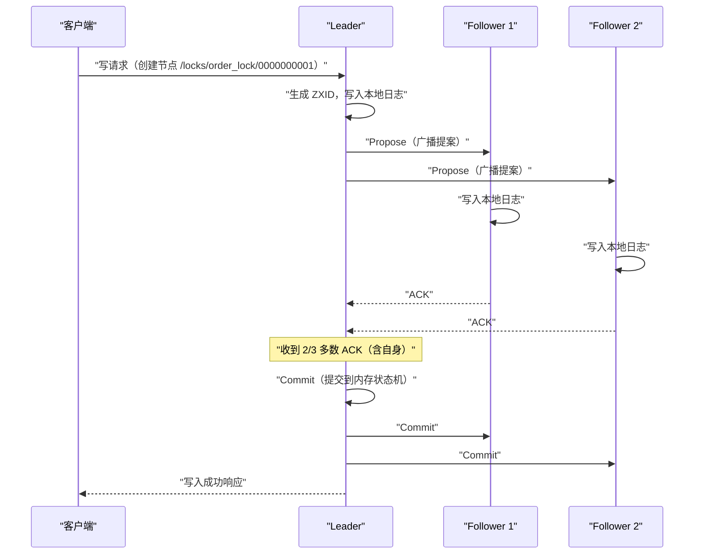
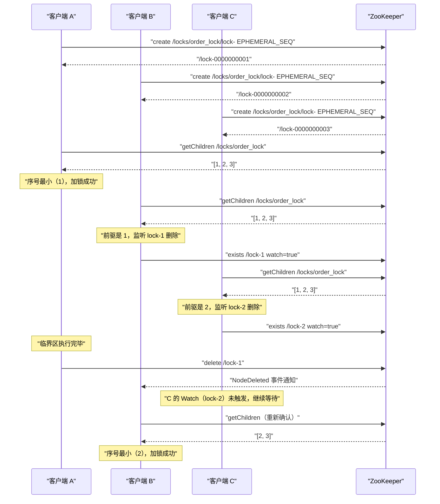
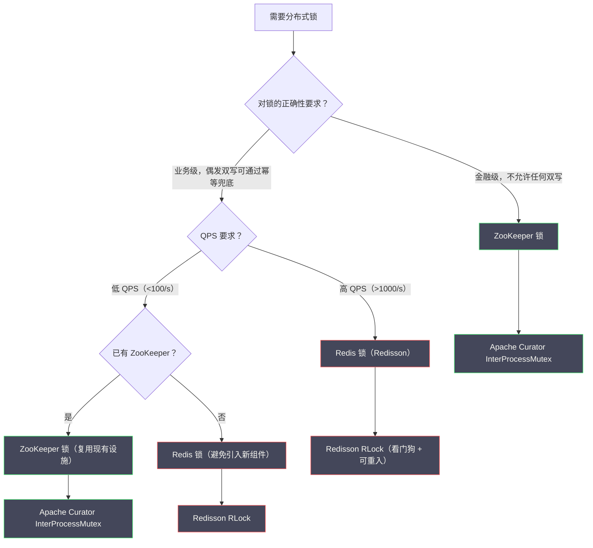

# 04 基于 ZooKeeper 的分布式锁原理深度解析

**摘要：**

ZooKeeper 分布式锁是分布式系统中可靠性最高的锁实现之一。它不依赖"时钟准确性"假设，而是将锁的生命周期与客户端的 Session 绑定——客户端崩溃时，ZooKeeper 通过 Session 超时机制自动删除临时节点，天然实现无死锁。更精妙的是，ZooKeeper 的临时顺序节点机制配合 Watcher 事件，构建出一种"只监听前一个节点"的公平锁实现，彻底消除了 Redis 轮询方案中的羊群效应。本文从 ZooKeeper 的数据模型与节点类型出发，深入剖析 ZAB 协议如何保证写操作的强一致性，完整解析临时顺序节点实现公平锁的核心机制，并分析 Apache Curator 框架的工程封装，最后与 Redis 锁从多个维度进行系统对比。

---

## 第 1 章 ZooKeeper 的数据模型：一切的基础

### 1.1 ZNode 树形结构：类文件系统的命名空间

[[ZooKeeper]] 将所有数据组织在一个类似文件系统的树形结构中，每个节点被称为 **ZNode**。ZNode 既可以存储数据（最大 1MB），也可以有子节点，路径用 `/` 分隔：

```
ZooKeeper 数据树示例：

/                              (根节点)
├── zookeeper/                 (ZK 内部使用)
│   └── quota/
├── services/
│   ├── order-service/
│   │   └── instances/
│   │       ├── 192.168.1.1:8080
│   │       └── 192.168.1.2:8080
│   └── inventory-service/
└── locks/                     (分布式锁使用的目录)
    └── order_lock/
        ├── 0000000001         (客户端 A 创建的锁节点)
        └── 0000000002         (客户端 B 创建的锁节点)
```

ZNode 的路径是绝对路径，从根节点 `/` 开始。每个 ZNode 存储的元数据包括：

```
ZNode 元数据结构：
- data：节点存储的数据（字节数组）
- stat：节点状态信息，包含：
  - czxid：创建该节点的事务 ID（ZXID）
  - mzxid：最后修改该节点的事务 ID
  - ctime：创建时间（毫秒时间戳）
  - mtime：最后修改时间
  - version：数据版本号（每次修改 +1）
  - cversion：子节点版本号
  - aversion：ACL 版本号
  - ephemeralOwner：若为临时节点，存储创建者的 Session ID；否则为 0
  - dataLength：数据长度
  - numChildren：子节点数量
  - pzxid：最后修改子节点列表的事务 ID
```

### 1.2 四种 ZNode 类型：临时顺序节点是关键

ZooKeeper 提供四种 ZNode 类型，它们的组合是实现分布式锁的核心：

**（1）持久节点（Persistent）**：创建后永久存在，只有客户端显式调用 `delete` 才会删除。这是最普通的节点类型，类似于文件系统中的普通目录或文件。

**（2）持久顺序节点（Persistent Sequential）**：在持久节点的基础上，ZooKeeper 在节点名称后自动追加一个单调递增的 10 位数字序号（如 `/locks/order_lock/0000000001`）。序号由父节点维护，同一父节点下的顺序节点共享一个计数器，每创建一个顺序子节点，计数器加 1。

**（3）临时节点（Ephemeral）**：与客户端的 Session 生命周期绑定。**当客户端的 Session 失效（主动关闭连接、或因网络断开超过 Session 超时时间）时，ZooKeeper 自动删除该客户端创建的所有临时节点**。临时节点不能有子节点。

**（4）临时顺序节点（Ephemeral Sequential）**：同时具备"临时"和"顺序"两种特性。这是实现分布式锁最重要的节点类型——它既能在客户端崩溃时自动删除（无死锁），又通过序号提供了全局排序（公平锁）。

> [!info] 为什么临时节点是"无死锁"的天然保证
> Redis 锁通过 TTL 来实现无死锁：如果客户端崩溃，TTL 到期后锁自动释放。这有一个脆弱的假设：TTL 必须比业务执行时间长，但比客户端崩溃后的"可接受等待时间"短。
>
> ZooKeeper 临时节点的机制本质不同：它通过 **TCP 长连接 + 心跳** 来判断客户端是否存活。只要 TCP 连接在，临时节点就一直存在；TCP 连接断开（超过 Session 超时时间 `sessionTimeout`，默认 30 秒），临时节点立即被删除。这不依赖任何 TTL 计算，而是直接绑定到连接生命周期。

### 1.3 Watch 机制：事件驱动的节点监听

**Watch（监听器）** 是 ZooKeeper 客户端订阅节点变化事件的机制。客户端可以对某个 ZNode 注册 Watch，当该节点发生特定变化时，ZooKeeper 服务端会向客户端推送一次性通知（Watch 是一次性的，触发后自动失效，需要重新注册）。

Watch 可以监听的事件类型：

| 事件类型 | 触发条件 |
| :--- | :--- |
| `NodeCreated` | 指定路径的节点被创建 |
| `NodeDeleted` | 指定路径的节点被删除 |
| `NodeDataChanged` | 指定路径的节点数据被修改 |
| `NodeChildrenChanged` | 指定路径的节点的子节点列表发生变化 |

**Watch 的实现原理**：ZooKeeper 客户端在执行 `exists()`、`getData()`、`getChildren()` 等读操作时，可以传入 `watch=true` 参数。服务端在内存中维护一个"Watch 列表"，记录哪些客户端监听了哪些节点的哪种事件。当相应事件发生时，服务端向客户端发送通知（异步推送，不阻塞事件的触发者）。

**Watch 的一次性（One-time）特性**：每次 Watch 触发后自动失效。如果客户端需要持续监听，必须在收到通知后立即重新注册 Watch。这个设计避免了"持续推送"对服务端的持续压力，但要注意：在取消注册到重新注册之间存在一个短暂的窗口期，可能错过事件——这在客户端实现中需要考虑（通常通过"先注册 Watch，再读取当前状态"的顺序来消除窗口）。

---

## 第 2 章 ZAB 协议：写操作强一致性的根基

### 2.1 为什么 ZK 锁比 Redis 锁更可靠

在第 03 篇中，我们分析了 Redis 主从切换时锁数据可能丢失的问题。ZooKeeper 为什么没有这个问题？答案在于 ZooKeeper 底层使用的 **[[ZAB 协议]]（ZooKeeper Atomic Broadcast，ZooKeeper 原子广播协议）**。

### 2.2 ZAB 协议的核心：Leader 广播 + 多数派确认

ZAB 是一个专为 ZooKeeper 设计的分布式一致性协议，思想上与 [[Paxos]] 相似，但针对 ZooKeeper 的"主从复制日志"场景做了优化。

ZooKeeper 集群通常由奇数个节点组成（3 个或 5 个），其中一个节点是 **Leader**，其余是 **Follower**。所有写操作（创建节点、修改数据、删除节点）都必须经过 Leader，读操作可以在任意节点执行（可能读到稍旧的数据）。

**写操作的处理流程（两阶段提交）**：



关键点：**Leader 在收到多数 Follower 的 ACK 之后，才向客户端返回写成功**。这意味着：写入成功时，数据已经在多数节点（包括 Leader）上持久化，即使 Leader 随后宕机，已经收到 ACK 的多数 Follower 会选出新的 Leader，并保留这次写入的数据。

**这与 Redis 主从复制的本质差异**：

Redis Master 写入成功后**立即**向客户端返回，然后**异步**复制到 Slave。在这个异步窗口内，Master 宕机会导致数据丢失。

ZooKeeper Leader 写入成功代表**已经在多数节点确认**，不存在"写成功但数据未复制"的窗口——如果多数节点都宕机了（超过半数故障），ZooKeeper 会拒绝写操作（保护一致性），而不是返回一个虚假的成功。

### 2.3 ZXID：全局单调递增的事务 ID

每次写操作都对应一个唯一的 **ZXID（ZooKeeper Transaction ID）**，它是一个 64 位整数，高 32 位是 `epoch`（Leader 任期号），低 32 位是该 epoch 内的事务计数器。

ZXID 的单调递增特性保证了：
1. **全局事务顺序**：所有节点看到的事务顺序一致
2. **Leader 选举的正确性**：拥有最大 ZXID 的节点包含最新的数据，选举时优先选择 ZXID 最大的候选者
3. **Fencing Token 的天然实现**：ZNode 的 `czxid`（创建节点的 ZXID）单调递增，可以作为天然的 Fencing Token（第 03 篇 Kleppmann 提出的需求 ZK 天然满足）

---

## 第 3 章 临时顺序节点实现公平锁：核心机制深度解析

### 3.1 朴素实现的问题：羊群效应

最朴素的 ZooKeeper 锁实现：所有客户端竞争同一个节点，谁创建成功谁获得锁：

```python
# 朴素 ZK 锁（存在羊群效应）
def acquire_lock(zk, lock_path):
    while True:
        try:
            zk.create(lock_path, ephemeral=True)  # 尝试创建临时节点
            return True  # 创建成功，加锁成功
        except NodeExistsError:
            # 节点已存在，监听节点删除事件
            event = threading.Event()
            zk.exists(lock_path, watch=lambda e: event.set())
            event.wait()  # 等待节点被删除
            # 被唤醒后重新尝试创建
```

这个方案有一个严重问题：**羊群效应（Herd Effect）**。

当持锁客户端释放锁（删除节点）时，所有正在等待的客户端都会同时收到"节点被删除"的 Watch 通知，全部被唤醒，然后全部去竞争创建同一个节点——只有一个能成功，其余全部失败，再次注册 Watch 继续等待。

如果有 1000 个客户端在等待，锁每次释放就会引发一次 1000 个并发请求涌向 ZooKeeper 的"惊群"事件，对 ZooKeeper 服务端造成巨大冲击，且绝大多数请求都是无效的（只有一个能成功）。

### 3.2 临时顺序节点 + Watch 前驱节点：消除羊群效应的精妙设计

ZooKeeper 官方文档和 Apache Curator 采用了一种更精妙的设计，完全消除了羊群效应：

**核心思想**：每个客户端都在锁目录下创建一个**临时顺序节点**，序号最小的节点持有锁；其他客户端不是等待"锁节点被删除"，而是各自监听**自己的前一个节点**（序号比自己小一位的节点）。当前驱节点被删除时，只有对应的客户端被唤醒，而不是所有等待者。

**完整的加锁流程**：

```
步骤一：在锁目录下创建临时顺序节点

  客户端 A：create /locks/order_lock/lock- EPHEMERAL_SEQUENTIAL
            → 创建成功，节点为 /locks/order_lock/lock-0000000001

  客户端 B：create /locks/order_lock/lock- EPHEMERAL_SEQUENTIAL
            → 创建成功，节点为 /locks/order_lock/lock-0000000002

  客户端 C：create /locks/order_lock/lock- EPHEMERAL_SEQUENTIAL
            → 创建成功，节点为 /locks/order_lock/lock-0000000003

步骤二：获取锁目录下的所有子节点，判断自己的排名

  客户端 A：getChildren /locks/order_lock
            → [lock-0000000001, lock-0000000002, lock-0000000003]
            → 排序后，lock-0000000001 是最小值，且等于自己的节点名
            → 我是第一名，加锁成功！开始执行临界区

  客户端 B：getChildren /locks/order_lock
            → [lock-0000000001, lock-0000000002, lock-0000000003]
            → lock-0000000002 不是最小值
            → 找到前驱节点：lock-0000000001（序号比自己小 1）
            → 监听 /locks/order_lock/lock-0000000001 的删除事件
            → 阻塞等待

  客户端 C：getChildren /locks/order_lock
            → [lock-0000000001, lock-0000000002, lock-0000000003]
            → lock-0000000003 不是最小值
            → 找到前驱节点：lock-0000000002（序号比自己小 1）
            → 监听 /locks/order_lock/lock-0000000002 的删除事件
            → 阻塞等待

步骤三：客户端 A 执行完临界区，解锁（删除自己的节点）

  客户端 A：delete /locks/order_lock/lock-0000000001
            → 节点删除成功

步骤四：Watch 触发，精确唤醒

  → 只有客户端 B 监听了 lock-0000000001，只有客户端 B 被唤醒
  → 客户端 C 监听的是 lock-0000000002，此时 lock-0000000002 未被删除，客户端 C 继续等待

步骤五：客户端 B 被唤醒，重新检查

  客户端 B：getChildren /locks/order_lock
            → [lock-0000000002, lock-0000000003]（lock-0000000001 已删除）
            → 排序后，lock-0000000002 是最小值，且等于自己的节点名
            → 我是第一名，加锁成功！开始执行临界区
```

**为什么要在步骤五重新 getChildren 检查，而不是直接认为自己获得了锁？**

这是一个极其重要的细节。Watch 触发说明"前驱节点被删除了"，但这不等于"我现在是序号最小的节点"。因为在客户端 B 的前驱节点（lock-0000000001）被删除之前，可能有其他更小序号的节点存在（比如客户端 A 在创建 lock-0000000001 之前创建了 lock-0000000000，但由于网络延迟，客户端 B 在步骤二的 getChildren 时没看到它）。

**实际工程中的边界情况更微妙**：客户端 B 在步骤二执行 getChildren 和注册 Watch 之间，前驱节点可能已经被删除了，此时 Watch 永远不会触发（因为节点已经不存在了）。正确的处理是：先注册 Watch，如果发现节点已经不存在，立即重新走步骤二。

### 3.3 加锁流程的可视化



### 3.4 为什么这个设计消除了羊群效应

对比朴素实现与临时顺序节点实现：

| 维度 | 朴素实现（抢单一节点）| 临时顺序节点实现（监听前驱）|
| :--- | :--- | :--- |
| **锁释放时被唤醒的客户端数** | 所有等待者（N 个）| 只有 1 个（前驱的后继）|
| **ZooKeeper 收到的请求压力** | O(N) 并发请求 | O(1) 精确通知 |
| **公平性** | 非公平（随机竞争）| 公平（FIFO，先来先得）|
| **活性（无饿死）** | 不保证（可能一直竞争失败）| 保证（按序号依次获得锁）|
| **实现复杂度** | 低 | 中 |

每个等待中的客户端只监听自己的前驱节点，因此锁释放时只有一个客户端被唤醒，形成"接力棒"式的传递。这既是公平锁，也完全没有羊群效应。

---

## 第 4 章 Session 机制与无死锁保证的深层原理

### 4.1 Session 是什么

当客户端与 ZooKeeper 建立连接时，ZooKeeper 会创建一个 **Session（会话）**，并分配一个唯一的 Session ID。Session 有以下属性：

- **sessionTimeout**：Session 超时时间，由客户端指定（通常 30 秒），但 ZooKeeper 服务端可以调整实际值（在服务端配置的 `minSessionTimeout` 和 `maxSessionTimeout` 范围内）
- **心跳机制**：客户端每隔 `sessionTimeout / 3` 向服务端发送心跳（PING），证明自己仍然存活

### 4.2 Session 超时与临时节点删除的时序

当客户端与 ZooKeeper 的 TCP 连接断开后，发生以下时序：

```
T0: 客户端 A 的 TCP 连接断开（进程崩溃 / 网络断开）

T0 ~ T0+sessionTimeout:
   ZooKeeper 服务端在此期间等待客户端重连
   在此期间，临时节点 lock-0000000001 仍然存在
   监听该节点的客户端 B 不会收到任何通知

T0+sessionTimeout:
   ZooKeeper 服务端认为 Session 已失效
   自动删除客户端 A 的所有临时节点
   Watch 通知被发送给所有监听 lock-0000000001 的客户端（即客户端 B）
   客户端 B 被唤醒，尝试获取锁
```

**这个等待机制的必要性**：ZooKeeper 不能在 TCP 断开的瞬间立即删除临时节点，因为 TCP 断开可能只是短暂的网络抖动（如机房网络路由器重启，通常在几秒内恢复）。在 `sessionTimeout` 内重连成功的客户端，其临时节点仍然有效，业务不受影响。只有超过 `sessionTimeout` 仍未重连，才认为客户端真正"离开"，此时删除临时节点是安全的。

**`sessionTimeout` 的设置建议**：

- 太短（如 5 秒）：短暂的网络抖动就会导致 Session 失效，临时节点被删除，锁被释放，而持锁的业务逻辑实际上还在运行，造成互斥性破坏
- 太长（如 300 秒）：客户端真正崩溃后，其他客户端需要等待 300 秒才能获取锁，系统可用性严重受损
- **推荐值**：30~60 秒，与业务的正常执行时间、网络超时时间综合考量

> [!warning] ZK Session 超时与 Redis TTL 的类比陷阱
> ZK Session 超时和 Redis TTL 解决的是同一个问题（无死锁），但机制有本质差异：
> - Redis TTL 是纯粹的"时间过期"——无论客户端是否存活，时间到了锁就消失
> - ZK Session 超时是"连接感知的时间过期"——只有当 TCP 连接真正断开超过 sessionTimeout 后才会触发，活跃的客户端不受影响
> 
> 因此，对于一个正常运行的、持有锁的 ZK 客户端，其锁不会因为"时间到了"而被删除——只要心跳正常，锁就持续有效。这解决了 Redis TTL 方案中"业务没跑完锁就过期"的问题，也意味着 ZK 锁不需要看门狗续期机制。

### 4.3 ZK 集群的 Session 一致性

在 ZooKeeper 集群中，Session 状态由整个集群共同维护。当 Leader 宕机，Follower 选出新 Leader 后，所有客户端的 Session 信息（包括 sessionTimeout、临时节点等）都会被正确迁移，不会丢失。这也是 ZK 锁比 Redis 主从锁更可靠的重要原因。

---

## 第 5 章 Apache Curator：工业级 ZK 分布式锁封装

### 5.1 为什么需要 Curator

直接使用 ZooKeeper 的原生客户端（如 `ZkClient`）实现分布式锁，需要处理大量的边界情况：

1. **Watch 的一次性问题**：Watch 触发后失效，必须在处理事件后重新注册，且要考虑"注册与事件发生之间的窗口期"
2. **Session 过期后的重连**：Session 过期后，所有临时节点已被删除，客户端必须重新创建节点
3. **getChildren 与注册 Watch 的竞态**：如第 3.2 节分析的，前驱节点可能在 getChildren 之后、注册 Watch 之前就已被删除
4. **可重入计数**：同一客户端线程多次加锁的计数管理
5. **公平等待队列的维护**：确保客户端按序号顺序依次获取锁

[[Apache Curator]] 是 Netflix 开源的 ZooKeeper 客户端框架，现为 Apache 顶级项目，提供了"Recipes"（菜谱）层，封装了各种分布式协议的标准实现，包括分布式锁。

### 5.2 Curator InterProcessMutex：标准用法

```java
// Maven 依赖
// <dependency>
//   <groupId>org.apache.curator</groupId>
//   <artifactId>curator-recipes</artifactId>
//   <version>5.5.0</version>
// </dependency>

@Service
public class OrderService {

    private final CuratorFramework curatorClient;

    public OrderService() {
        // 初始化 Curator 客户端（应用启动时初始化一次）
        this.curatorClient = CuratorFrameworkFactory.builder()
            .connectString("zk1:2181,zk2:2181,zk3:2181")
            .sessionTimeoutMs(30000)   // Session 超时 30 秒
            .connectionTimeoutMs(5000) // 连接超时 5 秒
            .retryPolicy(new ExponentialBackoffRetry(1000, 3)) // 重试策略：指数退避，最多 3 次
            .build();
        this.curatorClient.start();
    }

    public void processOrder(String orderId) throws Exception {
        // 创建锁对象（可复用，线程安全）
        InterProcessMutex lock = new InterProcessMutex(
            curatorClient,
            "/locks/order_lock/" + orderId  // 锁路径
        );

        // 方式 1：直接加锁（无超时，一直等到获取锁为止）
        lock.acquire();
        try {
            doProcessOrder(orderId);
        } finally {
            lock.release();  // 必须在 finally 中释放
        }

        // 方式 2：带超时的加锁（推荐）
        boolean acquired = lock.acquire(10, TimeUnit.SECONDS);
        if (!acquired) {
            throw new BusinessException("获取分布式锁超时，请稍后重试");
        }
        try {
            doProcessOrder(orderId);
        } finally {
            lock.release();
        }
    }
}
```

### 5.3 Curator InterProcessMutex 的内部实现原理

Curator 的 `InterProcessMutex` 完整实现了第 3 章描述的临时顺序节点 + Watch 前驱节点的公平锁机制，并处理了所有边界情况：

**可重入支持**：`InterProcessMutex` 支持可重入。Curator 在内存中维护一个线程级别的 `ConcurrentMap<Thread, LockData>` 映射，记录每个线程的加锁次数和对应的 ZNode 路径：

```java
// Curator 内部数据结构（简化）
private final ConcurrentMap<Thread, LockData> threadData = Maps.newConcurrentMap();

private static class LockData {
    final Thread owningThread;
    final String lockPath;          // 该线程对应的 ZNode 路径
    final AtomicInteger lockCount;  // 重入计数
}
```

**加锁时**：
1. 检查 `threadData` 中是否有当前线程的记录，有则说明是重入，`lockCount + 1` 直接返回成功
2. 没有则在 ZooKeeper 创建临时顺序节点，执行完整的获取锁流程
3. 获取成功后，将 `(currentThread, lockPath)` 写入 `threadData`

**解锁时**：
1. 检查 `threadData` 中当前线程的 `lockCount`，`-1` 后如果还大于 0，说明仍有重入层级，直接返回
2. 如果 `lockCount` 减到 0，才真正删除 ZooKeeper 节点，并从 `threadData` 中移除记录

**Watch 事件处理的竞态消除**：Curator 在注册 Watch 时会检查被监听节点是否已经不存在——如果不存在，立即重新执行 getChildren 判断，而不是等待一个永远不会来的 Watch 通知。

### 5.4 Curator 提供的其他锁类型

| 锁类型 | 类名 | 适用场景 |
| :--- | :--- | :--- |
| **互斥锁（默认）** | `InterProcessMutex` | 最常用，任意时刻只有一个持锁者 |
| **读写锁** | `InterProcessReadWriteLock` | 读操作并发，写操作独占（适合读多写少场景）|
| **信号量** | `InterProcessSemaphoreV2` | 控制最大并发数（如最多允许 10 个并发）|
| **Multi 锁** | `InterProcessMultiLock` | 对多个路径同时加锁（原子操作，要么全成功要么全失败）|

---

## 第 6 章 ZooKeeper 锁 vs Redis 锁：系统性对比

### 6.1 一致性模型的本质差异

这是两种方案最根本的差异，其他所有差异都可以从这里推导：

**Redis（AP 倾向）**：Redis 主从复制是异步的，优先保证可用性（AP）——Master 接受写入后立即返回，即使 Slave 未同步。在 CAP 三角中，Redis 在一致性和可用性之间倾向于选择可用性。

**ZooKeeper（CP 倾向）**：ZAB 协议要求写操作在多数节点确认后才返回，优先保证一致性（CP）——如果超过半数节点故障，ZooKeeper 会拒绝写操作，保护数据一致性而非继续提供服务。

| 维度 | Redis 分布式锁 | ZooKeeper 分布式锁 |
| :--- | :--- | :--- |
| **一致性保证** | 最终一致（异步复制，主从切换有丢失窗口）| 强一致（ZAB 多数派确认，无丢失窗口）|
| **性能** | 极高（内存操作，~0.1ms 延迟）| 中（网络往返 + ZAB 确认，~2-5ms 延迟）|
| **无死锁机制** | TTL 过期（需精心设置，看门狗辅助）| Session 超时（基于连接感知，更鲁棒）|
| **公平锁** | 否（需额外实现，复杂度高）| 是（临时顺序节点天然实现）|
| **可重入** | 需手动实现（Redisson 已封装）| 需手动实现（Curator 已封装）|
| **读写锁** | 需手动实现 | Curator 原生支持 |
| **锁等待通知** | Pub/Sub（Redisson 实现）| Watch 机制（ZK 原生）|
| **单点故障** | 主从切换有短暂不可用（秒级）| 半数以下故障透明（Leader 选举通常毫秒~秒级）|
| **时钟依赖** | 强依赖（TTL 基于时间）| 弱依赖（Session 超时也是时间，但更鲁棒）|
| **Fencing Token** | 无原生支持（ZXID 不对外暴露）| 天然提供（ZNode 的 ZXID 单调递增）|
| **运维复杂度** | 低（Redis 团队普遍熟悉）| 中（ZK 集群运维有一定复杂度）|
| **生态依赖** | 需引入 Redisson 框架 | 需引入 Curator 框架 |

### 6.2 性能差异的量化分析

ZooKeeper 锁比 Redis 锁慢，根本原因在于 ZAB 的同步写：每次加锁（创建 ZNode）都需要 Leader 向多数 Follower 同步，涉及多次网络往返。

粗略的延迟对比（同机房部署，3 节点 ZK）：

```
Redis SET NX PX（单节点）：
  网络延迟 0.1ms + 内存操作 0.01ms ≈ 0.1~0.5ms

Redis SET NX PX（主从，等待 Slave ACK）：
  网络往返 × 2 ≈ 0.5~2ms

ZooKeeper 创建临时顺序节点（3 节点）：
  客户端 → Leader：0.5ms
  Leader → 2 个 Follower：0.5ms（并行）
  Follower ACK：0.5ms
  Leader → 客户端返回：0.5ms
  ≈ 2~5ms

ZooKeeper 加锁总流程（创建节点 + getChildren + 可能的 Watch 等待）：
  ≈ 5~20ms（不含等待时间）
```

对于 QPS 为 1000 的锁操作：
- Redis 锁：1000 × 0.5ms = 500ms 总延迟，可接受
- ZK 锁：1000 × 10ms = 10s 总延迟，在高并发下会成为明显瓶颈

这解释了为什么 ZooKeeper 锁更适合"低频、长时间持锁"的场景，而 Redis 锁更适合"高频、短时间持锁"的场景。

### 6.3 选型决策框架



---

## 参考资料

1. ZooKeeper 官方文档：Recipes and Solutions. https://zookeeper.apache.org/doc/current/recipes.html
2. ZooKeeper 官方文档：ZAB Protocol. https://zookeeper.apache.org/doc/current/zookeeperInternals.html
3. Apache Curator 官方文档. https://curator.apache.org/docs/getting-started
4. Junqueira, F.P., Reed, B.C., & Serafini, M. (2011). Zab: High-performance broadcast for primary-backup systems. *IEEE/IFIP DSN 2011*.
5. Chandra, T.D., Griesemer, R., & Redstone, J. (2007). Paxos Made Live. *PODC 2007*.
6. Hunt, P., Konar, M., Junqueira, F.P., & Reed, B. (2010). ZooKeeper: Wait-free coordination for Internet-scale systems. *USENIX ATC 2010*.
7. Kleppmann, M. (2017). *Designing Data-Intensive Applications*. O'Reilly Media. Chapter 9: Consistency and Consensus.
