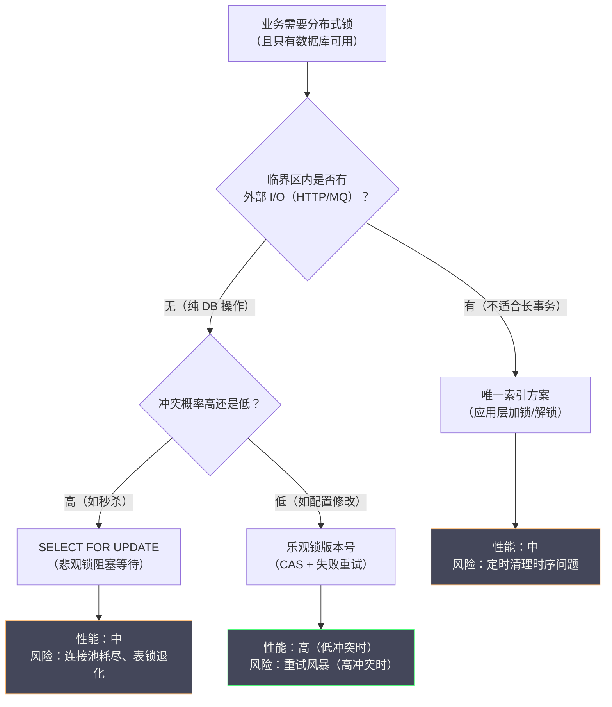

# 05 基于数据库的分布式锁原理与局限

**摘要：**

在 Redis 和 ZooKeeper 成为主流之前，关系型数据库是很多团队实现分布式锁的第一选择——毕竟几乎每个系统都已经有了数据库，无需引入新的基础组件。本文系统梳理三种主流的数据库分布式锁方案：基于唯一索引的插入式锁、基于悲观锁的 `SELECT FOR UPDATE`、以及基于乐观锁的版本号机制。对每种方案，我们不仅讲清楚"怎么实现"，更深入剖析其工作原理、隐藏的性能瓶颈、以及在极端情况下的失效模式。理解这些方案的局限性，是做出正确技术选型的前提。

---

## 第 1 章 为什么要了解数据库分布式锁

### 1.1 数据库锁的历史地位

在 Redis 成为互联网标配、ZooKeeper 普及开来之前，关系型数据库（MySQL、PostgreSQL、Oracle）是分布式系统中协调并发的主要工具。数据库分布式锁不是一个"过时"的方案——它至今仍然在大量遗留系统中运行，也是很多小团队在不想引入额外组件时的自然选择。

从技术角度看，了解数据库分布式锁有两个重要价值：

**价值一：理解"为什么不推荐"**。很多技术选型文章直接给出"不要用 DB 做分布式锁"的结论，却没有解释原因。深入理解 DB 锁的工作原理和局限性，能让你在面对具体问题时作出有根据的判断，而不是盲目遵循规则。

**价值二：某些场景数据库锁确实够用**。如果你的业务锁操作频率很低（每秒几次到几十次），且系统已经重度依赖 MySQL，引入 Redis 或 ZooKeeper 的运维成本可能不值得。在这种情况下，正确使用数据库锁是合理的工程决策。

### 1.2 数据库锁的核心优势

**零额外组件**：系统本身就有数据库，无需引入 Redis 或 ZooKeeper，部署复杂度低。

**ACID 事务保证**：数据库的锁操作可以与业务操作放在同一个事务中，天然具有原子性——"加锁 + 业务操作 + 解锁"可以在一个事务中完成，或通过数据库的锁机制自动协调。

**完善的超时与死锁检测**：`InnoDB` 有内置的死锁检测机制（`innodb_deadlock_detect`），能自动检测并回滚死锁事务；`innodb_lock_wait_timeout` 控制锁等待超时，避免无限期阻塞。

---

## 第 2 章 方案一：基于唯一索引的插入式锁

### 2.1 设计思路

这是最直观的数据库分布式锁方案，利用数据库**唯一索引的互斥特性**——同一个唯一键只能插入一次，第二次插入会因唯一约束冲突而失败。

**建表**：

```sql
CREATE TABLE distributed_lock (
    id          BIGINT      NOT NULL AUTO_INCREMENT COMMENT '主键',
    lock_key    VARCHAR(128) NOT NULL               COMMENT '锁的唯一标识（业务 key）',
    lock_value  VARCHAR(64)  NOT NULL               COMMENT '持锁者标识（UUID）',
    owner       VARCHAR(64)  NOT NULL               COMMENT '持锁者描述（机器名+进程ID）',
    expire_time DATETIME     NOT NULL               COMMENT '锁过期时间（用于死锁清理）',
    create_time DATETIME     NOT NULL DEFAULT NOW() COMMENT '创建时间',
    PRIMARY KEY (id),
    UNIQUE KEY uk_lock_key (lock_key)               -- 唯一索引：核心约束
) ENGINE=InnoDB DEFAULT CHARSET=utf8mb4;
```

**加锁（INSERT）**：

```sql
-- 尝试插入一行，如果 lock_key 已存在，会因唯一约束失败
INSERT INTO distributed_lock (lock_key, lock_value, owner, expire_time)
VALUES (
    'order_process_lock',        -- 锁的 key
    'a1b2c3d4-xxxx',             -- 唯一 token（UUID）
    'server01:12345',            -- 持锁者描述
    DATE_ADD(NOW(), INTERVAL 30 SECOND)  -- 30 秒后过期
);
-- 插入成功（影响 1 行）：加锁成功
-- 插入失败（Duplicate entry）：锁已被占用，加锁失败
```

**解锁（DELETE）**：

```sql
-- 只删除 lock_key 和 lock_value 都匹配的行，防止误删他人的锁
DELETE FROM distributed_lock
WHERE lock_key = 'order_process_lock'
  AND lock_value = 'a1b2c3d4-xxxx';
-- 影响 1 行：解锁成功
-- 影响 0 行：锁不存在或不属于当前持锁者（已被超时清理或被抢走）
```

### 2.2 无死锁：定时清理过期锁

与 Redis TTL 和 ZooKeeper 临时节点不同，MySQL 没有原生的"记录过期自动删除"机制（MariaDB 的 Aria 引擎有，但 InnoDB 没有）。因此，死锁预防需要应用层实现：在锁记录中存储 `expire_time`，由一个后台定时任务定期清理过期锁。

```java
// 定时清理任务（每 5 秒执行一次）
@Scheduled(fixedDelay = 5000)
public void cleanExpiredLocks() {
    int deleted = jdbcTemplate.update(
        "DELETE FROM distributed_lock WHERE expire_time < NOW()"
    );
    if (deleted > 0) {
        log.warn("清理了 {} 个过期的分布式锁记录", deleted);
    }
}
```

> [!warning] 定时清理的时序陷阱
> 定时清理任务引入了一个微妙的时序问题：假设锁的 `expire_time` 是 30 秒后，但持锁业务在 20 秒内就执行完毕并正常解锁了。此时锁记录已被 DELETE 删除，`expire_time` 不再有意义。但如果持锁业务执行了 35 秒还没完成，锁已过期，定时任务删除了锁记录，其他客户端可能加锁成功，造成并发执行。这与 Redis TTL 方案面临的问题完全相同：TTL 必须比业务执行时间长，但这很难精确保证。

### 2.3 加锁重试：轮询 vs 通知

锁被占用时，客户端如何等待？MySQL 唯一索引方案没有原生的"等待 + 通知"机制，只能轮询：

```java
public boolean acquireLock(String lockKey, String lockValue, int timeoutMs) {
    long deadline = System.currentTimeMillis() + timeoutMs;

    while (System.currentTimeMillis() < deadline) {
        try {
            jdbcTemplate.update(
                "INSERT INTO distributed_lock (lock_key, lock_value, owner, expire_time) " +
                "VALUES (?, ?, ?, DATE_ADD(NOW(), INTERVAL 30 SECOND))",
                lockKey, lockValue, getOwnerInfo()
            );
            return true;  // 插入成功，加锁成功
        } catch (DuplicateKeyException e) {
            // 锁已被占用，等待后重试
            try {
                Thread.sleep(100);  // 轮询间隔 100ms
            } catch (InterruptedException ie) {
                Thread.currentThread().interrupt();
                return false;
            }
        }
    }
    return false;  // 超时
}
```

轮询意味着：N 个等待者 × 每 100ms 一次 × 锁持有时长 = 大量无效数据库请求。这是唯一索引方案在高并发下的核心性能问题。

### 2.4 唯一索引方案的优缺点总结

**优点**：
- 实现直观，代码量少
- 解锁操作天然幂等（DELETE 一行）
- 可记录持锁历史（谁在何时持了哪把锁），便于审计

**缺点**：
- **无原生 TTL**：需要额外的定时清理任务，有时序漏洞
- **轮询等待**：等待锁时只能轮询，对数据库形成持续压力
- **无公平性保证**：所有等待者同时轮询，获取顺序随机
- **性能瓶颈**：每次加锁/解锁都是一次磁盘 I/O 操作（InnoDB redo log 写入），比 Redis 内存操作慢 1~2 个数量级
- **数据库单点**：如果数据库本身是单点，锁服务也是单点；即使主从部署，主从切换同样存在 Redis 类似的数据丢失风险

---

## 第 3 章 方案二：悲观锁 SELECT FOR UPDATE

### 3.1 什么是 SELECT FOR UPDATE

`SELECT ... FOR UPDATE` 是 SQL 标准中的悲观锁语句，执行后会对查询结果集中的行加**排他锁（X 锁）**：

- 其他事务无法对这些行执行 `SELECT ... FOR UPDATE`（会被阻塞，等待锁释放）
- 其他事务无法对这些行执行 `UPDATE` 或 `DELETE`（会被阻塞）
- 其他事务的普通 `SELECT`（不加 `FOR UPDATE`）在 MySQL 默认的 [[MVCC]] 隔离机制下**不会被阻塞**（读的是快照，不需要加锁）

**为什么叫"悲观锁"？**

悲观锁（Pessimistic Lock）的名称来源于它对并发冲突的悲观假设：**假设每次读写操作都可能与其他事务冲突**，所以在读取数据时就立刻加锁，阻止其他事务修改，直到本事务提交/回滚后才释放锁。

对应的是"乐观锁"——乐观地假设冲突不常发生，读取时不加锁，提交时才检测是否有冲突（通过版本号等机制）。

### 3.2 用 SELECT FOR UPDATE 实现分布式锁

与唯一索引方案不同，`SELECT FOR UPDATE` 方案利用数据库**行锁**来实现互斥，无需额外的锁表，而是直接在业务表（或专门的锁控制表）上操作：

**建锁控制表**（或复用已有的业务表）：

```sql
-- 锁控制表：每行代表一个锁资源，提前初始化
CREATE TABLE lock_control (
    lock_key    VARCHAR(128) NOT NULL COMMENT '锁资源标识',
    description VARCHAR(256)          COMMENT '锁用途描述',
    PRIMARY KEY (lock_key)
) ENGINE=InnoDB;

-- 预先插入锁资源行（必须提前存在，否则 SELECT FOR UPDATE 无行可锁）
INSERT INTO lock_control (lock_key, description) VALUES
('order_process_lock', '订单处理分布式锁'),
('inventory_lock',     '库存扣减分布式锁');
```

**加锁与业务操作（必须在同一个事务中）**：

```java
@Transactional
public void processOrder(String orderId) {
    // 步骤 1：SELECT FOR UPDATE 加行锁
    // 如果锁已被其他事务持有，此处会阻塞，直到超时或其他事务提交/回滚
    LockControl lock = lockControlMapper.selectForUpdate("order_process_lock");
    // SQL：SELECT * FROM lock_control WHERE lock_key = 'order_process_lock' FOR UPDATE

    // 步骤 2：在锁保护下执行业务逻辑
    Order order = orderMapper.selectById(orderId);
    // ... 处理订单逻辑 ...
    orderMapper.updateStatus(orderId, "PROCESSED");

    // 步骤 3：事务提交时自动释放行锁（InnoDB 在事务提交/回滚时释放所有锁）
    // 无需显式解锁
}
```

**关键点：锁的释放时机**。InnoDB 的行锁在**事务提交或回滚时自动释放**，不需要显式执行 `UNLOCK` 语句。这意味着：锁的持有时间 = 事务的持续时间，事务一结束，锁自动释放。这天然实现了"无死锁"——只要事务最终会提交或回滚（即使应用崩溃，数据库会自动回滚未提交事务），锁就会被释放。

### 3.3 SELECT FOR UPDATE 的行锁 vs 表锁

MySQL InnoDB 中，`SELECT ... FOR UPDATE` 加的是**行锁**还是**表锁**，取决于查询是否走索引：

**走索引（加行锁）**：

```sql
-- lock_key 是主键，走主键索引，只锁定一行
SELECT * FROM lock_control WHERE lock_key = 'order_process_lock' FOR UPDATE;
-- InnoDB 只锁定 lock_key = 'order_process_lock' 这一行（行锁）
-- 其他持有不同 lock_key 的事务不受影响（并发度高）
```

**不走索引（升级为表锁）**：

```sql
-- 如果 description 没有索引
SELECT * FROM lock_control WHERE description = '订单处理分布式锁' FOR UPDATE;
-- InnoDB 无法确定要锁哪些行，会退化为全表扫描 + 锁所有行（实际效果类似表锁）
-- 严重影响并发度！
```

> [!warning] 生产必查：确保 FOR UPDATE 走索引
> 在生产代码中，凡是使用 `SELECT ... FOR UPDATE` 的地方，**必须用 `EXPLAIN` 确认查询走了索引**（`type` 列不应为 `ALL`）。否则，看似只锁一行的代码实际上锁了整张表，会造成大量无关事务阻塞，严重影响系统性能。

### 3.4 innodb_lock_wait_timeout：锁等待超时

当事务 A 持有行锁，事务 B 尝试 `SELECT FOR UPDATE` 同一行时，事务 B 会阻塞等待。等待的超时时间由 `innodb_lock_wait_timeout` 控制（默认 50 秒）：

```sql
-- 查看当前超时设置
SHOW VARIABLES LIKE 'innodb_lock_wait_timeout';  -- 默认 50 秒

-- 调整超时（会话级别）
SET innodb_lock_wait_timeout = 10;  -- 等待超过 10 秒抛出错误
```

超时后，等待的事务会抛出 `Lock wait timeout exceeded; try restarting transaction` 错误并自动回滚，应用层需要捕获此异常并决定是否重试。

### 3.5 InnoDB 的死锁检测与自动回滚

`SELECT FOR UPDATE` 在多个锁资源的场景下容易产生死锁：

```
事务 A：锁住行 order_lock，然后尝试锁 inventory_lock
事务 B：锁住行 inventory_lock，然后尝试锁 order_lock
→ 循环等待，死锁！
```

InnoDB 的死锁检测器（`innodb_deadlock_detect = ON`，默认开启）会定期检测等待图中的循环，一旦发现死锁，会选择其中一个事务（通常是"代价最小"的——回滚 undo log 量少的那个）作为"死锁牺牲品"强制回滚，让另一个事务继续执行。

被回滚的事务会收到错误：`Deadlock found when trying to get lock; try restarting transaction`。应用层需要捕获此错误并进行重试。

> [!note] 死锁检测的性能开销
> `innodb_deadlock_detect = ON` 在高并发锁竞争场景下有一定的 CPU 开销——每次锁等待都需要遍历等待图来检测是否有死锁。在极高并发的锁等待场景下（如数千个并发事务竞争同一行），死锁检测本身可能成为瓶颈。这种情况下可以关闭死锁检测，转而依赖 `innodb_lock_wait_timeout` 超时机制来解锁——但这增加了应用的复杂性。

### 3.6 SELECT FOR UPDATE 的核心局限

`SELECT FOR UPDATE` 方案相比唯一索引方案有一个显著优势：等待由数据库内部处理，不需要应用层轮询。但它同样有不可忽视的局限：

**局限一：锁与事务绑定，持锁时间 = 事务时长**

这是 `SELECT FOR UPDATE` 最根本的限制。如果业务逻辑需要：

1. 加锁
2. 调用外部 API（可能耗时 1~5 秒）
3. 更新数据库
4. 解锁

那么整个流程都必须在一个事务中完成，事务在步骤 2 调用外部 API 的过程中持续占用数据库连接和行锁。数据库连接是宝贵资源（通常连接池大小 50~200），长时间持有连接会导致连接池耗尽。

**局限二：必须在同一个数据库事务中使用**

`SELECT FOR UPDATE` 的锁是事务级别的。如果你的业务逻辑跨越多个服务调用（分布式场景），无法在一个数据库事务中完成所有操作，`SELECT FOR UPDATE` 就无法使用。

**局限三：行锁退化为表锁的风险**

如上所述，查询必须走索引才能保证是行锁，否则退化为表锁。任何索引失效的情况（如数据类型隐式转换导致索引不走）都会造成意外的表锁。

**局限四：跨库无法使用**

`SELECT FOR UPDATE` 只在单一数据库实例内有效。如果锁资源分布在不同的数据库实例（分库分表场景），此方案无法使用。

---

## 第 4 章 方案三：乐观锁与版本号机制

### 4.1 乐观锁的哲学：先做后检查

乐观锁（Optimistic Lock）基于一种乐观假设：**并发冲突不常发生**，所以不在读取时加锁，而是在提交时检查数据是否被修改过。如果未被修改，提交成功；如果已被修改（存在冲突），放弃本次操作并重试。

乐观锁通常通过在数据行中增加一个**版本号（version）**字段来实现：

```sql
ALTER TABLE orders ADD COLUMN version INT NOT NULL DEFAULT 0 COMMENT '乐观锁版本号';
```

**乐观锁的操作流程**：

```
步骤 1：读取数据，同时记录版本号
  SELECT id, stock, version FROM inventory WHERE product_id = 'P001';
  → 得到 stock = 10, version = 5

步骤 2：在本地计算新值
  new_stock = stock - 1 = 9

步骤 3：带版本号检查的更新（CAS 操作）
  UPDATE inventory
  SET stock = 9, version = version + 1
  WHERE product_id = 'P001' AND version = 5;  -- 检查版本号是否仍是读时的值
  → 影响 1 行：更新成功，提交
  → 影响 0 行：版本号已变（有其他事务先修改了），更新失败，需要重试
```

### 4.2 乐观锁的本质：不是"锁"而是"CAS"

从实现机制看，乐观锁并不是真正的"锁"——它没有阻塞其他事务读写数据，只是在提交时做一次版本号比较（本质上是一个 [[CAS（Compare-And-Swap）]] 操作）。

这与 Redis 的 `SET NX PX` 命令非常相似：都是"原子的条件写入"——只有在满足特定条件（版本号匹配 / key 不存在）时才执行写入。

**乐观锁解决的核心问题**：防止"读后修改"场景中的**丢失更新（Lost Update）**问题：

```
没有乐观锁的场景（丢失更新）：
T1: 客户端 A 读取 stock = 10
T2: 客户端 B 读取 stock = 10
T3: 客户端 A 写入 stock = 9（扣了 1 个）
T4: 客户端 B 写入 stock = 9（也扣了 1 个，但基于旧值 10）
    → 实际上扣了 2 次，但 stock 只减了 1，数据错误！

有乐观锁的场景：
T1: 客户端 A 读取 stock = 10, version = 5
T2: 客户端 B 读取 stock = 10, version = 5
T3: 客户端 A：UPDATE SET stock=9, version=6 WHERE version=5 → 成功
T4: 客户端 B：UPDATE SET stock=9, version=6 WHERE version=5 → 失败（version 已是 6）
    → 客户端 B 重新读取，得到 stock=9, version=6
    → 客户端 B 再次提交：UPDATE SET stock=8, version=7 WHERE version=6 → 成功
    → 两次扣减，stock = 8，正确！
```

### 4.3 乐观锁与悲观锁的本质差异

| 维度 | 悲观锁（SELECT FOR UPDATE）| 乐观锁（Version 版本号）|
| :--- | :--- | :--- |
| **加锁时机** | 读取时立刻加锁 | 不加锁，提交时检查 |
| **并发冲突处理** | 阻塞等待（其他事务等锁）| 失败重试（冲突方重新读取重试）|
| **适用冲突概率** | 高冲突（悲观认为会冲突）| 低冲突（乐观认为不会冲突）|
| **数据库连接占用** | 持续占用（锁期间持有连接）| 短暂占用（只在 UPDATE 时占用）|
| **吞吐量（低冲突）** | 低（不必要的阻塞）| 高（无阻塞，大部分直接成功）|
| **吞吐量（高冲突）** | 中（等待有序）| 低（大量重试，可能形成重试风暴）|
| **实现复杂度** | 低（数据库处理等待逻辑）| 中（应用层需要处理重试逻辑）|
| **是否真正的"锁"** | 是（阻塞其他事务）| 否（本质是 CAS）|

### 4.4 乐观锁的适用场景与 ABA 问题

**适用场景**：读多写少、冲突概率低的场景。典型例子：

- 用户信息更新（用户很少同时更新同一个账号的信息）
- 文章内容修改（同时修改同一篇文章的概率较低）
- 配置项修改（配置变更频率低，冲突极少）

**不适用场景**：高冲突场景。典型例子：

- 秒杀库存扣减（大量并发请求竞争同一商品的库存）——在秒杀场景下，乐观锁会导致大量事务失败重试，形成"重试风暴"，反而比悲观锁更糟

**ABA 问题**：

乐观锁的版本号机制还有一个潜在的 ABA 问题（虽然在数据库场景中不如 CAS 无锁编程中严重）：

```
T1: 客户端 A 读取 stock=10, version=5
T2: 客户端 B 将 stock 从 10 改为 5，version=6
T3: 客户端 C 将 stock 从 5 改为 10，version=7
T4: 某次错误操作将 version 重置为 5（例如数据库备份恢复）
T5: 客户端 A 提交：WHERE version=5 → 匹配！但此时数据已经被 B、C 修改过了
```

在常规业务场景中，数据库的 version 字段只会单调递增，不会重置，因此 ABA 问题很少发生。但如果数据库有复杂的恢复/迁移操作，需要特别注意。

---

## 第 5 章 三种方案的横向对比与选型建议

### 5.1 三种方案性能对比

**基准测试参考**（同机房，MySQL 8.0，并发度 100，锁持有时间约 5ms）：

| 方案 | 加锁 TPS（理论上限）| 等待机制 | 对 DB 的压力 |
| :--- | :--- | :--- | :--- |
| 唯一索引插入 | ~1000~3000 TPS | 应用层轮询（每 100ms 一次 SELECT + INSERT）| 轮询带来大量无效请求 |
| SELECT FOR UPDATE | ~2000~5000 TPS（无竞争时）| DB 内部阻塞等待 | 持有连接期间占用连接池资源 |
| 乐观锁（低冲突）| ~5000~20000 TPS | 失败重试 | 低（冲突少时绝大多数一次成功）|
| 乐观锁（高冲突）| ~500~1000 TPS（重试风暴）| 失败重试 | 极高（大量重试请求）|

对比 Redis（~50000~200000 TPS）和 ZooKeeper（~10000~30000 TPS），数据库方案的性能差距显著，核心原因是磁盘 I/O（InnoDB 写操作必须写 redo log 到磁盘）比内存操作慢 2~3 个数量级。

### 5.2 数据库分布式锁的使用边界

**可以使用数据库分布式锁的场景**：

1. **锁操作频率极低**（每秒 < 100 次）：此时 DB 性能不是瓶颈
2. **业务操作必须与数据库操作在同一事务中**（`SELECT FOR UPDATE` 最适合）
3. **团队没有 Redis/ZooKeeper 经验**，且系统规模不要求高并发锁
4. **临时方案**：快速迭代阶段先用 DB 锁解决问题，后续性能有需求时再迁移

**不应该使用数据库分布式锁的场景**：

1. **高并发锁竞争**（每秒 > 1000 次锁操作）
2. **临界区操作涉及外部调用**（HTTP 请求、MQ 发送），不适合在 DB 事务内持锁
3. **需要公平锁**：三种方案都不原生支持公平性
4. **跨库或跨服务的分布式事务**：DB 锁无法跨多个数据库实例

### 5.3 一张图总结三种方案



---

## 第 6 章 MySQL 特有的增强方案：GET_LOCK / RELEASE_LOCK

### 6.1 MySQL 命名锁：一个被低估的内置方案

MySQL 提供了一组内置的应用级命名锁函数，不需要建表，可以在不同连接之间实现互斥：

```sql
-- 加锁：尝试获取名为 'order_process_lock' 的锁，最多等待 10 秒
-- 返回 1：加锁成功
-- 返回 0：等待超时，加锁失败
-- 返回 NULL：发生错误
SELECT GET_LOCK('order_process_lock', 10);

-- 解锁：释放指定名称的锁
-- 返回 1：解锁成功
-- 返回 0：锁不存在（或不属于当前连接）
-- 返回 NULL：发生错误
SELECT RELEASE_LOCK('order_process_lock');

-- 检查锁是否被占用
-- 返回 NULL：锁可用（未被占用）
-- 返回连接 ID：锁被哪个连接持有
SELECT IS_USED_LOCK('order_process_lock');
```

**关键特性**：

- 命名锁与**数据库连接（Connection）**绑定，连接断开时锁自动释放（类似 ZooKeeper 临时节点与 Session 绑定）
- 同一连接可以多次获取同一把锁（可重入）
- 等待机制由 MySQL 服务端处理，不需要应用层轮询
- 不涉及磁盘 I/O（命名锁是内存中的元数据），性能比 InnoDB 行锁更高

```java
// Java 使用 MySQL 命名锁示例
@Transactional
public void processOrderWithNamedLock(String orderId) {
    // 获取命名锁（等待最多 10 秒）
    Integer result = jdbcTemplate.queryForObject(
        "SELECT GET_LOCK(?, 10)",
        Integer.class,
        "order_process_lock:" + orderId
    );

    if (!Integer.valueOf(1).equals(result)) {
        throw new BusinessException("获取分布式锁失败，请稍后重试");
    }

    try {
        doProcessOrder(orderId);
    } finally {
        // 显式释放锁（事务提交时也会释放，但显式释放更规范）
        jdbcTemplate.execute("SELECT RELEASE_LOCK('order_process_lock:" + orderId + "')");
    }
}
```

### 6.2 命名锁的局限性

1. **只在单 MySQL 实例内有效**：不能跨数据库实例，与 Redis/ZK 的分布式特性不同
2. **依赖长连接**：如果使用连接池，连接被回收后锁也会被释放（通常这是期望的行为，但要注意连接池的最大空闲时间配置）
3. **MySQL 5.7 之前**：同一会话只能持有一个命名锁，`GET_LOCK` 会释放之前的锁；MySQL 5.7+ 修复了这个问题，支持一个会话持有多个命名锁

MySQL 命名锁是一个被严重低估的方案，在以下场景中是合适的选择：
- 已经用 MySQL，不想引入 Redis/ZK
- 并发度中等（每秒 < 1000 次加锁）
- 锁的生命周期与数据库连接相关联（如 Web 请求处理期间）

---

## 参考资料

1. MySQL 官方文档：InnoDB Locking. https://dev.mysql.com/doc/refman/8.0/en/innodb-locking.html
2. MySQL 官方文档：Locking Functions (GET_LOCK). https://dev.mysql.com/doc/refman/8.0/en/locking-functions.html
3. MySQL 官方文档：InnoDB Deadlock Detection. https://dev.mysql.com/doc/refman/8.0/en/innodb-deadlock-detection.html
4. Kleppmann, M. (2017). *Designing Data-Intensive Applications*. O'Reilly Media. Chapter 7: Transactions.
5. Helland, P. (2007). Life beyond Distributed Transactions: an Apostate's Opinion. *CIDR 2007*.
6. Gray, J., & Reuter, A. (1992). *Transaction Processing: Concepts and Techniques*. Morgan Kaufmann.

---

> [!note] 思考题
> 1. Martin Kleppmann 的核心论点：1) GC 暂停或进程调度延迟可能导致客户端'以为自己持有锁但实际已过期'——破坏互斥性；2) 时钟跳变（如 NTP 调整）可能导致锁提前过期。Kleppmann 建议使用 fencing token（递增序号）作为额外保护。你认为 Kleppmann 的批评在实际生产环境中多大概率会发生？
> 2. Antirez 的回应核心是：1) 合理的时钟假设（时钟漂移有限）在大多数环境中成立；2) Redlock 的安全性不依赖精确时钟——只要时钟漂移在可控范围内。你认为谁的论点更有说服力？在你的系统中时钟漂移是否是一个实际问题？
> 3. fencing token 方案要求资源端（如数据库）能够拒绝过期 token 的请求——这需要资源端支持'比较并拒绝'语义。在什么资源上容易实现 fencing（如数据库的 WHERE 条件、API 的版本检查）？在什么资源上难以实现（如文件系统、第三方 API）？
