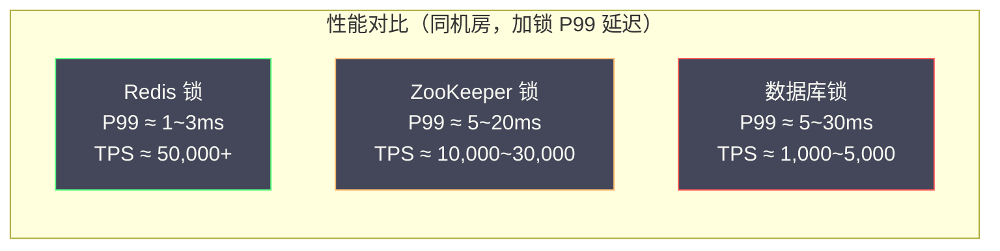

# 06 分布式锁的性能公平性与可重入设计

**摘要：**

前四篇文章分别深入讲解了 Redis、ZooKeeper 和数据库三种分布式锁的实现原理。本篇是一次系统性的横向整合：从工程设计的角度，深入分析分布式锁的三个核心特性维度——**性能**（各方案的吞吐量与延迟根因）、**公平性**（非公平锁为何是默认选择、公平锁在哪些场景不可或缺）、以及**可重入性**（可重入锁的设计动机、实现机制与潜在陷阱）。在此基础上，进一步探讨读写锁和锁超时的精细化设计，帮助读者在面对具体工程问题时能够做出更有依据的设计决策。

---

## 第 1 章 性能的根本来源：一次锁操作到底做了什么

在比较三种方案的性能之前，需要先建立一个分析框架：**一次分布式锁的加锁/解锁操作，本质上是一次分布式协调操作，其性能由三个因素决定：网络往返次数、存储操作类型（内存 vs 磁盘）、一致性协议的参与节点数。**

### 1.1 Redis 锁的性能根因

**加锁**：一条 `SET NX PX` 命令，一次网络往返（客户端 → Redis → 客户端），Redis 执行内存写操作。

**解锁**：一次 Lua 脚本执行（GET + DEL），也是一次网络往返，Redis 执行内存读 + 内存写操作。

**总延迟**：2 次网络往返 × 单程网络延迟（同机房约 0.1~0.5ms）= 约 0.2~1ms。

**吞吐量上限**：单个 Redis 实例命令处理约 10 万 TPS（内存操作极快），加上网络因素，实际分布式锁吞吐量约 **5 万 ~ 20 万 TPS**（受并发连接数和网络带宽影响）。

> [!note] Redis 单线程是性能瓶颈吗？
> Redis 命令执行是单线程的，但这不是性能瓶颈。Redis 的单次命令执行时间在微秒级（`SET` 命令约 0.5~2 微秒），一秒内可以处理数十万条命令。真正的瓶颈通常是**网络**（每次命令都需要一次网络往返）和**连接数**（连接池大小限制了并发请求数）。Redis 6.0 引入的网络 I/O 多线程进一步提升了高并发下的网络处理能力，但命令执行仍是单线程。

### 1.2 ZooKeeper 锁的性能根因

ZK 加锁涉及多步操作：

1. **创建临时顺序节点**：客户端 → Leader → 多数 Follower ACK → Leader → 客户端（3~4 次网络往返，ZAB 同步写）
2. **getChildren 获取子节点列表**：1 次网络往返（可读 Follower）
3. **注册 Watch（exists 前驱节点）**：1 次网络往返

总计约 5~6 次网络往返。同机房 ZK 集群（3 节点），单次加锁延迟约 **3~10ms**。

**吞吐量上限**：ZK 的写操作需要经过 ZAB 多数派确认，单 Leader 处理能力约 **1 万 ~ 3 万 TPS**（相比 Redis 低一个数量级）。在高并发锁竞争下，ZK 的 Leader 会成为瓶颈。

**ZK 读操作的特殊性**：ZK 的读操作（`getChildren`、`exists`）可以在任意节点（包括 Follower）执行，不需要经过 Leader，延迟更低。但要注意，Follower 的数据可能比 Leader 略有滞后（ZAB 同步有延迟），在极端情况下可能读到稍旧的子节点列表。这在分布式锁场景中通常是安全的（最终会通过 Watch 纠正），但需要了解这个特性。

### 1.3 数据库锁的性能根因

**唯一索引 INSERT**：1 次网络往返 + InnoDB 写操作（redo log 刷盘，约 1~5ms）。

**SELECT FOR UPDATE**：1 次网络往返 + InnoDB 行锁加锁（内存操作），但锁持有期间持续占用数据库连接。

**InnoDB 写操作为何比 Redis 慢**：InnoDB 的每次写操作（INSERT/UPDATE/DELETE）都需要写 redo log（预写日志），redo log 需要定期刷盘（`innodb_flush_log_at_trx_commit = 1` 时每次提交都刷盘）。磁盘顺序写的延迟约 1~5ms（HDD）或 0.1~1ms（SSD），远高于 Redis 内存写操作的微秒级延迟。

**数据库锁吞吐量上限**：约 **1000~5000 TPS**（受磁盘 I/O 和连接池大小限制）。

### 1.4 三种方案的性能对比



| 维度 | Redis 锁 | ZooKeeper 锁 | 数据库锁 |
| :--- | :--- | :--- | :--- |
| **加锁延迟（P50）** | 0.2~0.5ms | 2~5ms | 2~10ms |
| **加锁延迟（P99）** | 1~3ms | 5~20ms | 5~30ms |
| **理论 TPS 上限** | 50,000+ | 10,000~30,000 | 1,000~5,000 |
| **性能瓶颈** | 网络往返、连接数 | ZAB 同步写、Leader 单点 | 磁盘 I/O、连接池 |
| **高并发下的退化** | 轻微（Redis 单线程稳定）| 中等（Leader 压力上升）| 严重（连接池耗尽、锁等待积压）|

**结论**：对于吞吐量敏感的场景（每秒数千次以上的锁操作），Redis 是唯一可选项；对于吞吐量中等但需要强一致保证的场景，ZooKeeper 是合理选择；对于低频锁操作且已有数据库的场景，数据库锁足够。

---

## 第 2 章 公平锁与非公平锁：不是技术问题，是业务问题

### 2.1 公平与非公平的定义

**非公平锁（Non-fair Lock）**：当锁被释放时，所有等待者平等地参与竞争，锁被任意一个等待者获取，不保证获取顺序与等待时间相关。

**公平锁（Fair Lock）**：锁按照等待者的请求到达顺序依次分配，等待时间最长的请求者优先获取，保证"先来先得"，无饥饿现象。

在单机 Java 中，`ReentrantLock` 的构造函数接受一个 `fair` 参数：

```java
// 非公平锁（默认）
ReentrantLock unfairLock = new ReentrantLock();
// 公平锁
ReentrantLock fairLock = new ReentrantLock(true);
```

### 2.2 为什么非公平锁是默认选择

**Java 公平 ReentrantLock 的性能测试结论**（JDK 文档中有记录）：公平锁的吞吐量通常比非公平锁低 5~10 倍。这个性能差异来自两个原因：

**原因一：挂起/唤醒开销**。公平锁必须维护一个有序的等待队列，每次锁释放都要唤醒队列头部的线程。线程的挂起（`park`）和唤醒（`unpark`）涉及操作系统上下文切换，每次约 1~10 微秒。在高并发场景下，这个开销非常显著。

**原因二：无法利用锁的"闯入"机会**。非公平锁允许"插队"：当锁刚被释放的瞬间，如果有一个新来的线程（还未加入等待队列）尝试加锁，它可以直接获取锁，而不需要唤醒等待队列中的线程。这在高并发场景下能显著提升吞吐量，因为避免了一次线程唤醒的开销。公平锁必须等待队列中等待最久的线程被唤醒，无法利用这个"闯入"机会。

在分布式锁场景中，非公平锁还有一个额外的好处：**简单**。Redis 的 `SET NX PX` 本质上就是非公平竞争，不需要维护任何等待队列，实现极简。

### 2.3 哪些场景必须用公平锁

非公平锁虽然性能好，但在某些场景下会产生严重的**饥饿（Starvation）**问题：

**饥饿问题场景**：

```
系统中有 10 个并发请求在竞争同一把锁：
请求 A（第 1 个来的）：等待
请求 B（第 2 个来的）：等待
... 
请求 J（第 10 个来的）：等待

锁释放后，非公平竞争：
- 请求 B 运气好，抢到了锁
- 请求 A 继续等待

锁再次释放：
- 请求 C 抢到了锁
- 请求 A 继续等待

... 如此反复，请求 A 可能始终竞争失败，被"饿死"
```

在以下场景中，饥饿是不可接受的：

1. **限流控制**：通过分布式锁控制某个资源的最大并发访问数。非公平锁可能导致某些请求长期无法获取锁，违反了"公平限流"的语义
2. **任务调度**：多个 Worker 竞争执行某个任务，非公平锁可能导致某些 Worker 始终抢不到任务，负载不均衡
3. **数据库连接池管理**：多线程竞争数据库连接，非公平锁可能导致某些线程长时间等待连接，影响响应时间的 P99/P999 指标
4. **SLA 保证**：对于有 SLA（服务级别协议）要求的请求，需要保证每个请求在一定时间内获得响应，非公平锁无法提供这个保证

### 2.4 公平锁的实现方案

**Redis 公平锁**：

Redisson 提供了 `RFairLock`，通过 Redis 的 List 结构维护一个有序的等待队列：

```java
// Redisson 公平锁
RFairLock fairLock = redissonClient.getFairLock("order_fair_lock");
fairLock.lock();
try {
    // 临界区
} finally {
    fairLock.unlock();
}
```

Redisson 公平锁的内部 Redis 数据结构：

```
Redis 数据结构：
1. Hash（锁本身，与普通 Redisson 锁相同）：
   key: "order_fair_lock"
   field: "uuid:threadId" → value: 重入次数

2. List（等待队列，按入队顺序排列）：
   key: "redisson_lock_queue:{order_fair_lock}"
   elements: ["uuid1:threadId1", "uuid2:threadId2", ...]（按等待顺序）

3. ZSet（超时管理，按超时时间排序）：
   key: "redisson_lock_timeout:{order_fair_lock}"
   members: "uuid:threadId" → score: 超时时间戳
```

加锁时先加入等待队列，只有队列头部的元素才能获取锁；解锁时通知队列下一个等待者（Pub/Sub）。这确保了 FIFO 顺序，但代价是：每次加锁/解锁涉及 3~5 个 Redis 操作（而普通锁只需 1 个），性能约为普通 Redisson 锁的 1/3 ~ 1/2。

**ZooKeeper 公平锁（天然实现）**：

如第 04 篇所述，ZooKeeper 的临时顺序节点机制天然是公平锁：序号最小的节点持有锁，等待者按序号顺序依次获取——这就是严格的 FIFO 公平锁，无需任何额外实现。

这是 ZooKeeper 锁在设计上优于 Redis 锁的一个显著点：ZK 的公平性是架构层面的内置特性，不会带来额外的性能开销；而 Redis 的公平锁需要额外的数据结构（List + ZSet）来模拟等待队列，有明显的性能代价。

### 2.5 非公平锁的"公平化"实践

在大多数业务场景中，我们不需要严格的 FIFO 公平锁，但需要避免极端的饥饿情况。一种轻量级的实践是：**加锁失败后随机等待（Jitter）**，而不是固定间隔轮询。

```java
// 随机退避，降低"头部碰撞"概率
private static final Random RANDOM = new Random();

public boolean tryAcquireWithJitter(String lockKey, String lockValue, int maxWaitMs) {
    long deadline = System.currentTimeMillis() + maxWaitMs;
    while (System.currentTimeMillis() < deadline) {
        boolean acquired = redisTemplate.opsForValue()
            .setIfAbsent(lockKey, lockValue, 30, TimeUnit.SECONDS);
        if (acquired) return true;

        // 随机等待 10~150ms，避免多个等待者同时重试（惊群效应）
        try {
            Thread.sleep(10 + RANDOM.nextInt(140));
        } catch (InterruptedException e) {
            Thread.currentThread().interrupt();
            return false;
        }
    }
    return false;
}
```

随机退避（Jitter）是分布式系统中广泛使用的技巧，能有效避免"惊群"（所有等待者同时重试造成瞬时压力峰值），降低平均等待时间，一定程度上改善公平性（每个等待者有相近的概率被选中）。

---

## 第 3 章 可重入锁：设计动机、实现与陷阱

### 3.1 可重入锁是什么，为什么需要它

**可重入锁（Reentrant Lock）**，又称**递归锁**，是指同一个线程（或客户端）可以多次获取同一把锁而不会死锁。内部维护一个"持锁计数器"，每次加锁计数 +1，每次解锁计数 -1，只有计数归零时才真正释放锁。

Java 的 `synchronized` 和 `ReentrantLock` 都是可重入的，这是 Java 锁设计的基本准则之一。可重入性的必要性来自于一个常见的代码模式：**方法 A 持锁，调用了方法 B，而方法 B 也需要同一把锁**：

```java
public class InventoryService {
    
    // 方法 A：持有 synchronized 锁
    public synchronized void processOrder(String orderId) {
        Order order = getOrder(orderId);
        // ... 某些逻辑 ...
        deductInventory(order.getProductId(), order.getQuantity());  // 调用方法 B
    }
    
    // 方法 B：也需要 synchronized 锁
    public synchronized void deductInventory(String productId, int quantity) {
        // ... 扣减库存 ...
    }
}
```

如果 `synchronized` 不可重入，线程在执行 `processOrder` 时已经持有了 `this` 的 Monitor，调用 `deductInventory` 时再次尝试获取同一个 Monitor，就会死锁（等待自己释放）。Java 的 `synchronized` 之所以可重入，正是为了支持这种"递归调用"模式。

**在分布式锁场景中，可重入的需求同样存在**：

```java
@Service
public class OrderService {

    @DistributedLock(key = "order:{orderId}")  // 方法级分布式锁 AOP
    public void processOrder(String orderId) {
        validateInventory(orderId);  // 内部调用另一个需要同一把锁的方法
        // ...
    }

    @DistributedLock(key = "order:{orderId}")  // 同一把锁
    public void validateInventory(String orderId) {
        // 如果分布式锁不可重入，这里会死锁
    }
}
```

AOP 方式的分布式锁在嵌套调用时，如果底层实现不支持可重入，就会造成死锁。

### 3.2 Redis 可重入锁的实现：Hash 计数器

如第 02 篇 Redisson 部分所述，Redis 可重入锁通过 Hash 数据结构实现：

```
Hash 结构（锁 key）：
  field: "uuid:threadId"  →  value: 重入次数（整数）
  TTL: 30000ms

例：线程 thread-1（UUID = abc123）加锁 3 次后的状态：
  HSET order_lock "abc123:1" 3
  PEXPIRE order_lock 30000
```

**加锁 Lua 脚本逻辑**（简化描述）：

```
如果锁不存在：
    HSET lock_key "uuid:threadId" 1
    PEXPIRE lock_key ttl
    返回成功

如果锁存在，且 field = "uuid:threadId"（当前线程的锁）：
    HINCRBY lock_key "uuid:threadId" 1   ← 重入计数 +1
    PEXPIRE lock_key ttl                  ← 刷新过期时间
    返回成功（可重入）

如果锁存在，且 field ≠ "uuid:threadId"（其他线程的锁）：
    返回剩余 TTL                          ← 加锁失败，告知等待时间
```

**解锁 Lua 脚本逻辑**（简化描述）：

```
如果锁不存在，或 field ≠ "uuid:threadId"：
    返回错误（不是当前线程的锁）

HINCRBY lock_key "uuid:threadId" -1      ← 重入计数 -1

如果计数 > 0：
    PEXPIRE lock_key ttl                  ← 还有重入层级，续期
    返回 0（尚未完全释放）

如果计数 = 0：
    DEL lock_key                          ← 完全释放锁
    PUBLISH channel "unlock"              ← 通知等待者
    返回 1（完全释放）
```

### 3.3 可重入锁的标识符设计：UUID + ThreadId

锁的 field 格式 `uuid:threadId` 中，两个部分各有作用：

**UUID（客户端实例标识符）**：区分不同的 JVM 进程（或服务实例）。在同一台机器上运行多个服务实例时，仅靠 `threadId`（Java 的 `Thread.currentThread().getId()` 返回 long 型）无法区分不同进程中的同名线程，因为两个进程中 `threadId` 可能相同（线程 ID 在单个 JVM 内唯一，但不同 JVM 之间不保证唯一）。

**ThreadId（线程标识符）**：区分同一 JVM 内的不同线程，支持线程级别的可重入。

两者组合 `uuid:threadId` 才能唯一标识"哪台机器的哪个进程的哪个线程"。

> [!warning] 线程池场景的陷阱
> 在使用线程池的场景中，可重入锁的线程 ID 可能引发微妙的问题：
> 
> ```java
> // 危险模式：在异步任务中使用可重入锁
> public void processAsync() {
>     distributedLock.lock();  // 线程 T1 加锁，threadId = T1
>     try {
>         CompletableFuture.runAsync(() -> {
>             // 这里运行在线程 T2（线程池分配），threadId ≠ T1
>             distributedLock.lock();  // T2 尝试加锁，lock 的 field 是 T1 的，T2 加锁失败！
>         }).join();
>     } finally {
>         distributedLock.unlock();  // T1 解锁
>     }
> }
> ```
> 
> 在线程池中，加锁和解锁可能在不同线程执行，导致可重入计数混乱。解决方案：**不要跨线程传递分布式锁的持有状态**，每个线程独立管理自己的锁生命周期。

### 3.4 ZooKeeper 可重入锁：Curator 的线程本地计数

Curator 的 `InterProcessMutex` 实现可重入锁的方式更直接：在 JVM 本地维护一个 `ThreadLocal` 风格的计数器（实际是 `ConcurrentMap<Thread, LockData>`），加锁时先检查当前线程是否已持有锁，有则直接递增计数，不与 ZooKeeper 交互：

```java
// Curator 内部逻辑（简化）
private final ConcurrentMap<Thread, LockData> threadData = new ConcurrentHashMap<>();

public void acquire() throws Exception {
    Thread currentThread = Thread.currentThread();
    LockData lockData = threadData.get(currentThread);

    if (lockData != null) {
        // 当前线程已持有锁，直接递增计数（不与 ZK 交互）
        lockData.lockCount.incrementAndGet();
        return;
    }

    // 当前线程未持有锁，走完整的 ZK 加锁流程
    String lockPath = attemptLock(/* ... */);
    threadData.put(currentThread, new LockData(currentThread, lockPath, new AtomicInteger(1)));
}
```

**Curator 可重入锁的性能优势**：重入时不需要与 ZooKeeper 交互，只是内存中的计数递增，开销极低。相比之下，Redisson 的每次重入都需要执行 Lua 脚本（尽管 Lua 脚本很快），略有额外的网络开销。

### 3.5 可重入锁的边界：不能无限重入

可重入锁的计数器有上限（通常是 `Integer.MAX_VALUE`），但更重要的是：**开发者必须保证每次 `lock()` 都有对应的 `unlock()`，否则锁不会被释放**。

一个常见的错误：

```java
// 错误：异常路径没有解锁
public void processOrder(String orderId) {
    distributedLock.lock();
    // 如果这里抛出异常，unlock 不会执行，锁泄漏
    processOrderInternal(orderId);
    distributedLock.unlock();  // 只有正常路径才执行解锁
}

// 正确：使用 try-finally 保证解锁
public void processOrder(String orderId) {
    distributedLock.lock();
    try {
        processOrderInternal(orderId);
    } finally {
        distributedLock.unlock();  // 无论是否异常，都会执行
    }
}
```

在可重入场景下，如果某层 `lock()` 对应的 `unlock()` 因异常被跳过，计数器就永远无法归零，锁永远不会真正释放，其他等待者将持续阻塞（直到 TTL 超时）。

---

## 第 4 章 读写锁：并发读取的优化利器

### 4.1 读写锁的设计动机

在很多业务场景中，读操作远比写操作频繁：配置读取、商品详情查询、用户信息获取……如果对读操作也用互斥锁，则所有读操作都是串行的，显然浪费了并发读取的机会。

**读写锁（ReadWriteLock）** 的核心语义：
- **读锁（共享锁）**：多个读操作可以**同时**持有读锁（并发读）
- **写锁（排他锁）**：写操作持有写锁时，其他读操作和写操作都必须等待（独占写）
- **读写互斥**：读锁和写锁不能同时持有

```
并发模型对比：
互斥锁：读 | 读 | 读 | 写（串行，读操作也互斥）
读写锁：读 读 读 | 写 | 读 读（读操作并发，写操作独占）
```

在读多写少的场景下，读写锁可以将并发吞吐量提升数倍。

### 4.2 Redis 读写锁：Redisson RReadWriteLock

Redisson 提供了 `RReadWriteLock`，内部用两把锁（读锁和写锁）协作实现读写互斥：

```java
RReadWriteLock rwLock = redissonClient.getReadWriteLock("config_rw_lock");

// 读操作：获取读锁（允许并发）
RLock readLock = rwLock.readLock();
readLock.lock();
try {
    Config config = loadConfig();  // 并发安全的读操作
} finally {
    readLock.unlock();
}

// 写操作：获取写锁（独占）
RLock writeLock = rwLock.writeLock();
writeLock.lock();
try {
    updateConfig(newConfig);  // 独占写操作
} finally {
    writeLock.unlock();
}
```

**Redisson 读写锁的 Redis 数据结构**：

```
Hash 结构（锁 key）：
  field: "mode"         → value: "read" 或 "write"（当前锁模式）
  field: "uuid1:tid1"   → value: 1（读锁持有者 1，引用计数 1）
  field: "uuid2:tid2"   → value: 2（读锁持有者 2，可重入计数 2）
  
写锁时：
  field: "mode"         → value: "write"
  field: "uuid:tid"     → value: 1（写锁持有者）
```

加写锁时，Lua 脚本检查是否存在任何读锁持有者（Hash 中有非 `mode` 的 field）；加读锁时，检查是否存在写锁（`mode` = `write`）。

### 4.3 ZooKeeper 读写锁：Curator InterProcessReadWriteLock

Curator 的 `InterProcessReadWriteLock` 同样基于临时顺序节点，但节点名称带有读/写标记：

```
节点命名规则：
写锁节点：/locks/config_lock/__WRIT__E-0000000001
读锁节点：/locks/config_lock/__READ__-0000000002
```

**写锁加锁逻辑**：查看序号比自己小的所有节点，只要存在任何读锁节点或写锁节点，就需要等待（监听最大的比自己小的节点）。

**读锁加锁逻辑**：查看序号比自己小的所有节点，只要有写锁节点就需要等待（监听最大的比自己小的写锁节点）；如果比自己小的只有读锁节点，则直接加锁成功（并发读）。

---

## 第 5 章 锁超时策略：TTL 设置的工程艺术

### 5.1 为什么 TTL 没有标准答案

TTL（Time-To-Live）是分布式锁中最难设置的参数，原因是它需要平衡两个相互矛盾的目标：

- **TTL 足够长**：保证业务逻辑执行完毕前锁不会自动过期（避免互斥性被破坏）
- **TTL 足够短**：持锁客户端崩溃后，其他客户端等待时间尽量短（保证可用性）

由于业务逻辑的执行时间往往不固定（受数据库查询速度、外部 API 响应时间、GC 停顿等多种因素影响），不存在一个"完美的 TTL 值"。

### 5.2 TTL 的分类设置策略

**策略一：固定 TTL（不启用看门狗）**

适合于执行时间可预测且稳定的业务场景，例如：

```java
// 场景：读取本地缓存，执行时间 < 10ms，TTL 设置 1 秒绰绰有余
lock.tryLock(1, 1, TimeUnit.SECONDS);
```

TTL 设置建议：`TTL = max_expected_execution_time × 3 + max_gc_pause`

例如：期望最大执行时间 200ms，GC 停顿上限 100ms，则 TTL = 200×3 + 100 = 700ms，取整为 1 秒。

**策略二：看门狗自动续期（不指定 leaseTime）**

适合于执行时间不确定的业务场景（含外部 API 调用、复杂数据库查询等）：

```java
// 不指定 leaseTime，Redisson 启用看门狗（默认 TTL 30 秒，每 10 秒续期）
lock.lock();
try {
    externalApiCall();  // 执行时间不确定
} finally {
    lock.unlock();
}
```

看门狗的默认 TTL（`lockWatchdogTimeout`）是 30 秒，每 10 秒（TTL/3）续期一次。可以通过 Redisson 配置调整：

```java
Config config = new Config();
config.setLockWatchdogTimeout(60000);  // 将看门狗 TTL 改为 60 秒
```

**策略三：加锁等待超时 + 看门狗（推荐的生产方案）**

```java
// 最多等待 5 秒获取锁，获取后看门狗自动续期（不指定 leaseTime）
boolean acquired = lock.tryLock(5, TimeUnit.SECONDS);
if (!acquired) {
    // 5 秒内未获取到锁，系统繁忙，返回降级响应
    throw new BusinessException("系统繁忙，请稍后重试");
}
try {
    doBusinessLogic();
} finally {
    lock.unlock();
}
```

这是生产环境最常用的模式：加锁等待有明确的超时（避免请求无限期等待），持锁有看门狗保护（避免锁提前过期），两者独立控制。

### 5.3 加锁等待时间的设置

加锁等待时间（`waitTime`）是指客户端在放弃加锁之前愿意等待的最长时间，它影响的是系统的**可用性**而非**正确性**。

**设置建议**：`waitTime` 应与接口的超时预算对齐。

```java
// 接口超时预算 500ms，其中 DB 查询 200ms，加锁等待 100ms，业务逻辑 100ms，网络 100ms
boolean acquired = lock.tryLock(100, TimeUnit.MILLISECONDS);
if (!acquired) {
    // 系统繁忙，快速失败，不占用接口超时预算
    return Response.error("SYSTEM_BUSY");
}
```

如果 `waitTime` 设置过长（如 30 秒），在锁竞争激烈时，请求会长时间阻塞，导致接口响应时间飙升，连接池耗尽，引发雪崩效应。

> [!warning] 生产中最常见的超时设置错误
> ```java
> // 错误 1：waitTime 过长，导致接口雪崩
> lock.tryLock(30, 30, TimeUnit.SECONDS);  // 等待 30 秒？接口早超时了
>
> // 错误 2：指定了 leaseTime 但太短，业务没跑完锁就过期
> lock.tryLock(1, 2, TimeUnit.SECONDS);  // leaseTime=2s，但 DB 查询可能 3s
>
> // 错误 3：用 lock() 但没有看门狗保护（指定了 leaseTime）
> lock.lock(5, TimeUnit.SECONDS);  // 5s 后锁自动释放，无论业务是否执行完
> // → 应该用 lock.lock()（不指定 leaseTime）来启用看门狗
> ```

---

## 参考资料

1. Doug Lea. (1999). *Concurrent Programming in Java*. Addison-Wesley. Chapter 2: Threads and Locks.
2. Redisson 官方文档：Fair Lock. https://redisson.org/docs/data-and-services/locks-and-synchronizers/#fair-lock
3. Redisson 官方文档：ReadWriteLock. https://redisson.org/docs/data-and-services/locks-and-synchronizers/#readwritelock
4. Apache Curator 官方文档：Shared Reentrant Read Write Lock. https://curator.apache.org/docs/recipes-shared-reentrant-read-write-lock
5. Herlihy, M., & Shavit, N. (2008). *The Art of Multiprocessor Programming*. Morgan Kaufmann. Chapter 7.
6. Kleppmann, M. (2017). *Designing Data-Intensive Applications*. O'Reilly Media. Chapter 8: The Trouble with Distributed Systems.
7. Java Platform SE 8：ReentrantLock 文档. https://docs.oracle.com/javase/8/docs/api/java/util/concurrent/locks/ReentrantLock.html

---

> [!note] 思考题
> 1. 分布式锁的超时设置——锁的 TTL 应该大于业务的最大执行时间。但你如何估算'最大执行时间'？如果业务逻辑中包含外部调用（如 HTTP 请求、数据库查询），最大执行时间可能不可预测。Watchdog 续期机制是否是'不确定执行时间'场景下的最佳方案？
> 2. 锁竞争激烈时的优化——如果 100 个客户端同时竞争一把锁，99 个需要等待。你可以通过'分段锁'（将一把锁拆分为多把）提高并发。例如库存扣减——将 1000 个库存分为 10 段，每段 100 个——10 把锁同时处理。分段锁在什么场景下适用？如何处理'某段库存不足但总库存充足'的情况？
> 3. 分布式锁的监控和告警——锁持有时间过长（如超过预期 5 倍）可能表示业务逻辑异常或死锁。锁获取等待时间过长表示竞争激烈。你如何监控这些指标？在发现异常时是自动释放锁还是通知人工处理？
