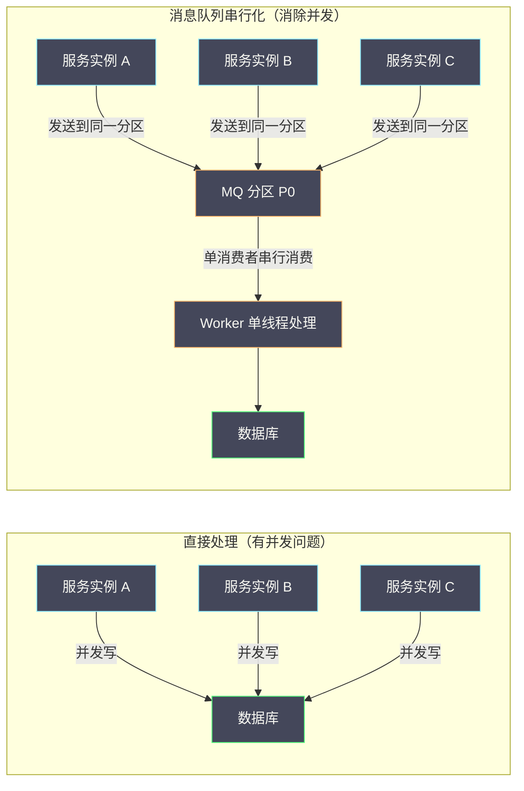
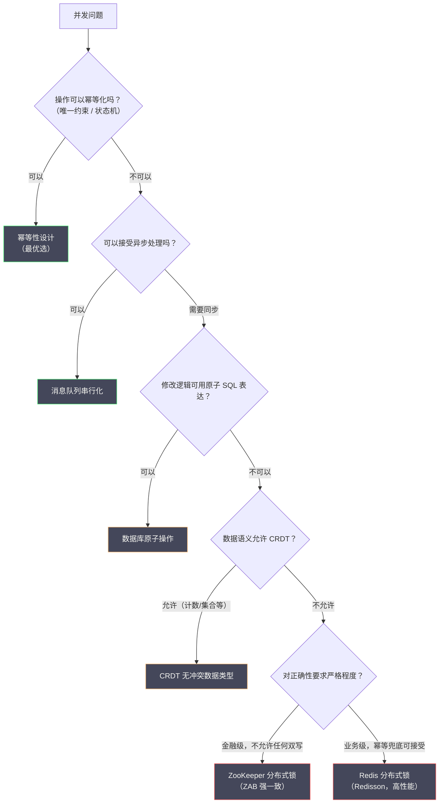

# 08 分布式锁的边界与替代方案

**摘要：**

历经七篇文章的深度剖析，我们已经全面掌握了分布式锁的原理与工程实践。本篇是专栏的收官之作，也是最需要"第一性原理"思考的一篇：**分布式锁并非解决并发问题的万能药**，它有明确的适用边界，越过这条边界使用锁不仅无效，甚至会带来新的问题。本文首先厘清分布式锁能解决和不能解决的问题，随后深入分析四类主流的替代方案——数据库原子操作、幂等性设计、消息队列串行化、以及 [[CRDT]] 无冲突数据类型——从原理到工程实践，帮助读者在面对并发问题时，能够选择"最合适的工具"，而不是"锁是唯一的锤子"。

---

## 第 1 章 分布式锁能解决什么，不能解决什么

### 1.1 重新审视分布式锁的本质

在深入讨论替代方案之前，需要先明确一个核心命题：**分布式锁的本质是"将并发操作串行化"**。它通过让多个并发请求排队执行来避免竞争条件，代价是牺牲了并发度（吞吐量下降）和可用性（锁服务故障时业务中断）。

这意味着，**每次使用分布式锁都是在做一个权衡：以并发度换取安全性**。在这个权衡值得的场景下，锁是正确的工具；在这个权衡不值得的场景下（串行化代价过大，或者根本不需要串行化），应该寻找更合适的替代方案。

### 1.2 分布式锁能解决的问题

**场景一：防止同一逻辑执行多次（幂等保护）**

定时任务、消息消费、事件处理等场景，需要保证同一任务在同一时刻只被一个节点执行：

```
多节点部署的定时任务：凌晨 2 点触发全量数据同步
→ 所有节点都会收到触发信号
→ 用分布式锁保证只有一个节点真正执行同步
```

**场景二：保护临界资源的原子读改写**

当业务逻辑必须是"先读，再根据读取结果修改"，且这两步之间不能有其他操作插入时：

```
库存扣减的正确流程：
1. 读取当前库存 stock = 10
2. 判断 stock > quantity（10 > 1，可以扣减）
3. 写入新库存 stock = 9

问题：步骤 1 和步骤 3 之间，其他请求可能已经修改了 stock
→ 用分布式锁保护整个"读-判断-写"的原子性
```

**场景三：控制并发度（限流）**

通过信号量（Semaphore）类型的分布式锁，控制某个操作的最大并发数：

```
对外部 API 的调用限制：最多同时 10 个并发请求
→ 使用 Redisson InterProcessSemaphoreV2（或 Redis Semaphore）限制并发
```

### 1.3 分布式锁不能解决的问题

**问题一：分布式锁无法解决"锁范围外"的并发问题**

分布式锁只保护持锁期间的操作。如果临界区外有并发操作与临界区内的操作存在数据依赖，锁无法解决：

```
错误地以为锁能解决的场景：
步骤 1（锁外）：查询用户余额 = 1000
步骤 2（锁外）：判断余额 >= 消费金额 500
步骤 3（加锁）：扣减余额：UPDATE balance SET amount = amount - 500 WHERE user_id = 'U001'

问题：步骤 1 和步骤 2 在锁外执行，两个请求可能都通过了余额检查，都进入步骤 3
→ 锁只防止了步骤 3 的并发执行，但无法防止基于"过时余额判断"的错误决策
```

正确做法：将步骤 1-3 全部放在锁的保护范围内（或使用数据库原子操作替代）。

**问题二：分布式锁无法弥补"不支持原子操作的存储系统"**

如果锁保护的临界区操作本身不是原子的（例如：更新了 A 系统后、还没更新 B 系统时崩溃），锁结束后系统可能处于不一致状态，而锁对此无能为力。

```
场景：转账操作
1. 加锁
2. 扣减 A 账户：-500
3. [此处崩溃]
4. 增加 B 账户：+500（永远不会执行）
5. 解锁

→ A 账户已扣减，B 账户未增加，钱"消失"了
→ 分布式锁无法防止这种情况，需要分布式事务
```

**问题三：分布式锁不能代替业务层的数据一致性约束**

如第 07 篇故障案例所述，Redis 锁可能因主从切换而短暂失效。在极端情况下，锁保护可能失效，此时业务数据的正确性只能依靠存储层面的约束（唯一索引、乐观锁）来保障。**分布式锁是"上层防护"，不是"最后防线"**。

---

## 第 2 章 替代方案一：数据库原子操作

### 2.1 为什么数据库原子操作往往比分布式锁更简单可靠

很多使用分布式锁的场景，其根本需求是"原子地修改数据库中的某个值"，而 SQL 本身就能表达这种原子性，无需额外的分布式锁：

```sql
-- 场景：库存扣减，防止超卖
-- 错误方案（需要分布式锁）：
-- 1. SELECT stock WHERE product_id = 'P001'
-- 2. 判断 stock >= quantity
-- 3. UPDATE stock = stock - quantity WHERE product_id = 'P001'

-- 正确方案（数据库原子操作，无需分布式锁）：
UPDATE inventory
SET stock = stock - 1
WHERE product_id = 'P001' AND stock >= 1;

-- 检查影响行数：
-- rows_affected = 1：扣减成功
-- rows_affected = 0：库存不足，无需分布式锁来防止超卖
```

这条 SQL 在数据库层面是原子的：`stock >= 1` 的检查和 `stock - 1` 的更新在同一个原子操作中完成，任何并发的请求要么看到修改前的值（检查失败），要么看到修改后的值，不存在"读到 1，写入 0，另一个也读到 1"的竞争窗口。

### 2.2 数据库原子操作的适用范围

**适用**：修改同一数据库实例中的数据，且修改逻辑可以用单条 SQL 表达。

**不适用**：
- 跨多个数据库实例的操作（分库场景）
- 需要"先读取、在应用层计算、再写入"的复杂逻辑
- 临界区操作不仅包含数据库写入，还包含其他操作（发消息、调 API 等）

### 2.3 SELECT ... FOR UPDATE 与乐观锁的取舍

在复杂的"读-计算-写"场景下（无法用单条 SQL 完成），可以选择：

**悲观锁（SELECT FOR UPDATE）**：读取时立即加数据库行锁，阻止并发修改。适合写冲突概率高、需要及时感知冲突的场景。但代价是：持锁期间占用数据库连接，不适合长时间的操作。

**乐观锁（版本号 CAS）**：读取时不加锁，提交时用版本号检查是否有并发修改。适合读多写少、冲突概率低的场景。高冲突时大量重试会降低性能。

两者的本质差异在第 05 篇已详细分析，这里不再赘述。关键决策点：**如果业务操作（含锁保护）耗时短（< 100ms），且冲突概率高（如秒杀），用悲观锁；如果操作耗时可能较长，或冲突概率低（如普通配置修改），用乐观锁。**

---

## 第 3 章 替代方案二：幂等性设计——从根本上消除"锁的需求"

### 3.1 幂等性是什么，为什么它比锁更根本

**幂等性（Idempotency）**：一个操作执行一次和执行多次的效果相同。

```
幂等操作示例：
- HTTP GET 请求（读操作，不改变状态）
- DELETE 已经不存在的资源（第一次删除成功，第二次也"成功"，结果相同）
- SET 操作（无论执行多少次，最终状态相同）

非幂等操作示例：
- 银行转账 POST（每次执行都会转一次钱）
- 库存扣减（每次执行都会减一次库存）
- 发送邮件（每次执行都会发一封邮件）
```

**为什么幂等性比锁更根本？**

分布式锁解决并发问题的方式是：**防止操作被并发执行**（串行化）。
幂等性解决并发问题的方式是：**让操作被多次执行也没有副作用**（容忍重复）。

幂等性更根本，因为它不依赖任何外部协调机制（Redis/ZooKeeper），不存在锁服务故障的风险，也没有锁竞争的性能损耗。如果一个操作是幂等的，就完全不需要锁。

### 3.2 实现幂等性的核心技术：唯一约束 + 幂等 Token

**技术一：数据库唯一约束（最简单可靠的幂等手段）**

```sql
-- 订单表增加幂等 key
CREATE TABLE orders (
    id           BIGINT NOT NULL AUTO_INCREMENT,
    idempotent_key VARCHAR(64) NOT NULL COMMENT '幂等 key（业务方生成，如 requestId）',
    user_id      BIGINT NOT NULL,
    product_id   VARCHAR(64) NOT NULL,
    amount       DECIMAL(10,2) NOT NULL,
    status       VARCHAR(32) NOT NULL DEFAULT 'PENDING',
    PRIMARY KEY (id),
    UNIQUE KEY uk_idempotent_key (idempotent_key)  -- 唯一约束
);
```

客户端在发起请求时生成一个全局唯一的 `idempotent_key`（通常是 UUID），服务端将其写入数据库。如果因网络重试导致重复请求，第二次插入会因唯一约束失败，直接查询第一次的结果返回给客户端——整个操作幂等，无需分布式锁。

```java
@Transactional
public OrderResult createOrder(CreateOrderRequest request) {
    // idempotent_key 由客户端在请求头中提供（通常是 UUID）
    String idempotentKey = request.getIdempotentKey();

    try {
        // 尝试插入订单（如果 idempotent_key 已存在，抛出唯一约束异常）
        Order order = buildOrder(request, idempotentKey);
        orderMapper.insert(order);
        // 执行后续业务逻辑（库存扣减、积分增加等）
        inventoryService.deduct(order);
        return OrderResult.success(order);

    } catch (DuplicateKeyException e) {
        // idempotent_key 已存在，说明是重复请求，查询已有结果返回
        Order existingOrder = orderMapper.selectByIdempotentKey(idempotentKey);
        return OrderResult.success(existingOrder);
    }
}
```

**这个方案的优雅之处**：完全不需要分布式锁。数据库的唯一约束本身就是一个"天然的分布式锁"——任何数量的并发请求，只有一个能成功插入，其余全部失败（在 `DuplicateKeyException` 中走查询已有结果的路径）。

**技术二：状态机幂等**

通过状态机约束操作的执行条件，使操作天然幂等：

```sql
-- 只有状态为 PENDING 的订单才能被支付，且支付成功后状态变为 PAID
UPDATE orders
SET status = 'PAID', paid_at = NOW()
WHERE order_id = 'O001'
  AND status = 'PENDING';  -- 状态机约束：只有 PENDING 的订单可以支付
-- rows_affected = 1：支付成功
-- rows_affected = 0：订单不是 PENDING 状态（已支付或已取消），幂等地"无操作"
```

无论这条 SQL 被执行多少次，结果都是相同的——第一次执行将订单从 PENDING 变为 PAID，后续所有执行都因 `status != 'PENDING'` 而影响 0 行，是幂等的。

### 3.3 幂等性的适用范围与限制

**适用**：
- 单次业务操作（创建资源、修改状态）
- 可以为每次操作分配唯一 ID 的场景
- 数据库是唯一存储的场景（无跨系统操作）

**不适用**：
- 累积型操作（"每次调用增加积分 10 分"——无法简单幂等化，需要 [[exactly-once 语义]]）
- 跨系统的原子操作（需要分布式事务）
- 操作的幂等性依赖外部系统的状态（如第三方支付回调）

---

## 第 4 章 替代方案三：消息队列串行化

### 4.1 核心思想：用单分区消费者天然串行化

当并发问题的根源是"多个节点同时处理同一资源的请求"时，可以通过**将请求发送到消息队列的同一分区（Partition），由单个消费者串行处理**来消除并发：



**关键设计：按竞争维度路由到同一分区**

并发问题的本质是"同一个竞争维度"（如同一用户、同一商品）的请求同时执行。将相同竞争维度的请求路由到同一 MQ 分区，就能保证这些请求被同一个消费者线程串行处理，天然消除竞争。

```java
// Kafka 生产者：按 userId 分区路由，确保同一用户的所有请求在同一分区
producer.send(new ProducerRecord<>(
    "order-events",      // topic
    userId,              // key（按 key 路由到固定分区）
    orderEventJson       // value
));

// Kafka 消费者：单线程消费，串行处理
@KafkaListener(topics = "order-events", groupId = "order-processor",
               concurrency = "1")  // 单线程消费，不并发
public void processOrderEvent(OrderEvent event) {
    // 这里的处理是串行的，同一个 userId 的事件按顺序到达
    orderService.process(event);
}
```

### 4.2 消息队列串行化的优势

**优势一：天然的背压（Backpressure）**

当处理速度跟不上生产速度时，消息在队列中积压，请求方感知到延迟而自动降速。相比之下，分布式锁下大量请求堆积在锁等待队列中，可能导致线程/连接资源耗尽。

**优势二：操作可重放（Replayability）**

MQ 中的消息可以被重放。如果消费者处理失败，可以从 offset 重新消费，实现故障恢复。分布式锁的保护范围只在"锁内"，没有持久化的操作日志。

**优势三：削峰填谷**

生产端可以以任意速率发送请求，消费端以固定速率处理，MQ 起到缓冲作用，避免了高峰时的资源耗尽。

### 4.3 消息队列串行化的代价

**代价一：延迟增加**

请求不再被同步处理，而是异步放入队列，增加了处理延迟（通常从毫秒级增加到秒级甚至分钟级）。对于需要实时响应的场景（用户等待下单结果），这种延迟可能不可接受。

**代价二：架构复杂度增加**

引入 MQ 意味着需要处理：消息持久化、消费者失败重试、消息顺序保证、消费幂等（防止重复消费）等一系列新问题。在原来用一把锁就能解决的场景，换成 MQ 可能需要多倍的代码量。

**代价三：最终一致性而非强一致性**

生产者发送消息后，消费者异步处理，两者之间存在时间差。在这段时间内，系统处于"中间状态"。对于需要强一致性的场景（如金融转账），纯 MQ 方案需要额外的状态机和补偿逻辑来保证最终一致性。

### 4.4 适用场景判断

MQ 串行化适合以下场景：

1. **操作可以异步化**：用户发起操作后，可以接受"稍后通知处理结果"（如异步下单、异步支付）
2. **处理速率需要控制**：如对第三方 API 的调用频率限制，通过 MQ 的消费速率来控制
3. **需要操作可重放**：如事件溯源（Event Sourcing）架构，所有操作都以事件形式持久化
4. **流量削峰**：大促活动中，将秒杀请求放入 MQ，后端稳定地处理，避免数据库被瞬时压垮

---

## 第 5 章 替代方案四：CRDT 无冲突数据类型

### 5.1 CRDT 是什么

**CRDT（Conflict-free Replicated Data Type，无冲突复制数据类型）** 是一类特殊设计的数据结构，它们允许多个节点并发地修改数据的副本，而无需协调（无需分布式锁），最终所有副本通过合并（Merge）操作自动收敛到相同的状态。

CRDT 的核心思想是：**通过精心设计数据结构和合并规则，让并发修改本质上不冲突**——不是"防止并发修改"（锁的思路），而是"让并发修改可以被正确合并"。

**一个最简单的 CRDT 例子：G-Counter（仅增计数器）**

假设三个节点各自维护一个计数器，并发地对计数器执行 `increment` 操作：

```
节点 A：本地计数 = 3（A 执行了 3 次 increment）
节点 B：本地计数 = 2（B 执行了 2 次 increment）
节点 C：本地计数 = 5（C 执行了 5 次 increment）

合并规则：全局计数 = 所有节点本地计数之和 = 3 + 2 + 5 = 10
```

每个节点只能增加自己的本地计数，合并时取各节点的最大值（因为本地计数单调递增，取最大值等于取最新值）。这样，无论多少节点并发地执行 `increment`，最终合并结果都是正确的——无需任何协调，无需任何锁。

### 5.2 常见 CRDT 类型及其在分布式系统中的应用

**G-Counter（仅增计数器）**：如上所述，每个节点维护自己的计数，合并时求和。
- 应用场景：页面访问量统计、点赞计数（允许最终一致）

**PN-Counter（可增可减计数器）**：维护两个 G-Counter（P 计数器用于增，N 计数器用于减），最终值 = P - N。
- 应用场景：库存计数（最终一致性），注意：PN-Counter 无法防止库存变负（需要业务层约束）

**LWW-Register（最后写入者胜寄存器，Last-Write-Wins）**：每个写入带有时间戳，合并时取时间戳最大的值。
- 应用场景：用户 Profile 更新（最后一次修改生效，允许覆盖）

**OR-Set（可添加可删除集合，Observed-Remove Set）**：支持并发添加和删除元素，使用 Tag 标识每次添加，删除时只删除已观察到的 Tag。
- 应用场景：购物车（允许并发添加/删除商品，最终合并）

**MV-Register（多版本寄存器）**：保留所有并发写入的版本，由应用层解决冲突（如询问用户选择哪个版本）。
- 应用场景：Dropbox、Google Docs 的冲突处理

### 5.3 CRDT 的局限性

CRDT 并非万能——它只适用于数据语义上"允许并发修改、且可以被合并"的场景：

**无法解决"需要协调"的操作**：

某些操作本质上需要全局协调，无法用 CRDT 表达。例如：

- **唯一 ID 分配**：两个节点并发地想分配"最小可用 ID"，不能各自计算，必须协调
- **转账操作**：转账需要"A 账户减少 + B 账户增加"的原子性，CRDT 无法保证跨账户的一致性
- **库存精确控制**：PN-Counter 可以统计库存，但无法保证库存不变负（两个节点可能各自认为还有库存，各自扣减，导致总库存变负）

**实现复杂度高**：

正确实现 CRDT 需要深入理解分布式系统理论，错误的实现会导致数据不一致。生产环境通常依赖经过验证的 CRDT 库（如 [[Riak]] 的 CRDT 支持、[[Redis]] 的部分数据结构具有 CRDT 特性）。

---

## 第 6 章 如何选择：分布式锁 vs 替代方案的决策框架

### 6.1 先问问题，再选工具

在选择技术方案之前，应该先回答以下问题：

**问题 1：操作能否被设计为幂等的？**

如果可以（通过唯一约束 + 幂等 Token），优先考虑幂等性方案——这是最简单、最可靠的解决方案，完全不依赖外部协调。

**问题 2：是否可以接受异步处理？**

如果业务允许异步（用户不需要实时等待结果），消息队列串行化通常比分布式锁更优雅——避免了锁竞争、提供了天然削峰、且操作可重放。

**问题 3：数据修改逻辑是否可以用原子 SQL 表达？**

如果可以（简单的"条件更新"操作），直接用数据库原子操作，不需要任何外部锁——SQL 本身就是原子的，数据库是所有服务共享的协调者。

**问题 4：数据的语义是否允许并发修改后合并？**

如果可以（计数器、集合、最后写胜等场景），考虑 CRDT 方案——完全去中心化，无需协调，最高并发度。

**问题 5：以上方案均不适用？**

只有在以上所有方案都无法满足需求时，才真正需要分布式锁。

### 6.2 决策树



### 6.3 综合对比

| 方案 | 并发度 | 实现复杂度 | 依赖组件 | 正确性保证 | 适用场景 |
| :--- | :--- | :--- | :--- | :--- | :--- |
| **幂等性设计** | 最高（无竞争）| 低 | 仅数据库 | 强（DB 唯一约束）| 创建类操作、状态机流转 |
| **数据库原子操作** | 高 | 低 | 仅数据库 | 强（单 DB 原子）| 简单的条件更新操作 |
| **MQ 串行化** | 中（单消费者）| 中 | 消息队列 | 最终一致 | 异步处理、削峰填谷 |
| **CRDT** | 最高（无协调）| 高 | 取决于实现 | 强（CRDT 语义内）| 计数、集合、最终一致场景 |
| **Redis 分布式锁** | 中 | 低（Redisson）| Redis | 中（主从切换有窗口）| 高并发、业务级正确性 |
| **ZooKeeper 分布式锁** | 低 | 中（Curator）| ZooKeeper | 强（ZAB 一致）| 低并发、金融级正确性 |

---

## 第 7 章 专栏总结：分布式锁的认知地图

### 7.1 核心知识体系回顾

历经八篇文章，我们构建了一个完整的分布式锁知识体系：

**理论基础（第 01 篇）**：
- 分布式锁的三大正确性要求：互斥性、无死锁、容错性
- 单机锁无法在分布式场景工作的根本原因：共享内存假设失效
- GC 停顿和时钟漂移是分布式锁的深层挑战

**Redis 锁的工程演进（第 02 篇）**：
- `SETNX + EXPIRE` → `SET NX PX`（原子化加锁）
- Lua 脚本解锁（原子化"校验 + 删除"）
- 看门狗自动续期（解决 TTL 与业务时间的矛盾）
- Redisson 可重入锁（Hash 结构 + 重入计数）

**Redlock 争议（第 03 篇）**：
- Redlock 解决了主从切换的数据丢失问题
- Kleppmann：时钟跳变和 GC 停顿让 Redlock 不安全
- Antirez：在合理运维条件下 Redlock 足够安全
- 实践建议：大多数场景用单节点 Redis + 幂等兜底

**ZooKeeper 锁（第 04 篇）**：
- ZAB 协议保证写操作强一致，主从切换无数据丢失
- 临时顺序节点 + Watch 前驱节点：天然公平锁 + 无羊群效应
- Session 超时机制：比 Redis TTL 更鲁棒的无死锁保证
- Apache Curator：生产级 ZK 锁封装

**数据库锁（第 05 篇）**：
- 唯一索引：简单但需应用层定时清理
- SELECT FOR UPDATE：与事务绑定，必须走索引
- 乐观锁：低冲突场景高性能，高冲突时重试风暴
- MySQL 命名锁：被低估的内置方案

**设计维度（第 06 篇）**：
- 性能：Redis > ZK > DB（根本原因：内存 vs 网络同步 vs 磁盘 I/O）
- 公平性：ZK 天然公平，Redis 需额外实现（有性能代价）
- 可重入：Hash 计数（Redis）vs 本地计数（ZK/Curator）

**生产实践（第 07 篇）**：
- 锁粒度：以竞争维度为粒度，层次化 key 命名
- 加锁失败：快速失败 + 熔断降级
- 监控：等待时间 P99、持有时间 P99、加锁成功率
- 典型故障：Redis 主从切换超卖、GC 停顿锁过期、锁泄漏、ZK 羊群效应

**边界与替代（本篇）**：
- 幂等性设计：最优先考虑的替代方案
- 数据库原子操作：简单场景的最简方案
- MQ 串行化：异步场景的优雅解法
- CRDT：特定数据语义下的去中心化方案

### 7.2 一个工程师的心智模型

在真实的工程环境中，面对每一个"需要分布式锁"的需求，应该用以下心智模型来思考：

```
第一步：这真的需要"锁"吗？
  → 能用幂等性解决吗？（最优先）
  → 能用数据库原子操作解决吗？
  → 能异步化，用 MQ 串行化吗？
  → 如果以上都不行，才考虑分布式锁

第二步：如果确实需要锁，选哪种？
  → 高并发 + 业务级正确性 + 已有 Redis → Redisson Redis 锁
  → 低并发 + 强一致要求 + 金融场景 → Curator ZooKeeper 锁
  → 低频操作 + 无额外组件 → 数据库锁（唯一索引或 SELECT FOR UPDATE）

第三步：加上幂等性保护作为最后防线
  → 无论用哪种锁，数据库层面都应该有约束（唯一索引或乐观锁）
  → 锁是"上层防护"，不是"唯一保障"

第四步：监控 + 告警 + 定期审查
  → 锁的等待时间和持有时间是重要的性能指标
  → 定期审查锁的必要性：系统演进后，某些锁可能已经不再需要
```

> [!note] 最后的设计哲学
> 分布式锁是分布式系统中的一个协调原语，它把分布式系统"无共享内存"的世界变成了"有共享状态"的世界。这个转变是有代价的——性能损耗、可用性降低、实现复杂度上升。
>
> 最好的分布式锁，是你**不需要使用的那把锁**。当业务设计足够合理（幂等性、原子操作），系统架构足够清晰（职责单一、避免跨服务共享状态），很多"需要锁"的场景会自然消失。
>
> 当锁真的不可避免时，选择你完全理解的、最简单的方案，并为它的失效场景做好兜底准备。

---

## 参考资料

1. Helland, P. (2007). Life beyond Distributed Transactions: an Apostate's Opinion. *CIDR 2007*. https://www.ics.uci.edu/~cs223/papers/cidr07p15.pdf
2. Shapiro, M., Preguiça, N., Baquero, C., & Zawirski, M. (2011). Conflict-Free Replicated Data Types. *SSS 2011*.
3. Bailis, P., & Ghodsi, A. (2013). Eventual Consistency Today: Limitations, Extensions, and Beyond. *ACM Queue, 11*(3).
4. Kleppmann, M. (2017). *Designing Data-Intensive Applications*. O'Reilly Media. Chapter 12: The Future of Data Systems.
5. Vogels, W. (2009). Eventually Consistent. *Communications of the ACM, 52*(1), 40–44.
6. Richardson, C. (2018). *Microservices Patterns*. Manning Publications. Chapter 4: Managing transactions with sagas.
7. Vernon, V. (2013). *Implementing Domain-Driven Design*. Addison-Wesley. Chapter 7: Event-Driven Architecture.
8. Riak 官方文档：Data Types. https://docs.riak.com/riak/kv/latest/developing/data-types/
