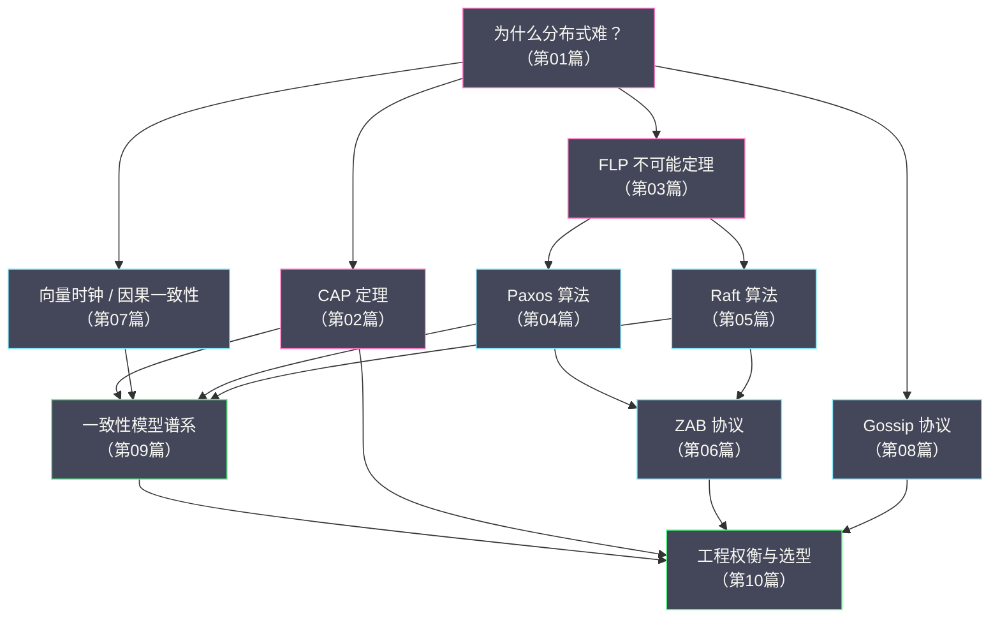

# 分布式系统原理与协议 专栏导览

## 专栏定位

本专栏聚焦分布式系统的**核心理论基础与协议本身**，回答一个工程师在深入分布式领域时必然会遇到的追问链：

> 为什么分布式系统这么难？→ 有哪些理论约束证明了这种难度是本质性的？→ 各种协议（Paxos/Raft/ZAB/Gossip）是如何在这些约束下求解的？→ 工程实践中如何在理论理想与现实代价之间权衡？

这不是一个"如何使用 ZooKeeper"或"Kafka 怎么部署"的运维手册——而是深入协议设计者的视角，理解每一个设计决策背后的"为什么"。

## 专栏目录

| 序号 | 文章标题 | 核心主题 |
| :--- | :--- | :--- |
| 01 | [[01 分布式系统的本质难题]] | 局部视角、时钟不一致、网络不可靠；为何单机思维在分布式世界失效 |
| 02 | [[02 CAP 定理深度解析]] | CAP 精确含义；P 为何不可选；CP vs AP 的真实权衡；PACELC 扩展 |
| 03 | [[03 FLP 不可能定理与共识问题]] | 共识的形式化定义；FLP 定理的证明思路；Paxos/Raft 如何"绕过"它 |
| 04 | [[04 Paxos 算法原理深度解析]] | Basic Paxos 两阶段推导；Multi-Paxos 优化；正确性证明思路 |
| 05 | [[05 Raft 共识算法深度解析]] | 可理解性设计哲学；领导者选举；日志复制；安全性证明 |
| 06 | [[06 ZAB 协议：ZooKeeper 的一致性基石]] | ZAB vs Raft；崩溃恢复与消息广播；ZXID 设计；Leader 切换一致性 |
| 07 | [[07 向量时钟与因果一致性]] | 逻辑时钟到向量时钟；因果一致性定义；版本向量的工程应用 |
| 08 | [[08 Gossip 协议：去中心化信息传播]] | 三种 Gossip 模式；收敛速度分析；Cassandra/Redis Cluster 中的应用 |
| 09 | [[09 分布式系统的一致性模型谱系]] | 线性一致性/顺序一致性/因果一致性/最终一致性的严格定义与工程含义 |
| 10 | [[10 分布式系统设计的工程权衡]] | 从理论到工程的落地哲学；幂等、重试、背压、降级；选型决策树 |

## 知识图谱

## 推荐阅读路径

**路径一：理论优先（推荐有一定分布式经验的读者）**

`01 → 03（FLP）→ 04（Paxos）→ 05（Raft）→ 02（CAP）→ 09（一致性模型）→ 10`

**路径二：实践优先（推荐工程背景读者）**

`01 → 02（CAP）→ 05（Raft，最易读）→ 06（ZAB/ZooKeeper）→ 08（Gossip）→ 09 → 10`

**路径三：速览（只想了解核心结论）**

`02（CAP）→ 09（一致性模型）→ 10（工程权衡）`

## 核心概念速查

| 概念 | 一句话定义 | 详见 |
| :--- | :--- | :--- |
| **CAP 定理** | 分布式系统在网络分区时无法同时满足一致性和可用性 | 第 02 篇 |
| **FLP 不可能定理** | 异步网络中，哪怕只有一个节点可能崩溃，确定性共识算法不存在 | 第 03 篇 |
| **共识（Consensus）** | 多个节点对某个值达成一致且不可撤销的过程 | 第 03 篇 |
| **Paxos** | 基于多数派投票的两阶段共识协议，奠定了现代共识算法的理论基础 | 第 04 篇 |
| **Raft** | 以可理解性为设计目标的共识协议，将共识问题分解为领导者选举和日志复制 | 第 05 篇 |
| **ZAB** | ZooKeeper 原子广播协议，支持崩溃恢复的主备模式原子广播 | 第 06 篇 |
| **向量时钟** | 一种偏序关系追踪机制，用于捕获事件之间的因果依赖 | 第 07 篇 |
| **Gossip** | 基于流行病传播模型的去中心化信息扩散协议 | 第 08 篇 |
| **线性一致性** | 最强的一致性模型，要求所有操作看起来是瞬间完成的且有一个全局顺序 | 第 09 篇 |
| **最终一致性** | 最弱的活性承诺，保证在没有新更新的情况下，所有副本最终收敛 | 第 09 篇 |

---

## 关联专栏

- [[分布式架构/分布式锁/00 专栏导览|分布式锁]]：分布式锁依赖共识协议保证互斥性
- [[分布式架构/分布式事务/00 专栏导览|分布式事务]]：2PC/3PC/TCC/Saga 等分布式事务方案的理论基础
- [[中间件/ETCD/00 专栏导览|etcd]]：Raft 协议的工程实现
- [[中间件/Zookeeper/00 专栏导览|ZooKeeper]]：ZAB 协议的工程实现
- [[中间件/Redis/Redis设计与实现/00 专栏导览|Redis Cluster]]：Gossip 协议在 Redis 中的应用
- [[中间件/Ceph/00 专栏导览|Ceph]]：Paxos 在 Ceph Monitor 中的应用
