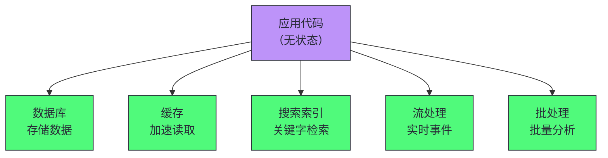
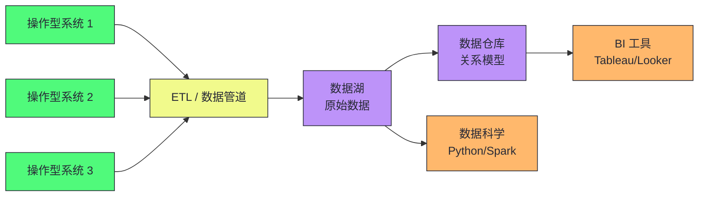
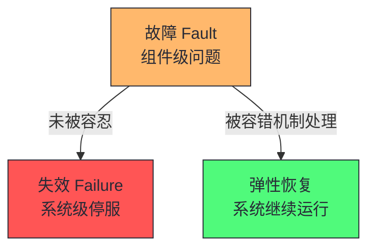
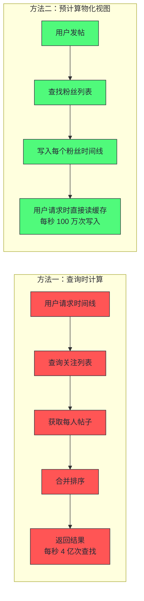
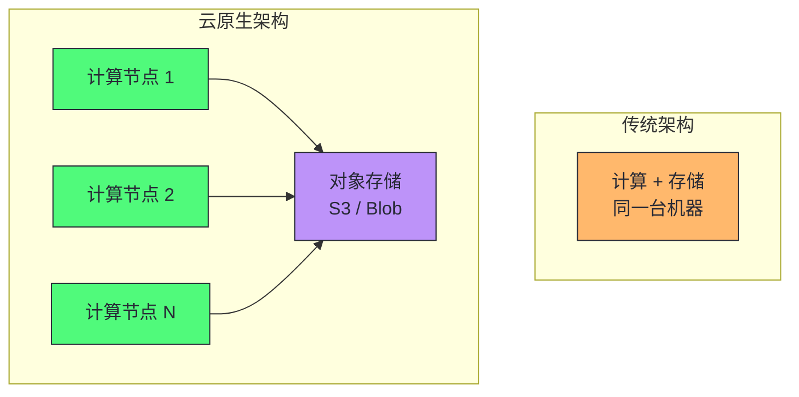
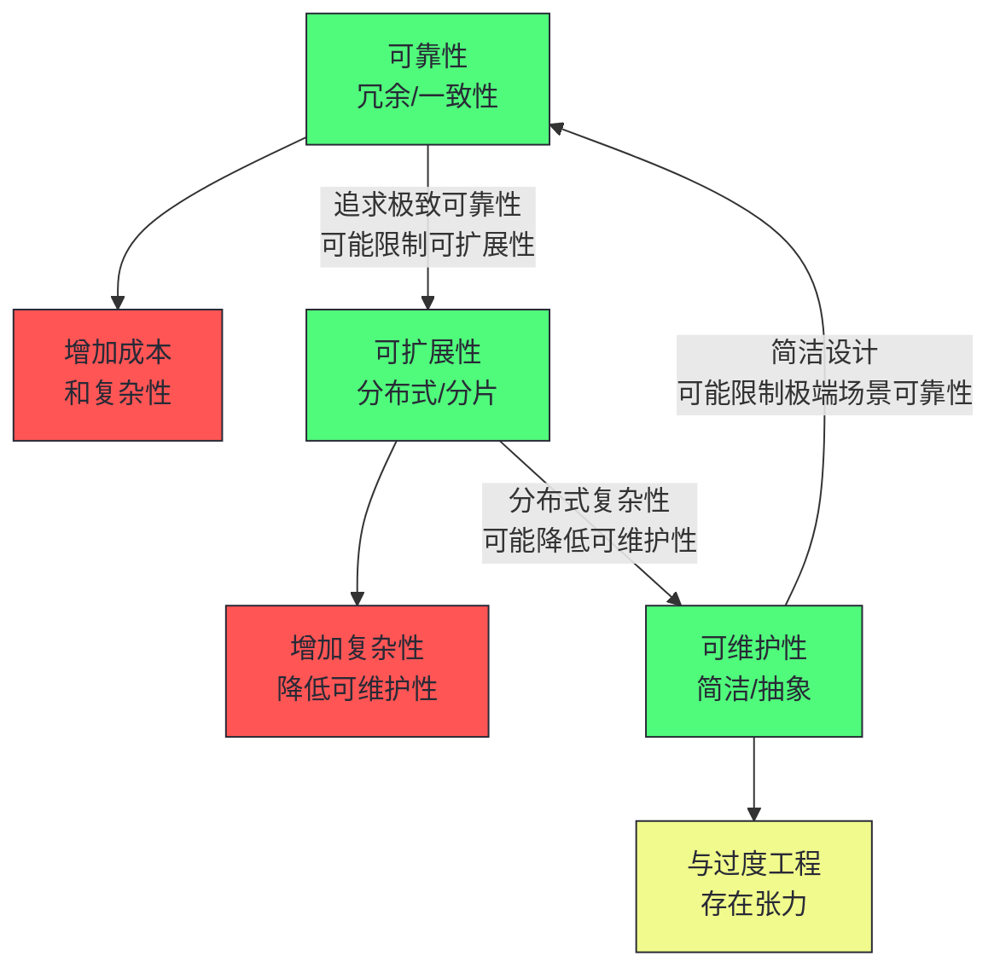

# 01 数据密集型系统的本质：可靠性、可扩展性与可维护性的三角

> [!abstract] 摘要
> 本文是《数据密集型系统架构实战》专栏的开篇，聚焦一个根本问题：什么样的系统才算"好的"数据系统？文章从"数据密集型"与"计算密集型"的区分切入，讲透数据系统的五大基础构建模块（数据库、缓存、搜索索引、流处理、批处理），然后深入剖析衡量数据系统的三大非功能性目标——可靠性、可扩展性与可维护性。可靠性部分讲清"故障"与"失效"的区别、硬件故障与软件故障的不同应对策略；可扩展性部分以社交网络时间线为案例，讲透负载描述、性能指标（响应时间百分位数 vs 平均值）、尾部延迟放大、垂直扩展与水平扩展的权衡；可维护性部分讲清可操作性、简洁性、可演化性三个维度。最后讨论操作型系统与分析型系统的分离、记录系统与衍生数据的概念框架，以及云原生对数据系统架构的深远影响。核心认知：数据系统的设计本质是权衡——没有"最优"的架构，只有"最匹配特定需求"的架构；理解三大目标的定义和度量方法，是后续所有架构决策的基石。

---

## 第 1 章 什么是数据密集型系统

### 1.1 数据密集型 vs 计算密集型

在软件系统中，性能挑战通常来自两个方向之一：

- **计算密集型（Compute-Intensive）**：主要挑战在于并行化大量计算——如天气预报、分子动力学、深度学习训练。瓶颈在 CPU/GPU 算力。
- **数据密集型（Data-Intensive）**：主要挑战在于管理数据——存储海量数据、处理数据变更、保证故障和并发下的一致性、确保高可用。瓶颈在 I/O、存储、网络、一致性协议。

本书（及本专栏）关注的是数据密集型系统。这类系统是现代互联网应用、SaaS 服务、企业数据平台的核心。当数据量或查询速率增长到单机无法承载时，数据需要分布到多台机器上，这就引入了复制、分片、一致性、容错等一系列分布式系统的核心挑战。

> [!info] 核心概念：数据是核心，而非计算
> 数据密集型系统的设计哲学是"数据是核心"。这意味着架构决策围绕数据的存储、流动、一致性展开，而非围绕计算逻辑展开。理解这一点很重要——很多架构问题的根因是开发者用"计算优先"的思维设计"数据优先"的系统，导致数据一致性和可扩展性出问题。

### 1.2 数据系统的五大构建模块

数据密集型应用通常由以下标准构建模块组合而成：

| 构建模块 | 核心功能 | 典型实现 |
|---------|---------|---------|
| **数据库（Database）** | 存储数据，以便日后检索 | PostgreSQL, MySQL, MongoDB |
| **缓存（Cache）** | 记住昂贵操作的结果，加速读取 | Redis, Memcached |
| **搜索索引（Search Index）** | 按关键字搜索或过滤数据 | Elasticsearch, Solr |
| **流处理（Stream Processing）** | 在事件发生时立即处理 | Kafka, Flink |
| **批处理（Batch Processing）** | 定期处理大量累积数据 | Spark, Hadoop, MapReduce |

应用代码通常是**无状态**的——处理完一个请求后"忘记"关于该请求的一切。任何需要在请求之间持久化的信息都必须存储在数据基础设施中。这种"无状态应用 + 有状态数据基础设施"的分离是现代云原生架构的基础。

> [!note] 设计哲学：为什么应用无状态、数据有状态
> 将状态从应用层剥离到数据层，是分布式系统设计的关键原则。无状态应用可以随时重启、水平扩展、滚动升级，而不影响数据一致性。有状态的数据基础设施则专注于状态管理——通过复制、事务、持久化等机制保证数据的可靠性和一致性。这种分离使得应用层和数据层可以独立演化：应用可以快速迭代而不担心数据丢失，数据层可以专注优化而不被业务逻辑干扰。

### 1.3 为什么没有"最优"的数据系统

构建数据密集型应用的核心挑战在于：**没有任何一种方法在根本上优于其他方法，一切都有其优缺点**。

- 有许多具有不同特性的数据库系统，适用于不同目的——你如何选择？
- 有各种缓存方法、多种构建搜索索引的方式——你如何权衡？
- 当需要组合多个工具完成单个工具无法独立完成的工作时，集成可能很困难。

本专栏的目标不是给你"最佳实践"，而是教你**提出正确的问题来评估和比较数据系统**，从而找出最适合特定应用需求的方法。这与《Software Architecture: The Hard Parts》的核心思想一脉相承——架构决策的本质是权衡分析。

---

## 第 2 章 操作型系统与分析型系统

### 2.1 两种系统的根本分离

在理解数据系统的三大目标之前，需要先建立一个重要的分类框架：**操作型系统**与**分析型系统**的分离。

| 属性 | 操作型系统（OLTP） | 分析型系统（OLAP） |
|------|-------------------|-------------------|
| 主要读取模式 | 点查询（按键获取单条记录） | 大量记录上的聚合 |
| 主要写入模式 | 创建、更新、删除单条记录 | 批量导入（ETL）或事件流 |
| 用户示例 | Web/移动应用终端用户 | 内部分析师，决策支持 |
| 查询类型 | 固定的、由应用程序预定义 | 任意的、分析师临时探索 |
| 查询量 | 大量小查询 | 少量查询，每个查询复杂 |
| 数据表示 | 数据的最新状态（当前时间点） | 随时间发生的事件历史 |
| 数据集大小 | 数 GB 到数 TB | 数 TB 到数 PB |

这种分离不是偶然的。操作型系统需要高并发、低延迟的读写操作以支持实时用户交互；分析型系统针对大量数据的扫描、聚合和复杂查询进行优化。将两者分开可以避免分析工作负载影响关键的业务操作。

> [!info] 核心概念：HTAP 不会取代分离
> 一些数据库系统提供 HTAP（混合事务/分析处理），旨在单个系统中同时支持 OLTP 和 OLAP。然而，许多 HTAP 系统内部由一个 OLTP 系统与一个独立分析系统耦合而成。即使 HTAP 存在，由于事务型系统和分析型系统的目标和需求不同，通常仍将它们分离。良好的实践认为每个操作型系统都应有自己的数据库（微服务原则），这可能导致数百个独立的操作型数据库；而企业通常只有一个数据仓库，以便分析师能在单个查询中组合来自多个操作系统的数据。

### 2.2 数据仓库与数据湖

**数据仓库**是一个单独的数据库，分析师可以随心所欲地查询它，而不会影响 OLTP 操作。数据从 OLTP 数据库中提取，转换为分析友好的模式，进行清理，然后加载到数据仓库中——这个过程称为 ETL（Extract-Transform-Load）。

**数据湖**是数据仓库的演进：一个集中式数据存储库，保存从操作系统中获取的"原始"数据，不强制任何特定的文件格式、数据模型或模式。数据湖可以包含数据库记录（Avro、Parquet），也可以包含文本、图像、视频、传感器读数、特征向量、基因组序列等任何类型的数据。

> [!note] 设计哲学：寿司原则——"生数据更好"
> 数据湖的核心理念是"寿司原则"：生数据更好。每个数据消费者都可以将原始数据转换为最适合其需求的形式，而不是被强制使用数据仓库预定义的关系模式。这给了数据科学家更大的灵活性——他们可以用 Pandas、Spark 或任何工具处理原始数据，而不受 SQL 关系模型的约束。代价是数据湖容易变成"数据沼泽"——没有治理的原始数据堆积，难以发现和理解。

### 2.3 记录系统与衍生数据

与操作型/分析型系统的区分相关，另一个重要的概念框架是**记录系统**与**衍生数据系统**：

**记录系统（System of Record）**：保存数据的权威或规范版本，也称为"事实来源"（Source of Truth）。当新数据进入时，它首先被写到这里。每个事实只表示一次（通常是规范化的）。如果其他系统与记录系统之间存在差异，记录系统中的值（按定义）是正确的。

**衍生数据系统（Derived Data System）**：数据是获取其他系统中的现有数据并以某种方式转换或处理的结果。如果丢失了衍生数据，可以从原始来源重新创建。典型例子：缓存、反规范化的值、索引、物化视图、训练好的 ML 模型。

> [!info] 核心概念：区分记录系统与衍生数据的价值
> 记录系统和衍生数据系统的区别不在于工具，而在于使用方式。同一个数据库在一个应用中可能是记录系统，在另一个应用中可能是衍生数据系统。通过明确哪些数据是从哪些其他数据派生而来的，可以为原本混乱的系统架构带来清晰度——你知道哪些数据是"权威的"，哪些数据可以"丢弃后重建"。这种清晰度在故障恢复、数据迁移、合规审计中极其重要。

---

## 第 3 章 可靠性：即使出现问题也能正确工作

### 3.1 故障与失效的区分

可靠性（Reliability）的核心定义是：**即使出现问题，系统也能继续正确工作**。

要精确描述"出现问题"，需要区分两个概念：

- **故障（Fault）**：系统的某个特定部分停止正确工作——例如一块硬盘故障、一台机器崩溃、一个外部服务中断。
- **失效（Failure）**：整个系统停止向用户提供所需服务——即系统未达到 SLO。

故障与失效是同一事物在不同层级的表现。一块硬盘停止工作，从硬盘角度看是"失效"，但从包含多块硬盘的存储系统看只是"故障"——系统可以通过 RAID 或副本容忍这个故障，不导致整体失效。

> [!note] 设计哲学：容错的目标是"故障不升级为失效"
> 容错（Fault Tolerance）的目标不是"防止故障"——故障是不可避免的（硬件会坏、网络会断、软件有 bug）。容错的目标是"确保故障不升级为系统级失效"。这通过冗余（多副本）、隔离（故障不扩散）、降级（部分功能不可用但核心功能正常）等机制实现。理解"故障 vs 失效"的区分，才能正确设计容错机制——你不需要防止所有故障，只需要防止故障的级联效应。

### 3.2 硬件故障

硬件故障的典型数据：

- 磁硬盘年故障率约 2-5%；在 10,000 块磁盘的集群中，平均每天预期一块磁盘故障
- SSD 年故障率约 0.5-1%
- 大约每 1000 台机器中有 1 台 CPU 核心偶尔计算错误结果
- RAM 数据可能因宇宙射线或物理缺陷而损坏；即使使用 ECC 内存，每年仍有超过 1% 的机器遇到不可纠正的错误

应对硬件故障的主要手段是**冗余**：RAID 磁盘冗余、双电源、热插拔 CPU、数据中心备用电源。在云环境中，更倾向于在软件层面容忍故障节点——通过多副本和自动故障转移，使服务在单机故障时仍可用。

> [!warning] 生产避坑：硬件故障不是独立的
> 冗余最有效的前提是"故障独立"——一个故障不影响另一个故障的概率。但经验表明硬件故障之间存在显著相关性：同一批次磁盘可能同时故障、同一机架可能同时断电、同一可用区可能同时网络中断。设计容错系统时必须考虑相关性故障——多副本应分布在不同机架、不同可用区，而非同一物理位置。

### 3.3 软件故障

软件故障比硬件故障更难处理，因为它们通常是**高度相关**的——许多节点运行相同的软件，具有相同的 bug。

典型软件故障：

- 2012 年闰秒导致许多 Java 应用同时挂起（Linux 内核 bug）
- 某型号 SSD 在精确运行 32768 小时后集体故障（固件 bug）
- 失控进程消耗共享资源（CPU、内存、磁盘、网络）
- 级联故障：一个组件的问题导致另一个过载，进而导致更多组件宕机

> [!info] 核心概念：亚稳态故障
> 过载系统可能进入恶性循环：请求队列变长 → 响应时间增加 → 客户端超时重试 → 请求率进一步增加 → 系统更过载。即使负载降低，系统可能仍处于过载状态，直到被重启。这种现象称为**亚稳态故障（Metastable Failure）**，是生产系统中断的常见原因。应对方法：指数退避（exponential backoff）、断路器（circuit breaker）、负载丢弃（load shedding）、背压（backpressure）。

### 3.4 人为错误与无责事后分析

一项对大型互联网服务的研究发现：**运维人员的配置变更是宕机的主要原因**，硬件故障仅在 10-25% 的案例中起作用。

将问题归咎于"人为错误"适得其反。所谓的"人为错误"实际上是社会技术系统存在问题的症状。正确的做法是采用**无责事后分析（Blameless Post-mortem）**文化：事件发生后，鼓励相关人员分享完整细节而不担心惩罚，让组织中的其他人学习如何防止类似问题。

---

## 第 4 章 可扩展性：应对负载增长的能力

### 4.1 案例研究：社交网络时间线

为了使可扩展性的概念具体化，DDIA 用了一个社交网络的案例。假设要实现类似 Twitter/X 的主页时间线功能：

- 用户每天发布 5 亿条帖子（平均每秒 5,800 条，峰值 150,000 条/秒）
- 平均每个用户关注 200 人，有 200 个粉丝
- 1000 万用户同时在线

**方法一：查询时计算**。用户请求时间线时，执行 SQL 查询：查找关注的所有人 → 获取他们最近的帖子 → 按时间排序。如果一个用户关注 200 人，这个查询需要 200 次查找。1000 万在线用户每 5 秒轮询一次 = 每秒 200 万次查询 × 200 次查找 = **每秒 4 亿次查找**。

**方法二：预计算（物化视图）**。为每个用户存储一个时间线缓存。当用户发帖时，查找所有粉丝，将帖子插入每个粉丝的时间线缓存。用户请求时间线时直接从缓存读取。以每秒 5,800 条帖子 × 200 个粉丝 = **每秒 100 万次时间线写入**。

方法二将"读时的昂贵计算"转移为"写时的预计算"，用写入开销换取读取速度。这是**物化视图**的经典应用——用写放大换取读加速。

> [!warning] 生产避坑：名人粉丝的扇出问题
> 方法二在普通用户（200 粉丝）下表现良好，但名人（1 亿粉丝）发帖时需要 1 亿次时间线写入。解决方案：将名人帖子单独存储，读取时与物化时间线合并，而非写入每个粉丝的时间线。这体现了可扩展性设计的一个通用原则——**特殊处理极端情况**，而非为极端情况设计通用机制。

### 4.2 描述性能：响应时间百分位数

性能的两个核心指标：

- **响应时间（Response Time）**：从用户发出请求到收到响应的总时间。包括服务时间、排队延迟、网络延迟。
- **吞吐量（Throughput）**：系统每秒处理的请求数或数据量。

> [!info] 核心概念：延迟 vs 响应时间
> "延迟"和"响应时间"常被混用，但有精确区别：
> - **响应时间**：客户端看到的总时间
> - **服务时间**：服务主动处理请求的时间
> - **排队延迟**：请求等待被处理的时间
> - **延迟（Latency）**：请求未被主动处理的时间（潜伏状态）
>
> 排队延迟通常占响应时间可变性的一大部分。少量慢请求就能阻塞后续请求——这称为**队头阻塞（Head-of-Line Blocking）**。因此，必须在客户端侧测量响应时间，而非服务端的服务时间。

**为什么平均值不够**：响应时间不是单个数字，而是分布。平均值被离群值拉高，不能告诉你多少用户实际经历了某种延迟。更好的方法是使用**百分位数**：

- **中位数（P50）**：一半请求快于这个值，一半慢于这个值。代表"典型"用户体验。
- **P95**：95% 的请求快于这个值，5% 慢于这个值。
- **P99 / P999**：关注最慢的 1% / 0.1% 请求，称为**尾部延迟**。

> [!info] 核心概念：尾部延迟放大
> 如果一个终端用户请求需要并行调用多个后端服务，整个请求的响应时间取决于最慢的那个调用。即使只有 1% 的后端调用是慢的，如果终端用户请求需要调用 100 个后端服务，那么 63% 的终端用户请求都会遇到至少一个慢调用（1 - 0.99^100 ≈ 0.63）。这就是**尾部延迟放大**——后端服务的尾部延迟直接放大为终端用户请求的延迟。这就是为什么 Amazon 用 P999 而非平均值来衡量服务性能。

### 4.3 负载描述与扩展策略

讨论可扩展性前，必须先清晰描述系统当前的**负载**。负载参数取决于具体应用：

- QPS（每秒请求数）
- 读写比
- 缓存命中率
- 同时在线用户数
- 每用户数据项数量

有了负载描述后，可扩展性问题变成两个方向：

1. **增加负载、保持资源不变**：性能会受到怎样的影响？
2. **增加负载、保持性能不变**：需要增加多少资源？

如果资源翻倍能使系统在保持性能不变的情况下处理两倍负载，称为**线性可扩展性**。

扩展的两种基本路径：

| 路径 | 别名 | 机制 | 优势 | 劣势 |
|------|------|------|------|------|
| **垂直扩展** | 向上扩展 / 共享内存 | 迁移到更强大的机器 | 简单，无分布式复杂性 | 成本超线性增长，有上限 |
| **水平扩展** | 向外扩展 / 共享无架构 | 多节点分布式系统 | 线性扩展潜力，容错 | 需要分片，分布式复杂性 |

> [!note] 设计哲学：不要急于分布式化
> "你不是 Google 或 Amazon。别担心规模问题，直接用关系型数据库。"这句话是否适用取决于应用类型。如果你在构建用户数很少的新产品，主要目标是保持系统简单灵活。为假设性规模担心是过早优化。单机数据库（如 PostgreSQL、DuckDB）能处理远超大多数人想象的负载。分布式系统的复杂性是真实的——网络故障、部分失效、一致性挑战——只有在单机确实无法承载时才值得承受这些复杂性。

### 4.4 共享内存、共享磁盘与共享无架构

扩展策略的底层架构模型有三种：

**共享内存架构（Shared-Memory）**：即垂直扩展。单台机器拥有更多 CPU 核心、更多 RAM、更多磁盘。所有线程共享同一地址空间。问题在于成本超线性增长——一台两倍硬件配置的机器，成本通常远超两倍，且由于总线争用，实际处理能力达不到两倍。

**共享磁盘架构（Shared-Disk）**：多台机器有独立 CPU/RAM，但共享一个磁盘阵列（NAS 或 SAN）。传统用于本地数据仓库。问题在于争用和锁定开销限制了可扩展性。

**共享无架构（Shared-Nothing）**：即水平扩展。每个节点拥有独立的 CPU、RAM 和磁盘，节点间通过常规网络协调。这是现代分布式数据库的主流架构——具有线性扩展潜力、最佳性价比、弹性伸缩能力、跨数据中心容错。代价是需要显式分片和分布式协调。

> [!info] 核心概念：云原生的"共享磁盘"变体
> 一些云原生数据库（如 Aurora、Snowflake）使用独立的存储和计算服务，多个计算节点共享同一存储服务。这与传统共享磁盘架构相似，但避免了旧系统的可扩展性问题——存储服务不提供文件系统或块设备抽象，而是提供专为数据库需求设计的专用 API。这是"共享无架构"与"共享磁盘"在云时代的融合。

### 4.5 可扩展性原则

大规模系统的架构高度特定于应用。不存在通用的"魔法扩展秘方"。两个关键原则：

1. **将系统分解为可独立运行的小组件**——这是微服务、分片、流处理、共享无架构背后的基本原则。挑战在于知道在哪里划线：哪些应该在一起，哪些应该分开。
2. **不要把事情搞得比必要更复杂**——如果单机数据库能胜任，它可能比复杂的分布式设置更可取。5 个服务的系统比 50 个服务的系统更简单。良好的架构通常是务实的混合方法。

> [!warning] 生产避坑：每次负载增加一个数量级都需要重新审视架构
> 适合一种负载水平的架构不太可能应对 10 倍的负载。如果你在快速增长的服务上工作，很可能每次负载增加一个数量级时都需要重新考虑架构。提前规划超过一个数量级的未来扩展需求通常不值得——因为应用需求会演化，技术会变化，过早的架构决策可能成为束缚。

---

## 第 5 章 可维护性：为未来设计

### 5.1 软件维护的真实成本

软件的大部分成本不在于初始开发，而在于持续的维护——修复缺陷、保持运行、调查故障、适应新平台、修改以应对新用例、偿还技术债务、添加新功能。

可维护性的三个维度：

### 5.2 可操作性：让运维更轻松

良好的可操作性意味着让例行任务变得简单，让运维团队专注于高价值活动。数据系统可以通过以下方式提供帮助：

- 支持监控和可观测性工具
- 避免依赖单台机器（允许滚动升级）
- 提供良好的文档和可预测的运维模型
- 提供良好的默认行为，同时允许覆盖
- 适当自愈，同时允许手动控制

> [!warning] 生产避坑：自动化是一把双刃剑
> 自动化至关重要，但出错的自动化系统比手动操作系统更难排查。更高的自动化程度需要更高技能的运维团队来解决自动处理不了的边界情况——而这些边界情况往往是最复杂的。最佳平衡点取决于具体应用和组织。

### 5.3 简洁性：管理复杂性

小型项目可以有简洁的代码，但随着项目变大，常常变成"一团乱麻"。复杂性拖慢所有工作，增加维护成本，引入缺陷的风险也更大。

管理复杂性最好的工具是**抽象**。好的抽象能在简洁的门面后隐藏大量实现细节，且可广泛复用。例如：

- 高级编程语言隐藏了机器代码和 CPU 寄存器
- SQL 隐藏了磁盘数据结构、并发控制、崩溃恢复

### 5.4 可演化性：让变更变得容易

系统需求永远在变化：新事实、新用例、业务优先级变化、新平台、法规变化、系统增长。

在大型系统中使变更变得困难的一个主要因素是**不可逆性**。如果从一个数据库迁移到另一个，在新系统出问题时无法回退到旧系统，风险远大于可以轻松回退的情况。**最小化不可逆性可以提高灵活性**。

> [!info] 核心概念：可演化性是数据系统层面的敏捷性
> 可演化性（Evolvability）是"敏捷"在数据系统层面的对应概念。松耦合、简单的系统比紧耦合、复杂的系统更容易修改。在后续文章中，我们将看到很多技术（如 Schema 演进、编码兼容性、微服务 API 演化）本质上都是在提高系统的可演化性。

---

## 第 6 章 云原生对数据系统架构的影响

### 6.1 存储与计算分离

传统架构中，同一台计算机同时负责存储（磁盘）和计算（CPU/RAM）。云原生系统将这两项职责分离：

- **存储服务**（如 S3）：专门优化的长期存储，自动分布式、高可用
- **计算服务**：按需分配的 CPU/RAM，可弹性伸缩

存储与计算分离的优势：

- 计算资源可以按需弹性伸缩（分析查询完成即可释放）
- 存储与计算可以独立扩展
- 故障域隔离（计算节点故障不丢数据）

代价：数据需要通过网络传输，引入网络延迟。但专用存储服务可以通过优化（如数据本地性缓存、预取）缓解这个问题。

### 6.2 云服务 vs 自托管的权衡

| 维度 | 云服务 | 自托管 |
|------|--------|--------|
| 成本 | 波动负载更划算 | 可预测负载更便宜 |
| 控制力 | 受限，可能供应商锁定 | 完全控制 |
| 运维负担 | 底层外包 | 自行维护 |
| 定制化 | 难以定制 | 可针对工作负载调优 |
| 故障诊断 | 受限于供应商提供的信息 | 可访问 OS 层调试信息 |

> [!note] 设计哲学：云不是银弹
> 云服务最大的缺点是你无法控制它：缺少功能只能请求供应商；服务宕机只能等待恢复；诊断问题受限于供应商提供的信息；供应商可能关闭服务、涨价或改变产品。尽管如此，越来越多的组织选择在云上构建新应用。但云不会取代所有内部系统——对延迟极其敏感的应用（如高频交易）仍需要对硬件的完全控制。混合方法（云服务 + 自托管）是许多组织的现实选择。

### 6.3 微服务与无服务器

将系统分布到多台机器上的最常见方法是**微服务架构**：一个复杂应用被分解为多个相互交互的服务，每个服务有明确定义的目的，由独立团队维护，通过 API 通信。

微服务的核心优势是组织性的——允许不同团队独立推进，无需相互协调。这在大型公司中很有价值，但在小公司中可能是不必要的开销。

在数据存储方面，微服务的一个关键原则是**每个服务拥有自己的数据库，不在服务之间共享数据库**。共享数据库会使整个数据库结构成为服务 API 的一部分，使其难以更改，还可能导致一个服务的查询影响另一个服务的性能。

**无服务器（Serverless / FaaS）** 是另一种部署方法：云提供商根据传入请求自动分配和释放硬件资源。你只为代码运行的时间付费，无需预先配置资源。代价是执行时间限制、冷启动延迟、运行时环境限制。

> [!info] 核心概念：微服务主要解决人员问题
> 微服务主要是一个针对人员问题的技术解决方案——允许不同团队独立推进。理解这一点很重要：如果你没有"多个团队需要独立工作"的组织问题，微服务可能引入不必要的分布式复杂性。单体应用在团队较少时往往是更好的选择。康威定律指出"系统架构反映组织的沟通结构"——微服务架构适合微服务化的组织结构，而非反过来。

### 6.4 数据系统、法律与社会

数据系统的架构不仅受技术目标影响，还受法律和社会责任影响。GDPR 赋予个人对数据的控制权，包括被遗忘权。但这与许多数据系统的设计冲突——不可变日志是很多系统的设计基础，如何从"本应不可变"的文件中删除特定数据？如何处理已并入衍生数据集（如 ML 模型训练数据）的数据删除？

**数据最小化原则**（Datensparsamkeit）与"大数据"哲学背道而驰：前者主张只收集和保留必要的最少数据，后者主张投机性地存储大量数据以备将来可能有用。但从风险角度看，存储数据不仅限于存储成本——还包括数据泄露的责任风险、声誉损失风险、法律罚款风险。合理的选择可能是决定某些数据根本不值得存储。

---

## 第 7 章 三大目标的权衡关系

可靠性、可扩展性、可维护性不是独立的目标，它们之间存在张力：

> [!info] 核心概念：三大目标的优先级取决于业务
> 没有绝对的优先级。对于支付系统，可靠性高于一切；对于社交网络，可扩展性优先；对于快速迭代的产品，可维护性最重要。架构师的核心工作是理解业务需求，在三大目标之间做出正确的权衡。这正是《Hard Parts》的核心思想——架构决策的本质是基于上下文的权衡分析。

---

## 总结

本文建立了贯穿全专栏的认知基础：

1. **数据密集型系统的核心挑战是数据管理**——存储、一致性、可扩展性、可用性——而非计算。五大构建模块（数据库、缓存、搜索索引、流处理、批处理）是标准组件。

2. **操作型系统与分析型系统的分离是基本分类**。OLTP 关注低延迟点查询，OLAP 关注大规模聚合分析。数据仓库和数据湖是分析型系统的两种形态。记录系统与衍生数据的区分帮助理清数据流动。

3. **可靠性的核心是"故障不升级为失效"**。硬件故障通过冗余应对，软件故障因相关性更难处理。人为错误是宕机主因，无责事后分析是正确的应对文化。

4. **可扩展性的核心是"描述负载、度量性能、选择扩展策略"**。响应时间用百分位数（P50/P95/P99）而非平均值衡量。尾部延迟放大使得后端 P99 直接影响终端用户体验。垂直扩展简单但有上限，水平扩展灵活但引入分布式复杂性。

5. **可维护性的三个维度是可操作性、简洁性、可演化性**。软件维护成本远超开发成本。抽象是管理复杂性的核心工具。最小化不可逆性提高可演化性。

6. **云原生改变了数据系统的架构方式**。存储与计算分离是核心趋势。云服务 vs 自托管是基于业务负载特征的权衡决策。

> [!info] 专栏导航
> 本文是 [[00 专栏导览|数据密集型系统架构实战专栏]] 的第 01 篇，建立了可靠性、可扩展性、可维护性三大目标的认知基础。下一篇 [[02 存储引擎深潜：从 LSM-Tree 到 B-Tree 的写读权衡]] 将深入数据系统的"底层"——存储引擎的内部机制，讲透 LSM-Tree 和 B-Tree 的设计逻辑与权衡取舍。后续文章将沿着"存储 → 数据模型 → 编码演化 → 复制 → 分片 → 事务 → 一致性 → 架构决策 → 分布式事务 → 数据流"的认知链路逐层深入，最终构建从技术原理到架构决策的完整知识体系。

---

## 延伸思考

在进入下一篇之前，思考以下问题：

1. **你的系统是操作型还是分析型？** 两者是否被正确分离？分析查询是否在影响 OLTP 性能？
2. **你的系统中哪些是记录系统，哪些是衍生数据？** 如果衍生数据丢失，能否从记录系统重建？重建需要多长时间？
3. **你的响应时间监控用的是平均值还是百分位数？** 如果是平均值，你可能遗漏了尾部延迟问题——特别是当终端用户请求需要调用多个后端服务时。
4. **你的系统在什么负载水平下会遇到架构极限？** 你是否有"每次负载增加一个数量级就需要重新审视架构"的预期？
5. **你的系统中有哪些不可逆操作？** 数据库迁移、Schema 变更、数据格式变更——这些操作的不可逆性是否增加了变更风险？

这些问题不是要求立即回答的，而是贯穿全专栏的思考线索。随着后续文章对存储、复制、分片、事务等机制的深入，你将获得回答这些问题的知识工具。

---

*本文基于 Martin Kleppmann《Designing Data-Intensive Applications》2nd Edition 第 1-2 章整合而成，加入了作者的结构化重组和工程实践理解。*
