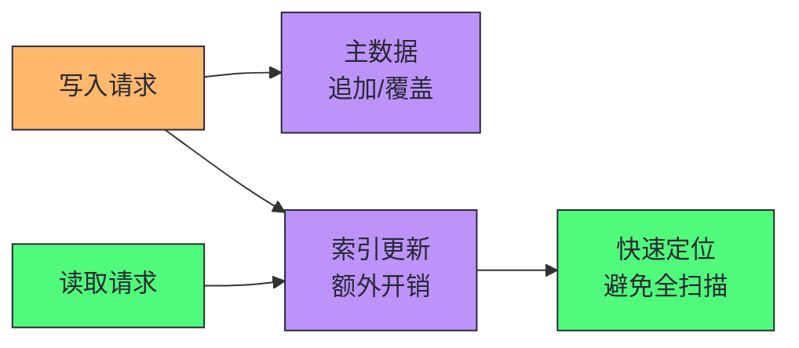
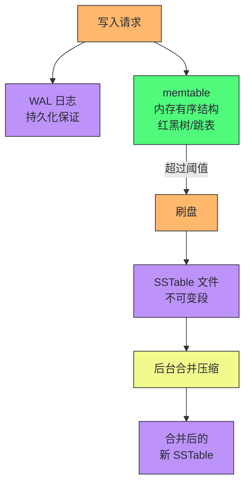
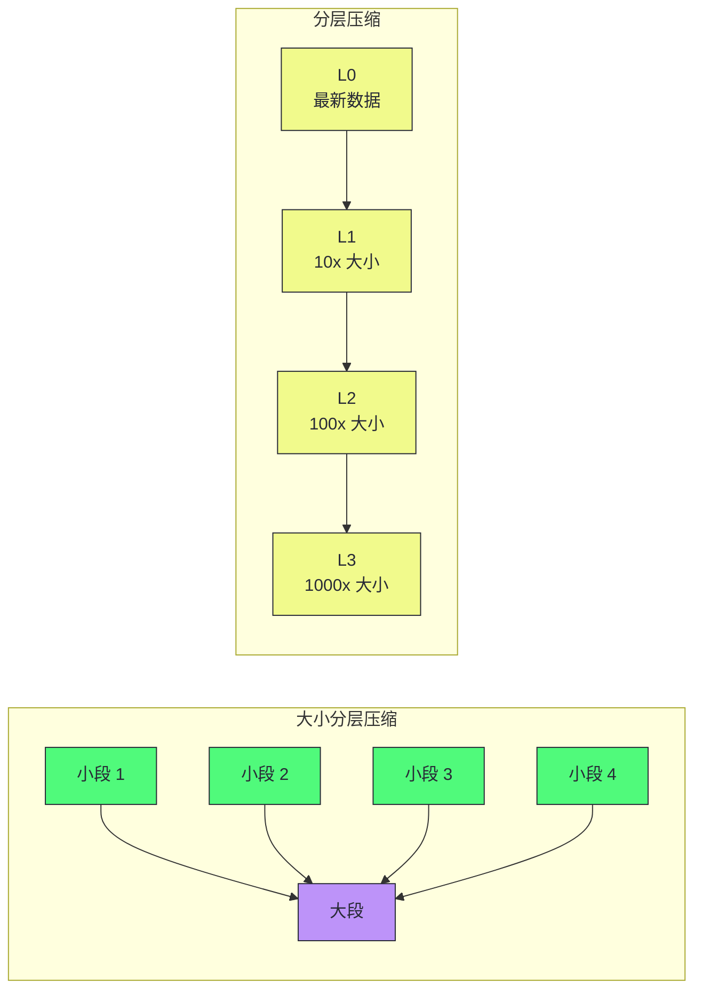
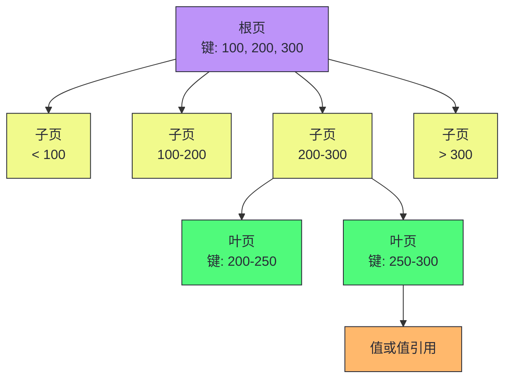
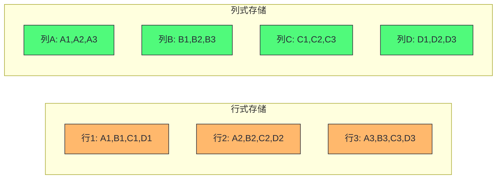
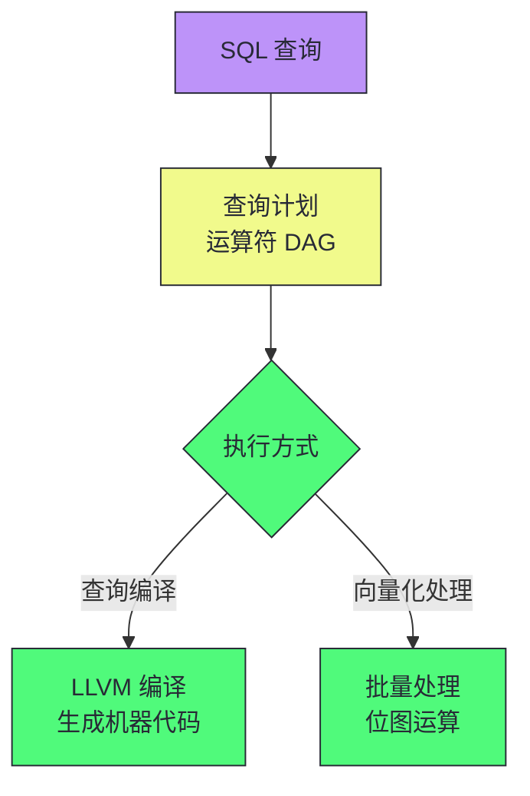
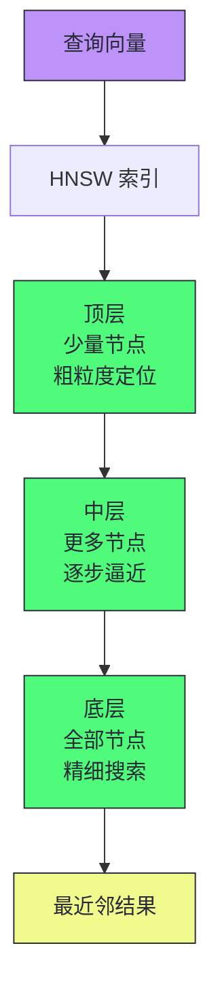
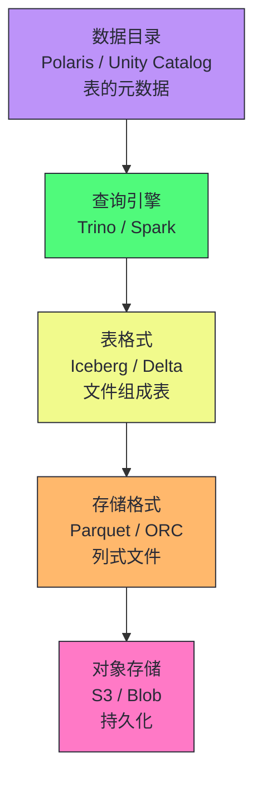

# 02 存储引擎深潜：从 LSM-Tree 到 B-Tree 的写读权衡

> [!abstract] 摘要
> 本文深入数据系统最底层——存储引擎的内部机制。从"最简单的数据库"（bash 追加日志）切入，讲透索引的本质：以写入开销换取读取加速。然后深入剖析两大 OLTP 存储引擎家族——日志结构存储（LSM-Tree/SSTable/memtable/Bloom Filter/压缩策略）和页面式存储（B-Tree/WAL/页分裂/写时复制），从数据结构、写入路径、读取路径、写放大、磁盘空间利用等维度做系统对比。之后转向分析型存储引擎，讲透列式存储、位图压缩、排序键设计、查询编译与向量化执行。最后覆盖多维索引（R-Tree）、全文搜索（倒排索引）和向量嵌入（HNSW/IVF），构建从 OLTP 到 OLAP 到语义搜索的完整存储引擎知识图谱。核心认知：存储引擎的设计本质是"写读权衡"——LSM-Tree 用写放大换取高写入吞吐，B-Tree 用原地覆盖换取低延迟读取，列式存储用行式写入困难换取分析查询的大幅加速。没有"最优"的存储引擎，只有"最匹配工作负载"的存储引擎。

---

## 第 1 章 索引的本质：以写换读

### 1.1 最简单的数据库

在深入复杂存储引擎之前，先看一个最简单的键值存储——用两个 bash 函数实现：

```bash
#!/bin/bash
db_set () {
    echo "$1,$2" >> database
}
db_get () {
    grep "^$1," database | sed -e "s/^$1,//" | tail -n 1
}
```

`db_set` 将键值对追加到文件末尾，`db_get` 用 grep 查找键并取最后一次出现。这个"数据库"的写入性能相当好——追加到文件是最高效的写入操作。但读取性能极差——每次查找需要从头扫描整个文件，复杂度 O(n)。

这个简单例子揭示了存储引擎的核心矛盾：**纯追加写入最快，但读取最慢；要加速读取，就需要索引，但索引会降低写入速度**。

> [!info] 核心概念：日志（Log）的广义含义
> 在数据库语境中，"日志"不指应用日志（文本描述），而是指**磁盘上仅追加的记录序列**。它可能是二进制的，仅供数据库内部使用。日志是存储引擎最基础的构建块——从 WAL（预写日志）到 LSM-Tree 的 SSTable，再到 Kafka 的消息日志，"仅追加"是最简单也最高效的写入模式。

### 1.2 索引是什么

索引是从主数据衍生出来的附加结构。它的核心特征：

- 索引不影响数据库的内容，只影响查询性能
- 维护索引带来开销——每次写入数据时也需要更新索引
- 任何类型的索引都会降低写入速度



> [!note] 设计哲学：索引是写读权衡的核心杠杆
> 这是存储系统中最重要的权衡：精心选择的索引能加速读取查询，但每个索引都会消耗额外磁盘空间并降低写入速度。因此数据库不会默认对所有列建索引，而是要求开发者根据应用的典型查询模式手动选择索引。选择索引的艺术在于：为高频查询建索引，避免在低频查询上引入不必要的写入开销。

---

## 第 2 章 日志结构存储：LSM-Tree

### 2.1 从哈希索引到 SSTable

最简单的索引方案是在内存中维护一个哈希映射，将每个键映射到日志文件中的字节偏移量。写入时追加数据并更新哈希映射；读取时通过哈希映射找到偏移量，直接寻址读取。

这种方案的问题：

- 哈希映射必须放入内存（磁盘哈希映射性能差，需要大量随机 I/O）
- 无法高效做范围查询（哈希映射只支持精确匹配）
- 旧版本数据无法回收，磁盘空间无限增长
- 重启时需要扫描整个日志重建哈希映射

**SSTable（Sorted Strings Table）** 解决了这些问题。SSTable 是一种按键排序的文件格式，每个键只出现一次。它的核心优势：

1. **稀疏索引**：不需要将所有键放入内存。将键值对分组为几 KB 的块，只存储每个块的第一个键到索引中。查找时，通过稀疏索引定位到块，再在块内扫描。
2. **范围查询高效**：键有序存储，可以高效扫描键范围。
3. **合并高效**：多个 SSTable 可以用归并排序的方式合并，内存使用最小。

### 2.2 LSM-Tree 的写入路径

LSM-Tree（Log-Structured Merge-Tree）的写入流程：



1. **写入 WAL**：先将写入追加到预写日志（WAL），保证崩溃恢复
2. **写入 memtable**：将键值对插入内存中的有序结构（红黑树/跳表/字典树）
3. **刷盘**：当 memtable 超过阈值（通常几 MB），以排序顺序写入磁盘成为新的 SSTable 文件
4. **后台合并**：定期在后台合并段文件，丢弃被覆盖或删除的值

> [!info] 核心概念：memtable 与 WAL 的分工
> memtable 是内存中的有序结构，提供快速的写入和排序读取。WAL 是磁盘上的仅追加日志，唯一目的是在崩溃后恢复 memtable 中的数据。当 memtable 刷盘为 SSTable 后，WAL 的相应部分可以被丢弃。这种分工确保了写入的高效性（内存写入 + 顺序日志）和持久性（WAL 保证崩溃不丢数据）。

### 2.3 LSM-Tree 的读取路径

读取一个键时，LSM-Tree 需要依次检查：

1. **memtable**：先查内存中的 memtable
2. **最新 SSTable**：如果 memtable 没有，查最新的磁盘段
3. **更旧的 SSTable**：逐个查更旧的段，直到找到或查完所有段

这种"从新到旧"的查找方式意味着：读取一个很久没更新的键，或者读取一个不存在的键，可能需要检查多个段文件——这是 LSM-Tree 读取性能的主要瓶颈。

**Bloom Filter** 是解决这个问题的关键优化：每个 SSTable 附带一个布隆过滤器，在查找前先检查键是否"可能存在"于该段。如果布隆过滤器说"不存在"，可以直接跳过该段，避免不必要的磁盘 I/O。

> [!info] 核心概念：布隆过滤器的假阳性与假阴性
> 布隆过滤器可能出现**假阳性**（报告存在但实际不存在），但永远不会出现**假阴性**（报告不存在但实际存在）。这意味着：
> - 如果布隆过滤器说"不存在"→ 安全跳过该 SSTable
> - 如果布隆过滤器说"存在" → 必须查阅稀疏索引和块，可能是假阳性
>
> 假阳性概率取决于键数量、位数和哈希函数数。经验法则：1% 假阳性概率需要每键 10 位；每多 5 位，假阳性概率降低一个数量级。在 LSM-Tree 中，假阳性只是做了一些不必要的工作，没有其他害处。

### 2.4 压缩策略

LSM-Tree 的核心挑战之一是**何时合并、合并哪些 SSTable**。两种主要压缩策略：

| 策略 | 机制 | 优势 | 劣势 |
|------|------|------|------|
| **大小分层（Size-Tiered）** | 较新较小的 SSTable 依次合并到较旧较大的 SSTable | 高写入吞吐，大多数数据只在顺序合并中重写几次 | 合并大段需要大量临时磁盘空间；读取需检查更多段 |
| **分层（Leveled）** | SSTable 大小固定，分组到递增的层级（L0, L1, ...） | 读取更高效（需检查更少段）；磁盘空间更少 | 写放大更高 |



> [!note] 设计哲学：压缩策略的选择取决于工作负载
> 经验法则：写密集工作负载选大小分层压缩（高写入吞吐）；读密集工作负载选分层压缩（读取更高效）。如果频繁写入少量键而很少写入大量键，分层压缩也可能有利。大多数 LSM-Tree 实现（如 RocksDB）允许配置多种压缩策略，甚至对不同层级使用不同策略。

### 2.5 墓碑与删除

LSM-Tree 中删除一个键不是从文件中移除数据（段文件不可变），而是追加一个特殊的**墓碑（Tombstone）**记录。读取时遇到墓碑就知道该键已被删除；合并时墓碑告诉合并过程丢弃该键的所有旧值。一旦墓碑被合并到最旧的段中，它本身也可以被丢弃。

> [!warning] 生产避坑：LSM-Tree 中的删除延迟
> 已删除的记录可能仍存在于较高层级的 SSTable 中，直到墓碑传播到所有压缩层级——这可能需要很长时间。这在需要确保数据"确实已被删除"的场景（如 GDPR 合规）中是问题。专门的存储引擎设计可以更快地传播删除，但标准 LSM-Tree 不提供即时删除保证。

---

## 第 3 章 页面式存储：B-Tree

### 3.1 B-Tree 的设计理念

B-Tree 于 1970 年引入，不到十年就被称为"无处不在"。它是几乎所有关系型数据库的标准索引实现，也被许多非关系型数据库使用。

B-Tree 与 LSM-Tree 的根本区别：

| 维度 | LSM-Tree | B-Tree |
|------|----------|--------|
| **基本单位** | 可变大小的段（几 MB+） | 固定大小的页（4-16 KB） |
| **写入方式** | 仅追加，文件不可变 | 原地覆盖页 |
| **崩溃恢复** | WAL + 删除未完成 SSTable | WAL + 重放日志 |
| **碎片化** | 压缩时重写，碎片少 | 页分裂/删除产生碎片 |

### 3.2 B-Tree 的结构

B-Tree 将数据库分解为固定大小的**页**，页通过页号引用（类似磁盘指针）。页组成一棵平衡树：

- **根页**：查找的起点，包含若干键和子页引用
- **内部页**：包含键范围边界和子页引用
- **叶页**：包含实际键值对或值引用



**分支因子**：一个页中子页引用的数量。实践中通常几百。一个四级 B-Tree，使用 4 KB 页和 500 的分支因子，可存储 500^4 ≈ 62.5 TB 数据——大多数数据库可以容纳在 3-4 层的 B-Tree 中。

### 3.3 B-Tree 的写入与页分裂

更新现有键：搜索到叶页，用新值覆盖该页。

插入新键：搜索到叶页，如果页有空间则添加。如果页已满，需要**分裂**——将页分成两个半满的页，并更新父页的引用和边界。分裂可能向上传播：如果父页也满了，父页也需要分裂，甚至可能到达根页（创建新根，树深度增加一层）。

> [!info] 核心概念：B-Tree 的平衡性
> B-Tree 始终保持平衡——所有叶页与根页的距离相同。具有 n 个键的 B-Tree 深度始终为 O(log n)。这是 B-Tree 读取性能可预测的关键——无论查哪个键，都需要读取相同数量的页（通常 3-4 次 I/O）。

### 3.4 B-Tree 的崩溃恢复：WAL

B-Tree 的基本写操作是用新数据覆盖磁盘上的页。这带来一个危险：如果覆盖过程中崩溃，页可能被部分写入（**页撕裂**），导致 B-Tree 损坏。

**预写日志（WAL, Write-Ahead Log）** 是解决方案：在将任何 B-Tree 修改应用到树的页之前，必须先将修改写入 WAL。崩溃后重启时，用 WAL 重放未完成的修改，将 B-Tree 恢复到一致状态。

> [!warning] 生产避坑：WAL 是 B-Tree 可靠性的基石
> 没有 WAL 的 B-Tree 在崩溃时几乎必然损坏——页撕裂、孤儿页、不一致的引用。WAL 的 fsync 确保数据在崩溃前已持久化到磁盘。性能优化中关闭 fsync（如 MySQL 的 `innodb_flush_log_at_trx_commit=0`）会牺牲崩溃恢复能力——在数据完整性要求高的场景中不可接受。

### 3.5 B-Tree 变体

- **写时复制（Copy-on-Write）**：如 LMDB，修改的页写入不同位置，创建父页的新版本指向新位置。无需 WAL，也支持快照隔离。
- **键缩写**：内部页只存储键的缩写（足够区分边界即可），提高分支因子，减少层级。
- **叶页链表**：叶页包含左右兄弟页的引用，支持顺序扫描无需跳回父页。

---

## 第 4 章 LSM-Tree vs B-Tree：系统对比

### 4.1 读取性能

| 维度 | LSM-Tree | B-Tree |
|------|----------|--------|
| **点查询** | 需检查多个 SSTable + memtable，Bloom Filter 可加速 | 3-4 次 I/O 定位叶页，性能可预测 |
| **范围查询** | 需并行扫描所有段并合并结果，Bloom Filter 无帮助 | 利用树的排序结构，简单高效 |
| **性能可预测性** | 压缩期间可能有延迟峰值 | 读取延迟稳定可预测 |

> [!info] 核心概念：LSM-Tree 的延迟峰值
> 高写入吞吐量可能导致 LSM-Tree 在 memtable 填满时出现延迟峰值。如果压缩过程跟不上写入速度，存储引擎会施加背压——暂停所有读写，直到 memtable 刷盘完成。这是 LSM-Tree 在延迟敏感场景中的主要风险。RocksDB 等系统提供了多种调优参数来缓解这个问题，但无法完全消除。

### 4.2 写入吞吐量

LSM-Tree 通常能处理比 B-Tree 更高的写入吞吐量，核心原因是**顺序写入 vs 随机写入**：

- LSM-Tree：一次写入整个段文件（顺序写入）
- B-Tree：覆盖分散在磁盘各处的页（随机写入）

在 HDD 上，顺序写入远快于随机写入（机械寻道开销）。在 SSD 上差异较小但仍然存在——SSD 的闪存垃圾回收使得随机写入的有效成本更高。

### 4.3 写放大

**写放大** = 实际写入磁盘的字节数 / 应用逻辑写入的字节数

| 存储引擎 | 写放大来源 | 典型值 |
|----------|-----------|--------|
| LSM-Tree | WAL + memtable 刷盘 + 每次压缩重写 | 较低（但压缩策略影响大） |
| B-Tree | WAL + 页写入（即使只改几个字节也要写整个页） | 较高 |

> [!info] 核心概念：写放大影响 SSD 寿命
> 写放大不仅影响吞吐量，还影响 SSD 磨损。写放大较低的存储引擎磨损 SSD 的速度更慢。对于写密集型工作负载，这是存储引擎选型的重要考量因素——在同样的 SSD 上，LSM-Tree 通常比 B-Tree 寿命更长。

### 4.4 磁盘空间使用

- **B-Tree**：随时间碎片化。删除键后页中的空闲空间不易归还操作系统。需要后台进程（如 PostgreSQL 的 VACUUM）整理碎片。
- **LSM-Tree**：压缩过程定期重写数据文件，碎片少。SSTable 块可以更好地压缩，磁盘文件通常比 B-Tree 更小。

> [!note] 设计哲学：选型决策矩阵
> - **写密集、对延迟峰值不敏感** → LSM-Tree（如 Cassandra、HBase、RocksDB）
> - **读密集、要求低延迟可预测** → B-Tree（如 PostgreSQL、MySQL InnoDB）
> - **需要高效范围查询** → B-Tree（范围查询更简单高效）
> - **SSD 寿命是关键考量** → LSM-Tree（写放大更低）
> - **需要快速快照/备份** → LSM-Tree（不可变段文件天然支持快照）
> - **需要可预测的删除行为** → B-Tree（删除立即生效，无墓碑延迟）

---

## 第 5 章 分析型存储：列式存储

### 5.1 为什么 OLAP 需要不同的存储引擎

OLTP 和 OLAP 的查询模式截然不同：

- **OLTP**：通过键查找少量记录（点查询），需要快速定位单行
- **OLAP**：扫描大量记录做聚合（如 SUM、COUNT），只需要表中少数几列

典型数据仓库查询：事实表有 100+ 列，但查询只访问 4-5 列。如果用行式存储，即使只需要 3 列，也要加载所有 100+ 列到内存——巨大的浪费。

**列式存储**的核心思想：不将一行的所有值存储在一起，而是将每一列的所有值存储在一起。查询只需读取和解析用到的列，大幅减少 I/O。



> [!info] 核心概念：列式存储的块设计
> 列式存储引擎不会一次性存储整个列（可能有数万亿行），而是将表分成数千或数百万行组成的块，每个块内每列的值分别存储。常见做法是让每个块包含特定时间戳范围内的行——这样按日期范围过滤的查询只需加载相关块。

### 5.2 列压缩：位图编码

列式存储非常适合压缩。一种特别有效的技术是**位图编码**：

如果列有 n 个不同值，转换为 n 个独立位图——每个值一个位图，每行一位。行有该值则位为 1，否则为 0。稀疏位图还可以用**游程编码**（Run-Length Encoding）进一步压缩。

```sql
-- 这种查询可以高效地用位图运算完成
WHERE product_sk = 30 AND store_sk = 3
-- 加载 product_sk=30 的位图和 store_sk=3 的位图，做按位 AND
```

位图运算利用 CPU 的位运算指令，非常快速。这使列式存储在分析查询中具有巨大优势——不仅减少了 I/O，还利用了 CPU 的并行位运算能力。

### 5.3 列存储中的排序

列存储中可以按整行排序（所有列的行顺序必须一致）。数据库管理员根据常见查询选择排序键：

- 第一排序键：通常是日期（查询常按日期范围过滤）
- 第二排序键：如产品 ID（同一天同一产品的数据分组在一起）

排序的额外优势：第一排序键的列在排序后有大量连续重复值，游程编码可以将该列压缩到几千字节——即使表有数十亿行。

### 5.4 列存储的写入

在排序的列式存储中间插入单行非常低效（需要从插入位置重写所有列）。解决方案是**日志结构方法**：

1. 写入先进入面向行的内存存储
2. 累积足够写入后，与磁盘上的列文件合并，批量写入新文件
3. 查询同时检查磁盘列数据和内存最近写入，合并结果

这种"内存行式 + 磁盘列式 + 批量合并"的混合模式是 Snowflake、Vertica、Pinot、Druid 等系统的通用做法。

### 5.5 查询执行：编译与向量化

分析查询需要扫描数百万行，CPU 时间与 I/O 时间同等重要。两种高效查询执行方法：

**查询编译（Query Compilation）**：将 SQL 查询编译为机器代码（通常通过 LLVM），直接在列编码数据上运行。类似 JVM 的 JIT 编译。

**向量化处理（Vectorized Processing）**：查询被解释执行，但通过批量处理一列中的多个值而非逐行迭代来加速。将列值和参数传递给预定义运算符，返回一批结果。



两种方法都利用现代 CPU 特性：顺序内存访问减少缓存未命中、紧凑内循环保持流水线忙碌、SIMD 指令并行处理、直接操作压缩数据避免解码开销。

> [!note] 设计哲学：列式存储不是"更好的行式存储"
> 列式存储和行式存储针对完全不同的工作负载优化。列式存储在分析查询（扫描大量行、少量列）中碾压行式存储，但在 OLTP（点查询、单行更新）中表现糟糕——重建单行需要从多个列文件中拼凑。这就是为什么 HTAP 数据库通常内部有两个独立的存储引擎，而非用同一个引擎兼顾两种工作负载。

---

## 第 6 章 多维索引与全文搜索

### 6.1 多维索引

B-Tree 和 LSM-Tree 都支持单属性范围查询。但有些查询需要同时约束多个维度——如地理空间查询：

```sql
SELECT * FROM restaurants
WHERE latitude > 51.4946 AND latitude < 51.5079
  AND longitude > -0.1162 AND longitude < -0.1004;
```

拼接索引（将经纬度拼成一个键）无法高效回答这种查询——它只能在一个维度上缩小范围。解决方案：

- **空间填充曲线**：将二维位置转换为一维数字，用 B-Tree 索引
- **R-Tree**：专门的空间索引，将空间划分为区域，地理位置相近的点落在同一子树。PostGIS 通过 GiST 框架实现 R-Tree

### 6.2 全文搜索与倒排索引

全文搜索的核心数据结构是**倒排索引**：键是词项（term），值是包含该词项的文档 ID 列表（倒排列表）。

查找同时包含词项 x 和 y 的文档：加载 x 和 y 的位图，做按位 AND——与列式存储的位图运算原理相同。

Lucene（Elasticsearch 和 Solr 的底层引擎）将倒排索引存储在类似 SSTable 的排序文件中，用 LSM 风格的后台合并。这展示了存储引擎思想的跨界融合——日志结构方法不仅用于键值存储，也用于全文搜索。

### 6.3 向量嵌入与语义搜索

语义搜索超越了关键词匹配，试图理解文档的含义。嵌入模型（通常基于 LLM）将文档转换为浮点数向量——**向量嵌入**。语义相似的文档在向量空间中距离相近。

**向量索引**的挑战：高维空间中，传统空间索引（R-Tree）效果不佳。专用向量索引：

| 索引类型 | 机制 | 特征 |
|----------|------|------|
| **平面索引（Flat）** | 暴力搜索所有向量 | 精确但慢 |
| **IVF 索引** | 向量空间聚类为分区，只搜索最近分区 | 近似但快 |
| **HNSW 索引** | 多层图结构，从顶层粗粒度导航到底层精细搜索 | 近似，当前主流 |



> [!info] 核心概念：向量嵌入 vs 向量化处理
> 术语"向量"在两个语境中含义不同：
> - **向量化处理**：一批可以经 SIMD 优化的比特位（数据库查询执行）
> - **向量嵌入**：浮点数数组，表示多维空间中的位置（语义搜索）
>
> 两者完全无关，只是恰好都叫"向量"。

---

## 第 7 章 聚簇索引、覆盖索引与堆文件

索引中的值存储方式有三种模式：

| 模式 | 机制 | 优势 | 劣势 |
|------|------|------|------|
| **聚簇索引** | 完整行存储在索引结构中 | 查询只需访问索引 | 更新行需要更新索引 |
| **堆文件 + 索引引用** | 行存储在堆文件中，索引指向堆位置 | 索引小，更新行不需更新所有索引 | 查询需要两次查找（索引→堆） |
| **覆盖索引** | 索引中存储部分列 | 某些查询只需索引即可回答 | 索引更大，写入更慢 |

MySQL InnoDB 的主键始终是聚簇索引，二级索引存储主键值（而非堆位置）。PostgreSQL 使用堆文件方法——所有索引都指向堆中的行位置。

> [!note] 设计哲学：聚簇 vs 堆文件的选择
> 聚簇索引适合主键查询为主的 OLTP 工作负载——一次 I/O 即可获取完整行。堆文件方法适合有多个二级索引的场景——更新行时不需要更新所有索引，只需在堆中原地覆盖（如果新值不大于旧值）。选择取决于工作负载的访问模式。

---

## 第 8 章 内存数据库

随着 RAM 便宜，许多数据集可以全部放入内存。**内存数据库**（如 Redis、VoltDB、SingleStore）将所有数据保存在内存中，磁盘仅用作持久化日志和快照。

反直觉的是，内存数据库的性能优势不是因为"不需要从磁盘读取"——如果有足够内存，基于磁盘的存储引擎也会通过 OS 缓存永远不从磁盘读取。内存数据库更快是因为**避免了将内存数据结构编码为可写入磁盘形式的开销**。

> [!info] 核心概念：内存数据库的持久性
> 内存数据库不等于"不持久"。大多数内存数据库通过以下方式保证持久性：写入日志到磁盘、定期快照到磁盘、复制到其他机器。重启时从磁盘或副本重新加载状态。Redis 通过异步写入磁盘提供"弱持久性"——在极端故障中可能丢失最近几秒的数据。

---

## 第 9 章 云数据仓库的存储架构

云数据仓库（Snowflake、BigQuery、Redshift）的存储架构与传统数据仓库不同：



传统数据仓库（如 Hive）将查询引擎、存储格式、元数据集成在一个系统中。云数据仓库将这些组件解耦：

- **查询引擎**：Trino、DataFusion、Presto（可独立选择）
- **存储格式**：Parquet、ORC、Lance（列式文件格式）
- **表格式**：Iceberg、Delta Lake（定义哪些文件构成表，支持时间旅行、GC、事务）
- **数据目录**：Polaris、Unity Catalog（定义数据库中有哪些表）
- **对象存储**：S3、Blob Storage（持久化层）

这种解耦使得数据湖上的多个系统可以共享同一份数据——查询引擎、数据治理、ML 平台都可以直接读取 Parquet 文件，无需通过单一数据库的 API。

---

## 总结

存储引擎的核心知识可以归纳为以下主线：

1. **索引的本质是以写换读**。纯追加写入最快但读取最慢；索引加速读取但降低写入。选择索引是为高频查询付出写入代价，避免在低频查询上浪费。

2. **LSM-Tree 用写放大换取高写入吞吐**。memtable + SSTable + 后台合并的架构使写入成为顺序追加，适合写密集工作负载。Bloom Filter 加速点查询，压缩策略平衡写入吞吐与读取效率。

3. **B-Tree 用原地覆盖换取低延迟读取**。固定大小页 + 平衡树 + WAL 的架构使读取成为 3-4 次可预测的 I/O，适合读密集和延迟敏感工作负载。

4. **LSM-Tree vs B-Tree 的选型取决于工作负载**。写密集选 LSM-Tree，读密集选 B-Tree。延迟敏感场景注意 LSM-Tree 的压缩延迟峰值。SSD 寿命考量下 LSM-Tree 的低写放大更有优势。

5. **列式存储是 OLAP 的基石**。按列存储 + 位图压缩 + 排序键设计使分析查询的 I/O 大幅减少。查询编译和向量化执行进一步优化 CPU 效率。列式存储不适合 OLTP——单行更新需要重写多个列文件。

6. **存储引擎思想跨界融合**。Lucene 用 LSM 风格合并管理倒排索引；向量索引用图结构（HNSW）做近似最近邻搜索；云数据仓库将存储格式、表格式、查询引擎解耦。理解了 LSM-Tree 和 B-Tree 的核心思想，就能理解大多数存储系统的设计逻辑。

7. **内存数据库的优势不是避免磁盘读取，而是避免编码开销**。如果有足够内存，磁盘存储引擎也能通过 OS 缓存避免磁盘 I/O。内存数据库更快是因为不需要将内存数据结构编码为磁盘友好形式。

> [!info] 专栏导航
> 本文是 [[00 专栏导览|数据密集型系统架构实战专栏]] 的第 02 篇，深入了存储引擎的内部机制。上一篇 [[01 数据密集型系统的本质：可靠性、可扩展性与可维护性的三角]] 建立了三大目标的认知基础；下一篇 [[03 数据模型与查询语言：关系、文档与图的范式之争]] 将从"数据如何存储"上升到"数据如何建模"——关系模型、文档模型、图模型的范式之争，以及 Schema 演进对系统可演化性的影响。

---

## 延伸思考

1. **你的数据库用的是 LSM-Tree 还是 B-Tree？** 你是否遇到过 LSM-Tree 的压缩延迟峰值？你是如何调优压缩策略的？
2. **你的分析查询是否在行式存储上运行？** 如果事实表有 100+ 列但查询只用 5 列，列式存储理论上能减少 95% 的 I/O——你是否评估过迁移到列式存储的收益？
3. **你的写入吞吐瓶颈是写放大还是磁盘带宽？** 如果是写放大，LSM-Tree 的分层压缩可能比 B-Tree 的页写入更高效。
4. **你的全文搜索是否与主数据库使用同一存储引擎？** Lucene 用 LSM 风格合并管理倒排索引——理解这一点有助于优化 Elasticsearch 的索引刷新和合并策略。
5. **你的向量搜索用的是 HNSW 还是 IVF？** HNSW 通常精度更高但内存占用更大；IVF 更节省内存但需要调优探测数。选择取决于你的精度/延迟/内存权衡。

---

*本文基于 Martin Kleppmann《Designing Data-Intensive Applications》2nd Edition 第 4 章整合而成，加入了作者的结构化重组和工程实践理解。*
