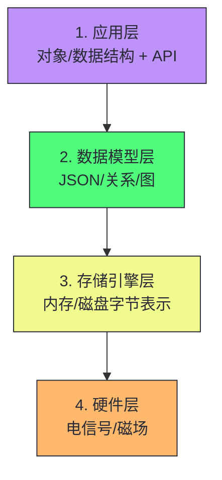
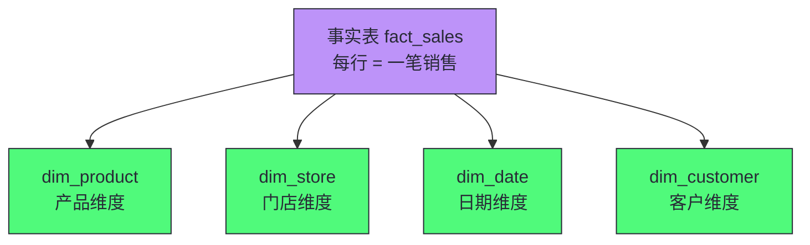
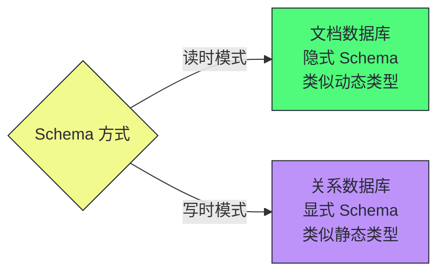
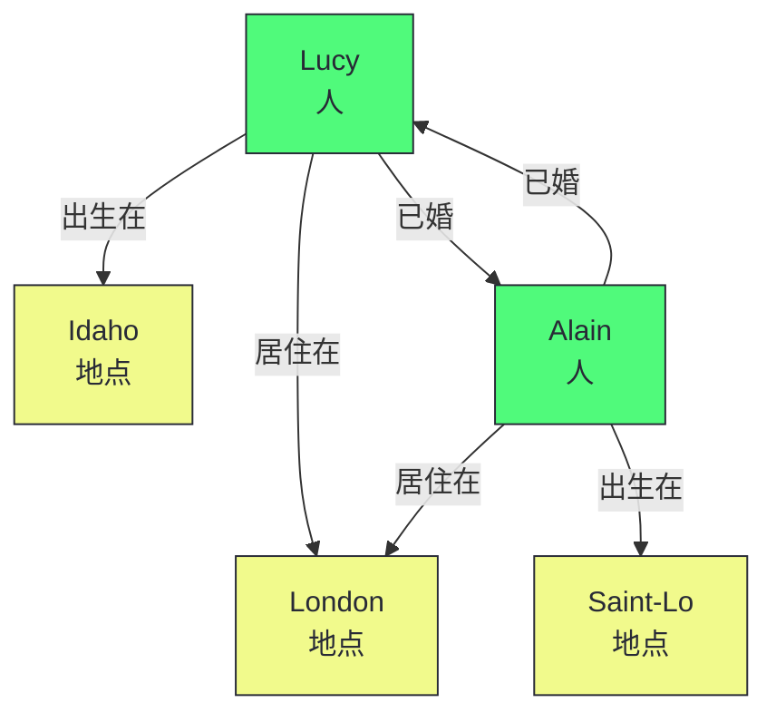

# 03 数据模型与查询语言：关系、文档与图的范式之争

> [!abstract] 摘要
> 本文深入数据系统中最核心的设计决策——数据模型的选择。数据模型不仅影响数据的存储方式，更深刻地影响我们思考问题的方式。文章从"数据模型的层次堆叠"切入，讲透关系模型、文档模型、图模型三大范式的本质差异和适用边界。关系模型部分讲清阻抗不匹配、规范化与反规范化的权衡、星型/雪花型模式；文档模型部分讲清一对多关系的树形结构、Schema 灵活性（读时模式 vs 写时模式）、数据局部性优势；图模型部分讲清属性图模型、多对多关系的自然表达、图遍历查询。之后讨论声明式查询语言的力量——为什么 SQL 比 imperative 代码更强大，以及文档数据库与关系数据库的趋同趋势。最后给出数据模型选型的决策框架。核心认知：没有"最优"的数据模型，只有"最匹配数据关系特征"的模型——一对多树形结构选文档模型，多对多复杂关系选图模型，混合关系选关系模型，分析型工作负载选星型模式。数据模型的选择是架构设计中最难逆转的决策之一。

---

## 第 1 章 数据模型的层次堆叠

### 1.1 软件是数据模型的层层堆叠

大多数应用程序通过一层层堆叠数据模型构建。每一层的关键问题是如何用下一层来表述：



每一层通过提供干净的数据模型来隐藏其下各层的复杂性。这种抽象使得不同群体的人——数据库供应商的工程师和使用数据库的应用开发者——能够有效协作。

> [!info] 核心概念：数据模型决定思考方式
> 数据模型或许是软件开发中最重要的部分，因为它不仅影响软件的编写方式，还影响我们思考问题的方式。用关系模型思考，你会自然地将世界分解为实体和关系；用文档模型思考，你会自然地将世界分解为自包含的树形结构；用图模型思考，你会自然地将世界分解为顶点和边。数据模型的选择决定了你能"看到"什么和"忽略"什么。维特根斯坦说"我的语言的界限意味着我的世界的界限"——数据模型就是数据的语言。

### 1.2 声明式查询语言的力量

本章讨论的查询语言（SQL、Cypher、SPARQL、Datalog）都是**声明式**的——你指定想要的数据模式（结果必须满足什么条件、如何转换），但不指定如何实现。

声明式查询语言的核心优势：

1. **简洁性**：通常比 imperative 代码更简洁
2. **实现无关性**：隐藏查询引擎的实现细节，数据库可以在不改变查询的情况下引入性能优化
3. **并行性**：数据库可以在多 CPU 核心和机器上并行执行声明式查询，而手写并行算法非常困难

> [!note] 设计哲学：声明式是数据系统抽象的核心
> 声明式查询语言之所以强大，是因为它将"做什么"和"怎么做"分离。开发者只需声明"我要什么数据"，查询优化器决定"怎么高效获取"。这种分离使得数据库可以不断优化执行策略（新的索引类型、新的连接算法、新的并行方案），而应用代码无需修改。这就是为什么 SQL 存活了 50 年——它的声明式本质使其实现可以不断进化，而查询接口保持稳定。

---

## 第 2 章 关系模型

### 2.1 关系模型的基础

关系模型由 Edgar Codd 于 1970 年提出。数据被组织成关系（表），每个关系是元组（行）的无序集合。关系模型在 1980 年代中期成为主流，至今仍是大多数结构化数据存储的首选。

关系模型经历了多次挑战——网状模型、层次模型、对象数据库、XML 数据库、NoSQL——但每次都保持了主导地位。SQL 不断进化以吸纳竞争对手的特性（XML 支持、JSON 支持、图查询支持）。

### 2.2 阻抗不匹配

面向对象编程语言与关系型表之间存在**阻抗不匹配**（Impedance Mismatch）——应用代码中的对象模型与数据库的表/行/列模型需要笨拙的翻译层。

ORM（对象关系映射）框架如 ActiveRecord 和 Hibernate 减少了样板代码，但无法完全隐藏两种模型的差异。ORM 的常见问题：

- **N+1 查询问题**：显示 N 条评论及其作者，ORM 可能执行 1 次查询获取评论 + N 次查询获取每条评论的作者，而非 1 次 JOIN 查询
- **自动生成的 Schema 可能笨拙**：对直接访问数据库的用户不友好
- **复杂查询仍需手写 SQL**：ORM 适合简单 CRUD，复杂查询仍需绕过 ORM

> [!info] 核心概念：阻抗不匹配的由来
> 术语"阻抗不匹配"借用于电子学。每个电路在输入输出上有一定阻抗。当两个电路的阻抗匹配时，功率传输最大；不匹配时导致信号反射。数据库（关系模型）与应用（对象模型）之间的"阻抗不匹配"导致数据在两层之间传递时需要转换，这种转换引入复杂性和性能开销。

### 2.3 规范化与反规范化

**规范化（Normalization）**：对人类有意义的信息只存储在一个地方，所有引用使用 ID。例如 `region_id` 引用区域表，而非每行存储 "Washington, DC" 字符串。

**反规范化（Denormalization）**：在多个地方复制人类有意义的信息。例如每个用户资料中直接存储组织名称和 Logo URL。

| 维度 | 规范化 | 反规范化 |
|------|--------|---------|
| **写入** | 更快（只更新一个副本） | 更慢（需更新所有冗余副本） |
| **读取** | 更慢（需要 JOIN） | 更快（减少 JOIN） |
| **一致性** | 容易保证（单一来源） | 需要额外机制保持副本一致 |
| **磁盘空间** | 更少 | 更多 |
| **适用场景** | OLTP（频繁更新） | OLAP（批量更新，读性能优先） |

> [!note] 设计哲学：ID 不变，有意义的信息会变
> 规范化的核心洞察是：对人类有意义的任何事物都可能在未来需要更改（名称变更、Logo 更新、拼写修正）。ID 对人类没有意义，因此永远不需要改变。用 ID 引用，即使引用的信息变化，ID 保持不变，只需更新一处。这是规范化的根本动机——不是"减少冗余"本身，而是"减少需要同步更新的副本数量"。

### 2.4 星型模式与雪花型模式

数据仓库通常使用**星型模式**（Star Schema）：

- **事实表（Fact Table）**：中心，每行代表一个事件（如一笔销售），包含外键引用维度表和度量值（如售价）
- **维度表（Dimension Table）**：围绕事实表，代表事件的"谁、什么、哪里、何时"（如产品、门店、日期）



**雪花型模式**（Snowflake Schema）：维度进一步分解为子维度（如品牌和类别单独建表）。更规范化，但分析师通常更偏好星型模式的简单结构。

**大宽表（One Big Table, OBT）**：完全省略维度表，将维度信息折叠为事实表中的反规范化列。需要更多存储，但有时能加快查询。

> [!info] 核心概念：分析场景中反规范化是无害的
> 在 OLTP 中，反规范化导致一致性问题（更新冗余副本时可能不一致）。但在分析场景中，数据通常代表历史日志，不会发生变化（偶尔修正错误除外）。因此反规范化在分析场景中无害，反而能加速查询。这是 OLTP 和 OLAP 数据模型设计原则的根本区别。

---

## 第 3 章 文档模型

### 3.1 一对多关系的树形结构

文档模型（通常以 JSON 表示）最适合**一对多关系**的树形结构数据。以 LinkedIn 个人资料为例：

```json
{
  "user_id": 251,
  "first_name": "Barack",
  "positions": [
    {"job_title": "President", "organization": "United States"},
    {"job_title": "US Senator", "organization": "United States Senate"}
  ],
  "education": [
    {"school_name": "Harvard University", "start": 1988, "end": 1991}
  ],
  "contact_info": {
    "website": "https://barackobama.com",
    "x": "https://x.com/barackobama"
  }
}
```

在关系模型中，这需要 users 表 + positions 表 + education 表 + contact_info 表，查询时需要多表 JOIN。在文档模型中，所有相关信息在一处——更好的**数据局部性**。

> [!info] 核心概念：数据局部性
> 文档通常存储为单条连续字符串。如果应用经常需要访问整个文档（如渲染网页），这种存储局部性具有性能优势——一次 I/O 即可获取全部相关数据。关系模型中数据分散在多个表中，需要多次索引查找。但局部性优势只在需要文档大部分内容时适用——如果只需大文档的一小部分，加载整个文档是浪费。因此建议保持文档较小，避免频繁的小规模更新。

### 3.2 Schema 灵活性：读时模式 vs 写时模式

文档数据库常被称为"无模式"（Schemaless），但这具有误导性。读取数据的代码通常假定某种结构——存在**隐式 Schema**，只是不由数据库强制。

更准确的术语：

- **读时模式（Schema-on-Read）**：数据结构是隐式的，仅在读取时解释（文档数据库）
- **写时模式（Schema-on-Write）**：Schema 是显式的，数据库在写入时确保数据符合（关系数据库）



Schema 演进的差异：假设要将 `name` 字段拆分为 `first_name` 和 `last_name`：

- **文档数据库**：直接开始写入包含新字段的新文档，应用代码处理旧文档的读取
- **关系数据库**：执行 `ALTER TABLE ADD COLUMN` + `UPDATE` 迁移所有行

> [!warning] 生产避坑：读时模式的隐性代价
> 读时模式的代价是：应用中读取数据库的每个部分都需要处理可能很久以前写入的旧格式文档。随着 Schema 演进次数增加，处理旧格式的代码会累积成技术债。写时模式通过一次性迁移消除旧格式，但迁移本身在大表上可能很慢。实践中，两种方法可以混合——在关系数据库中添加 `DEFAULT NULL` 列（快速），在读取时填充（类似读时模式），避免昂贵的全表 UPDATE。

### 3.3 文档模型的局限

文档模型的主要局限：

1. **多对多关系不自然**：多对多关系需要"双向"查询，文档模型需要两侧存储 ID 引用（反规范化，可能不一致）
2. **无法直接引用嵌套项**：只能说"用户 251 的职位列表中的第二项"，而非通过 ID 引用
3. **连接支持弱**：许多文档数据库对 JOIN 支持有限，需要在应用代码中执行连接

> [!note] 设计哲学：文档数据库与关系数据库的趋同
> 文档数据库和关系数据库正在趋同。关系数据库增加了 JSON 类型和文档内索引（PostgreSQL 的 JSONB、MySQL 的 JSON 函数）；文档数据库增加了 JOIN 和二级索引（MongoDB 的 $lookup）。Codd 最初的关系模型就允许"非简单域"——行中的值可以是嵌套关系。30 多年后的 JSON 支持本质上是回归了 Codd 的原始设计。关系-文档混合体是强大的组合。

---

## 第 4 章 图模型

### 4.1 什么时候需要图模型

如果多对多关系在数据中非常普遍，将数据建模为图就变得更自然。图由两种对象组成：

- **顶点（Vertex/Node）**：实体——人、地点、事件、网页
- **边（Edge/Relationship）**：顶点之间的关系——朋友、位于、参加了、链接到

典型图数据场景：

- **社交图谱**：顶点是人，边是"认识"关系
- **网络图**：顶点是网页，边是 HTML 链接
- **道路网络**：顶点是路口，边是道路
- **知识图谱**：顶点是实体（组织、人物、地点），边是事实关系



### 4.2 属性图模型

属性图模型（Neo4j、Memgraph、KùzuDB 等实现）中：

**每个顶点**：
- 唯一标识符
- 标签（描述对象类型）
- 出边集合、入边集合
- 属性集合（键值对）

**每条边**：
- 唯一标识符
- 起始顶点、结束顶点
- 标签（描述关系类型）
- 属性集合

> [!info] 核心概念：图模型的"异构性"优势
> 图的一个强大之处是可以在单个数据库中存储完全不同类型的对象。Facebook 的图包含人、地点、事件、签到、评论等多种顶点类型，以及朋友、签到于、评论了、参加了等多种边类型。关系模型处理这种异构性需要大量表和 JOIN，而图模型用统一的顶点/边抽象自然表达。这是图模型在社交网络、知识图谱、推荐系统等场景中的核心优势。

### 4.3 图遍历查询

图查询的核心是**遍历**——从一个顶点出发，沿着边访问相邻顶点。例如"找到从 Idaho 移居到欧洲的所有人"：

1. 从 Idaho 顶点出发
2. 沿"出生在"的反向边找到所有出生在 Idaho 的人
3. 对每个人，沿"居住在"的边找到当前居住地
4. 检查居住地是否在欧洲

这种多跳遍历在图数据库中是原生操作，但在关系数据库中需要多次自连接——随着遍历深度增加，SQL 查询的复杂度急剧上升。

> [!note] 设计哲学：图模型 vs 关系模型的递归查询
> 关系模型可以用递归 CTE（Common Table Expression）表达图遍历，但语法笨拙且性能通常不如原生图数据库。图数据库为遍历做了专门优化——邻接表存储使沿边跳转是 O(1) 操作，而关系模型中的 JOIN 需要索引查找。对于深度超过 2-3 跳的遍历，图数据库的性能优势显著。但对于浅层查询（1-2 跳），关系数据库的索引 JOIN 性能可能相当。

### 4.4 Cypher vs SQL：图查询的表达力差距

以"找到从美国移民到欧洲的人"为例，对比 Cypher 和 SQL 的表达力：

**Cypher（4 行）**：
```cypher
MATCH
  (person) -[:BORN_IN]->  () -[:WITHIN*0..]-> (:Location {name:'United States'}),
  (person) -[:LIVES_IN]-> () -[:WITHIN*0..]-> (:Location {name:'Europe'})
RETURN person.name
```

**SQL 递归 CTE（31 行）**：
```sql
WITH RECURSIVE
  in_usa(vertex_id) AS (
      SELECT vertex_id FROM vertices
        WHERE label = 'Location' AND properties->>'name' = 'United States'
    UNION
      SELECT edges.tail_vertex FROM edges
        JOIN in_usa ON edges.head_vertex = in_usa.vertex_id
        WHERE edges.label = 'within'
  ),
  in_europe(vertex_id) AS ( ... )
  -- 还需要 born_in_usa 和 lives_in_europe 两个 CTE
  -- 最后 JOIN 取交集
```

一个 4 行的 Cypher 查询在 SQL 中需要 31 行——这充分说明了正确选择数据模型和查询语言能带来多大的差异。Cypher 的 `:WITHIN*0..` 语法（类似正则表达式的 `*`）简洁地表达了"沿 WITHIN 边走零次或多次"的可变长度遍历，而 SQL 需要递归 CTE 来表达同样的逻辑。

> [!info] 核心概念：属性图可以用关系模型表示
> 属性图可以用两张关系表表示——vertices 表和 edges 表，edges 表的 tail_vertex 和 head_vertex 上建索引。这意味着你可以在关系数据库中存储图数据。问题不在于"能不能存"，而在于"查询是否方便"——可变长度遍历在 SQL 中需要递归 CTE，语法笨拙且性能通常不如原生图数据库的邻接表遍历。GQL（图查询语言）ISO 标准已于 2024 年发布，未来可能推动图数据库查询语言的统一。

### 4.5 三元组存储与 SPARQL

三元组存储是图模型的另一种表达，所有信息以**(主语, 谓语, 宾语)**三元组形式存储：

- `(Jim, likes, bananas)` — 主语 Jim，谓语 likes，宾语 bananas
- `(lucy, bornIn, idaho)` — 谓语是边，主语和宾语是顶点
- `(lucy, birthYear, 1989)` — 谓语是属性键，宾语是属性值

三元组存储使用 **RDF（Resource Description Framework）** 数据模型，查询语言是 **SPARQL**。SPARQL 与 Cypher 非常相似（Cypher 借鉴了 SPARQL 的模式匹配语法）：

```sparql
PREFIX : <urn:example:>
SELECT ?personName WHERE {
  ?person :name ?personName.
  ?person :bornIn  / :within* / :name "United States".
  ?person :livesIn / :within* / :name "Europe".
}
```

> [!info] 核心概念：RDF 的 URI 命名
> RDF 的一个独特设计是主语、谓语、宾语通常是 URI（如 `<http://my-company.com/namespace#within>`）。这使得不同组织的数据可以合并而不会产生命名冲突——你的 `within` 和别人的 `within` 是不同的 URI。这是语义网（Semantic Web）的遗产——虽然最初的语义网愿景未实现，但 RDF/SPARQL 在知识图谱、生物医学本体等领域找到了实际用途。

### 4.6 Datalog：递归关系查询的先驱

Datalog 比 SPARQL 和 Cypher 古老得多，起源于 1980 年代的学术研究。它在软件工程师中知名度较低，但表现力非常强，尤其擅长处理复杂递归查询。

Datalog 的核心思想是将查询表达为**逻辑规则**——定义谓词（predicate）之间的推导关系。与 Cypher/SPARQL 的模式匹配不同，Datalog 可以将中间结果定义为新的谓词，在后续规则中复用——类似于 SQL 的 CTE 但更灵活。

Datomic、CozoDB、LinkedIn 的 LIquid 等数据库使用 Datalog 作为查询语言。

> [!note] 设计哲学：图查询语言的多样性反映了图数据的多样性
> Cypher、SPARQL、Datalog、GSQL、PGQL、GQL——图查询语言的多样性反映了图数据场景的多样性。属性图模型（Cypher）适合社交网络和推荐系统；RDF/SPARQL 适合语义网和知识图谱；Datalog 适合复杂递归推理。GQL ISO 标准的发布可能在未来几年推动图查询语言的统一，但目前选择图数据库时仍需考虑查询语言的适配度。

---

## 第 5 章 数据模型选型决策框架

### 5.1 按关系特征选型

| 数据关系特征 | 推荐模型 | 典型场景 |
|-------------|---------|---------|
| 一对多树形结构 | 文档模型 | 用户资料、商品目录、CMS 内容 |
| 多对一/多对多简单关系 | 关系模型 | 电商订单、ERP、CRM |
| 多对多复杂关系 | 图模型 | 社交网络、知识图谱、推荐系统 |
| 事件日志 + 维度分析 | 星型模式 | 数据仓库、BI 报表 |
| 异构混合关系 | 关系+文档混合 | 现代全功能应用 |

### 5.2 按工作负载选型

| 工作负载 | 推荐模型 | 原因 |
|---------|---------|------|
| OLTP 点查询 | 关系模型 | 索引高效，JOIN 灵活 |
| OLTP 文档加载 | 文档模型 | 数据局部性好，无需 JOIN |
| OLAP 聚合分析 | 星型/雪花模式 | 针对分析查询优化 |
| 图遍历查询 | 图模型 | 原生遍历优化 |
| 混合 OLTP+OLAP | HTAP（关系+列存） | 两种引擎共存 |

### 5.3 Schema 策略选型

| 场景 | 推荐 Schema 策略 | 原因 |
|------|----------------|------|
| 数据结构稳定、统一 | 写时模式（关系） | 数据库强制一致性 |
| 数据结构异构、多变 | 读时模式（文档） | 灵活应对结构变化 |
| 数据由外部系统决定 | 读时模式 | 无法控制外部结构 |
| 需要严格数据质量 | 写时模式 | 数据库层强制约束 |
| 快速迭代原型 | 读时模式 | 无需迁移即可改 Schema |

> [!warning] 生产避坑：数据模型是最难逆转的决策
> 数据模型的选择是架构设计中最难逆转的决策之一。从关系模型迁移到文档模型，或从文档迁移到图，需要重写大量应用代码和数据迁移脚本。相比之下，存储引擎的更换（如从 B-Tree 换到 LSM-Tree）影响小得多——查询接口不变，只是底层性能特征变化。因此，数据模型的选择应该在架构设计早期慎重考虑，投入足够的时间分析数据的关系特征和访问模式。

---

## 第 6 章 查询语言的演进

### 6.1 SQL vs NoSQL 查询语言

关系数据库使用 SQL——声明式查询语言。文档数据库的查询语言更加多样：

- **键值访问**：仅通过主键（如 Redis）
- **文档查询 API**：MongoDB 的查询语法
- **聚合管道**：MongoDB 的 aggregation pipeline
- **JSON 查询语言**：JSONPath、JSON Pointer

MongoDB 聚合管道示例（按月统计鲨鱼观测数量）：

```javascript
db.observations.aggregate([
    { $match: { family: "Sharks" } },
    { $group: {
        _id: { year: { $year: "$observationTimestamp" }, month: { $month: "$observationTimestamp" } },
        totalAnimals: { $sum: "$numAnimals" }
    }}
]);
```

等价 SQL：

```sql
SELECT date_trunc('month', observation_timestamp) AS observation_month,
       sum(num_animals) AS total_animals
FROM observations
WHERE family = 'Sharks'
GROUP BY observation_month;
```

两者表达能力相似，差异主要在语法风格——SQL 的英文句子式 vs 聚合管道的 JSON 管道式。

### 6.2 图查询语言

图数据库有专门的查询语言：

- **Cypher**（Neo4j）：声明式图模式匹配
- **SPARQL**：语义网查询语言
- **Datalog**：逻辑编程风格的查询
- **GraphQL**：Facebook 开发的 API 查询语言

这些语言的核心特征是**图模式匹配**——用模式描述想要的顶点和边结构，数据库找到匹配的子图。

### 6.3 MapReduce 与数据流模型

MapReduce 是一种处理大量数据的编程模型，受函数式编程启发。它介于声明式查询和 imperative 代码之间：

- **Map**：对每条记录应用一个函数，产生中间键值对
- **Reduce**：按键分组中间结果，对每组应用一个聚合函数

MapReduce 的局限在于它太低级——开发者需要手写 map 和 reduce 函数，而 SQL 的 GROUP BY 可以声明式表达同样的聚合。现代数据系统（如 Spark）已经将 MapReduce 抽象为更高层的声明式 API。

### 6.4 DataFrames、矩阵与数组

数据科学家通常不使用 SQL，而是使用 Python 的 Pandas、R 语言、或 Spark 的 DataFrame API。这些工具基于**DataFrame**数据模型——一种表格数据结构，类似于关系表但带有更丰富的编程接口。

DataFrame 与关系表的关键区别：

- **API 风格**：DataFrame 使用方法链式调用（`df.filter().group().agg()`）而非 SQL 的声明式语法
- **类型系统**：DataFrame 与编程语言（Python/Scala/R）的类型系统集成，而非 SQL 的类型系统
- **惰性求值**：Spark DataFrame 的操作是惰性的——构建执行计划但不立即执行，直到触发 action（如 `collect()`、`write()`），允许优化器全局优化

矩阵和数组是另一种数据模型，用于机器学习和科学计算。NumPy 数组、Spark MLlib 的分布式矩阵、TensorFlow 张量都是这一模型的实现。矩阵模型关注数值运算（矩阵乘法、转置、分解），而非关系模型的集合运算。

> [!info] 核心概念：数据模型的"用户分群"
> 不同的数据模型服务于不同的用户群体：
> - **SQL/关系模型**：后端工程师、DBA、业务分析师
> - **DataFrame/数组模型**：数据科学家、ML 工程师
> - **图模型**：社交网络工程师、知识图谱工程师
> - **文档模型**：全栈工程师、前端工程师
>
> 数据基础设施的选型不仅取决于数据特征，还取决于"谁使用数据"。如果数据科学家是主要用户，DataFrame API 可能比 SQL 更合适——即使底层存储是关系型的。

### 6.5 事件溯源与时间查询

事件溯源（Event Sourcing）是一种将状态变更记录为不可变事件序列的数据模型。与传统的"当前状态"模型不同，事件溯源存储所有状态变更的历史，当前状态通过重放事件序列得到。

事件溯源的核心优势：

- **审计追溯**：完整的历史记录，任何时刻的状态都可重建
- **时间旅行查询**：查询任意历史时刻的状态
- **事件回放**：可以从事件日志重建新的衍生数据视图

事件溯源与[[01 数据密集型系统的本质：可靠性、可扩展性与可维护性的三角|记录系统与衍生数据]]的概念密切相关——事件日志是记录系统，当前状态是衍生数据。我们将在后续文章（流处理、CDC）中深入讨论这一模型。

> [!info] 核心概念：声明式查询是数据系统的"API 设计哲学"
> 从 SQL 到 Cypher 到 Spark DataFrame API，声明式查询是数据系统的统一设计哲学。它的核心价值是"实现无关性"——查询引擎可以不断优化执行策略，而查询接口保持稳定。这使得数据系统可以跨越硬件世代（单核→多核→GPU→分布式）、存储介质（HDD→SSD→NVMe→远程存储）持续进化，而应用代码无需修改。这是数据系统能长期存在的关键——SQL 存活 50 年不是偶然。

---

## 总结

数据模型的核心知识可以归纳为以下主线：

1. **数据模型决定思考方式**。选择关系模型，你自然分解世界为实体和关系；选择文档模型，你自然分解为自包含树；选择图模型，你自然分解为顶点和边。数据模型是数据的"语言"。

2. **关系模型是多对多关系的通用解**。规范化减少冗余副本，JOIN 解析 ID 引用。星型/雪花型模式是分析型工作负载的关系模型变体。ORM 缓解但不能消除阻抗不匹配。

3. **文档模型是一对多树形结构的自然解**。数据局部性好，Schema 灵活（读时模式），无需 JOIN 即可加载完整文档。局限是多对多关系不自然、JOIN 支持弱。

4. **图模型是多对多复杂关系的原生解**。顶点和边的抽象自然表达异构关系，图遍历是原生操作。社交网络、知识图谱、推荐系统是典型场景。

5. **规范化 vs 反规范化是读写权衡**。规范化写入快、读取慢（需 JOIN）；反规范化读取快、写入慢（需更新冗余副本）。OLTP 偏规范化，OLAP 偏反规范化。

6. **读时模式 vs 写时模式是灵活性 vs 安全性的权衡**。读时模式灵活但需处理旧格式；写时模式安全但迁移成本高。实践中可混合——添加 DEFAULT NULL 列 + 读取时填充。

7. **声明式查询语言是数据系统的核心抽象**。SQL/Cypher/SPARQL 都是声明式的——声明"要什么"而非"怎么做"，使查询引擎可以持续优化而接口不变。这是数据系统长期存活的关键。

8. **数据模型是最难逆转的架构决策**。从一种模型迁移到另一种需要重写应用代码和数据迁移。早期投入时间分析数据关系特征和访问模式，比后期迁移的代价小得多。

> [!info] 专栏导航
> 本文是 [[00 专栏导览|数据密集型系统架构实战专栏]] 的第 03 篇，讲透了数据模型的三大范式。上一篇 [[02 存储引擎深潜：从 LSM-Tree 到 B-Tree 的写读权衡]] 深入了数据"如何存储"；本文回答了数据"如何建模"；下一篇 [[04 编码与演化：Schema 演进与数据兼容性的工程实践]] 将讨论数据"如何演化"——向前兼容、向后兼容、Avro/Protobuf/JSON 的编码对比，以及 API 演化对系统可演化性的影响。

---

## 延伸思考

1. **你的核心数据是一对多、多对多还是混合关系？** 这决定了你应该选文档模型、图模型还是关系模型。很多团队默认选关系模型，但如果核心数据是一对多树形结构，文档模型可能更自然。
2. **你的 Schema 变更频率如何？** 频繁变更选读时模式；稳定且需要严格约束选写时模式。你的应用代码是否在处理"很久以前写入的旧格式"的技术债？
3. **你的分析查询是否在星型模式上运行？** 如果事实表有 100+ 列但查询只用 5 列，结合上一篇的列式存储知识，你应该评估列式存储 + 星型模式的组合收益。
4. **你的多对多关系是否需要多跳遍历？** 如果是，关系模型的递归 CTE 可能不够——评估图数据库是否能显著简化查询逻辑和提升性能。
5. **你的查询语言是否声明式？** 如果你在用 imperative 代码做数据聚合，评估是否能用 SQL 或 DataFrame API 替代——声明式查询让数据库优化器帮你做性能优化。

6. **你的数据模型是否服务于正确的用户群体？** 如果数据科学家是主要消费者，DataFrame API 可能比 SQL 更合适。如果分析师是主要消费者，SQL + BI 工具是标准选择。数据模型的选择不只是技术决策，也是组织决策。

---

*本文基于 Martin Kleppmann《Designing Data-Intensive Applications》2nd Edition 第 3 章整合而成，加入了作者的结构化重组和工程实践理解。*
