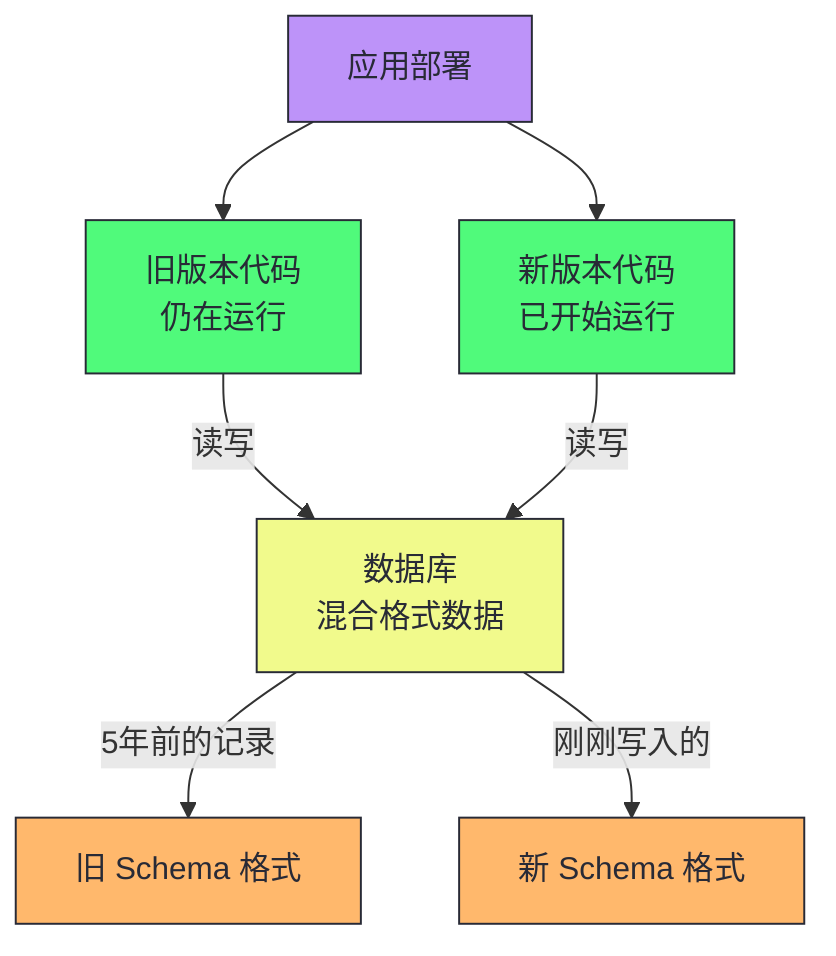
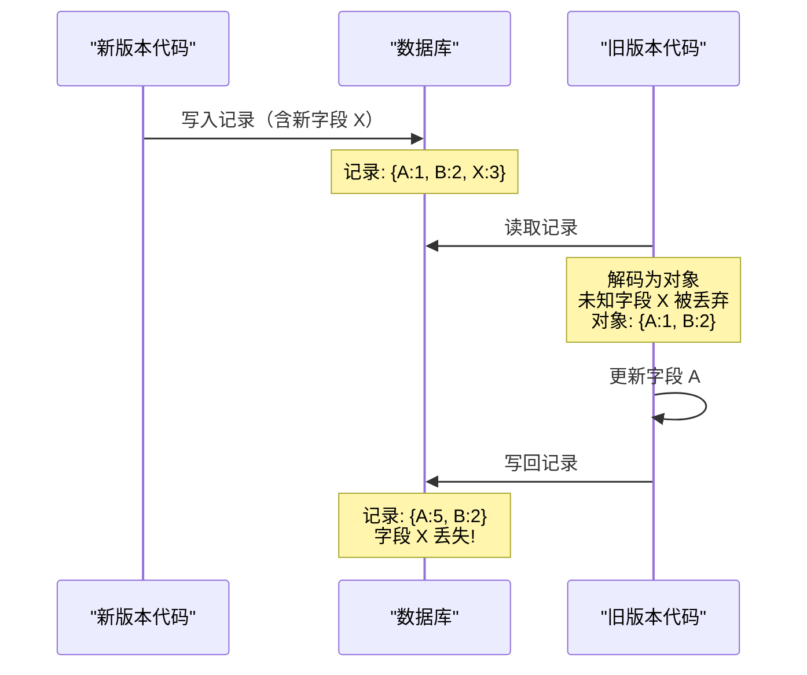
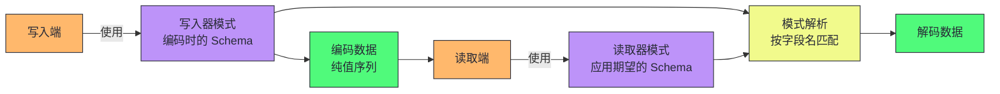
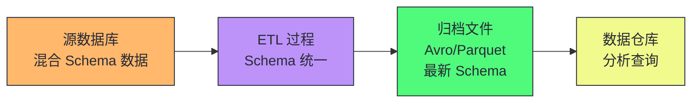
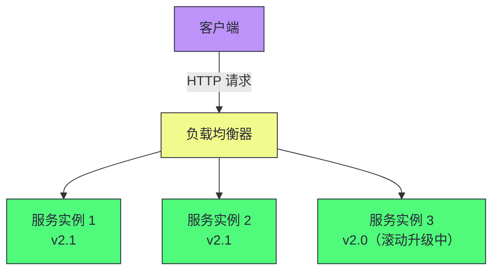
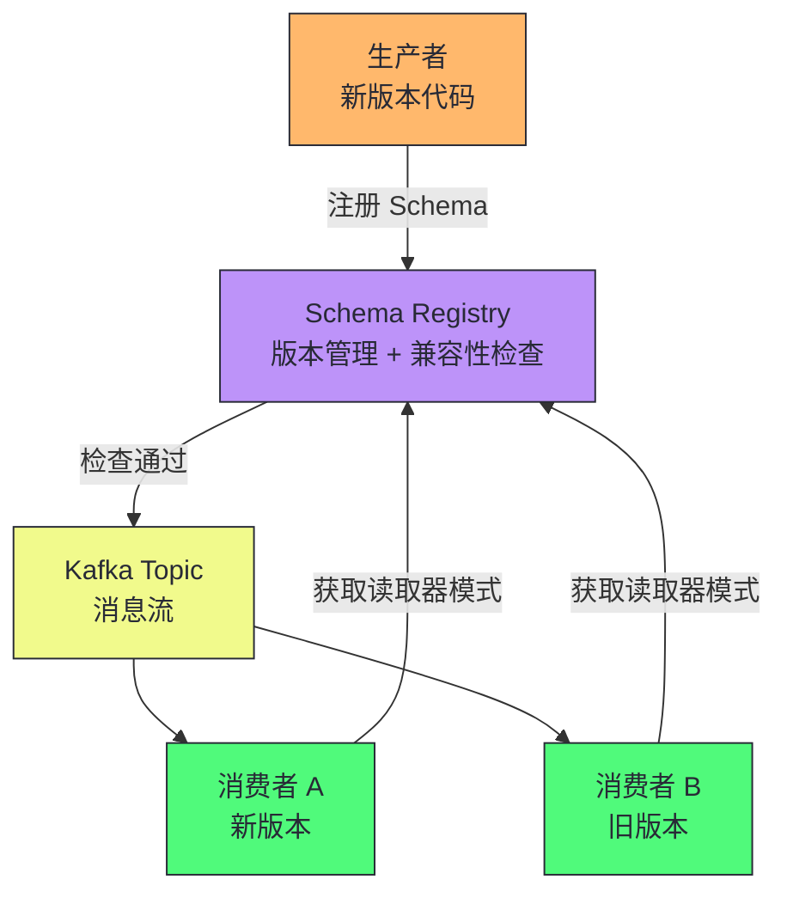

# 04 编码与演化：Schema 演进与数据兼容性的工程实践

> [!abstract] 摘要
> 本文深入数据系统在时间维度上的核心挑战——演化。应用功能不断变化，数据格式和 Schema 也随之变化，但代码变更无法瞬间完成（滚动升级、客户端不更新），导致新旧版本代码和数据格式必须共存。文章首先讲清两种兼容性的精确定义：向后兼容（新代码读旧数据）和向前兼容（旧代码读新数据），以及向前兼容的"数据丢失陷阱"。然后系统对比四大编码格式——JSON/XML（文本格式，无 Schema 紧凑性差但人类可读）、语言专用格式（Java Serializable/pickle，安全性和跨语言问题）、Protocol Buffers（字段标签驱动的兼容性）、Avro（写入器/读取器模式解析，动态 Schema 友好）。之后深入数据流的三种模式——通过数据库（"数据比代码活得更久"）、通过服务（REST vs RPC 的根本差异、服务网格）、通过异步消息（Actor 模型、消息队列）。最后给出 Schema 演化的工程实践建议。核心认知：演化能力是系统可维护性的核心指标——选择支持向前/向后兼容的编码格式，建立 Schema 注册表，在部署前检查兼容性，是大型系统长期演化的基础设施。

---

## 第 1 章 演化的必然性与兼容性定义

### 1.1 为什么代码和数据的新旧版本必须共存

应用程序不可避免地会随时间变化——新功能发布、需求理解深化、业务环境变化。功能变更通常要求数据格式或 Schema 变更。但代码变更无法瞬间完成：

- **服务器端应用**：滚动升级（分阶段部署），一次只部署少数节点，新旧版本同时运行
- **客户端应用**：用户可能不会立即安装更新，旧版本长期存在

这意味着旧版本和新版本的代码，以及旧版本和新版本的数据格式，可能同时共存于系统中。



### 1.2 两种兼容性的精确定义

为使系统在新旧共存时继续运行，需要保持两个方向的兼容性：

- **向后兼容性（Backward Compatibility）**：新代码可以读取旧代码写入的数据
- **向前兼容性（Forward Compatibility）**：旧代码可以读取新代码写入的数据

> [!info] 核心概念：向后兼容容易，向前兼容难
> 向后兼容通常不难——作为新代码的作者，你知道旧代码写入的数据格式，可以显式处理。向前兼容更棘手——它要求旧代码忽略新版本代码所做的添加，即使旧代码无法理解这些新增内容。向前兼容的本质是"旧代码必须对未知字段保持透明——读取时忽略，写回时保留"。

### 1.3 向前兼容的数据丢失陷阱

向前兼容有一个隐蔽的陷阱：假设你向 Schema 添加了一个字段，新代码创建了包含该字段的记录并存储。随后旧版本代码读取该记录，更新它，并写回。如果记录被解码成一个不显式保留未知字段的对象，新字段的数据会在旧代码写回时丢失。



> [!warning] 生产避坑：向前兼容必须显式保留未知字段
> 这个陷阱在实践中经常出现——尤其是使用 ORM 框架时，ORM 将数据库行映射为对象，未知字段通常被丢弃。解决方案是使用支持"透传未知字段"的编码格式（如 Protobuf 的 `unknown fields` 特性），或在应用层显式保留原始编码数据。Avro 的写入器/读取器模式解析机制从根本上避免了这个问题——未知字段通过模式匹配自动忽略，不会影响写回。

---

## 第 2 章 编码格式对比

### 2.1 内存表示与字节序列的转换

程序以两种形式处理数据：

- **内存中**：对象、结构体、列表、哈希表——为 CPU 高效访问优化（使用指针）
- **写入文件/网络时**：自包含的字节序列——指针对其他进程无意义

从内存表示到字节序列的转换称为**编码**（Encoding，也称为序列化/Serialization），反向过程称为**解码**（Decoding，也称为反序列化/Deserialization）。

> [!note] 设计哲学：术语"序列化"的歧义
> "序列化"在事务上下文中也使用（指事务的执行顺序），含义完全不同。为避免歧义，本文使用"编码/解码"。在分布式系统讨论中，明确区分"数据编码的序列化"和"事务执行的序列化"很重要——两者是完全不同的概念。

### 2.2 语言专用格式：方便但危险

许多编程语言内置了对象编码支持——Java 的 `java.io.Serializable`、Python 的 `pickle`、Ruby 的 `Marshal`。这些格式方便但问题严重：

| 问题 | 说明 |
|------|------|
| **语言锁定** | 用其他语言读取数据很困难，长期被限制在当前语言 |
| **安全风险** | 解码需要实例化任意类，攻击者可利用此执行任意代码 |
| **版本化缺失** | 向前/向后兼容通常是事后才考虑的 |
| **效率差** | Java Serializable 因性能差和编码臃肿而臭名昭著 |

> [!warning] 生产避坑：永远不要用语言专用格式做持久化或跨进程通信
> 语言专用格式仅适合极短暂的临时用途（如进程内缓存序列化）。用于持久化存储或网络通信会创建语言锁定和安全风险。Python 的 pickle 反序列化漏洞是常见的攻击向量——永远不要反序列化不受信任的数据。

### 2.3 JSON、XML 及其二进制变体

JSON 和 XML 是跨语言的文本编码格式，广泛支持。它们的问题：

- **数字歧义**：XML/CSV 无法区分数字和数字字符串；JSON 不区分整数和浮点数，不指定精度。大于 2^53 的整数在 JavaScript 中解析不准确（Twitter 的 API 因此同时返回 JSON 数字和十进制字符串）
- **二进制数据支持差**：JSON/XML 对 Unicode 字符串支持好，但不支持二进制字符串。Base64 编码会使数据增大三分之一
- **Schema 复杂**：JSON Schema 和 XML Schema 功能强大但学习和实现复杂
- **冗长**：文本格式比二进制格式占用更多空间

**二进制变体**（MessagePack、CBOR、BSON、UBJSON）比文本 JSON 略紧凑，但由于不使用 Schema，必须包含所有字段名——空间节省有限（示例记录从 81 字节减到 66 字节）。

> [!info] 核心概念：JSON Schema 的开放与封闭内容模型
> JSON Schema 支持开放内容模型（`additionalProperties: true`，默认）和封闭内容模型（`additionalProperties: false`）。开放模型允许未定义字段以任意类型存在——这是向前兼容的基础。封闭模型只允许显式定义的字段——更严格但阻碍演化。大多数生产系统使用开放模型以支持 Schema 演进。

### 2.4 Protocol Buffers：字段标签驱动的兼容性

Protocol Buffers（protobuf）是 Google 开发的二进制编码格式，要求使用 Schema（IDL 定义）：

```protobuf
syntax = "proto3";

message Person {
    string user_name = 1;
    int64 favorite_number = 2;
    repeated string interests = 3;
}
```

Protobuf 的核心设计是**字段标签**（field tags）——编码数据中不包含字段名，只包含数字标签（1、2、3）。这带来了紧凑性（33 字节 vs MessagePack 的 66 字节）和兼容性规则：

| Schema 变更 | 向后兼容 | 向前兼容 | 说明 |
|------------|---------|---------|------|
| 添加新字段（新标签号） | ✓（旧数据无此字段，用默认值） | ✓（旧代码忽略未知标签） | 必须用新标签号 |
| 删除字段 | ✓（新代码忽略旧标签） | ✓（旧代码用默认值） | 不能复用已删除的标签号 |
| 修改字段名 | ✓ | ✓ | 编码数据不包含字段名 |
| 修改字段标签号 | ✗ | ✗ | **绝对禁止**——所有现有编码数据失效 |
| 修改字段类型 | 部分 | 部分 | 可能截断（如 32 位→64 位整数） |

> [!info] 核心概念：字段标签是 Protobuf 兼容性的基石
> Protobuf 的字段标签是字段的"永久身份证"——一旦分配就不能更改。你可以改字段名（编码数据不含字段名），但绝不能改标签号。删除字段后，其标签号永远不能复用。这是 Protobuf Schema 演化的铁律——违反它会导致所有现有编码数据无法解码。在实践中，应维护一个"已废弃标签号"列表，防止误用。

### 2.5 Avro：写入器/读取器模式解析

Apache Avro 是 Hadoop 生态的二进制编码格式，与 Protobuf 的关键区别是**Schema 中没有字段标签**：

```avdl
record Person {
    string               userName;
    union { null, long } favoriteNumber = null;
    array<string>        interests;
}
```

Avro 编码最紧凑（32 字节），但编码数据中不包含任何字段标识——只是值的连接。解码时必须通过**写入器模式**（编码时使用的 Schema）和**读取器模式**（解码时应用程序期望的 Schema）的匹配来完成。



Avro 的模式解析规则：

- **字段通过名称匹配**（而非标签号），字段顺序不同也没关系
- **写入器有、读取器无的字段**：忽略
- **读取器有、写入器无的字段**：用读取器模式中的默认值填充
- **只能添加/删除有默认值的字段**以保持兼容性

> [!info] 核心概念：Avro 的动态 Schema 优势
> Avro 对动态生成的 Schema 更友好。假设你要将关系数据库内容转储到文件——可以从数据库 Schema 自动生成 Avro Schema（列名映射到字段名），数据库 Schema 变化时只需重新生成 Avro Schema。Protobuf 需要手动分配字段标签，每次数据库 Schema 变化都要小心维护标签映射——动态生成不是 Protobuf 的设计目标。Avro 是为这类场景设计的。

### 2.6 Avro 的写入器模式从哪里来

Avro 解码需要写入器模式，但编码数据中不包含 Schema（否则太臃肿）。写入器模式的获取方式取决于使用场景：

| 场景 | 写入器模式获取方式 |
|------|-------------------|
| **大文件（数百万记录）** | 文件开头包含一次 Schema（Avro 对象容器文件格式） |
| **数据库（独立记录）** | 每条记录开头包含版本号，数据库维护 Schema 版本列表（如 Confluent Schema Registry） |
| **网络连接** | 连接建立时协商 Schema 版本，连接生命周期内使用该版本（Avro RPC 协议） |

> [!note] 设计哲学：Schema 注册表是演化的基础设施
> 维护一个 Schema 版本数据库（Schema Registry）在任何场景下都有用——它作为文档，允许在部署前检查 Schema 变更的前向/后向兼容性。Confluent 的 Schema Registry 是 Kafka 生态的标准实践——生产者写入数据前注册 Schema，消费者读取数据时获取对应版本的 Schema。这种机制使得 Schema 演化成为可控的、可审计的工程流程，而非随意的代码变更。

### 2.7 编码格式选型对比

| 维度 | JSON | Protobuf | Avro |
|------|------|---------|------|
| **人类可读** | ✓ | ✗ | ✗ |
| **Schema 要求** | 可选（JSON Schema） | 必需 | 必需 |
| **编码大小** | 大（含字段名） | 小（字段标签） | 最小（纯值） |
| **向前兼容** | 需要应用层处理 | 内置（忽略未知标签） | 内置（模式解析） |
| **向后兼容** | 需要应用层处理 | 内置（默认值） | 内置（默认值） |
| **动态 Schema** | ✓ | ✗（需手动标签） | ✓（自动生成） |
| **跨语言** | ✓ | ✓（代码生成） | ✓（代码生成） |
| **适用场景** | API 交互、配置文件 | 微服务通信、持久化 | 数据管道、文件存储 |

> [!note] 设计哲学：基于 Schema 的二进制编码的优势
> Protobuf 和 Avro 相比 JSON 的核心优势：
> 1. **更紧凑**：省略字段名，只存标签或纯值
> 2. **Schema 即文档**：解码需要 Schema，确保文档与实际同步
> 3. **兼容性检查**：部署前可在 Schema Registry 中检查前向/后向兼容性
> 4. **类型安全**：静态类型语言可从 Schema 生成代码，编译时类型检查
>
> 这些优势使得基于 Schema 的二进制编码成为大型系统内部数据流的推荐选择。JSON 仍适合组织间数据交换——让不同组织就任何事情达成一致的困难，超过了编码格式的技术差异。

---

## 第 3 章 数据流的三种模式

### 3.1 通过数据库的数据流

在数据库中，写入进程编码数据，读取进程解码数据。可以将数据库存储视为"向未来的自己发送消息"。

数据库场景的特殊性：

- **数据比代码活得更久**：5 年前写入的数据仍以原始编码存储，除非显式重写
- **新旧代码同时访问**：滚动升级时，部分实例运行新代码，部分运行旧代码
- **需要双向兼容**：新代码读旧数据（向后兼容），旧代码读新数据（向前兼容）

> [!warning] 生产避坑：数据库 Schema 变更的重写代价
> 简单的 Schema 变更（添加有默认值的列）通常不需要重写数据——数据库在读取旧行时为缺失列填充默认值。但复杂变更（单值改多值、数据迁移到新表）需要重写数据，成本很高。大多数数据库推迟重写——LSM-Tree 在压缩时用最新格式重写，关系数据库在 VACUUM 时整理。在迁移期间保持前向/后向兼容仍是研究问题。

### 3.1.1 归档存储与数据仓库的编码

数据库快照（用于备份或加载到数据仓库）通常使用最新 Schema 编码，即使源数据库包含不同时代的 Schema 混合。由于数据转储是一次性写入且不可变，Avro 对象容器文件格式非常适合——Schema 在文件开头包含一次，所有记录用该 Schema 编码。

这也是将数据编码为分析友好的列式格式（如 Parquet）的好时机。Parquet 基于 Google Dremel 的嵌套数据模型，支持文档数据模型的列式存储，使用"分片"（shredding）或"条带化"（striping）技术处理嵌套结构。



> [!info] 核心概念：归档是 Schema 统一的机会
> 数据库中的数据可能包含多年来的多种 Schema 版本——这增加了读取复杂性。归档/ETL 过程是"统一 Schema"的机会——将所有历史数据用最新 Schema 重新编码，消除版本混杂。这也是为什么数据仓库的 Schema 演化通常比 OLTP 数据库更简单——数据仓库定期批量加载，每次加载可以用最新 Schema 编码，历史数据在加载时统一转换。

### 3.2 通过服务的数据流：REST 与 RPC

微服务架构中，服务通过网络 API 通信。服务设计的核心目标是使服务能够**独立部署和演化**——一个团队可以频繁发布新版本，无需与其他团队协调。

**REST（Representational State Transfer）** 是最流行的服务设计理念，建立在 HTTP 原则之上：

- 使用 URL 标识资源
- 利用 HTTP 特性进行缓存控制、认证、内容协商
- 强调简单的数据格式（通常 JSON）
- RESTful API 使用 OpenAPI（Swagger）作为 IDL



### 3.3 RPC 的根本缺陷

远程过程调用（RPC）试图使远程网络请求看起来与本地函数调用相同——这种"位置透明性"看似便捷，但存在根本缺陷：

| 维度 | 本地函数调用 | 网络请求（RPC） |
|------|------------|----------------|
| **可预测性** | 成功或失败，取决于你控制的参数 | 不可预测——网络问题、远程机器不可用 |
| **结果类型** | 返回结果、抛异常、永不返回 | 多一种：超时无结果——不知道发生了什么 |
| **重试安全** | 无重试问题 | 重试可能导致操作执行多次（需幂等性） |
| **延迟** | 通常稳定 | 比函数调用慢得多，延迟变化极大 |
| **参数传递** | 可传引用（指针） | 所有参数需编码为字节序列 |
| **类型系统** | 单一语言内一致 | 跨语言类型翻译可能丢失精度 |

> [!info] 核心概念：RPC 的位置透明性是幻觉
> 网络请求与本地函数调用本质不同——网络是不可靠的、延迟不可预测的、参数需要编码。试图掩盖这些差异（让远程调用"看起来像"本地调用）会导致开发者忽视网络故障处理。REST 的部分吸引力在于它不试图掩盖网络的存在——将状态转移视为独立于函数调用的过程。现代 RPC 框架（如 gRPC）已经放弃了"完全透明"的幻觉，明确暴露网络特性（超时、重试、断路器）。

### 3.4 服务发现与负载均衡

客户端需要知道服务地址——这是**服务发现**问题。常见方案：

- **硬件负载均衡器**：数据中心专用设备，检测下游故障并转移流量
- **软件负载均衡器**：NGINX、HAProxy，标准机器上运行
- **服务网格（Service Mesh）**：如 Istio、Linkerd，通过 sidecar 代理处理服务间通信

> [!note] 设计哲学：服务网格将兼容性下沉到基础设施
> 服务网格（如 Istio）将负载均衡、服务发现、重试、断路器、mTLS 等跨切面关注点从应用代码下沉到 sidecar 代理。这使得服务代码只需关注业务逻辑，兼容性和可靠性由基础设施保证。但服务网格引入了额外的网络跳数和运维复杂度——适用于大型微服务架构，小规模系统可能过度设计。

### 3.5 通过异步消息的数据流

异步消息传递（消息队列、Actor 模型）与 RPC 的根本区别：

- **RPC 是同步的**：客户端等待响应，直接知道结果
- **异步消息是解耦的**：发送者不等待接收者处理，甚至不知道接收者是谁

异步消息的优势：

- **松耦合**：发送者不需要知道接收者是谁或在哪里
- **缓冲**：消息队列在发送者和接收者之间提供缓冲，吸收负载峰值
- **演化友好**：可以添加新的消费者而不影响现有发送者

Actor 模型是一种特殊的异步消息传递——每个 Actor 是一个并发实体，通过异步消息与其他 Actor 通信，不共享状态。Akka、Erlang 的 OTP 是 Actor 模型的实现。

### 3.6 消息队列的演化与选型

消息队列是异步消息传递的基础设施，经历了从简单队列到事件流的演化：

| 消息系统 | 特征 | 适用场景 |
|---------|------|---------|
| **JMS/AMQP**（ActiveMQ、RabbitMQ） | 传统消息队列，消息消费后删除 | 任务队列、RPC 替代 |
| **Kafka** | 持久化日志，消息保留可重放 | 事件流、数据管道、CDC |
| **Pulsar** | 计算与存储分离，多租户 | 云原生事件流 |
| **Flink**（作为消息源） | 流处理引擎，支持事件时间语义 | 实时流处理 |

消息队列与 RPC 的关键区别在于**消息保留**——传统队列消费后删除，Kafka 等日志系统保留消息允许重放。重放能力对 Schema 演化至关重要：当消费者升级到新版本后，可以重放历史消息用新 Schema 处理——这在传统队列中不可能（消息已删除）。

> [!info] 核心概念：日志结构消息保留是演化友好的基础
> Kafka 的核心创新不是"消息队列"本身，而是将消息队列实现为**持久化日志**——消息按主题分区，按顺序追加写入，保留可配置的时间（如 7 天、永久）。这使得：
> - 新消费者可以从任意位置重放历史消息
> - Schema 演化后可以用新 Schema 重新处理历史数据
> - 多个消费者独立消费同一主题，互不影响
>
> 这种"日志即数据库"的思想是数据密集型系统的核心模式之一——我们将在后续流处理文章中深入讨论。

### 3.7 Actor 模型的演化优势

Actor 模型在演化方面有独特优势：

- **每个 Actor 独立演化**：Actor 之间通过消息通信，不共享状态，一个 Actor 的内部实现变化不影响其他 Actor
- **消息格式是唯一契约**：只要消息格式保持兼容，Actor 实现可以自由变更
- **Erlang 的热升级**：Erlang OTP 支持运行时升级 Actor 代码而不停止系统——这是电信系统要求 99.9999999% 可用性的基础

> [!note] 设计哲学：Actor 模型的"共享 Nothing"哲学
> Actor 模型的核心哲学是"共享 Nothing"——每个 Actor 拥有自己的私有状态，不与其他 Actor 共享内存。所有交互通过异步消息完成。这种设计天然避免了共享状态带来的锁竞争和一致性问题，也使得每个 Actor 可以独立演化。这与微服务的"每个服务独立部署和演化"理念高度一致——Actor 模型可以视为微服务架构在进程内的微观体现。

> [!info] 核心概念：异步消息的兼容性要求
> 异步消息传递中，消息由发送者编码，由接收者解码——两者可能运行不同版本的代码。这要求消息格式同时具备向前兼容（旧接收者读新发送者的消息）和向后兼容（新接收者读旧发送者的消息）。Kafka 的 Schema Registry 是这种场景的标准实践——Avro Schema 在 Registry 中注册，生产者和消费者通过 Registry 获取对应版本的 Schema，确保兼容性。

---

## 第 4 章 Schema 演化的工程实践

### 4.1 Schema 注册表：演化的控制中心

Schema Registry 是 Schema 演化的核心基础设施：



Schema Registry 的核心功能：

1. **版本管理**：每个 Schema 版本有唯一 ID，编码数据中引用版本 ID
2. **兼容性检查**：注册新版本前检查与前一版本的向前/向后兼容性
3. **Schema 分发**：消费者根据版本 ID 获取对应的写入器模式

### 4.2 兼容性策略

Schema Registry 通常支持多种兼容性策略：

| 策略 | 含义 | 适用场景 |
|------|------|---------|
| **BACKWARD** | 新 Schema 能读旧数据 | 消费者先升级 |
| **FORWARD** | 旧 Schema 能读新数据 | 生产者先升级 |
| **FULL** | 同时满足 BACKWARD 和 FORWARD | 双向安全 |
| **NONE** | 不检查兼容性 | 实验性开发 |

> [!warning] 生产避坑：升级顺序决定兼容性策略
> 兼容性策略的选择取决于升级顺序：
> - 如果消费者先升级（先能读新格式），需要 BACKWARD 兼容
> - 如果生产者先升级（先写新格式），需要 FORWARD 兼容
> - 如果无法控制升级顺序（如客户端应用），需要 FULL 兼容
>
> 大多数生产系统使用 BACKWARD 兼容——消费者先升级，然后生产者升级。但这要求严格的部署流程——违反顺序会导致消费者无法解码消息。

### 4.3 Schema 演化的最佳实践

1. **永远不要复用已删除的字段标签/名称**——这是最常见的兼容性破坏
2. **新字段必须有默认值**——确保旧消费者读取新数据时不会报错
3. **字段类型变更要谨慎**——只允许 Avro/Protobuf 文档中明确支持的类型转换
4. **使用 Schema Registry 做部署前检查**——CI/CD 流水线中集成兼容性检查
5. **保持 Schema 变更的文档**——每个版本变更记录原因和影响
6. **渐进式变更**——大变更拆分为多个小变更，每步保持兼容

> [!note] 设计哲学：演化能力是可维护性的核心指标
> 系统的演化能力（Evolvability）是其可维护性的核心指标——[[01 数据密集型系统的本质：可靠性、可扩展性与可维护性的三角|第一篇]]中讨论的可维护性三角之一。选择支持向前/向后兼容的编码格式、建立 Schema Registry、在部署前检查兼容性，这些不是"锦上添花"，而是大型系统长期演化的基础设施。一个无法安全演化的系统，无论初始设计多么优雅，最终都会变成难以维护的遗留系统。

---

## 总结

编码与演化的核心知识可以归纳为以下主线：

1. **演化是必然的，新旧版本必须共存**。滚动升级和客户端不更新使得新旧代码和数据格式同时运行。向后兼容（新读旧）容易，向前兼容（旧读新）难——旧代码必须对未知字段保持透明。

2. **向前兼容有数据丢失陷阱**。旧代码读取新数据后更新写回，如果不显式保留未知字段，新字段数据会丢失。使用支持"透传未知字段"的编码格式可避免此问题。

3. **语言专用格式是反模式**。Java Serializable、Python pickle 有语言锁定、安全风险、版本化缺失问题。永远不要用于持久化或跨进程通信。

4. **JSON 适合组织间交换，二进制 Schema 格式适合系统内部**。JSON 人类可读、广泛支持，但冗长且数字歧义。Protobuf 和 Avro 更紧凑、有内置兼容性、Schema 即文档。

5. **Protobuf 用字段标签保证兼容性**。标签号是字段的永久身份证——不能改、不能复用。可以改字段名、添加新字段（新标签号）、删除字段（标签号废弃）。

6. **Avro 用写入器/读取器模式解析处理兼容性**。无字段标签，按字段名匹配。对动态生成的 Schema 更友好——从数据库 Schema 自动生成 Avro Schema，无需手动维护标签映射。

7. **数据比代码活得更久**。数据库中 5 年前的数据仍以原始编码存储。数据库 Schema 变更需要双向兼容——简单变更（添加默认值列）不需重写，复杂变更成本高。

8. **RPC 的位置透明性是幻觉**。网络请求与本地函数调用本质不同——不可预测、可能超时、重试需幂等、延迟变化大。REST 不试图掩盖网络存在，现代 RPC（gRPC）明确暴露网络特性。

9. **异步消息传递提供松耦合和缓冲**。发送者不等待接收者，不知道接收者是谁。Kafka + Schema Registry 是演化友好的异步消息标准实践。

10. **Schema Registry 是演化的控制中心**。版本管理、兼容性检查、Schema 分发。CI/CD 中集成兼容性检查，在部署前阻止破坏性变更。

11. **归档是 Schema 统一的机会**。数据库快照和数据仓库加载时用最新 Schema 重新编码历史数据，消除版本混杂。Avro 对象容器文件和 Parquet 列式格式是归档的推荐选择。

12. **消息队列的日志化是演化友好的基础**。Kafka 将消息队列实现为持久化日志，支持重放——Schema 演化后可用新 Schema 重新处理历史数据。传统队列（消费后删除）不支持这种模式。

13. **Actor 模型的"共享 Nothing"哲学天然支持演化**。每个 Actor 独立演化，消息格式是唯一契约。Erlang OTP 的热升级能力是这种哲学的极致体现——运行时升级代码而不停止系统。

14. **演化能力是可维护性的核心指标**。一个无法安全演化的系统，无论初始设计多么优雅，最终都会变成难以维护的遗留系统。投入基础设施建设（Schema Registry、兼容性检查、日志化消息队列）是长期可维护性的保障。

> [!info] 专栏导航
> 本文是 [[00 专栏导览|数据密集型系统架构实战专栏]] 的第 04 篇，完成了"数据如何编码和演化"的讨论。前四篇建立了从系统目标（[[01 数据密集型系统的本质：可靠性、可扩展性与可维护性的三角|可靠性/可扩展性/可维护性]]）到存储引擎（[[02 存储引擎深潜：从 LSM-Tree 到 B-Tree 的写读权衡|LSM-Tree/B-Tree]]）到数据模型（[[03 数据模型与查询语言：关系、文档与图的范式之争|关系/文档/图]]）到编码演化的完整单机知识体系。从下一篇开始，我们将进入**分布式**领域——[[05 复制：主从、多主与无主架构的工程权衡]] 将讨论数据如何跨多台机器复制，以及复制延迟、故障切换、一致性模型等分布式系统的第一个核心挑战。

---

## 延伸思考

1. **你的系统用的是哪种编码格式？** 如果是 JSON，评估是否在内部数据流中引入 Protobuf 或 Avro 以获得更好的紧凑性和内置兼容性。如果是语言专用格式（Java Serializable/pickle），立即制定迁移计划——这是安全和演化风险。

2. **你的 Schema 变更是否有兼容性检查？** 如果没有 Schema Registry，你的每次 Schema 变更都可能在生产环境中导致消费者崩溃。评估引入 Confluent Schema Registry 或类似工具的成本。

3. **你的数据库 Schema 变更是否需要停机？** 如果是，评估是否可以改为渐进式变更——添加有默认值的列（快速），在应用层逐步迁移数据，避免一次性重写大表。

4. **你的 RPC 调用是否有超时、重试、断路器？** 如果 RPC 客户端没有这些网络故障处理机制，你在依赖"网络永远可靠"的幻觉——这在生产环境中迟早会出问题。

5. **你的异步消息是否有兼容性保障？** 如果 Kafka 消息使用 Avro 编码但没有 Schema Registry，你无法保证生产者和消费者的 Schema 兼容性——一次不兼容的 Schema 变更可能导致所有消费者停止工作。

6. **你的向前兼容是否处理了"数据丢失陷阱"？** 检查你的 ORM 或数据访问层是否在读取-修改-写回时保留了未知字段——如果没有，你正在丢失数据。

7. **你的归档数据是否用列式格式编码？** 如果数据仓库加载时仍用行式格式（如 JSON），你错过了列式存储对分析查询的巨大性能优势。评估在 ETL 过程中转换为 Parquet 或 ORC 格式。

8. **你的消息队列是否支持重放？** 如果使用传统队列（消费后删除），Schema 演化后无法用新 Schema 重新处理历史数据。评估迁移到 Kafka 等日志结构消息系统的成本——重放能力是长期演化的关键基础设施。

---

*本文基于 Martin Kleppmann《Designing Data-Intensive Applications》2nd Edition 第 5 章整合而成，加入了作者的结构化重组和工程实践理解。*
