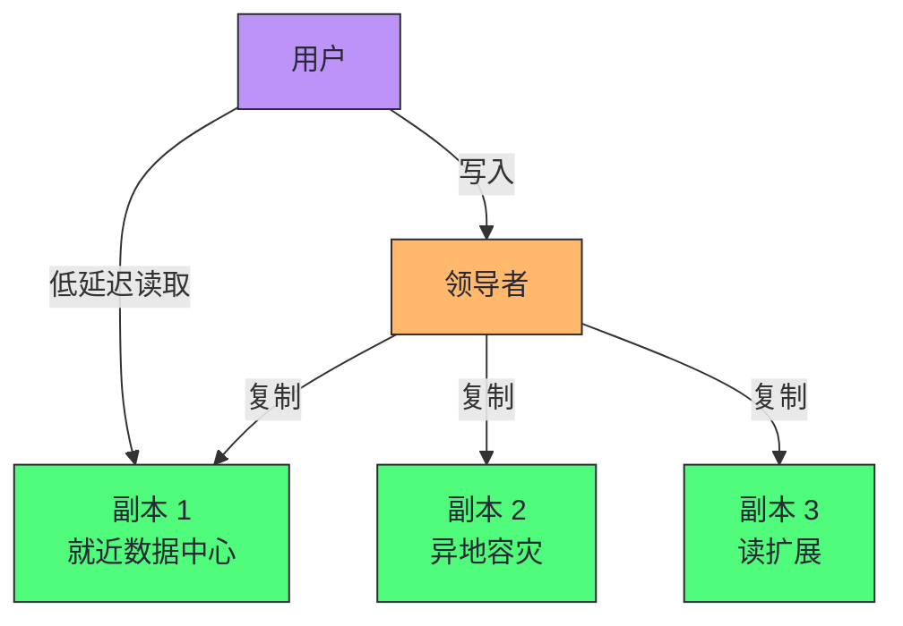
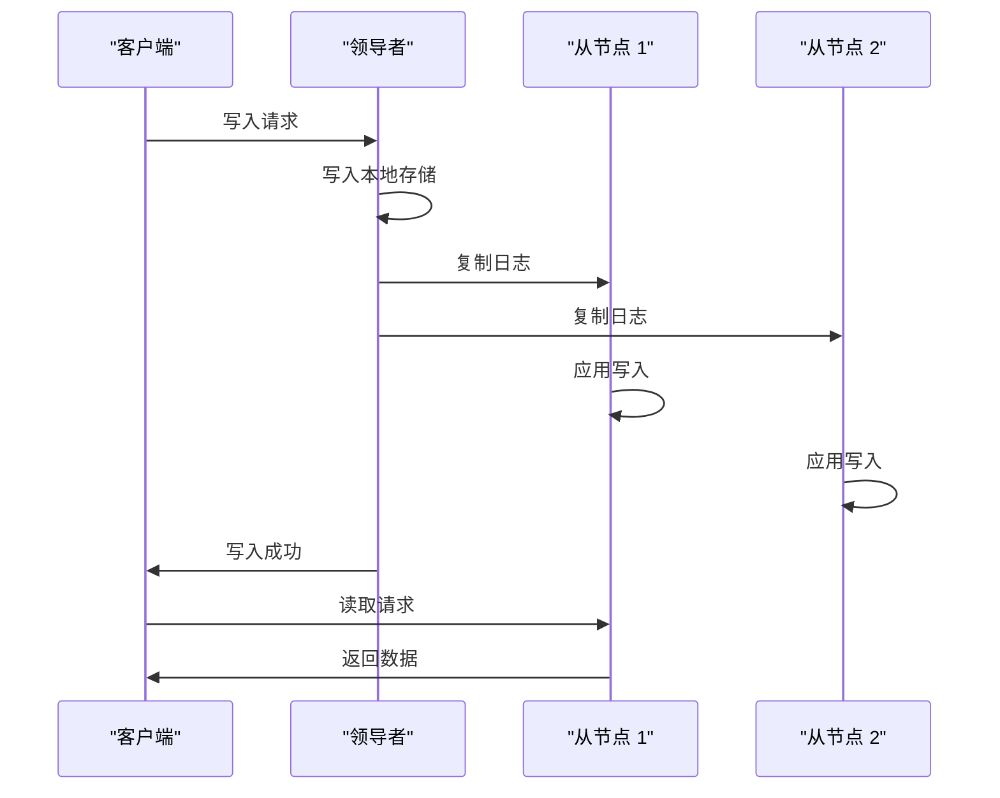
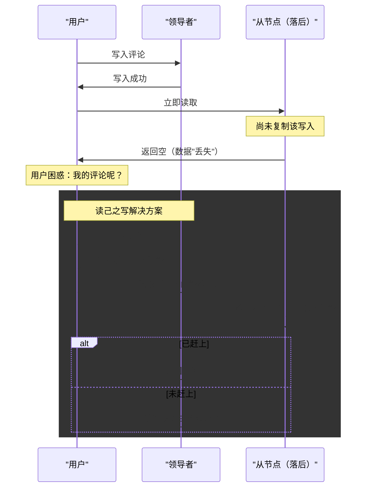
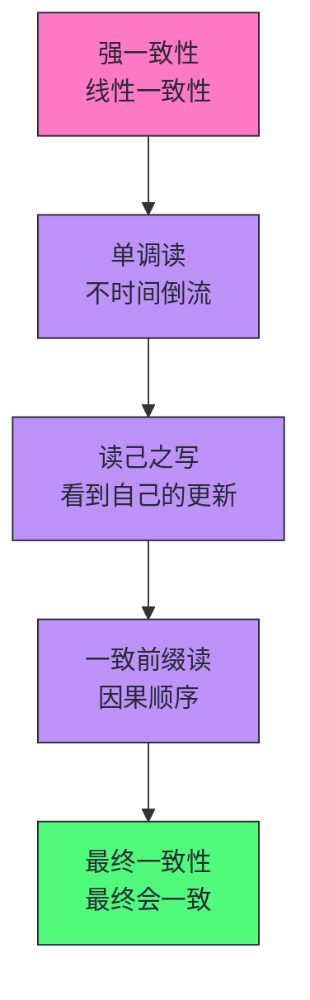
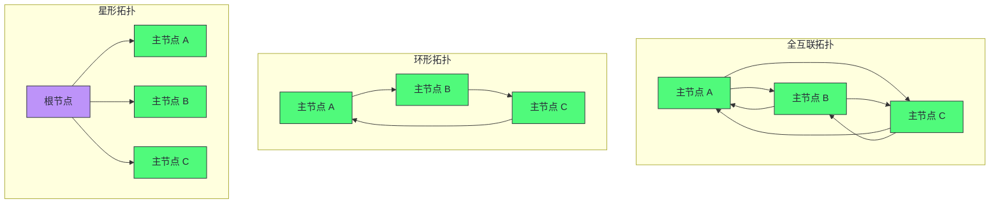
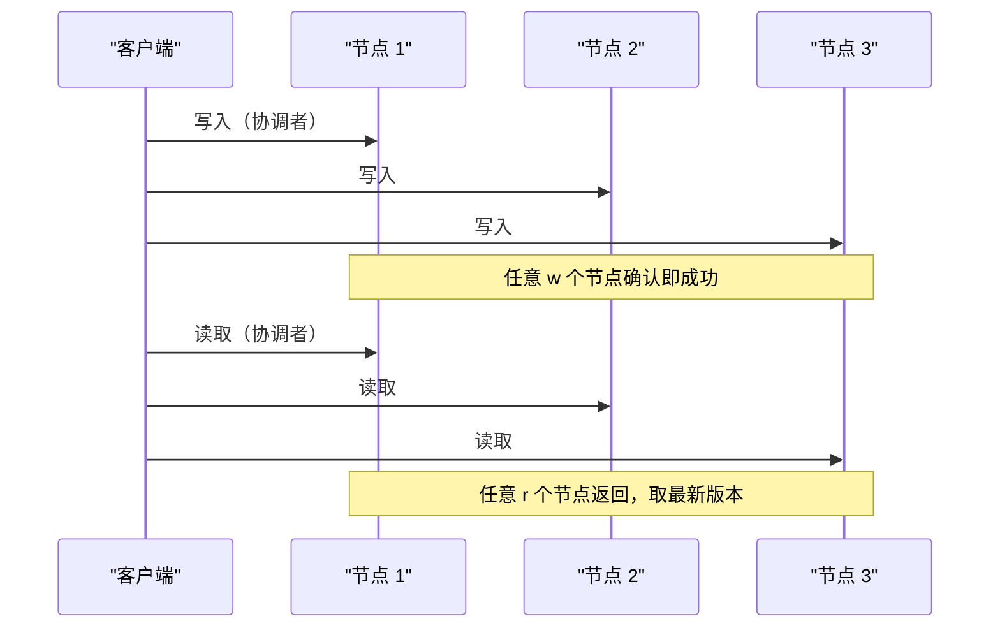

# 05 复制：主从、多主与无主架构的工程权衡

> [!abstract] 摘要
> 本文深入分布式系统的第一个核心挑战——数据复制。复制是将相同数据保存在多台机器上的实践，动机有三个：地理就近（降低延迟）、容错（提高可用性）、读扩展（提高吞吐）。文章系统讲解三种复制架构：单主复制（一个领导者接受写入，从节点异步/同步复制）、多主复制（多个领导者同时接受写入，适合地理分布和离线优先）、无主复制（任何节点都可接受写入，法定人数读写）。每种架构深入分析同步 vs 异步的权衡、故障切换的复杂性、复制延迟导致的一致性问题（读己之写、单调读、一致前缀读）。之后讨论复制日志的实现（基于语句、WAL 传输、逻辑日志）、多主复制的冲突解决策略、无主复制的读写法定人数和反熵机制。最后给出复制架构选型的决策框架。核心认知：复制本质上是"一致性 vs 可用性/延迟"的权衡——单主提供强一致性但写入有单点瓶颈，多主提供高可用性但冲突解决复杂，无主提供高可用性和可扩展性但一致性保证较弱。没有"最优"的复制架构，只有"最匹配业务一致性需求和网络环境"的架构。

---

## 第 1 章 复制的动机与挑战

### 1.1 为什么需要复制

复制是将相同数据的副本保存在多台通过网络连接的机器上。三个核心动机：

- **地理就近**：将数据副本放在靠近用户的数据中心，减少访问延迟
- **容错**：部分组件故障时系统继续工作，提高可用性和持久性
- **读扩展**：增加服务读取查询的机器数量，提高读取吞吐量

### 1.2 复制的核心挑战

如果数据不随时间变化，复制很简单——复制一次即可。复制的所有困难在于**处理复制数据的变化**：

- 如何将变更传播到所有副本？
- 如何处理副本故障？
- 如何处理网络中断？
- 如何保证副本之间的一致性？

> [!info] 核心概念：备份 ≠ 复制
> 备份和复制目的不同：副本快速将写入从一个节点传播到另一个节点，备份存储数据的旧快照以便回溯时间。如果你意外删除了数据，复制无济于事——删除操作也会传播到副本；你需要备份来恢复已删除的数据。复制和备份通常是互补的。

---

## 第 2 章 单主复制

### 2.1 基本架构

单主复制（也称主从复制、基于领导者的复制）是最常见的复制方式：

1. **领导者（Leader）**：一个副本被指定为领导者，所有写入必须发送给领导者
2. **从节点（Follower）**：其他副本从领导者获取复制日志，按相同顺序应用写入
3. **读取**：可查询领导者或任何从节点；写入仅由领导者接受

单主复制广泛应用于：PostgreSQL、MySQL（Oracle Data Guard）、SQL Server（Always On）、MongoDB、DynamoDB、Kafka、以及基于 Raft 共识算法的系统（CockroachDB、TiDB、etcd）。

### 2.2 同步 vs 异步复制

复制是同步还是异步，是一个关键配置：

| 维度 | 同步复制 | 异步复制 |
|------|---------|---------|
| **持久性保证** | 强——从节点确认后才向客户端报告成功 | 弱——领导者确认后即报告，从节点可能落后 |
| **可用性影响** | 从节点故障会阻塞写入 | 从节点故障不影响写入 |
| **延迟** | 写入延迟更高（等待从节点确认） | 写入延迟低 |
| **故障切换** | 无数据丢失 | 可能丢失未复制的写入 |

**半同步复制**（Semi-Synchronous）：一个从节点同步，其他异步。保证至少两个节点（领导者 + 一个同步从节点）有最新数据。如果同步从节点不可用，提升一个异步从节点为同步。

> [!warning] 生产避坑：完全异步复制的持久性风险
> 完全异步配置下，如果领导者故障且无法恢复，尚未复制到从节点的写入会丢失——即使已向客户端确认。这意味着"已确认的写入"不等于"持久化的写入"。GitHub 曾因异步复制故障切换导致 MySQL 自增主键重用，进而导致 Redis 与 MySQL 数据不一致，使私有数据泄露给错误用户。在数据完整性要求高的场景中，至少使用半同步复制。

### 2.3 故障切换的复杂性

领导者故障时的**故障切换（Failover）** 是分布式系统最棘手的操作之一：

1. **判定领导者失效**：通常使用超时（如 30 秒无心跳），但超时太短导致不必要的切换，太长导致恢复慢
2. **选举新领导者**：选择拥有最新数据的从节点，通过共识算法选举
3. **重新配置系统**：客户端写入路由到新领导者，旧领导者恢复后降级为从节点

故障切换的常见问题：

- **数据丢失**：异步复制下，新领导者可能未收到旧领导者的所有写入
- **脑裂（Split Brain）**：两个节点都认为自己是领导者，同时接受写入导致数据损坏
- **超时设置困难**：高负载下的临时响应慢可能被误判为故障

> [!info] 核心概念：脑裂是分布式系统的噩梦
> 脑裂——两个节点同时认为自己是领导者——会导致两个节点接受冲突的写入，数据可能丢失或损坏。防范脑裂的机制称为**围栏（Fencing）**——通过限制或关闭旧领导者来防止其继续接受写入。但围栏机制设计不当可能导致两个节点都被关闭。一些运维团队因此偏好手动故障切换，即使软件支持自动切换。

### 2.4 复制日志的实现

| 方法 | 机制 | 优势 | 劣势 |
|------|------|------|------|
| **基于语句** | 转发 SQL 语句 | 紧凑 | 非确定性函数（NOW()、RAND()）问题 |
| **WAL 传输** | 转发物理预写日志 | 与存储引擎一致 | 与存储引擎耦合，版本不兼容 |
| **逻辑日志（基于行）** | 转发行级变更（插入/更新/删除） | 与存储引擎解耦，支持版本不匹配 | 更复杂 |

> [!note] 设计哲学：逻辑日志支持零停机升级
> WAL 传输与存储引擎紧密耦合——主从节点必须运行相同版本的数据库软件，无法零停机升级。逻辑日志与存储引擎解耦——从节点可以运行比主节点更新的版本，先升级从节点，故障切换后升级原主节点，实现零停机升级。逻辑日志也更容易被外部系统解析——这是变更数据捕获（CDC）的基础，我们将在后续文章中讨论。

---

## 第 3 章 复制延迟与一致性保证

### 3.1 最终一致性

异步复制下，从节点可能落后于领导者。这种不一致是暂时的——停止写入并等待，从节点最终会赶上。这就是**最终一致性（Eventual Consistency）**。

"最终"一词故意模糊——副本落后程度没有限制。正常操作下延迟可能只有几分之一秒，但在系统接近容量或网络问题时，延迟可能增加到几秒甚至几分钟。

### 3.2 读己之写一致性

**问题**：用户写入数据后立即读取，但读取的从节点尚未复制该写入——用户看起来自己的数据丢失了。

**读己之写一致性（Read-Your-Writes Consistency）** 保证：用户总能看到自己提交的更新。

实现策略：

- 用户自己的数据从领导者读取，其他用户数据从从节点读取
- 写入后一段时间内（如 1 分钟）从领导者读取
- 客户端记录写入时间戳，确保读取的副本至少反映到该时间戳

> [!warning] 生产避坑：跨设备读己之写
> 当用户从多个设备访问服务时（手机和电脑），跨设备读己之写一致性更难——一个设备的写入时间戳在另一个设备上不可知。解决方案是将用户元数据集中化，并将用户所有设备的请求路由到同一区域（如果需要从领导者读取）。

### 3.3 单调读一致性

**问题**：用户从不同副本读取，可能看到时间倒流——先看到新数据，后看到旧数据。

**单调读（Monotonic Reads）** 保证：用户连续读取不会看到时间倒流。

实现方法：确保每个用户始终从**同一个副本**读取（如按用户 ID 哈希选择副本）。

### 3.4 一致前缀读

**问题**：因果相关的写入在不同分片上以不同顺序复制，观察者可能先看到答案后看到问题。

**一致前缀读（Consistent Prefix Reads）** 保证：如果写入以特定顺序发生，读取者看到相同的顺序。

这在分片数据库中尤其成问题——不同分片独立运行，没有全局写入顺序。解决方案是确保因果相关的写入写入同一分片。

### 3.5 一致性保证的强度排序

> [!note] 设计哲学：选择数据库提供的一致性，而非应用层模拟
> 在应用代码中模拟更强的一致性保证（如读己之写）复杂且容易出错。最简单的编程模型是选择提供强一致性（线性一致性）和 ACID 事务的分布式数据库——将数据库视为单节点。NewSQL 系统（CockroachDB、TiDB、Spanner）提供了可扩展的强一致性。但如果业务可以容忍最终一致性（如社交媒体的内容展示），使用较弱一致性的系统可以在网络中断时提供更强的恢复能力和更低的开销。

---

## 第 4 章 多主复制

### 4.1 动机：地理分布与离线优先

单主复制的缺点：所有写入必须经过一个领导者。如果无法连接领导者（如跨区域网络中断），就无法写入。

多主复制（Multi-Leader Replication）允许多个节点同时接受写入，每个领导者将变更异步复制到其他领导者。

**地理分布场景**：每个区域一个领导者，写入在本区域处理，跨区域异步复制。相比单主：

| 维度 | 单主（跨区域） | 多主（跨区域） |
|------|--------------|--------------|
| **写入延迟** | 高（必须跨区域到领导者） | 低（本区域处理） |
| **区域中断容忍** | 需要故障切换 | 各区域独立运行 |
| **网络问题容忍** | 敏感（跨区域链路问题影响写入） | 强（本地写入不受影响） |
| **一致性** | 强一致性 | 弱（冲突可能） |

**离线优先场景**：每个设备（手机、笔记本）是一个"领导者"，本地写入，联网后同步。日历应用、Google Docs 协作、本地优先软件都是这种模式。

> [!warning] 生产避坑：多主复制是危险领域
> 多主复制在许多数据库中是后加的功能，存在细微的配置陷阱和与其他功能的意外交互（自增键、触发器、完整性约束）。应尽可能避免，除非有明确的地理分布或离线优先需求。如果必须使用，仔细阅读文档并彻底测试冲突解决行为。

### 4.2 写入冲突

多主复制的最大问题是**写入冲突**——不同领导者上的并发写入可能导致冲突。

例如：两个用户同时编辑同一维基页面标题，用户 1 改为 B，用户 2 改为 C。两个更改分别成功应用到本地领导者，但异步复制时检测到冲突。

**冲突解决策略**：

| 策略 | 机制 | 适用场景 |
|------|------|---------|
| **最后写入胜（LWW）** | 基于时间戳丢弃旧写入 | 简单但可能丢数据 |
| **自定义冲突解决逻辑** | 应用代码合并冲突 | 业务逻辑明确 |
| **CRDT（无冲突复制数据类型）** | 数据结构自动合并 | 协作编辑、计数器 |
| **版本向量** | 跟踪因果关系 | 检测并发写入 |

> [!info] 核心概念：CRDT 是冲突解决的理论基础
> CRDT（Conflict-free Replicated Data Type）是能够自动合并并发更新的数据结构——无论更新顺序如何，最终状态相同。计数器、集合、序列等都有 CRDT 实现。Google Docs 的协作编辑、Riak 的数据类型都基于 CRDT。CRDT 的代价是数据结构设计更复杂，且并非所有数据类型都有高效的 CRDT 实现。我们将在后续文章中深入讨论。

### 4.5 LWW 的数据丢失风险

**最后写入胜（Last Write Wins, LWW）** 是最简单的冲突解决——基于时间戳丢弃旧写入。但 LWW 的真正含义是：当同一条记录被并发写入时，**随机选择**一个写入作为胜者，其他写入被静默丢弃。

LWW 的两个关键风险：

1. **数据丢失**：并发写入被随机丢弃，即使它们已被各自的主节点成功处理
2. **时钟敏感性**：如果使用实时时钟（Unix 时间戳），节点时钟不同步会导致写入被错误丢弃——时钟快的节点的写入总是"胜出"

> [!warning] 生产避坑：LWW 只适合不可变数据
> LWW 只在两种场景下安全：(1) 只插入具有唯一键的记录且从不更新；(2) 更新操作的业务语义允许丢弃（如缓存的 TTL 更新）。对于更新现有记录的场景，LWW 会丢失用户数据。如果业务不能容忍数据丢失，必须使用 CRDT、自定义冲突解决或应用层合并。

### 4.6 CRDT vs 操作转换（OT）

两类自动冲突解决算法：

| 算法 | 核心思想 | 适用场景 | 代表系统 |
|------|---------|---------|---------|
| **CRDT** | 为每个元素分配唯一 ID，基于 ID 而非索引确定位置 | 分布式数据库、离线优先 | Riak、Cosmos DB、Automerge、Yjs |
| **OT（操作转换）** | 记录操作索引，交换操作时转换索引以考虑并发操作 | 实时协作编辑 | Google Docs、ShareDB |

以文本编辑为例，两个副本都从 `ice` 开始，一个前置 `n` 得到 `nice`，另一个追加 `!` 得到 `ice!`。合并结果应为 `nice!`：

- **OT**：`n` 插入在索引 0，`!` 插入在索引 3。交换操作时，`!` 的索引需要转换为 4（考虑 `n` 的插入）
- **CRDT**：每个字符有唯一 ID，`!` 的操作包含"在 ID 3A 的字符后插入"，无需索引转换

> [!info] 核心概念：强最终一致性
> 自动冲突解决确保所有副本收敛到相同状态——无论写入到达顺序如何。这种"最终一致性 + 收敛保证"的组合称为**强最终一致性（Strong Eventual Consistency）**。它比普通最终一致性更强——不仅保证最终一致，还保证收敛到确定的状态。CRDT 和 OT 都提供强最终一致性。

### 4.3 多主复制拓扑

多个领导者之间的复制路径称为**拓扑**：

- **全互联**：最通用，容错性好，但写入可能"超车"（因果顺序问题）
- **环形/星形**：更简单，但单节点故障可能中断复制流

> [!warning] 生产避坑：全互联拓扑的因果顺序问题
> 全互联拓扑中，不同网络链路速度不同，导致复制消息可能"超车"——更新可能先于对应的插入到达某个节点。简单的时间戳排序无法解决此问题（时钟不同步）。需要版本向量等技术正确排序因果相关的事件。许多多主复制系统没有采用良好的排序技术，容易遭受此问题。

### 4.4 同步引擎与本地优先软件

现代 Web 应用的实时协作功能（Google Docs、Figma、Linear）本质上是多主复制——每个浏览器标签页是一个副本，用户编辑异步复制到其他协作者。

**同步引擎**是支持此过程的软件库——捕获本地变更，发送给协作者（在线时）或存储待发（离线时），接收远端变更并合并到本地副本。

**本地优先软件（Local-First Software）** 不仅离线优先，还设计为即使开发者关闭所有在线服务也能继续工作——使用开放标准同步协议，多个服务提供商可用。Git 是本地优先协作系统的典型例子。

> [!note] 设计哲学：同步引擎改变前端编程模型
> 传统 Web 应用在客户端保留很少状态，需要时向服务器请求。同步引擎方法在客户端维护持久状态，与服务器通信移到后台——本地读写几乎从不失败，带来声明式编程风格。UI 响应速度从"等待网络往返"变为"下一帧渲染"（16ms）。代价是客户端需要预下载并持久存储所需数据，不适合海量数据场景。

---

## 第 5 章 无主复制

### 5.1 基本架构

无主复制（Leaderless Replication）——也称 Dynamo 风格——任何节点都可以接受写入。代表系统：Cassandra、DynamoDB、Riak、Voldemort。

客户端（或协调者节点）将写入发送到多个节点，任意 w 个节点确认即成功；读取从多个节点获取，任意 r 个节点返回，取最新版本。

### 5.2 法定人数读写

如果节点总数为 n，写入需要 w 个节点确认，读取需要 r 个节点响应，当 **w + r > n** 时，读取必然包含至少一个有最新数据的节点——这是**法定人数（Quorum）** 条件。

例如 n=3, w=2, r=2：任何读取都至少与一个写入节点重叠，保证读到最新数据。

| 配置 | 一致性 | 可用性 | 延迟 |
|------|--------|--------|------|
| w=n, r=1 | 强一致性 | 低（任一节点故障即不可写） | 写入高，读取低 |
| w=1, r=n | 强一致性 | 低（任一节点故障即不可读） | 写入低，读取高 |
| w=quorum, r=quorum | 强一致性 | 中 | 中 |
| w=1, r=1 | 最终一致性 | 高 | 低 |

> [!info] 核心概念：法定人数不是万能药
> 即使满足 w + r > n，法定人数也有局限：
> - **读写并发时**：读取可能看到旧值（如果读取的节点尚未复制最新写入）
> - **写入并发时**：多个并发写入可能在不同节点上以不同顺序到达
> - **网络分区时**：法定人数无法保证线性一致性
>
> 严格的线性一致性需要共识协议（如 Raft），我们将在后续文章中讨论。

### 5.3 反熵与修复

无主复制中，某些节点可能错过写入（故障、网络中断）。需要机制使这些节点最终赶上：

- **读修复**：读取发现某个节点返回旧值时，将新值写回该节点
- **反熵**：后台进程持续比较副本间数据差异，修复缺失的写入
- **提示交接**：节点故障时，写入暂存于其他节点，故障节点恢复后转发

> [!note] 设计哲学：无主复制牺牲一致性换取可用性
> 无主复制的核心哲学是"高可用性优先"——任何节点都可以接受写入，即使其他节点不可达。代价是一致性保证较弱——需要法定人数、冲突解决、反熵机制来弥补。在网络分区时，无主系统继续可用（CAP 定理中的 AP），而单主系统可能不可用（CP）。选择取决于业务对可用性 vs 一致性的优先级。

### 5.4 单主 vs 无主的性能对比

| 维度 | 单主复制 | 无主复制 |
|------|---------|---------|
| **读取延迟** | 主节点读取低延迟但吞吐受限；从节点读取可能过期 | 并行读取多副本，取最快响应（请求对冲），尾延迟低 |
| **故障影响** | 主节点故障需故障切换，期间不可用 | 无需故障切换，慢节点不影响整体响应 |
| **灰色故障容忍** | 需判断是否触发故障切换 | 不区分正常和故障，慢节点自动忽略 |
| **监控复杂度** | 复制延迟可量化（日志位置差） | 难以量化（写入顺序不固定） |

> [!info] 核心概念：请求对冲降低尾延迟
> 无主系统并行发送请求到多个副本，使用最快响应——这称为**请求对冲（Request Hedging）**。它显著降低尾延迟（P99 延迟），因为一个慢副本不会拖慢整体响应。单主系统无法做请求对冲——只有一个主节点，它慢就整体慢。这是无主系统在长尾延迟上的关键优势。

### 5.5 监控陈旧性

从运维角度，监控数据库是否返回过期数据非常重要。即使应用可容忍过期读取，也需要了解复制健康状况。

- **单主系统**：数据库暴露复制延迟指标（从节点日志位置 vs 主节点日志位置），可精确量化
- **无主系统**：写入顺序不固定，难以量化延迟。提示交接存储的提示数量可作为健康指标，但难以解释

> [!warning] 生产避坑：最终一致性需要可量化的监控
> 最终一致性是故意模糊的保证——"最终"是多久？从运维角度，必须能够量化"最终"。单主系统的复制延迟指标（如 PostgreSQL 的 `pg_stat_replication`、MySQL 的 `Seconds_Behind_Master`）提供了量化手段。无主系统缺乏等价指标——这是无主系统运维的额外挑战。如果业务需要 SLA（如"99% 的读取在 1 秒内一致"），无主系统可能无法提供足够的监控数据。

---

## 第 6 章 复制架构选型决策框架

### 6.1 按业务需求选型

| 业务需求 | 推荐架构 | 原因 |
|---------|---------|------|
| 强一致性、事务 | 单主 + 共识（NewSQL） | 线性一致性保证 |
| 读密集、可容忍最终一致性 | 单主 + 多从节点 | 读扩展，写入单点可接受 |
| 跨区域低延迟写入 | 多主 | 本区域写入，异步跨区域复制 |
| 离线优先、实时协作 | 多主 + 同步引擎 | 本地写入，联网同步 |
| 极高可用性、可容忍弱一致性 | 无主（Dynamo 风格） | 任何节点可写入 |
| 地理容灾 | 单主跨区域 + 异步从节点 | 主区域故障可切换 |

### 6.2 按一致性需求选型

| 一致性需求 | 推荐架构 | 配置建议 |
|-----------|---------|---------|
| 线性一致性 | 单主 + 共识 | Raft/Paxos 自动领导者选举 |
| 读己之写 | 单主 + 应用层路由 | 用户自己的数据从领导者读 |
| 单调读 | 单主 + 副本亲和 | 每用户固定副本 |
| 最终一致性 | 无主 / 单主异步 | 法定人数或异步复制 |

> [!warning] 生产避坑：不要假装异步复制是同步的
> 使用异步复制但假装它是同步的（不处理复制延迟问题），会为生产事故埋下隐患。如果复制延迟增加到几分钟，用户看到"数据丢失"（读己之写违反）、"时间倒流"（单调读违反）、"答案先于问题"（一致前缀读违反）。设计系统时必须考虑"如果复制延迟增加到几分钟甚至几小时，应用行为如何？"

---

## 总结

复制的核心知识可以归纳为以下主线：

1. **复制的三个动机是地理就近、容错、读扩展**。所有复制架构都在服务这三个目标，但在一致性、可用性、延迟之间做不同权衡。

2. **单主复制是最常见的架构**。一个领导者接受写入，从节点复制。简单、提供强一致性，但写入有单点瓶颈，故障切换复杂。

3. **同步 vs 异步是持久性 vs 可用性的权衡**。同步保证持久性但从节点故障阻塞写入；异步高可用但可能丢数据。半同步（一个同步从节点）是常见折中。

4. **故障切换是分布式系统最棘手的操作**。数据丢失、脑裂、超时设置是三大风险。选择最新从节点为新领导者可最小化数据丢失。

5. **复制延迟导致三种一致性问题**。读己之写（用户看不到自己的更新）、单调读（时间倒流）、一致前缀读（因果顺序违反）。每种都有对应的解决方案，但应用层处理复杂且易错。

6. **多主复制适合地理分布和离线优先**。本区域写入低延迟，区域中断时各区域独立运行。代价是写入冲突——需要 LWW、CRDT、自定义解决逻辑。

7. **无主复制提供最高可用性**。任何节点可写入，法定人数读写保证一致性。代价是一致性保证较弱，需要反熵机制修复落后节点。

8. **复制日志的选择影响运维灵活性**。WAL 传输与存储引擎耦合，不支持零停机升级；逻辑日志与存储引擎解耦，支持版本不匹配和 CDC。

9. **同步引擎是本地优先软件的基础**。在客户端维护持久状态，后台同步——UI 响应从"等待网络"变为"下一帧渲染"。代价是客户端需预下载数据。

10. **选择数据库提供的一致性，而非应用层模拟**。如果需要强一致性，选 NewSQL 数据库（CockroachDB、TiDB）比在应用层模拟更可靠。如果业务可容忍最终一致性，较弱一致性的系统提供更高可用性和更低延迟。

> [!info] 专栏导航
> 本文是 [[00 专栏导览|数据密集型系统架构实战专栏]] 的第 05 篇，进入分布式领域的第一个主题。上一篇 [[04 编码与演化：Schema 演进与数据兼容性的工程实践]] 讨论了单机数据的编码和演化；本文讨论了数据如何跨多台机器复制。下一篇 [[06 分片：数据如何跨节点分割与路由]] 将讨论当数据超出单机容量时如何分片——分片与复制通常组合使用，每个分片有自己的副本，构成分布式数据库的完整数据分布架构。

---

## 延伸思考

1. **你的系统用的是哪种复制架构？** 如果是单主，你的故障切换是自动还是手动？超时设置是否经过负载峰值测试？如果是多主，你的冲突解决策略是什么？是否测试过并发写入场景？

2. **你的复制是同步还是异步？** 如果是异步，你是否处理了复制延迟导致的一致性问题？用户是否可能遇到"读己之写"违反——写入后立即读取看不到自己的数据？

3. **你的跨区域部署是单主还是多主？** 如果是单主跨区域，写入延迟是否可接受？如果是多主，你是否清楚冲突解决的行为——LWW 会丢弃数据，你是否有业务可接受的冲突策略？

4. **你的读扩展是否考虑了单调读？** 如果用户从随机副本读取，是否可能看到"时间倒流"——先看到新数据后看到旧数据？按用户 ID 哈希选择副本可以解决此问题。

5. **你的无主系统的法定人数配置是否合理？** w + r > n 保证强一致性，但降低可用性。w=1, r=1 提供最高可用性但只是最终一致性。你的配置是否匹配业务的一致性需求？

6. **你的复制日志是 WAL 还是逻辑日志？** 如果是 WAL，你是否无法零停机升级？评估迁移到逻辑日志的成本——它还支持 CDC，是数据管道的基础设施。

---

*本文基于 Martin Kleppmann《Designing Data-Intensive Applications》2nd Edition 第 6 章整合而成，加入了作者的结构化重组和工程实践理解。*
