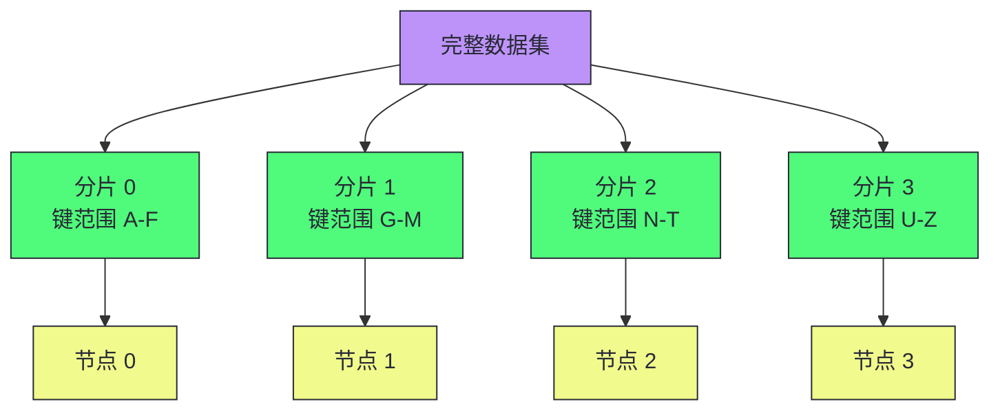
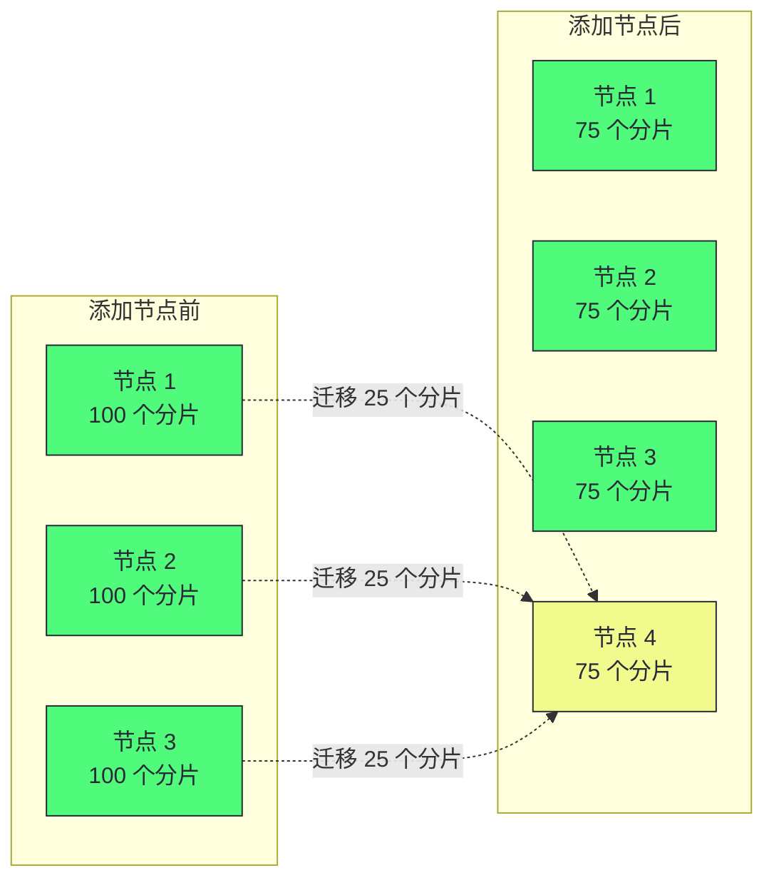
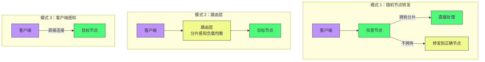
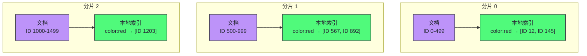
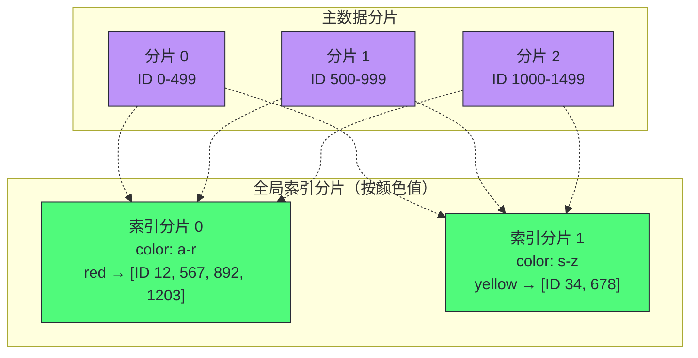
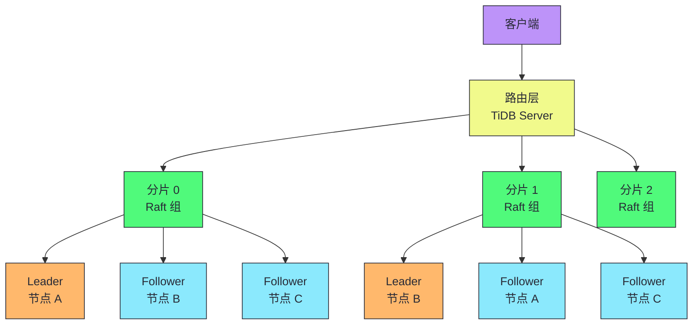

# 06 分片：数据如何跨节点分割与路由

> [!abstract] 摘要
> 本文深入分布式系统的第二个核心挑战——分片（Partitioning/Sharding）。当数据量或写入吞吐量超出单机容量时，需要将数据拆分为更小的分片分布到多个节点。文章系统讲解两种主要分片方法：键范围分片（按键排序，支持高效范围查询但有热点风险）和哈希分片（哈希函数均匀分布负载但范围查询低效）。深入分析重平衡的三种策略（固定数量分片、哈希范围分片、一致性哈希）及其数据迁移代价。之后讨论偏斜工作负载与热点缓解（社交网络名人效应、应用层键分裂）。然后讲透请求路由的三种模式（随机节点转发、路由层、客户端感知）和协调服务（ZooKeeper/etcd）的角色。最后深入分片与二级索引的交互——本地索引（写入简单、读取需扇出所有分片）vs 全局索引（读取高效但写入需要跨分片更新）。核心认知：分片是水平扩展的主要工具，但增加显著复杂性——分区键选择难以更改、跨分片事务昂贵、二级索引分片复杂。如果单机能处理，不要分片。

---

## 第 1 章 分片的动机与代价

### 1.1 为什么需要分片

复制（上一篇）解决的是容错和读扩展问题。分片解决的是**数据量和写入吞吐量超出单机容量**的问题。

分片将数据拆分为更小的子集，每个分片存储在不同节点上。每条数据恰好属于一个分片，每个分片本身是一个小的数据库。

分片通常与复制结合——每个分片有多个副本分布在不同节点上。一个节点可能是某些分片的主节点，同时是其他分片的从节点。

### 1.2 分片的代价

> [!warning] 生产避坑：如果单机能处理，不要分片
> 分片是重量级解决方案，主要适用于大规模场景。现代单机能力很强——如果数据量和写入吞吐量单机可处理，最好避免分片。分片增加显著复杂性：
> - **分区键选择难以更改**：分片方案一旦确定，更改需要大量数据迁移
> - **跨分片操作昂贵**：跨分片事务需要分布式事务，比单机事务慢得多
> - **二级索引分片复杂**：本地索引读取需扇出所有分片，全局索引写入需跨分片更新
> - **运维复杂度增加**：重平衡、热点处理、请求路由都需要额外基础设施

### 1.3 分片用于多租户

分片也用于实现多租户系统——每个租户一个独立分片。优势：

- **资源隔离**：一个租户的计算密集操作不影响其他租户
- **权限隔离**：数据物理分离降低越权访问风险
- **基于单元的架构**：服务和存储分组到独立单元，故障隔离
- **按租户备份恢复**：可单独恢复一个租户的状态
- **合规性**：GDPR 要求的数据导出/删除简化为分片级操作
- **数据驻留**：可将租户分片分配到特定司法管辖区

> [!info] 核心概念：基于单元的架构（Cell-Based Architecture）
> 基于单元的架构将特定租户集合的服务和存储分组到独立单元中，不同单元彼此独立运行。一个单元的故障仅限于该单元，其他单元的租户不受影响。这是 AWS 推荐的高可用架构模式——通过故障隔离限制爆炸半径。分片是实现基于单元架构的数据层基础。

### 1.3.1 多租户分片的挑战

使用分片实现多租户也有挑战：

- **大租户问题**：如果一个租户太大无法放入单机，需要在该租户内额外分片，回到可扩展性分片话题
- **小租户开销**：许多小租户时，为每个租户创建独立分片产生过多开销——可将多个小租户组合到一个分片，但面临租户在分片间移动的问题
- **跨租户查询**：需要支持跨多个租户连接数据的特性在分片架构下更难实现

> [!warning] 生产避坑：大租户是分片多租户的噩梦
> 大多数 SaaS 系统的租户大小呈长尾分布——少数大租户占据大部分数据。如果你的分片策略是"每租户一分片"，大租户会撑爆单机。解决方案：(1) 对大租户内部再分片（按用户 ID 或时间）；(2) 为大租户分配专用集群（cell-based 架构的极致）；(3) 监控租户增长，在租户接近单机容量前主动迁移。Notion 的 PostgreSQL 分片经验表明，大租户的分片迁移是运维最复杂的操作之一。

### 1.3.2 数据仓库中的分区

数据仓库（BigQuery、Snowflake、Delta Lake）也使用类似分片的机制，但术语不同：

| 数据仓库 | 分区概念 | 排序概念 |
|---------|---------|---------|
| BigQuery | 分区键决定记录所在分区 | 聚类列决定分区内排序 |
| Snowflake | 微分区（自动分配） | 聚类键（用户定义） |
| Delta Lake | 手动或自动分区分配 | 聚类键 |

聚类数据不仅提高范围扫描性能，还改善压缩和过滤性能——相同值在物理上相邻，列式存储的压缩率更高。

> [!note] 设计哲学：OLTP 分片 vs OLAP 分区
> OLTP 分片（本章重点）的目标是**负载分布**——将读写吞吐量分散到多个节点。OLAP 分区的目标是**查询剪枝**——查询时跳过不相关的分区，减少扫描数据量。OLTP 分片通常按哈希分布以均匀负载；OLAP 分区通常按时间或维度列分布以支持查询剪枝。两者技术相似但目标不同——OLTP 分片需要请求路由和重平衡，OLAP 分区通常静态定义且数据不可变。

---

## 第 2 章 键范围分片

### 2.1 基本机制

键范围分片为每个分片分配一个连续的键范围，类似纸质百科全书的卷：

- 分片 0：键 A-F
- 分片 1：键 G-M
- 分片 2：键 N-T
- 分片 3：键 U-Z

分片边界可以手动选择（Vitess）或数据库自动选择（Bigtable、HBase、CockroachDB）。在每个分片内，键按排序顺序存储（B-Tree 或 SSTable），支持高效的范围扫描。

### 2.2 优势与劣势

| 维度 | 优势 | 劣势 |
|------|------|------|
| **范围查询** | 高效——连续键在同一分片 | - |
| **热点风险** | - | 相邻键的写入集中到一个分片 |
| **分片边界** | 可适应数据分布 | 需要了解数据分布 |

> [!warning] 生产避坑：时间戳作为分区键的热点问题
> 如果键是时间戳，分片对应时间范围（如每月一个分片）。写入时所有数据都进入当前月份的分片——该分片过载而其他分片空闲。解决方案：用传感器 ID 作为键的前缀，键顺序先按传感器 ID 再按时间戳。这样写入分散到多个分片，但跨传感器的时间范围查询需要为每个传感器执行单独的范围查询。

### 2.3 重平衡：分片分裂

键范围分片通过**分裂**现有分片来增长——当一个分片过大时，将其拆分为两个子范围。这类似于 B-Tree 的页分裂。

分片分裂是昂贵操作——需要将所有数据重写到新文件，类似 LSM-Tree 的压缩。需要分裂的分片通常也处于高负载下，分裂成本可能加剧负载，面临过载风险。

> [!info] 核心概念：预分割（Pre-Splitting）
> 在空数据库上，没有键范围可以拆分。某些数据库（HBase、MongoDB）允许配置初始分片——预分割。这要求你预先了解键分布以选择合适的边界。预分割避免了初始所有写入集中到一个分片的问题，但如果边界选择不当，仍可能导致偏斜。

---

## 第 3 章 哈希分片

### 3.1 基本机制

哈希分片先对分区键应用哈希函数，再映射到分片。好的哈希函数将偏斜数据均匀分布——即使输入非常相似，哈希值也均匀分布。

用于分片的哈希函数不需要密码学强度：MongoDB 用 MD5，Cassandra/ScyllaDB 用 Murmur3。注意：编程语言内置的哈希函数（Java 的 `hashCode()`、Ruby 的 `hash`）可能在不同进程中返回不同值，不适用于分片。

### 3.2 哈希取模的问题

最简单的想法是 `hash(key) % N`（N 是节点数）。但当 N 变化时（添加/删除节点），大多数键的位置会改变，导致大量数据迁移。

### 3.3 固定数量的分片

解决方案是创建比节点数多得多的分片，每个节点分配多个分片：

- 10 个节点的集群，创建 1000 个分片，每节点 100 个分片
- 键存储在 `hash(key) % 1000` 号分片
- 添加节点时，只需将一些分片从现有节点重新分配给新节点

优势：只有整个分片在节点间移动，比分裂分片更轻量。分片数量不变，键到分片的分配不变。

劣势：分片数量固定，如果数据集大小高度可变，难以选择合适的分片数量。分片太大则重平衡和恢复成本高；分片太小则开销过多。

### 3.4 哈希范围分片

结合键范围分片和哈希函数：每个分片包含一段**哈希值范围**而非键范围。

- 即使输入键相似（如连续时间戳），哈希值均匀分布
- 分片过大时可分裂（类似键范围分片）
- 劣势：范围查询效率低（范围内的键分散在所有分片）

> [!info] 核心概念：复合键的分区与排序
> 如果键由多列组成，分区键只是第一列，分片内按键的其余部分排序。这样仍可在相同分区键的记录间做高效范围查询。例如键是 `(sensor_id, timestamp)`，按 `sensor_id` 分片，分片内按 `timestamp` 排序——同一传感器的时间范围查询高效，但跨传感器的时间查询需要扇出。

### 3.5 一致性哈希

一致性哈希满足两个属性：

1. 每个分片映射的键数量大致相等
2. 当分片数量变化时，尽可能少的键移动

> [!note] 设计哲学：一致性哈希的"一致性"与数据一致性无关
> 一致性哈希的"一致性"描述的是键尽可能停留在同一分片的趋势，与副本一致性（第六章）或 ACID 一致性（第八章）无关。它是分布式系统中最容易引起术语混淆的概念之一。一致性哈希有多种变体：最高随机权重（rendezvous hashing）、跳跃一致性哈希等。

---

## 第 4 章 偏斜与热点

### 4.1 偏斜与热分片

如果分片不公平——某些分片有更多数据或查询——称为**偏斜（Skew）**。负载异常高的分片称为**热分片（Hot Shard）**或**热点（Hot Spot）**。负载特别高的键称为**热键（Hot Key）**。

一致性哈希确保键均匀分布，但不保证负载均匀——如果某些键的请求速率远高于其他键（如社交网络的名人），仍会导致热点。

### 4.2 热点缓解策略

| 策略 | 机制 | 适用场景 |
|------|------|---------|
| **键分裂** | 在热键前/后加随机数，分散到多个键 | 写入热点 |
| **专用分片** | 将热键单独放入一个分片，甚至专用机器 | 持续热点 |
| **自适应容量** | 系统自动检测热点并重新分配 | 云服务（DynamoDB） |

> [!warning] 生产避坑：键分裂的读取代价
> 在热键前加两位随机数可将写入分散到 100 个键，但读取需要从所有 100 个键读取并合并——读取负载未减少，只是写入被分散。此外，需要跟踪哪些键被分裂，以及常规键到热点键的转换过程。随着负载变化（病毒式传播的帖子几天后平静），热点管理变得更复杂。

---

## 第 5 章 请求路由

### 5.1 三种路由模式

客户端如何知道连接哪个节点？三种方法：

### 5.2 协调服务

许多分布式数据系统依赖独立的协调服务（ZooKeeper、etcd）跟踪分片分配：

- 每个节点在 ZooKeeper 中注册自己
- ZooKeeper 维护分片到节点的权威映射
- 路由层或客户端订阅 ZooKeeper，分片所有权变更时收到通知

HBase、SolrCloud 使用 ZooKeeper；Kafka、YugabyteDB、TiDB、ScyllaDB 使用内置 Raft 共识协议；MongoDB 使用自己的配置服务器 + mongos 路由进程；Riak 使用 gossip 协议（比共识弱，可能脑裂，但无主数据库可容忍）。

> [!info] 核心概念：共识算法是请求路由的基础
> 请求路由需要所有参与者就"哪个分片在哪个节点上"达成一致——这是共识问题。ZooKeeper（Zab 协议）和 etcd（Raft 协议）都使用共识算法提供容错和防脑裂保证。我们将在后续文章中深入讨论共识算法。无主系统（如 Riak）使用 gossip 协议——更弱的一致性，但无主系统本身只提供弱一致性保证，可以容忍路由信息的不一致。

---

## 第 6 章 分片与二级索引

### 6.1 二级索引的分片挑战

二级索引不唯一标识记录，而是搜索特定值的方式（查找用户 123 的所有操作、查找包含"hogwash"的所有文章）。二级索引不能整齐地映射到分片——有两种主要方法。

### 6.2 本地二级索引

每个分片独立维护自己的二级索引，仅覆盖该分片中的记录。也称**文档分区索引**。

**写入**：只需更新包含该记录的分片——简单高效。

**读取**：如果不知道分区键，需要将查询发送到**所有分片**并合并结果（scatter-gather）。这导致尾延迟放大——最慢的分片决定整体延迟。添加更多分片不会增加查询吞吐量（每个分片仍需处理每个查询）。

### 6.3 全局二级索引

构建覆盖所有分片数据的全局索引，全局索引本身也分片（但可以按索引值分片，与主键分片方式不同）。也称**词项分区索引**。

**写入**：一条记录可能影响多个索引分片（文档中的每个词项可能在不同分片）——需要分布式事务保证原子性，或接受异步更新的延迟。

**读取**：单条件查询（如 `color = red`）只需从一个索引分片读取倒排列表——高效。

### 6.4 本地 vs 全局索引对比

| 维度 | 本地索引 | 全局索引 |
|------|---------|---------|
| **写入** | 简单（单分片） | 复杂（多分片，需分布式事务或异步） |
| **读取** | 昂贵（扇出所有分片） | 高效（单分片读取倒排列表） |
| **尾延迟** | 放大（最慢分片决定） | 低（单分片） |
| **可扩展性** | 读取吞吐不随分片增加 | 读取吞吐随索引分片增加 |
| **一致性** | 强（写入即可见） | 可能弱（异步更新有延迟） |
| **代表系统** | MongoDB、Cassandra、Elasticsearch | CockroachDB、TiDB、DynamoDB |

> [!note] 设计哲学：本地索引适合写密集，全局索引适合读密集
> 本地索引写入简单（单分片更新），但读取需要扇出所有分片——适合写密集、读取可容忍 scatter-gather 延迟的场景。全局索引读取高效（单分片），但写入需要跨分片更新——适合读密集、写入可容忍分布式事务开销的场景。DynamoDB 同时支持两者，让用户按工作负载选择。Elasticsearch 使用本地索引——这是为什么 ES 的二级索引查询在大量分片时延迟会上升。

---

## 第 7 章 重平衡的运维考量

### 7.1 自动 vs 手动重平衡

| 模式 | 优势 | 劣势 |
|------|------|------|
| **全自动** | 运维工作量少，可自动扩缩 | 不可预测，可能引发级联故障 |
| **手动** | 可控，防止操作意外 | 慢，需要人工干预 |
| **半自动** | 自动生成建议，人工确认 | 平衡了自动化和可控性 |

> [!warning] 生产避坑：自动重平衡 + 自动故障检测 = 级联故障风险
> 节点过载导致响应缓慢 → 其他节点判断其已死 → 自动重平衡将负载移离它 → 其他节点负载增加 → 更多节点变慢 → 被判断为死 → 更多重平衡 → 级联故障。这种正反馈循环是分布式系统运维的噩梦。解决方案：重平衡速率限制、人工确认关键操作、在预期流量激增前手动预重平衡。

---

## 第 8 章 分片架构选型决策框架

### 8.1 按数据特征选型

| 数据特征 | 推荐分片方法 | 原因 |
|---------|------------|------|
| 键值数据、无需范围查询 | 哈希分片 | 负载均匀分布 |
| 需要范围查询 | 键范围分片 | 高效范围扫描 |
| 时间序列数据 | 复合键（sensor_id + timestamp） | 避免时间戳热点 |
| 多租户 | 按租户 ID 哈希或范围分片 | 租户隔离 |
| 数据量高度可变 | 哈希范围分片 | 分片数量适应数据量 |

### 8.2 按索引需求选型

| 索引需求 | 推荐方案 | 原因 |
|---------|---------|------|
| 无二级索引 | 任意分片方法 | 键值模型无此问题 |
| 写密集、读取可容忍延迟 | 本地索引 | 写入简单 |
| 读密集、需要低延迟 | 全局索引 | 读取高效 |
| 混合工作负载 | 两者结合（如 DynamoDB） | 按查询模式选择 |

> [!info] 核心概念：分片与复制通常组合使用
> 分片决定数据如何分布，复制决定每个分片的副本数量。两者正交——任何分片方法都可以与任何复制方法组合。例如：键范围分片 + 单主复制（HBase）、哈希分片 + 无主复制（Cassandra）、哈希范围分片 + Raft 共识（TiDB）。组合选择取决于一致性需求、可用性需求、查询模式。

### 8.3 组合架构的工程实践

分片与复制的组合在实际系统中形成了几种典型架构模式：

| 组合模式 | 代表系统 | 一致性 | 可用性 | 适用场景 |
|---------|---------|--------|--------|---------|
| 键范围 + 单主 | HBase、MongoDB | 强 | 中 | 需要范围查询的 OLTP |
| 哈希 + 无主 | Cassandra、Riak | 最终 | 高 | 高可用、写密集 |
| 哈希范围 + Raft | TiDB、CockroachDB | 强 | 中高 | NewSQL、分布式事务 |
| 键范围 + Raft | CockroachDB | 强 | 中高 | 全球分布式数据库 |
| 固定分片 + 单主 | Citus（PostgreSQL） | 强 | 中 | 已有 PostgreSQL 扩展 |

> [!note] 设计哲学：Raft 共识使每个分片成为独立的容错单元
> 在 TiDB/CockroachDB 的架构中，每个分片由一个 Raft 组管理——一个 Leader 和多个 Follower 分布在不同节点上。这意味着：
> - 每个分片独立选举 Leader，不存在全局单点
> - 一个节点故障只影响该节点上的 Leader 分片，其他分片的 Leader 在其他节点
> - 分片分裂和迁移通过 Raft 日志复制保证一致性
>
> 这种"每个分片一个 Raft 组"的设计是 NewSQL 数据库的核心架构——它将共识算法的容错能力与分片的可扩展性结合。代价是每个写入需要 Raft 多数确认，延迟比单主异步复制高。

---

## 总结

分片的核心知识可以归纳为以下主线：

1. **分片是水平扩展的主要工具**。当数据量或写入吞吐量超出单机容量时，分片将数据分布到多个节点。如果单机能处理，不要分片——分片增加显著复杂性。

2. **键范围分片支持高效范围查询但有热点风险**。按键排序，连续键在同一分片。时间戳作为分区键会导致写入热点——用复合键（如 sensor_id + timestamp）缓解。

3. **哈希分片均匀分布负载但范围查询低效**。哈希函数将偏斜数据均匀分布。简单取模（`hash % N`）在节点数变化时导致大量数据迁移——使用固定数量分片或一致性哈希。

4. **重平衡有三种策略**。固定数量分片（轻量但分片数固定）、哈希范围分片（可分裂但范围查询低效）、一致性哈希（键移动最少）。分片分裂是昂贵操作，可能加剧热分片的负载。

5. **热点需要应用层和系统层配合缓解**。键分裂（加随机数）分散写入但增加读取代价。自适应容量（DynamoDB）自动检测和重新分配热点。

6. **请求路由需要共识服务**。ZooKeeper/etcd 维护分片到节点的权威映射，路由层或客户端订阅变更通知。无主系统可使用更弱的 gossip 协议。

7. **本地索引写入简单但读取昂贵**。每个分片维护自己的索引，读取需扇出所有分片——尾延迟放大，可扩展性受限。

8. **全局索引读取高效但写入复杂**。索引按词项分片，单条件查询只需一个分片。但写入需要跨分片更新——需要分布式事务或接受异步延迟。

9. **分片与复制正交组合**。任何分片方法可与任何复制方法组合。常见组合：键范围 + 单主（HBase）、哈希 + 无主（Cassandra）、哈希范围 + Raft（TiDB）。

10. **自动重平衡有级联故障风险**。节点过载 → 误判死亡 → 重平衡 → 更多节点过载 → 级联故障。半自动（建议 + 人工确认）是更安全的选择。

> [!info] 专栏导航
> 本文是 [[00 专栏导览|数据密集型系统架构实战专栏]] 的第 06 篇，与上一篇 [[05 复制：主从、多主与无主架构的工程权衡]] 共同构成了数据分布的完整图景——复制解决容错和读扩展，分片解决数据量和写入吞吐量扩展。下一篇 [[07 事务：从 ACID 到分布式事务的隔离级别]] 将讨论当数据分布在多个节点上时，如何保证事务的原子性和隔离性——这是分布式系统中最复杂的工程挑战之一。

---

## 延伸思考

1. **你的数据量是否真的需要分片？** 现代单机可以处理 TB 级数据。如果数据量在单机范围内，避免分片可以省去大量运维复杂性。评估你的数据增长速率——如果 3 年内不会超出单机容量，暂不分片。

2. **你的分区键选择是否考虑了未来？** 分片方案一旦确定，更改需要大量数据迁移。你的分区键是否支持未来的业务需求？如果未来需要按不同维度查询，当前的分区键是否会成为障碍？

3. **你的二级索引是本地还是全局？** 如果使用本地索引且分片数量多，二级索引查询的 scatter-gather 延迟是否可接受？如果不可接受，评估迁移到全局索引的成本——但全局索引的写入需要分布式事务。

4. **你的重平衡是自动还是手动？** 如果是全自动，你是否测试过节点过载时的级联故障场景？考虑加入重平衡速率限制和人工确认机制。

5. **你的热点是否有监控和缓解机制？** 社交网络的名人效应、电商的爆款商品都可能导致热点。你的系统是否能检测热点？是否有键分裂或专用分片的缓解策略？

6. **你的请求路由是否有单点故障？** 如果路由层故障，客户端是否还能找到正确的节点？客户端感知模式（模式 3）消除了路由层单点，但增加了客户端复杂性。

---

*本文基于 Martin Kleppmann《Designing Data-Intensive Applications》2nd Edition 第 7 章整合而成，加入了作者的结构化重组和工程实践理解。*
