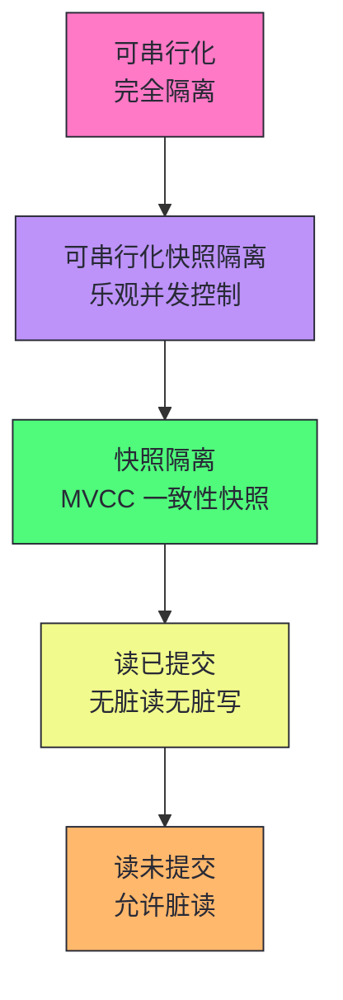
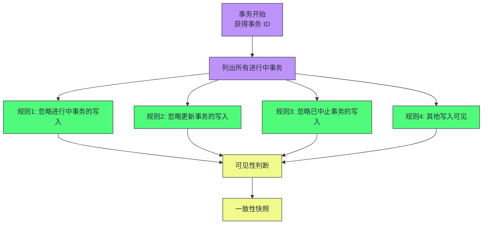
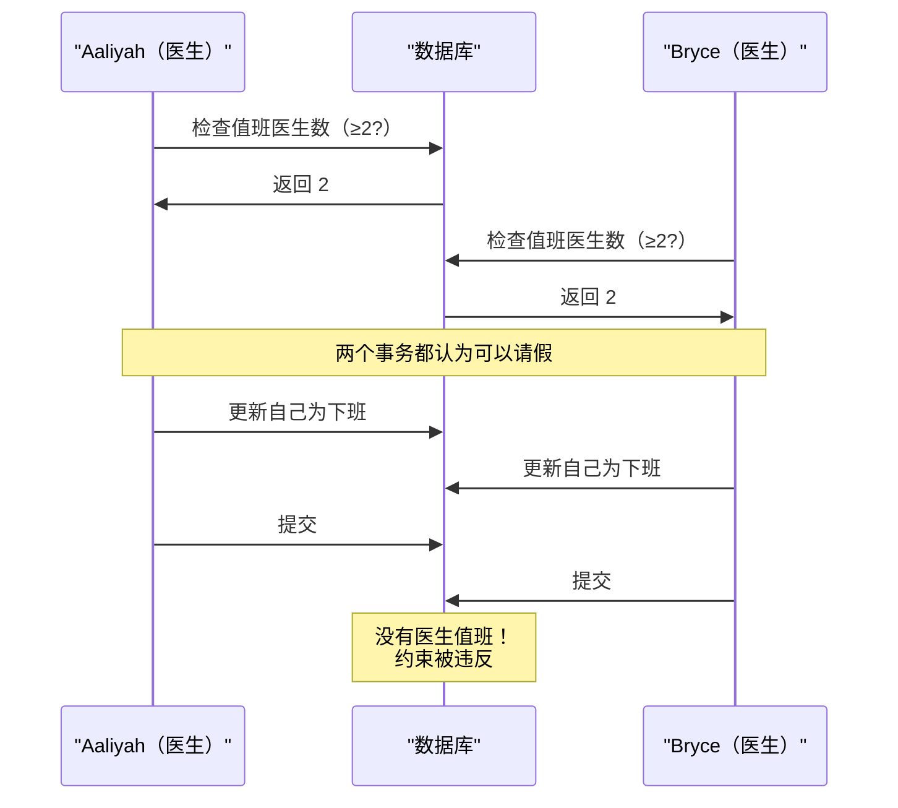
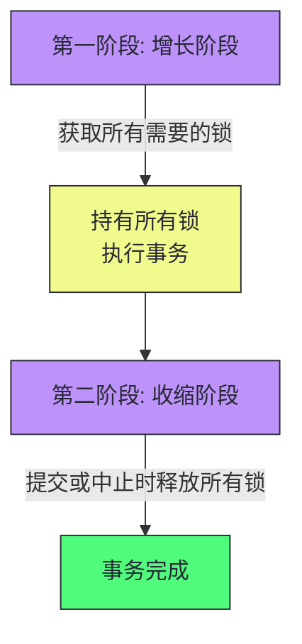
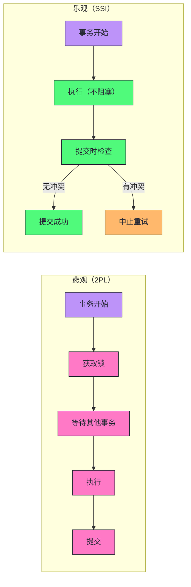
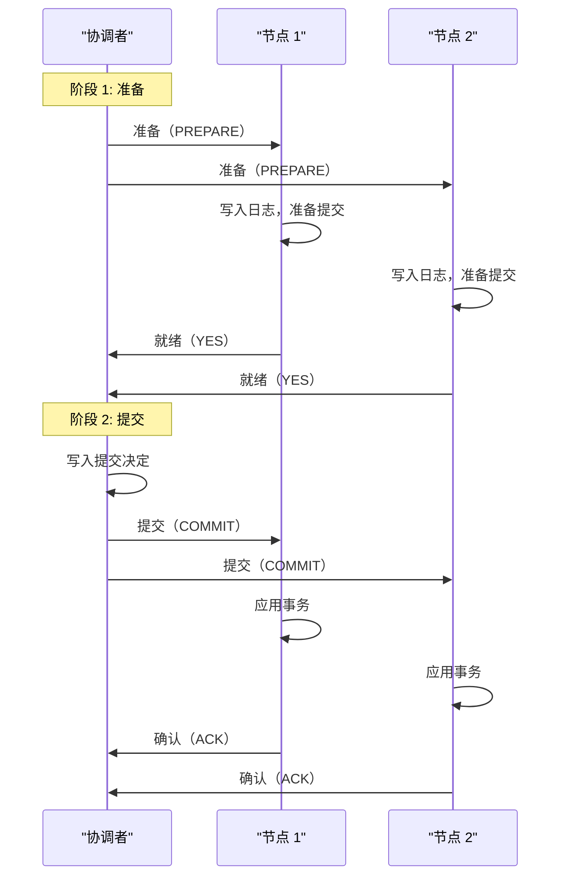
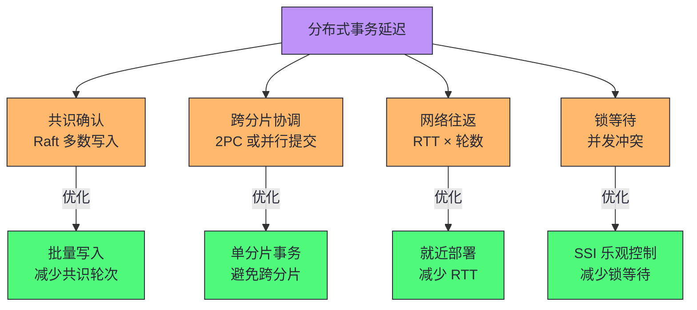

# 07 事务：从 ACID 到分布式事务的隔离级别

> [!abstract] 摘要
> 本文深入数据系统中最复杂的工程挑战——事务。事务是将多个读写组合成逻辑单元的机制，简化了应用的错误处理和并发问题。文章首先解构 ACID 的四个保证：原子性（全有或全无，非并发概念）、一致性（应用定义的不变性，非数据库独有）、隔离性（并发事务互不干扰，最复杂）、持久性（提交后不丢失，无绝对保证）。然后系统讲解弱隔离级别的光谱：读已提交（无脏读无脏写）、快照隔离（MVCC 实现一致性快照）、防止丢失更新（原子写、显式锁、自动检测、CAS）。深入分析写偏差与幻读——快照隔离无法防止的微妙并发异常。之后详解可串行化的三种实现：真正串行执行（单线程 + 存储过程）、两阶段锁定（悲观并发控制，读写互斥）、可串行化快照隔离 SSI（乐观并发控制，性能与快照隔离接近）。最后讨论分布式事务的原子提交挑战——两阶段提交（2PC）及其故障模式。核心认知：事务不是自然法则，而是简化编程模型的工程发明。NewSQL 数据库（CockroachDB、TiDB、Spanner）证明强一致性事务可以扩展，但弱隔离级别在性能和可用性上仍有价值。

---

## 第 1 章 事务的本质与 ACID

### 1.1 为什么需要事务

数据系统的严酷现实中，许多事情都可能出错：

- 数据库软件或硬件随时可能故障（包括写操作中途）
- 应用程序可能随时崩溃（包括一系列操作中途）
- 网络中断可能切断应用与数据库的连接
- 多个客户端可能同时写入，相互覆盖
- 客户端可能读到部分更新的无意义数据
- 客户端间的竞态条件可能导致错误

**事务**是将若干读写组合成逻辑单元的方式——要么全部成功（提交），要么全部失败（中止/回滚）。事务不是自然法则，而是为了简化编程模型而创造的工程发明。

> [!info] 核心概念：事务是安全保证的抽象
> 事务让应用忽略某些潜在的错误场景和并发问题，因为数据库代其处理。Post Office Horizon 丑闻的技术原因很可能就是底层会计系统缺乏 ACID 事务。但并非每个应用都需要事务——有时削弱或放弃事务保证可以获得更好的性能或可用性。关键是有意识地选择，而非因无知而承受风险。

### 1.2 ACID 的精确定义

ACID（原子性、一致性、隔离性、持久性）由 Härder 和 Reuter 于 1983 年提出。但实践中，一个数据库对 ACID 的实现不等于另一个数据库的实现——"ACID"不幸地已主要成为营销术语。

#### 原子性（Atomicity）：全有或全无

ACID 原子性**不是关于并发的**——它描述的是：如果客户端执行多次写入，部分写入后发生故障（崩溃、网络中断、磁盘满），数据库必须丢弃或撤销该事务的所有写入。

> [!note] 设计哲学：原子性是"可中止性"
> 原子性确保如果事务被中止，应用可以确信它没有改变任何内容，因此可以安全重试。也许"可中止性"是比"原子性"更好的术语——但历史已定。原子性简化了部分失败的处理：不需要追踪哪些更改已生效、哪些没有。

#### 一致性（Consistency）：应用定义的不变性

ACID 一致性指数据库处于"良好状态"的应用专用概念——你对数据有不变性（如会计系统的借贷平衡），事务必须保持这些不变性。

> [!warning] 生产避坑：ACID 的 C 取决于应用
> ACID 中的 C 通常取决于应用如何使用数据库，而不仅仅是数据库本身的属性。数据库可以强制执行简单约束（外键、唯一性、检查约束），但复杂不变性需要应用正确定义事务。如果你写入违反不变性的错误数据但未声明不变性，数据库无法阻止你。"一致性"一词在数据系统中有至少五种含义——副本一致性、一致快照、一致性哈希、CAP 的线性一致性、ACID 的应用不变性——这是术语混淆的重灾区。

#### 隔离性（Isolation）：并发事务互不干扰

隔离性意味着并发执行的事务彼此隔离——经典形式化为**可串行化**：每个事务可以假装它是数据库上唯一运行的事务，数据库确保结果与串行执行相同。

可串行化有性能代价。实践中许多数据库使用弱于可串行化的隔离——允许并发事务以有限方式相互干扰。Oracle 甚至不实现真正的可串行化（其"可串行化"实际是快照隔离）。

#### 持久性（Durability）：提交后不丢失

持久性承诺：事务成功提交后，写入的数据不会被遗忘，即使硬件故障或数据库崩溃。

- 单节点：数据写入非易失性存储（硬盘/SSD），使用 `fsync` 和 WAL
- 复制数据库：数据成功复制到一定数量的节点

> [!warning] 生产避坑：持久性没有绝对保证
> 完美的持久性不存在——如果所有硬盘和备份同时被销毁，数据库无法拯救你。SSD 断电后可能在数周内开始丢失数据；`fsync` 在某些情况下不保证正常工作；磁盘固件可能有 bug。实践中使用多种降低风险的技术——写入磁盘、远程复制、备份——它们应该一起使用。对任何理论上的"保证"保持合理怀疑。

### 1.3 单对象与多对象事务

原子性和隔离性适用于单对象和多对象：

- **单对象**：20KB JSON 文档写入中途断电，不应存储无法解析的片段。存储引擎普遍提供单对象原子性和隔离性（通过日志和锁）
- **多对象**：邮件应用中插入新邮件同时递增未读计数器——需要多对象事务确保两者同时可见或都不可见

多对象事务的场景：

- **外键引用**：插入相互引用的多条记录时，外键必须正确
- **反规范化**：更新反规范化数据时需同时更新多个文档
- **二级索引**：更改值时索引也需更新——没有事务隔离，记录可能出现在一个索引但不在另一个

> [!info] 核心概念：多对象事务需要事务边界标识
> 关系数据库通过客户端到服务器的 TCP 连接标识事务——`BEGIN TRANSACTION` 和 `COMMIT` 之间的所有操作属于同一事务。如果 TCP 连接中断，事务必须中止。许多非关系数据库没有这种方式将操作分组——即使有多写入操作，也不一定有事务语义（可能对某些键成功对另一些失败）。

### 1.4 重试中止的事务

ACID 数据库的理念：如果有违反保证的危险，宁愿完全放弃事务，也不允许半途而废。重试中止的事务是简单有效的错误处理机制，但不完美：

| 问题 | 说明 |
|------|------|
| **重复执行** | 事务成功但确认时网络中断——重试导致执行两次，需应用级去重 |
| **过载加剧** | 错误由过载引起时，重试使问题更糟——需限制重试次数、指数退避 |
| **永久错误** | 违反约束等永久错误，重试无意义 |
| **外部副作用** | 事务发送邮件后中止——重试会再次发送，需两阶段提交 |

> [!warning] 生产避坑：ORM 框架通常不重试中止的事务
> Rails ActiveRecord 和 Django 等 ORM 框架不会重试中止的事务——错误通常导致异常冒泡，用户输入被丢弃。这很可惜，因为回滚事务的全部意义在于启用安全重试。使用这些框架时，应用层必须显式实现重试逻辑，并处理重复执行和外部副作用问题。

---

## 第 2 章 弱隔离级别

### 2.1 隔离级别的光谱

可串行化有性能代价，许多数据库使用弱隔离级别——能防范部分并发问题但非全部。这些隔离级别更难理解，可能引发微妙错误。

### 2.2 读已提交

最基本的隔离级别，提供两个保证：

- **无脏读**：只能看到已提交的数据
- **无脏写**：只会覆盖已提交的数据

**无脏读的实现**：数据库同时记住旧的已提交值和当前持有写锁的事务设置的新值。事务进行时，其他读取者看到旧值；提交后切换到新值。

**无脏写的实现**：行级锁——修改行前必须获得锁，持有到事务结束。

> [!info] 核心概念：读已提交不防止丢失更新
> 读已提交防止脏写（未提交的写入被覆盖），但不防止丢失更新——两个事务都读取了同一个值，各自修改后写回，后写入覆盖前写入，前一个修改丢失。这是计数器递增、账户余额更新等场景的常见 bug。

### 2.3 快照隔离与 MVCC

读已提交仍可能发生**读偏差（Read Skew）**：转账时查看两个账户，可能看到一个账户转出后、另一个账户收款前的状态——钱"消失"了。

**快照隔离**解决此问题：每个事务从数据库的一致性快照中读取——看到事务开始时所有已提交的数据。即使数据随后被更改，事务也只看到旧数据。

快照隔离的核心原则：**读取者永远不会阻塞写入者，写入者也永远不会阻塞读取者**。

**多版本并发控制（MVCC）** 是快照隔离的实现技术：

每行有 `inserted_by` 和 `deleted_by` 字段（事务 ID）。更新被转换为删除+插入。行的多个版本形成链表，查询遍历版本找到可见的。

> [!warning] 生产避坑：隔离级别命名混乱
> SQL 标准没有快照隔离的概念（标准基于 1975 年 System R 的定义，快照隔离当时未发明）。不同数据库用不同名称指代快照隔离：PostgreSQL 称"可重复读"，Oracle 称"可序列化"，MySQL 的"可重复读"是弱于快照隔离的 MVCC 实现。这种命名混乱使得"可重复读"实际上没有人真正知道它意味着什么——必须阅读具体数据库的文档。

### 2.4 防止丢失更新

丢失更新是读-修改-写循环中的常见问题。四种解决方案：

| 方案 | 机制 | 优势 | 劣势 |
|------|------|------|------|
| **原子写操作** | `UPDATE counters SET value = value + 1` | 简单 | 不适用于复杂逻辑 |
| **显式锁定** | `SELECT ... FOR UPDATE` | 灵活 | 容易忘记加锁，死锁风险 |
| **自动检测** | 数据库检测丢失更新并中止 | 无需应用代码 | MySQL/InnoDB 不支持 |
| **条件写入（CAS）** | `UPDATE ... WHERE version = X` | 无锁 | 需重试逻辑 |

> [!info] 核心概念：复制数据库中的丢失更新更难防止
> 锁和 CAS 假设单一最新数据副本。多主/无主复制数据库允许多节点同时写入，无法保证单一最新副本——锁和 CAS 不适用。解决方案：CRDT（可交换操作自动合并）或 LWW（但 LWW 容易丢失更新）。这是复制数据库中丢失更新比单主数据库更难防止的根本原因。

### 2.5 写偏差与幻读

**写偏差（Write Skew）** 是快照隔离无法防止的微妙异常：

写偏差的特征：

- 两个事务更新**不同对象**（不是脏写或丢失更新）
- 但基于**相同的查询结果**做决策
- 快照隔离无法检测——需要真正的可串行化

**幻读（Phantom Read）** 是写偏差的根源：一个事务的写入改变了另一个事务查询的结果集。当查询没有返回行时（如"没有冲突的预订"），`SELECT FOR UPDATE` 无法锁定任何对象。

> [!warning] 生产避坑：写偏差在快照隔离下不会被自动检测
> PostgreSQL 的可重复读、MySQL/InnoDB 的可重复读、Oracle 的可串行化、SQL Server 的快照隔离——都不会自动检测写偏差。要自动防止写偏差，需要真正的可串行化隔离。如果无法使用可串行化，次优选择是显式锁定事务所依赖的行（`SELECT FOR UPDATE`），或对没有行可锁的幻读场景使用物化冲突（人为创建锁对象）。

---

## 第 3 章 可串行化的三种实现

可串行化是最强的隔离级别——保证即使事务并行执行，结果也与串行执行相同。三种实现方式：

### 3.1 真正串行执行

最简单的方法：消除并发——单线程上一次只执行一个事务。

2000 年代后可行的原因：

- RAM 足够便宜，活跃数据集可放入内存
- OLTP 事务通常很短，只进行少量读写

**存储过程**是串行执行的必要条件——交互式事务在应用和数据库之间来回通信，单线程下吞吐量极差。应用必须将整个事务代码作为存储过程提交。

| 优势 | 劣势 |
|------|------|
| 无锁开销，单线程可能比并发更快 | 吞吐量限于单 CPU 核心 |
| 实现简单，无并发问题 | 事务必须小且快 |
| 适合内存数据集 | 跨分片事务慢（VoltDB ~1000/s） |

> [!note] 设计哲学：存储过程的现代复兴
> 存储过程名声不好——厂商专用语言（PL/SQL、T-SQL）、难以调试和部署、数据库性能敏感。但现代实现已改用通用编程语言：VoltDB 用 Java/Groovy，Redis 用 Lua，MongoDB 用 JavaScript。当事务所需数据都在内存中，存储过程无需等待 I/O，可在单线程上实现高吞吐量。VoltDB 还用存储过程做复制——在每个副本上执行相同存储过程（状态机复制），要求确定性。

### 3.2 两阶段锁定（2PL）

> [!caution] 2PL ≠ 2PC
> 2PL（两阶段锁定）提供可串行化隔离；2PC（两阶段提交）提供分布式数据库中的原子提交。完全不同的概念，忽略名称的相似。

2PL 的锁规则：

- 读取需共享锁，写入需独占锁
- **写入者不仅阻塞其他写入者，还阻塞读取者**——这是与快照隔离的关键区别
- 锁持有到事务结束（两阶段：增长阶段获取锁，收缩阶段释放锁）

**谓词锁**解决幻读——锁定匹配搜索条件的对象（包括尚不存在的对象）。但谓词锁性能不佳，实践中使用**索引范围锁**（next-key locking）近似——锁定更大的对象范围，开销更低。

> [!warning] 生产避坑：2PL 的性能问题
> 2PL 的核心问题是并发性降低——读写互斥导致等待。一个读取整个表的事务会阻塞所有写入。延迟不稳定，高百分位可能非常慢。死锁更频繁，中止重试浪费工作。这是 2PL 自 1970 年代以来不是默认选项的原因。MySQL/InnoDB 和 SQL Server 的可串行化级别使用 2PL。

### 3.3 可串行化快照隔离（SSI）

SSI 是 2008 年提出的**乐观并发控制**——事务遇到可能危险的情况时不阻塞，继续执行，希望一切顺利。提交时数据库检查隔离性是否被违反，如果是则中止。

SSI 的核心思想：

1. 在快照隔离上运行事务（读取不阻塞）
2. 跟踪事务的读取依赖（哪些读取影响了决策）
3. 提交时检查是否存在"危险结构"——多个事务的读写依赖形成不可串行化的模式
4. 中止参与冲突的事务

> [!info] 核心概念：SSI 是性能与正确性的最佳平衡
> SSI 提供完全的可串行化，同时相比快照隔离只有很小的性能损失。它被用于 PostgreSQL 的可串行化隔离级别、CockroachDB、FoundationDB。如果冲突率低（大多数 OLTP 工作负载），SSI 性能接近快照隔离；如果冲突率高，中止重试的开销增加，但仍比 2PL 的锁等待好。SSI 是现代数据库可串行化的推荐选择。

### 3.4 三种实现对比

| 维度 | 串行执行 | 2PL | SSI |
|------|---------|-----|-----|
| **并发控制** | 无（单线程） | 悲观（锁） | 乐观（检查） |
| **隔离保证** | 可串行化 | 可串行化 | 可串行化 |
| **读取阻塞写入** | N/A | 是 | 否 |
| **死锁** | 无 | 有 | 无 |
| **中止重试** | 无 | 死锁时 | 冲突时 |
| **性能** | 单核限制 | 高争用时差 | 接近快照隔离 |
| **适用场景** | 内存、短事务 | 传统数据库 | 现代 OLTP |
| **代表系统** | VoltDB、Redis | MySQL、SQL Server | PostgreSQL、CockroachDB |

---

## 第 4 章 分布式事务与原子提交

### 4.1 单节点 vs 分布式事务

单节点事务的原子提交简单——数据库在磁盘上记录提交记录，写入成功即提交。分布式事务中，多个节点参与事务，必须确保所有节点要么全部提交、要么全部中止——这是**原子提交**问题。

### 4.2 两阶段提交（2PC）

2PC 是分布式原子提交的标准协议：

2PC 的两个阶段：

1. **准备阶段**：协调者问所有参与者"能否提交？"，参与者写入日志并回答 YES/NO
2. **提交阶段**：如果所有参与者都 YES，协调者写入提交决定并通知所有参与者提交；如果有任何 NO，协调者通知中止

> [!warning] 生产避坑：2PC 的故障窗口
> 2PC 的关键问题是协调者故障——如果协调者在写入提交决定后、通知参与者前崩溃，参与者会陷入不确定状态（不知道是提交还是中止）。参与者必须等待协调者恢复，期间持有锁，阻塞其他事务。这是 2PC 延迟不稳定的主要来源。此外，2PC 是阻塞协议——任何节点的故障都会阻塞整个事务。现代共识算法（Raft、Paxos）通过非阻塞的共识协议解决了此问题，我们将在后续文章中讨论。

### 4.3 分布式事务的工程现实

分布式事务的性能代价主要来自：

- **网络往返**：2PC 需要多轮网络通信
- **协调者故障**：参与者等待恢复，持有锁
- **跨分片协调**：每个分片需要独立的准备和提交

> [!note] 设计哲学：Spanner 的观点——事务代价应在瓶颈时处理
> Google Spanner 论文（2012）的观点：与其让应用程序员总是围绕缺乏事务进行编码，不如在瓶颈出现时让程序员处理因过度使用事务导致的性能问题。NewSQL 数据库（CockroachDB、TiDB、Spanner）证明分布式事务可以扩展——通过分片 + 共识协议提供 ACID 保证。代价是每个写入需要 Raft 多数确认，延迟比单机事务高。但简化编程模型的价值通常超过性能代价。

### 4.4 共识协议替代 2PC

现代分布式数据库（CockroachDB、TiDB、Spanner）使用共识协议（Raft、Paxos）替代传统 2PC：

| 维度 | 2PC | 共识协议（Raft） |
|------|-----|----------------|
| **协调者角色** | 单点，故障阻塞 | 由 Raft Leader 担任，故障自动选举 |
| **故障恢复** | 等待协调者恢复 | 自动选举新 Leader，秒级恢复 |
| **阻塞行为** | 任何节点故障阻塞 | 多数节点可用即继续 |
| **延迟** | 2 轮网络往返 | 1 轮多数确认 |
| **适用场景** | 传统分布式数据库 | NewSQL、云原生数据库 |

> [!info] 核心概念：共识协议将协调者变为容错的复制状态机
> 2PC 的根本问题是协调者是单点。共识协议（Raft/Paxos）将协调者实现为复制状态机——协调者的决定由 Raft 组的多数节点复制。Leader 故障时，Follower 自动选举新 Leader，从日志恢复状态，继续未完成的事务。这消除了 2PC 的阻塞窗口——只要多数节点可用，系统继续运行。我们将在后续文章中深入讨论共识算法。

### 4.5 分布式事务的延迟分解

理解分布式事务的延迟来源有助于优化：

> [!warning] 生产避坑：跨分片事务是性能杀手
> 单分片事务的吞吐量随节点数线性扩展；跨分片事务需要多分片协调，吞吐量难以扩展（VoltDB 报告跨分片写入约 1000/s，比单分片低数个数量级）。优化策略：(1) 数据建模使事务尽量在单分片内完成；(2) 使用并行提交（CockroachDB）减少协调轮次；(3) 批量写入减少共识轮次。如果业务必须跨分片，考虑是否可以用最终一致性替代强一致性。

---

## 第 5 章 隔离级别选型决策框架

### 5.1 按业务需求选型

| 业务需求 | 推荐隔离级别 | 原因 |
|---------|------------|------|
| 金融交易、强一致性 | 可串行化（SSI） | 防止所有竞态条件 |
| 一般 OLTP | 快照隔离 | 平衡性能与一致性 |
| 只读分析查询 | 快照隔离 | 一致性快照，不阻塞写入 |
| 高吞吐、可容忍最终一致 | 读已提交 | 性能好，防止脏读 |
| 简单键值操作 | 单对象原子操作 | 无需多对象事务 |

### 5.2 按并发模式选型

| 并发模式 | 风险 | 推荐方案 |
|---------|------|---------|
| 读-修改-写循环 | 丢失更新 | 原子写或 CAS |
| 基于查询结果决策 | 写偏差 | 可串行化或显式锁 |
| 幻读（查询无行可锁） | 写偏差 | 可串行化或物化冲突 |
| 长事务 + 并发写 | 锁等待 | SSI（乐观） |

> [!info] 核心概念：隔离级别选择是最重要的架构决策之一
> 隔离级别选择直接影响数据正确性和性能。太弱导致竞态条件（可能造成经济损失——比特币交易所因弱隔离破产）；太强导致性能下降和死锁。大多数 OLTP 应用使用快照隔离（PostgreSQL 默认）作为平衡点。如果业务涉及金融交易或强一致性要求，使用 SSI（PostgreSQL 可串行化级别）。关键是理解你选择的隔离级别**不能防止什么**——而非仅仅知道它能防止什么。

---

## 总结

事务的核心知识可以归纳为以下主线：

1. **事务是简化编程模型的工程发明**。将多个读写组合成逻辑单元，全有或全无，简化了部分失败和并发问题的处理。不是自然法则，而是有意识的设计选择。

2. **ACID 的四个保证各有微妙**。原子性是"可中止性"（非并发概念）；一致性取决于应用定义的不变性；隔离性是最复杂的；持久性没有绝对保证。

3. **隔离级别命名混乱是行业灾难**。"可重复读"在不同数据库中含义不同——PostgreSQL 是快照隔离，Oracle 是可串行化，MySQL 是弱于快照隔离的 MVCC。必须阅读具体数据库的文档。

4. **读已提交防止脏读和脏写**。最基本的隔离级别，是大多数数据库的默认设置。但不防止丢失更新——读-修改-写循环中的常见 bug。

5. **快照隔离通过 MVCC 提供一致性快照**。读取者不阻塞写入者，写入者不阻塞读取者。每个事务看到开始时的数据库状态。适合长只读查询。

6. **丢失更新有四种解决方案**。原子写操作（最简单）、显式锁定（灵活但易错）、自动检测（无需应用代码）、条件写入 CAS（无锁但需重试）。复制数据库中更难——需要 CRDT 或接受 LWW 的数据丢失。

7. **写偏差是快照隔离无法防止的微妙异常**。两个事务基于相同查询结果做决策，更新不同对象，提交后约束被违反。需要真正的可串行化。

8. **幻读是写偏差的根源**。查询无行可锁时，`SELECT FOR UPDATE` 无能为力。物化冲突是最后手段——人为创建锁对象。

9. **可串行化有三种实现**。串行执行（单线程+存储过程，适合内存数据）、2PL（悲观，读写互斥，性能差）、SSI（乐观，提交时检查，性能接近快照隔离）。

10. **SSI 是现代可串行化的推荐选择**。乐观并发控制，读取不阻塞，提交时检查冲突。PostgreSQL、CockroachDB、FoundationDB 使用。冲突率低时性能接近快照隔离。

11. **2PC 是分布式原子提交的标准协议**。准备+提交两阶段。协调者故障导致参与者不确定，持有锁阻塞——这是 2PC 延迟不稳定的主要来源。

12. **NewSQL 证明分布式事务可以扩展**。Spanner、CockroachDB、TiDB 通过分片+共识协议提供 ACID 保证。代价是延迟比单机高，但简化编程模型的价值通常超过性能代价。

> [!info] 专栏导航
> 本文是 [[00 专栏导览|数据密集型系统架构实战专栏]] 的第 07 篇，讨论了数据系统在并发和故障下的正确性保证。前六篇建立了数据分布的完整图景（编码、存储、复制、分片），本文在此基础上讨论了跨节点操作的原子性和隔离性。下一篇 [[08 分布式系统的麻烦：网络、时钟与故障检测]] 将深入分布式系统的底层物理现实——网络不可靠、时钟不同步、故障检测困难——这些是分布式事务和共识算法必须面对的根本挑战。

---

## 延伸思考

1. **你的数据库用的是什么隔离级别？** 是默认设置还是有意识地选择？你是否清楚这个级别**不能防止什么**？如果是读已提交，你的读-修改-写循环是否有丢失更新风险？

2. **你的应用是否有写偏差风险？** 检查所有"先查询再决策再写入"的模式——如果两个并发事务基于相同查询结果做决策，可能发生写偏差。快照隔离无法自动检测，需要可串行化或显式锁。

3. **你的 ORM 框架是否重试中止的事务？** Rails ActiveRecord 和 Django 默认不重试——你的应用是否显式实现了重试逻辑？是否处理了重复执行和外部副作用？

4. **你的分布式事务用的是 2PC 还是共识协议？** 如果是 2PC，你是否测试过协调者故障时的行为？参与者会持有锁多久？评估迁移到基于 Raft 的 NewSQL 数据库的成本。

5. **你的可串行化用的是 2PL 还是 SSI？** 如果是 2PL，高争用时的延迟是否可接受？如果是 SSI，中止率是否在合理范围？SSI 在冲突率高时中止重试的开销可能超过 2PL 的锁等待。

6. **你的持久性保证是否足够？** 单机 `fsync` 不够——SSD 断电可能丢数据。是否有远程复制？是否有定期备份？是否测试过从备份恢复？

---

*本文基于 Martin Kleppmann《Designing Data-Intensive Applications》2nd Edition 第 8 章整合而成，加入了作者的结构化重组和工程实践理解。*
