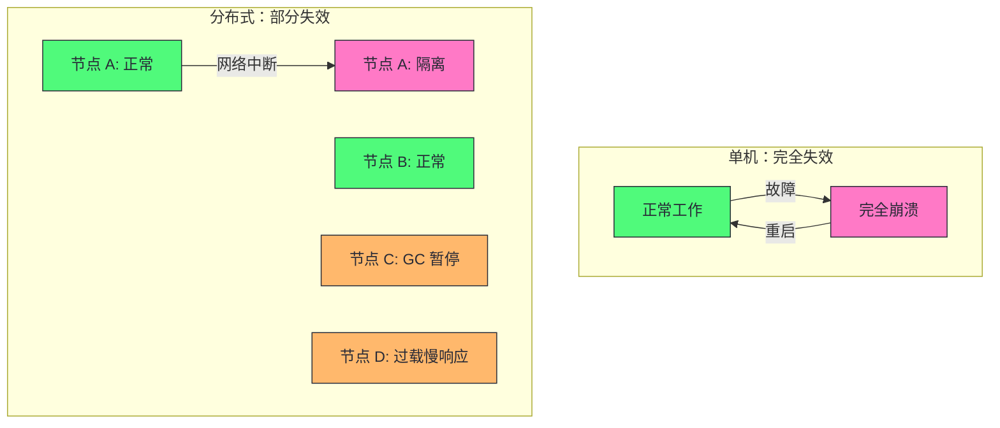
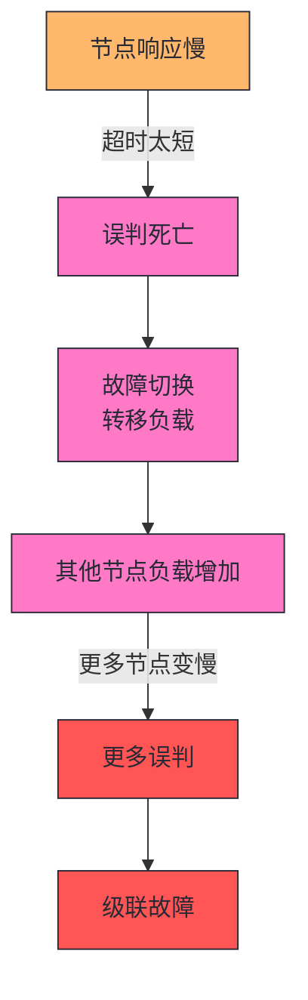
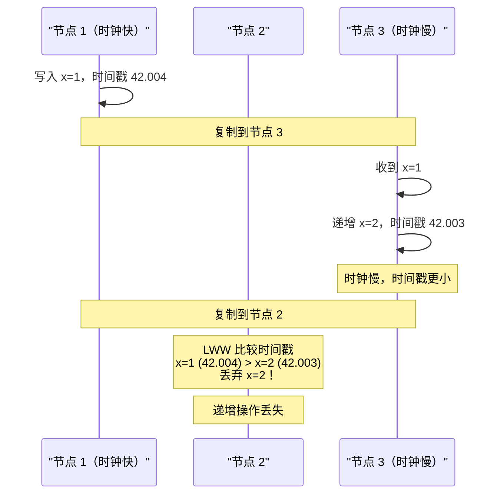
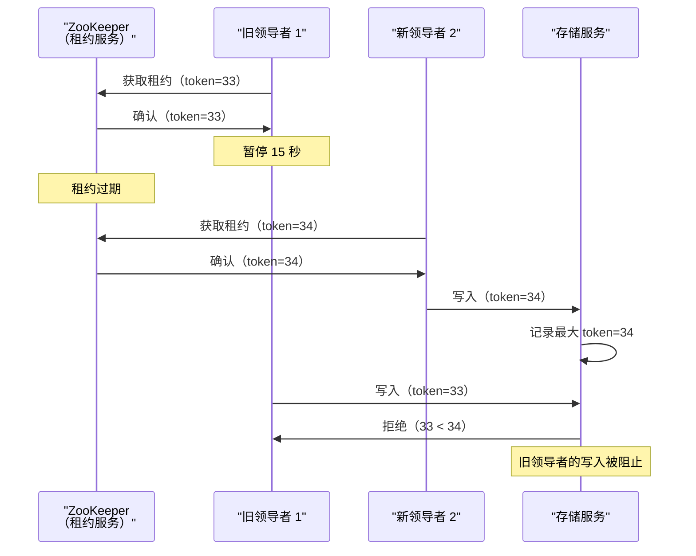
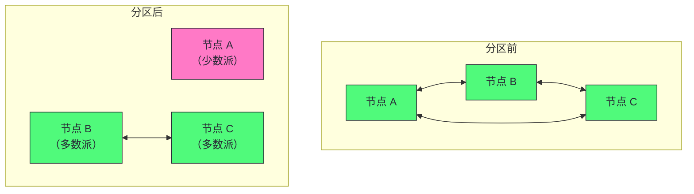

# 08 分布式系统的麻烦：网络、时钟与故障检测

> [!abstract] 摘要
> 本文深入分布式系统的底层物理现实——那些使分布式系统与单机系统根本不同的"麻烦"。文章首先讲清部分失效的概念：单机要么完全工作要么完全故障，分布式系统则可能部分组件以不可预测方式损坏而其他部分正常工作。然后系统讲解三大不可靠性：不可靠的网络（异步分组网络无法保证消息送达，请求无响应时无法区分请求丢失、节点宕机还是响应丢失）、不可靠的时钟（墙上时钟可能跳变、NTP 同步精度受网络延迟限制、LWW 冲突解决依赖时钟会导致数据丢失）、进程暂停（GC、虚拟化暂停、上下文切换可能导致线程暂停数十秒，租约在此期间过期）。之后讨论故障检测的困难（超时是唯一可靠方法但无"正确"值）、网络延迟的可变性来源（排队、拥塞、多租户）、同步网络 vs 异步网络的权衡（有界延迟 vs 高利用率）。最后引入知识、真理与谎言的哲学问题——节点如何"知道"自己是否仍是领导者。核心认知：分布式系统的麻烦不是边缘情况，而是基本现实。用不可靠的组件构建可靠的系统需要彻底改变思维方式——专注于可能出错的地方，即使概率很小。

---

## 第 1 章 部分失效：分布式系统的根本特征

### 1.1 单机 vs 分布式的故障模式

单台计算机上的软件行为通常可预测：要么工作，要么不工作。硬件正常时，相同操作产生相同结果（确定性）。硬件问题时，通常是系统完全失效（内核恐慌、蓝屏）。

这是计算机设计的有意选择——发生内部故障时，我们更希望计算机完全崩溃，而非返回错误结果。

分布式系统根本不同：**部分失效（Partial Failure）**——系统的某些部分以不可预测方式损坏，其他部分正常工作。部分失效是非确定性的：涉及多节点和网络的同一操作，有时成功，有时不可预测地失败。



> [!info] 核心概念：部分失效是非确定性的
> 部分失效的困难在于非确定性——同一操作有时成功，有时不可预测地失败。你甚至可能不知道操作是否成功！发送请求无响应时，无法区分：(a) 请求丢失、(b) 远程节点宕机、(c) 响应丢失。这种不确定性是分布式系统所有复杂性的根源——共识算法、重试机制、幂等性设计都是为了应对它。

### 1.2 容错的价值

容错使我们能用不可靠的组件构建可靠的系统——执行滚动升级时，一次重启一个节点，系统整体不间断运行。但实现容错前，必须了解应容忍的故障。

> [!warning] 生产避坑：怀疑、悲观和偏执是美德
> 在分布式系统中，怀疑、悲观和偏执是值得的。任何可能出错的事情终将出错——在一个足够大的系统中，百万分之一的事件每天都会发生。Coda Hale 的经历：数据中心内长期网络分区、PDU 故障、交换机故障、整个机架断电、数据中心骨干网故障、数据中心断电、司机撞进 HVAC 系统。必须考虑各种可能的故障，在测试环境中人为制造这些情况（故障注入）。

---

## 第 2 章 不可靠的网络

### 2.1 异步分组网络

互联网和数据中心内部网络（以太网）是**异步分组网络**——节点可以发送消息，但网络对消息何时到达或是否到达不提供任何保证。

发送请求期望响应时，许多事情可能出错：

- 请求丢失（网线被拔）
- 请求在队列中等待（网络或接收方过载）
- 远程节点失效（崩溃或断电）
- 远程节点暂时停止响应（长时间 GC 暂停）
- 响应丢失（交换机配置错误）
- 响应延迟（网络或本机过载）

> [!info] 核心概念：无法区分请求丢失和节点宕机
> 发送方无法判断数据包是否送达。唯一办法是接收方发回响应，而响应也可能丢失或延迟。在异步网络中，这些问题无法区分——你唯一拥有的信息是"还没有收到响应"。这是故障检测必须依赖超时的根本原因——没有其他可靠方法判断节点是否存活。

### 2.2 TCP 的局限性

TCP 提供"可靠"交付——检测并重传丢失数据包、重排乱序数据包、拥塞控制。但 TCP 不能解决所有网络不可靠问题：

- TCP 无法判断是数据包丢失还是确认丢失
- TCP 重传不保证新数据包一定能通过（网线被拔时 TCP 无法重新插上）
- TCP 连接关闭时，无法知道远程节点处理了多少数据
- 数据包确认仅意味着远程操作系统内核收到，应用可能在处理前崩溃

> [!note] 设计哲学：TCP 的可靠性是传输层，不是应用层
> TCP 的"可靠"是传输层的——保证数据包按序到达接收方操作系统内核。但不保证应用处理了数据。如果需要确认请求成功，必须来自应用本身的肯定响应。这是为什么 HTTP 有响应状态码、数据库有提交确认——应用层确认是 TCP 之上的必要层。

### 2.3 网络故障的实际情况

网络故障令人惊讶地常见，即使在受控的数据中心：

- 中等规模数据中心每月约 12 起网络故障
- 增加冗余网络设备不能按预期减少故障——人为错误（配置错误）是停机主因
- 广域光纤中断曾被归咎于奶牛、河狸、鲨鱼
- 云区域间高百分位往返时间可达数分钟
- 数据中心内交换机升级期间可能出现超过一分钟的数据包延迟
- 网络可能单向工作——A 能到 B，B 能到 C，但 A 不能到 C
- 短暂网络中断可能产生持续远长于原始问题的影响

> [!warning] 生产避坑：网络故障的错误处理必须定义和测试
> 如果网络故障的错误处理没有定义和测试，可能发生任意糟糕的事情——集群死锁、永久无法服务请求、甚至删除所有数据。有意触发网络问题并测试系统响应（故障注入）是必要的。处理网络故障不意味着必须容忍——可以简单地向用户显示错误，但必须了解软件如何反应并确保能恢复。

---

## 第 3 章 故障检测与超时

### 3.1 故障检测的困难

许多系统需要自动检测故障节点（负载均衡器移除死节点、单主复制故障切换）。但网络的不确定性使判断节点是否在工作变得困难。

明确的故障反馈很少：

- 进程崩溃但 OS 运行时，OS 可拒绝 TCP 连接（RST/FIN）
- HBase 等系统可通知其他节点崩溃
- 交换机管理接口可检测链路故障

但这些快速反馈不可依赖。通常必须假设根本收不到任何响应——重试几次，等待超时，宣布节点死亡。

### 3.2 超时的困境

超时是检测故障的唯一可靠方法，但没有"正确"的值：

- **太长**：节点失效后等待时间长，用户体验差
- **太短**：可能错误宣布存活节点死亡（临时负载峰值导致响应慢），触发不必要的故障切换，转移负载到其他节点，可能导致级联故障



### 3.3 网络延迟的可变性来源

网络延迟的可变性主要来自排队：

- **交换机队列**：多节点同时向同一目的地发送时，交换机排队
- **操作系统队列**：CPU 核心繁忙时，请求在操作系统排队
- **虚拟化暂停**：VM 被暂停数十毫秒让其他 VM 使用 CPU
- **TCP 流控**：发送方在数据进入网络前就排队（拥塞控制）

> [!info] 核心概念：可变延迟是成本/收益权衡的结果
> 网络中的可变延迟不是自然法则，而是成本/收益权衡的结果。电路交换网络（电话）通过静态资源划分实现有界延迟，但利用率低、成本高。分组交换网络（互联网）通过动态共享带宽实现高利用率、低成本，但延迟可变。多租户云环境进一步加剧可变性——你无法控制或了解其他客户对共享资源的使用。如果需要延迟保证，需要专用硬件和独占带宽分配——成本更高。

### 3.4 自适应超时

更好的做法是不使用固定超时，而是持续测量响应时间及其可变性（抖动），自动调整超时。**Phi 累积故障检测器**（Akka、Cassandra 使用）就是这样一种实现——根据历史响应时间分布计算节点故障的"怀疑度"。

> [!note] 设计哲学：超时设置应基于实验
> 在多租户云环境中，网络延迟高度可变。超时没有"正确"值——需要通过实验确定：长时间跨越多台机器测量 RTT 分布，结合应用特性确定故障检测延迟与过早超时风险的适当权衡。自适应超时（如 Phi 检测器）比固定超时更健壮，但实现更复杂。

---

## 第 4 章 不可靠的时钟

### 4.1 时钟的重要性与两类时钟

应用依赖时钟回答：超时、响应时间百分位、缓存过期、日志时间戳等。分布式系统中时间棘手——通信不是即时的，每台机器有自己的时钟。

两种时钟：

| 时钟类型 | 特征 | 适用场景 | 问题 |
|---------|------|---------|------|
| **墙上时钟（Time-of-day）** | 返回当前日期时间，与 NTP 同步 | 时间点（事件何时发生） | 可能跳变（NTP 重置、闰秒、夏令时） |
| **单调时钟（Monotonic）** | 保证始终向前移动 | 持续时间（超时、响应时间） | 绝对值无意义，不可跨节点比较 |

### 4.2 时钟同步的准确性限制

时钟同步远不如想象中可靠：

- 石英时钟漂移：Google 假设服务器漂移达 200ppm（每 30 秒漂移 6ms）
- NTP 同步精度受网络延迟限制（互联网同步最小误差 35ms，尖峰可达 1 秒）
- 防火墙隔离 NTP 服务器时，漂移可能累积到巨大差异
- 闰秒导致一分钟变 59 或 61 秒，曾导致许多大型系统崩溃
- 虚拟机中硬件时钟虚拟化，暂停表现为时钟跳跃
- 用户可能故意设置错误时间（游戏作弊）

> [!warning] 生产避坑：不正确的时钟导致静默数据丢失
> 不正确的时钟很容易被忽视——大多数功能看起来正常，尽管时钟逐渐偏离。如果软件依赖准确的同步时钟，结果更可能是静默且不易察觉的数据丢失，而非戏剧性崩溃。如果使用需要同步时钟的软件，必须监控集群中所有机器的时钟偏移，任何漂移过大的节点应被宣布死亡。

### 4.3 LWW 依赖时钟的危险

多主复制数据库中，**最后写入胜（LWW）** 用时间戳解决冲突——保留最大时间戳的写入。但时钟不同步会导致问题：



> [!warning] 生产避坑：LWW 会静默丢弃数据
> 时钟偏慢的节点写入后，需要经过时钟偏差时间才能覆盖之前值——大量数据在无任何错误报告的情况下被静默丢弃。LWW 也无法区分快速连续的写入（有因果关系）和真正并发的写入。需要因果关系追踪机制（版本向量）防止违反因果关系。**逻辑时钟**（基于递增计数器而非石英晶体）是事件排序的更安全替代方案。

### 4.4 带置信区间的时钟

将时钟读数视为时间点没有意义——它更像一个时间范围（置信区间）。如果只知道时间 ±100ms，时间戳中的微秒数字毫无意义。

Google Spanner 的 **TrueTime API** 和 Amazon **ClockBound** 明确报告时钟置信区间：请求当前时间返回 `[earliest, latest]`。Spanner 利用此实现跨数据中心的快照隔离——提交读写事务前故意等待置信区间长度，确保因果顺序正确。

> [!info] 核心概念：Spanner 用时钟置信区间实现外部一致性
> Spanner 的核心创新不是"精确时钟"，而是"时钟置信区间"。如果两个事务的置信区间不重叠，可以确定它们的顺序。提交前等待区间长度确保任何可能读取该数据的事务发生在足够晚的时间，使区间不重叠。Google 在每个数据中心部署 GPS 接收器或原子钟，将时钟同步到约 7ms，使等待时间可接受。这是用高精度时钟换取强一致性的工程实践。

---

## 第 5 章 进程暂停

### 5.1 暂停的危险

分布式系统中，进程可能在任意点暂停数十秒，而线程不知道自己暂停了。租约（Lease）机制尤其危险：

```java
while (true) {
    request = getIncomingRequest();
    if (lease.expiryTimeMillis - System.currentTimeMillis() < 10000) {
        lease = lease.renew();
    }
    if (lease.isValid()) {
        process(request);  // 如果在此暂停 15 秒？
    }
}
```

如果线程在 `lease.isValid()` 和 `process(request)` 之间暂停 15 秒，租约已过期，另一个节点已成为领导者，但本节点仍会处理请求——两个领导者同时操作！

### 5.2 暂停的原因

| 原因 | 持续时间 | 说明 |
|------|---------|------|
| **GC 停止世界** | 数秒到数分钟（旧 GC） | JVM GC 暂停所有线程 |
| **虚拟化暂停** | 数十毫秒到数秒 | VM 挂起/恢复（实时迁移） |
| **上下文切换** | 毫秒 | OS 切换线程，hypervisor 切换 VM |
| **线程争用** | 不定 | 等待锁或队列 |
| **磁盘 I/O** | 数秒 | 页错误从慢速磁盘读取 |
| **终端设备** | 不定 | 笔记本合盖、手机休眠 |

> [!warning] 生产避坑：租约不能假设暂停不会发生
> 租约机制假设检查时间和处理请求之间经过的时间很短——这个假设在进程暂停时失效。解决方案：(1) 检查租约前获取 fencing token，处理请求时验证 token 仍然有效；(2) 在可能暂停的操作前检查租约，并在操作前再次检查；(3) 使用外部心跳（如来自其他节点的确认）而非本地时钟判断是否仍是领导者。我们将在后续文章中讨论 fencing token。

### 5.3 限制 GC 影响的实践

GC 暂停对分布式系统是重大威胁。几种缓解策略：

| 策略 | 机制 | 代价 |
|------|------|------|
| **GC 前通知** | GC 前告知其他节点自己即将暂停 | 需要 GC 框架支持 |
| **低暂停 GC** | 使用 ZGC、Shenandoah 等低暂停 GC | 吞吐量略降 |
| **内存限制** | 限制堆大小减少 GC 时间 | 可能增加 GC 频率 |
| **对象池** | 减少对象分配降低 GC 压力 | 代码复杂度增加 |
| **无 GC 语言** | 使用 Rust、Go（GC 暂停短） | 生态限制 |

> [!info] 核心概念：GC 暂停是分布式系统的隐藏故障源
> JVM 的 Stop-The-World GC 暂停曾持续数分钟（旧 GC），现代 GC（G1、ZGC）已大幅改善但仍可达数十毫秒。对分布式系统而言，即使是 100ms 的暂停也可能导致租约过期、心跳超时、误判死亡。Netflix 的 Chaos Monkey 故障注入测试发现，GC 暂停是生产环境中最常见的"隐形"故障源——节点没有崩溃，只是"消失"了几秒。在 Java 分布式系统中，GC 调优不仅是性能问题，更是可靠性问题。

---

## 第 6 章 知识、真理与谎言

### 6.1 节点如何"知道"自己的状态

分布式系统中，节点对自己的状态没有权威认知——它可能认为自己是领导者，但其他节点已经选举了新领导者。这是"知识、真理与谎言"问题的核心。

**真相由多数决定**——分布式系统中没有"上帝视角"，真相是节点间通过共识达成的。一个节点认为自己是领导者，只有当多数节点同意时才为真。

### 6.2 Fencing Token

为防止暂停的旧领导者继续操作，使用 **fencing token**（隔离令牌）：



> [!info] 核心概念：Fencing Token 防止暂停的旧领导者造成破坏
> Fencing token 是单调递增的数字，每次租约变更时递增。存储服务记住见过的最大 token，拒绝小于该值的写入。这确保即使旧领导者暂停后"醒来"并尝试写入，其 token 已过时，写入被拒绝。这是将"真相由多数决定"转化为具体机制的实践——存储服务作为"真理仲裁者"，token 作为"真相版本号"。

### 6.3 拜占庭故障

本章讨论的故障都是"崩溃-停止"模型——节点要么正常工作要么停止响应。更复杂的故障是**拜占庭故障（Byzantine Fault）**——节点可能恶意行为，发送错误或矛盾的消息。

> [!warning] 生产避坑：不要混淆崩溃故障和拜占庭故障
> 大多数分布式数据库假设崩溃-停止模型——节点不会恶意行为，只会崩溃或网络中断。如果环境中存在恶意节点（如区块链、跨组织系统），需要拜占庭容错（BFT）算法，代价更高（需要 3f+1 个节点容忍 f 个恶意节点，而非共识协议的 2f+1）。在受控的数据中心内，崩溃-停止模型足够——BFT 的额外代价不值得。但在不受信任的环境中（如公链），BFT 是必要的。

---

## 第 7 章 网络分区与脑裂

### 7.1 网络分区的定义

**网络分区（Network Partition）** 是网络的一部分因故障与其余部分隔离。注意：这与存储系统的分片（partitioning）无关——同一术语在不同上下文中有不同含义。

网络分区的典型场景：



### 7.2 CAP 定理的实践含义

网络分区时，系统必须在一致性（C）和可用性（A）之间选择：

- **CP 系统**：分区时拒绝服务（不可用），保持一致性。如：单主复制 + 同步确认的数据库
- **AP 系统**：分区时继续服务（可用），接受不一致。如：多主复制、无主复制

> [!info] 核心概念：CAP 定理的精确表述
> CAP 定理常被误解为"三选二"，但精确表述是：**在网络分区发生时，系统不能同时提供线性一致性和完全可用性**。分区不发生时，系统可以同时提供 C 和 A。分区发生时，必须选择。大多数现代系统不是纯粹的 CP 或 AP，而是根据操作类型提供不同的保证——如读操作可容忍最终一致性（AP），写操作要求强一致性（CP）。CAP 定理我们将在后续文章中更深入讨论。

---

## 第 9 章 故障注入测试

### 9.1 为什么需要故障注入

分布式系统的故障模式太多，正常测试无法覆盖。故障注入（Chaos Engineering）是有意触发故障，测试系统响应——在测试环境中制造问题比在生产中第一次遇到要好得多。

### 9.2 常见故障注入场景

| 故障类型 | 注入方法 | 验证目标 |
|---------|---------|---------|
| **网络延迟** | tc qdisc netem 延迟数据包 | 超时和重试逻辑 |
| **网络分区** | iptables DROP 规则 | 故障切换和脑裂防护 |
| **数据包丢失** | tc qdisc netem loss | 重传和错误处理 |
| **节点崩溃** | kill -9 进程 | 故障检测和恢复 |
| **时钟偏移** | date -s 或 chrony 偏移 | LWW 和租约逻辑 |
| **磁盘满** | dd 填充磁盘 | 错误处理和告警 |
| **GC 暂停** | jcmd GC.run 或分配大量对象 | 租约和心跳逻辑 |

> [!info] 核心概念：Chaos Engineering 不是破坏，是验证
> Netflix 的 Chaos Monkey 随机杀死生产环境实例——听起来疯狂，但目的是验证系统的容错能力。如果杀死一个实例导致服务中断，说明系统不够健壮——这个问题迟早会在真实故障中出现。故障注入将"迟早会发生的故障"提前到可控环境中。关键原则：(1) 从小范围开始（先测试环境，再生产）；(2) 有明确的停止条件和回滚方案；(3) 注入前预测系统行为，注入后验证预测——如果不符，发现了 bug。

### 9.3 故障注入工具生态

| 工具 | 类型 | 适用场景 |
|------|------|---------|
| **Chaos Monkey** | 随机杀实例 | Netflix 开源，生产环境验证 |
| **Chaos Mesh** | Kubernetes 故障注入 | 云原生环境，支持网络/磁盘/Pod 故障 |
| **Litmus** | Kubernetes 混沌工程 | CNCF 项目，GitOps 集成 |
| **tc/netem** | Linux 网络模拟 | 网络延迟、丢包、带宽限制 |
| **iptables** | 防火墙规则 | 网络分区模拟 |
| **Pumba** | Docker 故障注入 | 容器级网络和进程故障 |

> [!warning] 生产避坑：故障注入必须渐进式引入
> 不要一开始就在生产环境大规模注入故障。推荐路径：(1) 测试环境手动注入，验证基本容错；(2) 预发环境自动化注入，覆盖更多场景；(3) 生产环境小范围、工作时间注入，逐步扩大范围。每次注入前明确"预期行为"——如果系统行为与预期不符，发现了 bug。如果注入导致严重故障，立即停止并修复。故障注入的目标是建立对系统容错能力的信心，而非制造事故。

---

## 第 10 章 同步网络 vs 异步网络

### 10.1 为什么不能让网络延迟可预测

电话网络（电路交换）极其可靠——建立呼叫时分配固定带宽，端到端延迟有界。为什么数据中心网络不这样做？

答案：**针对突发流量优化**。电路适用于恒定比特率（音频通话），但网页请求、邮件、文件传输有突发性——TCP 根据可用容量动态调整速率，最大化利用率。

### 10.2 混合网络与 QoS

一些技术尝试在分组交换网络上模拟电路交换的延迟保证：

- **InfiniBand**：链路层端到端流量控制，减少排队需求，但仍可能因链路拥塞延迟
- **QoS 机制**：数据包优先级和调度、准入控制（限制发送方速率）
- **L4S**：低延迟、低损耗、可扩展吞吐量的新网络算法
- **Linux TC**：允许应用重新设置数据包优先级

但这些 QoS 机制目前未在多租户数据中心和公共云中启用。当前部署的技术不允许对网络延迟或可靠性做任何保证——必须假设网络拥塞、排队和无界延迟会发生。

> [!note] 设计哲学：延迟保证是成本问题，不是技术问题
> 实现网络延迟保证在技术上是可能的——电路交换、QoS、InfiniBand 都可以提供有界延迟。但多租户云环境选择不启用这些机制，因为它们降低了资源利用率，提高了成本。在公有云中，你无法控制或了解其他客户对共享资源的使用——这是延迟可变性的根本原因。如果业务需要延迟保证，需要专用硬件和独占带宽——成本显著更高。这是工程权衡，不是技术限制。

| 维度 | 电路交换（电话） | 分组交换（互联网） |
|------|----------------|------------------|
| **延迟** | 有界 | 无界 |
| **利用率** | 低（空闲时浪费带宽） | 高（动态共享） |
| **成本** | 高 | 低 |
| **适用** | 恒定比特率 | 突发流量 |

> [!note] 设计哲学：可变延迟是成本/收益权衡
> 网络中的可变延迟不是自然法则，而是成本/收益权衡的结果。静态资源划分（电路交换）实现有界延迟但利用率低、成本高。动态资源划分（分组交换）实现高利用率、低成本但延迟可变。多租户云环境选择后者——成本更低但延迟不可预测。如果业务需要延迟保证（如高频交易），需要专用硬件和独占带宽——成本显著更高。

---

## 总结

分布式系统麻烦的核心知识可以归纳为以下主线：

1. **部分失效是分布式系统的根本特征**。单机要么完全工作要么完全故障；分布式系统可能部分组件以不可预测方式损坏。部分失效是非确定性的——同一操作有时成功有时失败，甚至不知道是否成功。

2. **网络是异步分组网络，不保证消息送达**。请求无响应时无法区分请求丢失、节点宕机还是响应丢失。TCP 提供传输层可靠性但不保证应用处理了数据。

3. **超时是故障检测的唯一可靠方法但无"正确"值**。太长导致恢复慢，太短导致误判和级联故障。自适应超时（Phi 检测器）比固定超时更健壮。

4. **网络延迟可变是成本/收益权衡**。分组交换通过动态共享实现高利用率但延迟无界。电路交换有界延迟但利用率低。多租户云环境进一步加剧可变性。

5. **时钟不可靠——墙上时钟可能跳变，NTP 精度受网络限制**。LWW 依赖时钟会静默丢弃数据。逻辑时钟（递增计数器）是事件排序的更安全替代。

6. **时钟读数应视为置信区间而非时间点**。Spanner 的 TrueTime API 报告置信区间，提交前等待区间长度确保因果顺序——用高精度时钟换取强一致性。

7. **进程暂停可能导致节点"不知道自己暂停了"**。GC、虚拟化、上下文切换可暂停数十秒。租约机制在此期间失效，可能导致两个领导者同时操作。

8. **Fencing Token 防止暂停的旧领导者造成破坏**。单调递增的 token，存储服务拒绝小于已见最大值的写入。将"真相由多数决定"转化为具体机制。

9. **真相由多数决定，没有"上帝视角"**。节点认为自己是领导者，只有多数同意时才为真。共识算法（Raft/Paxos）是实现这一原则的工程工具。

10. **怀疑、悲观和偏执是分布式系统工程师的美德**。任何可能出错的事情终将出错。故障注入测试是必要的。用不可靠的组件构建可靠的系统需要彻底改变思维方式。

11. **故障注入是验证容错能力的必要实践**。Chaos Engineering 有意触发故障，将"迟早会发生的故障"提前到可控环境。从测试环境渐进式引入，每次注入前预测行为，注入后验证预测。

12. **拜占庭故障在受控数据中心内不是主要威胁**。大多数分布式数据库假设崩溃-停止模型。BFT 算法的额外代价（3f+1 节点）在受控环境中不值得。但在不受信任的环境中（区块链、跨组织系统），BFT 是必要的。

> [!info] 专栏导航
> 本文是 [[00 专栏导览|数据密集型系统架构实战专栏]] 的第 08 篇，揭示了分布式系统的底层物理现实。前七篇讨论了数据系统的架构和机制（编码、存储、复制、分片、事务），本文解释了为什么这些机制在分布式环境中如此复杂——网络不可靠、时钟不准、进程会暂停。下一篇 [[09 架构硬决策框架：从 DDIA 到架构硬决策]] 将从 DDIA 的技术基础转向《Software Architecture - The Hard Parts》的架构决策方法论——如何在耦合、一致性、性能等相互竞争的关注点之间做出权衡。

---

## 延伸思考

1. **你的系统是否处理了网络分区？** 测试过数据中心内网络分区吗？A 能到 B、B 能到 C、A 不能到 C 的场景呢？如果网络故障的错误处理没有定义和测试，可能发生任意糟糕的事情。

2. **你的超时设置是固定的还是自适应的？** 固定超时在负载变化时可能太短或太长。评估 Phi 累积故障检测器或类似的自适应方案——根据历史响应时间分布调整超时。

3. **你的系统是否依赖同步时钟？** 如果使用 LWW 冲突解决，你的时钟同步精度如何？是否监控时钟偏移？评估逻辑时钟（版本向量）作为更安全的替代。

4. **你的租约机制是否处理了进程暂停？** 检查租约检查和操作之间是否有窗口——GC 暂停可能在此窗口内导致租约过期。使用 fencing token 防止暂停的旧节点造成破坏。

5. **你的故障切换是否可能导致级联故障？** 节点过载时误判死亡 → 转移负载 → 更多节点过载 → 级联故障。加入重平衡速率限制和过载保护。

6. **你是否做过故障注入测试？** 有意触发网络问题、节点故障、时钟偏移，测试系统响应。在测试环境中制造这些情况比在生产中第一次遇到要好得多。

---

*本文基于 Martin Kleppmann《Designing Data-Intensive Applications》2nd Edition 第 9 章整合而成，加入了作者的结构化重组和工程实践理解。*
