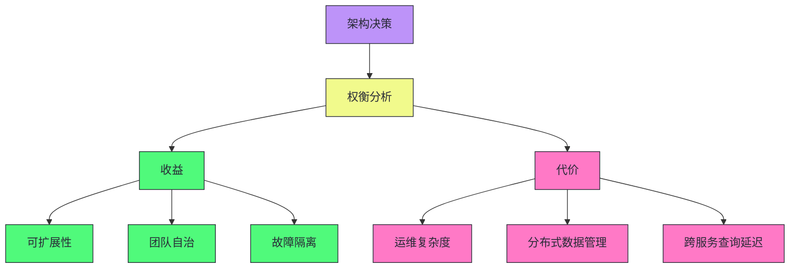
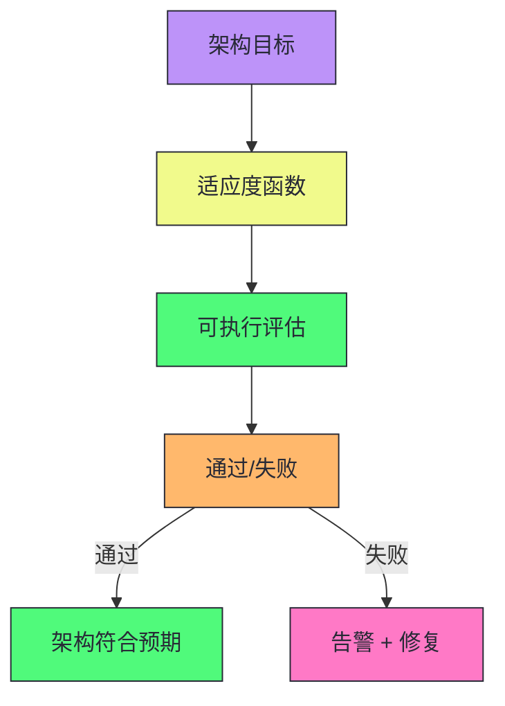
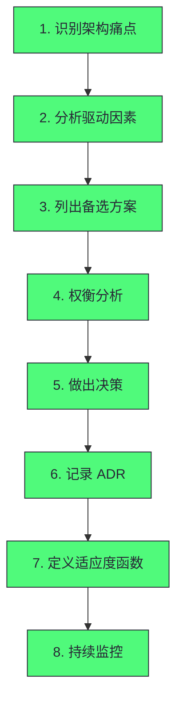
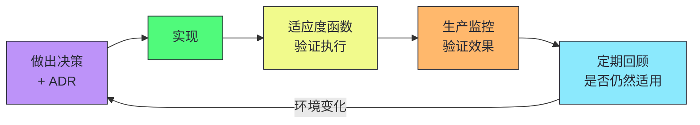

# 09 架构硬决策框架：当没有最佳实践时我们该怎么办

> [!abstract] 摘要
> 本文从 DDIA 的技术基础转向《Software Architecture - The Hard Parts》的架构决策方法论。核心观点：软件架构不存在"最佳实践"，每一个架构决策都是权衡——微服务比单体具备更好的可扩展性，但代价是更高的运维复杂度和分布式数据管理难度。文章系统讲解两个关键工具：架构决策记录（ADR）——用结构化文档捕获决策的上下文、推理过程、备选方案和后果，解决"架构失忆"问题；架构适应度函数——借鉴进化算法思想，用可执行的自动化评估机制衡量架构质量属性是否仍然满足预期。通过 Sysops Squad 案例（运行十年的单体运维系统）演示真实的架构腐化信号：部署耦合、数据库瓶颈、技术栈枷锁、团队摩擦。核心认知：架构师的真实处境是在不确定性、利益博弈、信息不足中做决策，后果在 6 个月到 3 年后才显现。可解释、可追溯的决策过程比"正确"的决策结果更重要。

---

## 第 1 章 "最佳实践"的幻觉

### 1.1 一个让架构师头疼的问题

想象你是一家互联网公司的首席架构师。核心产品是运行七年的单体应用，每天承载数百万次交易。开发团队从 20 人膨胀到 200 人，代码库从 30 万行膨胀到 300 万行。每次发布需要协调十几个团队，每次线上事故牵一发而动全身。

技术圈的声音越来越响亮：**迁移到微服务架构**。Netflix、Uber、Amazon 的成功案例显示，把单体拆解成几百个独立部署的小服务，实现了团队自治、弹性伸缩、故障隔离。

半年后，你把单体拆成了 30 个微服务。然后发现：

- 原来一个数据库事务就能完成的订单创建，现在需要协调 5 个服务，涉及复杂的分布式事务
- 原来一个 SQL JOIN 就能搞定的报表查询，现在需要跨服务数据聚合，延迟从 50ms 飙升到 800ms
- 原来一次部署，现在变成了 30 次部署，运维复杂度指数级上升
- 开发环境搭建从 30 分钟变成了 4 小时

微服务到底是正确的决策，还是灾难？

### 1.2 为什么架构没有"最佳实践"

"最佳实践"隐含的假设是：**在所有上下文中，存在一个普遍最优的解决方案**。这个假设在软件架构领域几乎从来不成立。

Neal Ford 在书的开篇提出核心观点：**软件架构中的每一个决策都是一场权衡（tradeoff）**。没有任何一种架构风格在所有维度上都优于其他风格。



同样的架构决策，在不同公司、不同团队、不同业务阶段，可能产生截然相反的结果。Netflix 迁移微服务成功，是因为他们同时具备了：

1. **足够大的规模**：单体的扩展成本已高于微服务的协调成本
2. **强大的工程能力**：能自研 Hystrix、Eureka、Zuul 等基础设施
3. **充足的人力资源**：数百名 SRE 和基础架构工程师
4. **清晰的业务边界**：内容服务、推荐服务、用户服务天然解耦

而 30 人的初创公司盲目照搬 Netflix 架构，很可能在工程基础设施上耗尽所有资源，却没有任何业务价值产出。

> [!note] 设计哲学：架构没有对错，只有权衡
> 书中引用了一句话：*"There are no right or wrong answers in architecture — only trade-offs."* 架构没有对错，只有权衡。这句话听起来像废话，但真正内化它，需要对"上下文"有极深的敏感度——什么规模、什么团队、什么业务阶段、什么历史包袱。脱离上下文谈架构最佳实践，都是耍流氓。

### 1.3 架构师的真实处境

如果架构没有最佳实践，架构师每天在做什么？在以下压力中艰难做决策：

| 压力来源 | 典型场景 |
|---------|---------|
| **业务压力** | 产品经理需要新功能三周上线，架构师说需要三个月重构 |
| **团队压力** | 开发团队熟悉 Java，架构师调研出 Go 性能更好 |
| **技术趋势压力** | Kubernetes 是事实标准，但现有系统跑在裸金属上 |
| **历史决策压力** | 五年前选的消息队列已被淘汰，迁移代价巨大 |

更糟糕的是，大多数架构决策的后果要在 **6 个月到 3 年后** 才充分显现。发现决策错误时，已积累大量技术债，推倒重来成本更高。

> [!info] 核心概念：架构决策的延迟反馈是技术债的根源
> 架构决策的反馈周期极长——代码写错了编译就报错，但架构选错了可能一年后才暴露。这种延迟反馈使得架构师无法通过快速迭代学习，必须依靠前瞻性分析和历史经验。这也是为什么 ADR（记录决策推理过程）如此重要——它让未来的架构师能理解当初的权衡，而非盲目推翻或固守。

---

## 第 2 章 Sysops Squad：贯穿全书的案例

### 2.1 案例背景

Sysops Squad 是一家 IT 运维服务公司，为企业客户提供现场技术支持。客户硬件故障时通过系统提交工单，系统分配给最合适的现场技术专家，专家上门解决后关闭工单。

核心系统是一个**庞大的单体应用**：

- **工单管理**：工单创建、分配、更新、关闭全生命周期
- **专家调度**：根据技能、地理位置、工作量分配工单
- **客户管理**：企业客户注册、合同、账单管理
- **知识库**：历史工单和解决方案沉淀
- **报表分析**：运营报表、SLA 达成率、专家绩效
- **通知系统**：向客户和专家发送 SMS/Email/App 推送

### 2.2 系统腐化的信号

系统运行十年，最近两年出现明显腐化信号：

**部署耦合**：任何模块修改都需要整个系统重新发布。改了知识库的一个查询 SQL，也要把工单管理、调度系统一起重新部署。每次发布协调 6 个开发团队，发布窗口从每周一次变成每两周一次。

**数据库成为性能瓶颈**：所有模块共享同一个 Oracle 数据库，报表分析的复杂 SQL 查询把 OLTP 操作的响应时间从 50ms 拖慢到 500ms。

**技术栈的枷锁**：系统用 Java 8 + Spring 3 + Oracle 11g 构建，引入新技术（如 Elasticsearch 优化知识库搜索）需要在单体框架内硬塞，改动风险极高。

**团队扩张的摩擦**：开发团队从 15 人扩展到 80 人。每个人都需要理解整个代码库才能修改，代码冲突、知识孤岛、职责不清越来越严重。

> [!warning] 生产避坑：这些腐化信号在你的系统中存在吗？
> Sysops Squad 的腐化信号在许多运行 5 年以上的系统中都存在：(1) 发布需要协调多个团队；(2) 数据库成为共享瓶颈；(3) 技术栈升级困难；(4) 新人需要长时间才能上手。如果这些信号同时出现，系统已经到了需要架构演进的临界点。但"拆分微服务"不是唯一答案——可能只需要模块化单体、数据库拆分、或部分服务化。关键是分析具体的痛点驱动因素。

### 2.3 为什么虚构案例比真实案例更有教学价值

书中用 Sysops Squad 而非某个真实公司的案例，是有意为之。真实案例往往受制于信息保密、叙述不完整、上下文复杂等问题，读者很难提取清晰的决策逻辑。虚构案例可以被精确地控制变量：讨论服务粒度时，把数据拆分的复杂性暂时屏蔽；讨论数据拆分时，把工作流复杂性暂时固定。这种"控制变量"的教学方式，让每一个架构决策的因果关系都更加清晰可见。

> [!note] 设计哲学：控制变量法是架构教学的正确方式
> 真实世界的架构决策交织着几十个变量——团队、历史、预算、业务压力。如果用真实案例教学，读者会被淹没在细节中，无法提取清晰的决策逻辑。虚构案例允许"控制变量"——每次只改变一个因素，观察其影响。这不仅是教学技巧，也是架构分析的方法论——分析真实系统时，也应该尝试控制变量：如果其他条件不变，只改变这一个因素，会发生什么？这有助于理清因果链，避免被复杂性淹没。

### 2.4 Sysops Squad 的架构约束

在分析 Sysops Squad 的架构决策时，需要考虑以下约束：

| 约束类型 | 具体约束 | 影响 |
|---------|---------|------|
| **业务约束** | SLA 要求工单 4 小时内响应 | 不能长时间停机 |
| **数据约束** | 10 年历史数据，不能丢失 | 迁移必须渐进式 |
| **团队约束** | 80 人开发团队，6 个子团队 | 拆分需考虑团队边界 |
| **技术约束** | Oracle 11g，Java 8，Spring 3 | 技术栈升级需渐进 |
| **预算约束** | 不能大规模重写 | 必须用绞杀者模式 |
| **合规约束** | 客户合同数据需审计 | 数据拆分需保留审计能力 |

这些约束使得 Sysops Squad 不能简单地"推倒重来"——任何架构演进都必须在保持业务连续性的前提下渐进式进行。

---

## 第 3 章 架构决策记录（ADR）

### 3.1 架构失忆的症状

你加入一个运行三年的系统，看到代码里有一段奇怪逻辑——所有用户数据写入前都经过复杂加密转换，但密钥硬编码在代码里。明显违反安全最佳实践，为什么没人改？

去问原来的开发者，得到的答案：
- "我也不知道，我来之前就这样了"
- "好像当时有什么安全审计要求，但我不清楚细节"
- "改过一次出了 bug 回滚了，再也没人动"
- "写这段代码的人已经离职了"

这是**架构失忆（Architectural Amnesia）**——随着时间推移和人员流动，架构决策背后的推理过程彻底丢失，只留下决策结果的代码。

危害：不知道设计决策为什么存在时，无法判断它是深思熟虑的合理设计还是时间压力下的妥协，无法判断改动是否安全。

### 3.2 ADR 是什么

**架构决策记录（ADR）** 用结构化文档捕获每个重要架构决策的上下文、推理过程、备选方案、最终选择及后果，随代码存储在版本控制系统中。

> [!info] 核心概念：ADR 是"我们为什么这样做"的备忘录
> ADR 不是设计文档，不是 API 文档，也不是项目计划书——它是"我们为什么这样做"的备忘录。ADR 是极轻量的文档习惯——通常一页纸，不需要反复审批，一个 Markdown 文件加 Git 提交就足够。关键在于把决策的推理过程原原本本记录下来，而非只记录决策结果。

### 3.3 ADR 的标准结构

一份 ADR 包含：

**1. 标题**：`[编号]. [动词] + [名词]`，如 `ADR-001. 使用 PostgreSQL 作为主数据存储`

**2. 状态（Status）**：Proposed / Accepted / Deprecated / Superseded

**3. 上下文（Context）**：描述为什么这个问题存在，以及决策时的外部约束。只描述事实，不包含个人判断。

**4. 决策（Decision）**：清晰陈述做了什么决定，以及为什么选择这个方案而非其他方案。必须把推理链写清楚。

**5. 后果（Consequences）**：诚实列出所有后果，包括正面和负面。这是最容易忽略的部分——人们倾向于只写好处，把坏处藏起来。但 ADR 的价值恰恰在于让未来的人看到完整画面。

### 3.4 ADR 的工程价值

| 层次 | 价值 |
|------|------|
| **消除架构失忆** | 新工程师翻看 ADR 目录，15 分钟了解所有重大决策来龙去脉 |
| **提升决策质量** | 知道要写 ADR 时会更认真思考——"这个方案的后果是什么？我能写清楚吗？" |
| **支持架构演化** | 状态机制让决策有生命周期管理，旧决策被标记为 Deprecated 而非无声消逝 |

> [!warning] 生产避坑：ADR 最常见的失败模式
> "有流程、没习惯"——团队定义了 ADR 模板，但只在大型项目启动时写，日常迭代中忽略。结果 ADR 目录里全是三年前的文档，不能反映系统现状。解决方案：把 ADR 写作融入 PR Review 流程——任何引入新外部依赖、改变服务通信方式、影响数据模型的 PR，都需要附带一份 ADR。这样 ADR 更新频率与代码变更保持同步。

### 3.5 ADR 示例：Sysops Squad 通知系统拆分

```
# ADR-001. 将通知系统从 Sysops Squad 单体中拆离为独立服务

## 状态
Accepted

## 上下文
当前 Sysops Squad 系统的通知功能（SMS/Email/App 推送）与工单管理、调度逻辑紧密耦合。
第三方通知服务商（Twilio、SendGrid）的 API 变更或服务降级，多次造成工单处理主流程
阻塞。通知发送的量级（日均 50 万次）远超工单处理量（日均 2 万次），两者的扩展需求
差异显著。通知系统的代码占整个代码库的 15%，但贡献了约 40% 的故障。

## 决策
将通知系统拆离为独立的微服务（Notification Service），通过异步消息队列（Kafka）
与主系统通信，而非直接 HTTP 调用。

考量过的备选方案：
- 方案 A：保持单体，但在通知调用处加入熔断器（Circuit Breaker）。
  否决原因：熔断器只能缓解故障扩散，无法解决扩展性差异和发布耦合问题。
- 方案 B：拆离为独立服务，但保留同步 HTTP 通信。
  否决原因：通知本身是一个最终一致性操作，没有必要同步等待。同步调用会引入
  通知服务的可用性依赖，反而降低了主系统的健壮性。

## 后果
正面：
- 通知系统可以独立扩展和部署
- 第三方服务商的故障不再影响主流程
- 通知系统可以独立迭代，无需主系统配合发布

负面：
- 引入了消息队列的运维复杂度
- 通知从同步变为异步，需要更新 UI 的实时反馈逻辑
- 消息重复投递的幂等性需要额外设计
- 本地开发环境需要额外启动 Kafka
```

> [!note] 设计哲学：好的 ADR 的三个特征
> 这份 ADR 示例展示了好的 ADR 的三个关键特征：(1) **上下文足够具体**——不是泛泛说"耦合太高"，而是给出具体数据（日均 50 万次通知、15% 代码占比、40% 故障贡献）；(2) **否决原因足够诚实**——列出考量过的备选方案及其被否决的理由，而非只写最终选择；(3) **后果足够完整**——列出真实的负面代价（消息队列运维复杂度、幂等性设计、开发环境复杂度），不回避。一个你能写清楚 ADR 的决策，才是一个真正想清楚了的决策。如果无法清晰写出上下文和后果，很可能意味着还没有真正理解这个问题。

---

## 第 4 章 架构适应度函数

### 4.1 架构质量如何客观衡量

ADR 解决"记住为什么这样做"，**架构适应度函数（Architecture Fitness Functions）** 解决更难的问题：**如何客观判断系统是否仍然满足架构预期？**

软件系统有内在的熵增倾向——随着时间推移和需求变化，系统实际状态不可避免地偏离架构预期。这种偏离是渐进的、局部的、不显眼的：

- 架构规定"服务 A 不允许直接访问服务 B 的数据库"，但紧急 bug 修复时一个工程师图省事直接查了数据库，违规调用从未被清理
- 架构规定"所有外部 API 调用必须有超时设置"，但随着代码库增长，30% 的调用点从未设置超时
- 架构规定"模块间只能通过接口通信"，但随着开发者更替，规则只存在于口头约定

这些问题的共同特征：**用肉眼 Code Review 根本发现不了**，需要系统级、持续、自动化的检测。

### 4.2 适应度函数的定义

"适应度函数"来自进化算法——评估解决方案对目标问题的"适应程度"，适应度高的个体更可能被选择繁殖。

Neal Ford 等人将此概念引入软件架构：**一个衡量架构特定质量属性的、可执行的、自动化的评估机制**。



### 4.3 适应度函数的分类

| 类型 | 说明 | 示例 |
|------|------|------|
| **原子适应度函数** | 衡量单一架构维度 | 循环依赖检测、服务间调用超时检查 |
| **整体适应度函数** | 衡量多个维度组合 | 用户体验 = 延迟 + 可用性 + 正确性 |
| **触发式适应度函数** | 特定事件触发 | PR 提交时运行架构规则检查 |
| **持续适应度函数** | 持续运行 | 生产环境延迟监控、服务依赖图实时分析 |

### 4.4 适应度函数的实践示例

**示例 1：循环依赖检测**

架构规定服务间不允许循环依赖。用依赖分析工具（如 ArchUnit、Dependometer）在 CI 中检测：

```java
// ArchUnit 示例
@ArchTest
static final ArchRule no_cycles =
    slices().matching("com.sysops..(*)..").should().beFreeOfCycles();
```

**示例 2：服务间数据库访问禁止**

架构规定每个服务只能访问自己的数据库。用静态分析或运行时检测：

```java
@ArchTest
static final ArchRule services_should_not_access_other_databases =
    classes().that().resideInAPackage("..ticket..")
        .should().notAccessClassesThat().resideInAPackage("..notification..db..");
```

**示例 3：API 调用超时检查**

架构规定所有外部 API 调用必须有超时设置。用代码扫描工具检测无超时的 HTTP 客户端调用。

> [!info] 核心概念：适应度函数将架构治理自动化
> 没有适应度函数时，架构治理依赖人工 Code Review——随着团队和代码增长，这不可持续。适应度函数将架构规则转化为可执行的自动化检查，嵌入 CI/CD 流程。违反规则的 PR 自动失败，而非依赖 reviewer 记住所有规则。这是"架构即代码"的实践——架构约束不再是文档中的文字，而是代码中的断言。

### 4.5 适应度函数的层次体系

一个成熟的架构治理体系应该有多层次的适应度函数：

| 层次 | 检测内容 | 工具示例 | 运行时机 |
|------|---------|---------|---------|
| **代码级** | 循环依赖、包结构、类间耦合 | ArchUnit、Checkstyle | PR 提交时 |
| **模块级** | 模块依赖方向、API 契约一致性 | Spring Cloud Contract | CI 构建 |
| **服务级** | 服务间调用拓扑、数据库访问边界 | 服务网格（Istio）、运行时检测 | 持续运行 |
| **系统级** | 延迟、可用性、吞吐量 SLO | Prometheus、Grafana | 生产监控 |
| **组织级** | 团队对齐康威定律、代码所有权 | CODEOWNERS、Backstage | 持续评估 |

> [!warning] 生产避坑：适应度函数不是越多越好
> 适应度函数过多会导致"告警疲劳"——开发者收到太多告警，开始忽略所有告警。好的适应度函数应该：(1) 对应真实的架构约束，而非"理论上应该"；(2) 失败时有明确的修复指引，而非只说"违反规则"；(3) 优先级分层——关键约束阻断 PR，次要约束只告警。从最关键的 3-5 个架构约束开始，逐步扩展。

---

## 第 5 章 架构权衡分析框架

### 5.1 权衡分析的结构化方法

《The Hard Parts》提供了一个结构化的权衡分析框架：



### 5.2 痛点驱动因素分析

架构决策不应从"我们要用微服务"开始，而应从具体的痛点驱动因素开始：

| 痛点 | 驱动因素 | 可能的解决方案 |
|------|---------|--------------|
| **部署耦合** | 任何修改需要全量发布 | 模块化单体、部分服务化、微服务 |
| **数据库瓶颈** | 共享数据库性能下降 | 读写分离、数据库分片、数据拆分 |
| **团队摩擦** | 团队间代码冲突 | 模块化、服务拆分、康威定律对齐 |
| **技术栈枷锁** | 无法引入新技术 | 模块化、绞杀者模式、部分重写 |
| **扩展性差异** | 不同模块扩展需求不同 | 部分服务化、独立扩展 |

> [!note] 设计哲学：从痛点出发，而非从技术出发
> 架构决策的最大错误是从"我们要用 X 技术"开始，而非从"我们有什么痛点"开始。微服务不是目标，解决部署耦合、团队摩擦、扩展性差异才是目标。如果痛点只是部署耦合，模块化单体可能就够了——它解决了部署耦合，但没有引入分布式数据管理的复杂性。从痛点出发分析驱动因素，才能选择最小代价的解决方案。

### 5.3 Sysops Squad 的痛点驱动因素分析

以 Sysops Squad 为例，分析每个痛点的驱动因素和可选方案：

| 痛点 | 根本驱动因素 | 方案 A（模块化单体） | 方案 B（部分服务化） | 方案 C（全面微服务） |
|------|------------|-------------------|-------------------|-------------------|
| **部署耦合** | 所有模块共享发布周期 | 部分解决（模块独立构建） | 解决（独立服务独立部署） | 解决 |
| **数据库瓶颈** | OLTP 和 OLAP 共享数据库 | 不解决 | 解决（通知/报表独立 DB） | 解决 |
| **团队摩擦** | 80 人共享代码库 | 部分解决（模块所有权） | 解决（服务团队自治） | 解决 |
| **技术栈枷锁** | 所有模块用同一技术栈 | 不解决 | 部分解决（新服务可用新技术） | 解决 |
| **扩展性差异** | 通知 50 万/天 vs 工单 2 万/天 | 不解决 | 解决（通知独立扩展） | 解决 |
| **新增复杂度** | - | 低 | 中 | 高 |
| **分布式事务** | - | 无 | 少量 | 大量 |
| **运维成本** | - | 低 | 中 | 高 |

> [!info] 核心概念：方案 B（部分服务化）往往是最佳选择
> 对 Sysops Squad 而言，方案 B（部分服务化）可能是最佳选择——只拆分扩展性差异最大的通知系统和报表分析，保留工单管理和专家调度的紧耦合（它们共享事务）。这解决了主要痛点（部署耦合、数据库瓶颈、扩展性差异），但没有引入全面微服务的分布式事务复杂度。这是"从痛点出发"的实践——不是"全拆"或"不拆"，而是"拆什么、为什么拆、拆的代价是什么"。

---

## 第 6 章 从 DDIA 到架构硬决策

### 6.1 两个视角的互补

DDIA 提供了数据系统的**技术基础**——存储、复制、分片、事务、一致性。这些是架构决策的"素材库"。

《The Hard Parts》提供了架构决策的**方法论**——权衡分析、ADR、适应度函数。这些是使用素材库的"工艺"。

| 维度 | DDIA | The Hard Parts |
|------|------|----------------|
| **关注点** | 数据系统内部机制 | 架构决策方法论 |
| **问题** | 如何实现 X | 是否应该用 X |
| **输出** | 技术选项和权衡 | 决策记录和治理 |
| **视角** | 工程师 | 架构师 |

### 6.2 结合实践的决策流程

1. **识别痛点**（The Hard Parts）：Sysops Squad 的部署耦合、数据库瓶颈
2. **分析技术选项**（DDIA）：分片 vs 复制 vs 数据拆分
3. **权衡分析**（The Hard Parts）：每个选项的代价和收益
4. **记录决策**（ADR）：为什么选择这个方案
5. **定义治理**（适应度函数）：如何确保决策被执行
6. **持续验证**（适应度函数 + 监控）：架构是否仍然满足预期

> [!info] 核心概念：技术深度 + 决策方法论 = 优秀架构师
> 只懂技术不懂方法论的架构师，会陷入"锤子找钉子"的陷阱——学了微服务就想拆分所有系统。只懂方法论不懂技术的架构师，会做出无法落地的决策——说"要保证一致性"但不知道 2PC 和 Raft 的区别。优秀的架构师需要两者兼备——DDIA 提供技术深度，The Hard Parts 提供决策框架。本专栏前 8 篇建立了 DDIA 的技术基础，后续文章将在此基础上讨论架构决策方法论。

### 6.3 架构决策的反馈闭环

完整的架构决策不是一次性活动，而是一个持续闭环：



> [!note] 设计哲学：架构决策是持续演进的闭环
> 架构决策不是"做一次就结束"的活动，而是"决策→实现→验证→回顾→新决策"的持续闭环。环境变化（业务规模增长、团队重组、技术演进）会使原来的决策不再适用。定期回顾 ADR，标记过时决策为 Deprecated，创建新 ADR 说明为什么迁移——这是架构演进的正确方式。适应度函数确保决策被执行，生产监控验证决策效果，定期回顾确保决策仍然适用。三者构成完整的架构治理闭环。

---

## 总结

架构硬决策的核心知识可以归纳为以下主线：

1. **架构没有"最佳实践"，只有权衡**。同样的架构决策在不同上下文中产生截然相反的结果。Netflix 微服务成功是因为规模、工程能力、人力资源、业务边界同时具备。脱离上下文谈最佳实践是耍流氓。

2. **架构师在不确定性中做决策**。业务压力、团队压力、技术趋势、历史决策四种压力交织。决策后果在 6 个月到 3 年后才显现——延迟反馈是技术债的根源。

3. **ADR 解决架构失忆**。用结构化文档捕获决策的上下文、推理过程、备选方案、后果。不是设计文档，而是"我们为什么这样做"的备忘录。融入 PR Review 流程保持更新。

4. **适应度函数将架构治理自动化**。借鉴进化算法思想，用可执行的自动化评估机制衡量架构质量。将架构规则转化为 CI/CD 中的断言，而非依赖人工 Code Review。

5. **从痛点出发，而非从技术出发**。架构决策应从具体痛点驱动因素开始（部署耦合、数据库瓶颈、团队摩擦），选择最小代价的解决方案。微服务不是目标，解决痛点才是。

6. **Sysops Squad 案例演示了真实的架构腐化**。部署耦合、数据库瓶颈、技术栈枷锁、团队摩擦——这些信号在运行 5 年以上的系统中普遍存在。

7. **DDIA + The Hard Parts = 技术深度 + 决策方法论**。DDIA 提供"如何实现"的技术选项，The Hard Parts 提供"是否应该用"的决策框架。两者结合才是优秀架构师的完整能力。

8. **可解释、可追溯的决策过程比"正确"的决策结果更重要**。架构决策没有"正确"答案，但有"可追溯"和"不可追溯"的区别。ADR 让决策可追溯，适应度函数让执行可验证。即使决策最终被证明错误，可追溯的推理过程也是宝贵的学习材料。

9. **架构决策是持续演进的闭环**。决策→实现→验证→回顾→新决策。环境变化使原来的决策不再适用，定期回顾 ADR，标记过时决策，创建新 ADR——这是架构演进的正确方式。

10. **方案 B（部分服务化）往往是最佳选择**。不是"全拆"或"不拆"，而是"拆什么、为什么拆、拆的代价是什么"。只拆分扩展性差异最大、痛点最严重的模块，保留紧耦合的核心——这解决了主要痛点，但没有引入全面微服务的复杂度。

> [!info] 专栏导航
> 本文是 [[00 专栏导览|数据密集型系统架构实战专栏]] 的第 09 篇，从 DDIA 的技术基础转向《Software Architecture - The Hard Parts》的架构决策方法论。前 8 篇建立了数据系统的技术基础（编码、存储、复制、分片、事务、分布式麻烦），本文在此基础上引入架构决策的工具和框架。下一篇 [[10 耦合解剖学与服务拆分]] 将深入耦合的类型学——静态耦合 vs 动态耦合、同步 vs 异步——以及如何基于耦合分析做出服务拆分决策。

---

## 延伸思考

1. **你的系统是否有架构失忆？** 找一个看起来奇怪的代码或设计，问团队"为什么这样做"。如果没人能回答，你有架构失忆。评估引入 ADR 的成本——一个 Markdown 文件加 Git 提交，极轻量。

2. **你的架构规则是否有自动化验证？** 列出你系统的架构规则（服务间不直接访问数据库、所有 API 调用有超时、模块间不循环依赖），检查哪些有自动化验证。没有的，评估用 ArchUnit 或类似工具实现适应度函数。

3. **你的架构决策是从痛点出发还是从技术出发？** 如果你的架构提案以"我们要用微服务/Kubernetes/事件驱动"开头，你可能从技术出发。改为以"我们有 X 痛点，Y 技术可以解决"开头。

4. **你的系统是否有 Sysops Squad 的腐化信号？** 检查：发布是否需要协调多个团队？数据库是否是共享瓶颈？技术栈升级是否困难？新人上手是否需要长时间？如果多个信号同时出现，系统可能需要架构演进。

5. **你的 ADR 是否融入了 PR Review 流程？** 如果 ADR 只在大型项目启动时写，日常迭代中忽略，你有"有流程没习惯"的问题。把 ADR 作为引入新依赖、改变通信方式、影响数据模型的 PR 的必要附件。

6. **你的架构决策是否有延迟反馈意识？** 架构决策的后果在 6 个月到 3 年后才显现。你是否定期回顾过去的 ADR，验证决策是否仍然适用？是否有机制在环境变化时标记旧 ADR 为 Deprecated？

7. **你的架构治理是人工还是自动化？** 如果架构规则依赖 Code Review 人工检查，随着团队增长将不可持续。评估用 ArchUnit 或类似工具实现适应度函数，将关键架构约束转化为 CI/CD 中的自动化断言。

8. **你的架构决策是否考虑了"方案 B"？** 面对架构痛点，是否只有"全拆微服务"或"不拆"两个选项？评估"部分服务化"——只拆分痛点最严重、扩展性差异最大的模块，保留紧耦合的核心。这往往是代价与收益的最佳平衡。

---

*本文基于 Neal Ford、Mark Richards、Pramod Sadalage、Zhamak Dehghani《Software Architecture: The Hard Parts》第 1 章整合而成，加入了作者的结构化重组和工程实践理解。*
