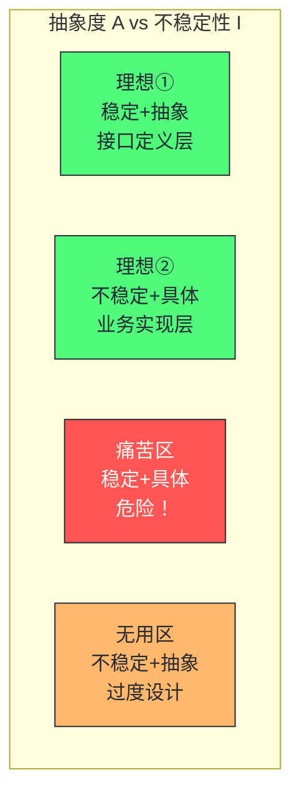
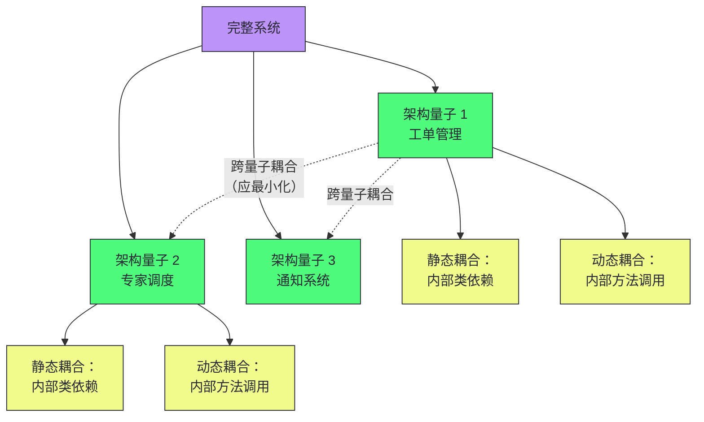
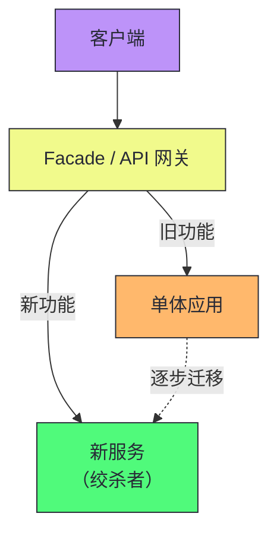

# 10 耦合解剖学与服务拆分：静态、动态与数据耦合的权衡

> [!abstract] 摘要
> 本文深入软件架构中最核心也最常被误解的概念——耦合。耦合不是二元属性（要么耦合要么不耦合），而是多维度的、有程度区别的、有时甚至是必要的。文章系统讲解耦合的三个维度：静态耦合（编译时依赖网络，用不稳定性 I = Ce/(Ca+Ce) 和主序列距离 D = |A+I-1| 量化）、动态耦合（运行时通信代价，同步 vs 异步的根本差异——同步调用链的可用性等于各服务可用性的乘积）、数据耦合（最易被忽视的"隐形杀手"——语义耦合、Schema 耦合、契约耦合）。引入"架构量子"概念——同时静态和动态耦合的组件集合，是架构拆分的最小单元。然后讲透模块化的本质（通过定义边界将大认知问题分解为小问题）和内聚性的七个层级（从功能内聚到偶然内聚）。最后讨论服务拆分的决策框架——从单体到模块化单体到微服务的演化谱系，以及康威定律对架构的深刻影响。核心认知：架构师的工作不是消除耦合，而是识别必要耦合（业务本质决定）和偶然耦合（实现方式导致），消除偶然耦合，合理管理必要耦合。

---

## 第 1 章 重新认识"耦合"

### 1.1 "高内聚、低耦合"为什么常常沦为口号

"高内聚、低耦合"是每个学过软件工程的人都能背出来的原则。但在实际工程中，这六个字常沦为口号——有人提出设计方案，反对者祭出"这会增加耦合"，提出者反驳"我这是高内聚的"，讨论陷入各说各话。

困境的根源：大多数人把"耦合"当作二元属性——要么耦合，要么不耦合。但现实世界的耦合是多维度的、有程度区别的、有时甚至是必要的。

**耦合本质上是一种依赖关系**：当系统的一部分发生变化，另一部分不得不随之改变时，这两个部分是耦合的。"不得不"意味着耦合是一种约束，约束的代价是灵活性。

> [!info] 核心概念：不是所有约束都是有害的
> 物理定律是约束，但你不会说"物理定律耦合了发动机和汽车"并试图消除它。业务逻辑本身的关联性会产生耦合——这种耦合反映真实的业务依赖，不应该也无法被消除。架构师的工作是**识别必要耦合（业务本质决定）和偶然耦合（实现方式导致），消除偶然耦合，合理管理必要耦合**。

### 1.2 耦合的四种代价

分布式系统中，耦合的代价比单体更具体：

| 耦合类型 | 表现 | 影响的关切 |
|---------|------|----------|
| **部署耦合** | 共享类库，必须协调升级 | 可维护性 |
| **可用性耦合** | 同步调用，B 慢则 A 慢 | 可用性 |
| **扩展耦合** | 共享数据库，A 扩容影响 B | 可扩展性 |
| **变更耦合** | 共享数据模型，改 A 需改 B | 独立演化能力 |

> [!note] 设计哲学：耦合像引力场
> 耦合就像系统中的引力场——每两个部分之间都存在引力，完全孤立的组件不存在。架构师的工作是**管理引力场的分布**，让必要的引力集中在业务边界内部，避免不同业务边界之间产生过强的引力。

---

## 第 2 章 静态耦合：编译时的依赖网络

### 2.1 静态耦合的本质

**静态耦合（Static Coupling）** 是代码编译期或部署打包阶段已确定的依赖关系——类依赖类、模块依赖模块、服务依赖共享类库。是最直观的耦合形式，IDE 依赖分析、Maven 依赖树、ArchUnit 约束检测分析的都是静态耦合。

两个方向：

- **传入耦合（Ca）**：多少组件依赖当前组件。Ca 越高，修改代价越高——典型"关键节点"
- **传出耦合（Ce）**：当前组件依赖多少其他组件。Ce 越高，自身越脆弱——典型"聚合点"

### 2.2 不稳定性度量

Robert C. Martin 提出的**不稳定性（Instability，I）**：

```
I = Ce / (Ca + Ce)
```

- **I = 0**：最稳定，只有其他组件依赖它（如基础类库 API）。永远不会因外部变化被迫修改
- **I = 1**：最不稳定，依赖很多但无人依赖它（如顶层业务代码）。改变代价低
- **0 < I < 1**：中间状态，大多数真实组件在此区间

**稳定依赖原则（SDP）**：组件应该只依赖比自己更稳定的组件（依赖方向指向 I 值更低的组件）。

### 2.3 主序列距离：痛苦区与无用区

```
D = |A + I - 1|    （A = 抽象类数量 / 总类数量）
```

| 区域 | 特征 | 风险 |
|------|------|------|
| **理想①：稳定+抽象** | 高稳定低 I + 高抽象高 A | 接口定义层，很多依赖但很少变化 |
| **理想②：不稳定+具体** | 低稳定高 I + 低抽象低 A | 业务实现层，自由演化，少依赖 |
| **痛苦区：稳定+具体** | 低 I + 低 A | **最危险**——具体代码被很多地方依赖，修改成本极高 |
| **无用区：不稳定+抽象** | 高 I + 高 A | 过度设计，高度抽象但无人依赖 |



> [!warning] 生产避坑：共享工具库是典型的痛苦区
> Sysops Squad 的 `common-utils` 模块是痛苦区的典型——几乎所有模块都依赖它（高 Ca，低 I），但它是具体实现（低 A），经常需要修改。每次修改引发全系统回归测试。解决方案：将稳定的功能拆为抽象接口（提高 A），将不稳定的具体实现放在独立的不稳定组件中（提高 I）。

---

## 第 3 章 动态耦合：运行时的协同代价

### 3.1 动态耦合的本质

如果说静态耦合是系统的"骨骼结构"，**动态耦合（Dynamic Coupling）** 就是"神经网络"——描述运行时各组件的通信和协调关系。

动态耦合直接影响运行时行为：**可用性、性能、一致性**。两个代码层面完全独立的服务（零静态耦合），只要运行时相互通信，就存在动态耦合。

### 3.2 同步 vs 异步：根本差异

**同步通信**：

```
服务 A ────────► 服务 B
       │ REQUEST    │
       │◄───────────┤
       │ (阻塞等待)  │
```

三种耦合：
- **时间耦合**：调用方和被调用方必须同时在线
- **性能耦合**：A 的响应时间 = 自身处理 + B 的响应时间
- **可用性耦合**：A 的可用性受 B 约束

> [!warning] 生产避坑：同步调用链的可用性是乘积
> 四个 99.9% 可用性的服务组成的同步链路，整体可用性 = 0.999^4 ≈ 99.6%，每月约 1.7 小时不可用。五层链路 = 0.999^5 ≈ 99.5%，每月约 3.6 小时。同步调用链不应超过 3 层。如果必须更长，考虑用异步消息或 Saga 模式解耦。

**异步通信**：

```
服务 A ──► 消息队列 ──► 服务 B
       PUT                GET
       (发完即走)          (按自己节奏处理)
```

三种解耦：
- **时间解耦**：A 和 B 不需要同时在线
- **性能解耦**：A 的响应时间不含 B 的处理时间
- **但引入最终一致性**：A 无法立刻知道 B 的处理结果

### 3.3 一致性要求决定通信方式

| 一致性级别 | 通信方式 | 典型场景 | 代价 |
|-----------|---------|---------|------|
| **强一致性** | 同步+分布式事务 | 金融转账、库存扣减 | 高耦合、低吞吐 |
| **读写自己写** | 同步写+异步读 | 用户资料更新 | 中等复杂度 |
| **会话一致性** | 带版本号异步 | 购物车操作 | 需客户端版本管理 |
| **最终一致性** | 异步消息 | 通知、统计、搜索索引 | 低耦合、高吞吐、临时不一致 |

### 3.4 动态耦合的量化指标

| 指标 | 说明 | 建议阈值 |
|------|------|---------|
| **调用链深度** | 入口到响应的同步调用层数 | ≤ 3 层 |
| **扇出度** | 一个请求同步调用多少服务 | ≤ 5 |
| **协调模式** | 编排（Orchestration）vs 编舞（Choreography） | 视场景 |

> [!info] 核心概念：动态耦合需要链路追踪可视化
> 静态耦合可通过代码分析工具量化，动态耦合的量化需要时间维度——运行时调用数据。Jaeger、Zipkin 等分布式链路追踪系统可以从生产流量中提取调用链深度、扇出度等指标，生成动态依赖关系图，让隐性的动态耦合可视化。没有链路追踪的分布式系统是"黑箱"——你不知道运行时的真实耦合拓扑。

---

## 第 4 章 数据耦合：最易被忽视的隐形杀手

### 4.1 数据耦合的隐蔽性

在微服务讨论中，工程师对"代码耦合"已很警惕，但对"数据耦合"的警惕远远不够。数据耦合不体现在 import 语句中，不触发编译错误，只在运行时或生产故障时暴露。

### 4.2 数据耦合的三种形式

| 形式 | 说明 | 示例 |
|------|------|------|
| **语义耦合** | 两个服务对同一业务概念的理解一致 | 工单和调度服务都有"专家"概念 |
| **Schema 耦合** | 多服务依赖同一数据 Schema | 共享数据库——最强的数据耦合 |
| **契约耦合** | API 接口数据结构变化影响调用方 | 请求体/响应体字段变更 |

> [!warning] 生产避坑：共享数据库是分布式系统中最强的数据耦合
> 共享数据库的危害：(1) Schema 变更需协调所有使用方同步发布；(2) 某服务的错误写操作污染其他服务依赖的数据；(3) 某服务的高负载查询影响所有服务的数据库性能；(4) 无法为不同服务独立选择最合适的数据存储技术。微服务的核心原则之一是"每个服务拥有自己的数据库"——这不是为了"看起来像微服务"，而是为了消除最强的数据耦合。

### 4.3 数据耦合的渐进式拆分

数据耦合的拆分通常是最困难的——因为数据迁移涉及历史数据、停机风险、一致性保证。渐进式拆分策略：

| 阶段 | 策略 | 耦合程度 |
|------|------|---------|
| **阶段 0** | 共享数据库，共享表 | 最强 |
| **阶段 1** | 共享数据库，按 Schema 分离 | 强 |
| **阶段 2** | 独立数据库实例，数据同步 | 中 |
| **阶段 3** | 完全独立数据库，API 访问 | 弱 |

> [!info] 核心概念：数据拆分不需要一步到位
> 从共享数据库到完全独立数据库是渐进式的。阶段 1（按 Schema 分离）已经消除了大部分 Schema 耦合——各服务只修改自己的 Schema。阶段 2（独立实例）消除了性能耦合——一个服务的查询不影响另一个。阶段 3（完全独立）消除了所有数据耦合，但引入了跨服务查询的代价。根据痛点选择目标阶段——如果痛点只是 Schema 耦合，阶段 1 可能就够了。

---

## 第 5 章 架构量子：拆分的最小单元

### 5.1 什么是架构量子

**架构量子（Architectural Quantum）** 是同时具有静态和动态耦合的组件集合——它是架构拆分的最小单元。



架构量子的关键特征：

- **内部高静态耦合**：量子内部的组件紧密依赖，拆分它们代价极高
- **内部高动态耦合**：量子内部的组件运行时频繁通信
- **跨量子低耦合**：不同量子之间的耦合应最小化

### 5.2 架构量子与拆分决策

拆分决策的本质是**重新定义架构量子的边界**：

- 如果两个组件在同一架构量子内，它们应该一起部署、一起演化
- 如果两个组件在不同架构量子内，它们可以独立部署、独立演化
- 拆分架构量子的代价 = 跨量子耦合的协调成本

> [!info] 核心概念：架构量子是拆分的"原子"
> 架构量子是架构拆分的最小单元——不能或不应该进一步拆分的组件集合。识别架构量子的方法：分析静态耦合和动态耦合的拓扑，找到耦合最紧密的组件集合——它们构成一个架构量子。跨架构量子的耦合应最小化——这是"高内聚低耦合"在架构层面的精确表述。如果跨量子耦合很高，说明边界画错了——要么重新画边界，要么用适应度函数监控并逐步降低跨量子耦合。

---

## 第 6 章 模块化的本质与内聚性

### 6.1 模块化解决什么问题

模块化的本质是**通过强制定义边界，将大的认知问题分解为若干可以独立理解的小问题**。

没有模块化的代码库（"大泥球"）在团队 1-2 人时运行得相当好。但当代码库从 1 万行增长到 10 万行，团队从 2 人增长到 20 人，代价显现：

- 任何修改可能通过隐性依赖链影响无关功能
- 新工程师需理解几乎全部代码才能安全修改
- 多人同时修改同一文件，冲突频繁
- 测试范围无法收敛，任何改动需全量回归

根源：**认知负担随代码库体积增长而失控**。人类工作记忆有限，当需要同时记住的背景知识超过上限，效率断崖式下跌，错误率急剧上升。

### 6.2 内聚性的七个层级

| 层级 | 名称 | 说明 | 示例 |
|------|------|------|------|
| 1 | **功能内聚** | 所有元素完成单一功能 | `OrderPriceCalculator` |
| 2 | **顺序内聚** | 元素按固定顺序执行，前输出是后输入 | `OrderProcessingPipeline` |
| 3 | **通信内聚** | 元素操作同一份数据 | `CustomerService` |
| 4 | **过程内聚** | 元素按执行顺序运行，但非数据传递 | `FileProcessor` |
| 5 | **时间内聚** | 元素在同一时间点执行 | `SystemStartupInitializer` |
| 6 | **逻辑内聚** | 元素逻辑相关但功能不同 | `MathUtils` |
| 7 | **偶然内聚** | 元素无任何关系，只是被放在一起 | 随意命名的 utils 包 |

> [!note] 设计哲学：追求功能内聚，容忍通信内聚，拒绝偶然内聚
> 功能内聚是最理想的——模块可以用一句话完整描述，容易理解、测试、复用。通信内聚是业务层服务最常见的——操作同一份数据的代码应该在一起。偶然内聚是最差的——元素无任何关系，只是被放在一起，通常是因为"不知道放哪里就放 utils"。大多数"上帝类"（God Class）的问题都是内聚性退化——从功能内聚退化到通信内聚再到偶然内聚。

---

## 第 7 章 服务拆分的演化谱系

### 7.1 从单体到微服务的完整谱系


| 阶段 | 特征 | 优势 | 劣势 |
|------|------|------|------|
| **大泥球单体** | 无模块化 | 早期高效 | 认知负担失控 |
| **模块化单体** | 逻辑分层、模块边界 | 单机事务、简单运维 | 物理耦合仍存在 |
| **分布式单体** | 拆分为服务但紧耦合 | 部分独立部署 | 分布式事务、网络故障 |
| **微服务** | 独立部署、独立数据 | 团队自治、独立演化 | 运维复杂度高 |
| **Serverless** | 函数级粒度 | 无服务器管理 | 冷启动、厂商锁定 |

### 7.2 模块化单体：被低估的中间态

模块化单体是被严重低估的架构选择——它在单体内部实现严格的模块边界（包结构、依赖规则、接口契约），但不拆分为独立部署的服务。

| 维度 | 模块化单体 | 微服务 |
|------|----------|--------|
| **部署** | 单一部署单元 | 独立部署 |
| **事务** | 单机事务 | 分布式事务 |
| **运维** | 简单 | 复杂 |
| **团队自治** | 有限 | 完全 |
| **技术栈** | 统一 | 可异构 |
| **性能** | 高（无网络开销） | 受网络影响 |

> [!info] 核心概念：模块化单体可能是大多数系统的最佳选择
> 很多系统的痛点（部署耦合、代码冲突）可以通过模块化单体解决，不需要承担微服务的分布式事务和运维复杂度。模块化单体的关键：严格的模块边界（用 ArchUnit 等工具强制执行）、清晰的接口契约、模块所有权。当某个模块的扩展性需求或团队自治需求超出模块化单体能提供的时，再拆分该模块为独立服务——这是渐进式演化的正确路径。

### 7.3.1 模块化单体的实践要点

模块化单体不是"不拆分的单体"——它有严格的模块边界：

| 实践 | 说明 | 工具 |
|------|------|------|
| **包结构反映业务域** | 按业务域（非技术层）组织包 | 包命名约定 |
| **模块间依赖规则** | 模块只能通过接口通信，不直接导入内部类 | ArchUnit |
| **独立的数据模型** | 每个模块有自己的实体类，不共享 | 领域驱动设计 |
| **模块所有权** | 每个模块有明确的负责团队 | CODEOWNERS |
| **独立测试** | 每个模块可独立测试，不依赖其他模块内部 | 模块化测试 |

> [!warning] 生产避坑：模块化单体需要纪律
> 模块化单体的最大风险是"边界腐化"——紧急修复时图省事直接访问其他模块的内部类，破坏模块边界。没有自动化验证的模块边界会随时间腐化。必须用 ArchUnit 等工具在 CI 中强制执行依赖规则——违反规则的 PR 自动失败。模块化单体的纪律性不亚于微服务——只是代价不同（纪律 vs 运维）。

### 7.4 绞杀者模式：安全的服务拆分

拆分单体时，**绞杀者模式（Strangler Fig Pattern）** 是最安全的策略：

1. 在单体外部建立新服务（绞杀者）
2. 用 Facade 路由请求——新功能走新服务，旧功能走单体
3. 逐步将单体功能迁移到新服务
4. 最终单体被完全替代



> [!warning] 生产避坑：不要"大爆炸"式拆分
> 一次性将单体拆分为 30 个微服务是最常见的架构灾难。正确做法是绞杀者模式——一次拆分一个模块，验证后再拆下一个。每次拆分都是一次可回滚的实验——如果新服务有问题，Facade 可以将流量切回单体。这降低了拆分风险，也让团队逐步学习分布式系统的运维能力。

---

## 第 8 章 康威定律：组织决定架构

### 8.1 康威定律的表述

Melvin Conway 在 1968 年提出：**"设计系统的组织，其产生的架构等价于组织的沟通结构。"**

如果组织有 4 个团队，系统很可能有 4 个主要模块。如果两个团队需要频繁沟通，他们负责的模块之间会有紧密耦合。

### 8.2 康威定律的实践含义

| 组织结构 | 倾向产生的架构 | 问题 |
|---------|--------------|------|
| **按技术层分组**（前端组、后端组、DBA 组） | 分层架构 | 每个功能变更需跨组协调 |
| **按业务域分组**（订单组、用户组、支付组） | 微服务架构 | 服务边界与业务边界对齐 |
| **按功能分组**（功能团队） | 功能内聚的模块 | 可能缺乏技术深度 |

> [!info] 核心概念：逆康威定律——调整组织结构以获得期望的架构
> 如果想要微服务架构（按业务域拆分），需要先调整组织结构为按业务域分组。试图在按技术层分组的组织中实施微服务，会不断遇到组织摩擦——前端组不熟悉后端服务边界，DBA 组不理解业务域划分。逆康威定律（Inverse Conway Maneuver）是有意识地调整组织结构以获得期望的架构——先改组织，再改架构。

---

## 第 9 章 服务拆分决策框架

### 9.1 拆分驱动因素

| 驱动因素 | 说明 | 拆分收益 |
|---------|------|---------|
| **部署耦合** | 修改需全量发布 | 独立部署 |
| **扩展性差异** | 不同模块扩展需求不同 | 独立扩展 |
| **团队摩擦** | 团队间代码冲突 | 团队自治 |
| **技术栈枷锁** | 无法引入新技术 | 技术异构 |
| **故障隔离** | 一个模块故障影响全部 | 故障隔离 |

### 9.2 拆分的代价

| 代价 | 说明 |
|------|------|
| **分布式事务** | 原本地事务变为分布式事务 |
| **网络故障** | 原方法调用变为网络调用 |
| **数据一致性** | 从强一致变为最终一致 |
| **运维复杂度** | 从 1 个部署单元变为 N 个 |
| **跨服务查询** | 原 SQL JOIN 变为跨服务聚合 |

> [!note] 设计哲学：拆分的收益必须大于代价
> 拆分不是免费的——每次拆分都引入分布式事务、网络故障、数据一致性的代价。只有当拆分的收益（独立部署、独立扩展、团队自治、故障隔离）显著大于代价时，才应该拆分。如果痛点只是"代码太长"，模块化单体可能就够了。如果痛点是"不同模块扩展需求差异 10 倍"，拆分值得。从收益和代价的差额出发做决策，而非从"微服务是最佳实践"出发。

### 9.3 Sysops Squad 的拆分决策

基于耦合分析，Sysops Squad 的拆分决策：

| 模块 | 静态耦合 | 动态耦合 | 数据耦合 | 拆分决策 |
|------|---------|---------|---------|---------|
| **工单管理** | 与调度高耦合 | 与调度同步调用 | 共享 Ticket 表 | **不拆**——与调度是同一架构量子 |
| **专家调度** | 与工单高耦合 | 与工单同步调用 | 共享 Expert 表 | **不拆**——与工单是同一架构量子 |
| **通知系统** | 低耦合 | 异步即可 | 独立数据 | **拆**——独立架构量子 |
| **报表分析** | 低耦合 | 只读访问 | 可用副本 | **拆**——独立架构量子 |
| **知识库** | 低耦合 | 只读+独立写 | 独立数据 | **拆**——独立架构量子 |
| **客户管理** | 中等耦合 | 与工单有调用 | 共享 Customer 表 | **暂不拆**——数据耦合高 |

> [!info] 核心概念：工单+调度是核心架构量子
> Sysops Squad 的工单管理和专家调度共享 Ticket 和 Expert 表，运行时同步调用，静态高耦合——它们是同一架构量子，不应拆分。强行拆分会导致分布式事务（工单创建需同时操作两个服务的数据库）和网络故障风险。通知系统、报表分析、知识库与核心量子耦合低，可以安全拆分。这是基于耦合分析的理性拆分决策——不是"全拆"或"不拆"，而是"拆什么、为什么拆、代价是什么"。

---

## 总结

耦合解剖学与服务拆分的核心知识可以归纳为以下主线：

1. **耦合是多维度的，不是二元的**。静态耦合（编译时依赖）、动态耦合（运行时通信）、数据耦合（共享数据格式）三个维度独立存在，需要分别分析。

2. **不是所有耦合都是有害的**。业务本质决定的耦合是必要耦合，不应消除。实现方式导致的耦合是偶然耦合，应消除。架构师的工作是区分两者。

3. **静态耦合可用不稳定性 I = Ce/(Ca+Ce) 量化**。稳定依赖原则：依赖方向应指向更稳定的组件。痛苦区（稳定+具体）是最危险的——共享工具库是典型。

4. **动态耦合的核心是同步 vs 异步**。同步调用链的可用性等于各服务可用性的乘积——链路越长可用性越低。异步解耦时间、性能、可用性，但引入最终一致性。

5. **数据耦合是最易被忽视的隐形杀手**。语义耦合、Schema 耦合、契约耦合。共享数据库是最强的数据耦合——微服务"每个服务自己的数据库"不是为了好看，而是为了消除最强耦合。

6. **架构量子是拆分的最小单元**。同时具有静态和动态耦合的组件集合。识别架构量子：分析耦合拓扑，找耦合最紧密的组件集合。跨量子耦合应最小化。

7. **模块化的本质是降低认知负担**。通过定义边界将大问题分解为小问题。内聚性七个层级——追求功能内聚，容忍通信内聚，拒绝偶然内聚。

8. **模块化单体是被低估的中间态**。单机事务、简单运维、严格模块边界。大多数系统的痛点可通过模块化单体解决，不需要微服务的分布式复杂度。

9. **绞杀者模式是安全拆分的策略**。一次拆分一个模块，Facade 路由，逐步迁移，可回滚。不要"大爆炸"式拆分——这是最常见的架构灾难。

10. **康威定律：组织决定架构**。按技术层分组产生分层架构，按业务域分组产生微服务。逆康威定律：先改组织结构，再改架构。

11. **拆分的收益必须大于代价**。分布式事务、网络故障、数据一致性、运维复杂度是拆分的代价。只有收益（独立部署、独立扩展、团队自治）显著大于代价时才拆分。

12. **从痛点出发选择拆分粒度**。不是"全拆"或"不拆"，而是"拆什么、为什么拆、代价是什么"。部分服务化（只拆分扩展性差异最大的模块）往往是最佳选择。

13. **数据耦合拆分是渐进式的**。从共享表 → 按 Schema 分离 → 独立实例 → 完全独立数据库。根据痛点选择目标阶段——如果痛点只是 Schema 耦合，按 Schema 分离可能就够了。

14. **工单+调度是 Sysops Squad 的核心架构量子**。它们共享表、同步调用、静态高耦合——不应拆分。强行拆分会导致分布式事务和网络故障风险。通知、报表、知识库与核心量子耦合低，可以安全拆分。

> [!info] 专栏导航
> 本文是 [[00 专栏导览|数据密集型系统架构实战专栏]] 的第 10 篇，深入耦合的类型学和服务拆分的决策框架。上一篇 [[09 架构硬决策框架：当没有最佳实践时我们该怎么办]] 建立了架构决策的方法论（ADR、适应度函数），本文在此基础上讨论具体的拆分决策——如何分析耦合、识别架构量子、选择拆分粒度。下一篇 [[11 数据拆分之困：运营数据的分离策略]] 将深入服务拆分中最困难的部分——数据如何拆分，以及拆分后如何保证数据一致性。

---

## 延伸思考

1. **你的系统中有哪些痛苦区组件？** 用 I = Ce/(Ca+Ce) 和 A = 抽象类/总类 计算关键组件的不稳定性和抽象度。I 低且 A 低的组件是痛苦区——被很多地方依赖但经常需要修改。考虑拆分为抽象接口（提高 A）和具体实现（提高 I）。

2. **你的同步调用链有多深？** 用 Jaeger 或 Zipkin 追踪生产流量，测量调用链深度和扇出度。如果同步链路超过 3 层，评估用异步消息或 Saga 模式解耦。

3. **你的服务是否共享数据库？** 共享数据库是最强的数据耦合。评估每个服务拥有自己的数据库的成本——即使一开始是物理拆分同一个数据库的 Schema，也比共享表好。

4. **你的模块边界是否有自动化验证？** 用 ArchUnit 等工具定义模块依赖规则，嵌入 CI。没有自动化验证的模块边界会随时间腐化——紧急修复时的"图省事"会破坏边界。

5. **你的组织结构是否与期望的架构对齐？** 如果想要微服务但组织按技术层分组，你会不断遇到摩擦。评估逆康威定律——先调整组织为按业务域分组，再拆分服务。

6. **你的拆分是否用了绞食者模式？** 如果计划一次性拆分多个服务，停下来。改为一次拆分一个，验证后再拆下一个。每次拆分都是可回滚的实验。

7. **你的架构量子边界是否正确？** 分析跨量子耦合——如果很高，说明边界画错了。要么重新画边界（将高耦合的组件放在同一量子内），要么用适应度函数监控并逐步降低跨量子耦合。

8. **你的内聚性是否在退化？** 检查你的"上帝类"——它们通常从功能内聚退化到通信内聚再到偶然内聚。考虑按业务功能拆分，恢复功能内聚。

9. **你的数据拆分处于哪个阶段？** 共享表、按 Schema 分离、独立实例、完全独立数据库？根据痛点选择目标阶段——如果痛点只是 Schema 耦合，按 Schema 分离可能就够了，不需要完全独立数据库的代价。

10. **你的拆分是否基于耦合分析？** 列出你的模块，分析它们的静态耦合、动态耦合、数据耦合。耦合高的模块应在同一架构量子内（不拆），耦合低的模块可以安全拆分。不要凭直觉拆分——用数据支撑决策。

---

*本文基于 Neal Ford、Mark Richards、Pramod Sadalage、Zhamak Dehghani《Software Architecture: The Hard Parts》第 2-4 章整合而成，加入了作者的结构化重组和工程实践理解。*
