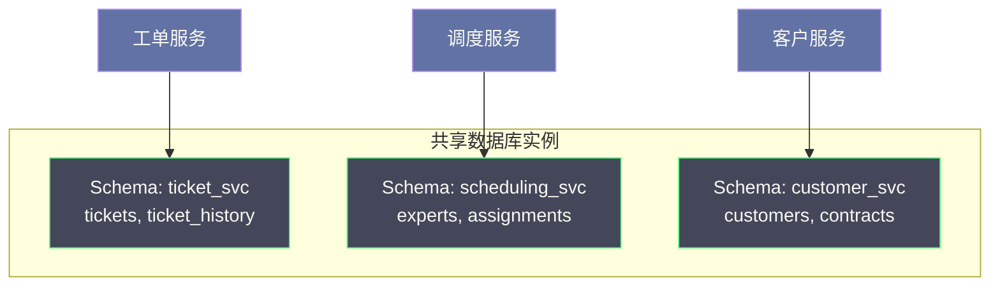
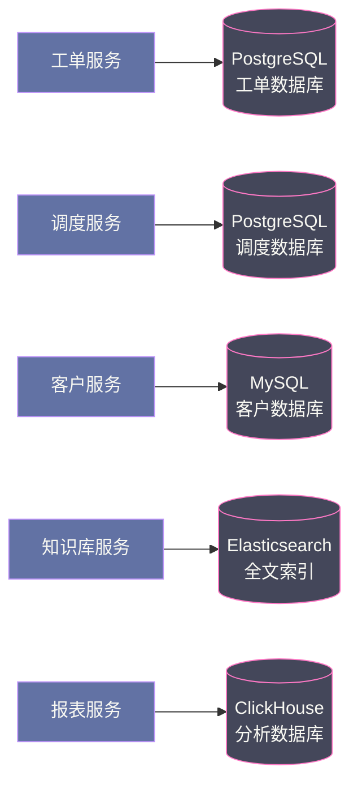
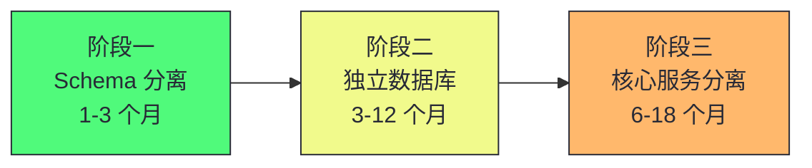
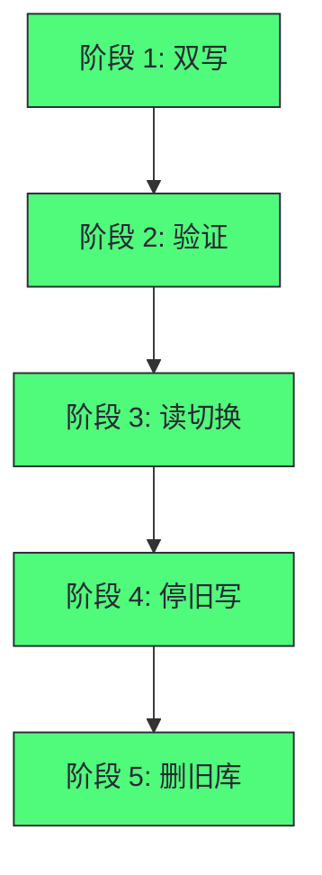
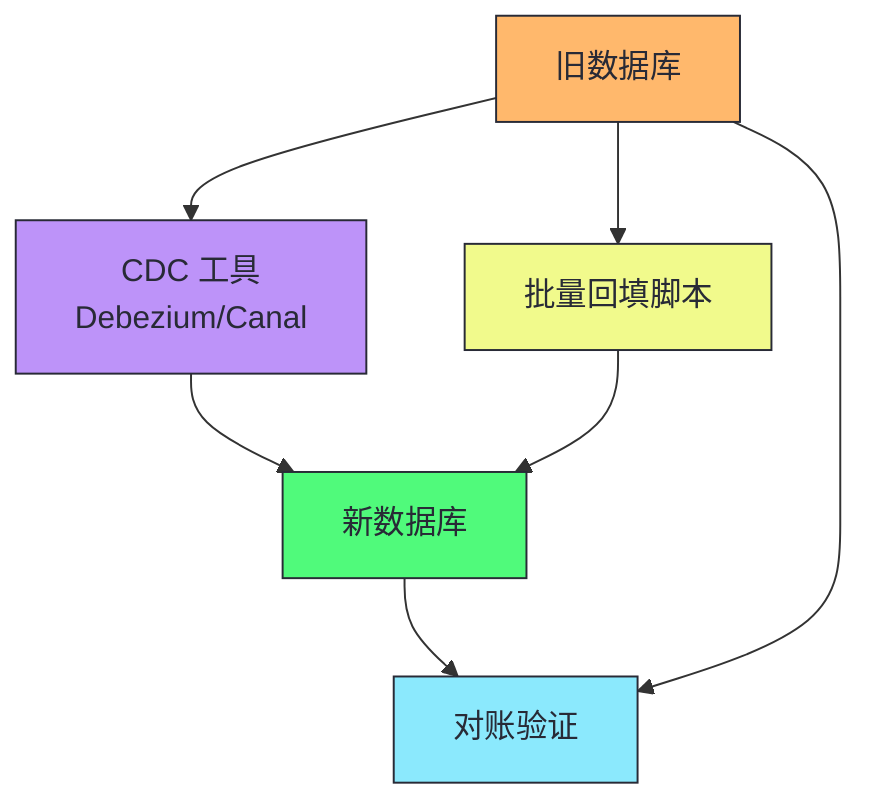

# 11 数据拆分之困：运营数据的分离策略与四大权衡

> [!abstract] 摘要
> 本文深入微服务迁移中最困难的部分——数据拆分。如果说代码拆分是"皮肉手术"，数据拆分才是真正的"心脏手术"。数据有状态、有关联、有历史，不能像代码一样随意剪切。文章系统讲解数据分离的三个层次：共享数据库独立 Schema（最小分离，消除跨服务直接表访问）、共享数据库独立连接池（中等分离，资源隔离）、独立数据库（完全分离，故障隔离+性能隔离+技术栈自由）。然后深入分析数据分离的四大根本权衡：数据一致性（本地 ACID 事务变为分布式事务）、跨服务查询（SQL JOIN 变为 N+1 调用）、数据完整性约束（外键约束从数据库层落到应用层）、运维复杂度（1 套变为 N 套）。之后讲透分阶段数据分离策略（Schema 分离→独立数据库→核心服务分离）和数据所有权分配原则（谁最了解数据业务语义，谁拥有它；谁是写入者，谁是拥有者）。核心认知：没有完美的数据分离方案，每种方案都在四个权衡之间取舍。分阶段推进比大爆炸式迁移更安全。数据所有权必须先于技术实现确定。

---

## 第 1 章 为什么数据分离是最难的部分

### 1.1 数据的粘性

代码是无状态的文本，理论上可以任意重组。数据是有状态的、有关联的、有历史的。

你可以把工单处理逻辑的代码"剪切"到新服务中，但无法把数据库中的工单记录"剪切"到新数据库中——那些数据是活的，有正在进行中的业务操作依赖它们，有外键约束保持完整性，有事务边界保护一致性。

> [!info] 核心概念：数据分离比代码分离难一个数量级
> 代码可以在停机状态下迁移，数据必须在不停机、不丢失、不破坏业务一致性的前提下迁移。这是数据分离比代码分离难得多的根本原因。数据迁移涉及历史数据搬迁、外键约束处理、事务边界重新定义、双写过渡期、一致性验证——每一步都有出错风险。低估数据拆分复杂度是微服务迁移失败的最常见原因。

### 1.2 单共享数据库的四类问题

Sysops Squad 所有服务共享一个 Oracle 数据库，带来四类问题：

| 问题 | 说明 | 影响 |
|------|------|------|
| **变更协调成本** | Schema 变更需协调所有访问该表的服务同步升级 | 破坏独立部署 |
| **性能相互干扰** | 报表分析 SQL 与 OLTP 共享实例 | OLTP 延迟从 50ms 到 500ms |
| **技术栈锁定** | 全文搜索、时序数据都用关系型数据库 | 性能和开发效率受损 |
| **边界泄漏** | 服务 A 直接访问服务 B 的表 | B 变更 Schema 时 A 崩溃 |

> [!warning] 生产避坑：共享数据库是微服务反模式
> 共享数据库是分布式系统中最强的数据耦合（上一篇已讨论）。它破坏了微服务的核心价值——独立部署、独立演化、技术栈自由。如果你的"微服务"共享数据库，它们实际上是"分布式单体"——有微服务的缺点（网络故障、分布式调试困难）但没有微服务的优点（独立部署、独立演化）。

---

## 第 2 章 数据分离的三个层次

### 2.1 层次一：共享数据库，独立 Schema

最小化步骤：所有服务连接同一数据库实例，但每个服务的表移入独立 Schema，通过访问控制确保服务只能访问自己的 Schema。



| 收益 | 局限 |
|------|------|
| 消除跨服务直接表访问 | 仍共享实例，高负载互相影响 |
| 每个服务独立变更自己的 Schema | 仍共享可用性——DB 宕机全部不可用 |
| 迁移成本低，不需搬移数据 | 无法为不同服务选择不同数据库技术 |

### 2.2 层次二：共享数据库，独立连接池

在独立 Schema 基础上，为每个服务配置独立数据库用户和连接池，实现资源隔离。报表服务的复杂查询耗尽自己的连接池，不影响工单服务。

局限：只是连接层隔离，底层 I/O、CPU、内存仍共享。数据库整体负载高时仍互相影响。

### 2.3 层次三：独立数据库（完全分离）

每个服务拥有独立数据库实例，完全隔离。



| 收益 | 代价 |
|------|------|
| 完全故障隔离 | 跨服务查询困难 |
| 完全性能隔离 | 跨服务事务需分布式事务方案 |
| 技术栈自由 | 运维复杂度增加（N 套数据库） |
| 独立扩展 | 数据完整性约束落到应用层 |

> [!note] 设计哲学：数据分离是渐进式的
> 从共享表到完全独立数据库不是一步到位的。层次一（Schema 分离）已消除大部分 Schema 耦合——各服务只修改自己的 Schema。层次二（独立连接池）增加了资源隔离。层次三（独立数据库）实现完全隔离，但引入跨服务查询和事务的代价。根据痛点选择目标层次——如果痛点只是 Schema 耦合，层次一可能就够了。如果痛点是性能互相干扰，需要层次二或三。如果痛点是技术栈锁定，必须层次三。

---

## 第 3 章 数据分离的四大权衡

### 3.1 权衡一：数据一致性

单体+共享数据库中，本地 ACID 事务保证跨表操作强一致性：

```sql
BEGIN TRANSACTION;
  INSERT INTO tickets (id, status, ...) VALUES (...);
  INSERT INTO assignments (ticket_id, expert_id, ...) VALUES (...);
  UPDATE experts SET current_workload = current_workload + 1 WHERE id = ?;
COMMIT;
```

三个操作要么全成功要么全回滚。独立数据库微服务中，三个操作在不同数据库，本地事务无能为力。

| 解决方案 | 一致性 | 性能 | 复杂度 |
|---------|--------|------|--------|
| **分布式事务（2PC）** | 强一致 | 差（同步等待） | 中 |
| **Saga 模式** | 最终一致 | 好 | 高（需补偿事务） |
| **事件溯源** | 最终一致 | 好 | 很高（重放恢复） |

> [!warning] 生产避坑：不要用同步等待模拟强一致性
> 最常见的错误：数据已分离，仍用"同步等待所有服务返回"模拟强一致性。这无法保证真正原子性（中途某服务超时时状态模糊），还大幅降低可用性——是分布式系统设计中最典型的反模式。正确做法：接受最终一致性（Saga/事件），或使用真正的分布式事务（2PC/共识协议），并在 ADR 中记录选择的理由。

#### 一致性方案的深度对比

| 方案 | 一致性模型 | 性能 | 可用性 | 复杂度 | 适用场景 |
|------|----------|------|--------|--------|---------|
| **2PC** | 强一致 | 差（同步阻塞） | 低（协调者单点） | 中 | 金融、库存扣减 |
| **3PC** | 强一致 | 差 | 中（减少阻塞） | 高 | 极少使用 |
| **TCC** | 强一致 | 中 | 中 | 高（需实现 Try/Confirm/Cancel） | 资源预留场景 |
| **Saga（编排）** | 最终一致 | 好 | 高 | 中 | 长流程业务 |
| **Saga（编舞）** | 最终一致 | 好 | 高 | 中（事件设计难） | 简单流程 |
| **事件溯源** | 最终一致 | 好 | 高 | 很高 | 需要审计追溯 |

> [!info] 核心概念：一致性方案的选择不是技术问题，是业务问题
> 选择哪种一致性方案，取决于业务对一致性的容忍度。金融转账不能容忍临时不一致——用 2PC 或 TCC。通知发送可以容忍几秒延迟——用 Saga 或事件。统计数据可以容忍几分钟延迟——用事件驱动同步。不要对所有场景都用最强一致性——这会引入不必要的性能和可用性代价。也不要对所有场景都用最终一致性——这可能在关键业务中造成损失。根据业务容忍度选择，并在 ADR 中记录理由。我们将在下一篇深入讨论 Saga 模式的工程化。

### 3.2 权衡二：跨服务查询

单体中一个 SQL JOIN 跨多业务域：

```sql
SELECT t.id, t.status, e.name, e.phone, c.company_name
FROM tickets t
JOIN assignments a ON a.ticket_id = t.id
JOIN experts e ON e.id = a.expert_id
JOIN customers c ON c.id = t.customer_id
WHERE t.status = 'in_progress';
```

微服务中变为：调用工单服务→对每个工单调用分配服务→对每个专家调用专家服务→对每个工单调用客户服务。100 个工单 = 100 次专家服务调用 + 100 次客户服务调用——N+1 查询问题，延迟从几十毫秒飙升到几秒。

#### 跨服务查询的五种模式详解

| 模式 | 机制 | 优势 | 劣势 | 适用场景 |
|------|------|------|------|---------|
| **API 组合** | 按需调用多个服务聚合结果 | 简单、无数据冗余 | N+1 问题、延迟高 | 查询频率低、数据量小 |
| **数据冗余** | 每个服务保存需要的数据副本 | 查询快、无跨服务调用 | 一致性难维护、存储浪费 | 读多写少、容忍最终一致 |
| **CQRS** | 查询端用物化视图或只读副本 | 查询快、读写分离 | 同步延迟、复杂度高 | 复杂查询、读写负载差异大 |
| **事件驱动同步** | 服务变更发事件，其他服务更新副本 | 解耦、可扩展 | 最终一致、事件顺序 | 数据变更频繁、容忍延迟 |
| **数据网格** | 每个服务数据作为独立数据产品 | 灵活、自助查询 | 治理复杂、成熟度低 | 大型组织、数据平台化 |

> [!info] 核心概念：跨服务查询的五种模式
> 解决跨服务查询的模式：(1) API 组合——按需调用多个服务聚合结果（简单但 N+1 问题）；(2) 数据冗余——每个服务保存需要的数据副本（快但一致性难维护）；(3) CQRS——查询端使用物化视图或只读副本（快但延迟同步）；(4) 事件驱动同步——服务变更时发事件，其他服务更新自己的副本（最终一致）；(5) 数据网格——每个服务的数据可作为独立数据产品查询（复杂但灵活）。每种模式都有权衡，我们将在后续文章深入讨论。

> [!warning] 生产避坑：API 组合是最常用但最容易出问题的模式
> API 组合是最直观的跨服务查询模式——按需调用多个服务聚合结果。但它在数据量大时会产生严重的 N+1 问题。100 个工单需要 100 次专家服务调用 + 100 次客户服务调用，延迟从几十毫秒飙升到几秒。解决方案：(1) 批量 API——一次传入多个 ID 批量查询；(2) 数据冗余——在工单服务中保存专家姓名和客户名称的副本；(3) CQRS——为查询场景建立物化视图。不要在生产中用简单的 API 组合处理大量数据查询——它会在流量增长时成为性能瓶颈。

### 3.3 权衡三：数据完整性约束

关系型数据库的外键约束保证引用完整性。跨数据库时外键约束不可能：

- 删除工单时，无法自动级联删除关联的分配记录
- 更新工单 ID 时，无法自动级联更新分配记录
- 写入不存在的 expert_id 时，数据库不会报错

完整性保障从数据库层落到应用层。应用层约束与数据库约束的核心区别：数据库约束是事务性的（检查通过后提交或整体回滚），应用层约束不是——先删工单成功，再删分配失败，数据不一致。

#### 应用层完整性约束的实现策略

| 策略 | 机制 | 优势 | 劣势 |
|------|------|------|------|
| **预检查** | 写入前验证引用有效性 | 简单 | 检查与写入之间有 TOCTOU 窗口 |
| **事件驱动清理** | 删除时发事件，相关服务自行清理 | 解耦 | 最终一致、可能有延迟垃圾 |
| **软删除** | 标记删除而非物理删除 | 可恢复、无级联问题 | 数据累积、需定期清理 |
| **Saga 补偿** | 用 Saga 协调跨服务删除 | 一致性好 | 复杂度高 |

> [!warning] 生产避坑：应用层约束的 TOCTOU 问题
> 预检查策略有 Time-Of-Check-To-Time-Of-Use 问题——检查时引用有效，但检查后、写入前，引用可能被删除。这导致写入的记录引用了不存在的对象。解决方案：(1) 用 Saga 将检查和写入纳入同一事务边界；(2) 接受最终一致性，用定期对账工具发现并修复不一致；(3) 软删除——不物理删除被引用对象，只标记删除，引用仍然有效。没有完美方案，只有权衡。

### 3.4 权衡四：运维复杂度

| 运维任务 | 单数据库 | 独立数据库（6 服务） |
|---------|---------|-------------------|
| 备份配置 | 1 套 | 6 套 |
| 监控告警 | 1 套 | 6 套 |
| 版本升级 | 1 次 | 6 次（可能 6 种技术） |
| Schema 迁移 | 1 套工具 | 6 套工具 |
| 连接池管理 | 1 个配置 | 6+ 个配置 |
| 容量规划 | 1 维度 | 6 个独立维度 |

> [!warning] 生产避坑：不要低估数据分离的运维成本
> 这些运维成本是真实的。评估是否做数据分离时，必须考虑团队是否有足够 SRE 能力承接增量运维工作。6 个独立数据库意味着 6 套备份、监控、升级——如果团队只有 1 个 DBA，这可能不可行。渐进式分离：先分离运维需求最低的服务（如知识库用 Elasticsearch，运维模式与关系型数据库完全不同，可由开发团队自行管理），积累经验后再分离更多。

### 3.5 运维复杂度的量化评估

在决定数据分离前，需要量化评估运维复杂度的增长：

| 维度 | 单数据库 | 3 个独立数据库 | 6 个独立数据库 |
|------|---------|--------------|--------------|
| **备份策略** | 1 套（RPO/RTO 统一） | 3 套（可能不同） | 6 套（各异） |
| **监控指标** | ~20 个核心指标 | ~60 个 | ~120 个 |
| **故障演练** | 1 个故障域 | 3 个故障域 | 6 个故障域 |
| **容量规划** | 1 个增长模型 | 3 个独立模型 | 6 个独立模型 |
| **升级窗口** | 1 个维护窗口 | 3 个（可错开） | 6 个（需协调） |
| **DBA 人力** | 1 人可管 | 2-3 人 | 4-6 人或平台化 |

> [!info] 核心概念：数据库平台化是降低运维成本的长期方案
> 当独立数据库数量超过 3-4 个时，手动运维不可持续。需要建设数据库平台——统一的备份/恢复、监控告警、Schema 迁移、容量规划工具。这类似于 Kubernetes 对容器编排的价值——将重复的运维工作自动化。数据库平台化的前期投入大，但长期降低了每个新增数据库的边际运维成本。如果团队计划分离 5 个以上独立数据库，应同时规划数据库平台建设。

---

## 第 4 章 分阶段数据分离策略

### 4.1 三阶段渐进式分离



**阶段一：Schema 分离（1-3 个月）**

低风险高收益。将所有服务的表按服务边界重新归入独立 Schema，设置访问控制。建立数据所有权的物理边界，消除跨服务直接表访问。

**阶段二：独立数据库（3-12 个月）**

对耦合最低、访问模式差异最大的服务率先完成独立数据库迁移：
- 通知服务（数据读写模式独立，与核心业务耦合最低）
- 报表服务（分析型访问模式，应迁移到 OLAP 数据库）
- 知识库服务（全文搜索需求，应迁移到 Elasticsearch）

**阶段三：核心服务分离（6-18 个月）**

对工单、调度、客户等高耦合的核心服务，做数据分离前必须先解决跨服务事务和查询的设计方案，否则会出现严重的业务功能回归。

### 4.1.1 各阶段的关键风险与缓解

| 阶段 | 关键风险 | 缓解措施 |
|------|---------|---------|
| **阶段一** | 跨 Schema 外键约束失效 | 先识别所有跨 Schema 外键，改为应用层校验 |
| **阶段二** | 数据迁移期间不一致 | CDC + 双写 + 对账验证 |
| **阶段三** | 分布式事务性能退化 | 先用 Saga 替代 2PC，性能可接受后再考虑独立数据库 |

> [!warning] 生产避坑：阶段一最容易忽略的是跨 Schema 外键
> 很多团队在阶段一（Schema 分离）时才发现，原来表之间有大量外键约束跨业务域——这些外键在 Schema 分离后会失效。在分离前必须完整识别所有跨 Schema 外键，评估改为应用层校验的影响。忽略这一步会导致数据完整性问题在分离后才暴露，修复成本极高。

> [!info] 核心概念：先分离边缘服务，再分离核心服务
> 数据分离的顺序很重要——先分离耦合最低、访问模式差异最大的边缘服务（通知、报表、知识库），积累数据迁移和跨服务通信的经验，再分离高耦合的核心服务（工单、调度、客户）。如果先分离核心服务，会在缺乏经验时面对最复杂的分布式事务和跨服务查询问题——风险极高。这是"先易后难"的工程实践。

### 4.2 数据所有权分配原则

**核心原则：谁最了解这份数据的业务语义，谁就应该拥有它。**

更实用的判断方式：**谁是这份数据的"写入者"，谁就是拥有者。**

| 数据 | 写入者（拥有者） | 只读访问者 |
|------|--------------|----------|
| 工单生命周期 | 工单服务 | 报表服务（只读统计） |
| 专家信息 | HR/专家管理服务 | 调度服务（只读查询可用专家） |
| 工单分配记录 | 调度服务 | 工单服务（只读查看分配状态） |
| 客户联系方式 | 客户服务 | 通知服务（只读获取发送目标） |

> [!info] 核心概念：数据所有权是微服务的必要前提
> 数据所有权不是可选项，而是微服务架构的必要前提。没有明确的数据所有权，就没有真正的服务自治，就没有独立的 Schema 演化，就无法实现独立部署。数据所有权的讨论应该在服务边界讨论的同时进行，而不是在技术实现阶段才考虑。模糊的所有权会导致所有后续工作都建立在不稳固的基础上——两个服务都认为自己"拥有"同一份数据，必然产生冲突。

---

## 第 5 章 数据迁移的工程实践

### 5.1 双写过渡模式

数据迁移不能一步到位——需要双写过渡期，确保新旧数据源都有完整数据：



| 阶段 | 操作 | 风险 |
|------|------|------|
| **1. 双写** | 同时写旧库和新库 | 写入失败处理 |
| **2. 验证** | 对比新旧库数据一致性 | 发现历史数据不一致 |
| **3. 读切换** | 读从旧库切换到新库 | 新库性能问题 |
| **4. 停旧写** | 停止写旧库 | 发现遗漏的旧库读取 |
| **5. 删旧库** | 确认无依赖后删除 | 误删 |

> [!warning] 生产避坑：双写过渡期的一致性验证是关键
> 双写期间，必须持续验证新旧库数据一致性——不能假设双写就一定一致。网络故障、写入顺序、重试逻辑都可能导致不一致。用对账工具定期比对新旧库数据，发现不一致时修复并分析根因。跳过验证直接切换读取，可能在生产中暴露数据丢失问题——此时回退成本极高。

### 5.2 数据回填

迁移历史数据时，需要将旧库的存量数据回填到新库：

| 策略 | 说明 | 适用场景 |
|------|------|---------|
| **批量回填** | 一次性导入所有历史数据 | 数据量小 |
| **增量回填** | 按时间范围分批导入 | 数据量大 |
| **CDC 回填** | 用变更数据捕获实时同步 | 不停机迁移 |
| **双写+回填** | 新数据双写，旧数据批量回填 | 最常用 |

> [!info] 核心概念：CDC 是不停机数据迁移的关键
> 变更数据捕获（CDC）从数据库日志（如 MySQL binlog、PostgreSQL WAL）实时捕获变更，同步到新库。这允许在不停止写入的情况下迁移数据——新数据通过 CDC 实时同步，旧数据批量回填。CDC 工具如 Debezium、Canal、Maxwell。CDC 是不停机数据迁移的关键技术，但增加了运维复杂度（CDC 管道的监控、故障恢复）。

### 5.3 CDC 数据迁移的完整流程



CDC 迁移的步骤：

1. **启动 CDC 管道**：从旧库日志捕获变更，写入新库
2. **批量回填历史数据**：将旧库存量数据分批导入新库
3. **持续 CDC 同步**：新写入的数据通过 CDC 实时同步
4. **对账验证**：比对新旧库数据一致性
5. **双写过渡**：应用层同时写新旧库（验证写入正确性）
6. **读切换**：读取从旧库切换到新库
7. **停旧写**：停止写旧库，只写新库
8. **关停 CDC**：确认无问题后关停 CDC 管道
9. **删旧库**：观察一段时间后删除旧库

> [!warning] 生产避坑：CDC 迁移的常见陷阱
> CDC 迁移的常见问题：(1) **CDC 延迟**——CDC 管道有延迟，批量回填时可能覆盖 CDC 同步的新数据，需要用时间戳或版本号避免；(2) **Schema 不兼容**——新旧库 Schema 可能不同，CDC 需要做字段映射；(3) **CDC 故障恢复**——CDC 管道故障时，需要能从断点恢复，不能丢数据；(4) **大事务**——大事务的 CDC 事件可能很大，需要分批处理。在迁移前充分测试 CDC 管道的故障恢复能力。

---

## 第 6 章 Sysops Squad 的数据分离决策

### 6.1 各服务的数据分离方案

| 服务 | 当前状态 | 目标状态 | 分离阶段 | 优先级 |
|------|---------|---------|---------|--------|
| **通知系统** | 共享 Oracle | 独立 MongoDB | 阶段二 | 高——耦合低，收益大 |
| **报表分析** | 共享 Oracle | 独立 ClickHouse | 阶段二 | 高——OLAP 访问模式 |
| **知识库** | 共享 Oracle | 独立 Elasticsearch | 阶段二 | 高——全文搜索需求 |
| **客户管理** | 共享 Oracle | 独立 Schema | 阶段一 | 中——与工单有数据耦合 |
| **工单+调度** | 共享 Oracle | 独立 Schema | 阶段一 | 低——核心量子，暂不独立数据库 |

### 6.2 关键决策记录

> [!note] 设计哲学：工单+调度共享数据库是理性决策
> 工单管理和专家调度共享 Ticket 和 Expert 表，有紧密的事务关联（创建工单时需同时更新调度）。强行分离数据库会导致分布式事务——2PC 性能差，Saga 复杂度高。在当前阶段，保持工单+调度共享数据库（但独立 Schema）是理性决策——用 ADR 记录这个决策和理由。当业务规模增长到分布式事务的代价可接受时，再重新评估。这是"从痛点出发"和"分阶段推进"的实践。

### 6.3 通知系统的数据分离案例

通知系统是 Sysops Squad 中最适合率先分离的服务：

**当前状态**：通知数据在共享 Oracle 的 `notifications` 表中，与工单、调度等共享实例。

**痛点分析**：
- 通知量级（日均 50 万次）远超工单处理量（日均 2 万次），扩展需求差异显著
- 通知数据访问模式是"写入多、查询少"，与 OLTP 模式不同
- 第三方服务商故障多次阻塞主流程

**分离方案**：迁移到独立 MongoDB 实例

**迁移步骤**：
1. 阶段一：在共享 Oracle 中建立 `notification_svc` Schema，将通知表移入
2. 阶段二：部署独立 MongoDB 实例，启动 CDC 管道同步数据
3. 阶段三：批量回填历史通知数据到 MongoDB
4. 阶段四：对账验证，确认新旧库数据一致
5. 阶段五：应用层双写（同时写 Oracle 和 MongoDB）
6. 阶段六：读取切换到 MongoDB
7. 阶段七：停止写 Oracle 的通知表
8. 阶段八：观察一周后删除 Oracle 中的通知表

**预期收益**：
- 通知系统独立扩展（MongoDB 可水平扩展）
- 第三方服务商故障不影响主流程
- 通知数据访问模式与 MongoDB 的文档模型更匹配
- 释放 Oracle 的负载（日均 50 万次写入转移到 MongoDB）

> [!info] 核心概念：通知系统是数据分离的最佳起点
> 通知系统通常是最适合率先分离的服务——它与核心业务的事务关联弱（通知发送失败不应回滚工单创建），数据访问模式独立（写入多、查询少），扩展需求差异大（量级通常远超核心业务）。分离通知系统可以积累数据迁移和跨服务通信的经验，为后续分离更复杂的服务做准备。这是"先易后难"的工程实践。

---

## 总结

数据拆分的核心知识可以归纳为以下主线：

1. **数据分离比代码分离难一个数量级**。数据有状态、有关联、有历史，必须在不停机、不丢失、不破坏一致性的前提下迁移。低估数据拆分复杂度是微服务迁移失败的最常见原因。

2. **共享数据库是微服务反模式**。变更协调成本、性能互相干扰、技术栈锁定、边界泄漏——四类问题。共享数据库的"微服务"实际上是"分布式单体"。

3. **数据分离有三个层次**。Schema 分离（最小，消除跨服务表访问）、独立连接池（中等，资源隔离）、独立数据库（完全，故障+性能+技术栈隔离）。

4. **四大权衡是数据分离的核心代价**。数据一致性（ACID 变为分布式事务）、跨服务查询（JOIN 变为 N+1 调用）、数据完整性（外键约束落到应用层）、运维复杂度（1 套变 N 套）。

5. **不要用同步等待模拟强一致性**。这是分布式系统设计中最典型的反模式。接受最终一致性（Saga/事件）或使用真正的分布式事务（2PC/共识协议），并在 ADR 中记录理由。

6. **跨服务查询有五种模式**。API 组合、数据冗余、CQRS、事件驱动同步、数据网格。每种都有权衡，需在设计阶段提前规划。

7. **分阶段推进比大爆炸式迁移更安全**。阶段一 Schema 分离（1-3 月）→阶段二边缘服务独立数据库（3-12 月）→阶段三核心服务分离（6-18 月）。

8. **先分离边缘服务，再分离核心服务**。先分离耦合最低、访问模式差异最大的服务（通知、报表、知识库），积累经验后再分离高耦合的核心服务。

9. **数据所有权是微服务的必要前提**。谁最了解数据业务语义，谁拥有它；谁是写入者，谁是拥有者。数据所有权讨论应在服务边界讨论时同时进行。

10. **双写过渡是数据迁移的标准模式**。双写→验证→读切换→停旧写→删旧库。验证阶段必须持续对比新旧库一致性，不能假设双写就一定一致。

11. **CDC 是不停机数据迁移的关键技术**。从数据库日志实时捕获变更同步到新库，允许不停机迁移。工具如 Debezium、Canal、Maxwell。

12. **工单+调度共享数据库是理性决策**。紧密事务关联的服务强行分离数据库会导致分布式事务代价。用 ADR 记录决策，待业务规模增长到代价可接受时再重新评估。

13. **一致性方案的选择是业务问题不是技术问题**。金融转账用 2PC/TCC，通知发送用 Saga/事件，统计数据用事件驱动同步。根据业务容忍度选择，不要对所有场景都用最强或最弱一致性。

14. **通知系统是数据分离的最佳起点**。事务关联弱、访问模式独立、扩展需求差异大。分离通知系统积累经验，为后续分离更复杂服务做准备。

15. **应用层完整性约束有 TOCTOU 问题**。检查时引用有效，写入前可能被删除。用 Saga、软删除或定期对账缓解。没有完美方案，只有权衡。

> [!info] 专栏导航
> 本文是 [[00 专栏导览|数据密集型系统架构实战专栏]] 的第 11 篇，深入服务拆分中最困难的部分——数据如何拆分。上一篇 [[10 耦合解剖学与服务拆分：静态、动态与数据耦合的权衡]] 讨论了耦合分析和服务拆分决策，本文在此基础上深入数据分离的策略和权衡。下一篇 [[12 分布式事务工程化：Saga 模式与一致性方案]] 将讨论数据分离后最核心的挑战——分布式事务如何工程化，包括 Saga 模式的六种变体和选择框架。

---

## 延伸思考

1. **你的服务是否共享数据库？** 如果是，评估 Schema 分离的成本——这可能是不需要独立数据库就能解决大部分痛点的最小代价方案。

2. **你的数据分离是否考虑了四大权衡？** 列出你的数据分离计划，检查是否在一致性、查询、完整性、运维四个维度都做了权衡分析。如果只考虑了"拆分"没考虑代价，计划不完整。

3. **你的数据所有权是否明确？** 对每份核心数据，明确谁是写入者（拥有者），谁是只读访问者。如果两服务都认为自己"拥有"同一份数据，所有权模糊——必须先解决所有权再谈技术实现。

4. **你的数据迁移是否用了双写过渡？** 如果计划直接切换数据库，停下来。双写过渡是安全迁移的标准模式——双写→验证→读切换→停旧写→删旧库。

5. **你的团队是否有足够 SRE 能力？** N 个独立数据库意味着 N 套备份、监控、升级。评估团队是否有能力承接增量运维工作。如果没有，考虑先分离运维模式不同的服务（如 Elasticsearch 由开发团队自管）。

6. **你的跨服务查询是否有设计方案？** 数据分离必然带来查询复杂性提升。在设计阶段就规划应对策略（API 组合、数据冗余、CQRS、事件同步），而非事后发现性能问题再打补丁。

7. **你的核心服务是否过早分离数据库？** 工单+调度这样紧密事务关联的服务，强行分离数据库会导致分布式事务代价。用 ADR 记录"暂不分离"的决策和理由，待业务规模增长时再评估。

8. **你的数据迁移是否有回滚方案？** 每个迁移阶段都应有回滚方案——如果新库有问题，能否切回旧库？双写过渡期的每个阶段都是可回滚的，这是它的核心价值。

9. **你的 CDC 管道是否有故障恢复能力？** CDC 管道故障时需要能从断点恢复，不能丢数据。在迁移前充分测试 CDC 的故障恢复——杀掉 CDC 进程，重启后是否能从断点继续同步。

10. **你的数据分离是否从通知系统开始？** 通知系统通常是最适合率先分离的服务——事务关联弱、访问模式独立。如果不是从通知系统开始，评估你的起点是否风险太高。

11. **你的核心服务是否过早分离数据库？** 工单+调度这样紧密事务关联的服务，强行分离会导致分布式事务代价。用 ADR 记录"暂不分离"的决策，这比强行分离更理性。

12. **你的跨服务查询是否用了 API 组合？** API 组合在数据量大时会产生 N+1 问题。评估批量 API、数据冗余或 CQRS 是否更适合你的场景。

---

*本文基于 Neal Ford、Mark Richards、Pramod Sadalage、Zhamak Dehghani《Software Architecture: The Hard Parts》第 5-6 章整合而成，加入了作者的结构化重组和工程实践理解。*
