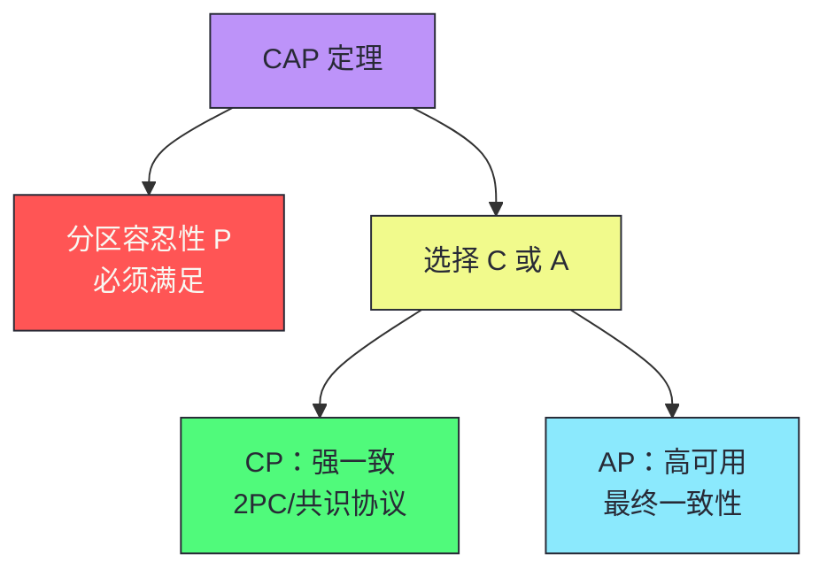
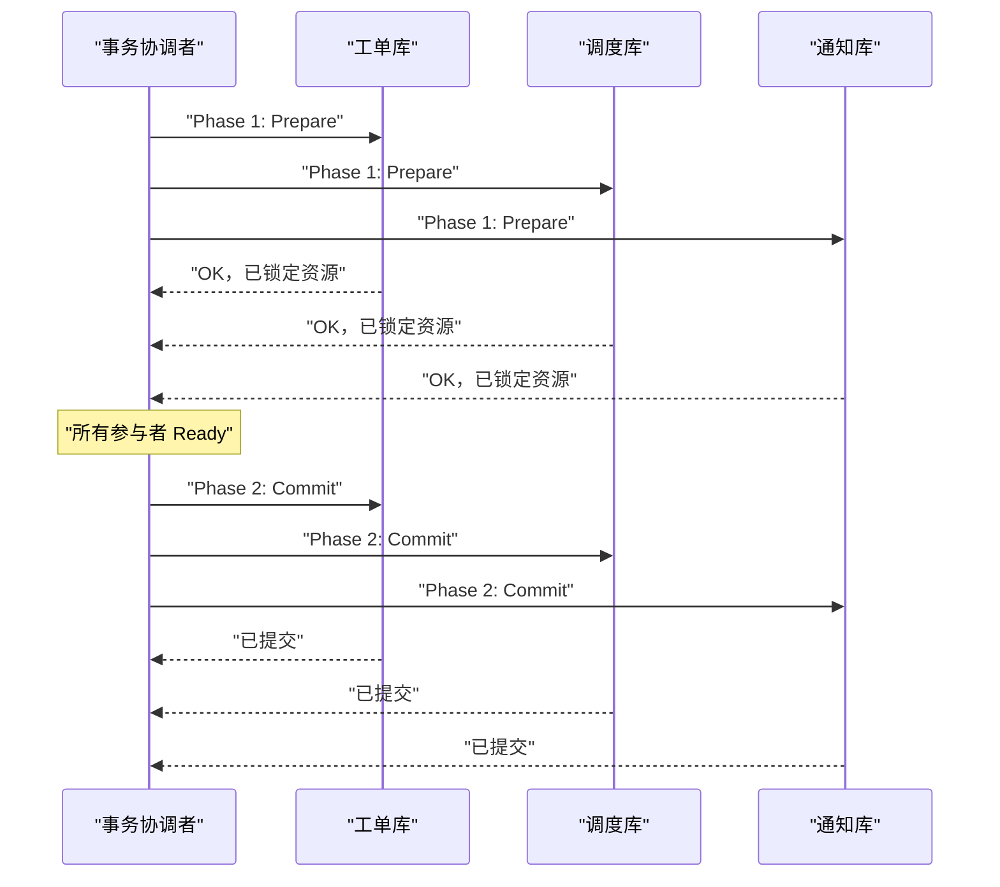
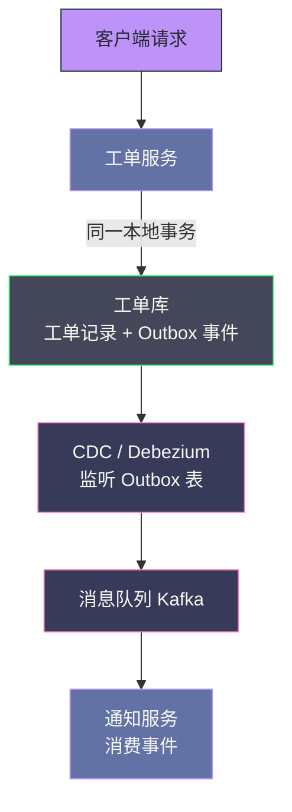
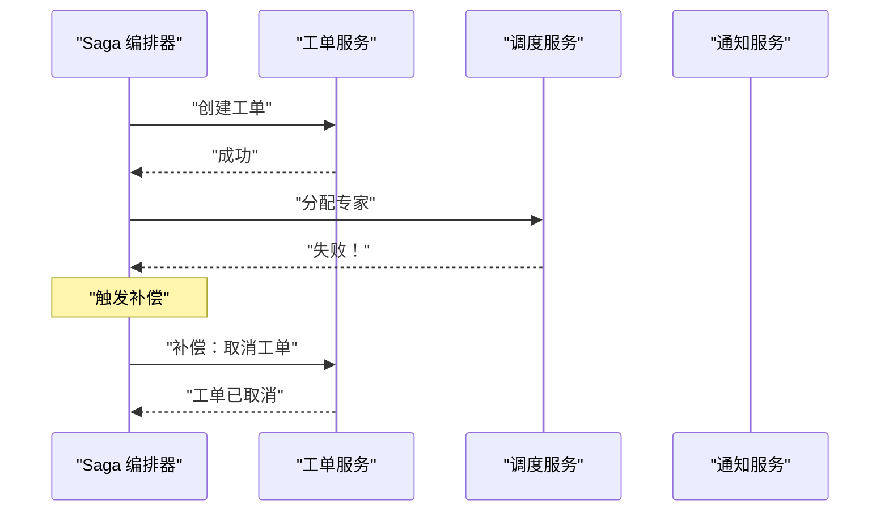
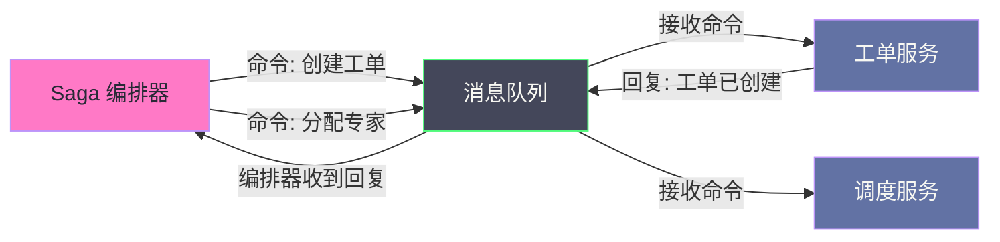
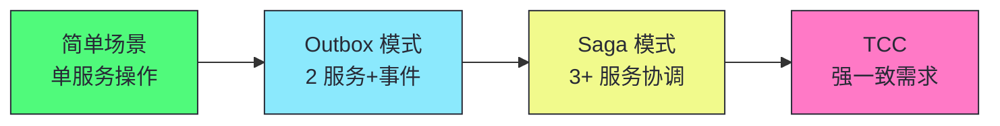

# 12 分布式事务工程化：Saga 模式与一致性方案的选择框架

> [!abstract] 摘要
> 本文系统讲解微服务时代分布式事务的工程化方案。从数据所有权原则出发——每份数据有且仅有一个服务负责写操作，其他服务通过 API 或数据复制访问。分析分布式事务的根本困境：ACID 事务前提是同一数据库实例，微服务的独立数据库使跨服务原子事务成为难题。对比两阶段提交（2PC）的致命缺陷：阻塞协议、协调者单点、性能代价、XA 兼容性——使其在微服务场景几乎不可用。引入 BASE 模型（基本可用、软状态、最终一致性）作为 ACID 的替代。深入讲解 Outbox 模式——在同一个本地事务中写入业务数据和事件记录，用 CDC 异步推送消息队列，解决"写数据库+发消息"的原子性问题。然后系统梳理 Saga 模式的六种变体（Epic/Phone Tag/Fairy Tale/Time Travel/Fantasy Fiction/Horror Story），按通信方式（同步/异步）和协调方式（编排/编舞）分类，分析各自的原子性、耦合度、适用场景。最后给出选择框架：Fairy Tale Saga（异步编排）是大多数场景的最佳起点。核心认知：Saga 提供的是"语义原子性"而非"技术原子性"——补偿事务是业务层面的撤销，不是数据库回滚。

---

## 第 1 章 数据所有权：分布式事务的基础

### 1.1 单一数据所有权原则

微服务架构中，每一张数据库表（或每一类数据）应该有**且只有一个**服务对其进行写操作，这个服务是该数据的**所有者（Owner）**。其他服务需要修改这份数据，必须通过所有者服务的 API，不允许直接访问所有者的数据库。

| 情况 | 说明 | 所有权归属 |
|------|------|----------|
| **边界清晰** | 工单数据由工单服务所有，专家数据由专家管理服务所有 | 各自管理生命周期 |
| **边界模糊** | 客户数据被客户管理、工单、调度三个服务使用 | 管理生命周期的服务拥有 |

> [!info] 核心概念：谁管理数据的生命周期，谁就是所有者
> 数据所有权的判断标准不是"谁使用这份数据"，而是"谁负责管理这份数据的生命周期（创建、更新、删除）"。客户数据的生命周期管理属于客户管理服务，其他服务只能"读取"（通过 API 或数据复制），不能直接写入。这个原则看似简单，但实践中有大量灰色地带需要判断。

### 1.2 联合所有权：当两个服务都需要写同一份数据

联合所有权（Joint Ownership）是复杂但有时不可避免的情况：多个服务都需要对同一份数据进行写操作。

**Sysops Squad 案例**：工单的"状态"字段需要被工单服务（创建时设 CREATED）、调度服务（分配时设 ASSIGNED）、完成服务（完成时设 COMPLETED）共同修改。

三种处理方式：

| 方式 | 机制 | 优势 | 代价 |
|------|------|------|------|
| **单一写入服务** | 统一由"工单状态服务"写入，其他服务发请求 | 集中控制 | 新服务和网络调用 |
| **事件驱动所有权** | 每个服务只对自己负责的状态转换有写权限 | 无并发冲突 | 需清晰的状态转换规则 |
| **表拆分** | 工单基本信息和工单状态拆为两张表，分别所有 | 职责清晰 | 查询需 JOIN |

> [!note] 设计哲学：没有天然优越的方式
> 三种联合所有权处理方式没有天然优越者，选择取决于状态变更的频率、并发程度和团队对额外服务运维的承受能力。关键是在设计阶段就明确选择并记录在 ADR 中，而非让所有权在实践中模糊演化。

---

## 第 2 章 分布式事务的根本困境

### 2.1 为什么微服务让事务变难

ACID 事务的前提是所有操作发生在**同一个数据库实例**。微服务中不同服务拥有独立数据库，跨服务操作天然是"跨数据库操作"。

```
工单服务 → PostgreSQL
调度服务 → MySQL
通知服务 → MongoDB
```

当"创建工单"需要同时在这三个数据库写入时，没有外部系统能原子地控制这三个操作——要么全成功要么全回滚。

### 2.2 CAP 定理的约束

分布式系统中，一致性（C）、可用性（A）、分区容忍性（P）三者只能选二。网络分区是必然现实，P 必须满足，实际选择是**强一致性（C）vs 高可用性（A）**。



> [!info] 核心概念：CAP 不是"三选二"的简单选择
> CAP 定理常被误解为"三选二"，但精确表述是：**在网络分区发生时，系统不能同时提供线性一致性和完全可用性**。分区不发生时，系统可以同时提供 C 和 A。大多数现代系统不是纯 CP 或 AP，而是根据操作类型提供不同保证——读操作可容忍最终一致性（AP），写操作要求强一致性（CP）。

---

## 第 3 章 两阶段提交（2PC）：强一致性的代价

### 3.1 2PC 的工作流程



### 3.2 2PC 的四个致命缺陷

| 缺陷 | 说明 | 后果 |
|------|------|------|
| **阻塞协议** | Prepare 阶段所有参与者持锁等待协调者决策 | 协调者崩溃时永久等待 |
| **协调者单点** | 事务协调者是单点 | 协调者崩溃导致所有事务卡住 |
| **性能代价** | 至少 2 次网络往返 + 锁持有时间 | 延迟远高于单机事务 |
| **XA 兼容性** | 要求所有数据库支持 XA 协议 | 很多 NoSQL 不支持 |

> [!warning] 生产避坑：2PC 在微服务场景几乎不可用
> 2PC 在理论上解决了跨数据库原子事务，但在微服务实践中，可用性问题、性能代价和实现复杂度使其几乎不可用。现代微服务架构的主流选择是**放弃强一致性，拥抱最终一致性**。如果你的场景确实需要强一致性（如金融转账），考虑 TCC 或基于共识协议的分布式数据库（如 Spanner、TiDB），而非在异构微服务上搭建 2PC。

---

## 第 4 章 BASE 模型与最终一致性

### 4.1 从 ACID 到 BASE

| 模型 | 含义 | 适用场景 |
|------|------|---------|
| **ACID** | 原子性、一致性、隔离性、持久性 | 单机事务、强一致需求 |
| **BASE** | 基本可用、软状态、最终一致性 | 分布式系统、高可用需求 |

BASE 模型的核心思想：**相比"任何时刻强一致"，更重要的是"高可用且最终一致"**。

### 4.2 最终一致性的业务判断

接受最终一致性意味着：在某个时间窗口内，不同服务看到的数据可能不一致，这是被允许的，只要后续某个时间点恢复一致。

**判断标准**：这个不一致的时间窗口，对用户或业务是否可见？是否会导致实质性错误？

| 场景 | 不一致窗口 | 可接受？ |
|------|----------|---------|
| 工单创建后调度服务 100ms 后看到 | 100ms | 可接受，用户无感知 |
| 付款成功后订单状态未更新 | 秒级 | 不可接受，用户会立即查看 |
| 通知发送延迟 5 秒 | 5 秒 | 可接受 |
| 报表数据延迟 1 分钟 | 1 分钟 | 可接受 |

> [!info] 核心概念：最终一致性不是银弹
> 最终一致性需要根据具体业务场景判断哪些操作必须强一致，哪些可以接受最终一致。不要对所有场景都用最强一致性（引入不必要的性能代价），也不要对所有场景都用最终一致性（可能在关键业务中造成损失）。根据业务容忍度选择，并在 ADR 中记录理由。

---

## 第 5 章 Outbox 模式：事件驱动的原子性保障

### 5.1 问题：写数据库与发消息的原子性

事件驱动架构中，一个常见问题：工单服务创建工单后，需要向消息队列发布"工单创建"事件。但如果"写数据库"和"发消息"是两个独立操作，可能出现：

- 写数据库成功，发消息失败 → 事件丢失，其他服务不知道工单已创建
- 写数据库失败，发消息成功 → 事件错误，其他服务处理了不存在的工单

### 5.2 Outbox 模式的解决方案

**Outbox 模式**：在同一个本地数据库事务中，同时写入业务数据和一条"待发送事件记录（Outbox Record）"。然后由后台进程（CDC 或定时任务）读取 Outbox 表，将事件推送到消息队列。



### 5.3 Outbox 模式的优势与代价

| 优势 | 代价 |
|------|------|
| 彻底解决"写数据库+发消息"原子性 | 需引入 Outbox 表 |
| 本地事务保证，无需分布式事务 | 需 CDC 工具或定时任务 |
| 事件驱动架构的标准模式 | 事件顺序需额外处理 |

> [!info] 核心概念：Outbox 模式是事件驱动架构的默认选择
> Outbox 模式是解决"写数据库+发消息"原子性问题的标准模式，应成为事件驱动架构的默认选择。它将"发消息"从应用层的不可靠操作转化为数据库事务的一部分——要么一起成功，要么一起失败。CDC 工具（如 Debezium）监听 Outbox 表的变化，将事件可靠地推送到消息队列。即使应用崩溃，已写入 Outbox 的事件也不会丢失——CDC 会在应用恢复后继续推送。

---

## 第 6 章 Saga 模式：分布式长事务的主流解法

### 6.1 Saga 的核心思想

Saga 将跨服务的"全局事务"分解为一系列"局部事务"，每个局部事务由单一服务负责，且每个局部事务都有对应的**补偿事务（Compensating Transaction）**。

当某一步失败时，Saga 逆序执行已完成步骤的补偿事务，将系统恢复到操作开始前的状态。

> [!info] 核心概念：补偿事务 vs 数据库回滚
> 数据库回滚是撤销数据库层面的操作（如 ROLLBACK），是原子的。补偿事务是业务层面的撤销（如"已发送的邮件无法物理撤回，只能发送一封取消邮件"），是最终一致的。**Saga 提供的是"语义原子性"，而非"技术原子性"**。理解这个区别至关重要——Saga 不保证数据层面的原子回滚，而是保证业务语义层面的最终一致。

### 6.2 六种 Saga 变体

| Saga 变体 | 通信方式 | 协调方式 | 原子性 | 耦合 |
|-----------|---------|---------|-------|------|
| **Epic Saga** | 同步 | 编排 | 高 | 高 |
| **Phone Tag Saga** | 同步 | 编舞 | 高 | 中高 |
| **Fairy Tale Saga** | 异步 | 编排 | 中 | 中 |
| **Time Travel Saga** | 异步 | 编舞 | 中 | 低中 |
| **Fantasy Fiction Saga** | 同步 | 编排（并行） | 高 | 高 |
| **Horror Story Saga** | 异步 | 编舞（无策略） | 低 | 低 |

### 6.3 Epic Saga：同步编排

编排器依次同步调用每个参与服务，等待返回结果后再进行下一步。某步失败时，编排器逆序调用已完成步骤的补偿接口。



| 优势 | 劣势 |
|------|------|
| 原子性语义最强（每步同步确认） | 同步调用引入运行时耦合 |
| 流程进度完全透明 | 延迟叠加为总流程延迟 |
| 错误处理集中 | 服务不可用导致 Saga 卡住 |

**适用场景**：流程步骤少（3-4 步）、延迟低、对原子性要求极高。

### 6.4 Fairy Tale Saga：异步编排（推荐）

编排器通过消息队列发送命令消息给各服务，服务处理完成后通过消息队列回复结果。编排器监听所有回复，根据结果决定下一步。



| 优势 | 劣势 |
|------|------|
| 保留编排模式的可见性 | 原子性比 Epic Saga 弱 |
| 消息队列解除运行时耦合 | 需幂等处理 |
| 支持重试 | 编排器需持久化状态 |

> [!info] 核心概念：Fairy Tale Saga 是大多数场景的最佳起点
> Fairy Tale Saga（异步编排）在可见性、耦合度和原子性之间取得了最佳平衡——保留了编排模式的流程可见性（状态集中在编排器），通过消息队列实现了时间解耦（服务临时不可用不会立刻导致流程失败），支持重试。对于大多数需要跨服务协调的业务流程，Fairy Tale Saga 是推荐的最佳起点。

### 6.5 Time Travel Saga：异步编舞

无中心编排器。每个服务发布自己完成的事件，下一个服务订阅并响应。补偿也通过事件驱动。

| 优势 | 劣势 |
|------|------|
| 服务完全自治 | 补偿逻辑分散，极难调试 |
| 最低耦合度 | 需分布式追踪才能了解进度 |
| 最适合多团队独立开发 | 事件循环和依赖关系难管理 |

**适用场景**：业务流程简单（<4 步），团队多且需高度自治，有完善分布式追踪。

### 6.6 Horror Story Saga：反模式

无编排、无统一错误处理策略，完全依赖每个服务自己决定如何响应错误。

> [!warning] 生产避坑：Horror Story Saga 是必须避免的反模式
> Horror Story Saga 通常出现在团队各自为战、缺乏整体架构设计时：每个服务自行决定错误处理策略，有的重试、有的直接失败、有的发事件、有的沉默失败，最终系统在一次部分失败后进入无法自动恢复的不一致状态。避免它的方法是在设计阶段就明确整个 Saga 的错误处理策略，并将其文档化。如果发现系统已经在向 Horror Story Saga 演化，立即引入编排器或明确的事件契约。

---

## 第 7 章 Saga 的工程实践

### 7.1 Saga 状态管理

异步 Saga（特别是 Fairy Tale Saga）的编排器需要持久化 Saga 状态，以便系统重启或编排器故障时恢复流程。

Saga 状态机包含：

| 字段 | 说明 |
|------|------|
| **Saga 实例 ID** | 唯一标识一个 Saga 实例 |
| **当前步骤** | Saga 执行到哪一步 |
| **已完成步骤列表** | 用于补偿时知道需要回滚哪些步骤 |
| **每步的输入输出** | 用于幂等重试 |
| **Saga 状态** | RUNNING / COMPENSATING / COMPLETED / FAILED |

### 7.2 幂等性：Saga 的必要前提

Saga 的步骤可能因网络问题被重复执行（at-least-once delivery），每个参与服务的局部事务必须是**幂等的**。

| 幂等方法 | 机制 | 适用场景 |
|---------|------|---------|
| **业务 ID 去重** | 用唯一业务 ID 检查是否已执行 | 大多数场景 |
| **UPSERT** | INSERT IF NOT EXISTS 或 UPSERT | 数据库插入 |
| **状态检查** | 重试前先检查当前状态 | 外部调用（如发短信） |
| **Fencing Token** | 单调递增 token 拒绝旧请求 | 防止乱序 |

> [!warning] 生产避坑：幂等性是 Saga 可靠性的基石
> 没有幂等性，Saga 的重试机制会导致数据重复（如重复扣款、重复发送通知）。在实现 Saga 之前，必须确保每个参与服务的局部事务都是幂等的。幂等性的实现应在服务层面，而非依赖 Saga 编排器去重——编排器无法保证消息不重复投递。最可靠的方法是用唯一业务 ID 作为幂等键，操作执行前检查是否已处理过该 ID。

### 7.3 补偿事务的设计

补偿事务是 Saga 的核心——它定义了"如何撤销已完成的操作"。

| 操作 | 补偿事务 | 注意事项 |
|------|---------|---------|
| 创建工单 | 删除工单或标记取消 | 已关联的分配需先清理 |
| 扣减库存 | 恢复库存数量 | 需检查库存是否已被其他操作使用 |
| 发送通知 | 发送取消通知 | 已发送的通知无法物理撤回 |
| 创建订单 | 取消订单 | 已支付的需退款 |
| 扣款 | 退款 | 退款可能有手续费 |

> [!info] 核心概念：补偿事务是业务层面的撤销，不是技术回滚
> 补偿事务不是数据库的 ROLLBACK——它是业务层面的撤销操作。已发送的邮件无法物理撤回，只能发送一封"取消邮件"。已扣的款无法自动退回，需要发起退款流程。补偿事务的设计需要业务团队参与——只有业务团队知道"如何撤销一个已完成的业务操作"。这是 Saga 与传统分布式事务的根本区别——Saga 是业务级别的协调，不是技术级别的原子性。

---

## 第 8 章 一致性方案的选择框架

### 8.1 按业务场景选择

| 业务场景 | 一致性要求 | 推荐方案 |
|---------|----------|---------|
| **金融转账** | 强一致 | TCC 或 2PC（同构数据库） |
| **库存扣减** | 强一致 | TCC（资源预留） |
| **订单创建+通知** | 最终一致 | Outbox + 事件驱动 |
| **工单创建+调度+通知** | 最终一致 | Fairy Tale Saga |
| **报表数据同步** | 最终一致 | CDC + 事件驱动 |
| **搜索索引更新** | 最终一致 | CDC + 事件驱动 |
| **用户资料更新** | 读写自己写 | 同步写+异步读副本 |

### 8.2 按复杂度选择



> [!note] 设计哲学：从最简单的方案开始
> 不要对所有分布式事务场景都用最复杂的方案。如果只涉及 2 个服务且可以接受最终一致性，Outbox 模式就够了。如果涉及 3+ 服务协调，用 Fairy Tale Saga。如果确实需要强一致性（金融场景），才考虑 TCC 或 2PC。从最简单的方案开始，当痛点证明它不够用时再升级——这是"从痛点出发"的实践。

---

## 第 9 章 Sysops Squad 的分布式事务决策

### 9.1 工单创建流程的事务方案

工单创建涉及：工单服务（创建工单）→ 调度服务（分配专家）→ 通知服务（发送确认）。

| 方案 | 一致性 | 耦合 | 复杂度 | 适合？ |
|------|--------|------|--------|--------|
| **2PC** | 强一致 | 高 | 中 | 否——异构数据库，XA 不支持 |
| **Epic Saga** | 高 | 高 | 低 | 否——同步耦合，通知故障阻塞工单 |
| **Fairy Tale Saga** | 中 | 中 | 中 | **是**——异步编排，可见性好 |
| **Time Travel Saga** | 中 | 低 | 中 | 否——流程有 3 步，编舞难管理 |

### 9.2 ADR 示例

```
# ADR-002. 工单创建流程采用 Fairy Tale Saga

## 状态
Accepted

## 上下文
工单创建需要协调工单服务（创建工单）、调度服务（分配专家）、通知服务（发送确认）。
三个服务有独立数据库。2PC 不可用（异构数据库，MongoDB 不支持 XA）。
通知服务的可用性不应影响工单创建（通知可以延迟发送）。

## 决策
采用 Fairy Tale Saga（异步编排）模式。
编排器通过消息队列发送命令，服务异步处理并回复。
编排器持久化 Saga 状态，支持故障恢复。

考量过的备选方案：
- Epic Saga（同步编排）：否决——通知服务故障会阻塞工单创建
- Time Travel Saga（异步编舞）：否决——3 步流程用编舞难管理

## 后果
正面：
- 通知服务故障不影响工单创建
- 流程状态集中在编排器，可观测
- 支持重试和故障恢复

负面：
- 最终一致性（通知可能延迟发送）
- 需实现幂等性
- 编排器需持久化状态
```

---

## 总结

分布式事务工程化的核心知识可以归纳为以下主线：

1. **数据所有权是分布式事务的基础**。每份数据有且仅有一个服务负责写操作。谁管理数据的生命周期，谁就是所有者。联合所有权有三种处理方式（单一写入服务、事件驱动所有权、表拆分）。

2. **2PC 在微服务场景几乎不可用**。阻塞协议、协调者单点、性能代价、XA 兼容性——四个致命缺陷。现代微服务的主流选择是放弃强一致性，拥抱最终一致性。

3. **BASE 模型是 ACID 的替代**。基本可用、软状态、最终一致性。核心思想：相比"任何时刻强一致"，更重要的是"高可用且最终一致"。

4. **最终一致性需要业务判断**。不一致的时间窗口对用户是否可见？是否导致实质性错误？根据业务容忍度选择，不要对所有场景都用最强或最弱一致性。

5. **Outbox 模式是事件驱动的原子性保障**。在同一个本地事务中写入业务数据和事件记录，用 CDC 异步推送消息队列。应成为事件驱动架构的默认选择。

6. **Saga 提供语义原子性而非技术原子性**。补偿事务是业务层面的撤销（如发取消邮件），不是数据库回滚（如 ROLLBACK）。理解这个区别至关重要。

7. **六种 Saga 变体提供完整光谱**。从 Epic Saga（强原子性高耦合）到 Horror Story Saga（无保障反模式）。Fairy Tale Saga（异步编排）是大多数场景的最佳起点。

8. **Fairy Tale Saga 平衡了可见性、耦合度和原子性**。保留编排模式的流程可见性，通过消息队列实现时间解耦，支持重试。编排器持久化状态支持故障恢复。

9. **幂等性是 Saga 可靠性的基石**。每个参与服务的局部事务必须幂等。用唯一业务 ID 作为幂等键，操作执行前检查是否已处理过。没有幂等性，重试会导致数据重复。

10. **补偿事务需要业务团队参与设计**。只有业务团队知道"如何撤销一个已完成的业务操作"。已发送的邮件无法撤回只能发取消邮件，已扣的款需发起退款。补偿事务是业务级别的协调。

11. **从最简单的方案开始**。单服务操作用本地事务。2 服务+事件用 Outbox。3+ 服务协调用 Fairy Tale Saga。强一致需求才用 TCC/2PC。当痛点证明简单方案不够用时再升级。

12. **Horror Story Saga 是必须避免的反模式**。无编排、无统一错误处理策略，各服务自行决定错误处理。在设计阶段就明确整个 Saga 的错误处理策略并文档化。

> [!info] 专栏导航
> 本文是 [[00 专栏导览|数据密集型系统架构实战专栏]] 的第 12 篇，深入分布式事务的工程化方案。上一篇 [[11 数据拆分之困：运营数据的分离策略与四大权衡]] 讨论了数据分离的策略和权衡，本文在此基础上讨论数据分离后最核心的挑战——分布式事务如何工程化。下一篇 [[13 一致性与共识工程实践]] 将从 DDIA 的视角深入一致性和共识的底层机制——线性一致性、因果一致性、Raft/Paxos 共识协议的工程实现。

---

## 延伸思考

1. **你的服务是否有明确的数据所有权？** 对每张核心表，明确谁是写入者（所有者），谁是只读访问者。如果两服务都认为自己"拥有"同一份数据，所有权模糊——必须先解决。

2. **你的分布式事务是否用了 2PC？** 如果在异构微服务上搭建 2PC，评估其可用性和性能代价。大多数场景应迁移到 Saga 或 Outbox 模式。

3. **你的事件驱动架构是否用了 Outbox 模式？** 如果"写数据库"和"发消息"是两个独立操作，你可能有事件丢失风险。评估 Outbox 模式的成本——Outbox 表 + CDC 工具。

4. **你的 Saga 是否是 Fairy Tale Saga？** 如果是同步编排（Epic Saga），评估通知服务等非关键服务的故障是否阻塞主流程。如果是异步编舞（Time Travel Saga），评估流程是否足够简单（<4 步）。

5. **你的 Saga 参与服务是否实现了幂等性？** 用唯一业务 ID 作为幂等键，操作执行前检查是否已处理过。没有幂等性，重试会导致数据重复。

6. **你的补偿事务是否由业务团队参与设计？** 补偿事务是业务层面的撤销，不是技术回滚。只有业务团队知道"如何撤销一个已完成的业务操作"。

7. **你的 Saga 状态是否持久化？** 异步 Saga 的编排器需持久化状态，以便系统重启或编排器故障时恢复流程。检查你的编排器是否有 Saga 状态机。

8. **你的分布式事务方案是否从最简单的开始？** 不要对所有场景都用最复杂的方案。单服务用本地事务，2 服务用 Outbox，3+ 服务用 Saga，强一致才用 TCC/2PC。

9. **你的系统是否有 Horror Story Saga 的迹象？** 各服务自行决定错误处理策略，有的重试、有的失败、有的沉默——这是反模式。立即引入编排器或明确的事件契约。

10. **你的 ADR 是否记录了一致性方案的选择理由？** 选择 Saga 而非 2PC，选择 Fairy Tale 而非 Epic——这些决策的理由应记录在 ADR 中，让未来的人理解权衡。

---

*本文基于 Neal Ford、Mark Richards、Pramod Sadalage、Zhamak Dehghani《Software Architecture: The Hard Parts》第 8、11 章整合而成，加入了作者的结构化重组和工程实践理解。*
