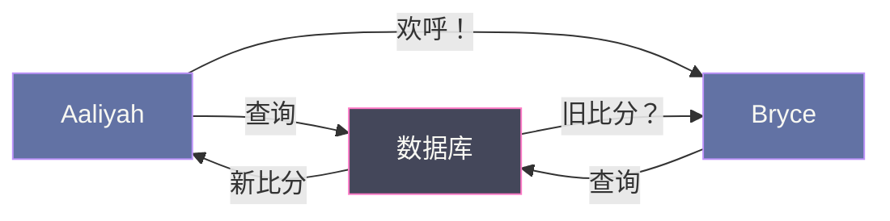
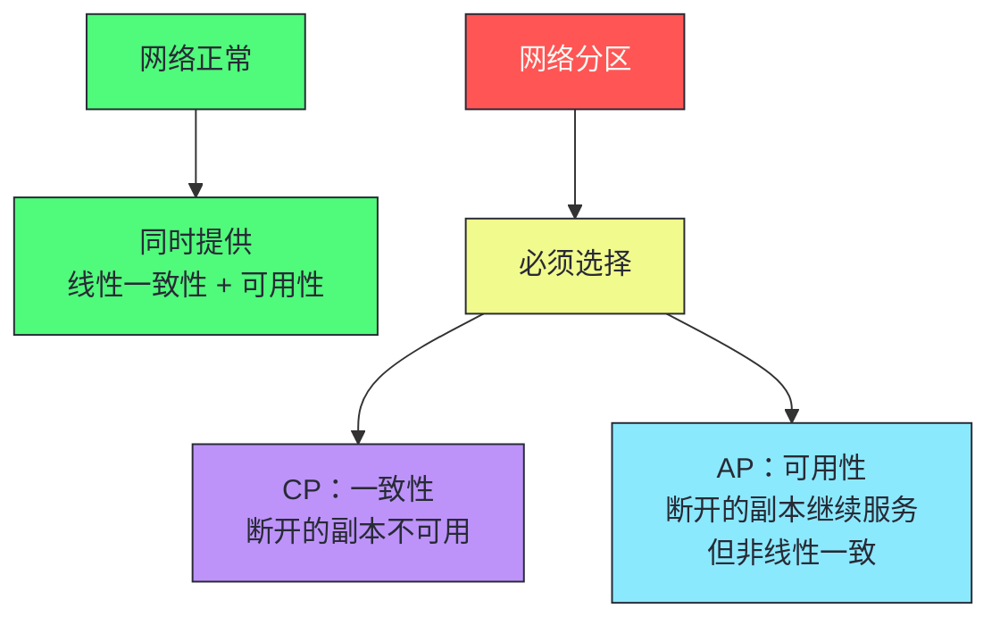
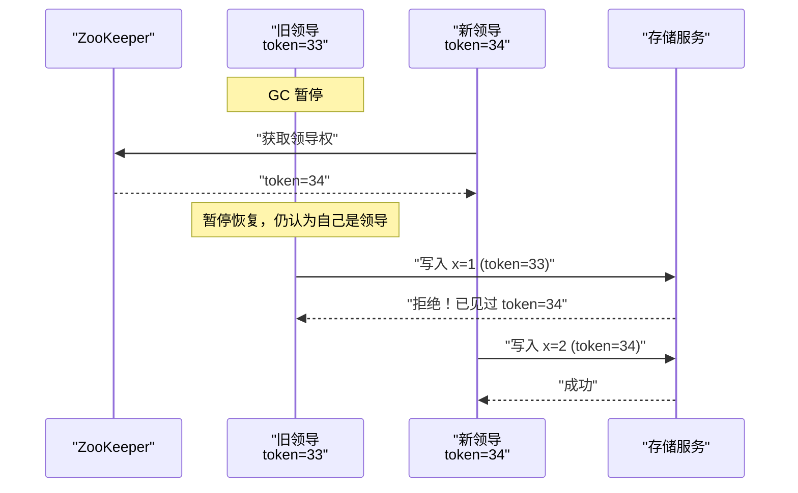
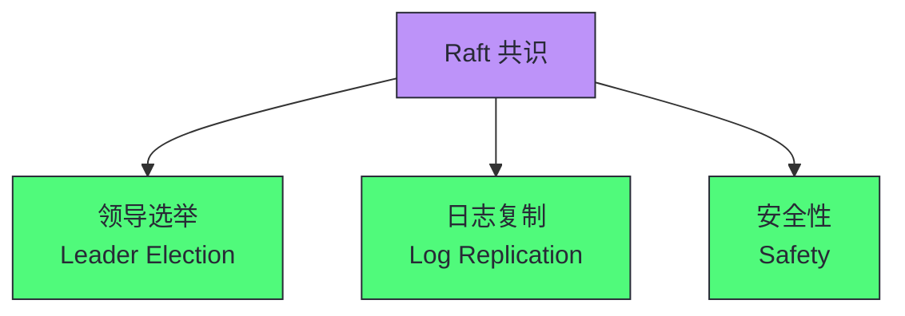

# 13 一致性与共识工程实践：线性一致性、因果一致性与 Raft

> [!abstract] 摘要
> 本文深入分布式系统最核心也最困难的主题——一致性与共识。从两种一致性哲学出发：最终一致性（应用开发者处理不一致和冲突）vs 强一致性（系统表现得像单个节点）。精确定义线性一致性——一种最近性保证，一旦写操作完成，所有后续读都必须看到新值。区分线性一致性（单对象新近性）与可串行化（多事务隔离）——两者正交，组合为严格可串行化。分析线性一致性的代价：CAP 定理的精确表述（分区时要么一致要么可用），以及 Attiya-Welch 证明（线性一致读写响应时间至少与网络延迟不确定性成正比）。讨论线性一致性的应用场景：锁与领导选举、唯一性约束、跨通道时序依赖。然后讲透 ID 生成与逻辑时钟——为什么 wall clock 不可靠，Lamport 时钟和向量时钟如何建立因果偏序。引入 Fencing Token 防止暂停的旧领导者破坏。最后深入共识算法——Raft 的领导选举、日志复制、安全性保证，以及共识的 FLP 不可能性结果。核心认知：共识是分布式系统中最基础的问题，Raft 是工程化最成功的共识算法，但共识的代价（性能、可用性）意味着不是所有场景都需要共识。

---

## 第 1 章 两种一致性哲学

### 1.1 最终一致性 vs 强一致性

分布式系统复制数据增加了不一致的风险。处理这个问题有两种哲学：

| 哲学 | 含义 | 适用场景 | 代价 |
|------|------|---------|------|
| **最终一致性** | 系统复制的 факт 对应用可见，开发者处理不一致和冲突 | 多主复制、无主复制、离线编辑 | 应用复杂度高 |
| **强一致性** | 系统表现得像单个节点，应用不需担心复制内部细节 | 单主复制、共识算法 | 性能代价、可用性降低 |

> [!info] 核心概念：两种哲学的选择取决于应用
> 如果应用允许用户离线修改数据（如本地优先软件），最终一致性不可避免。如果副本位于通信快速可靠的数据中心内，强一致性通常更合适，因为代价可接受。没有银弹——选择取决于应用对一致性、可用性、性能的需求。

### 1.2 本章聚焦：强一致性方法

本章深入强一致性的三个领域：

1. **线性一致性**——对"强一致性"的精确定义
2. **ID 生成与逻辑时钟**——与一致性紧密相关的时间问题
3. **共识算法**——如何在保持容错的同时实现线性一致性

> [!warning] 生产避坑：本章主题以难以正确实现而臭名昭著
> 很容易构建出在没有故障时表现良好，但在不利故障组合或消息顺序下完全崩溃的系统。大量理论已被开发出来帮助思考这些边界情况。本章只触及表面——如果你想认真从事共识系统相关工作，需要更深入研究理论。

---

## 第 2 章 线性一致性：强一致性的精确定义

### 2.1 什么是线性一致性

**线性一致性（Linearizability）**（也称原子一致性、强一致性、即时一致性）的基本思想：使系统表现得**好像只有一份数据副本**，且所有操作在该副本上是原子的。

**核心保证**：一旦某个客户端成功完成一次写操作，所有从数据库读取的客户端**都必须能够看到刚刚写入的值**。这是一种**最近性保证（recency guarantee）**。

### 2.2 线性一致性的直觉理解

考虑一个非线性一致性的例子：体育迷 Aaliyah 和 Bryce 查询比赛结果。Aaliyah 查询到最终比分后欢呼，Bryce 在听到欢呼后查询，却得到了旧比分——这违反了线性一致性。



Bryce 知道他在听到 Aaliyah 欢呼之后才查询，因此他期望查询结果至少与 Aaliyah 的一样新。返回旧结果违反了线性一致性。

### 2.3 线性一致性的形式化

线性一致性的要求可以形式化为：

- 每个操作有一个"生效时刻"（在请求发送和响应接收之间的某点）
- 这些生效时刻可以排列成一个有效顺序（每个读返回最近一次写设置的值）
- **连接操作标记的线始终向前移动，永不后退**

| 操作关系 | 线性一致性要求 |
|---------|--------------|
| 读在写之前完成 | 必须返回旧值 |
| 读在写之后开始 | 必须返回新值 |
| 读与写并发 | 可返回旧值或新值 |
| 一个读返回新值后 | 所有后续读必须返回新值 |

### 2.4 线性一致性 vs 可串行化

| 维度 | 线性一致性 | 可串行化 |
|------|----------|---------|
| **保证对象** | 单个对象（寄存器）的读写 | 多对象的事务隔离 |
| **保证内容** | 新近性——操作完成后所有后续读看到新值 | 事务行为等价于某种串行执行 |
| **是否防止写偏斜** | 否（单对象，不分组事务） | 是（多对象事务） |
| **是否要求新近性** | 是 | 否（可串行化允许读旧数据） |

> [!info] 核心概念：线性一致性和可串行化是正交的
> 线性一致性是单对象的新近性保证，可串行化是多对象的事务隔离保证。两者可以独立选择。数据库可以同时提供两者——这种组合称为**严格可串行化（Strict Serializability）**或**强单副本可串行化（strong-1SR）**。Spanner 和 FoundationDB 提供严格可串行化。CockroachDB 提供可串行化但不提供严格可串行化（因为严格可串行化需要事务间昂贵的协调）。

---

## 第 3 章 线性一致性的应用场景

### 3.1 锁与领导选举

单领导者复制系统需要确保确实只有一个领导者——不能脑裂。选举领导者的方法之一是使用租约，成功的节点成为领导者。这个机制必须是线性一致的——不可能两个节点同时获取租约。

ZooKeeper 和 etcd 等协调服务使用共识算法实现线性一致操作，用于分布式租约和领导者选举。

### 3.2 唯一性约束

唯一性约束（用户名唯一、文件路径唯一、账户余额不为负、库存不超卖）需要线性一致性——所有节点必须同意单一最新值。

| 约束类型 | 是否需要线性一致性 | 说明 |
|---------|-----------------|------|
| **硬性唯一约束** | 是 | 用户名唯一、文件路径唯一 |
| **外键约束** | 否 | 可在没有线性一致性时实现 |
| **属性约束** | 否 | 可在没有线性一致性时实现 |
| **松弛约束** | 视情况 | 航班超售可事后补偿 |

### 3.3 跨通道时序依赖

当系统中有多个通信通道时，线性一致性防止通道间的竞态条件。

**示例**：Web 服务器将视频写入文件存储，然后通过消息队列通知转码器。如果文件存储非线性一致，消息队列可能比存储服务的内部复制更快——转码器获取视频时可能看到旧版本或什么都没有。

> [!warning] 生产避坑：跨通道竞态条件容易被忽略
> 跨通道竞态条件出现在两个通信通道之间——如文件存储和消息队列。如果没有线性一致性提供的新近性保证，两个通道之间可能出现竞态条件。线性一致性并非避免此竞态的唯一方式，但却是最容易理解的。如果能控制额外通信渠道，可采用"读取自己的写入"等替代方法，但代价是增加复杂性。

---

## 第 4 章 实现线性一致性

### 4.1 复制方法与线性一致性

| 复制方法 | 线性一致性 | 说明 |
|---------|----------|------|
| **单主复制** | 潜在可以 | 所有读写在主节点上，但需确切知道谁是主节点 |
| **共识算法** | 很可能 | 带自动选举和故障切换的单主复制，防止脑裂 |
| **多主复制** | 不线性一致 | 多节点同时写入，异步复制，产生冲突 |
| **无主复制** | 可能不线性一致 | 即使 w+r>n，也可能出现非线性一致行为 |

### 4.2 无主复制的线性一致性问题

直觉上，Dynamo 风格的法定票数读写（w+r>n）似乎是线性一致的。但当网络延迟可变时，可能出现竞态条件：

```
初始 x=0，n=3, w=3, r=2
写入客户端将 x 更新为 1（向所有 3 个副本发送）
客户端 A 从 2 个副本读取（r=2）：一个返回 1，一个返回 0
客户端 B 从另一个 2 个副本读取：都返回旧值 0
```

法定票数条件满足（w+r>n），但 B 的请求在 A 完成后开始，B 返回旧值而 A 返回新值——违反线性一致性。

> [!info] 核心概念：无主复制即使 w+r>n 也不保证线性一致性
> 最安全的做法是假设采用 Dynamo 风格复制的无主系统不提供线性一致性，即使使用法定票数读写。要使法定票数实现线性一致性，需要：(1) 读者在返回结果前同步执行读修复；(2) 写入者在写入前读取法定票数的最新状态获取最新时间戳。但这些措施会降低性能。Cassandra 在法定票数读取时等待读修复完成，但由于使用 wall clock 时间戳而失去线性一致性。

---

## 第 5 章 线性一致性的代价

### 5.1 CAP 定理的精确表述

CAP 定理常被误解为"三选二"，但精确表述是：

> **在网络分区发生时，系统不能同时提供线性一致性和完全可用性。**



> [!info] 核心概念：CAP 的更好表述是"分区时要么一致，要么可用"
> 网络分区是一种故障，不是你选择的东西——无论你是否喜欢都会发生。保证没有网络分区的唯一方法是根本没有网络（只有一个副本）。在网络正常时，系统可以同时提供一致性和可用性。当网络故障时，你必须在它们之间选择。一个更可靠的网络会减少这种选择的发生频率，但最终选择是不可避免的。

### 5.2 线性一致性与延迟

**Attiya-Welch 证明**：如果你想要线性一致性，读写请求的响应时间至少与网络延迟的不确定性成正比。在延迟变化很大的网络中，线性一致读写的响应时间不可避免地会很高。

> [!warning] 生产避坑：放弃线性一致性通常是为了性能而非容错
> 许多选择不提供线性一致性保证的分布式数据库，这样做主要是为了提高性能，而不是为了容错。即使是现代多核 CPU 上的 RAM 也不是线性一致的——每个 CPU 核心都有自己的内存缓存，异步写入主内存。放弃线性一致性的原因是性能（缓存比主内存快得多），不是容错。不存在更快的线性一致性算法，但较弱的一致性模型可以快得多——这种权衡对延迟敏感的应用非常重要。

---

## 第 6 章 ID 生成与逻辑时钟

### 6.1 单节点 ID 生成器的问题

单节点自增 ID 生成器是线性一致性系统的例子——每个获取 ID 的请求是原子递增操作。但它有三个问题：

| 问题 | 说明 |
|------|------|
| **单点故障** | 节点崩溃导致 ID 生成中断 |
| **跨区域延迟** | 另一个区域创建记录需跨半个地球获取 ID |
| **吞吐量瓶颈** | 高写入吞吐量时单节点成为瓶颈 |

### 6.2 Wall Clock 的问题

使用 wall clock（墙上时钟）作为 ID 或时间戳的问题：

- **时钟偏移**：不同机器的时钟不一致
- **时钟漂移**：时钟速率不同（NTP 同步后仍可能漂移）
- **闰秒**：闰秒导致时钟回退
- **假同步**：NTP 可能同步失败但应用不知道

> [!warning] 生产避坑：不要用 wall clock 做顺序判断
> 用 wall clock 时间戳做 LWW（Last Write Wins）冲突解决几乎肯定不线性一致——由于时钟偏差，wall clock 时间戳无法保证与实际事件顺序一致。Cassandra 和 ScyllaDB 的 LWW 因此不提供线性一致性。如果需要顺序保证，用逻辑时钟（Lamport 时钟或向量时钟），或用 HLC（混合逻辑时钟）结合 wall clock 和逻辑时钟的优势。

### 6.3 Lamport 时钟

**Lamport 时钟**是一种逻辑时钟，建立分布式事件之间的因果偏序：

```
每个节点维护一个计数器 counter
发送消息时：counter = counter + 1，附带 counter 值
接收消息时：counter = max(counter, 消息中的 counter) + 1
```

Lamport 时钟的性质：如果事件 A 因果先于事件 B，则 L(A) < L(B)。但反过来不成立——L(A) < L(B) 不意味着 A 因果先于 B。

### 6.4 向量时钟

**向量时钟**比 Lamport 时钟更强——它能检测并发事件：

```
每个节点维护一个向量 V，V[i] 是节点 i 的计数器
发送消息时：V[self] = V[self] + 1，附带 V
接收消息时：V[i] = max(V[i], 消息中的 V[i]) for all i；V[self] = V[self] + 1
```

向量时钟的性质：

| 关系 | 判断 |
|------|------|
| A 因果先于 B | V(A) < V(B)（所有分量 ≤ 且至少一个 <） |
| B 因果先于 A | V(B) < V(A) |
| A 和 B 并发 | 既不 V(A) < V(B) 也不 V(B) < V(A) |

> [!info] 核心概念：向量时钟检测并发，Lamport 时钟不能
> Lamport 时钟只能建立偏序——L(A) < L(B) 不意味着 A 因果先于 B。向量时钟能检测并发——如果两个事件的向量时钟互不小于，它们是并发的。检测并发对于冲突解决很重要——并发的写入需要冲突解决策略（如合并、CRDT、或让应用决定）。向量时钟的代价是空间——每个事件需要存储 O(n) 的向量（n 是节点数）。

### 6.5 Fencing Token

**Fencing Token** 防止暂停的旧领导者破坏数据：



Fencing Token 的机制：

1. 获取领导权时获得单调递增的 token
2. 每次写入存储服务时附带 token
3. 存储服务记录已见过的最大 token
4. 拒绝小于已见最大值的写入

> [!info] 核心概念：Fencing Token 将"真相由多数决定"转化为具体机制
> 节点认为自己是领导者，只有多数同意时才为真。但即使多数同意，暂停的旧领导者仍可能造成破坏——它在暂停前认为自己是领导，暂停后继续处理旧请求。Fencing Token 通过单调递增的 token 和存储服务的拒绝机制，防止暂停的旧领导者的写入生效。这是将"真相由多数决定"这一原则转化为具体工程机制的关键工具。

---

## 第 7 章 共识算法

### 7.1 什么是共识问题

**共识（Consensus）** 问题：多个节点就某个值达成一致。形式化地：

1. **终止性（Termination）**：每个非故障节点最终决定一个值
2. **一致性（Agreement）**：没有两个节点决定不同的值
3. **有效性（Validity/Integrity）**：决定的值必须由某个节点提议

共识看似简单，但它是分布式系统中最基础也最困难的问题之一。

### 7.2 共识的应用场景

| 场景 | 共识的作用 |
|------|----------|
| **领导选举** | 节点就谁是领导者达成一致 |
| **日志复制** | 副本就日志条目的顺序达成一致 |
| **分布式锁** | 节点就锁的持有者达成一致 |
| **原子提交** | 节点就事务提交或回滚达成一致 |

### 7.3 FLP 不可能性结果

**FLP 定理（Fischer-Lynch-Paterson）**：在异步网络中（消息延迟无上限），如果存在哪怕一个节点可能崩溃，就不存在确定性的共识算法。

> [!warning] 生产避坑：FLP 不意味着共识不可能
> FLP 说的是"确定性"算法在"异步网络"中不可能。实际系统通过以下方式绕过 FLP：(1) 假设网络有延迟上限（部分同步模型）；(2) 使用随机化（概率性终止）；(3) 接受"可能不终止"但实践中很少发生（如 Paxos/Raft 的活锁）。FLP 是理论上的不可能性结果，但实际系统通过放宽假设使其在实践中可行。

### 7.4 Raft 共识算法

**Raft** 是工程化最成功的共识算法，设计目标是可理解性（相比 Paxos 更易理解和实现）。

#### Raft 的核心机制

Raft 将共识分解为三个子问题：



**1. 领导选举**

- 节点状态：Follower / Candidate / Leader
- 任期（Term）：单调递增的整数，每次选举递增
- 选举超时：Follower 在超时后变为 Candidate，自增 Term，请求投票
- 多数票：获得多数节点投票的 Candidate 成为 Leader

**2. 日志复制**

- 客户端请求发送给 Leader
- Leader 将请求追加到日志，复制到所有 Follower
- 多数 Follower 复制后，Leader 提交（commit）该日志条目
- Leader 回复客户端成功
- Leader 通过心跳通知 Follower 已提交的条目

**3. 安全性**

- 选举限制：只有日志包含所有已提交条目的节点才能成为 Leader
- 提交限制：Leader 只提交当前任期的日志条目（间接提交之前任期的条目）

> [!info] 核心概念：Raft 通过多数投票实现容错
> Raft 在 2f+1 个节点中容忍 f 个节点故障。3 个节点容忍 1 个故障，5 个节点容忍 2 个故障。多数投票确保即使部分节点故障，系统仍能就日志顺序达成一致。Leader 是单点写入，但通过选举在 Leader 故障时自动切换。这是"用不可靠组件构建可靠系统"的实践——单个 Leader 可能故障，但多数投票确保系统作为整体继续运行。

### 7.5 Paxos vs Raft

| 维度 | Paxos | Raft |
|------|-------|------|
| **设计目标** | 正确性证明 | 可理解性 |
| **角色** | Proposer/Acceptor/Learner | Leader/Follower/Candidate |
| **领导选举** | 不内置（Multi-Paxos 需额外） | 内置 |
| **日志复制** | 不规定日志结构 | 规定日志结构 |
| **工程实现** | 难（很多细节未规定） | 相对容易 |
| **生产使用** | Chubby、Spanner | etcd、Consul、TiKV |

> [!note] 设计哲学：Raft 的可理解性是工程优势
> Paxos 是共识算法的理论基础，但其设计目标是正确性证明而非可理解性。Raft 的设计目标是可理解性——它通过强领导模型、分解为三个子问题、明确规定日志结构，使得工程师能理解和实现。这带来了工程优势：更少的实现 bug、更容易的调试、更广泛的采用。etcd、Consul、TiKV 都使用 Raft。可理解性不是次要目标——它是工程化成功的关键。

---

## 第 8 章 共识的代价与选择

### 8.1 共识的性能代价

| 代价 | 说明 |
|------|------|
| **延迟** | 每次写入需多数节点确认，至少 1 个 RTT |
| **吞吐量** | Leader 是单点写入，可能成为瓶颈 |
| **可用性** | 多数节点不可用时系统不可用 |

### 8.2 何时需要共识，何时不需要

| 场景 | 是否需要共识 | 替代方案 |
|------|------------|---------|
| **领导选举** | 是 | 无（必须共识） |
| **唯一性约束** | 是 | 无（必须共识） |
| **日志复制** | 是 | 无（必须共识） |
| **分布式锁** | 是 | Fencing Token + 租约 |
| **计数器** | 视精度需求 | CRDT（只增计数器） |
| **通知发送** | 否 | 事件驱动 |
| **报表统计** | 否 | 最终一致性 |

> [!info] 核心概念：不是所有场景都需要共识
> 共识的代价（延迟、吞吐量、可用性）意味着不是所有场景都需要共识。通知发送、报表统计、搜索索引更新可以接受最终一致性，不需要共识。领导选举、唯一性约束、日志复制必须共识。在架构设计时，识别哪些场景需要共识，哪些不需要——这决定了系统的性能和可用性特征。过度使用共识会引入不必要的性能代价；该用共识的地方不用会导致一致性问题。

### 8.3 共识系统的工程实践

| 实践 | 说明 |
|------|------|
| **奇数节点** | 3 或 5 个节点（2f+1），避免脑裂 |
| **合理超时** | 选举超时需大于 RTT 的合理倍数 |
| **日志压缩** | 定期快照，避免日志无限增长 |
| **成员变更** | 支持动态增减节点 |
| **监控** | 监控 Leader 切换、日志延迟、提交延迟 |

> [!warning] 生产避坑：共识集群用奇数节点
| 共识集群应使用奇数节点（3、5、7）。偶数节点没有优势——3 节点容忍 1 故障，4 节点也只容忍 1 故障（需要 3/4 多数），但多了一个节点的运维成本。5 节点容忍 2 故障，比 4 节点的 1 故障强。奇数节点确保在脑裂时能形成多数。最常见的生产配置是 3 节点（容忍 1 故障）或 5 节点（容忍 2 故障）。

---

## 第 9 章 Sysops Squad 的共识实践

### 9.1 工单+调度的领导选举

工单+调度共享数据库（PostgreSQL），使用单主复制。需要确保只有一个主节点——用 Raft 共识算法选举领导。

| 组件 | 作用 |
|------|------|
| **ZooKeeper 集群** | 3 节点 Raft，提供领导选举和配置管理 |
| **工单服务实例** | 多实例，通过 ZooKeeper 选举领导 |
| **PostgreSQL** | 主从复制，主节点由工单服务领导管理 |

### 9.2 唯一性约束的实现

工单 ID 必须唯一——用 PostgreSQL 的主键约束（线性一致的单节点保证）。如果工单+调度未来拆分为独立数据库，唯一性约束需要分布式实现——用共识算法或分布式序列号生成器。

---

## 总结

一致性与共识的核心知识可以归纳为以下主线：

1. **两种一致性哲学**。最终一致性（应用处理不一致）vs 强一致性（系统表现得像单节点）。选择取决于应用对一致性、可用性、性能的需求。

2. **线性一致性是最近性保证**。一旦写操作完成，所有后续读都必须看到新值。形式化为操作生效时刻的顺序排列，线始终向前移动。

3. **线性一致性 ≠ 可串行化**。线性一致性是单对象新近性，可串行化是多对象事务隔离。两者正交，组合为严格可串行化。

4. **线性一致性的应用场景**。锁与领导选举、唯一性约束、跨通道时序依赖。这些场景中线性一致性是正确性的必要条件。

5. **CAP 定理的精确表述**。分区时要么一致要么可用。网络正常时可同时提供两者。分区是故障不是选择——更可靠的网络减少选择频率。

6. **线性一致性的延迟代价**。Attiya-Welch 证明：线性一致读写响应时间至少与网络延迟不确定性成正比。放弃线性一致性通常是为了性能而非容错。

7. **Wall clock 不可靠**。时钟偏移、漂移、闰秒。不要用 wall clock 做顺序判断。用逻辑时钟（Lamport/向量时钟）或 HLC。

8. **向量时钟检测并发**。Lamport 时钟只能建立偏序，向量时钟能检测并发——对冲突解决很重要。代价是 O(n) 空间。

9. **Fencing Token 防止暂停的旧领导者**。单调递增 token，存储服务拒绝小于已见最大值的写入。将"真相由多数决定"转化为具体机制。

10. **共识是分布式系统最基础的问题**。领导选举、日志复制、分布式锁、原子提交都归结为共识。FLP 不可能性结果：异步网络中确定性共识不可能，但实际系统通过放宽假设绕过。

11. **Raft 是工程化最成功的共识算法**。分解为领导选举、日志复制、安全性三个子问题。强领导模型，多数投票，2f+1 节点容忍 f 故障。

12. **共识的代价意味着不是所有场景都需要共识**。领导选举、唯一性约束必须共识。通知、统计、索引可接受最终一致性。识别哪些场景需要共识是架构设计的关键。

13. **共识集群用奇数节点**。3 或 5 节点（2f+1），避免脑裂。3 节点容忍 1 故障，5 节点容忍 2 故障。

14. **Raft 的可理解性是工程优势**。相比 Paxos，Raft 通过强领导、分解子问题、规定日志结构，使工程师能理解和实现。etcd、Consul、TiKV 都用 Raft。

15. **HLC 结合 wall clock 和逻辑时钟**。混合逻辑时钟（HLC）用 wall clock 提供物理时间近似，用逻辑计数器处理时钟偏移。Spanner 用 TrueTime（原子钟+GPS）实现外部一致性，但需要特殊硬件。HLC 是不依赖特殊硬件的替代方案。

16. **共识系统的工程实践包括日志压缩和成员变更**。日志压缩（快照）避免日志无限增长。动态成员变更支持增减节点。监控 Leader 切换、日志延迟、提交延迟——这些指标反映共识系统的健康状态。

> [!info] 专栏导航
> 本文是 [[00 专栏导览|数据密集型系统架构实战专栏]] 的第 13 篇，深入一致性与共识的底层机制。上一篇 [[12 分布式事务工程化：Saga 模式与一致性方案的选择框架]] 讨论了分布式事务的工程化方案，本文从 DDIA 的视角深入一致性和共识的理论基础。下一篇 [[14 数据流与架构闭环]] 将讨论批处理、流处理和数据流的架构模式，为整个专栏画上闭环。

---

## 延伸思考

1. **你的系统哪些场景需要线性一致性？** 列出需要锁、领导选举、唯一性约束的场景。如果这些场景没有线性一致性保证，评估一致性问题的风险。

2. **你的系统是否用 wall clock 做顺序判断？** 如果用 wall clock 时间戳做 LWW 冲突解决，评估改用逻辑时钟或 HLC 的成本。Wall clock 的时钟偏移可能导致旧写入覆盖新写入。

3. **你的领导选举是否有 Fencing Token？** 如果只有租约没有 Fencing Token，暂停的旧领导者可能破坏数据。评估引入 Fencing Token 的成本——存储服务记录已见最大 token 并拒绝旧 token 的写入。

4. **你的共识集群是否用奇数节点？** 如果是偶数节点，改为奇数。4 节点不比 3 节点更可靠（都容忍 1 故障），但多一个节点的运维成本。

5. **你的系统是否过度使用共识？** 如果所有操作都走共识算法，评估哪些场景可以接受最终一致性。通知、统计、索引更新不需要共识——用事件驱动可以大幅提升性能和可用性。

6. **你的系统是否该用共识而没用？** 如果领导选举用简单的租约（无共识），评估脑裂风险。如果唯一性约束用应用层检查（无共识），评估并发冲突风险。

7. **你的 Raft 实现是否有日志压缩？** 日志无限增长会导致重启恢复慢和存储浪费。定期快照压缩日志，只保留快照之后的日志。

8. **你的系统是否区分线性一致性和可串行化？** 线性一致性是单对象新近性，可串行化是多对象事务隔离。如果你的系统需要两者，确认它提供严格可串行化（如 Spanner）。

9. **你的跨通道通信是否有竞态条件？** 如果有多个通信通道（如文件存储+消息队列），评估线性一致性是否必要，或可用"读取自己的写入"等替代方案。

10. **你的共识系统是否有监控？** 监控 Leader 切换频率、日志复制延迟、提交延迟。频繁 Leader 切换表明网络或节点问题；高复制延迟影响写入延迟。

---

*本文基于 Martin Kleppmann《Designing Data-Intensive Applications, 2nd Edition》第 10 章整合而成，加入了作者的结构化重组和工程实践理解。*
