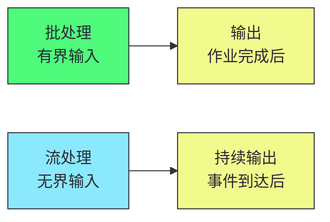
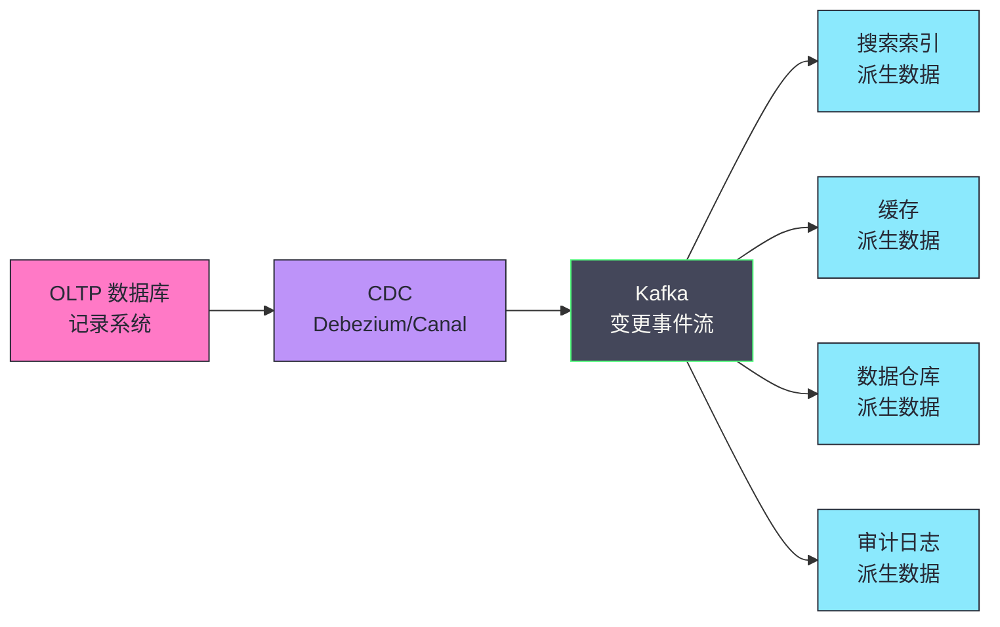
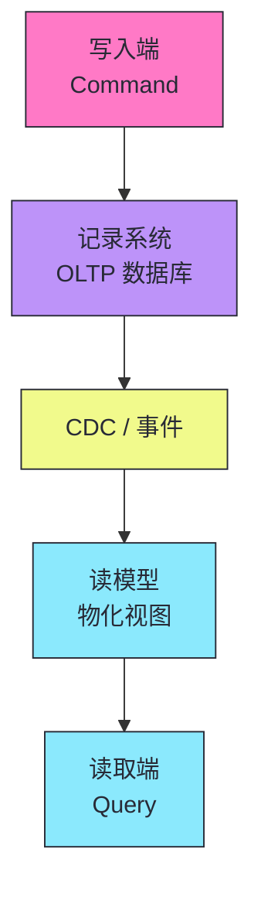
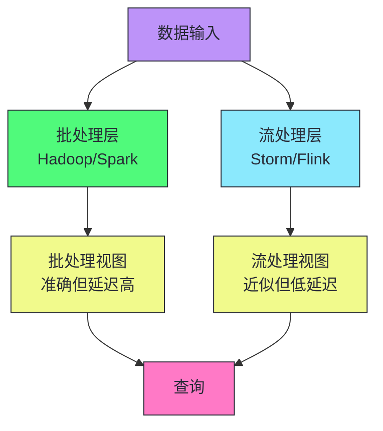
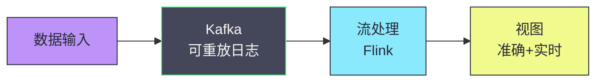
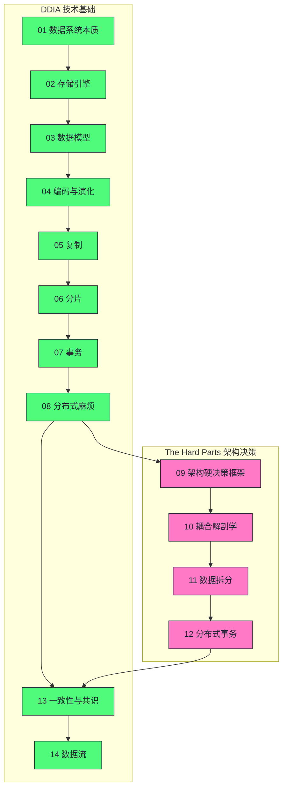
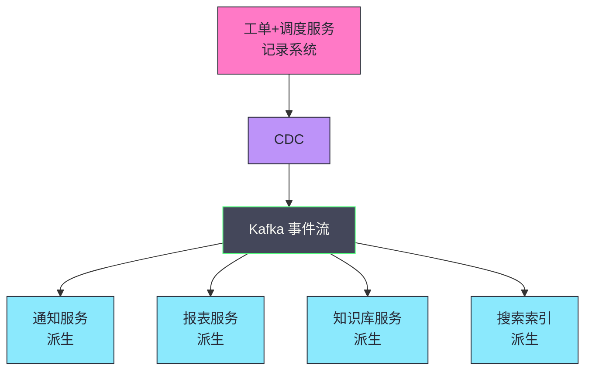

# 14 数据流与架构闭环：批处理、流处理与派生数据的统一视角

> [!abstract] 摘要
> 本文是"数据密集型系统架构实战"专栏的收官之作，从 DDIA 的"派生数据"视角统一批处理、流处理和架构闭环。首先区分三种系统类型：在线系统（请求-响应，延迟敏感）、批处理系统（输入→输出，吞吐量敏感）、流处理系统（无界数据，持续处理）。深入批处理的 Unix 哲学——管道组合、不可变输入、人类容错（错误代码可回滚重跑）。然后转向流处理——从有界批处理到无界流处理的演进，消息系统的三种选择（丢弃/缓冲/背压），消息代理与数据库的比较。讲透派生数据的核心理念——记录系统与派生数据的区分，以及如何通过变更数据捕获（CDC）、事件溯源和 CQRS 构建数据流。讨论 Lambda 架构（批+流双层）和 Kappa 架构（纯流单层）的权衡。最后将整个专栏的知识串联为架构闭环——从 DDIA 的技术基础（存储、复制、分片、事务、一致性）到 The Hard Parts 的架构决策方法论（ADR、适应度函数、耦合分析、服务拆分、分布式事务），形成完整的"数据密集型系统架构实战"知识体系。核心认知：数据系统的未来是"数据流"——将数据库内部机制（日志、索引、物化视图）扩展到跨系统集成的层面。

---

## 第 1 章 三种系统类型

### 1.1 在线系统、批处理系统与流处理系统

| 系统类型 | 处理方式 | 性能指标 | 容错需求 | 示例 |
|---------|---------|---------|---------|------|
| **在线系统** | 请求-响应 | 延迟 | 高可用 | Web 服务、数据库、缓存 |
| **批处理系统** | 输入→输出（有界） | 吞吐量 | 作业级容错 | ETL、模型训练、报表 |
| **流处理系统** | 持续处理（无界） | 延迟+吞吐量 | 持续容错 | 实时监控、实时推荐、CEP |

### 1.2 批处理与流处理的根本区别

批处理的输入是**有界的**——大小已知且有限，批处理过程知道何时完成读取。流处理的输入是**无界的**——数据随时间逐渐到达，永远不会"完整"。



> [!info] 核心概念：批处理是流处理的特例
> 批处理可以看作流处理的特例——有界流。流处理是更一般的模型：它处理无界数据，但也能处理有界数据。现代流处理框架（如 Flink、Kafka Streams）同时支持批处理和流处理，将批处理视为有界流的特殊情况。这种统一视角是"流批一体"的核心理念。

---

## 第 2 章 批处理的 Unix 哲学

### 2.1 Unix 管道的智慧

Unix 工具的管道组合是批处理的鼻祖。分析 Web 服务器日志中最受欢迎的 5 个页面：

```bash
cat /var/log/nginx/access.log |
  awk '{print $7}' |
  sort |
  uniq -c |
  sort -r -n |
  head -n 5
```

这个管道组合的精髓：

1. **每个工具做一件事并做好**——`awk` 提取字段、`sort` 排序、`uniq` 去重计数
2. **工具通过标准输入/输出组合**——管道将前一个工具的输出作为后一个的输入
3. **不可变输入**——日志文件不被修改，输出是派生的
4. **人类容错**——如果逻辑错误，修改后重跑即可

### 2.2 批处理的核心优势

| 优势 | 说明 |
|------|------|
| **人类容错** | 错误代码可回滚重跑，输出可删除重建 |
| **不可逆性最小化** | 敏捷开发的基础——错误可恢复 |
| **输入可复用** | 同一组文件可作多种作业的输入 |
| **资源高效** | 批处理框架高效利用计算资源 |

> [!note] 设计哲学：人类容错是批处理的深层价值
> 批处理的"人类容错"——错误代码可回滚重跑——是其最深层价值。具有读写事务的数据库不具备这个属性：如果部署了写入错误数据的错误代码，回滚代码不能修复那些数据。批处理将输入视为不可变，输出是从输入派生的——如果输出错误，删除输出、修复代码、重跑即可。这种"最小化不可逆性"的原则对敏捷软件开发有益。现代数据仓库的"数据时间旅行"（time travel）特性（如 Snowflake、BigQuery）继承了这一理念——可以查询历史时间点的数据状态。

### 2.3 从 MapReduce 到 Spark/Flink

MapReduce 是 Google 2004 年发表的批处理算法，现已基本过时。现代批处理更多使用 Spark 或 Flink，或数据仓库查询引擎。

| 维度 | MapReduce | Spark/Flink |
|------|-----------|-------------|
| **编程模型** | Map/Reduce 低层 | DataFrame/SQL 高层 |
| **中间结果** | 写磁盘 | 内存缓存（Spark）/ 流式（Flink） |
| **迭代计算** | 不支持（每轮写磁盘） | 支持（内存迭代） |
| **延迟** | 高（多轮作业） | 低（内存计算） |
| **工作流编排** | Oozie/Azkaban | Airflow/Dagster/Prefect |

> [!info] 核心概念：批处理存储层从 HDFS 迁移到对象存储
> 云计算时代，批处理存储层正从分布式文件系统（HDFS、GlusterFS、CephFS）向对象存储（S3）迁移。对象存储的优势：按需付费、无限容量、无需运维集群。开放表格式（Iceberg、Delta Lake、Hudi）在对象存储上提供事务性、时间旅行、Schema 演化等数据库级特性，模糊了数据仓库和批处理的界限。

---

## 第 3 章 流处理：从有界到无界

### 3.1 为什么需要流处理

每日批处理的问题：输入的变化要一天后才反映到输出中，太慢。为了减少延迟，可以更频繁地运行处理——每秒处理一秒的数据——甚至连续运行，在每个事件发生时立即处理。这就是流处理。

### 3.2 消息系统的三种选择

当生产者发送消息的速度快于消费者处理的速度时，系统有三种选择：

| 选择 | 机制 | 适用场景 |
|------|------|---------|
| **丢弃消息** | 超过容量时丢弃 | 传感器数据（很快有新值） |
| **缓冲** | 在队列中缓冲 | 大多数场景（但需管理队列增长） |
| **背压** | 阻塞生产者 | TCP/Unix 管道 |

### 3.3 消息代理 vs 数据库

消息代理（如 Kafka）本质上是一种针对处理消息流而优化的数据库。

| 维度 | 消息代理 | 数据库 |
|------|---------|--------|
| **数据保留** | 有限（按时间或大小） | 长期 |
| **查询方式** | 按顺序消费 | 随机查询 |
| **写入模式** | 追加 | 追加+更新+删除 |
| **索引** | 偏移量索引 | 多种索引 |
| **消费模型** | 推送（push） | 拉取（pull） |

> [!info] 核心概念：Kafka 将消息代理和数据库的界限模糊了
> Kafka 的日志压缩（Log Compaction）特性使其更像数据库——保留每个键的最新值，类似数据库的物化视图。Kafka 既是消息代理（实时事件流）又是数据库（长期存储键值数据）。这种模糊是"数据流"架构的基础——将数据库内部机制（日志、索引、物化视图）扩展到跨系统集成的层面。

### 3.4 流处理的容错保证

| 保证级别 | 机制 | 适用场景 |
|---------|------|---------|
| **At-most-once** | 不重试，可能丢 | 传感器数据 |
| **At-least-once** | 重试，可能重复 | 大多数场景（需幂等） |
| **Exactly-once** | 事务性写入 | 金融、计数 |

> [!warning] 生产避坑：Exactly-once 的代价
> Exactly-once 语义需要事务性写入或两阶段提交，代价是更高的延迟和更低的吞吐量。大多数场景用 At-least-once + 幂等处理就够了——比真正的 Exactly-once 简单且性能更好。Flink 的 Exactly-once 通过 Chandy-Lamport 快照算法实现，但需要源和汇的支持。评估你的场景是否真的需要 Exactly-once——如果可以接受重复（用幂等处理），At-least-once 是更好的选择。

---

## 第 4 章 派生数据：记录系统与派生数据

### 4.1 记录系统与派生数据的区分

**记录系统（System of Record）**：数据的权威来源，数据的"真值"。记录系统中的数据是原始的、不可派生的。

**派生数据（Derived Data）**：从记录系统通过某种转换过程生成的数据。派生数据可以重新生成——如果丢失，从记录系统重新派生即可。

| 类型 | 特征 | 示例 |
|------|------|------|
| **记录系统** | 权威、原始、不可派生 | OLTP 数据库的业务数据 |
| **派生数据** | 可重新生成、从记录系统转换 | 搜索索引、物化视图、缓存、报表 |

> [!info] 核心概念：派生数据是架构闭环的关键
> 派生数据的核心理念：如果数据可以从记录系统重新生成，它就是派生的——丢失不可怕，重新派生即可。这个理念使得系统更健壮——不需要保证派生数据的持久性，只需要保证记录系统的持久性和派生过程的可重复性。搜索索引、缓存、物化视图、报表都是派生数据。将数据系统分为记录系统和派生数据两层，是构建可扩展、可维护数据架构的关键。

### 4.2 变更数据捕获（CDC）

**变更数据捕获（CDC）** 是将数据库的变更（插入、更新、删除）作为事件流捕获的技术。



CDC 的价值：

- **解耦**：派生系统通过 CDC 获取变更，不直接访问记录系统
- **顺序保证**：变更事件按顺序传递，保持因果关系
- **可重放**：派生系统可以从任意时间点重新消费变更事件

### 4.3 事件溯源

**事件溯源（Event Sourcing）** 将所有状态变更存储为不可变的事件序列，当前状态通过重放事件得到。

| 维度 | 传统 CRUD | 事件溯源 |
|------|----------|---------|
| **存储** | 当前状态 | 事件序列 |
| **更新** | 覆盖旧值 | 追加新事件 |
| **历史** | 丢失（只有当前） | 完整保留 |
| **审计** | 需额外日志 | 天然支持 |
| **复杂度** | 低 | 高 |

> [!note] 设计哲学：事件溯源将数据库日志提升为记录系统
> 传统数据库内部也有日志（WAL），但日志是内部实现细节，对应用不可见。事件溯源将日志提升为记录系统——应用直接写入事件日志，当前状态是派生数据（通过重放事件得到）。这是"将数据库内部机制扩展到应用层面"的实践。事件溯源的代价是复杂度高——需要设计事件 Schema、处理事件演化、实现快照优化重放性能。适用于需要完整审计追溯的场景（金融、合规）。

### 4.4 CQRS：命令查询职责分离

**CQRS（Command Query Responsibility Segregation）** 将写入（Command）和读取（Query）分离为不同的模型。



CQRS 的价值：

- **读写独立优化**：写入用适合写的存储，读取用适合读的存储
- **多个读模型**：同一份数据可有多个读模型（搜索索引、缓存、报表）
- **读写分离**：写入和读取的负载独立扩展

> [!info] 核心概念：CQRS 是派生数据理念的应用
> CQRS 是派生数据理念的具体应用——记录系统负责写入，读模型是派生数据（通过 CDC/事件从记录系统派生）。读模型可以根据查询需求选择最合适的存储——全文搜索用 Elasticsearch，低延迟读取用 Redis，分析查询用 ClickHouse。每个读模型独立优化，不影响写入性能。CQRS 的代价是最终一致性——读模型可能滞后于记录系统。对于读多写少且容忍最终一致性的场景，CQRS 是理想选择。

---

## 第 5 章 Lambda 架构与 Kappa 架构

### 5.1 Lambda 架构：批+流双层

**Lambda 架构**用批处理层和流处理层同时处理数据：



| 层 | 作用 | 特点 |
|---|------|------|
| **批处理层** | 准确计算历史数据 | 准确但延迟高（小时/天） |
| **流处理层** | 实时计算近期数据 | 低延迟但可能近似 |
| **服务层** | 合并两层视图响应查询 | 准确+实时 |

### 5.2 Kappa 架构：纯流单层

**Kappa 架构**只用流处理层，用可重放的日志（如 Kafka）替代批处理：



### 5.3 Lambda vs Kappa 的权衡

| 维度 | Lambda | Kappa |
|------|--------|-------|
| **复杂度** | 高（维护两套代码） | 低（一套代码） |
| **准确性** | 批处理层保证准确 | 依赖流处理保证准确 |
| **延迟** | 流处理层低延迟 | 低延迟 |
| **重算** | 批处理层重跑 | 重放 Kafka 日志 |
| **适用场景** | 需要准确+实时 | 流处理足够准确 |

> [!warning] 生产避坑：Lambda 架构的最大问题是维护两套代码
> Lambda 架构的最大问题是批处理层和流处理层需要维护两套逻辑相同的代码——用不同的框架（如 Hadoop 和 Storm）实现同一业务逻辑。当业务逻辑变更时，两套代码都需更新，容易产生不一致。Kappa 架构通过只用流处理避免这个问题——但要求流处理足够准确（exactly-once 语义）和可重放（Kafka 日志）。现代流处理框架（如 Flink）的成熟使 Kappa 架构越来越可行。

---

## 第 6 章 架构闭环：从 DDIA 到 The Hard Parts

### 6.1 专栏知识体系回顾

本专栏从 DDIA 的技术基础到 The Hard Parts 的架构决策方法论，形成了完整的知识体系：



### 6.2 两个视角的融合

| 视角 | 关注问题 | 核心工具 |
|------|---------|---------|
| **DDIA（技术基础）** | 如何实现 X | 存储引擎、复制、分片、事务、共识 |
| **The Hard Parts（决策方法论）** | 是否应该用 X | ADR、适应度函数、耦合分析、权衡分析 |
| **融合** | 在什么上下文中用 X 解决什么痛点 | 技术深度 + 决策框架 |

> [!info] 核心概念：技术深度 + 决策方法论 = 完整架构能力
> 只懂技术不懂方法论的架构师，会陷入"锤子找钉子"——学了微服务就想拆分所有系统。只懂方法论不懂技术的架构师，会做出无法落地的决策——说"要保证一致性"但不知道 2PC 和 Raft 的区别。本专栏的前半部分建立了 DDIA 的技术深度，后半部分建立了 The Hard Parts 的决策方法论，最后一篇用"数据流"将两者融合——派生数据理念既是技术（CDC、事件溯源、CQRS），也是方法论（记录系统与派生数据的区分指导架构决策）。

### 6.3 数据流：统一数据库内部与跨系统集成的视角

数据流的核心理念：**将数据库内部机制（日志、索引、物化视图）扩展到跨系统集成的层面**。

| 数据库内部 | 跨系统集成 |
|----------|----------|
| WAL（预写日志） | Kafka（事件日志） |
| 索引（B-Tree/LSM） | Elasticsearch（搜索索引） |
| 物化视图 | CQRS 读模型 |
| 触发器 | CDC + 事件处理 |
| 复制日志 | CDC + 派生数据同步 |

> [!note] 设计哲学：数据流是数据系统的未来
> 传统上，数据库内部机制（日志、索引、物化视图）是数据库的实现细节，对应用不可见。数据流的理念将这些机制扩展到跨系统集成的层面——Kafka 是跨系统的 WAL，Elasticsearch 是跨系统的索引，CQRS 读模型是跨系统的物化视图。这使得我们可以用数据库的成熟理论（日志、索引、物化视图）来指导跨系统集成的架构设计。这是"数据密集型系统架构"的未来方向——从单一数据库到数据流架构，从"数据库内部"到"跨系统集成"。

---

## 第 7 章 Sysops Squad 的数据流架构

### 7.1 从单体到数据流架构

Sysops Squad 的最终架构演进：



### 7.2 架构决策总结

| 决策 | 选择 | 理由 |
|------|------|------|
| **工单+调度** | 保持共享数据库 | 紧密事务关联，核心架构量子 |
| **通知系统** | 独立 MongoDB | 事务关联弱，扩展需求差异大 |
| **报表分析** | 独立 ClickHouse | OLAP 访问模式 |
| **知识库** | 独立 Elasticsearch | 全文搜索需求 |
| **跨服务通信** | Kafka 事件流 | 解耦，支持重放 |
| **数据同步** | CDC | 不停机迁移，实时同步 |
| **分布式事务** | Fairy Tale Saga | 异步编排，可见性好 |
| **领导选举** | Raft（ZooKeeper） | 防止脑裂 |

---

## 总结：专栏的完整知识体系

数据流与架构闭环的核心知识可以归纳为以下主线：

1. **三种系统类型**。在线系统（请求-响应，延迟敏感）、批处理系统（输入→输出，吞吐量敏感）、流处理系统（无界数据，持续处理）。批处理是流处理的特例（有界流）。

2. **批处理的 Unix 哲学**。管道组合、不可变输入、人类容错（错误代码可回滚重跑）。人类容错是批处理最深层价值——最小化不可逆性是敏捷开发的基础。

3. **流处理从有界到无界**。消息系统的三种选择（丢弃/缓冲/背压）。消息代理（Kafka）本质上是对处理消息流优化的数据库。Kafka 的日志压缩模糊了消息代理和数据库的界限。

4. **派生数据是架构闭环的关键**。记录系统是权威数据源，派生数据可从记录系统重新生成。将数据系统分为记录系统和派生数据两层，是构建可扩展、可维护架构的关键。

5. **CDC 将数据库变更作为事件流**。解耦派生系统与记录系统，顺序保证，可重放。CDC 是不停机数据迁移和实时数据同步的关键技术。

6. **事件溯源将日志提升为记录系统**。应用直接写入事件日志，当前状态是派生数据。代价是复杂度高，适用于需要审计追溯的场景。

7. **CQRS 是派生数据理念的应用**。写入用记录系统，读取用派生的读模型。多个读模型独立优化。代价是最终一致性。

8. **Lambda vs Kappa 架构**。Lambda（批+流双层）准确但维护两套代码。Kappa（纯流单层）简单但要求流处理足够准确。现代流处理框架的成熟使 Kappa 越来越可行。

9. **数据流是数据系统的未来**。将数据库内部机制（日志、索引、物化视图）扩展到跨系统集成的层面。Kafka 是跨系统的 WAL，Elasticsearch 是跨系统的索引，CQRS 读模型是跨系统的物化视图。

10. **技术深度 + 决策方法论 = 完整架构能力**。DDIA 提供"如何实现"的技术选项，The Hard Parts 提供"是否应该用"的决策框架。两者结合才是优秀架构师的完整能力。

11. **从痛点出发，而非从技术出发**。架构决策应从具体痛点驱动因素开始，选择最小代价的解决方案。微服务不是目标，解决痛点才是。

12. **可解释、可追溯的决策过程比"正确"的决策结果更重要**。ADR 让决策可追溯，适应度函数让执行可验证。即使决策最终被证明错误，可追溯的推理过程也是宝贵的学习材料。

13. **用不可靠组件构建可靠系统**。网络不可靠、时钟不准、进程会暂停——但通过共识算法、Fencing Token、重试机制、幂等性，可以构建整体可靠的系统。

14. **架构是持续演进的闭环**。决策→实现→验证→回顾→新决策。环境变化使原来的决策不再适用，定期回顾 ADR，标记过时决策，创建新 ADR。

15. **流批一体是现代数据处理的趋势**。Flink、Kafka Streams 等框架同时支持批处理和流处理，将批处理视为有界流的特殊情况。这种统一视角简化了架构——一套代码处理批和流，无需维护 Lambda 架构的两套代码。

16. **开放表格式（Iceberg/Delta Lake/Hudi）模糊了数据仓库和批处理的界限**。在对象存储上提供事务性、时间旅行、Schema 演化等数据库级特性。批处理存储层从 HDFS 迁移到 S3，云数据仓库（BigQuery、Snowflake）继承了批处理的人类容错理念。

> [!info] 专栏结语
> 本专栏从"数据密集型系统的本质"出发，经过存储引擎、数据模型、编码演化、复制、分片、事务、分布式麻烦、架构决策框架、耦合解剖学、数据拆分、分布式事务、一致性与共识，最终在"数据流与架构闭环"画上句号。14 篇文章形成了一个完整的知识体系——从 DDIA 的技术基础到 The Hard Parts 的架构决策方法论，从单一数据库到数据流架构，从"数据库内部"到"跨系统集成"。希望这个专栏能帮助你建立对数据密集型系统架构的完整认知，并在实践中做出更理性、更可追溯的架构决策。架构没有对错，只有权衡——但理解权衡需要技术深度和决策方法论的双重支撑。

> [!info] 专栏导航
> 本文是 [[00 专栏导览|数据密集型系统架构实战专栏]] 的第 14 篇，也是收官之作。上一篇 [[13 一致性与共识工程实践：线性一致性、因果一致性与 Raft]] 深入了一致性与共识的底层机制，本文用"数据流"将整个专栏的知识串联为架构闭环。建议从 [[00 专栏导览]] 开始顺序阅读，建立完整的知识体系。

---

## 延伸思考

1. **你的系统哪些数据是记录系统，哪些是派生数据？** 对每份核心数据，明确它是权威的记录系统还是可重新生成的派生数据。派生数据丢失不可怕——从记录系统重新派生即可。

2. **你的派生数据是否通过 CDC 同步？** 如果派生系统直接访问记录系统的数据库，评估用 CDC 解耦的成本——CDC 提供顺序保证和可重放，是更健壮的同步方式。

3. **你的系统是否需要 CQRS？** 如果读写负载差异大，或需要多个读模型（搜索、缓存、报表），评估 CQRS 的成本——写入用记录系统，读取用派生的读模型，各自独立优化。

4. **你的实时处理是 Lambda 还是 Kappa？** 如果维护批处理和流处理两套代码，评估是否能迁移到 Kappa 架构——现代流处理框架（Flink）的成熟使 Kappa 越来越可行。

5. **你的架构决策是否从痛点出发？** 回顾你的架构决策——它们是从"我们要用 X 技术"出发，还是从"我们有 X 痛点"出发？如果是前者，重新评估。

6. **你的架构决策是否可追溯？** 翻看你的 ADR 目录——新工程师能否在 15 分钟内了解所有重大决策的来龙去脉？如果不能，你有架构失忆。

7. **你的架构规则是否有自动化验证？** 列出你的架构规则，检查哪些有适应度函数验证。没有的，评估用 ArchUnit 或类似工具实现。

8. **你的系统是否用不可靠组件构建了可靠系统？** 检查你的容错机制——重试、幂等、Fencing Token、共识算法。你是否假设了网络可靠、时钟准确、进程不暂停？这些假设都会在生产中被打破。

9. **你的架构是否持续演进？** 你是否定期回顾过去的 ADR？是否有机制在环境变化时标记旧 ADR 为 Deprecated？架构不是一次性的，是持续演进的闭环。

10. **你是否将数据库内部机制扩展到跨系统集成？** Kafka 是跨系统的 WAL，Elasticsearch 是跨系统的索引，CQRS 读模型是跨系统的物化视图。用数据库的成熟理论指导跨系统集成的架构设计——这是数据系统的未来方向。

11. **你的流处理是否用了 Exactly-once？** 评估你的场景是否真的需要 Exactly-once——如果可以接受重复（用幂等处理），At-least-once 更简单且性能更好。Flink 的 Exactly-once 需要 source 和 sink 支持。

12. **你的数据架构是否考虑了开放表格式？** Iceberg、Delta Lake、Hudi 在对象存储上提供事务性和时间旅行。如果你还在用 HDFS，评估迁移到 S3 + 开开放表格式的成本——按需付费、无限容量、无需运维集群。

---

*本文基于 Martin Kleppmann《Designing Data-Intensive Applications, 2nd Edition》第 11-14 章和 Neal Ford 等《Software Architecture: The Hard Parts》整合而成，加入了作者的结构化重组、工程实践理解和专栏闭环设计。*
