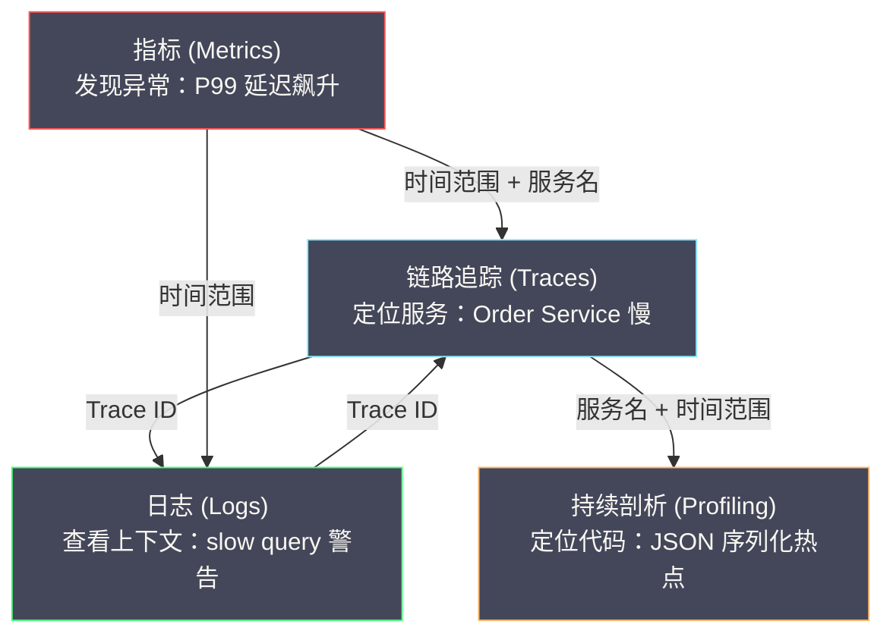

# 00 可观测性全景导览

**摘要：**

可观测性（Observability）是分布式系统工程中**从"被动救火"转向"主动洞察"**的关键能力。它不是某个单一工具，而是由四种互补的观测手段——**指标（Metrics）**、**日志（Logs）**、**链路追踪（Traces）**、**持续剖析（Continuous Profiling）**——共同构建的完整体系。本文作为可观测性系列专栏的总纲，系统梳理四种观测手段各自解决什么问题、彼此之间如何协作，以及在 CNCF 生态中对应的主流产品形态，为后续四个子专栏的深入学习建立全局认知框架。

---

## 第 1 章 什么是可观测性

### 1.1 从"监控"到"可观测性"的认知升级

**监控（Monitoring）** 是一个已有数十年历史的概念：预先定义好"关注什么"（CPU 使用率、内存占用、错误率），然后采集数据、设置阈值、触发告警。监控的核心假设是：**你能提前预知所有可能的故障模式**。

在单体应用时代，这个假设基本成立——系统结构简单，故障模式有限，运维团队可以枚举大多数故障场景并设置对应的告警规则。

但在微服务和云原生时代，这个假设被彻底打破：

- **调用链路指数级增长**：一个用户请求可能经过 20+ 个微服务，任何一个环节出问题都可能导致用户体验下降
- **故障模式不可预知**：网络抖动、GC 停顿、线程池耗尽、数据库慢查询、第三方 API 超时——故障的组合方式几乎无穷
- **环境高度动态**：容器编排系统随时在创建、销毁、迁移 Pod，IP 地址和实例数在不断变化

**可观测性（Observability）** 的核心理念与监控不同：**它不要求你提前知道会出什么问题，而是让你在问题发生后，能够通过系统的外部输出（指标、日志、链路、剖析数据）快速推断出系统内部发生了什么**。

用一个类比：监控是"在门口装了摄像头，盯着已知的可疑位置"；可观测性是"给整栋楼装满了传感器，任何异常都能被追溯到源头"。

### 1.2 可观测性的形式化定义

可观测性这个词源自控制论（Control Theory）：一个系统是"可观测的"，当且仅当你能**仅通过系统的外部输出**来推断出系统的**任意内部状态**。

映射到软件工程：一个分布式系统具有良好的可观测性，意味着——当线上出现任何异常（延迟升高、错误率增加、用户投诉），工程师能够**不需要登录服务器、不需要添加新的日志、不需要重新部署代码**，仅通过已有的观测数据（指标、日志、链路追踪、剖析），快速定位到问题的根因。

---

## 第 2 章 四种观测手段：各自解决什么问题

### 2.1 指标（Metrics）：回答"系统现在怎么样"

**指标**是**聚合的、数值型的时间序列数据**——某个度量值随时间的变化曲线。

**指标解决的核心问题**：系统当前的健康状态如何？趋势是好转还是恶化？是否需要扩容？

**指标的特点**：
- **存储开销极小**：一个指标每 15 秒采一个点，一天 5760 个数据点，占用几十 KB
- **查询极快**：时间序列数据库（如 [[Prometheus]] 的 TSDB）对时间范围查询做了极致优化
- **天然支持聚合**：P99 延迟、错误率、QPS 都是指标的典型表达
- **不携带上下文**：指标告诉你"错误率升高了"，但不告诉你"是哪个请求出了错"

**典型使用场景**：
- 实时监控大盘（QPS、延迟、错误率）
- 告警规则（错误率 > 1% 持续 5 分钟触发告警）
- 容量规划（CPU 使用率趋势预测）
- SLO/SLA 度量（99.9% 可用性的达成情况）

**代表产品**：[[Prometheus]]、[[VictoriaMetrics]]、[[Thanos]]、[[Grafana Mimir]]

### 2.2 日志（Logs）：回答"发生了什么事"

**日志**是**离散的、文本型的事件记录**——系统在某个时刻发生了什么。

**日志解决的核心问题**：在某个具体的时间点，系统内部发生了什么事件？错误的具体信息是什么？

**日志的特点**：
- **信息最丰富**：日志可以包含任意上下文（请求参数、用户 ID、异常堆栈、SQL 语句）
- **存储开销最大**：一个中等规模的微服务集群每天可能产生 TB 级日志
- **查询相对慢**：全文搜索比时间序列查询慢几个数量级
- **非结构化 → 结构化演进**：从早期的纯文本日志到现代的 JSON 结构化日志

**典型使用场景**：
- 错误排查（查看异常堆栈、请求上下文）
- 审计合规（记录谁在什么时间做了什么操作）
- 安全分析（异常登录检测、入侵行为分析）
- 业务分析（用户行为日志、交易日志）

**代表产品**：[[Elasticsearch]]（ELK Stack）、[[Grafana Loki]]、[[Splunk]]、[[Fluentd]]、[[Vector]]

### 2.3 链路追踪（Traces）：回答"请求在哪里慢了"

**链路追踪**是**跨服务的、请求级别的调用链路记录**——一个请求从进入系统到返回结果，经过了哪些服务、每个服务花了多长时间。

**链路追踪解决的核心问题**：一个具体的请求（或一类请求）的延迟瓶颈在哪个服务？调用链路中哪个环节出了错？

**链路追踪的特点**：
- **请求粒度**：每条 Trace 对应一个完整的请求生命周期
- **跨服务关联**：通过 Trace ID 将分散在不同服务中的 Span 关联成完整调用树
- **因果关系清晰**：父子 Span 关系天然表达了"谁调用了谁"
- **采样是必须的**：全量链路数据量巨大，生产环境通常只采样 1%~10%

**典型使用场景**：
- 延迟分析（P99 请求慢在哪个服务？）
- 错误定位（调用链中第几个服务返回了错误？）
- 依赖拓扑发现（自动发现服务间的调用关系）
- 容量规划（哪个下游服务承受了最多调用量？）

**代表产品**：[[Apache SkyWalking]]、[[Jaeger]]、[[Zipkin]]、[[Grafana Tempo]]、[[OpenTelemetry]]（标准 + SDK）

### 2.4 持续剖析（Continuous Profiling）：回答"代码哪里慢了"

**持续剖析**是**代码级别的、CPU/内存/锁等资源消耗的采样分析**——在生产环境中持续采样，定位到具体的函数和代码行。

**持续剖析解决的核心问题**：已经知道某个服务慢了（通过指标和链路追踪定位到），但具体是这个服务的哪段代码消耗了最多的 CPU/内存/锁等待时间？

**持续剖析的特点**：
- **代码级精度**：可以精确到函数、甚至代码行
- **低开销采样**：现代 Profiler（如 async-profiler）的开销通常 < 1%
- **直观的可视化**：火焰图（Flame Graph）是 Profiling 数据的标准可视化方式
- **弥补了链路追踪的"最后一公里"**：链路追踪定位到"哪个服务慢"，Profiler 定位到"哪行代码慢"

**典型使用场景**：
- CPU 热点分析（哪个函数占用了最多 CPU？）
- 内存泄漏定位（哪个对象分配了最多内存？）
- 锁竞争分析（哪个锁导致了线程阻塞？）
- GC 压力分析（哪些代码产生了大量短生命周期对象？）

**代表产品**：[[Pyroscope]]、[[Parca]]、[[async-profiler]]、[[Java Flight Recorder]]（JFR）、[[SkyWalking]] 内置 Profiler

---

## 第 3 章 四种手段的协作关系：从"发现"到"根因"

### 3.1 故障排查的典型路径

四种观测手段不是孤立使用的，它们在实际故障排查中构成一条**逐层下钻**的分析链：

```
指标（发现异常）
  → "API 网关的 P99 延迟从 100ms 飙升到 2s"

链路追踪（定位服务）
  → "采样到的慢请求链路显示，瓶颈在 Order Service 的数据库查询 Span（1.8s）"

日志（查看上下文）
  → "Order Service 在该时间段的日志显示大量 slow query 警告，SQL 是全表扫描"

持续剖析（定位代码）
  → "Order Service 的 CPU 火焰图显示 70% 的 CPU 消耗在 JSON 序列化函数上"
```

**指标是入口**：指标告诉你"出事了"，是最快的异常发现手段（因为指标是聚合数据，查询极快，告警延迟秒级）。

**链路追踪是第一层下钻**：从"哪个系统出了问题"定位到"哪个服务/哪个接口出了问题"。

**日志是第二层下钻**：从"哪个服务有问题"定位到"具体发生了什么事件"（错误详情、SQL 语句、请求参数）。

**Profiler 是最后一层下钻**：从"服务有问题"定位到"代码哪一行有问题"。

### 3.2 四种手段的关联机制

要让四种手段无缝协作，关键是**数据关联**——在不同信号之间建立跳转链接：

**Trace ID 是核心关联键**：
- 链路追踪 → 日志：在结构化日志中嵌入 Trace ID，从链路追踪系统点击某个 Span，直接跳转到该 Span 对应时间段的日志
- 链路追踪 → 指标：从链路追踪的拓扑图中，点击某个服务节点，跳转到该服务的 Grafana 指标仪表盘
- 指标 → 链路追踪：从 Grafana 的指标告警中，携带时间范围和服务名，跳转到链路追踪系统查看该时间段的慢请求
- 链路追踪 → Profiler：SkyWalking 支持在 Trace 上挂载 Profile 任务，从慢 Span 直接触发该服务的代码级剖析



---

## 第 4 章 CNCF 可观测性生态全景

### 4.1 产品生态概览

[[CNCF]]（Cloud Native Computing Foundation）的可观测性生态在过去 5 年快速成熟，以下是各领域的主要产品：

| 领域 | 开源产品 | 定位 |
| :--- | :--- | :--- |
| **指标采集与存储** | [[Prometheus]] | Pull 模型指标采集，TSDB 存储，PromQL 查询 |
| **指标长期存储** | [[Thanos]] / [[VictoriaMetrics]] / [[Grafana Mimir]] | Prometheus 的高可用与长期存储扩展 |
| **链路追踪** | [[Apache SkyWalking]] | 全栈 APM，Java Agent 无侵入埋点 |
| **链路追踪** | [[Jaeger]] | CNCF 毕业项目，Uber 开源 |
| **链路追踪存储** | [[Grafana Tempo]] | 专注链路存储，对象存储后端 |
| **日志采集** | [[Fluentd]] / [[Fluent Bit]] / [[Vector]] | 日志采集 Agent，支持多种输出 |
| **日志存储与检索** | [[Elasticsearch]] | 全文搜索引擎，ELK Stack 核心 |
| **日志存储与检索** | [[Grafana Loki]] | 标签索引 + 日志块存储，低成本方案 |
| **持续剖析** | [[Pyroscope]] / [[Parca]] | 生产环境持续 Profiling |
| **统一标准** | [[OpenTelemetry]] | CNCF 统一 Telemetry 标准（Traces + Metrics + Logs） |
| **可视化** | [[Grafana]] | 统一可视化平台，支持所有数据源 |

### 4.2 OpenTelemetry：统一标准的意义

[[OpenTelemetry]]（OTel）是 CNCF 中最活跃的项目之一（按贡献者数量排名第二，仅次于 Kubernetes），它的目标是：**定义统一的可观测性数据采集标准，使应用程序的埋点与后端存储解耦**。

OTel 之前的混乱局面：
- 链路追踪：OpenTracing（API 标准）vs OpenCensus（Google 的 SDK）→ 社区分裂
- 指标：Prometheus 格式 vs StatsD vs Micrometer → 各自独立
- 日志：各自为战，没有统一标准

OTel 合并了 OpenTracing 和 OpenCensus，提供：
- **统一 API**：应用代码只依赖 OTel API，不绑定具体的后端
- **统一 SDK**：提供各语言的 SDK 实现，负责数据采集和处理
- **统一协议 OTLP**：统一的数据传输协议，后端（SkyWalking、Jaeger、Prometheus 等）都支持 OTLP 接入
- **OTel Collector**：统一的数据收集/处理/转发中间件

---

## 第 5 章 本系列专栏结构

本可观测性系列共包含 **4 个子专栏**，放置在 `可观测/` 目录下的四个子目录中：

### 子专栏一：链路追踪（`可观测/链路追踪/`）— 以 SkyWalking 为核心

| 序号 | 文章标题 | 核心内容 |
| :--- | :--- | :--- |
| 00 | [[00 专栏导览]] | 链路追踪的地位与学习路径 |
| 01 | [[01 为什么需要链路追踪]] | 从单体到微服务的调试困境、Dapper 论文 |
| 02 | [[02 链路追踪核心概念]] | Trace/Span/Context Propagation 数据模型 |
| 03 | [[03 OpenTelemetry 统一标准]] | OTel 三层架构、OTLP 协议 |
| 04 | [[04 SkyWalking 整体架构深度解析]] | Agent/OAP/UI 三层、数据流 |
| 05 | [[05 SkyWalking Java Agent 字节码增强原理]] | Byte Buddy、插件机制 |
| 06 | [[06 SkyWalking 采样策略与性能影响]] | 全量/概率/自适应采样 |
| 07 | [[07 SkyWalking OAP 流处理与存储模型]] | 聚合、ES/BanyanDB 存储 |
| 08 | [[08 链路追踪工程实践落地经验]] | 跨线程传播、采样调优、告警联动 |

### 子专栏二：日志（`可观测/日志/`）

| 序号 | 文章标题 | 核心内容 |
| :--- | :--- | :--- |
| 00 | [[00 专栏导览]] | 日志在可观测性中的角色 |
| 01 | [[01 日志的本质与演进]] | 非结构化→结构化日志的演变 |
| 02 | [[02 日志采集架构对比]] | Filebeat/Fluentd/Vector |
| 03 | [[03 Elasticsearch 日志存储与检索原理]] | 倒排索引、分片、冷热分层 |
| 04 | [[04 Loki 日志系统深度解析]] | 标签设计、日志块存储、LogQL |
| 05 | [[05 日志与链路追踪的联动]] | Trace ID 关联、Grafana 跳转 |

### 子专栏三：指标（`可观测/指标/`）— 以 Prometheus 体系为核心

| 序号 | 文章标题 | 核心内容 |
| :--- | :--- | :--- |
| 00 | [[00 专栏导览]] | 指标体系全景 |
| 01 | [[01 为什么需要指标]] | 指标 vs 日志、RED/USE 方法论 |
| 02 | [[02 Prometheus 数据模型与采集原理]] | 4 种指标类型、Pull 模型 |
| 03 | [[03 PromQL 深度解析]] | rate/increase/histogram_quantile |
| 04 | [[04 Prometheus TSDB 深度解析]] | Head Block、WAL、压缩 |
| 05 | [[05 Prometheus 高可用与长期存储]] | Thanos/VictoriaMetrics |
| 06 | [[06 Grafana 仪表盘与告警工程化]] | Panel 设计、AlertManager |
| 07 | [[07 指标工程落地与 SLO 体系]] | SLI/SLO/Error Budget |

### 子专栏四：Profiler（`可观测/Profiler/`）

| 序号 | 文章标题 | 核心内容 |
| :--- | :--- | :--- |
| 00 | [[00 专栏导览]] | Profiler 的定位 |
| 01 | [[01 持续性能剖析]] | JFR、async-profiler |
| 02 | [[02 火焰图阅读与性能问题识别]] | CPU/Off-CPU/内存火焰图 |
| 03 | [[03 eBPF Profiling 内核级性能观测]] | eBPF、perf、Parca/Pyroscope |
| 04 | [[04 SkyWalking 集成 Profiler]] | Task-based Profiling |

> [!info] 推荐阅读顺序
> 1. **先读本文**（总纲），建立四种手段的全局认知
> 2. **指标专栏**（理解"如何发现问题"）
> 3. **链路追踪专栏**（理解"如何定位到服务"）
> 4. **日志专栏**（理解"如何查看上下文"）
> 5. **Profiler 专栏**（理解"如何定位到代码"）
>
> 也可以根据兴趣直接跳入任一子专栏，每个子专栏都是自包含的。

---

## 参考资料

1. Cindy Sridharan (2018). *Distributed Systems Observability*. O'Reilly Media.
2. Google Dapper 论文：Sigelman, B., et al. (2010). Dapper, a Large-Scale Distributed Systems Tracing Infrastructure. Google Technical Report.
3. OpenTelemetry 官方文档：https://opentelemetry.io/docs/
4. CNCF Observability Landscape：https://landscape.cncf.io/card-mode?category=observability-and-analysis
5. Prometheus 官方文档：https://prometheus.io/docs/
6. Apache SkyWalking 官方文档：https://skywalking.apache.org/docs/
7. Grafana Loki 官方文档：https://grafana.com/docs/loki/latest/
8. Brendan Gregg (2020). *Systems Performance: Enterprise and the Cloud*. Addison-Wesley.（火焰图和系统性能分析的权威参考）
