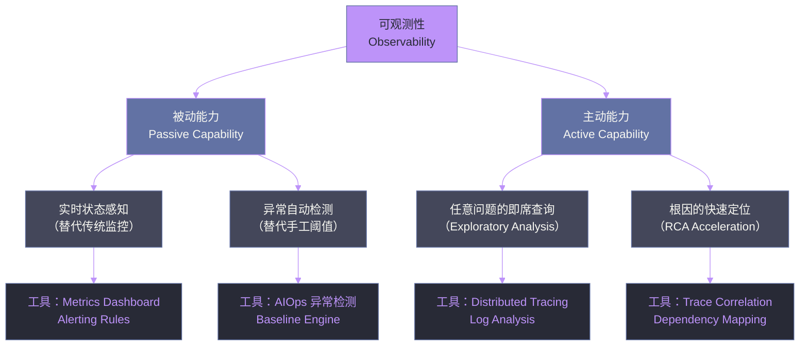
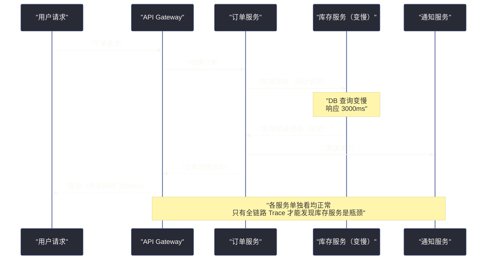
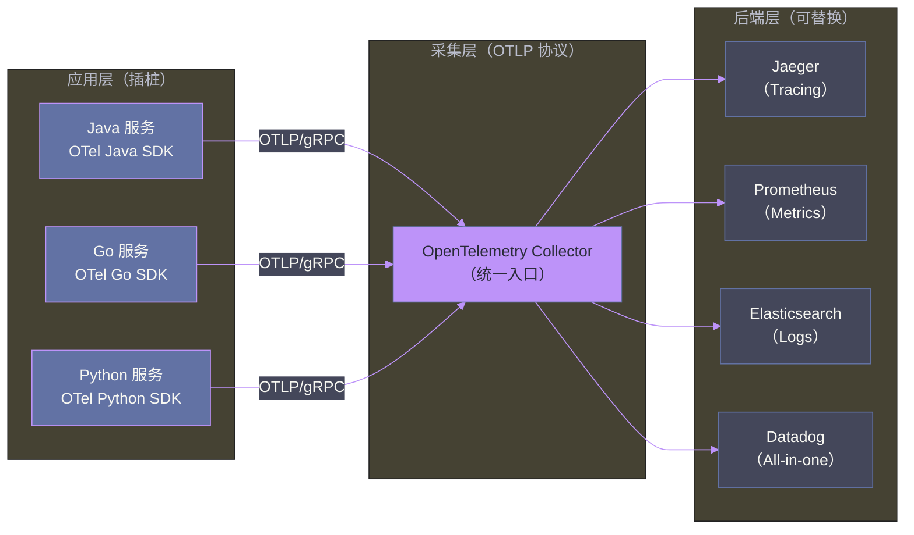

# 可观测性的本质：从监控到认知跃迁

## 摘要

你能说清楚，**监控（Monitoring）和可观测性（Observability）到底有什么本质区别**吗？

很多工程师会回答："可观测性就是监控的升级版，加了 Tracing 和 Log"。这个回答并没有错，但它停留在工具层面，没有触及真正的认知转变。

本文的核心命题是：监控是**已知问题的预警系统**，而可观测性是**未知问题的理解能力**。这不是营销话术，而是两种截然不同的系统设计哲学。监控告诉你"出事了"；可观测性告诉你"为什么出事、哪里出事、影响有多大"。

本文将从历史演进切入，拆解监控在云原生时代的根本性失败，再推导出可观测性的工程定义，最后阐明为什么 [[OpenTelemetry]] 和 [[AIOps]] 是这个演进过程的必然产物。

---

## 第 1 章 监控的黄金时代与它的终结

### 1.1 监控曾经足够好

回到 2000 年代初期，监控是清晰而优雅的。IT 系统由数量有限的物理服务器构成，每台服务器上运行着定义明确的进程。运维工程师的工作很直接：

- 用 [[Nagios]] 或 Zabbix 设置 CPU > 90% 触发告警
- 用 [[JMX]]（Java Management Extension）拉取 Java 进程的 GC 频率和线程池状态
- 在 CMDB（配置管理数据库）中维护服务器清单和服务拓扑
- 接到告警 → 找到服务器 → 看日志 → 重启进程

这套工作流在**静态、可预测、规模受控**的系统中非常有效。告警阈值可以人工设定，系统拓扑可以人工维护，故障排查路径是线性的。

当时最优秀的监控系统，如 HP OpenView、IBM Tivoli，能够将成百上千台服务器的状态汇聚到一个"玻璃上的数据"（Data on Glass）视图中。这是那个时代的技术极限，也是那个时代的足够好。

### 1.2 系统变了，但监控的思想没变

从 2010 年代中期开始，IT 系统经历了一次结构性变革：

- 物理机 → 虚拟机（VMware vSphere），一台物理机跑数十个 VM
- 单体应用 → 微服务，一个电商系统拆成数十到数百个独立服务
- 固定部署 → Kubernetes，Pod 随时创建、销毁、漂移
- 单数据中心 → 混合云（On-Prem + AWS + Azure），流量跨越多个网络边界
- 同步调用 → 异步事件驱动，一次用户操作触发十几个异步事件

变化的结果是**系统拓扑从静态变成了动态，从可预测变成了涌现性的**。一个 Kubernetes 集群中可能运行着几千个 Pod，它们来自几十个不同的团队，使用不同的语言和框架，以异步方式相互通信。

此时，传统监控思想面临三个根本性失败：

**失败一：CMDB 无法跟上动态拓扑**

在 Kubernetes 中，Pod 的 IP 地址每次重启都会变化，服务实例数量根据负载动态扩缩。没有任何人工维护的 CMDB 能跟上这种变化节奏。你不再能依赖"我知道服务 A 在哪台机器上"这个前提。

**失败二：静态阈值在高基数系统中失效**

一个中等规模的微服务系统，每秒产生数十万条 Metric 数据点。为每一个指标手动设置告警阈值，在工程上是不可行的。更深层的问题是：正常情况下 CPU 是 30% 还是 70%，取决于时段、业务流量、Batch Job 是否在跑——**"正常"本身是动态的，静态阈值永远是错的**。

**失败三：告警风暴掩盖根因**

当一个核心数据库变慢时，所有依赖它的服务都会超时。在一个有数百个微服务的系统中，这会在几秒内触发数百条告警。On-call 工程师面对的不是一个清晰的问题，而是一场告警海啸。**监控告诉你哪里都着火，但没有告诉你哪里是起火点**。

> [!warning] 告警风暴是监控哲学的本质缺陷
> 告警风暴不是配置问题，不是因为告警阈值设置得太灵敏。它的根本原因是：监控的设计哲学是"每个组件独立报告自己的状态"，而不是"理解系统整体的因果关系"。一个以因果为中心的可观测性系统，会先识别出"数据库慢是根因"，然后只触发一条高优先级告警，而不是几百条关联告警。


---

## 第 2 章 可观测性的工程定义

### 2.1 从控制论借来的概念

"可观测性"这个词不是 IT 行业发明的，它来自 1960 年代的控制论（Control Theory）。数学家 Rudolf Kálmán 在研究线性动态系统时提出：如果一个系统的**所有内部状态都可以通过其外部输出推断出来**，那么这个系统是"可观测的"（Observable）。

Charity Majors（Honeycomb 联合创始人）在 2016 年前后将这个概念引入软件工程领域，给出了这样的定义：

> 可观测性衡量的是，你能够**仅凭系统的外部输出**，推断出系统内部状态的程度。

这个定义的关键词是**推断内部状态**。监控是"告诉你发生了什么"，可观测性是"让你能够回答任何关于系统的问题——包括那些你事先没有想到要问的问题"。

### 2.2 监控 vs 可观测性：一个思想实验

想象这样一个场景：你的电商系统今天下午 3 点出现了性能下降，用户投诉购物车页面加载很慢。

**用监控系统**，你能看到什么？

- 购物车服务的 CPU 利用率：正常（45%）
- 购物车服务的错误率：正常（0.1%）
- 购物车服务的 P99 响应时间：**升高（800ms，平时 120ms）**
- 数据库的 CPU：正常
- 数据库的连接数：正常

监控告诉你"购物车服务变慢了"，但没有告诉你**为什么**。你不知道是哪个接口慢，是哪个请求慢，是代码里的哪段逻辑慢，是外部依赖的哪个调用慢。接下来，你需要手动登录服务器查日志，手动翻 APM 工具查慢 SQL，这个过程可能需要 30 分钟到几个小时。

**用可观测性系统**，你能做什么？

你可以在系统中发起任意查询，例如：

```
# 找到 P99 > 500ms 的所有请求
filter service="cart" AND duration > 500ms

# 按 endpoint 聚合，找到最慢的接口
group_by endpoint, avg(duration), p99(duration)

# 展开最慢请求的完整 Trace：它调用了哪些服务，每个调用花了多少时间
trace_id = "abc123" → show full trace

# 发现：cart → product-service 这段调用花了 650ms
# 继续展开 product-service 的 Span：它执行了一个 SQL 查询花了 620ms
# SQL 查询语句：SELECT * FROM products WHERE category_id = 5 (无索引)
```

在 3 分钟内，你找到了根因：一个没有索引的 SQL 查询。这就是可观测性的价值：**它让你能够在未知的问题空间中快速导航到根因**。

### 2.3 可观测性的两种能力维度

理解了上面的思想实验，可以把可观测性的核心能力归结为两个维度：



传统监控只覆盖了"被动能力"中的"实时状态感知"，而且依赖人工设置规则。现代可观测性系统覆盖所有四个象限，并且用 AI 驱动被动能力的自动化。


---

## 第 3 章 可观测性的三大支柱与新兴信号

### 3.1 为什么是这三个支柱

可观测性的三大支柱——**Metrics（指标）、Logs（日志）、Traces（链路追踪）**——并不是被某个组织钦定的，它们是在解决实际工程问题的过程中自然形成的。每一种信号解决了其他信号无法解决的特定问题。

> [!info] 三大支柱的互补性
> 这三种信号不是替代关系，而是互补的：Metrics 告诉你**发生了什么**（系统整体状态），Logs 告诉你**发生了什么细节**（每个操作的上下文），Traces 告诉你**为什么发生**（服务间的因果关系）。缺少任何一种，可观测性都是不完整的。

### 3.2 Metrics：系统健康的心电图

**Metrics 是什么**：在某一时间点对系统某一属性进行测量得到的数值，并随时间推移持续采集，形成时间序列数据。例如：每秒请求数（RPS）、CPU 利用率、HTTP 错误率、P99 响应时间、活跃连接数。

**Metrics 为什么有价值**：时间序列数据天然适合做趋势分析（"CPU 在最近一小时内持续上升"）、比较（"今天的请求量比上周同期高 30%"）、聚合运算（"所有购物车服务实例的平均响应时间"）。在低计算开销的前提下，提供系统宏观健康状况的全景视图。

**Metrics 的核心挑战：高基数（High Cardinality）**

高基数是指 Metric 的某个标签（Label/Dimension）拥有大量唯一值。最典型的例子是 `user_id` 或 `order_id`：

```
# 低基数（好的实践）
http_request_duration{service="cart", endpoint="/api/cart", status="200"} 0.12

# 高基数（危险！）
http_request_duration{service="cart", user_id="u_12345678", order_id="o_987654321"} 0.12
```

如果把 `user_id` 作为 Metrics 的标签，一个有百万用户的系统会产生百万个独立的时间序列。这会导致时序数据库（如 [[Prometheus]]、[[VictoriaMetrics]]）的存储和查询性能急剧恶化——这就是著名的"基数爆炸"（Cardinality Explosion）问题。

**正确做法**：高基数的维度（用户 ID、订单 ID、请求 ID）应该放在 Logs 或 Traces 中，而不是 Metrics 中。Metrics 只保留低基数的维度（服务名、Endpoint、状态码、Region）。

### 3.3 Logs：系统行为的完整叙事

**Logs 是什么**：在事件发生时由应用程序或基础设施输出的带时间戳的文本记录。每条日志代表系统中发生的一个具体事件，包含事件的上下文信息。

日志经历了三个演进阶段：

| 阶段 | 形式 | 典型示例 | 问题 |
|------|------|---------|------|
| 非结构化日志 | 自由文本 | `[2024-01-15 14:30:01] ERROR: Connection timeout` | 机器难以解析 |
| 半结构化日志 | 固定前缀 + 自由文本 | `level=error msg="Connection timeout" service=cart` | 字段不一致 |
| 结构化日志（JSON）| 标准 JSON | `{"level":"error","msg":"timeout","service":"cart","duration_ms":5000}` | 推荐做法 |

结构化日志（Structured Logging）的核心价值在于：**所有字段都是可查询的**。你可以查询"所有 `service=cart` 且 `duration_ms > 3000` 的错误日志"，而非在自由文本中做全文搜索。

**Logs 的核心挑战：高吞吐量与噪音**

一个中等规模的微服务系统，每天可能产生数百 GB 到 TB 级别的日志。其中大量是 INFO 级别的"流水账"，对故障排查价值有限，却消耗大量存储和查询资源。

工程上的应对策略：
1. **日志分级策略**：区分 DEBUG（开发环境开启）、INFO（关键业务事件）、WARN（异常但可恢复）、ERROR（需要介入）
2. **采样日志**：对高频的正常请求日志按比例采样（如 1%），只保留所有错误和慢请求日志
3. **延迟日志**（Lazy Logging）：耗资源的日志构建只在日志级别满足时才执行（避免虽然不打印但仍计算日志内容的浪费）

### 3.4 Traces：服务间因果关系的 X 光

**Traces 是什么**：对一次完整请求（或一个业务事务）从开始到结束的全链路追踪记录。一个 Trace 由多个 Span 组成，每个 Span 代表请求链路中的一个处理节点。

```mermaid
%%{init: {"theme": "base", "themeVariables": {"primaryColor": "#282a36", "primaryTextColor": "#f8f8f2", "primaryBorderColor": "#6272a4", "lineColor": "#bd93f9", "secondaryColor": "#44475a"}}}%%
gantt
    title 一次购物车添加请求的 Trace（总耗时 820ms）
    dateFormat  x
    axisFormat  %L ms
    
    section "API Gateway"
    "auth check (12ms)"          :0, 12
    section "Cart Service"
    "deserialize request (5ms)"  :12, 17
    "business logic (8ms)"       :17, 25
    "call Product Service"       :25, 695
    "call Inventory Service"     :695, 780
    "serialize response (40ms)"  :780, 820
    section "Product Service"
    "query DB (648ms!)"          :25, 673
    section "Inventory Service"
    "check stock (75ms)"         :695, 770
```



从这个 Trace 图可以立即看出：总耗时 820ms 中，Product Service 的 DB 查询占了 648ms（79%）。**这就是那个"没有索引的 SQL 查询"问题**——在没有 Tracing 的情况下，找到这个问题需要逐服务逐日志翻查；有了 Tracing，3 秒钟就能锁定根因。

**Traces 的核心挑战：过度插桩与采样**

全链路追踪的代价是：每次请求都需要传递 Trace Context（一个唯一的 Trace ID），每个服务都需要记录 Span 数据并上报给追踪后端。在高 QPS 系统中，100% 的请求全部追踪会产生海量数据，存储和查询成本很高。

应对策略是**智能采样**：
- **头部采样**（Head-based Sampling）：在请求入口决定是否追踪这个请求（简单，但可能丢失重要的低频异常）
- **尾部采样**（Tail-based Sampling）：在请求完成后根据结果决定是否保留（更智能，可以确保所有错误和慢请求都被保留）
- **[[OpenTelemetry]] Collector 的 Tail Sampling Processor** 是目前最常见的工程实现


### 3.5 超越三大支柱：Events、Profiling 与 RUM

三大支柱不是可观测性信号的全部。随着实践的深入，工程师发现有些问题三大支柱都难以有效回答：

**Events（事件）**

Events 是对系统中有意义的离散事件的结构化记录，区别于日志的地方在于：Events 是**主动设计的业务或系统语义事件**，而不是系统运行的流水记录。

典型应用场景：
- 部署事件（`deployment.started`, `deployment.finished`）：与性能 Metrics 叠加，立即看出"部署后响应时间是否升高"
- 功能开关切换事件（`feature_flag.enabled: dark_mode`）：与用户行为指标叠加，评估功能影响
- 业务事件（`order.placed`, `payment.failed`）：将技术可观测性与业务 KPI 直接关联

> [!note] Events 是可观测性与业务指标的桥梁
> 纯技术指标（CPU、响应时间）和业务指标（订单量、转化率）之间存在鸿沟。Events 可以填补这个鸿沟——当技术异常发生时，可以同时查询"是否导致了业务指标下降"，从而快速评估业务影响、确定修复的优先级。

**Profiling（性能剖析）**

当你的服务 CPU 占用率持续偏高，但查看所有 Metrics 和 Logs 都找不到原因时，你需要 Profiling。

Profiling 通过对程序运行时进行**采样式的调用栈快照**，绘制出 CPU 时间（或内存分配）在各个函数调用上的分布，即著名的**火焰图（Flame Graph）**。火焰图让你能直接看到"代码中哪个函数消耗了最多的 CPU 时间"。

```
# 火焰图中发现的典型问题案例
processPayment() → 45% CPU
  └── serializeOrder() → 30% CPU  ← 问题所在！
        └── ObjectMapper.writeValue() → 28% CPU  ← 每次请求都重新创建 ObjectMapper
```

Profiling 回答的问题是"CPU 烧在哪"，这是 Metrics 只能告诉你"CPU 高了"而回答不了的问题。[[持续性能剖析]]（Continuous Profiling）是近年来的趋势，代表工具包括 Pyroscope、Grafana Phlare。

**RUM（Real User Monitoring，真实用户监控）**

RUM 通过在前端（浏览器、移动 App）注入采集脚本，从真实用户的设备角度收集性能数据：页面加载时间（[[Core Web Vitals]]）、JavaScript 错误、用户操作路径、网络延迟。

RUM 与后端可观测性的关键区别：后端监控的是"服务器处理耗时多少"，RUM 监控的是"用户感知到的延迟是多少"。两者有时差异很大——一个在服务器端只需 50ms 的响应，如果 CDN 配置不当，用户可能感知到 2 秒的加载时间。**RUM 是最接近用户体验真相的信号**。


---

## 第 4 章 分布式系统对可观测性的特殊挑战

### 4.1 涌现性故障：1+1 > 2 的复杂度

分布式系统最难处理的故障类型不是某个服务崩溃（这很容易发现），而是**涌现性故障**（Emergent Failures）——每个单独的服务都运行正常，但多个服务组合在一起时，整体行为出现了异常。

典型案例：**慢消费者问题（Slow Consumer）**



在这个场景中：
- 库存服务本身的指标显示"正常"（只是响应慢，没有错误）
- 订单服务的指标显示"正常"（成功率 100%）
- 用户感知到的下单延迟从 200ms 升高到 3200ms

如果没有全链路追踪，这个问题几乎无法快速定位。

### 4.2 共享基础设施的连锁反应

在 Kubernetes 集群中，多个服务共享同一组 Node 资源（CPU、内存、网络带宽、磁盘 IO）。当一个"坏邻居"（Noisy Neighbor）大量消耗 Node 上的资源时，与它共享同一 Node 的其他服务会受到影响。

**可观测性的挑战**：受影响的服务表现为"资源不足导致的性能下降"，但问题的根因在另一个服务（甚至另一个团队的服务）上。没有基础设施层面的细粒度资源监控，这类问题的 MTTR（Mean Time To Recovery）可能长达数小时。

**工程应对**：

1. 为关键服务设置 Kubernetes `resourceQuota` 和 `limitRange`，防止单个服务无限制占用资源
2. 在基础设施 Metrics 中，以 **Pod 为粒度**记录 Node 上的资源使用情况，而不只是 Node 级别的聚合
3. 使用 [[eBPF]] 做内核级的进程间资源归因（后续文章详细介绍）

### 4.3 同步与异步调用的可观测性差异

**同步调用**（HTTP/gRPC）的 Trace 传播相对简单：在 HTTP Header 中注入 `traceparent`，下游服务读取并创建子 Span。整个调用链在一个 Trace 中可见。

**异步调用**（消息队列、事件总线）的 Trace 传播要复杂得多。生产者和消费者在时间上是解耦的——生产者在 T1 发送消息，消费者可能在 T1 + 5 分钟后才处理这条消息。此时，如果消费者创建了一个新的 Trace，就无法将这次处理关联到原始的用户请求。

**正确的异步 Trace 传播方式**：将 Trace Context 作为消息的**元数据（Metadata/Header）**一同发送，消费者读取并以此创建"链接 Span"（Linked Span），从而在逻辑上将异步操作与原始请求关联。

```python
# Kafka 生产者：将 Trace Context 注入消息 Header
producer.send(
    topic="order-events",
    value=order_data,
    headers={
        "traceparent": current_span.trace_context.traceparent,
        "tracestate": current_span.trace_context.tracestate,
    }
)

# Kafka 消费者：从消息 Header 恢复 Trace Context
context = propagator.extract(carrier=message.headers)
with tracer.start_as_current_span("process-order-event", context=context):
    process_order(message.value)
```

这个细节在很多系统中被忽略，导致跨越消息队列的 Trace 链路断裂，可观测性出现盲区。


---

## 第 5 章 标准化：OpenTelemetry 为何是终局

### 5.1 碎片化是可观测性的头号敌人

在 [[OpenTelemetry]]（OTel）出现之前，可观测性工具领域极度碎片化：

- 指标：[[Prometheus]] / StatsD / Graphite / Datadog Agent
- 日志：Log4j / Logback / Fluentd / Filebeat
- 追踪：Jaeger / Zipkin / Dynatrace / New Relic / AppDynamics

每个工具都有自己的 SDK、自己的数据格式、自己的传输协议。一个使用 Datadog 做 APM 的团队，如果想迁移到 Jaeger，需要修改所有服务的插桩代码。**工具和应用之间是强绑定关系**。

更严重的问题是：不同工具产生的数据难以关联。当一个 Prometheus 告警触发时，你需要手动在另一个工具中查找对应时间窗口的日志和 Trace。这种跨工具的手动关联，是告警响应 MTTR 居高不下的重要原因之一。

### 5.2 OpenTelemetry 的设计哲学：关注点分离

[[OpenTelemetry]] 于 2019 年由 OpenCensus 和 OpenTracing 两个项目合并诞生，现在是 CNCF（Cloud Native Computing Foundation）仅次于 Kubernetes 和 Prometheus 的第三活跃项目。

OTel 的核心设计哲学是**关注点分离**：



**插桩层（Instrumentation）** 与 **后端层（Backend）** 通过 **OTLP（OpenTelemetry Protocol）** 完全解耦。你只需要在应用中集成 OTel SDK 一次，就可以随时更换后端工具——从 Jaeger 迁移到 Datadog，不需要修改一行业务代码。

这就是 OTel 的核心价值：**让可观测性的插桩成为一次性投资，而不是每次换工具都要重来的重复成本**。

### 5.3 Prometheus 的特殊地位

[[Prometheus]] 是指标采集领域的事实标准，值得单独说明。它与 OTel 不是竞争关系，而是互补的：

- Prometheus 解决的是"如何高效地存储、查询时间序列 Metrics"
- OTel 解决的是"如何在不同工具间标准化传输 Metrics/Logs/Traces"
- OTel Collector 可以将数据导出为 Prometheus 格式（`prometheus` exporter）

Prometheus 的 Pull 模式（主动拉取）和 OTel Collector 的 Push 模式（主动推送）都有各自的适用场景，在实际系统中常常共存。

> [!warning] 不要把 OTel 当作后端存储
> OpenTelemetry 只是一个**数据采集和传输的标准**，不提供数据存储和查询能力。你仍然需要 Jaeger（Traces）、Prometheus/Thanos（Metrics）、Elasticsearch/Loki（Logs）等后端存储系统。OTel 做的是"数据从应用到后端存储的标准化管道"，而不是"替代后端存储"。


---

## 第 6 章 AIOps：可观测性演进的必然归宿

### 6.1 AIOps 1.0 为什么失败了

2016 年，Gartner 定义"AIOps"（Artificial Intelligence for IT Operations）时，承诺它能"通过机器学习和大数据分析，自动化并增强 IT 运维"。这个承诺激起了巨大热情，数十亿美元涌入 AIOps 工具赛道。

然而，AIOps 1.0 在大多数企业的落地效果令人失望。回顾失败原因，核心问题不是 AI 算法不够好，而是**数据基础不过关**：

- 各工具产生的 Metrics、Logs、Traces 格式不统一，Schema 各异
- 数据存储在孤立的系统中（Prometheus 中的指标，ELK 中的日志，Jaeger 中的 Trace），无法关联
- CMDB 中的拓扑信息手工维护，严重滞后于实际部署状态
- 没有统一的语义层（例如"cart-service"在不同工具中可能有不同的标识符）

AI 算法再好，喂进去的数据是孤立的、不标准的、不完整的，就无法产出有价值的洞察。这是一个**数据工程问题**，而非 AI 算法问题。

### 6.2 AIOps 2.0 的三个前提条件

AIOps 2.0 之所以在 2024-2026 年前后具备了成功的条件，是因为三个基础设施要素终于成熟：

**条件一：OpenTelemetry 统一了数据标准**

OTel 的普及意味着，Metrics、Logs、Traces 拥有了统一的 Schema（`service.name`、`host.name`、`k8s.pod.name` 等 [[Semantic Conventions]]），跨信号的数据关联变成了可能。一个 TraceID 可以同时关联 Trace、Log 中的同一次请求，不再需要手工匹配。

**条件二：Kubernetes 自动维护了拓扑信息**

Kubernetes 的元数据（Pod Labels、Service 定义、Namespace 组织）是动态自动维护的。可观测性平台可以通过 Kubernetes API 实时发现服务拓扑，替代了 AIOps 1.0 时代依赖 CMDB 人工维护的服务地图。

**条件三：LLM 提供了语言理解能力**

大型语言模型（[[LLM]]）让 AIOps 系统能够理解非结构化的日志文本、告警描述、Runbook 文档，并将这些信息与结构化的 Metrics 和 Traces 关联起来。这是 2023 年以前的 AIOps 工具难以做到的。

### 6.3 AIOps 2.0 的能力矩阵

现代 AIOps 能力可以按**自动化程度**分为四个层次：

| 层次 | 能力描述 | 典型工具 | 人工介入程度 |
|------|---------|---------|-----------|
| L1 自动检测 | 动态基线 + 异常检测（替代静态阈值）| Dynatrace, Datadog Watchdog | 低（仍需人工判断是否是真问题）|
| L2 自动关联 | 将相关告警聚合，识别共同根因 | [[Prometheus]] AlertManager + AI | 中（人工确认根因，执行修复）|
| L3 自动诊断 | 生成 RCA 报告，提供修复建议 | AI + Runbook 知识库 | 中低（人工审批后执行）|
| L4 自动修复 | 根据根因自动触发修复动作（如重启、扩容）| Agentic AI + GitOps | 极低（仅在高置信度场景）|

> [!note] 大多数团队的目标是 L2-L3
> L4 自动修复需要极高的信任度和严格的安全控制。大多数工程团队的现实目标是 L2-L3：让 AI 帮助聚合告警、定位根因、生成修复建议，但最终的修复动作仍由人工执行。**AI 是决策加速器，而不是决策替代者**——这是现阶段最务实的定位。

---

## 第 7 章 可观测性的价值证明

### 7.1 四大可量化的业务指标

可观测性的投入需要向管理层证明 ROI。以下四个指标是最常用的量化依据：

**MTTR（Mean Time To Recovery，平均修复时间）**

这是可观测性最直接可量化的价值。通过对比引入可观测性前后的 MTTR，可以用真实数据说明价值。典型案例：引入全链路追踪后，某团队的 P1 故障 MTTR 从 4 小时降低到 45 分钟（降低 81%）。

**告警噪音率降低**

告警噪音（Noise）是指在真实故障期间，触发的与根因无关的告警数量占总告警数量的比例。AIOps 的告警聚合能力通常能将告警噪音率从 80-90%（一次故障触发数百条告警）降低到 20-30%（只有少数高质量告警）。

**工程师 On-call 体验**

虽然这是软性指标，但工程师的职业满意度和离职率与 On-call 体验高度相关。一个因告警风暴而每周被唤醒 5 次的工程师，和一个每周只收到 2 次高质量告警的工程师，其工作体验和生产效率差异巨大。

**成本优化**

可观测性数据是资源优化决策的依据。通过分析 Metrics，可以识别：
- 长期 CPU 使用率 < 10% 的"过度预留"服务（缩容潜力）
- 内存泄漏导致的 OOM 定期重启（修复可降低 Pod 数量需求）
- 低效的数据库查询（优化后减少 DB 实例需求）

### 7.2 可观测性成熟度模型

组织的可观测性能力不是非 0 即 1 的，而是渐进成熟的。以下是一个实用的五级成熟度模型：

| 级别 | 名称 | 核心特征 | 典型问题 |
|------|------|---------|---------|
| L0 | 黑盒运维 | 只有基础系统监控（CPU/内存）| 故障靠用户投诉发现 |
| L1 | 指标覆盖 | 应用级 Metrics，静态告警阈值 | 告警风暴，误报率高 |
| L2 | 日志分析 | 结构化日志，集中式日志平台 | 缺乏请求级上下文 |
| L3 | 链路追踪 | 全链路 Tracing，请求级根因定位 | 多工具数据孤立 |
| L4 | 统一可观测性 | OTel 标准化，信号关联，AIOps 告警聚合 | 仍以人工响应为主 |
| L5 | 智能运维 | AIOps 自动诊断，Agentic AI 辅助修复 | — |

绝大多数企业处于 L1-L2 级别。实践中，从 L2 升级到 L3（全链路追踪）通常是可观测性价值提升最显著的一步，也是 MTTR 降低最多的阶段。

---

## 总结

本文从历史演进重新定义了"可观测性"：它不是监控的升级版工具，而是一种全新的系统理解能力——**对未知问题的探索能力**，而非已知问题的预警机制。

核心结论：

1. **监控在动态分布式系统中存在根本性的失效**：静态阈值、CMDB 维护、告警风暴，都是工具层面的症状，根本原因是监控的设计哲学不适配云原生时代
2. **三大支柱（Metrics/Logs/Traces）是互补的**，缺少任何一种都会留下可观测盲区；Events、Profiling、RUM 覆盖了三大支柱的边界场景
3. **OpenTelemetry 是数据基础的标准化解决方案**，它的意义不是"一个新工具"，而是"让可观测性插桩成为一次性投资"
4. **AIOps 2.0 的成功条件已经成熟**：OTel 统一数据标准 + Kubernetes 自动维护拓扑 + LLM 提供语言理解能力，三者共同构成了 AIOps 真正落地的基础

在下一篇文章中，我们将深入每一种可观测性信号的技术细节，探讨三大支柱在工程实践中的选型、采样策略和高可用架构。

---
*本文是「AIOps 与可观测性实战专栏」系列第 1 篇。[[00 专栏导览]] | [[02 可观测性三大支柱深度解析：Metrics、Logs 与 Traces]] →*
