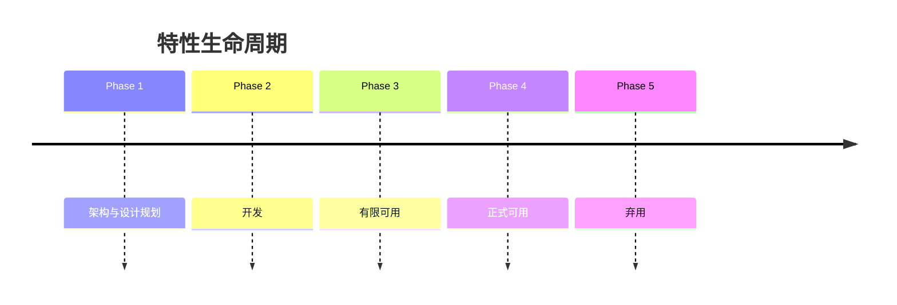

# 第二章：从DevOps到站点可靠性工程

## 引言

过去几年中，IT世界发生了巨大变化。为了实现更快速、更高质量的软件发布，业界实施了新的方法和实践。DevOps 和[[站点可靠性工程]]（Site Reliability Engineering，SRE）是其中两种备受关注的方法。这两种方法的目标都是帮助组织快速且准确地交付软件，但它们达成目标所采取的步骤有所不同。DevOps 是一套旨在帮助开发团队和管理团队更好地协作的实践，主要关注自动化软件发布流水线以及促进团队间协作。而 SRE 则是一个将软件工程概念应用于运维领域，以构建可扩展和可靠系统的学科。SRE 团队的工作是确保系统可靠、可用且能够增长。

在本章中，我们将审视 DevOps 和 SRE 角色之间的差异，以及它们如何演变以满足高性能 SRE 的需求。我们将讨论 DevOps 团队面临的问题，以及 SRE 角色如何帮助解决其中的一些问题。我们还将从理念和实践层面探讨 SRE 与 DevOps 的区别。此外，我们将讨论让 DevOps 和 SRE 团队协同工作的利弊，以及其中的好处。我们还将探讨 SRE 在高性能 SRE 中的作用，以及它如何帮助实现软件的持续发布、事件响应和持续改进。

最终，本章旨在帮助你理解 DevOps 角色的演变过程，以及它如何发展成为 SRE 角色。我们将讨论这些团队协作为实现高性能 SRE 的重要性，以及这对组织所带来的益处。

## 本章结构

在本章中，我们将涵盖以下主题：

- 从 DevOps 到站点可靠性工程
- 站点可靠性工程的必要性
- 站点可靠性工程参与模型
- 站点可靠性工程策略采纳
- 站点可靠性工程挑战
- 站点可靠性工程最佳实践
- 站点可靠性工程最佳实践工具

## 学习目标

本章将讨论 SRE 团队在构建可靠系统、通过增强信任和可靠性来扩大业务规模方面所做的贡献。我们将探讨 SRE 团队如何与拥有应用所有权的应用团队进行协作。尽管 SRE 的参与通常围绕一个或多个服务展开，但它所涉及的内容远不止其关注的服务本身。

在理解了应用的各个要点后，开发者可以找到支持它们的最佳方式。通过本章的学习，读者将能够理解 SRE 在[[软件开发生命周期]]（Software Development Life Cycle，SDLC）的每个阶段所承担的责任。

## 从DevOps到站点可靠性工程

DevOps 和 SRE 是两种互补的软件开发和运维方法，旨在提升软件系统的有效性、可靠性和整体质量。这两种方法的目标都是弥合开发团队与运维团队之间的鸿沟，以改善协作并简化流程。我们将在本章后面进一步讨论这些区别及常见的方法。

DevOps 是一套强调 IT 运维与软件开发之间沟通、协作和自动化的实践。它将软件开发（Dev）与 IT 运维（Ops）相结合，以确保软件交付速度更快、缺陷更少，并且对故障具有更强的弹性。DevOps 原则强调[[持续集成]]、[[持续交付]]和[[持续部署]]，使团队能够响应不断变化的需求并进行快速迭代。

SRE 由 Google 首创，是一种将软件工程原理应用于运维领域的方法。SRE（站点可靠性工程师）的任务是开发和维护支撑软件应用的基础设施。他们使用自动化、监控和其他工具来确保系统的高可用性、可扩展性和性能。SRE 还负责设定[[服务等级目标]]（Service Level Objectives，SLOs）和[[服务等级指标]]（Service Level Indicators，SLIs），以评估系统的性能和可靠性。SRE 强调将软件工程原理应用于基础设施管理，而 DevOps 则侧重于开发团队与运维团队之间的协作。这两种方法高度互补，SRE 通常被视为 DevOps 的延伸，SRE 充当专门的运维工程师，将他们的软件工程知识应用于运维挑战。DevOps 和 SRE 共同为构建更可靠、更有效、更敏捷的软件系统做出了贡献。

要成为一名具备市场竞争力的 SRE，关键在于打下坚实的基础，包括计算机科学、编程技能、云平台、[[基础设施即代码]]（Infrastructure as Code，IaC）管理、[[监控与可观测性]]、事件管理、[[持续集成与持续部署]]（Continuous Integration and Continuous Deployment，CI/CD）流水线、Linux/Unix 系统，以及 SRE 的原则和实践。

## 站点可靠性工程的必要性

在软件行业，停机和服务中断可能会带来重大的财务和声誉损失。SRE 正是在此发挥作用。SRE 团队保证系统和服务的可靠性、可扩展性和高效性，以最大限度地减少停机时间和中断。SRE 使用软件工程实践来解决运维问题并实现流程自动化。他们对系统可靠性采取主动方法，有助于预防和缓解服务中断，从而整体提升客户体验。随着软件系统变得越来越复杂，对 SRE 的需求也在增加，因为他们能够帮助企业满足客户需求、提升服务交付质量，并实现高性能 SRE。

## 站点可靠性工程团队结构

本质上，SRE 是开发与运维的结合。人们经常将 SRE 和 DevOps 混淆。虽然两者在理论上存在重叠，但 DevOps 是理论框架，而 SRE 是实践执行。

以下七项指导原则可帮助任何企业在其组织内采用站点可靠性工程：

1.  **从小处着手，内部先行**：你的业务很可能受益于拥有一个 SRE 团队，即使不需要一个专门的部门。通过告警生成、事件调查、根本原因解决和事件事后复盘，站点可靠性管理有助于保持在线服务的可用性和稳定性。
    即便是最稳定的 IT 公司，偶尔也必须处理一两个问题。过去，当软件或服务出现问题时，运维和开发团队会共同合作寻找解决方案。而在 SRE 策略中，两者合为一体。如果从 SRE 开始，你可以从运维和技术团队中组建一个小团队，并赋予他们某个服务运行时间的所有权。

2.  **寻找合适的候选人**：在准备进行规模扩展的情况下，你可能最终需要招聘额外的站点可靠性工程人员。
    知道你在寻找什么，是为你 SRE 团队找到合适人员的关键。以下是站点可靠性工程师应具备的一些资质：
    -   **问题解决与故障排查能力**：SRE 团队主要处理软件事件和问题。通常，这些问题与他们未开发的系统或程序有关。因此，能够在不深入了解系统的情况下快速调试是一项基本技能。
    -   **自动化天赋**：在许多技术型服务中，人力劳动通常是一个主要问题。理想的站点可靠性工程师会寻找方法将繁琐的任务自动化，最大限度地减少人工劳动，使开发者能够专注于高优先级的问题。
    -   **持续学习**：随着系统的发展，问题也会变化。因此，有效的 SRE 必须持续更新他们对不断演变的系统、代码和流程的理解。
    -   **团队合作**：响应事件很少是单打独斗的工作，因此 SRE 必须擅长与他人协作。协作与沟通是需要寻找的基本技能。
    -   **全局视角**：在解决问题时，如果身陷其中，很容易被错误的事情所困扰。因此，有效的 SRE 必须具备看到全局的能力，并在更广泛的背景下制定解决方案。一个称职的站点可靠性工程师会识别根本原因，并制定一个全面的补救措施。

3.  **建立全面的事件管理系统**：事件管理是站点可靠性工程中最关键的部分之一。在 Catchpoint 进行的一项调查中，49% 的受访者表示他们在过去一周左右时间里处理过事件。在处理情况时，必须有一个机制来保持调试和维护过程尽可能高效。
    跟踪值班责任是事件管理系统中最关键的部分之一。如果没有有效的方法来控制值班事件的流量，SRE 团队的职责可能会变得非常繁重。

4.  **定义你的 SLO**：通过设定服务等级目标，SRE 团队可以增加成功的机会。SLO，即服务等级目标，是衡量站点成功的主要指标。SLO 可能会根据公司提供的服务性质而改变。对于每个面向用户的服务系统，都应该使用三个指标：可用性、延迟和吞吐量。在基于存储的系统中，延迟、可用性和持久性往往被赋予更高的权重。
    在制定 SLO 时，重要的是确立组织希望在指标方面维护的值。你的 SLO 应显示系统必须达到的绝对最低性能标准。不要将 SLO 建立在现有性能的基础上，这可能会让你设下无法实现的目标，而是尝试从零开始。尽量减少目标中的绝对性。保持最少数量的 SLO，并专注于对你的组织至关重要的指标。

5.  **接受失败是常态**：大多数人不喜欢失败，但如果你的公司希望保持一个健康有效的 SRE 团队，每个成员都必须适应将失败视为工作的一部分。在任何系统中，尤其是在开发的早期阶段，完美都是罕见的。
    许多 SRE 团队最初将标准设定得过高，错误地设定了不现实的 SLO 定义和目标。最好的运维策略始终是追求一个最小可行产品（MVP），并随着团队和组织建立信心而逐步放宽标准。

6.  **事件事后复盘/根本原因分析**：有句老话说，死人不会说话。然而，对于系统事件而言，情况并非如此。即使问题得到解决，从事件中也有很多可学习之处。因此，对于 SRE 团队来说，进行事件事后复盘以从错误中学习是一种最佳实践。一个合适的 SRE 策略会整合最佳的事后复盘流程。
    站点可靠性人员在执行事后分析或[[根本原因分析]]（Root Cause Analysis，RCA）时，必须评估特定的参数。首先，他们应该调查故障的原因和触发因素。是什么导致了系统故障？然后，团队应该尽可能多地识别出后果。系统故障造成了什么影响？例如，一个支付网关问题可能导致已付款或已收款出现差异，如果即使只有几天未解决，这也可能令人沮丧。一个成功的复盘还应考虑潜在的解决方案和预防类似错误的建议。

7.  **保持事件管理系统简单**：仅仅采用 SRE 团队结构并不足以保证团队成功，还必须有一个项目和事件管理结构。服务

# 2. 从DevOps到站点可靠性工程

如今，[[SRE]]团队可用的IT管理软件用例多种多样。团队领导应考虑其使用复杂度、可用的集成数量、沟通难度以及团队协作的有效性。

## 站点可靠性工程规范

每个[[SRE]]团队成员负责系统维护、事件管理、自动化和[[混沌工程]]的某些方面。团队成员的行为如果提高系统的稳定性和可访问性就是可接受的，任何不直接增加利润的事情都不相关。招聘时，某些公司如谷歌更看重候选人对SRE文化的契合度以及其特定技能的丰富性和帮助性。入职后，新成员通常会被分配到能最大化利用其专业知识的团队。

SRE必须遵循流程和程序，需要定期检查和更新以确保最佳性能。程序必须在首次值班之前完成。每种可能收到的告警都有自己的运行手册（常称为剧本），其中包含高层次的响应指导。

SRE不仅因其才智、创造力和能力而被寻求，还因其对大规模分布式系统的热情和兴趣。以下领域的技术专长对SRE团队是优势，前提是个人渴望学习和进一步培养技能。首次值班前需要学习和掌握的事项清单，来自《站点可靠性工作手册》（Google）包含以下内容：

- 管理生产任务
- 理解调试信息
- 将流量从集群移出
- 回滚错误的软件推送
- 阻止或限制不需要的流量
- 增加额外的服务容量
- 使用监控系统（用于告警和仪表板）
- 描述服务的架构、各种组件和依赖关系

## 未言明的承诺

此职位伴随特定的职责。这些也可称为未言明的责任。如果一个人愿意提前掌握几件事，就能变得非常高效。具体如下：

### 共享业务目标
要帮助某人，必须先了解其需求。因此，SRE必须了解产品开发者希望通过SRE参与达成什么目标。在与发展团队互动之前，SRE应花时间了解产品和公司目标。SRE必须解释自己做什么以及他们的参与如何帮助开发者实现目标。团队之间应经常讨论业务优先级。理想情况下，SRE和开发者领导团队应协同工作，定期开会讨论技术和优先级问题。SRE高管成为产品开发管理团队不可或缺成员的情况并不少见。

### 对齐目标
开发和运维团队关注特性、发布速度、可扩展性和效率。而SRE受不同的激励机制驱动，即优先考虑服务的可持续性而非引入新功能。我们发现，最高效的开发者和SRE团队通过持续在自己专业领域内工作的同时公开支持对方的目标来取得平衡。SRE可以确保所有批准的发布成功，同时帮助开发者团队的发布速度。在此语境中，“安全”通常意味着保持在错误预算内，因此SRE可能会说：“我们支持你在安全的范围内尽可能快速地发布。”作为回应，开发者应承诺将大量工程时间用于解决和预防损害可靠性的问题，例如修正持续服务的设计和实现级问题、消除技术债务，并在新特性开发早期让SRE参与，使其能对设计讨论提供输入。

### 识别风险
凭借其专业知识，站点可靠性工程团队能识别任何潜在威胁。打乱正常开发和特性流程的成本对于产品及其工程师而言都很高。因此，准确获取这些风险的可能性和潜在影响至关重要。

### 准备和行动
SRE团队实现目标和产品目标、优化运营、节省运营成本的能力取决于其规划和协调行动的能力。我们提出两级规划方法：

- **根据开发者输入优先处理产品和服务并分享年度计划**：目标（季度或其他）应基于路线图制定，并经常审查以确保一致性以获得最佳结果。
- **根据错误预算重新评估优先级**：为有效设定优先级，团队必须掌握制定明确定义的[[SLO]]的精妙艺术。如果服务有违反SLO的风险或已耗尽错误预算，为了将其拉回安全区，任何团队都可以立即以最高优先级处理。他们可以采取短期行动（如过度配置以解决峰值流量引起的性能回归）或长期行动（如实施战略性软件补丁/热修复）来应对问题。

如果某个服务已经很好地运行在SLO范围内且有大量剩余错误预算，我们建议将剩余预算用于增加特性发布速度，而不是过度关注服务改进。

## 站点可靠性工程参与模型

谷歌的[[SRE]]团队很好地解释了其SRE参与模型。假设你处于一个现有服务众多且处于不同完成阶段的环境中，那么你的SRE团队可能会花费大量时间处理排好优先级的入队服务，直到团队完成最高价值目标的承担。在软件工程中，缺陷发现得越早，修复得越快、成本越低。SRE团队咨询越早发生，服务就越好越快。当SRE早期参与设计阶段时，入队时间会缩短，服务更可靠，通常是因为我们不必解开不充分的设计或实现。在本章后续部分，我们将努力理解在应用程序开发的各个阶段让SRE团队参与的最有效技术以及如何以最佳方式实施。我们将讨论的模型由谷歌SRE团队明确定义，并在谷歌SRE书中结构化呈现。

## 站点可靠性工程实践DevOps

[[SRE]]和[[DevOps]]密切相关，它们都朝着相同的目标努力。然而，SRE对系统的视角与传统的DevOps思维模式不同。

在理解组织对SRE的需求之后，建立最佳团队结构至关重要。过去几年，根据组织结构的需求，我们看到了不少结构。在决定团队结构之前，先问：为什么组织需要SRE？你对专门资源的期望是什么？你想解决什么问题？SRE在服务生命周期中的理想参与程度如图2.1所示。不过，SRE团队可以随时开始为一个服务工作。例如，如果开发团队正在为SRE支持的服务开发替代品，SRE可能在新服务的规划阶段就参与进来。

另一方面，一个服务可能在其面向公众开放一段时间后才正式引入SRE团队，此时它正面临可靠性或扩展问题。本节提供指导，帮助SRE团队在整个过程中有效贡献。下图来自谷歌SRE书籍，请参考下图：

**图2.1：特性生命周期**

### 阶段1：架构与设计规划
SRE在软件开发生命周期的架构与设计规划阶段至关重要。SRE与开发者合作构建可靠且可扩展的系统与应用程序。他们帮助构建系统架构以管理预期的流量和使用。SRE还识别并缓解潜在故障点，以减少宕机和服务中断。这种主动的系统设计和规划降低了软件故障概率并改善了用户体验。主要职责包括：

- SRE可以影响软件系统的架构和设计。
- 创建最佳实践，如单点故障韧性，供开发者团队在设计新产品时使用。
- 记录基础设施系统的“可做与不可做”（基于经验），使开发者能够智能选择、正确避免已知问题。
- 早期参与咨询，讨论架构和设计选择，并通过有针对性的原型验证假设。
- 参与开发者团队。
- 服务协同设计。
在开发后期，架构缺陷更难修复。当系统与真实用户交互并需要扩展时，早期SRE参与有助于避免代价高昂的重新设计。

### 阶段2：开发
在开发期间，SRE可能开始将服务生产化或为部署做准备，以确保其具备上线条件。容量规划、冗余资源配置、峰值和过载处理策略、负载均衡实施，以及建立长期运营流程（包括监控、告警和性能调优）都是将应用投入生产的常见组成部分。

### 阶段3：有限可用
随着服务接近测试版，用户、用例、使用强度、可用性和性能期望均会上升。SRE可以在这一层级评估可靠性。我们建议在正式可用之前制定[[SLO]]，以便服务团队可以客观地监控可靠性。产品团队可以撤回不可靠的产品。在此阶段，SRE团队可以通过建立容量模型、获取上线资源以及自动化转交和服务扩展来帮助扩展系统。SRE可以提供充分的监控覆盖并创建匹配SLO的告警。由于服务使用仍在演变，SRE团队可能需要更多的事件响应和运营工作，因为他们了解服务如何运行以及如何管理其故障模式。开发者和SRE应在此方面合作。这样，开发者团队和SRE都能获得服务经验。运营工作和事件管理将在正式可用之前为系统更新提供信息。

### 阶段4：正式可用
服务已通过生产就绪审查，并接受所有用户。尽管SRE处理大部分运营职责，开发者团队应处理一小部分以保持视角。他们可能永久安排一名开发者参与值班轮换来监控负载，或让不同人员轮流轮换以提供预期体验。

随着开发者团队专注于服务成熟和引入新特性，他们也必须在真实需求下监控系统参数。在最后阶段，应用上线后，开发者团队添加微小增量特性和修复。

### 阶段5：弃用
万物皆有始终，最好的系统也不例外。当更好的替代方案可用时，当前系统对新用户关闭，所有工程资源用于促进现有客户的迁移。尽管开发者团队不直接参与日常运营，但SRE在迁移期间运行系统并提供运营和开发支持。虽然SRE在维护

# 2. 从DevOps到站点可靠性工程

当前系统，SRE 正在支持两个完整的系统。必须相应地重新平衡预算和人员配置。你看到并连接过去与现在。你是决策者，你的责任是成功带领公司完成转型。使新工具成为文化固定部分并激发范式转变，需要的不仅仅是习惯几个额外的控制。

## 阶段6：已废弃（Abandoned）

一旦服务被停用，开发团队通常会恢复提供运营支持。SRE 在尽最大努力的基础上支持服务事件，系统在一段时间后退出市场。

## 阶段7：不再支持（Unsupported）

由于没有活跃用户，服务器不再接受新连接。SRE 参与从生产环境和文档中移除对该服务的引用的过程。

主要职责如下图所示：

**图2.2：SRE 参与模型（SRE engagement model）**

---

## 站点可靠性工程策略采用（Site reliability engineering strategy adoption）

许多人仅将 SRE 视为问题的解决方案，而非公司的总体战略。组织必须确定 SRE 如何融入其现有流程和组织结构，然后相应修改 Google SRE 模型。

让我们看一下构成成功计划的一些基础要素：

### 可靠性的成本（Cost of reliability）

要踏上 SRE 之路，必须接受完全可靠性是虚构的，服务中断不可避免。SRE 的理念是为系统不可避免的故障做好准备，同时记住这些事故不必造成严重后果。构建具有快速可靠故障恢复能力的容错系统是可能的。激活 SRE 后，管理公司技术成本会上升。即便如此，你可以放心，尽管存在网络、基础设施或 API 故障，你的软件仍将继续正常运行，从而降低重大崩溃的可能性。

### 获得公司支持（Securing company support）

采用 SRE 策略对任何公司都是至关重要的第一步。可能需要对公司内部进行各种调整，以成功实施 SRE 策略。因此，赢得公司上下利益相关者的支持至关重要，这有助于建立适当的结构并分配适当的资源。由于系统可观测性在 SRE 范式中的突出地位，当你为团队提供全面的审计日志和追踪时，他们也会更加负责。观测数据的能力对于发现网络安全问题和提高软件效率至关重要。

### 服务等级协议（Service-level agreements）

获得公司认可后，决定要跟踪哪些关键绩效指标（KPI）以及可接受的故障率。服务等级是一个度量，服务等级指标（SLI）捕获服务等级值的范围。服务等级目标（SLO）捕获这些服务等级的目标值。

### 文档完善（Document well）

可以肯定的是，可观测性和自动化是有帮助的，但它们还不够。最终，人的眼睛会检查代码中的错误。对于 SRE 代码库，也由人类负责维护。因此，在 SRE 的适当文档上投入资金是有帮助的，包括入职文档、技术栈、架构、流程图等。此外，记录常见故障情况下的操作说明将大有裨益。

除了技术文档外，组织还应该有透明的文档，概述每个职能的职责，以及网络安全、合规性和审计等主题的流程。在某些情况下，停机一小时与几分钟之间的差异可以归因于文档的质量。然而，尽一切努力限制停机时间至关重要。

### 逐步提升可靠性（Enhance reliability gradually）

快速引入一套新的工具和流程并不会带来可靠的系统。相反，理想情况下，它应该是一个经过深思熟虑、增量式的过程，在冲刺中逐步进行。在为应用程序建立可观测性之后，让自动化发挥作用，这样你就可以将注意力转向改进和新的尝试。切勿将服务和值班时间与常规工作时间混为一谈。当 SRE 流程成熟后，是时候开始整合服务并寻找使用 SRE 的新方法了。

### 自动化至关重要（Automation is vital）

自动化驱动 SRE，使工程师能够专注于主观和创造性的问题解决，同时工具观测应用程序以帮助他们更好地完成工作。自动化至关重要，但你还需要公司的认可。自动化可以极大地提高性能和降低成本；如果配置得当，人力无法像服务器那样扩展。

### 评估你的 SRE 成熟度（Assess your SRE maturity）

最后，在制定 SRE 策略后，你必须监控实施进度并定期评估进展情况。SRE 的成功需要时间才能到来。你不应试图立即达到五个九的可用性和可靠性；相反，应逐步构建你的 SRE 设置，考虑不断变化的业务需求、技术栈、更好的支持文档以及对最终用户体验的更深刻认识。

---

## 站点可靠性工程挑战（Site reliability engineering challenges）

SRE 应对这些挑战的一种方式是实施 DevOps 原则和实践。DevOps 强调开发和运营团队之间的协作与沟通，而 SRE 在这种协作中扮演关键角色。通过与开发团队紧密合作，确保代码在开发时就考虑到可靠性和可扩展性，SRE 有助于弥合开发和运营之间的鸿沟。此外，SRE 帮助开发和实施自动化测试与部署流程，这是 DevOps 的关键组成部分。通过利用 DevOps 原则和实践，SRE 可以提高系统可靠性和效率，同时确保新功能和更新能够快速交付且最小化中断。以下列出了一些挑战：

### 缺乏足够合格的 SRE 工程师（Lack of sufficiently qualified SRE engineers）

你已经组建了一个核心团队，致力于实施 SRE 并认同其价值。这个团队可能由工程、运营或 DevOps 团队的成员组成，甚至是一个成熟的 SRE 团队。这是一个很棒的开端，但你需要提防未能获得其他团队的足够支持。我们看到有几家公司只为整个组织分配了一两名 SRE 工程师，这已被证明是不够的。SRE 要成功，需要来自运营、工程和产品的支持。在处理高严重性的生产问题时，让开发团队、第一联系人和合适的 SRE 参与很重要。熟练 SRE 的短缺可能导致更高的价格、系统更新和变更的更长交付周期，以及系统可靠性和性能的下降。因此，组织必须专注于培训和培养现有员工队伍，并与学术机构合作培养未来的 SRE 人才。

### 根本原因分析（RCA）无人跟进（RCA left unattended）

你的组织有纪律，在每个事件后都进行事后剖析。但由于准备 RCA 报告非常耗时，许多团队并未走到这一步。如果你的团队无法编写带有时间戳和重要事件的详尽事后剖析，你可能需要自动化此过程。假设你已经避免了这一错误，下一个关键问题是：事后剖析写出来了，但之后无人审阅。如果首次处理不当，事件可能会重复发生。此外，每次回顾中吸取的教训深度和内容不一致且不充分。通常，一个事件至少会改变响应团队的一种观点。通常，这些障碍源于 RCA 的结构化不足。这个 RCA 可以在之后被审查。一些常用的问题如下：中断持续了多久？多少客户受到影响？我们的哪个监控工具检测到了这个问题？我们的自动化测试检测到了这个问题吗？灾难恢复解决方案多久才生效？这会影响带有行动项目的事后剖析，从而实现最优优先级排序和有意义的讨论。

### SLO 不是额外奖励（SLO is not a bonus）

尽管 SRE 取得了初步成功，团队仍经常陷入下一个陷阱。通过实施 SRE 的基础，你可以更好地响应事件，并使用调查报告从中学习。然而，如果 SLO 被视为事后想法而非学科的基础，SRE 的进展将会停滞。尽管 SLO 受到的批评比 SLA 少，但如果 SLO 过于笼统、难以实施或无法衡量，它们也会引发问题。让工程师感到困惑的 SLO 是易于理解的。与 SLA 一样，SLO 应始终考虑到诸如客户端延迟等问题；只有最重要的指标才应考虑用于 SLO 状态，并且目标应以直白的语言陈述。

### 流程过于复杂（Complicated processes）

你的复杂流程导致响应事件的时间更长。如果你的事件响应流程引用了大量文档和剧本，那太多了。研究（如多页 Confluence 文档）已经表明，当人们处于压力下时，他们应该执行最简单的任务。对于你的公司必须处理的大问题也是如此。在压力下，即使是最佳的书面流程文档也无法遵循。然而，对于复杂的任务和团队活动，仅靠单个检查清单是不够的。在最成功的 SRE 实施中，会使用检查清单，但针对每个角色进行了调整。最好的系统知道如何在正确的时间显示正确的信息和详细程度，同时尽可能保持任务简洁。当审视整个系统时，检查清单上的每个项目都可以衡量其效果如何，以便将来改进。请参考下图：

**图2.3：通往最终成功的实际路径（Actual view of the path to final success）**

组建一个新的 SRE 团队并确保组织拥有正确的标准和目标是很困难的。要达到你想要的状态需要付出大量努力。图2.3展示了人们对软件发布的看法以及实际情况。

---

## 站点可靠性工程最佳实践（Site reliability engineering best practices）

站点可靠性工程最佳实践如下：

-   从概念和设计阶段开始，贯穿实施、运营和持续改进，积极参与并促进服务开发的整体进展
-   在服务上线前提供帮助和支持，包括系统设计咨询、软件框架和平台开发、容量规划执行以及全面的上线评估执行
-   通过定期监控和评估可用性、延迟和整体状况，确保持续支持运营服务
-   通过实施自动化和引入提高速度和可靠性的变革举措，实现可持续的系统扩展
-   强制执行可持续的事件响应协议，并开展公正的事后剖析调查，目的是吸取教训并改进未来流程

## 站点可靠性工程最佳实践工具（Site reliability engineering best practices tools）

SRE 在任何时候使用的工具将取决于组织在 SRE 旅程中所处的阶段；因此，在开发 SRE 工具链时，选择正确的工具时考虑这一点很重要。与更成熟的企业相比，刚踏上 SRE 路径的组织更有可能使用小众的运营工具。尽管如此，SRE 团队会尝试新事物并修改现有技术，因为他们正在寻找更好、更高效的方法，以

# 2. 从DevOps到站点可靠性工程

...（接上文，此部分讲述工具选型）

...在开发SRE工具链时选择合适的工具。相比于更成熟的企业，刚踏上SRE道路的组织更倾向于使用小众运维工具。尽管如此，SRE团队仍会尝试新事物并改造现有技术，以寻找更好、更有效的方法来提高全面的可靠性。工具解释如下：

### 版本控制工具

- **Git**: Git 是一款免费开源的分布式版本管理系统，被广泛使用。各种规模的组织通常采用 Git 来保持其源代码的更新，并将其存储在 GitHub 上。
- **Bitbucket**: Bitbucket 是 Atlassian 旗下基于 Web 的版本控制仓库托管服务，主要用于源代码和开发项目。它提供 Git 仓库，并为团队提供协作、管理和跟踪代码库的平台。Bitbucket 具备拉取请求、分支权限、内联评论等功能，支持无缝的代码审查与协作。与 Jira、Trello、Bamboo 等流行工具的集成可简化工作流，而其内置的 CI/CD 能力有助于自动化部署过程。Bitbucket 适用于各种规模的团队，提供基于云和自托管两种解决方案。

### CI/CD 工具

- Jenkins
- CircleCI
- GoCD
- GitLab CI
- Bamboo
- Semaphore
- Codeship

### 数据存储工具

- MySQL
- PostgreSQL
- MongoDB
- Apache Hive
- Apache Hadoop
- Solr
- Firebird
- Apache Cassandra
- Redis

### 配置管理工具

- Ansible
- Chef
- Puppet
- Terraform
- SaltStack

### 编排工具

- Docker
- Kubernetes
- Swarm
- Podman
- Apache Mesos

### 日志聚合工具

- Splunk
- Fluentd
- Sentry
- Graylog
- Logstash
- Elasticsearch, Logstash, Kibana（ELK）

### 监控与可观测性工具

- Datadog
- Prometheus
- Splunk Dashboard
- InfluxDB
- Sensu Go

### 应用性能监控（APM）工具

- Dynatrace
- New Relic
- AppDynamics
- Stackify

### 仪表盘工具

- Power BI
- Grafana
- Metabase
- Redash
- Stashboard

### 事件管理工具

- PagerDuty
- xMatters
- Opsgenie
- Squadcast

## 结论

从DevOps到SRE的过渡代表了软件开发和基础设施管理中的一个演进阶段。本章展示了SRE如何在DevOps核心原则（强调协作、自动化和持续改进）的基础上，通过提供更专注、可衡量的方法来交付可靠、高性能的系统。通过运用SRE的核心原则，组织可以获益于开发与运维团队之间沟通与协作的改善、流程的简化，以及更高效地识别和解决问题的能力。错误预算和SLO使团队能够平衡风险、可靠性与创新，从而形成更有弹性、更可持续的系统。此外，SRE对自动化和监控的投入促进了数据驱动决策和持续学习的文化。需要牢记的是，随着组织从DevOps走向SRE，SRE并非一刀切的解决方案；相反，它应被视为一个灵活的框架，可以根据每个组织的具体需求和条件进行定制。通过拥抱SRE的核心原则并采纳协作文化，组织可以为未来铺平道路——实现更高的系统可靠性、更好的客户体验，并最终获得更大的商业成功。

总体而言，从DevOps到SRE的转变是追求工程卓越的重要一步，它赋予了团队所需的工具和方法论，使其能够在当今快速演变的技术环境中蓬勃发展。

在下一章中，读者将了解到监控在维护高可靠、高性能系统中的重要性概述。该章将介绍关键概念，如指标采集、可视化和告警。还将讨论各种监控工具、技术和建立有效监控策略的最佳实践。通过理解这些概念，读者将能更好地实施强大的监控解决方案，从而主动检测并解决基础设施中的问题。

## 选择题

1. SRE如何扩展DevOps的原则？
   1. 只专注于软件开发
   2. 强调运维中的自动化和可靠性
   3. 消除对运维团队的需求
   4. 优先考虑新功能开发而非系统稳定性

2. 以下哪个概念是DevOps和SRE共有的？
   1. 手动系统监控
   2. 孤立的团队结构
   3. 持续集成与持续部署
   4. 避免自动化

3. SRE与传统DevOps实践的区别是什么？
   1. SRE不重视监控和日志
   2. SRE更强调SLO和错误预算
   3. SRE不涉及软件工程师参与运维任务
   4. SRE只关注软件开发，不关注运维效率

4. 以下哪项是SRE的关键职责，且与DevOps原则一致？
   1. 仅在问题出现时修复生产问题
   2. 提高系统的可扩展性和可靠性
   3. 独立于软件开发团队的其余成员工作
   4. 只关注降低成本策略

5. 从DevOps过渡到SRE时，自动化扮演什么角色？
   1. 不鼓励自动化，因为它可能引入新的复杂性
   2. 对两种实践都很关键，但在SRE中更强调自动化的可靠性和效率
   3. 仅与DevOps相关，不属于SRE的一部分
   4. 仅用于软件部署，不用于系统运维

### 答案

1. b
2. c
3. b
4. b
5. b

---

**加入本书的 Discord 空间**

加入本书的 Discord 工作区，获取最新更新、优惠、全球技术动态、新书发布及与作者的交流机会：

[https://discord.bpbonline.com](https://discord.bpbonline.com)

## 2. 从DevOps到站点可靠性工程

> [!NOTE] 图像上下文
> - ![Image 1538 on Page 63] — 第63页
> - ![Image 1545 on Page 67] — 第67页
> - ![Image 1555 on Page 73] — 第73页
> - ![Image 600 on Page 80] — 第80页