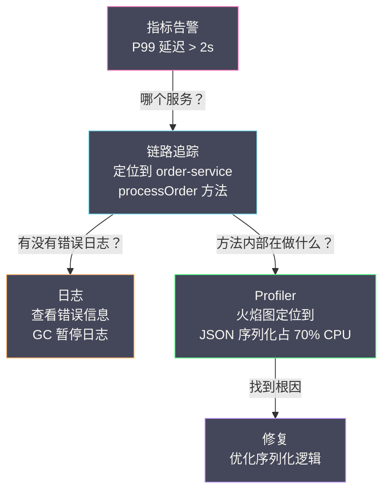
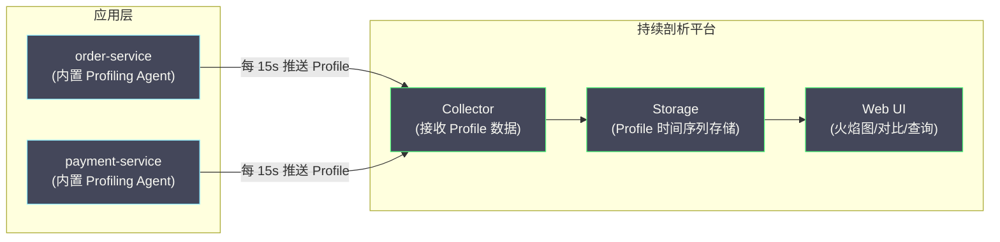

# 01 持续性能剖析

**摘要：**

性能剖析（Profiling）是回答"**CPU 时间花在了哪些代码上**"这个问题的唯一手段。指标告诉你"慢了"，链路追踪告诉你"慢在哪个服务"，但只有 Profiler 能告诉你"慢在哪个函数、哪一行代码"。传统的 Profiling 是一种**临时性的调试手段**——工程师在发现性能问题后手动启动 Profiler，抓取一段时间的采样数据，分析后关闭。这种模式有一个致命缺陷：**你无法 Profile 已经过去的问题**。如果一个 P99 延迟尖峰发生在凌晨 3 点并在 5 分钟后自动恢复，第二天上班的工程师已经无法复现和分析它。**持续性能剖析（Continuous Profiling）** 正是为了解决这个问题——它以极低的开销在生产环境中 7×24 小时不间断地采集 Profile 数据，使得工程师可以"回放"任意时间点的代码执行热点。本文从 Profiling 的基本原理出发，介绍 Profiling 的分类、采样机制、传统 Profiling 与持续 Profiling 的差异，以及主流持续剖析平台的对比。

---

## 第 1 章 为什么需要 Profiling

### 1.1 可观测性的"最后一公里"

在前面的子专栏中，我们已经建立了完整的可观测性技术栈：

- **指标**（[[01 为什么需要指标]]）：告诉你"系统整体的健康状态"——QPS、错误率、P99 延迟
- **链路追踪**（[[01 为什么需要链路追踪]]）：告诉你"一个请求经过了哪些服务、每个服务花了多少时间"
- **日志**（[[01 日志的本质与演进]]）：告诉你"某个时刻发生了什么事件"

但它们都有一个共同的盲区——**无法深入到代码层面**。

考虑这样一个场景：[[Grafana]] 仪表盘显示 order-service 的 P99 延迟从 200ms 飙升到 3 秒。你通过链路追踪定位到慢请求卡在 `processOrder()` 方法上，该方法的 Span 耗时 2.8 秒。然后呢？

`processOrder()` 内部可能调用了数十个子方法——数据库查询、缓存读取、业务逻辑计算、序列化。链路追踪通常只埋点到框架层面（HTTP 调用、数据库查询），不会深入到每个业务方法。你无法从 Trace 中知道：2.8 秒中有多少时间花在了 JSON 序列化上？有多少时间花在了一个低效的循环中？有多少时间花在了等待锁上？

**Profiler 填补了这个盲区**。它以函数调用栈（Call Stack）的粒度记录程序的运行时行为，能够精确到"函数 A 内部调用函数 B，函数 B 占用了总 CPU 时间的 35%"。

### 1.2 一个真实的性能问题排查案例

为了具体说明 Profiler 的价值，考虑以下案例：

**现象**：某 Java 微服务在流量高峰期 CPU 使用率从 40% 飙升到 95%，P99 延迟随之恶化。

**指标层面的信息**：CPU 使用率高、P99 延迟高、QPS 正常（排除了流量突增的可能）。

**链路追踪层面的信息**：慢请求集中在 `UserService.getProfile()` 方法，平均耗时从 50ms 增加到 800ms。但 `getProfile()` 内部的数据库查询只用了 30ms，其余 770ms 不知道花在了哪里。

**Profiler 的发现**：CPU 火焰图显示 `getProfile()` 方法内部有 70% 的 CPU 时间花在了 `com.fasterxml.jackson.databind.ObjectMapper.writeValueAsString()` 上——JSON 序列化。进一步分析发现，由于一次代码重构，`getProfile()` 的返回对象中新增了一个嵌套层级极深的字段，导致 Jackson 序列化耗时从 5ms 增加到 600ms。

**没有 Profiler，这个根因几乎不可能被发现**——因为从 Trace 和日志中只能看到 `getProfile()` 整体变慢，无法定位到内部的具体热点。

### 1.3 Profiling 在可观测性中的位置



---

## 第 2 章 Profiling 的基本原理

### 2.1 什么是 Profile

**Profile** 是程序在一段时间内的**资源使用分布**——哪些函数消耗了多少 CPU 时间、分配了多少内存、等待了多少锁时间。Profile 的核心数据结构是**调用栈的统计聚合**。

一个 CPU Profile 的原始数据大致如下：

```
调用栈                                    采样次数
main → handleRequest → processOrder → serialize    350
main → handleRequest → processOrder → queryDB      120
main → handleRequest → processOrder → validateInput 30
main → handleRequest → authenticate                 80
main → GC.collect                                   20
                                              总计：600
```

每一行是一个**调用栈（Call Stack）**——从栈底（main）到栈顶（当前正在执行的函数）的完整调用路径。采样次数表示在采样期间，该调用栈被"看到"了多少次。采样次数 ÷ 总次数 = 该调用路径占总 CPU 时间的比例。

### 2.2 采样 vs 插桩

获取 Profile 数据有两种基本方法：

**插桩（Instrumentation）**：在每个函数的入口和出口插入计时代码，精确记录每次函数调用的耗时。

```java
// 插桩示例（伪代码）
void processOrder(Order order) {
    long start = System.nanoTime();   // ← 插入的计时代码
    // ... 原始业务逻辑 ...
    long elapsed = System.nanoTime() - start;  // ← 插入的计时代码
    profiler.record("processOrder", elapsed);   // ← 插入的记录代码
}
```

插桩的优点是**精确**——每次函数调用都被记录，没有遗漏。缺点是**开销巨大**——每次函数调用都增加了计时和记录的开销。如果一个函数每秒被调用 100 万次，插桩的开销可能远超函数本身的执行时间。因此插桩通常只用于开发/测试环境，不适合生产环境。

**采样（Sampling）**：以固定频率（如每秒 100 次）中断程序的执行，记录当时的调用栈。

采样不修改任何业务代码，对性能的影响极小——每秒 100 次采样意味着每 10 毫秒中断一次，每次中断只需要读取当前线程的调用栈（通常不超过 10 微秒）。总开销约为 100 × 10μs = 1ms/秒，即 **0.1% 的 CPU 开销**。

采样的缺点是**不精确**——它是统计采样，不是精确计数。但根据统计学原理，当采样数量足够多时（通常几千个样本就足够），采样结果能够准确反映真实的 CPU 时间分布。

> [!info] 为什么采样是正确的
> 采样 Profiling 的数学基础是**大数定律**。假设函数 A 占用了 30% 的 CPU 时间，那么在任意时刻采样时，有 30% 的概率"看到"函数 A 正在执行。采样 1000 次后，函数 A 被看到的次数期望是 300 ± 14（标准差 ≈ √(1000 × 0.3 × 0.7)）。也就是说，采样 1000 次就能以 ±1.4% 的精度估算出函数 A 的 CPU 占比。对于性能分析来说，这个精度已经完全足够——你需要找到的是占 30% CPU 的热点函数，而不是精确到小数点后两位。

### 2.3 CPU Profiling 的采样机制

不同语言和运行时使用不同的采样机制：

**Java（JVM）**：
- **AsyncGetCallTrace（async-profiler）**：通过 POSIX 信号（SIGPROF 或 ITIMER_PROF）触发采样，在信号处理函数中调用 JVM 内部的 `AsyncGetCallTrace` API 获取当前线程的调用栈。这是目前 Java 生态中最准确的 CPU Profiling 方法——它避免了 JVM Safepoint Bias（安全点偏差）问题。
- **JFR（Java Flight Recorder）**：JDK 内置的 Profiling 框架，从 JDK 11 开始免费可用。JFR 使用 JVM 内部的事件系统，开销极低（官方声称 < 1%）。

**Go**：
- Go 内置 `runtime/pprof` 包，使用 `SIGPROF` 信号采样，默认频率 100 Hz（每秒 100 次）。通过 `net/http/pprof` 包暴露 HTTP 端点即可在线获取 Profile。

**C/C++/Rust/任意原生程序**：
- **perf**：Linux 内核的性能计数器子系统，使用硬件性能计数器（PMU）或软件事件触发采样。`perf record -g -p <PID>` 即可采集 CPU Profile。
- **[[eBPF]]**：通过在内核中注入 BPF 程序，在 perf 事件触发时收集用户态和内核态的调用栈。零侵入、极低开销。

**Python/Ruby/Node.js**：
- 这些解释型语言通常需要语言运行时的特殊支持来获取调用栈。Python 有 `py-spy`（基于进程外采样），Node.js 有 V8 CPU Profiler。

---

## 第 3 章 Profiling 的分类

### 3.1 CPU Profiling

**目标**：分析 CPU 时间花在了哪些函数上。

CPU Profiling 是最常用的 Profiling 类型。它回答"程序在忙什么"——如果 CPU 使用率很高，CPU Profile 会告诉你哪些函数是"CPU 热点"（CPU Hotspot）。

**适用场景**：
- CPU 使用率异常升高
- 延迟增加但不是由 I/O 或锁等待引起的
- 优化计算密集型代码

### 3.2 Allocation Profiling（内存分配剖析）

**目标**：分析哪些函数分配了最多的堆内存。

Allocation Profiling 记录每次堆内存分配的调用栈和大小。它不关心"当前内存中有什么"（那是 Heap Dump 的工作），而是关心"谁在不断地分配新对象"。

**适用场景**：
- [[JVM GC]] 频繁，Young GC 或 Full GC 暂停时间过长
- 内存使用率持续增长（可能有内存泄漏）
- 优化对象分配热点，减少 GC 压力

**为什么关注"分配"而不是"存活"？**

在带 GC 的语言（Java、Go、C#）中，短生命周期的临时对象虽然很快被 GC 回收，但它们的分配和回收本身消耗 CPU——分配器需要找到空闲内存，GC 需要扫描和回收。如果一个函数每秒分配 1 GB 的临时对象，即使这些对象很快被回收，GC 的开销也会非常显著。Allocation Profiling 能够精确定位这些"分配大户"。

### 3.3 Lock/Contention Profiling（锁竞争剖析）

**目标**：分析线程在哪些锁上花费了最多的等待时间。

当多个线程争夺同一把锁时，只有一个线程能获得锁，其余线程必须等待。Lock Profiling 记录每次锁等待的调用栈和等待时长。

**适用场景**：
- CPU 使用率不高，但延迟很高（线程在等待锁而非执行代码）
- 线程池的线程大量处于 BLOCKED 状态
- 并发性能不随线程数线性提升

### 3.4 Wall-clock Profiling（挂钟时间剖析）

**目标**：分析函数的"实际经过时间"（包括 CPU 执行时间 + I/O 等待时间 + 锁等待时间）。

CPU Profiling 只记录 CPU 正在执行的采样点——如果一个线程在等待网络 I/O 或磁盘 I/O，它不占用 CPU，因此不会出现在 CPU Profile 中。Wall-clock Profiling 不区分"CPU 执行"和"等待"——它记录的是"函数从开始到结束的所有时间"。

**适用场景**：
- 延迟很高但 CPU 使用率很低（说明时间花在了等待上）
- 分析 I/O 密集型代码的瓶颈
- 需要看到完整的时间分布（CPU + I/O + 锁）

### 3.5 各类型 Profiling 的对比

| 类型 | 度量的资源 | 典型问题 | 适用的现象 |
| :--- | :--- | :--- | :--- |
| **CPU** | CPU 时间 | 计算热点 | CPU 高，延迟高 |
| **Allocation** | 堆内存分配量 | GC 压力、内存泄漏 | GC 频繁，内存增长 |
| **Lock** | 锁等待时间 | 锁竞争 | CPU 低，线程 BLOCKED |
| **Wall-clock** | 实际经过时间 | I/O 等待、综合瓶颈 | 延迟高，CPU 低 |

---

## 第 4 章 传统 Profiling vs 持续 Profiling

### 4.1 传统 Profiling 的工作模式

传统 Profiling 是一种**临时性的调试手段**：

1. 工程师发现性能问题（或收到告警）
2. 登录到生产服务器或通过管理接口启动 Profiler
3. Profiler 运行一段时间（通常 30 秒到几分钟），采集 Profile 数据
4. 工程师下载 Profile 数据，用工具（如 `go tool pprof`、VisualVM）分析
5. 分析完成后关闭 Profiler

**传统 Profiling 的致命问题**：

**问题一：无法分析已经过去的问题**。性能问题通常是间歇性的——一个 P99 延迟尖峰可能只持续 5 分钟。如果工程师在问题发生 1 小时后才开始 Profile，此时系统已经恢复正常，Profile 中看不到任何异常。

**问题二：问题可能无法复现**。某些性能问题只在特定的负载模式下出现（如特定的请求参数组合、特定的并发模式）。在工程师手动 Profile 时，这些条件可能不存在。

**问题三：启动 Profiler 本身可能改变行为**。在生产环境中手动启动 Profiler 需要谨慎操作——如果 Profiler 的开销过大，可能使本已不堪重负的系统雪上加霜。

**问题四：缺乏历史对比**。即使抓到了当前的 Profile，也无法与"正常时期"的 Profile 对比——因为正常时期没有开启 Profiler。对比（Diff）是性能分析中极其有用的手段：将"异常时的 Profile"与"正常时的 Profile"做差异对比，立即可以看出"哪些函数的 CPU 占比增加了"。

### 4.2 持续 Profiling 的工作模式

**持续性能剖析（Continuous Profiling）** 的核心思想是：**在生产环境中以极低的开销 7×24 小时不间断地采集 Profile 数据，将 Profile 数据作为时间序列存储，支持按时间范围查询和对比。**



持续 Profiling 解决了传统 Profiling 的所有问题：

- **问题发生后可以回溯**：任何时间点的 Profile 数据都已经被采集和存储
- **无需复现**：问题发生时的 Profile 已经自动保存
- **始终在线**：不需要工程师手动启动
- **支持历史对比**：可以将任意两个时间段的 Profile 做 Diff

### 4.3 持续 Profiling 的开销

持续 Profiling 之所以可行，是因为采样式 Profiling 的开销极低：

| 参数 | 典型值 | 说明 |
| :--- | :--- | :--- |
| 采样频率 | 100 Hz | 每秒采样 100 次 |
| 每次采样耗时 | ~10 μs | 读取调用栈 |
| CPU 开销 | < 1% | 100 × 10μs = 1ms/s |
| 内存开销 | ~10 MB | 缓冲未发送的 Profile 数据 |
| 网络开销 | ~1 KB/s | 压缩后的 Profile 数据 |

这些开销在生产环境中是完全可以接受的。Google 在其论文《Google-Wide Profiling: A Continuous Profiling Infrastructure for Data Centers》（2010）中报告，他们在所有生产服务器上运行持续 Profiling，CPU 开销不超过 0.5%。

> [!note] Google 的实践
> Google 从 2010 年起就在所有生产服务中运行持续 Profiling（内部系统名为 Google-Wide Profiling, GWP）。GWP 帮助 Google 识别了大量的性能优化机会——据报告，通过 GWP 发现并优化的代码热点每年为 Google 节省了数百万美元的计算资源成本。这一实践证明了持续 Profiling 在大规模生产环境中的可行性和价值。

---

## 第 5 章 Profile 数据的存储格式

### 5.1 pprof 格式

**pprof** 是 Google 开发的 Profile 数据格式和分析工具，已成为事实上的行业标准。pprof 使用 Protocol Buffers 编码，格式定义如下（简化）：

```protobuf
message Profile {
  repeated Sample sample = 1;       // 采样数据
  repeated Mapping mapping = 2;     // 内存映射（可执行文件/库）
  repeated Location location = 3;   // 代码位置
  repeated Function function = 4;   // 函数信息
  repeated string string_table = 5; // 字符串去重表
  repeated ValueType sample_type = 6; // 采样值类型（cpu、alloc 等）
  int64 duration_nanos = 7;         // Profile 持续时间
}

message Sample {
  repeated uint64 location_id = 1;  // 调用栈（从栈顶到栈底的 Location 列表）
  repeated int64 value = 2;         // 采样值（如 CPU 时间、分配字节数）
  repeated Label label = 3;         // 附加标签
}
```

pprof 的设计特点是**字符串去重**——所有的函数名、文件名、库名都存储在一个统一的字符串表（`string_table`）中，通过整数索引引用。这大幅减少了 Profile 数据的大小，因为同一个函数名可能出现在数万个采样的调用栈中。

### 5.2 JFR 格式

**Java Flight Recorder（JFR）** 使用自己的二进制格式，包含丰富的 JVM 事件信息：不仅有 CPU 和内存 Profile，还有 GC 事件、线程状态变化、I/O 操作、编译事件等。JFR 格式比 pprof 更丰富，但也更复杂。

主流的持续剖析平台通常同时支持 pprof 和 JFR 格式的摄入。

---

## 第 6 章 主流持续剖析平台

### 6.1 平台对比

| 平台 | 开源 | 支持的语言 | 采集方式 | 存储后端 | 与可观测性栈的集成 |
| :--- | :--- | :--- | :--- | :--- | :--- |
| **Grafana Pyroscope** | ✅ AGPL 3.0 | Go, Java, Python, Ruby, Node.js, .NET, Rust, eBPF | Agent / SDK / eBPF | 自研（对象存储）| Grafana 原生集成，支持 Exemplar 跳转 |
| **Parca** | ✅ Apache 2.0 | 任意（eBPF 采集）| eBPF Agent | 自研 | 独立 UI，支持 pprof 格式 |
| **Datadog Continuous Profiler** | ❌ 商业 | Go, Java, Python, Ruby, Node.js, .NET | Datadog Agent | Datadog 云端 | 与 Datadog APM 深度集成 |
| **Google Cloud Profiler** | ❌ 商业 | Go, Java, Python, Node.js | Agent | Google Cloud | 与 Cloud Trace 集成 |

### 6.2 Grafana Pyroscope

[[Grafana Pyroscope]]（原名 Pyroscope，2023 年被 Grafana Labs 收购）是目前最受关注的开源持续剖析平台。它与 Grafana 的深度集成使其成为"Grafana + Prometheus + Loki + Tempo + Pyroscope"全栈可观测性方案的最后一块拼图。

**核心能力**：
- **多语言支持**：通过语言特定的 SDK 或通用的 eBPF Agent 采集
- **火焰图 UI**：在 Grafana 中直接查看火焰图，支持时间范围选择
- **Diff 视图**：对比两个时间段的 Profile，高亮差异（红色 = 增加，绿色 = 减少）
- **与 Trace 关联**：通过 Exemplar 或 Span Profile，将 Trace 中的 Span 关联到对应时间的 Profile

### 6.3 Parca

**Parca** 是 Polar Signals 公司开发的开源持续剖析平台，其最大特点是**完全基于 eBPF 采集**——不需要在应用中集成任何 SDK，只需在节点上部署 Parca Agent，即可采集节点上所有进程的 CPU Profile。

这种零侵入的方式对于那些无法修改代码的第三方服务（如 MySQL、Redis、Nginx）特别有价值。

---

## 第 7 章 持续 Profiling 与其他信号的联动

### 7.1 从指标到 Profile 的跳转

在 [[Grafana]] 中，通过 **Exemplar** 或 **数据源关联**，可以从指标面板直接跳转到对应时间段的 Profile：

- Grafana 仪表盘显示 P99 延迟在 14:00~14:05 有一个尖峰
- 点击尖峰区域，跳转到 Pyroscope 的 14:00~14:05 时间段的火焰图
- 火焰图立即显示该时间段的 CPU 热点

### 7.2 从 Trace 到 Profile 的跳转

更精细的联动是 **Span Profile**——将链路追踪的 Span 与同一时间段的 Profile 数据关联。当你在 [[Grafana Tempo]] 中查看一个慢 Span 时，可以直接查看该 Span 执行期间的火焰图，精确到"这个 Span 内部的 CPU 时间花在了哪些函数上"。

这构成了完整的排查闭环：

```
指标告警 → Grafana 仪表盘 → 选择时间范围
    → 链路追踪 → 定位慢 Span
        → Profiler 火焰图 → 定位热点函数
            → 修改代码 → 部署 → 验证指标恢复
```

> [!info] 可观测性的完整闭环
> 四种信号（指标、日志、链路追踪、持续剖析）各自回答不同层次的问题，通过关联机制形成闭环：
> - **指标** → "有问题吗？"（全局健康度）
> - **链路追踪** → "问题在哪个服务/方法？"（请求级定位）
> - **日志** → "发生了什么事件？"（事件级上下文）
> - **Profiler** → "代码内部在做什么？"（代码级根因）

---

## 参考资料

1. Google (2010). *Google-Wide Profiling: A Continuous Profiling Infrastructure for Data Centers*. EuroSys.
2. Grafana Pyroscope Documentation：https://grafana.com/docs/pyroscope/latest/
3. Parca Documentation：https://www.parca.dev/docs/overview
4. Brendan Gregg (2020). *BPF Performance Tools*. Addison-Wesley, Chapter 13: Applications.
5. async-profiler：https://github.com/async-profiler/async-profiler
6. Go pprof Documentation：https://pkg.go.dev/runtime/pprof
7. JDK Flight Recorder：https://docs.oracle.com/en/java/javase/17/jfapi/
