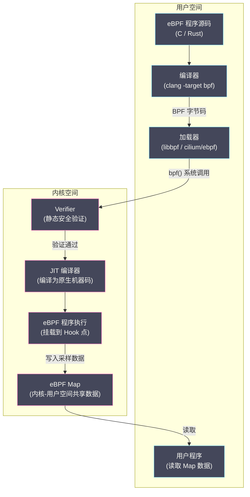

# 03 eBPF Profiling 内核级性能观测

**摘要：**

前两篇文章介绍的 Profiling 技术——无论是 Java 的 async-profiler/JFR，还是 Go 的 `runtime/pprof`——都依赖于**语言运行时的配合**：Profiler 需要嵌入到应用进程中（通过 Agent 或 SDK），并调用运行时提供的 API 获取调用栈。这种方式对应用有"侵入性"（需要修改启动参数或引入依赖），且无法 Profile 那些你无法修改代码的第三方程序（如 MySQL、Redis、Nginx）。[[eBPF]]（extended Berkeley Packet Filter）从根本上改变了这个局面——它允许在 **Linux 内核中安全地运行自定义程序**，无需修改内核代码、无需重启系统、无需在目标进程中注入任何东西。基于 eBPF 的 Profiler 可以从内核层面采集**任意进程**的调用栈，实现真正的**零侵入、全覆盖**性能观测。本文从 eBPF 的核心原理出发，解释它为什么安全、如何工作，然后介绍基于 eBPF 的 Profiling 工具和平台。

---

## 第 1 章 eBPF 的起源与演进

### 1.1 从 BPF 到 eBPF

**BPF（Berkeley Packet Filter）** 最初由 Steven McCanne 和 Van Jacobson 在 1992 年的论文中提出，目的是为 `tcpdump` 等网络抓包工具提供一种高效的包过滤机制。原始 BPF 是一个极简的虚拟机——它有一组寄存器和指令集，用户可以编写 BPF 程序来决定"这个网络包是否应该被捕获"。BPF 程序运行在内核中，避免了将每个包从内核拷贝到用户空间再判断的开销。

2014 年，Alexei Starovoitov 在 Linux 3.18 内核中引入了 **eBPF（extended BPF）**——一个大幅增强的 BPF 版本。eBPF 不再局限于网络包过滤，而是成为了一个**通用的内核可编程框架**：

| 维度 | 经典 BPF | eBPF |
| :--- | :--- | :--- |
| **用途** | 网络包过滤 | 通用：网络、安全、追踪、Profiling |
| **寄存器** | 2 个（32 位） | 10 个（64 位）+ 栈空间 |
| **指令集** | ~30 条 | ~100+ 条 |
| **Map（数据结构）** | 无 | 丰富：HashMap、Array、RingBuffer 等 |
| **Helper 函数** | 无 | 数百个内核辅助函数 |
| **安全验证** | 简单 | 完善的 Verifier 静态分析 |
| **JIT 编译** | 部分架构 | 所有主流架构 |

### 1.2 eBPF 为什么重要

eBPF 的革命性在于它打破了一个长期存在的困局：**要观测内核行为，要么修改内核代码（危险且耗时），要么使用有限的静态追踪点（灵活性不足）**。

eBPF 提供了第三条路——**在不修改内核的前提下，将自定义的观测逻辑注入到内核的几乎任何位置**。就像 JavaScript 让浏览器变得可编程一样，eBPF 让 Linux 内核变得可编程。

对于 Profiling 来说，eBPF 的价值在于：

**零侵入**：不需要在目标进程中注入 Agent、修改启动参数或引入 SDK。eBPF 程序运行在内核中，从"外部"观测目标进程。

**全覆盖**：可以 Profile 系统上的**任意进程**——Java 服务、Go 服务、C++ 程序、MySQL、Redis、Nginx、甚至内核本身。

**极低开销**：eBPF 程序经过 JIT 编译为原生机器码执行，经过 Verifier 确保不会有无限循环或越界访问，开销可控。

---

## 第 2 章 eBPF 的核心架构

### 2.1 eBPF 程序的生命周期



**步骤一：编写 eBPF 程序**。通常用受限的 C 语言编写（不支持循环、不支持全局变量、栈大小有限）。也可以用 Rust（aya 框架）。

**步骤二：编译为 BPF 字节码**。使用 `clang -target bpf` 将 C 代码编译为 BPF 字节码（类似 JVM 字节码）。

**步骤三：加载到内核**。用户空间程序通过 `bpf()` 系统调用将字节码加载到内核。

**步骤四：Verifier 验证**。这是 eBPF 安全性的核心——内核的 Verifier 对字节码进行**静态分析**，确保程序不会：
- 无限循环（所有循环必须有明确的上界）
- 越界访问内存
- 访问未初始化的寄存器
- 调用未授权的内核函数

如果验证不通过，程序被拒绝加载——内核不会执行任何不安全的 eBPF 程序。

**步骤五：JIT 编译并执行**。验证通过后，BPF 字节码被 JIT 编译为目标架构（x86_64、ARM64）的原生机器码，然后挂载到指定的 Hook 点。当 Hook 点被触发时（如 perf 事件、tracepoint、kprobe），eBPF 程序自动执行。

**步骤六：通过 Map 交换数据**。eBPF 程序将采集到的数据（如调用栈）写入 **eBPF Map**——一种内核与用户空间共享的数据结构。用户空间程序定期从 Map 中读取数据并处理。

### 2.2 eBPF Map

eBPF Map 是 eBPF 程序与用户空间程序之间的**数据通道**。常用的 Map 类型：

| Map 类型 | 用途 |
| :--- | :--- |
| `BPF_MAP_TYPE_HASH` | 哈希表，键值对存储 |
| `BPF_MAP_TYPE_ARRAY` | 固定大小数组 |
| `BPF_MAP_TYPE_PERF_EVENT_ARRAY` | 将数据推送到 perf 事件缓冲区 |
| `BPF_MAP_TYPE_RINGBUF` | 高效的环形缓冲区（推荐的数据传输方式）|
| `BPF_MAP_TYPE_STACK_TRACE` | 专门存储调用栈的 Map |

对于 Profiling 场景，最关键的是 `BPF_MAP_TYPE_STACK_TRACE`——它让 eBPF 程序可以高效地捕获和存储调用栈。

### 2.3 Hook 点：eBPF 程序挂载在哪里

eBPF 程序需要挂载到内核的某个**Hook 点**才能被触发执行。不同类型的 Hook 点适用于不同的观测场景：

| Hook 类型 | 触发条件 | Profiling 用途 |
| :--- | :--- | :--- |
| **perf_event** | 硬件/软件性能计数器 | CPU Profiling（定时采样）|
| **kprobe** | 内核函数入口 | 追踪内核函数调用 |
| **kretprobe** | 内核函数返回 | 追踪内核函数返回值 |
| **uprobe** | 用户空间函数入口 | 追踪用户空间函数调用 |
| **tracepoint** | 内核静态追踪点 | 追踪预定义的内核事件 |
| **fentry/fexit** | 内核函数入口/出口（BPF 原生）| 比 kprobe 更高效的内核追踪 |

**CPU Profiling 使用 `perf_event` Hook**：配置一个基于 CPU 时钟的 perf 事件，每隔固定时间（如 10ms，即 100 Hz）触发一次 eBPF 程序。每次触发时，eBPF 程序读取当前 CPU 上正在运行的进程的调用栈，并将其写入 Map。

---

## 第 3 章 基于 eBPF 的 CPU Profiling

### 3.1 工作原理

基于 eBPF 的 CPU Profiler 的核心逻辑非常简洁：

```
1. 创建一个 perf_event，类型 = PERF_TYPE_SOFTWARE，
   config = PERF_COUNT_SW_CPU_CLOCK，频率 = 100 Hz

2. 将 eBPF 程序挂载到这个 perf_event 上

3. 每次 perf_event 触发（即每 10ms），eBPF 程序执行：
   a. 调用 bpf_get_stackid() 获取当前的用户态调用栈 ID
   b. 调用 bpf_get_stackid() 获取当前的内核态调用栈 ID
   c. 获取当前进程的 PID 和 TID
   d. 将 (PID, 用户栈 ID, 内核栈 ID) → 采样次数 写入 HashMap

4. 用户空间程序定期（如每 15 秒）读取 HashMap，
   将栈 ID 翻译为人类可读的函数名，
   生成 pprof 格式的 Profile 数据
```

**核心 eBPF 程序（简化）**：

```c
// eBPF 程序：每次 perf_event 触发时执行
SEC("perf_event")
int do_sample(struct bpf_perf_event_data *ctx) {
    // 获取当前进程 ID
    u64 pid_tgid = bpf_get_current_pid_tgid();
    u32 pid = pid_tgid >> 32;
    u32 tid = pid_tgid & 0xFFFFFFFF;

    // 获取用户态调用栈 ID
    int user_stack_id = bpf_get_stackid(ctx, &stack_traces, BPF_F_USER_STACK);

    // 获取内核态调用栈 ID
    int kernel_stack_id = bpf_get_stackid(ctx, &stack_traces, 0);

    // 构建 Key
    struct sample_key key = {
        .pid = pid,
        .user_stack_id = user_stack_id,
        .kernel_stack_id = kernel_stack_id,
    };

    // 累加采样次数
    u64 *count = bpf_map_lookup_elem(&counts, &key);
    if (count) {
        __sync_fetch_and_add(count, 1);
    } else {
        u64 init_val = 1;
        bpf_map_update_elem(&counts, &key, &init_val, BPF_ANY);
    }

    return 0;
}
```

### 3.2 符号解析：从地址到函数名

eBPF 程序采集到的调用栈是**内存地址**的列表（如 `[0x7f3a2b4c, 0x5600ab12, 0x5600a890, ...]`）。要将这些地址转换为人类可读的函数名（如 `processOrder`、`serialize`），需要进行**符号解析（Symbol Resolution）**。

不同语言的符号解析方式不同：

**原生代码（C/C++/Rust/Go）**：通过二进制文件的 DWARF 调试信息或 `.symtab` 段解析。如果编译时 strip 了符号表，则无法解析。

**Java**：JVM 使用 JIT 编译，函数的内存地址是动态的。需要通过 JVM 的 `perf-map-agent`（将 JIT 编译的方法地址映射写入 `/tmp/perf-<PID>.map` 文件）来解析。Java 17+ 的 JEP 484 提供了更好的支持。

**Python/Ruby/Node.js**：解释型语言的调用栈在运行时内部维护，eBPF 只能看到解释器的 C 层调用栈（如 `PyEval_EvalFrameDefault`），看不到 Python 层面的函数名。需要特殊的技巧（如读取解释器的内部数据结构）来还原语言层面的调用栈。

> [!warning] 符号解析是 eBPF Profiling 最大的工程挑战
> eBPF 程序本身的逻辑相对简单——真正复杂的是将采集到的内存地址翻译为有意义的函数名。每种语言、每种运行时都有不同的符号解析需求。这也是为什么 Parca、Pyroscope 等平台投入了大量工程工作在符号解析上。

### 3.3 eBPF Profiling vs 语言内置 Profiling

| 维度 | eBPF Profiling | 语言内置 Profiling |
| :--- | :--- | :--- |
| **侵入性** | 零侵入（不需要修改应用）| 需要 Agent/SDK |
| **语言覆盖** | 任意语言 | 只支持特定语言 |
| **内核态调用栈** | ✅ 可采集 | ❌ 通常不支持 |
| **符号解析精度** | 取决于符号信息（可能不完整）| 精确（运行时提供）|
| **JIT 代码支持** | 需要额外的符号映射 | 原生支持 |
| **部署方式** | 每个节点部署一个 Agent | 每个应用集成 |
| **最低内核版本** | Linux 4.9+（推荐 5.8+）| 无限制 |

**最佳实践**：对于 Java 和 Go 这样有成熟 Profiling 支持的语言，语言内置的 Profiler 通常提供更精确的结果。eBPF Profiling 的最大价值在于：
- Profile 你无法修改代码的程序（MySQL、Redis、第三方中间件）
- 获取内核态的调用栈（如 `epoll_wait`、文件系统操作、网络协议栈）
- 统一的全节点 Profiling（一个 Agent 覆盖节点上所有进程）

---

## 第 4 章 eBPF Profiling 工具

### 4.1 perf

`perf` 是 Linux 内核自带的性能分析工具，虽然它不直接使用 eBPF（它使用 perf_event 子系统），但它是理解 eBPF Profiling 的基础。

```bash
# 采集 CPU Profile（30 秒，99 Hz 采样）
perf record -F 99 -p <PID> -g -- sleep 30

# 生成报告
perf report

# 生成折叠格式（可用于火焰图生成）
perf script | stackcollapse-perf.pl | flamegraph.pl > flame.svg
```

`perf` 的局限性在于它需要手动操作、无法持续运行、数据格式不适合长期存储。

### 4.2 bcc / bpftrace

**bcc（BPF Compiler Collection）** 和 **bpftrace** 是 eBPF 的前端工具，提供了大量现成的 Profiling 脚本：

```bash
# bcc 的 CPU Profile 工具
# 采集所有进程的 CPU 调用栈，持续 30 秒，生成折叠格式
profile-bpfcc -F 99 -f 30 > profile.folded

# bpftrace 的单行 CPU Profiler
bpftrace -e 'profile:hz:99 { @[ustack] = count(); }'
```

bcc/bpftrace 适合临时的性能调查，但不适合持续 Profiling——它们缺乏数据持久化、符号解析集成和 Web UI。

### 4.3 Parca Agent

**Parca Agent** 是专为持续 Profiling 设计的 eBPF Agent。它作为 DaemonSet 部署在 Kubernetes 集群的每个节点上，自动发现并 Profile 节点上的所有进程。

**核心特性**：
- 基于 eBPF 的 CPU Profiling，零侵入
- 自动发现 Kubernetes Pod 和容器
- 内置符号解析（支持 DWARF、Go、JIT Map）
- 将 Profile 数据推送到 Parca Server 存储
- 支持 pprof 格式输出

```yaml
# Kubernetes DaemonSet 部署 Parca Agent
apiVersion: apps/v1
kind: DaemonSet
metadata:
  name: parca-agent
spec:
  template:
    spec:
      containers:
        - name: parca-agent
          image: ghcr.io/parca-dev/parca-agent:latest
          securityContext:
            privileged: true  # eBPF 需要特权模式
          volumeMounts:
            - name: modules
              mountPath: /lib/modules
              readOnly: true
            - name: sys-kernel
              mountPath: /sys/kernel
              readOnly: true
      volumes:
        - name: modules
          hostPath:
            path: /lib/modules
        - name: sys-kernel
          hostPath:
            path: /sys/kernel
```

### 4.4 Grafana Pyroscope 的 eBPF 模式

[[Grafana Pyroscope]] 也提供了 eBPF 采集模式——通过 Grafana Alloy（原 Grafana Agent）配置 eBPF 组件：

```hcl
// Grafana Alloy 配置 eBPF Profiling
pyroscope.ebpf "instance" {
  forward_to     = [pyroscope.write.endpoint.receiver]
  targets_only   = false    // true = 只 Profile 指定目标
  default_target = {"service_name" = "unspecified"}

  // Kubernetes 发现
  demangle = "none"
}
```

Pyroscope 的 eBPF 模式与 Parca 的定位类似，但优势在于它与 Grafana 生态的深度集成——Profile 数据直接在 Grafana 中查看，支持与 Prometheus 指标和 Tempo 链路追踪的跳转。

---

## 第 5 章 eBPF 的安全模型与限制

### 5.1 Verifier：eBPF 的安全基石

eBPF 的安全性依赖于内核的 **Verifier**——一个在加载时对 eBPF 程序进行静态分析的组件。Verifier 确保：

**无限循环保护**：eBPF 程序不允许有回边（backward edge）——这意味着所有循环必须在编译时展开，或使用 `bpf_loop()` Helper 函数（有明确的迭代上界）。这保证了 eBPF 程序**一定会终止**，不会导致内核挂起。

**内存安全**：所有内存访问必须在有效范围内——Verifier 追踪每个寄存器的值范围和类型，确保不会越界读写。

**特权控制**：加载 eBPF 程序需要 `CAP_BPF`（或 `CAP_SYS_ADMIN`）特权。非特权用户无法加载 eBPF 程序。

### 5.2 eBPF 的实际限制

**限制一：内核版本要求**。完善的 eBPF Profiling 支持需要 Linux 5.8+ 内核。较低版本的内核缺少部分 Helper 函数或 Map 类型。

**限制二：栈深度限制**。eBPF 程序的栈大小限制为 512 字节——这限制了程序的复杂度。对于 Profiling 来说，这通常不是问题（Profiling 程序的逻辑很简单）。

**限制三：容器环境的权限**。eBPF Agent 需要 `privileged` 模式或特定的 Linux Capabilities 才能运行。在安全要求严格的 Kubernetes 集群中，这可能需要额外的审批。

**限制四：解释型语言的栈解析**。如前所述，eBPF 只能看到原生的调用栈——对于 Python、Ruby 等解释型语言，需要额外的工作来还原语言层面的调用信息。

---

## 第 6 章 eBPF 在可观测性中的更广泛应用

### 6.1 超越 Profiling

eBPF 在可观测性领域的价值远不止 Profiling。它正在成为可观测性的**底层基础设施**：

**网络观测**：[[Cilium]] 使用 eBPF 实现 Kubernetes 的网络策略和服务网格，同时提供细粒度的网络流量可观测性（每个 Pod 之间的流量、延迟、丢包率）。

**安全观测**：Falco、Tracee 等工具使用 eBPF 监控系统调用，检测可疑行为（如容器逃逸、未授权的文件访问）。

**自动埋点**：基于 eBPF 的链路追踪（如 Grafana Beyla）可以零侵入地自动生成 HTTP/gRPC 的 Span——不需要在应用中集成任何 SDK。

### 6.2 eBPF 与 OpenTelemetry 的融合

[[OpenTelemetry]] 社区正在探索将 eBPF 作为自动埋点（Auto-Instrumentation）的底层技术。传统的自动埋点依赖语言特定的机制（如 Java 的字节码增强、Python 的 monkey-patching），而 eBPF 可以提供跨语言的统一方案——在内核层面观测所有 HTTP/gRPC/数据库调用，自动生成 Trace 和 Span。

这种方式的优势是**真正的零侵入**——不需要修改应用代码、不需要引入 SDK、不需要重启服务。缺点是**精细度有限**——eBPF 只能在系统调用/网络包层面观测，无法获取应用内部的业务上下文（如用户 ID、订单 ID）。

---

## 参考资料

1. Brendan Gregg (2020). *BPF Performance Tools*. Addison-Wesley.
2. Brendan Gregg (2019). *BPF Performance Tools: Linux System and Application Observability*. Addison-Wesley, Chapter 17-18.
3. Alexei Starovoitov, Daniel Borkmann. *BPF: the universal in-kernel virtual machine*. LWN.net.
4. Parca Documentation：https://www.parca.dev/docs/overview
5. Grafana Pyroscope eBPF：https://grafana.com/docs/pyroscope/latest/configure-client/grafana-agent/ebpf/
6. eBPF.io：https://ebpf.io/
7. Cilium Documentation：https://docs.cilium.io/
8. Google (2010). *Google-Wide Profiling: A Continuous Profiling Infrastructure for Data Centers*. EuroSys.
