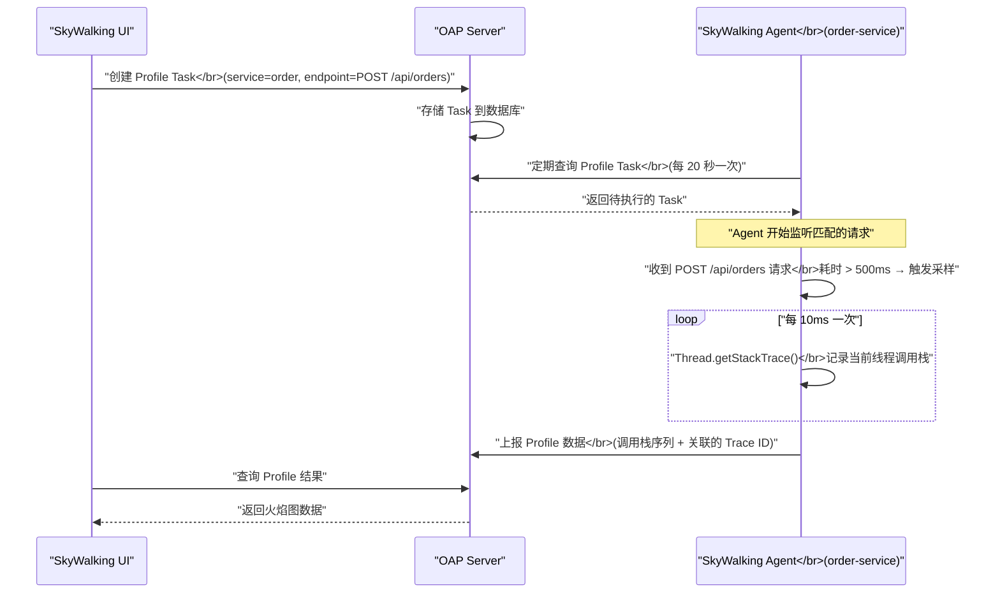
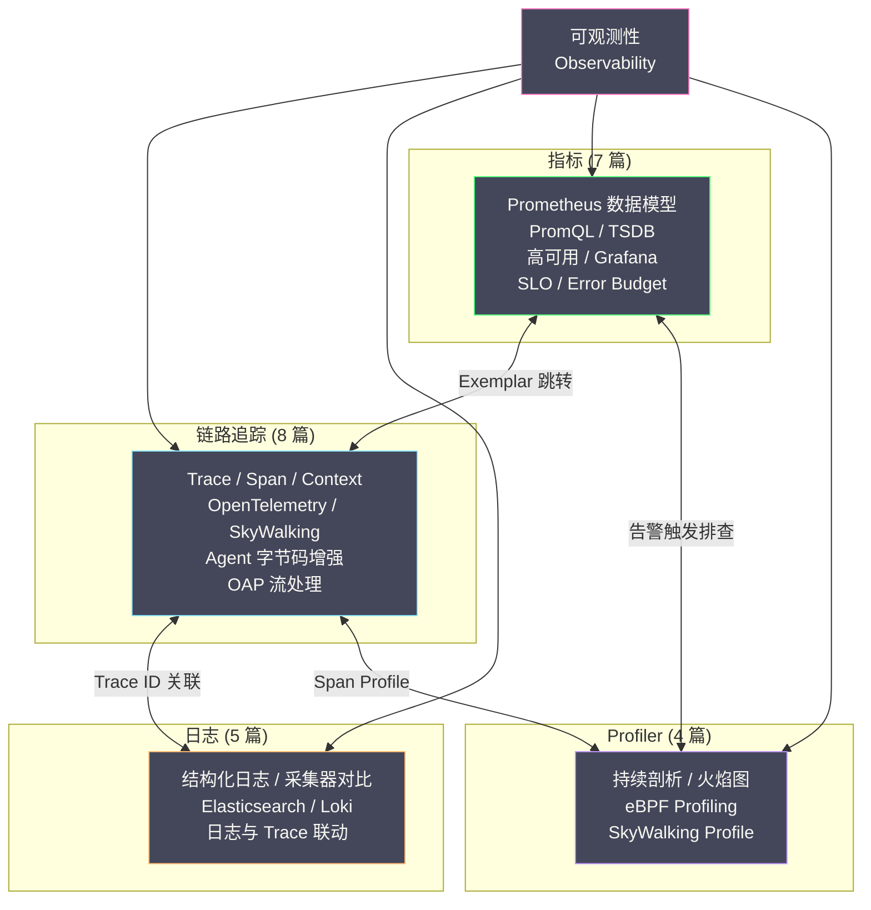

# 04 SkyWalking 集成 Profiler

**摘要：**

前三篇文章分别介绍了持续剖析的概念、火焰图的阅读技巧和 eBPF 的内核级观测能力。本篇作为 Profiler 子专栏的收官之作，回到我们在链路追踪子专栏中深入剖析过的 [[SkyWalking]] 平台，聚焦它内置的 **Profile 功能**。SkyWalking 的 Profiler 设计理念与 Pyroscope、Parca 等独立的持续剖析平台不同——它不是"7×24 小时持续采集"，而是**按需触发、与 Trace 关联**的线程栈采样。当工程师在 SkyWalking UI 中发现某个 Endpoint 延迟异常时，可以针对该 Endpoint 创建一个 Profile Task，SkyWalking Agent 会在匹配的请求执行期间高频采样线程调用栈，并将结果以火焰图的形式展示在 UI 中——直接关联到具体的 Trace 和 Span。这种"Trace → Profile"的工作流将链路追踪和性能剖析无缝打通，是 SkyWalking 作为一站式 APM 平台的独特优势。

---

## 第 1 章 SkyWalking Profiler 的设计哲学

### 1.1 为什么不是持续 Profiling

在 [[01 持续性能剖析]] 中，我们讨论了持续 Profiling 的优势——7×24 小时不间断采集，问题发生后可以回溯。那么 SkyWalking 为什么选择了"按需触发"的模式？

**原因一：开销控制**。SkyWalking Agent 已经在应用进程中运行了链路追踪的埋点逻辑（参见 [[05 SkyWalking Java Agent 字节码增强原理]]）。如果再叠加持续的 Profile 采集，Agent 的 CPU 和内存开销会进一步增加。SkyWalking 的设计原则是"对业务的侵入和影响降到最低"——按需触发意味着只在需要排查问题时才产生额外开销。

**原因二：数据量控制**。持续 Profiling 产生的数据量远大于链路追踪——每 10 毫秒一次的调用栈采样，乘以数百个线程，乘以数百个服务实例，数据量可以轻松达到 GB/小时级别。SkyWalking 的 OAP（参见 [[07 SkyWalking OAP 流处理与存储模型]]）的存储架构是为 Trace 和 Metric 设计的，不是为海量 Profile 数据设计的。

**原因三：与 Trace 的天然集成**。SkyWalking 的 Profile Task 绑定到具体的 Endpoint（如 `POST /api/orders`），采样数据自动关联到匹配的 Trace。这种"从 Trace 跳到 Profile"的工作流对于 SkyWalking 用户来说是最自然的排查路径。

> [!note] 设计取舍
> SkyWalking 的 Profiler 和 Pyroscope/Parca 不是竞争关系，而是互补关系。SkyWalking Profiler 适合"定向排查"——已经通过 Trace 定位到了问题 Endpoint，需要进一步深入到代码层面。Pyroscope/Parca 适合"持续观测"——在问题发生之前就开始采集，事后可以回溯任意时间点。两者可以在同一个可观测性栈中共存。

### 1.2 SkyWalking Profiler 的定位

在 SkyWalking 的排查工作流中，Profiler 处于**最后一环**：


---

## 第 2 章 Profile Task 的工作机制

### 2.1 创建 Profile Task

工程师在 SkyWalking UI 中创建 Profile Task，需要指定以下参数：

| 参数 | 含义 | 典型值 |
| :--- | :--- | :--- |
| **Service** | 目标服务名 | `order-service` |
| **Endpoint** | 目标接口 | `POST /api/orders` |
| **Start Time** | 任务开始时间 | 立即 / 定时 |
| **Duration** | 任务持续时间 | 5 分钟 / 10 分钟 |
| **Min Duration Threshold** | 只采样耗时超过此阈值的请求 | 500ms |
| **Dump Period** | 线程栈采样间隔 | 10ms |
| **Max Sampling Count** | 单个任务的最大采样 Trace 数 | 5 / 10 |

**Min Duration Threshold** 是一个关键参数——它确保只有"慢请求"才会被 Profile。如果阈值设为 500ms，那么耗时 50ms 的正常请求不会触发线程栈采样，避免了对正常请求的额外开销。

**Max Sampling Count** 限制了单个任务采集的 Trace 数量——避免在高流量下产生过多的 Profile 数据。

### 2.2 Task 下发与执行



**步骤一**：工程师在 UI 中创建 Task，OAP 将 Task 存储到数据库。

**步骤二**：SkyWalking Agent 定期（默认每 20 秒）向 OAP 查询是否有待执行的 Profile Task。如果有匹配当前服务的 Task，Agent 将其加载到本地。

**步骤三**：Agent 开始监听匹配的请求。当一个 `POST /api/orders` 请求到达，且执行时间超过 `minDurationThreshold`（500ms）时，Agent 启动线程栈采样。

**步骤四**：在请求执行期间，Agent 以 `dumpPeriod`（10ms）为间隔，反复调用 `Thread.getStackTrace()` 获取当前线程的调用栈。这些调用栈被暂存在 Agent 的内存中。

**步骤五**：请求结束后，Agent 将采集到的调用栈序列和关联的 Trace ID 一起上报给 OAP。

**步骤六**：OAP 将 Profile 数据存储并聚合，在 UI 中以火焰图的形式展示。

### 2.3 线程栈采样的实现细节

SkyWalking Agent 的线程栈采样核心逻辑如下：

```java
// 简化的采样逻辑（非实际源码，展示核心思路）
public class ProfileThread implements Runnable {
    private final Thread targetThread;       // 被 Profile 的业务线程
    private final int dumpPeriodMs;          // 采样间隔（如 10ms）
    private final List<StackTraceElement[]> stacks = new ArrayList<>();

    @Override
    public void run() {
        while (targetThread.isAlive() && !stopped) {
            // 获取目标线程的调用栈
            StackTraceElement[] stack = targetThread.getStackTrace();
            stacks.add(stack);
            
            // 等待下一次采样
            Thread.sleep(dumpPeriodMs);
        }
        // 采样结束，上报数据
        reportToOAP(stacks);
    }
}
```

**`Thread.getStackTrace()` 的开销**：这个方法需要 JVM 暂停目标线程以读取其调用栈——这是一个 "stop-the-world" 操作，但只影响被采样的那个线程，且暂停时间极短（通常不超过 100 微秒）。在 10ms 的采样间隔下，开销约为 100μs / 10ms = 1%——可以接受。

**与 async-profiler 的对比**：SkyWalking 使用 `Thread.getStackTrace()` 而非 async-profiler 的 `AsyncGetCallTrace`，原因是前者不需要额外的 native 库依赖——SkyWalking Agent 是纯 Java 实现的，可以在任何 JVM 上运行。缺点是 `Thread.getStackTrace()` 受 Safepoint Bias 的影响（参见 [[02 火焰图阅读与性能问题识别]]），但对于大部分业务代码（方法调用粒度较粗），Safepoint Bias 的影响可以忽略。

---

## 第 3 章 Profile 结果的分析

### 3.1 在 SkyWalking UI 中查看 Profile

SkyWalking UI 的 Profile 页面展示以下信息：

**Task 列表**：显示所有创建过的 Profile Task，包括状态（进行中/已完成）、采集到的 Trace 数量。

**Trace 选择**：每个 Task 下列出被采样的 Trace。每条 Trace 显示其 Trace ID、Endpoint 名称、总耗时。

**火焰图/线程栈视图**：选择一条 Trace 后，展示该 Trace 执行期间采集到的线程调用栈——以火焰图或栈列表的形式。

### 3.2 解读 Profile 数据

SkyWalking 的 Profile 数据是一个**时间序列的调用栈快照**——每 10ms 一个快照，按时间排列：

```
t=0ms:   main → handleRequest → processOrder → queryDB
t=10ms:  main → handleRequest → processOrder → queryDB
t=20ms:  main → handleRequest → processOrder → queryDB
t=30ms:  main → handleRequest → processOrder → serialize
t=40ms:  main → handleRequest → processOrder → serialize
...
t=800ms: main → handleRequest → processOrder → serialize
```

从这个序列中可以看出：
- `queryDB` 占了 3 个快照 × 10ms = 约 30ms
- `serialize` 占了 77 个快照 × 10ms = 约 770ms
- **`serialize` 是这次慢请求的瓶颈**

SkyWalking UI 将这些快照聚合为火焰图，与 [[02 火焰图阅读与性能问题识别]] 中介绍的阅读技巧完全适用。

### 3.3 Profile 与 Trace 的关联

SkyWalking Profile 的最大优势是**Profile 数据天然关联到 Trace**：

- 你可以先在 Trace 视图中看到 `processOrder` Span 耗时 800ms
- 然后切换到 Profile 视图，看到同一条 Trace 的火焰图
- 火焰图显示 `serialize` 占了 770ms
- 进一步看到 `serialize` 内部调用了 `ObjectMapper.writeValueAsString`

这种从 Trace 到 Profile 的无缝跳转，消除了"链路追踪告诉你慢在哪个 Span，但无法深入到代码层面"的盲区。

---

## 第 4 章 生产实践建议

### 4.1 何时使用 SkyWalking Profile

**适用场景**：
- 通过链路追踪发现某个 Endpoint 延迟异常，需要进一步定位代码热点
- 问题可复现（或持续存在），可以在问题发生时创建 Profile Task
- 目标是 Java 服务（SkyWalking Agent 的 Profile 功能目前主要支持 Java）

**不适用场景**：
- 问题是偶发的且无法复现——此时需要持续 Profiling（Pyroscope/Parca）
- 需要 Profile 非 Java 语言的服务
- 需要内核态的调用栈分析（需要 eBPF）

### 4.2 Profile Task 的参数调优

**Dump Period（采样间隔）**：
- 10ms（默认）：适合大部分场景，每秒 100 个快照，开销约 1%
- 5ms：更高精度，适合排查非常短的热点函数，但开销增加到约 2%
- 50ms：更低开销，适合对性能极其敏感的服务，但可能错过短暂的热点

**Min Duration Threshold（最小耗时阈值）**：
- 设置为当前 P99 延迟的 2~3 倍——确保只有"真正的慢请求"才被 Profile
- 例如：如果正常 P99 = 200ms，设置阈值为 500ms

**Duration（任务持续时间）**：
- 不要设置太长——5~10 分钟通常足够捕获几条慢请求
- 太长的任务会让 Agent 长时间保持监听状态，增加不必要的资源消耗

**Max Sampling Count**：
- 5~10 条 Trace 通常足够分析——同一个 Endpoint 的慢请求热点通常是一致的
- 设置过大会产生过多的上报数据

### 4.3 结合其他信号的完整排查流程

```
1. 指标告警：order-service P99 > 2s
   → Grafana 仪表盘确认告警

2. 链路追踪：在 SkyWalking Trace 页面搜索慢请求
   → 发现 POST /api/orders 的 processOrder Span 耗时 2.5s
   → 但 Span 内部只有一个 MySQL 查询 Span（50ms），其余 2.45s 不可见

3. 创建 Profile Task
   → Service: order-service
   → Endpoint: POST /api/orders
   → Min Duration: 1000ms
   → Dump Period: 10ms
   → Duration: 5min
   → Max Sampling: 5

4. 等待 Profile 完成
   → 5 分钟后回到 Profile 页面
   → 选择一条被采样的 Trace

5. 分析火焰图
   → 发现 serialize() 占了 80% 的 CPU 时间
   → 进一步看到是 Jackson ObjectMapper 在处理一个嵌套很深的对象

6. 修复
   → 优化 DTO 结构，减少序列化字段
   → 或者缓存序列化结果

7. 验证
   → 部署后观察指标恢复正常
   → 可以再次创建 Profile Task 对比火焰图（手动 Diff）
```

### 4.4 SkyWalking Profile 的局限与补充

| 局限 | 补充方案 |
| :--- | :--- |
| 不是持续 Profiling（问题需要可复现）| 部署 Pyroscope/Parca 作为持续剖析补充 |
| 只支持 Java（Agent 限制）| 使用 eBPF Agent（Parca/Pyroscope）覆盖其他语言 |
| 受 Safepoint Bias 影响 | 关键场景使用 async-profiler 作为补充 |
| 无法看到内核态调用栈 | 使用 perf/eBPF 获取内核态信息 |
| 采样数据量有限（Task 持续时间短）| 增大 Duration 和 Max Sampling Count |

---

## 第 5 章 可观测性专栏全景回顾

### 5.1 四大支柱的完整图谱

本篇是整个可观测性专栏的最后一篇文章。从 [[00 可观测性全景导览]] 出发，我们依次深入了四大可观测性支柱：



### 5.2 四大信号的协作

| 信号 | 回答的问题 | 核心工具 |
| :--- | :--- | :--- |
| **指标** | 系统整体健康吗？哪里异常？| [[Prometheus]] + [[Grafana]] |
| **链路追踪** | 一个请求经过了哪些服务？慢在哪里？| [[SkyWalking]] / [[OpenTelemetry]] + [[Grafana Tempo]] |
| **日志** | 某个时刻发生了什么事件？| [[Elasticsearch]] / [[Loki]] |
| **Profiler** | 代码内部在做什么？CPU 花在了哪里？| [[Grafana Pyroscope]] / [[SkyWalking]] Profile |

四种信号不是孤立的——它们通过**关联机制**形成完整的排查闭环：

- 指标告警 → 通过 Exemplar 跳转到链路追踪
- 链路追踪 → 通过 Trace ID 关联到日志
- 链路追踪 → 通过 Span Profile 关联到 Profiler
- 日志 → 通过 Derived Fields 跳转到链路追踪

掌握了这四种信号及其关联机制，就建立了一套完整的可观测性能力——从"发现问题"到"定位根因"的全链路覆盖。

---

## 参考资料

1. SkyWalking Documentation - Profile：https://skywalking.apache.org/docs/main/latest/en/setup/backend/profile/
2. SkyWalking Blog - Thread Profiling：https://skywalking.apache.org/blog/
3. Wu Sheng (2020). *SkyWalking Profile Design*. Apache SkyWalking GitHub Wiki.
4. 链路追踪子专栏：[[04 SkyWalking 整体架构深度解析]]、[[05 SkyWalking Java Agent 字节码增强原理]]
5. Profiler 子专栏：[[01 持续性能剖析]]、[[02 火焰图阅读与性能问题识别]]、[[03 eBPF Profiling 内核级性能观测]]
