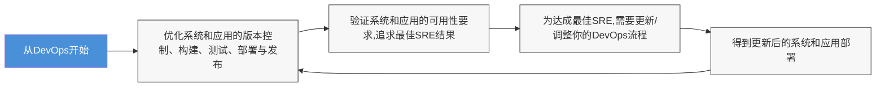

# 第1章  
## 站点可靠性工程基础

在本章中，我将向你介绍作为实践的站点可靠性工程（SRE）的基础，以及成为或即将成为站点可靠性工程师（SRE）意味着什么。从谷歌多年前设定的基线出发，本章涉及IT运维和软件开发的核心特征。接着，强调协作的重要性，帮助组织在不出现重大停机的情况下运行业务关键型工作负载。

通过本章的学习，你应该能够做到以下几点：
- 理解SRE的历史
- 区分DevOps与SRE
- 识别SRE相关的最佳实践
- 理解SRE的挑战
- 阐明SRE角色的先决条件

## 站点可靠性工程的历史

历史上，组织依赖系统管理员（sysadmin）来部署和管理数据中心组件，包括存储、网络、系统和安全。另一方面，开发人员负责创建软件并专注于开发方面。实际应用程序工作负载的部署通常也由系统管理员执行。

这常常在工作负载部署到生产环境之前、期间和之后产生摩擦。更甚者，当出现问题时（想象一个Web应用程序不再运行，或Web应用前端无法连接到数据库后端），通常排查起来既令人沮丧又耗时。系统管理员从系统视角解决问题，验证网络、防火墙、系统进程等；开发人员则从软件视角定位故障，验证代码。听起来很熟悉，对吧？

你正在阅读这本书，这让我觉得你正在寻找一种更好的方法来保证应用程序工作负载的正常运行时间。这就是SRE的基础。

站点可靠性工程（SRE），既指实践也指工作岗位角色，可以追溯到谷歌工程副总裁Ben Treynor Sloss，他是该术语的创始人。SRE背后的基本思想是：负责运维任务（以及相关故障）的技术团队应将这些问题视为软件问题。其原因是，谷歌的技术团队在招聘时始终坚持招聘工程师，无论他们最终进入运维团队还是开发团队。谷歌从未真正以系统和数据中心管理员的角色划分；管理员也被称为工程师。

因此，处理运维问题与处理软件问题没有根本区别的基本原则也解释了SRE与DevOps之间的混淆。我稍后将详细解释这一点。

SRE中的“Site”具有双重含义。最初，当谷歌主要关注谷歌网页搜索引擎（www.google.com 及本地域名）时，“Site”字面意思就是确保这个主页面“谷歌站点”始终可用。但多年后，它应扩展为“服务”。在谷歌内部，SRE实践显然被用于比搜索引擎网站更多的服务，例如Gmail、Google Maps等众多其他服务。如果将SRE置于谷歌之外来看，可以合理地说，“Site”也可以指“服务”，包括本地数据中心，以及混合云或公有云服务。

> [!NOTE] 一个有趣的旁注：我听说谷歌工程师之所以希望确保谷歌搜索网站始终可用，是因为它的用途远不止搜索。当你连接到公共Wi-Fi热点或想验证3G/4G/5G移动网络连接时，你首先尝试连接的网站是什么？如果该网站没有响应，你会认为是连接有问题，而不是网站本身宕机（……谷歌从不会宕机，对吧？）。

术语中的最后一部分“可靠性”，指应用程序工作负载在可用性和性能方面的良好运行程度。过去四十年来，IT行业的一个误解是，所有应用程序都应始终100%高可用。我个人喜欢微软对SRE的简短定义（https://learn.microsoft.com/zh-cn/azure/site-reliability-engineering/）：

> “站点可靠性工程是一门工程学科，致力于帮助组织可持续地在其系统、服务和产品中实现适当的可靠性水平。”

从该定义中，我们可以了解到SRE的核心目标是朝着对整个业务（或特定应用程序工作负载）可接受的可用性水平努力，而很少是所有工作负载都达到100%。简单来说，你的午餐订购应用网站（员工可以在上面订购三明治）的可用性要求，会比你面向客户、用于订购产品的电子商务网站的低。

## 为什么SRE不是DevOps 2.0

有趣的是，SRE这个缩写在过去几年中获得了发展势头，并被视作DevOps的更新版本。然而，我们需要退后几步才能真正理解它们并不相同。

如你所知，SRE的主要目标是优化服务的可靠性和可用性。而DevOps则是一种方法论，允许组织以更快的速度增量式部署应用程序更新，从而实现更优化的应用程序生命周期管理。

最终，我会将DevOps描述为实现SRE的一种方式。当你的应用程序工作负载可以通过自动化流程（根据使用的工具不同，可能包括流水线、操作、任务、作业等）进行部署，并且开发团队和运维团队朝着同一目标协作时，这应该也有助于提高应用程序工作负载的正常运行时间。关键点是“应该”，因为这也可能对可用性产生影响。

我们也可以引用《站点可靠性工作手册：实现SRE的实用方法》（https://sre.google/books）第一章中的一句话：

> “Class SRE implements interface DevOps.”

它用不同的词语表达了类似的想法。SRE通过实施DevOps（以及本书后面讨论的其他实践）来获得更好的可靠性。

不久前，我有一个客户使用了一个场景：他们建立了一条端到端的流水线，用于将新的代码片段发布到分布在全球不同地区的Web应用程序。从流水线的角度来看，部署运行正常——获取源代码工件、部署到验证环境、最终落地到生产环境。因此，从DevOps（流水线）角度来看，满意度为100%。然而，托管提供商恰好处于维护窗口期，导致特定地区的应用程序在流水线发布新代码后仅几秒钟就发生了宕机。排查起来很麻烦，因为流水线显示为绿色，而其他地区的网站运行正常（这些地区也从同一流水线发布了相同的代码）。

这个场景让我回到了之前使用的动机：最终，DevOps是实现SRE的一种方式（部分实现，其他技术将在后面讨论），但它并非100%万无一失。但是，你之前不是学过SRE并不追求100%可用性吗？

**图1-1. SRE 和 DevOps**

**图1-1说明：** SRE和DevOps之间的关系是迭代和互补的。

这里重要的是，SRE远不止是IT行业（或其消费者）试图取代DevOps的错误印象。事实上，它甚至不接近试图这样做。之所以存在这种误解，是因为行业最近谈论SRE比谈论DevOps多得多（也许我们对DevOps已经谈得够多了？太多了？），因此给我一种错误的印象——实际上这两种流派更多地是互补，而不是相互冲突或取代。让我们引用Donovan Brown对DevOps的定义（https://devblogs.microsoft.com/devops/what-is-devops-donovan/）：

> “DevOps是人、流程和产品的结合，以向最终用户持续交付价值。”

如果我们将它与之前提到的SRE定义进行比较，我们可以清楚地看到这两种现代运维实践之间的区别：

- **DevOps** 主要关注持续交付价值。
- **SRE** 专注于实现工作负载的可持续可靠性。

DevOps主要基于精益方法论和CI/CD实践，而SRE更多地关注你的生产工作负载的运维实践。这两种定义都会有一些重叠的实践，但在当今组织中它们可以明显互补。

SRE和DevOps之间的另一个重要区别是，DevOps更侧重于在团队之间培养协作文化；它可以被视为一种哲学。即使我们有DevOps工程师（我个人认为他们更像是DevOps架构师）这个角色，但我认为DevOps是一种组织必须自上而下拥抱并自下而上变革的文化。另一方面，SRE可以被看作一个技术性更强、更偏向工程化的流程/角色，它较少依赖于组织的文化。

**表1-1. Westrum 类型学**

| 病态型（权力导向）             | 官僚型（规则导向）               | 生成型（绩效导向）               |
|----------------------------|------------------------------|-------------------------------|
| 低协作                      | 适度协作                        | 高协作                          |
| 信使被“枪毙”                 | 信使被忽视                       | 信使得到培训                     |
| 推卸责任                     | 狭隘的责任                       | 风险共享                        |
| 不鼓励搭桥                   | 容忍搭桥                         | 鼓励搭桥                        |
| 失败 → 找替罪羊              | 失败 → 公平处理                  | 失败 → 调查学习                  |
| 创新被压制                   | 创新成问题                       | 创新被实施                      |

## Chapter 1  Site Reliability Engineering基础

> [!NOTE] 上下文连续性说明
> 本部分接续上一部分内容，延续第1章的内容。上一部分末尾的表格（关于西格尔组织文化模型）在此不再重复翻译。

### Clarify Prerequisites to the Role of SRE

在本导言章节的最后这一节，我想从一个职位角色的角度，更深入地探讨成为一名SRE（或正在从事SRE工作）需要具备哪些条件，回答诸如以下问题：

-   成为一名[[Site Reliability Engineer|站点可靠性工程师]]需要什么？
-   需要多少年的经验，以及具体需要哪些经验？
-   我是一个100%的开发者。我能成为SRE吗？
-   我是一个100%的系统管理员。我能成为SRE吗？
-   我的组织没有使用云。我们需要SRE吗？

**Chapter 1  Site Reliability Engineering基础**

-   我们自认为已建立了扎实的DevOps方法论。为什么还要转向引入SRE？
-   我完全没有接触过DevOps。我能成为SRE吗？

一个[[Site Reliability Engineer|站点可靠性工程师]]需要不断切换角色。一名SRE至少应将50%的时间用于开发任务，另外50%的时间用于运维和事故处理。除了在这两个领域都具备专家级的技术技能外，SRE还必须拥有出色的沟通能力。

依我看来，一个合适的候选人主要是具备系统和网络知识的开发人员，或者是一位对软件开发有足够了解的经验丰富的系统管理员。其专业水平很难界定，但我认为在任何一种角色上至少需要五年的经验，才应该考虑转向SRE职位。请不要因此误解；如果你目前正从事SRE领域的工作，但尚未达到五年经验，请先别感到受伤。虽然理想情况下，一个SRE团队不会在其整体工作内容上进行区分，但我确实见过SRE团队内部存在某种专业化或焦点领域。将容器和Kubernetes作为SRE的常见目标环境，它是一个相当封闭的场景，只触及一种特定的架构；而在现实中，一个组织可能使用了Kubernetes环境之外的更多服务、系统和应用程序。我认识一些个人，他们在为客户运行的Kubernetes集群担任SRE角色时表现出色，但他们不接触网络方面的事务，也不对现有的身份解决方案进行操作，等等。这本身完全没问题，因为再次重申，SRE是一项团队运动。

我相信你们中的很多人对这本书感兴趣，是因为希望在组织内部或外部转向SRE角色，并学习如何达到目标。

**Chapter 1  Site Reliability Engineering基础**

没有明确的路径或现成的“成为站点可靠性工程师”的准备轨迹。这正是SRE的职责和责任如此多样化的原因所在。

核心上，一名SRE应该在系统领域感到非常自如，以理解操作系统、TCP/IP网络、路由、防火墙、DNS等作为起点。其次，熟悉至少一种开发语言（Python、Java、C# 等）绝对是有益的。深刻理解组织正在使用的数据中心或云环境也至关重要。了解服务器之间如何通信，了解身份和治理是如何安排的，并识别进出主要运行工作负载的流量。全面理解端到端的应用程序工作负载拓扑。识别可扩展性、性能和高可用性的特征。

最好，你已经积累了修复事故的经验。我仍然坚信，最好的学习方式是“脚踩实地”，或者说是“泥泞中前行”。如果你从未经历过宕机期间的紧张压力，从未经历过高层管理者每隔几分钟就问一次工作负载还需要多久才能恢复，而你正竭尽全力让它重新上线的情况，你就不会有应对这种局面的“带宽”或“肌肉记忆”。

更进一步，一名SRE应该对监控和可观测性有深入理解，既包含日志、指标和追踪的一般概念，也包含对组织内已有监控解决方案（无论是本地部署还是云服务）的更深入理解。最终，所有系统和应用程序工作负载在某个点上都是相互连接的。因此，了解在“着火”期间的哪个组件应该去哪里寻找信息，可能至关重要。

**Chapter 1  Site Reliability Engineering基础**

最后，熟悉（或成为专家）DevOps实践，以及组织内使用的DevOps工具。了解如何运行自动化管道以将工作负载部署到不同环境，理解审批流程是如何设置的，以及部署失败时的回退策略是什么，等等。

除了这里列出的技术技能之外，请允许我回到SRE角色中更偏向“软技能”的一面。成为一个好的沟通者是关键，我认为这显而易见。如果你在宕机期间把自己锁在屏幕后面，猛敲按钮试图修复问题，却不沟通你在做什么，这只会增加团队内外的压力水平。理想的SRE是自信的（虽然不能过于自信）、有条理的，并且习惯于处理关键任务型工作负载（及其相应的宕机）。这就像同时集秘书（组织技能）、急诊室医生（紧急情况）、消防员（带有风险的紧急情况）和护士（冷静）于一人。

最后，拥有良好的演示技巧绝对是一项优势。作为一名经验丰富的SRE，你通常需要定期向你的团队（站立会议或回顾会议）、向业务利益相关者（危机会议和事后分析）以及向“外部人员”进行反馈。这可以是围绕SRE的会议或研讨会，也可以是与志同道合的企业或技术团队的会议，在会议上展示你作为SRE的成功之处。

### Identify Best Practices Around SRE

写关于最佳实践的内容有点令人紧张，因为我知道紧接着这一章之后，还有一整章专门介绍构成站点可靠性工程的核心术语和定义。请把这部分看作是我影响你们，让你们对在组织中实施SRE感到满意，并激励你们阅读这本书的方式。还有什么比分享最佳实践更好的方式呢，对吧？

**Chapter 1  Site Reliability Engineering基础**

#### Automate Everything

虽然这不是实施SRE实践的最终目标，但我要开始的最佳建议是尽可能转向自动化。要知道，SRE的基础是最大化工作负载可接受的韧性，这意味着你需要自动化。回顾SRE历史的第一段，我谈到了系统管理员和开发人员为解决一个事故投入了巨大努力，这主要与这样一个事实相关：故障排除和分析一个事故通常需要人工手动劳动。而人工劳动耗时且昂贵。

如果你可以依靠自动化来将应用程序部署到测试环境，依靠自动化在测试环境中运行测试，集成自动化以重新部署到生产环境，并依靠自动化来监控和管理生产工作负载的可靠性，那会怎样？最后，再引入自动化来减轻事故期间的中断？听起来好得令人难以置信？请坐稳，这正是我们在后续章节中使用Azure DevOps、GitHub Actions 或无服务器解决方案（如Azure Functions、Logic Apps等）将要涵盖的内容。

在SRE领域中，依赖手动方式来完成任何工作或执行任务被称为[[Toil|琐事]]。因此，我们可以将这一主题概括为：SRE的另一个目标是避免“琐事”。（我将在下一章作为SRE术语细节的一部分，对此进行更多说明。）

#### Identify Acceptable Service Levels

我知道我将在下一章更详细地讨论服务等级，以及SRE世界中其他几个重要的术语。理解到你的SRE实施只有在识别出可接受的服务等级时才能成功，这一点至关重要。这里，“可接受”这个词很重要。从开头的段落中应该已经清楚，始终追求所有工作负载的100%可用性

**Chapter 1  Site Reliability Engineering基础**

是毫无意义的。事实上，从来都是如此。然而，更为重要的是，要为你组织运行的不同服务、系统和应用程序工作负载，梳理出不同的服务等级。仅仅想出一个通用的数字仍然不行。这需要花费相当多的时间和精力，与技术（IT团队）和非技术的业务利益相关者共同讨论这个话题。

我还提到了相当通用的术语“服务等级”，你可能想到的是服务等级协议（SLA）。尽管它可能是行业中最常见和最广为人知的指标，但实际上它是最不具技术性的一个。它不过是服务提供商在未达到SLA时向客户进行财务补偿的一个参考数字。实际上，该服务实际的技术性服务等级目标（即“真实”的可用性目标）将比可预见的SLA要求更高。

#### Be Focused on Engineering

从SRE的定义可以清楚地看到，专注于工程是整合成功SRE实践的关键组成部分。这在现实生活中意味着，一个成功的SRE团队应该是软件工程师（大多数人会称他们为开发者）和技术工程师（对工程有亲和力的高级系统管理员）的良好混合。在早期谷歌SRE时代，技术工程师主要是拥有网络和操作系统专业知识的UNIX系统管理员，但他们也能理解并编写代码。不过，其编程能力并未达到全职开发者的水平。拥有开发技能对技术工程师来说是有益的，因为它使得你可以更快、更好地整合我们之前提到的“自动化一切”原则。

# 第1章 站点可靠性工程基础

## 图1-2：谷歌指导原则

- 团队中50%为软件工程师，50%为技术工程师。
- 团队50%的精力投入于“运维”工作，50%投入于“开发”任务。

## 理解SRE的挑战

许多组织愿意采用SRE，但他们对从何处入手、集成流程可能是什么样子以及何时能看到结果缺乏清晰的认识。

我先前已提到，SRE伴随着若干依赖性，这与我们在IT行业中讨论的其他几乎所有内容类似。

以下是我经常向考虑为其工作负载引入SRE的客户提出的一系列初始问题示例：

- 工作负载运行在哪里（本地、混合云、公有云）？
- 当前可达到的可用性水平是多少？预期的可用性水平是多少？
- 当前开发、测试、部署和管理应用程序及系统的实践是怎样的？
- 目前已在多大程度上实现了自动化？
- 您是否已经使用了与DevOps相关的规划方法论？如果是，是哪种？敏捷、Scrum、看板等？
- 您当前的监控模式是怎样的？
- 您如何端到端地管理事件？

因此，根据答案和所表达的成熟度水平，这可能会首先开辟更多需要解决的挑战，或者使SRE集成过程更加直接。

我在实际中看到的另一个挑战是，每个组织都是相当独特的。对某些组织有效的方法可能对其他组织无效。扩展上述问题清单并安排一次“见面会”环节，尽可能多地了解当前的工作方式，这可能是值得的。

实施SRE成本高昂。无论你将其视为陈述句还是疑问句，你可能都会理解，将SRE集成到你的环境中需要付出与学习曲线相关的成本。这始于真正理解SRE的含义，花时间构建系统和应用程序清单，并与业务部门进行可重复且持续的对话和会议，以收集尽可能多的信息。一旦你完成了所有这些映射，真正的工作就可以开始了。如何决定用于自动化的工具？如何培训现有的技术团队使其做好准备？一个优秀的SRE团队应该有多大？等等。

从成本的另一面来看，我希望我不必说服IT行业的任何人：面对事件和停机同样极其昂贵。我记得看过Gartner的数据，在一小时停机时间（在承载业务关键工作负载的企业环境中）的成本高达30万美元。正如我之前所说，显然这取决于具体情况。但对我而言，基于我通常工作的企业客户领域，这个数字感觉是合理的，有时甚至还有点低估。如果你想想像亚马逊电商、Netflix、Spotify以及许多其他组织，它们每周7天、每天24小时在互联网上活跃，每小时转售服务和产品就能赚取数百万美元……是的，这个数字可能会相当快地上升（或下降）。权衡之处在于，你必须估算建立SRE团队和可靠系统架构/流程的成本（我在上一段中谈到的），以及它与停机成本的关系，并判断业务是否愿意承担这种风险。

一个组织在采用SRE时，如果从一个特定的工作负载或一个特定的部门开始作为起点，可能会更容易成功。首先在较小的范围内积累最佳实践、指导方针和经验，然后再扩展到组织的其余部分或你所运行的其他业务关键工作负载。带着大推土机冲进来，摧毁当前的运维和开发周期，然后用全新的实践彻底改造它们，这肯定是行不通的。我见过试图这样做的组织，结果惨败。而且，这还会立即破坏那种（受DevOps影响的）文化，而这种文化对于让这一切奏效如此重要。尝试将SRE团队成员定位为大型IT团队中的一个较小、更专注的单元，而不是像特警队那样具有排他性。我个人不喜欢SRE比其他团队成员（如系统管理员或开发人员）“更好”的想法。这正是我喜欢谷歌原始SRE方法的原因：每个人都是工程师，每个人都是平等的，没有特权。因为最终，你们都需要一起工作，你们都是平等的，当重大事件发生时，你希望每个人都朝着同一个方向看 —— 致力于修复事件。并且不要忘记无责事后复盘。没有人比其他任何人更好；如果出了问题，除了整个工程团队，没有人应该受到指责。

我看到的另一个挑战，老实说也是促使我写这本书的最大驱动力，就是SRE在该领域仍然不为人们所知。一些令人困惑的话题已经在前面提及，特别是DevOps与SRE的关系（或缺乏关系），但除此之外，在实施站点可靠性工程所需的内容上，缺乏清晰的文档、明确的指导、培训材料、最佳实践等。有一种误解是——因为这是谷歌提出的——认为SRE只与大规模、多地域部署的工作负载相关。但我不同意这种观点。任何拥有自己数据中心、或控制自己混合云或云运行服务的组织，都可以从SRE中受益。

根据我到目前所看到的，SRE最大的成功来自于整个组织从上到下的全面支持和赞助，从最高层的C级管理层，一直到技术团队和应用程序所有者，再加上关于流程、运作模式和设定明确期望的流畅沟通。这一切写在一个段落里听起来很容易，但实现起来比想象的要困难得多。这就是为什么许多组织一开始就害怕考虑SRE的原因。

关于监控挑战，我们已经有所提及，因此我们在本书末尾专门用一整章来讨论这个问题，这对许多组织来说总是令人惊讶的。简单来说，你无法管理你无法监控的东西。虽然大多数组织都实施了监控，但并非所有监控都是平等的。监控不仅仅是观看CPU、内存和磁盘负载的图表。你需要朝着360度全方位视图努力，覆盖从数据中心最低层一直到连接到应用程序的最终用户的整个范围。仅验证系统是否正常运行已不再可接受，你应该挑战你的监控基线，以提供服务和服务级别的概览，显示正在发生什么。并且始终，你应该能够在最终用户报告问题之前检测到问题。因此，实施SRE的一个重大责任将在于为你的业务利益相关者提供端到端的监控服务。

我要抛出的最后一个挑战是**缺乏事件**，这意味着不需要SRE团队。是的，这种情况确实存在：有些组织将其系统和应用程序实施得非常好，以至于几乎不面临停机。这实际上可能会带来一种虚假的舒适感，当事件最终发生时，可能会危及对事件的缓解，因为团队没有准备好处理它。想想像疫情、意外的自然原因、不满员工的破坏性操作等此类意外事件。即使你的流程如此顺畅，你从未真正需要应急救火，也始终确保你的团队做好准备。

我还有最后一个例子，与前面一个相反。如果组织如此专注于几乎不实施变更，那么他们就没有导致停机的风险。可能还有许多其他组织的例子完美地介于两者之间。无论你怎么看，任何组织如果正确实施SRE，都可以并且将会从中受益。另一种极端情况是在重大迁移期间（可能每几年一次）面临挑战，例如更换服务器或迁移数据中心。这些也是我们熟悉的更传统、超遗留的环境，它们也尽可能避免混合云或公有云环境的集成或扩展，所有这些都是为了避免“风险”。由于本书的重点是如何在Azure中正确集成和实现SRE，我不确定这些组织中是否会有很多人会通读这本书。

## 总结

在本章中，我向你介绍了作为实践和角色的站点可靠性工程。从回顾SRE的一些历史开始，你学习了将SRE集成到组织中的挑战和收益。我们简要触及了SRE与DevOps不同之处（但不是DevOps的替代品）这一令人困惑的方面。此外，我尝试列出了一些使优秀站点可靠性工程师脱颖而出的特征和先决技能。

在下一章中，我们将花大量时间澄清SRE领域中使用的许多典型且关键的术语。