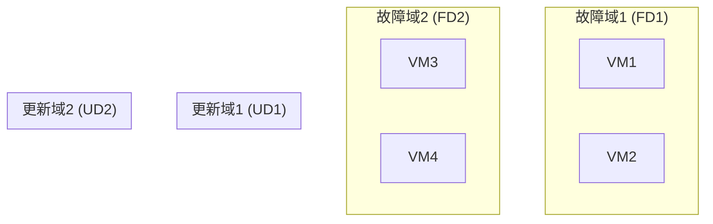
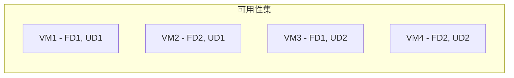
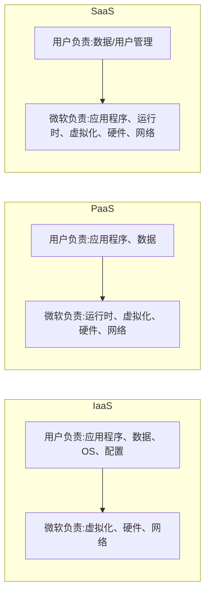

# 第4章 在Azure中设计弹性解决方案

© Unai Huete Beloki 2025  
U. H. Beloki, *The Art of Site Reliability Engineering (SRE) with Azure*,  
<https://doi.org/10.1007/979-8-8688-1545-4_4>

第3章从概念层面回顾了Azure良好架构框架的五大支柱，重点介绍了可靠性支柱。本章则以更实际的方式聚焦于[[弹性 (Resiliency)]]主题，展示Azure提供的主要功能，以便让解决方案更具弹性。

学完本章后，你应该能够理解以下内容：

- 什么是弹性
- Azure上的弹性
- 可用性集
- 可用性区域
- 区域对
- 基于数字的弹性
- 应用程序设计中的弹性
- 主要使用的Azure组件和功能（用于弹性）
- 弹性架构示例
  - IaaS、PaaS/无服务器和微服务

## 什么是弹性？

如今，每个人都期望应用程序能够7×24小时运行，并提供即时服务访问。前一章将可靠的服务定义为能够最大限度减少停机时间的解决方案。在云环境中，由于其复杂性（依赖外部组件、分布式系统级联问题、无法避免的硬件故障等），试图实现零故障是不可能的。

因此，需要转变思维模式。应当预料到临时性或大规模故障，并设计解决方案以便从故障中恢复。需要设计弹性的架构，弹性定义为“从故障中恢复的能力”。

---

**图4-1. 自定义可靠性层次结构**  
[注：原文有图4-1，展示可靠性从低到高的层次，包括：基础硬件 → 基础架构冗余 → 应用弹性 → 自动恢复 → 混沌工程等。此处用Mermaid表示：]

> [!INFO]  
> 弹性实践应应用于架构的多个层面，例如应用程序代码中的重试机制或数据存储的全局副本。换句话说，构建弹性架构是每个人的责任。在深入探讨之前，必须充分理解云平台。第3章重点解释了Azure良好架构框架的基本支柱，本章将聚焦于可靠性支柱的实践示例和更加深入的细节。下面通过分析Azure云平台的特性来回顾Azure提供服务的一些重要方面。

## Azure平台弹性

如果用一种简单的方式来解释Azure云平台，它由以下元素组成：

- 向客户提供的地理区域
- 构成这些区域的数据中心（按区域组织）
- 对物理服务器和存储资源进行分组的机架，用于提供云服务

更多信息请访问：<https://news.microsoft.com/stories/microsoft-datacenter-tour/>

---

**图4-2. 更新域和故障域**  
[原文有图4-2，展示故障域和更新域的概念。故障域是具有单一故障点（电源或网络）的硬件组件组；更新域是在同一周期内升级的机器组。可用性集将VM分布在多个故障域和更新域中。用Mermaid表示：]

- **故障域**：共享单一故障点（电源或网络）的硬件组件组。例如，如果一个机架发生故障，该机架上的所有服务器/存储（及其上运行的服务）也将随之故障。
- **更新域**：在同一周期内进行更新的一组机器。如果更新未按预期进行，可能会导致问题。

Azure平台提供以下配置来克服平台相关的问题。

### 可用性集

---

**图4-3. 可用性集**  
[原文有图4-3，展示可用性集将VM分布在不同故障域和更新域中。用Mermaid表示：]

可用性集允许你防范更新和硬件相关的问题。

### 可用性区域

可用性集可防范更新和硬件问题，而可用性区域则更进一步：它将VM放置在相同区域内的不同数据中心，保护工作负载免受数据中心停机的影响。这也被称为区域冗余。每个区域具有独立的电源、网络和冷却系统，彼此之间高度连接，区域间延迟小于2毫秒。可以使用邻近放置组来实现更低的延迟。

### 区域对和Azure Site Recovery

前面的选项可提供高达99.99%的SLA（<https://www.microsoft.com/licensing/docs/view/Service-Level-Agreements-SLA-for-Online-Services>），但如何应对区域性灾难呢？

对于区域复制，可以部署跨多个区域的Azure VM，并结合存储解决方案（如存储帐户的异地冗余存储 (GRS)）来确保业务连续性。可以使用Azure Site Recovery来实现。

对于区域复制，尽量利用Azure区域对。每个区域与同一地域内的另一个区域配对，在发生大规模中断时优先处理其中一个，并且永远不会同时更新两个区域的服务，以避免停机。通常情况下，区域对位于同一地域以满足数据驻留要求。例如，美国东部-美国西部，或北欧-西欧。你可以在此处查看完整列表：<https://docs.microsoft.com/en-us/azure/availability-zones/cross-region-replication-azure#azure-cross-region-replication-pairings-for-all-geographies>。

## 基于数字的弹性

期望的弹性级别与分配给解决方案的预算之间总是需要权衡。作为SRE，你的工作是定义弹性需求，以便估算实现业务目标所需的预算。

回顾第2章解释的最常用的服务级别指标：[[SLI]]、[[SLO]]和[[SLA]]（SLI是跟踪的指标，SLO是为其定义的目标，SLA是与你客户签订的合同协议）。

如果提供给客户的SLA是99.95%（每月停机时间21.6分钟），则应将工作负载设计为始终使SLI指标高于该数字（通常为团队定义更严苛的SLO，SLO > SLA，确保在违反合同之前留有一定的错误预算）。

**表4-1. SLA/停机时间**

| SLA      | 每周停机时间 | 每月停机时间 | 每年停机时间 |
|----------|--------------|--------------|--------------|
| 99%      | 1.68小时     | 7.2小时      | 3.65天       |
| 99.9%    | 10.1分钟     | 43.2分钟     | 8.76小时     |
| 99.99%   | 1.01分钟     | 4.32分钟     | 52.56分钟    |

该表清晰表明：对于严苛的SLA，不能依赖手动修复问题。需要提供高效的事件解决和自愈解决方案。

通常，SLA不仅仅从架构可用性角度定义；在定义解决方案的SLO时，应从客户角度（客户体验）出发。例如，对于电商网站，可以定义以下SLO：“在最近30天内，支付API应保证99.9%的成功交易”。这些指标不仅受到架构/基础架构组件（例如区域和区域副本）的影响（导致组合SLA，如第2章所述）；应用程序代码如何处理这些事务（例如使用重试机制）也对成功至关重要。

建议组织对关键和非关键工作负载进行分解；许多组织使用层级来逻辑分离工作负载需求。很可能并非所有工作负载都需要最高的弹性需求和昂贵的全局复制解决方案。显而易见，一个电商网站（收入来源）与内部使用的HR网站不会具有相同的需求（层级）。

还有两个常用的恢复指标用于定义工作负载需求：

- **恢复时间目标 (RTO)**：故障发生后应用程序/服务可以不可用的最长时间。
- **恢复点目标 (RPO)**：灾难期间允许的数据丢失最长时间。

这些指标有助于确定解决方案在弹性方面的需求。RPO更侧重于数据丢失（通过数据复制/备份/时间点恢复来防止），而RTO更侧重于可用性（通过区域/区域复制服务来防止）。例如，对于RPO目标，可以使用Site Recovery频繁创建Azure VM磁盘恢复点。

回顾第2章还介绍了可用性指标的重要性，如[[MTTR]]、[[MTTF]]和[[MTBF]]。在前面的例子中，如果平均恢复时间 (MTTR) 超过RTO，则可能导致危险的业务中断（合同中定义的经济补偿），因为无法满足承诺的恢复时间 (RTO)。

在定义工作负载层级时，每个层级都会定义SLA、RPO和RTO指标。例如，使用区域冗余的Azure SQL数据库，Microsoft提供的SLA为99.995%，RTO为30秒，RPO为5秒。如果未达到SLA，可获得10%的信用额度，如果正常运行时间低于95%，则最多可获得100%的信用（<https://azure.microsoft.com/en-us/support/legal/sla/>）。

---

**图4-4. 共享责任模型**  
[原文有图4-4，展示IaaS、PaaS、SaaS下责任划分。IaaS中用户负责应用程序和OS，微软负责基础架构；PaaS中用户负责应用程序，微软负责运行时和基础架构；SaaS中微软负责一切。用Mermaid表示：]

如上所述，对于IaaS，用户负责确保弹性（可用性集/区域或全局副本），而对于Azure DevOps（SaaS），弹性由Microsoft负责。

## 应用程序设计中的弹性

大多数时候，当考虑弹性时，人们倾向于复制数据或增加基础架构组件的冗余。但应用程序架构呢？故障可能发生在解决方案的任何层面。

本书并非展示如何设计应用程序架构，但作为组织中的SRE，你应该让开发人员意识到这一责任，并鼓励他们实现如下所述的应用程序模式：

- **重试/断路器模式**：复杂的架构由多个依赖项组成。运行解决方案的微服务可能需要不断调用外部依赖项，瞬态问题很常见。应用程序应通过实现重试机制来处理这些瞬态问题。例如，如果某个服务需要调用Azure Cosmos DB读取某些对象，但收到HTTP 429（请求被限制，容量不足），则在延迟后重试可能有效。如果第一次调用后收到HTTP 401（未授权），在没有更改身份验证属性的情况下重试可能不会得到所需结果。

  > 重试机制应评估响应代码，并对反映临时问题的代码实施重试操作。实现超时以避免阻塞操作。断路器将避免执行可能失败的调用（断开电路），在延迟后测试端点，如果成功则重新闭合。

  - 许多内置的Azure库/SDK都包含对重试机制的支持：<https://docs.microsoft.com/en-us/dotnet/architecture/cloud-native/infrastructure-resiliency-azure#built-in-retry-in-services>

- **端点监控**：使用功能性检查来评估服务（以及解决方案其他部分所需服务）的运行状况。例如，Kubernetes根据健康探针重启Pod：<https://kubernetes.io/docs/tasks/configure-pod-container/configure-liveness-readiness-startup-probes/>。Azure负载均衡器（稍后将介绍许多类型）也可以根据端点的健康状况分发流量。

# 第4章 在Azure中设计弹性解决方案

- **基于队列的发布/订阅模式**：系统组件应使用基于队列的异步通信；这有助于负载均衡（生产者比消费者更快），并确保消息被消费者正确处理（例如，使用Azure Service Bus队列的“窥视与锁定”机制，可以在从队列中删除消息之前确保其已被正确处理）。

- **限制**：这是一种模式，确保客户端仅能使用资源到一定限额，从而限制自动扩展到一定程度。例如，将API托管在Azure API管理服务后面，可以通过策略应用限制。

- **幂等任务**：重复的任务应产生相同的结果。如果消费者以重复方式执行了同一任务，不应导致无效结果。

- **回退到不同服务**：例如，若应用程序尝试在Azure SQL中存储数据，经过若干次重试后仍失败，则临时将其保存在Azure Cache for Redis中（以便后续重放写入）。

- **避免亲和性**：避免“粘性会话”，因为在动态环境（如前述的自动扩缩解决方案，例如Azure Web Apps）中可能引发问题。使用Azure Cache for Redis等服务来持久化状态。

- 更多模式可参见：https://docs.microsoft.com/en-us/azure/architecture/patterns/

---

## 弹性解决方案的主要组件/平台功能

在查看一些弹性架构示例之前，回顾最常用的Azure平台弹性功能和服务可能会有所帮助。大多数弹性架构将共享这些能力；具体职责取决于你选择的解决方案类型（IaaS、PaaS或SaaS）。

### 自动扩缩

这是你在考虑提高弹性时最直观的措施之一。有两种缩放服务的方式：

- **垂直扩缩（纵向伸缩）**：与更改所选资源的容量有关，简单来说，就是更改所选定价层。例如，将Azure App Service Plan从B1（Basic 1）扩展到S1（Standard 1）。这通常会使解决方案不可用，因为Microsoft需要将实际解决方案迁移到不同的VM/服务器（停机！）。不建议对关键应用频繁更改。

- **水平扩缩（横向伸缩）**：意味着添加或删除实例副本。这是自动扩缩服务使用的缩放模式。主要与计算资源相关。

自动扩缩允许你根据收集的指标/计划设置正确数量的资源实例。但不同资源类型有所差异。资源如虚拟机规模集（VMSS）或App Service计划允许你根据规则定义运行的最小/最大实例数。

> [!INFO]  
> 其他资源如Cosmos DB或Event Hub（自动膨胀）提供自动扩缩选项，其中规则不由用户选择/定义（由平台管理）；仅定义资源的最大数量（Cosmos DB的RU/s和Event Hubs的TU）。其中一些资源（如Azure Cosmos DB）还提供无服务器选项，以优化开发/测试环境的成本。

### 负载均衡器

流量负载均衡器是弹性架构中的关键资源。它们使你能够将流量分布到解决方案的区域（以及跨区域）副本中。

许多PaaS服务（如Azure App Services）实现了无需配置的负载均衡器。Azure平台根据自动扩缩规则负责负载均衡。例如，对于一个名为SREUnaiWebapp的Azure App Service，客户端将使用默认URL `https://SREUnaiWebapp.azurewebsites.net` 进行调用，而无需关心后台使用了一个还是多个App Service Plan实例。App Services甚至允许你将流量分配到槽位，而无需管理负载均衡器本身。

当你想控制应应用的负载均衡技术时，Azure提供以下四种负载均衡服务：

- Application Gateway
- Front Door
- Load Balancer
- Traffic Manager

**表4-2：Azure负载均衡服务**

| 服务 | 全球/区域性 | 协议 | Web应用程序防火墙（WAF）支持 |
|------|-------------|------|---------------------------|
| Azure Front Door | 全球 | HTTP(S) | 是 |
| Traffic Manager | 全球 | 任意 | - |
| Application Gateway | 区域性 | HTTP(S) | 是 |
| Azure Load Balancer | 全球 | 非HTTP(S) | - |

如前所述，弹性架构将经常使用上述服务将流量负载均衡到部署的区域和跨区域副本，并跟踪这些端点的健康状况以用于故障转移场景。

> [!WARNING]  
> 需要指出的是，你的负载均衡器也可能发生故障，使你的复制解决方案“无用”。请检查负载均衡服务提供的SLA，确定是否需要添加另一个负载均衡器实例/解决方案作为回退，并在故障时更新DNS中的CNAME记录。

### 复制/冗余

Azure平台提供了多种创建冗余工作负载的方式，具体取决于所选服务。回顾本章前几节，副本可以通过选择可用区功能运行在不同的数据中心区域。一些服务（主要是数据相关的服务）还提供异地冗余功能。

例如，使用Azure App Services时，默认体验将App Service Plan VM放置在一个区域中。可选地（适用于高级计划v2和v3），可以启用可用区功能，将VM实例分布到选定区域的三个区域中。在这种情况下，异地冗余必须由客户管理，在每个区域部署一个解决方案，并利用前述的负载均衡器。

其他数据解决方案（如Azure Cosmos DB或Azure SQL）提供可轻松设置的异地冗余，只需“几次点击”即可。

当跨区域部署解决方案时（可能会显著增加成本），你需要根据定义的RTO选择**主动-主动**或**主动-被动**配置：

- **主动-主动**：两个区域均处于活动状态并处理负载均衡请求。
- **主动-被动（热备）**：流量发送到主动区域，但辅助区域已分配好实例，以备需处理请求时使用。
- **主动-被动（冷备）**：流量发送到主动区域，辅助区域实例在需要故障转移之前不分配。这会降低成本，但增加恢复时间。

---

## 弹性架构示例

为了为前面解释的概念提供实用想法，本节将针对不同类别的工作负载提供一些弹性架构示例（主要侧重于基础设施设计）：IaaS、PaaS/无服务器和微服务。

### IaaS弹性架构

- **Azure虚拟机**：这些解决方案中的VM使用以下功能：
    - **多区域**：解决方案利用多个区域。建议选择区域对。Azure Site Recovery：允许你将VM复制到另一个区域。
    - **可用区**：提供针对数据中心故障的保护。
    - **虚拟机规模集（VMSS）**：可用于根据指标或计划自动缩放VM实例。
    - **VM中的SQL Server**：利用Always On可用性组进行数据库镜像。它提供高可用性和灾难恢复。需要在不同区域托管的副本之间进行VNET对等互连（地址不应重叠）。
- **Azure Traffic Manager**：你可以实现主动-主动或主动-被动场景，并使用此服务来负载流量。在此示例中，你可以为主区域和辅助区域使用基于优先级的流量路由。健康探测可用于监控每个区域解决方案并自动故障转移。该示例没有为Traffic Manager设置备份解决方案；请考虑根据SLA和RTO指标设置另一个负载均衡实例，并在故障时更改Azure DNS中的CNAME记录。
- **Azure Load Balancer**：外部（公共）负载均衡器用于将流量分发到前端VMSS，内部（私有）负载均衡器用于SQL后端。

### PaaS弹性架构

当从本地解决方案迁移到云时，大多数组织首先将工作负载迁移到IaaS解决方案，因为它们提供了更熟悉的管理方式，并且将本地VM映像直接迁移到云似乎更自然。但云提供商的“真正”力量在于PaaS/无服务器产品，因为提供商承担了更多的责任层，提供了更简单的创建弹性解决方案的方法。

- **Azure Web App/App Service**：很多人混淆，Web App = App Service（Azure Functions也是App Service的一种，但我们通常不这样称呼）。该服务由App Service Plan（底层VM）和托管在其中的App Services组成。App Service Plan（ASP）提供99.95%的SLA（免费和共享层除外）。应定义自动缩放规则以调整实例数量来适应Web App接收的负载。默认自动缩放规则会更改App Service Plan实例的数量，将包含的Web应用复制到多个ASP实例。如果只应将选定的Web Apps缩放（复制）到这些额外实例，则可以定义**按应用缩放**。所提出的解决方案将服务部署在两个区域以提高可用性。
- **Azure Service Bus**：这是Azure提供的高级消息服务。一个Service Bus命名空间可以使用可用区来应对数据中心故障，它还提供异地灾难恢复以实现几乎即时的故障转移（它不会复制现有消息；对于主动-主动配置，…）

> 注意：原文本在图4-8后有一段关于Azure Service Bus的文字被截断，原文为：“it also offers geo-disaster recovery for almost instantaneous failover (it does not replicate existing messages; for active-active configurations,”。此处因PDF提取未完成，但按保真原则应保留现有内容。下一部分（第三部分）将包含后续内容。

# 第4章 在Azure中设计弹性解决方案

**页码：96-121**  
**描述：** 涵盖平台和应用的弹性设计、组件及架构示例。  
**第 3/3 部分**

---

## PaaS/无服务器弹性架构

- **Azure Service Bus**：这是 Azure 提供的高级消息传递服务。Service Bus 命名空间可以利用可用区来应对数据中心故障，并且还提供异地灾难恢复功能，以实现几乎即时的故障转移（它不会复制现有消息；对于主动-主动配置，请参阅此指南：https://docs.microsoft.com/en-us/azure/service-bus-messaging/service-bus-federation-overview）。在此解决方案中，Web API 将后台任务委托给 Azure Functions，队列有助于实现负载均衡。

- **Azure Functions Apps**：这是一种无服务器服务，用于运行“代码片段”，让 Microsoft 处理其余的基础设施设置、维护和扩展。它提供四种主要托管选项：消耗计划、弹性消耗计划、高级计划（Premium）和专用计划（使用 App Service 计划）。高级计划和专用计划是唯一提供区域冗余（数据中心故障保护）的选项。使用高级计划时，解决方案还会自动扩展（无需规则）。示例中展示了在两个区域部署 Functions Apps 以实现更高的可用性。

- **Azure Cosmos DB**：这是一种完全托管的 NoSQL 数据库。该服务提供的 SLA 在多区域（含写入）和可用区配置下最高可达 99.999%。它提供了简单的设置体验，可创建多个全局副本，用于读取和写入。该服务可以根据负载自动扩展。当 Cosmos DB 与可用区一起使用时，即使在区域中断期间也能提供 RTO=0 和 RPO=0！

- **Azure Cache for Redis（或 Azure Managed Redis（预览版））**：这是 Azure 提供的一种基于 Redis 开源软件的内存数据存储。将 Redis 解决方案迁移到 Azure 在维护、可扩展性和高可用性方面具有诸多优势。它提供多个层级和内存大小，其中高级和企业级提供异地复制和区域冗余以实现更高的可用性。在此解决方案中，它提供了一种更快的机制来读取数据库对象（缓存数据），卸载重复活动（如频繁查询 Cosmos DB），并且还可以作为 Cosmos DB 写入暂时不起作用时的备份（需要实现一些重写机制）。

- **Azure Front Door**：这是此示例选择的负载均衡解决方案。它还提供 CDN 功能来缓存 Web 静态内容，从而提高性能，并使用 Web 应用程序防火墙（WAF）功能保护网站免受威胁。与前面的示例类似，根据 RTO/SLA，可以设置重复的负载均衡解决方案，并在故障转移到备份时更改 DNS。

> [!figure]- 图4-8 PaaS/无服务器弹性架构  
> ![图4-8 PaaS/无服务器弹性架构描述]（此处原书有图，请参考原书图片。该图展示了Web Apps、API Apps、Functions Apps、Service Bus、Cosmos DB、Cache for Redis、Front Door等组件及其连接关系。）

---

## 微服务架构

如今设计的复杂架构通常使用微服务封装业务逻辑。云原生应用越来越受欢迎，IT 领域提供了许多解决方案，Docker 是容器化这些服务的最流行工具，而 Kubernetes 是市场上最著名的编排器。

大多数读者可能期望在此示例中看到基于 Kubernetes 的架构，但我将更进一步。2021 年底，微软宣布了一项名为 **Azure Container Apps** 的新服务（https://docs.microsoft.com/en-us/azure/container-apps/overview）。Azure Container Apps 显著降低了基于 Kubernetes 等技术带来的复杂性。它让您无需关心底层虚拟机和编排器，简化了集群配置，使更新托管微服务、定义网络属性或设计可自动扩展的工作负载变得更加容易。

> [!figure]- 图4-9 微服务弹性架构  
> ![图4-9 微服务弹性架构描述]（此处原书有图，请参考原书图片。该图展示了Container Apps、Container Registry、Cosmos DB、App Configuration、Key Vault、Front Door、DNS等组件。）

### 组件详解

- **Azure Container Apps**：如前所述，此服务不仅通过提供基础设施管理层（由 Azure Kubernetes Service – AKS 完成）来简化基于 Kubernetes 的解决方案，还负责处理 Kubernetes 配置以应用以下功能：容器的部署和更新、网络属性、扩展或密钥管理。无需 Kubernetes 清单文件；所有这些都可以通过 ARM/Bicep 文件或直接通过 Azure 门户完成。

- **环境（Environment）**：容器应用集合的隔离边界。不同环境中的应用不共享资源（计算和网络），并且无法使用 DAPR 相互通信。它负责 VNET 设置（外部/内部），但也允许使用现有的 VNET。

- **容器应用（Container App）**：它为您管理编排细节（连接到容器注册表、要使用的容器镜像、密钥或流量分发）。对于可扩展性，它支持基于 HTTP 请求、CPU/内存使用情况的自动扩展规则，或使用 KEDA 缩放器的基于事件的规则。还支持健康探测。

- **Azure Cosmos DB**：在上一节中已解释。它支持区域冗余和异地复制。

- **Azure Container Registry（ACR）**：用于保存开发团队创建的容器镜像（使用第5章所示的 DevOps 工具），并将这些镜像（及更新）分发到目标环境，在本例中为 Azure Container Apps。该服务还支持区域冗余和异地复制，以实现更高的弹性和可用性（仅限高级层）。

- **Azure App Configuration**：用于集中配置设置并能够动态更改应用程序行为而无需重启/重新部署的服务。它还可用于功能标志（在第5章中介绍）。该解决方案现在提供异地复制选项。

- **Azure Key Vault**：安全存储和访问机密（如密码、证书或加密密钥）的最佳场所。Key Vault 的内容会自动（无需设置）在区域内以及 Azure 区域对之间进行复制。当一个实例发生故障时，该服务会自动故障转移到另一个本地或区域副本。

- **Azure Front Door 和 Azure DNS**：前面已经介绍过，这是可使用的负载均衡器之一。

---

## 在 Azure 上测试弹性

本章的重点是解释在 Azure 上设计弹性架构的主要思想。但正如您可能想象的，弹性和可用性只有在测试之后才能得到证明。请记住，可用性保证正常运行时间，而弹性衡量解决方案恢复的速度。

测试应该定期进行；什么都不应该被假定。您不希望在生产工作负载中遇到意外。

> [!note] 第8章将专注于展示一些最新的 Azure 弹性测试工具：Azure Chaos Studio 和 Azure Load Testing。

---

## 总结

本章重点介绍了基于 Azure（作为云提供商）的弹性概念。它涵盖了将弹性和恢复模式纳入基础设施和应用设计的主要模式，重点介绍了 Azure 提供的基础设施能力。

此外，还介绍了最常用的恢复和弹性指标，这些指标应与您的业务需求保持一致。

最后，展示了基于不同服务类别（如 IaaS、PaaS/无服务器和微服务）的一些架构示例。

---

> [!info] 页码信息：本章内容涵盖原书第96-121页。本部分为第3/3部分。