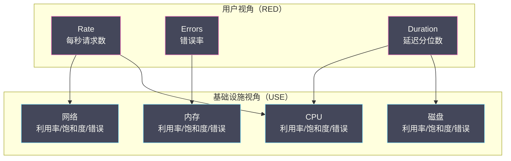

# 01 为什么需要指标

**摘要：**

指标（Metrics）是对系统状态的**数值量化**——它将"系统健不健康"这个模糊的问题转化为可计算、可比较、可告警的数字。与日志记录离散事件、链路追踪记录请求调用链不同，指标记录的是**连续的数值时间序列**：CPU 使用率每秒一个点、请求延迟 P99 每 15 秒一个点、错误率每分钟一个点。这种连续性使得指标天然适合趋势分析、异常检测和容量规划。本文从指标的定义出发，深入解析 [[Prometheus]] 定义的四种指标类型（Counter、Gauge、Histogram、Summary）的精确语义和适用场景，然后介绍 USE 和 RED 两种经典的指标方法论，帮助工程师在面对一个新系统时知道"该监控什么"。

---

## 第 1 章 指标的本质

### 1.1 什么是指标

**指标（Metric）** 是在一段时间内对系统某个维度的**数值度量**。每个指标由三部分组成：

- **名称（Name）**：描述度量的对象（如 `http_requests_total`、`cpu_usage_percent`）
- **标签（Labels）**：描述度量的维度（如 `{service="order-service", method="POST", status="200"}`）
- **数据点（Data Points）**：时间戳 + 数值的序列（如 `(14:00:00, 150)`, `(14:00:15, 163)`, `(14:00:30, 171)`）

名称 + 标签的唯一组合构成一条**时间序列（Time Series）**。例如：

```
http_requests_total{service="order-service", method="POST", status="200"}
  → 一条时间序列，记录 order-service 的 POST 请求中状态码为 200 的请求总数

http_requests_total{service="order-service", method="POST", status="500"}
  → 另一条时间序列，记录状态码为 500 的请求总数
```

### 1.2 指标与其他信号的本质区别

指标与日志、链路追踪的根本差异在于**数据形态**：

**日志**记录的是**离散事件**——每个事件是独立的，事件之间没有数学关系。你无法对"订单创建成功"和"支付超时"这两条日志做加减运算。

**链路追踪**记录的是**请求级调用树**——每条 Trace 描述一个具体请求的完整生命周期。Trace 是结构化的（有父子 Span 关系），但仍然是离散的。

**指标**记录的是**连续数值**——数据点之间有数学关系（可以计算变化率、求平均值、算分位数）。这种数学可操作性是指标的核心价值。

| 能力 | 日志 | 链路追踪 | 指标 |
| :--- | :--- | :--- | :--- |
| **回答"发生了什么"** | ✅ 详细的事件上下文 | ✅ 请求的调用链 | ❌ 只有数值 |
| **回答"有多少/多快/多高"** | ❌ 需要手动统计 | ❌ 需要聚合 | ✅ 天然支持 |
| **趋势分析** | ❌ | ❌ | ✅ 时间序列图 |
| **告警** | ⚠️ 基于日志量 | ❌ | ✅ 基于阈值或变化率 |
| **容量规划** | ❌ | ❌ | ✅ 线性回归预测 |
| **存储成本** | 最高 | 高 | 最低 |

### 1.3 为什么指标是告警的基础

告警的本质是"**当某个条件持续满足时，通知工程师**"。这个"条件"几乎总是基于指标的：

- "当错误率 > 1% 持续 5 分钟" → 基于 `error_rate` 指标
- "当 P99 延迟 > 2 秒持续 3 分钟" → 基于 `http_request_duration_seconds` 指标
- "当磁盘使用率 > 85%" → 基于 `disk_usage_percent` 指标
- "当消息队列积压 > 10,000" → 基于 `kafka_consumer_lag` 指标

日志也能触发告警（如"当 ERROR 日志每分钟 > 100 条"），但这本质上仍然是将日志转化为指标（计数）后再告警。链路追踪几乎无法直接用于告警——你不能对每条 Trace 设置告警规则。

指标的低存储成本也使其成为长期趋势分析的唯一可行选项。保留 1 年的 Prometheus 指标数据可能只需要几十 GB，而保留 1 年的日志数据可能需要数十 TB。

---

## 第 2 章 四种指标类型

[[Prometheus]] 定义了四种指标类型，覆盖了几乎所有的监控需求。理解它们的精确语义是正确使用指标的前提。

### 2.1 Counter（计数器）

**Counter 是一个只增不减的累计计数器**。它的值从 0 开始，只能递增（或在进程重启时归零）。

**为什么需要 Counter？**

假设你想监控"每秒处理的请求数"。最直觉的做法是维护一个变量 `requests_per_second`，每秒重置一次。但这种做法有严重的问题：如果 Prometheus 的 scrape 间隔是 15 秒，它可能错过中间的 14 次重置，得到的只是最后 1 秒的值——数据不准确。

Counter 的设计哲学是**只记录累计值，将"速率计算"交给查询时处理**。Prometheus 每次 scrape 只需要读取当前的累计值，然后通过 `rate()` 函数在查询时计算速率：

```
rate(http_requests_total[5m])
= (当前值 - 5分钟前的值) / 300秒
= 过去 5 分钟的平均每秒请求数
```

这种设计的好处是**抗丢失**——即使 Prometheus 错过了几次 scrape，只要有任意两个时间点的值，就能计算出这段时间的平均速率。

**Counter 的典型用法**：

```
# 请求总数
http_requests_total{method="POST", status="200"} = 15839

# 错误总数
http_errors_total{service="order-service", type="timeout"} = 42

# 发送的字节总数
network_transmit_bytes_total{interface="eth0"} = 1073741824
```

> [!warning] Counter 的使用陷阱
> **陷阱一**：不要直接展示 Counter 的原始值。`http_requests_total = 15839` 没有任何意义——你需要的是 `rate(http_requests_total[5m])` 得到的每秒请求数。
> **陷阱二**：Counter 在进程重启时会归零。`rate()` 函数会自动处理这种"归零跳变"（检测到值减小时视为重启），但如果你手动计算差值，需要自己处理。

### 2.2 Gauge（仪表盘）

**Gauge 是一个可增可减的瞬时值**。它记录的是"此刻"的状态，不是累计值。

**Gauge 与 Counter 的区别**：

Counter 回答"到目前为止总共发生了多少次"，Gauge 回答"现在是多少"。Counter 像汽车的里程表（只增），Gauge 像温度计（可增可减）。

**Gauge 的典型用法**：

```
# 当前 CPU 使用率
cpu_usage_percent{core="0"} = 73.5

# 当前内存使用量
memory_used_bytes{instance="worker-01"} = 8589934592

# 当前活跃连接数
active_connections{service="order-service"} = 42

# 当前消息队列积压
kafka_consumer_lag{topic="orders", group="order-processor"} = 1500

# 当前温度
temperature_celsius{location="server-room-A"} = 24.3
```

Gauge 可以直接展示原始值（不需要 `rate()`），也可以用于计算变化趋势：

```
# 内存使用量的变化率（每秒增加多少字节）
deriv(memory_used_bytes[1h])

# 如果按当前速率增长，还有多久磁盘会满
predict_linear(disk_used_bytes[1h], 3600 * 24)
```

### 2.3 Histogram（直方图）

**Histogram 将观测值分布到预定义的桶（Bucket）中**，用于计算分位数（如 P50、P90、P99）和平均值。

**为什么需要 Histogram？**

假设你想监控 HTTP 请求的延迟。最简单的做法是记录平均延迟——但平均值会隐藏极端情况。如果 99% 的请求 50ms 完成，1% 的请求 10 秒完成，平均延迟只有 150ms，看起来"还好"——但那 1% 的用户体验是灾难性的。

你需要的是**分位数（Percentile）**：P99 表示"99% 的请求在这个延迟以内完成"。上面的例子中 P99 = 10s，远比平均值 150ms 更能反映真实的用户体验。

Histogram 通过将每个请求的延迟"投"到对应的桶中来近似计算分位数。每个桶定义了一个上界（upper bound），记录延迟 ≤ 该上界的请求累计数：

```
# Histogram 指标的实际存储：
http_request_duration_seconds_bucket{le="0.01"}  = 500    # ≤ 10ms 的请求有 500 个
http_request_duration_seconds_bucket{le="0.05"}  = 4800   # ≤ 50ms 的请求有 4800 个
http_request_duration_seconds_bucket{le="0.1"}   = 4950   # ≤ 100ms 的请求有 4950 个
http_request_duration_seconds_bucket{le="0.5"}   = 4990   # ≤ 500ms 的请求有 4990 个
http_request_duration_seconds_bucket{le="1.0"}   = 4995   # ≤ 1s 的请求有 4995 个
http_request_duration_seconds_bucket{le="5.0"}   = 4999   # ≤ 5s 的请求有 4999 个
http_request_duration_seconds_bucket{le="+Inf"}  = 5000   # 所有请求有 5000 个
http_request_duration_seconds_sum                = 250.5  # 所有请求的延迟总和
http_request_duration_seconds_count              = 5000   # 请求总数
```

通过 PromQL 的 `histogram_quantile()` 函数计算分位数：

```
# 计算 P99
histogram_quantile(0.99, rate(http_request_duration_seconds_bucket[5m]))
```

**桶的选择至关重要**。如果桶的边界设置不合理（如只有 0.1s 和 10s 两个桶），分位数的估算精度会很差。桶边界应该覆盖预期的延迟范围，且在关键区域（如 SLO 阈值附近）设置更密的桶：

```java
// Java Prometheus 客户端：自定义桶边界
Histogram requestDuration = Histogram.build()
    .name("http_request_duration_seconds")
    .help("HTTP request duration in seconds")
    .buckets(0.005, 0.01, 0.025, 0.05, 0.1, 0.25, 0.5, 1, 2.5, 5, 10)
    .register();
```

> [!info] Histogram 的桶是累积的
> Histogram 的桶是**累积桶（Cumulative Bucket）**——`le="0.1"` 的值包含了 `le="0.05"` 的值。这种设计使得计算分位数只需要在桶之间做线性插值，不需要知道原始的每个观测值。代价是存储开销——每个桶对应一条时间序列，10 个桶 = 10 条时间序列（加上 `_sum` 和 `_count` 共 12 条）。

### 2.4 Summary（摘要）

**Summary 在客户端直接计算分位数**，然后将计算结果暴露给 Prometheus。

```
# Summary 指标的实际存储：
http_request_duration_seconds{quantile="0.5"}   = 0.048   # P50 = 48ms
http_request_duration_seconds{quantile="0.9"}   = 0.092   # P90 = 92ms
http_request_duration_seconds{quantile="0.99"}  = 4.8     # P99 = 4.8s
http_request_duration_seconds_sum               = 250.5
http_request_duration_seconds_count             = 5000
```

**Histogram 与 Summary 的核心区别**：

| 维度 | Histogram | Summary |
| :--- | :--- | :--- |
| **分位数计算位置** | 服务端（PromQL 查询时）| 客户端（应用进程内）|
| **跨实例聚合** | ✅ 可以聚合多个实例的桶 | ❌ 不能聚合分位数 |
| **精度** | 取决于桶边界的粒度 | 精确（基于流式算法）|
| **CPU 开销** | 低（只做桶计数）| 高（客户端计算分位数）|
| **可动态调整分位数** | ✅ 查询时指定任意分位数 | ❌ 分位数在代码中固定 |

**为什么 Histogram 几乎总是更好的选择？**

Summary 最大的问题是**不可聚合**。假设 order-service 有 10 个实例，你想知道整个服务的 P99 延迟。如果使用 Histogram，你可以将 10 个实例的桶数据聚合后再计算分位数：

```
histogram_quantile(0.99, sum(rate(http_request_duration_seconds_bucket[5m])) by (le))
```

但如果使用 Summary，10 个实例各自报告自己的 P99——你无法将 10 个 P99 数学地合并为整体的 P99（P99 不满足可加性）。你只能看到 10 个独立的 P99 值，无法得到全局视图。

在微服务架构中，一个服务通常有多个实例，因此**Histogram 是绝大多数场景的正确选择**。Summary 只在以下极少数场景有优势：
- 单实例服务，不需要跨实例聚合
- 对分位数精度有极高要求（Histogram 的桶估算不够精确）
- 客户端已有高效的分位数计算库

### 2.5 指标类型选型速查

| 监控对象 | 推荐类型 | 示例 |
| :--- | :--- | :--- |
| **请求总数、错误总数** | Counter | `http_requests_total` |
| **字节传输量** | Counter | `network_transmit_bytes_total` |
| **当前连接数** | Gauge | `active_connections` |
| **队列积压** | Gauge | `kafka_consumer_lag` |
| **CPU/内存使用率** | Gauge | `cpu_usage_percent` |
| **请求延迟分布** | Histogram | `http_request_duration_seconds` |
| **响应体大小分布** | Histogram | `http_response_size_bytes` |
| **批处理耗时分布** | Histogram | `batch_job_duration_seconds` |

---

## 第 3 章 指标方法论：该监控什么

面对一个新系统，工程师最常见的困惑是"该监控什么指标"。两种经典的方法论提供了系统化的答案。

### 3.1 USE 方法论：面向基础设施

**USE** 方法论由 Brendan Gregg（《Systems Performance》作者）提出，适用于**基础设施资源**（CPU、内存、磁盘、网络）的监控。

USE 代表三个维度：
- **U（Utilization，利用率）**：资源被使用的比例（如 CPU 使用率 80%）
- **S（Saturation，饱和度）**：资源的排队/等待程度（如 CPU 运行队列长度 > 核心数）
- **E（Errors，错误）**：资源的错误事件数（如磁盘 I/O 错误、网络丢包）

**USE 矩阵**：

| 资源 | Utilization（利用率）| Saturation（饱和度）| Errors（错误）|
| :--- | :--- | :--- | :--- |
| **CPU** | `cpu_usage_percent` | `node_load1`（1 分钟负载）| 机器校验错误 |
| **内存** | `memory_used_bytes / total` | Swap 使用量、OOM 次数 | ECC 错误 |
| **磁盘 I/O** | `disk_io_util`（iostat %util）| I/O 队列深度 `avgqu-sz` | `disk_io_errors` |
| **网络** | 带宽使用率 | TCP Retransmits、丢包率 | NIC 错误计数 |
| **连接池** | `active / max` | 等待获取连接的线程数 | 连接超时次数 |

**为什么"饱和度"比"利用率"更重要？**

利用率告诉你资源"用了多少"，但不告诉你"够不够用"。CPU 利用率 90% 在批处理场景中可能完全正常（充分利用资源），但在在线服务场景中可能意味着延迟即将飙升——因为新请求需要排队等待 CPU 时间片。

饱和度直接衡量"排队程度"——当饱和度开始上升时，意味着资源已经成为瓶颈，用户可感知的延迟即将增加。在告警策略中，**饱和度告警通常比利用率告警更有价值**。

### 3.2 RED 方法论：面向服务

**RED** 方法论由 Tom Wilkie（Grafana Labs 联合创始人）提出，适用于**面向用户的服务**（如 HTTP API、gRPC 服务）的监控。

RED 代表三个维度：
- **R（Rate，速率）**：每秒请求数（QPS/RPS）
- **E（Errors，错误）**：每秒错误请求数（或错误率）
- **D（Duration，耗时）**：请求延迟分布（P50、P90、P99）

**RED 指标示例**：

```
# Rate：每秒请求数
rate(http_requests_total[5m])

# Errors：错误率
rate(http_requests_total{status=~"5.."}[5m]) / rate(http_requests_total[5m])

# Duration：P99 延迟
histogram_quantile(0.99, rate(http_request_duration_seconds_bucket[5m]))
```

**为什么 RED 如此简洁有效？**

RED 的三个维度直接对应用户体验的三个方面：
- **Rate**：系统在处理多少请求？（是否有流量异常——突增或跌零？）
- **Errors**：有多少请求失败了？（用户是否遇到错误？）
- **Duration**：请求有多快？（用户是否感到"慢"？）

如果一个服务的 Rate、Errors、Duration 三个指标都正常，那么从用户视角看，这个服务就是健康的。这三个指标构成了服务健康度的**最小充分集**。

### 3.3 USE + RED 的组合

USE 和 RED 并非互斥——它们覆盖不同的层次：



**排查逻辑**：先用 RED 发现服务层面的异常（如 P99 延迟上升），然后用 USE 定位底层资源瓶颈（如 CPU 饱和度上升 → CPU 是瓶颈）。

---

## 第 4 章 指标的命名规范

### 4.1 Prometheus 的命名约定

良好的指标命名是可维护性的基础。Prometheus 社区推荐以下命名约定：

**格式**：`<namespace>_<subsystem>_<name>_<unit>`

```
# ✅ 好的命名：
http_requests_total                        # 总请求数（Counter）
http_request_duration_seconds              # 请求延迟，单位秒（Histogram）
process_resident_memory_bytes              # 进程常驻内存，单位字节（Gauge）
node_disk_io_time_seconds_total            # 磁盘 I/O 时间，单位秒（Counter）

# ❌ 差的命名：
requests                                    # 缺少 namespace 和单位
http_request_latency_milliseconds          # 不应用毫秒（Prometheus 约定用基本单位：秒、字节）
order_service_http_req_cnt                 # 缩写影响可读性
```

**命名规则**：
- Counter 类型以 `_total` 结尾
- 使用基本单位：秒（不是毫秒）、字节（不是 KB/MB）
- 使用蛇形命名法（snake_case）
- 避免缩写（`requests` 而非 `req`，`duration` 而非 `dur`）

### 4.2 标签的设计原则

标签的基数（Cardinality）直接影响 Prometheus 的性能和存储成本——每个唯一的标签组合对应一条时间序列。

```
http_requests_total{service="order", method="POST", status="200", instance="10.0.0.1:8080"}
http_requests_total{service="order", method="POST", status="500", instance="10.0.0.1:8080"}
http_requests_total{service="order", method="GET",  status="200", instance="10.0.0.1:8080"}
...
```

每增加一个标签值，时间序列数量可能成倍增加。

> [!warning] 高基数标签是 Prometheus 的头号杀手
> 与 [[Grafana Loki]] 的标签基数问题类似（参见 [[04 Loki 日志系统深度解析]]），Prometheus 同样对高基数标签极度敏感。
> - ✅ 适合做标签：`method`（~5 个值）、`status`（~10 个值）、`service`（~50 个值）
> - ❌ 不适合做标签：`user_id`、`order_id`、`request_path`（含路径参数）、`ip_address`
> 
> 如果 `request_path` 包含路径参数（如 `/api/users/12345`），应该将路径参数归一化为模板（`/api/users/{id}`），否则每个不同的用户 ID 都会产生一条新的时间序列。

---

## 第 5 章 指标的局限性

### 5.1 指标不能回答"为什么"

指标告诉你"P99 延迟从 200ms 涨到了 5 秒"，但不能告诉你"为什么涨了"。你需要结合链路追踪（定位慢在哪个服务/哪个 Span）和日志（查看具体的错误信息/SQL 语句）才能找到根因。

### 5.2 指标的聚合会丢失细节

指标本质上是**聚合数据**——`rate(http_requests_total[5m])` 给出的是 5 分钟内的平均 QPS，掩盖了这 5 分钟内的瞬时波动。如果在第 1 分钟有一个 10 秒的流量尖峰，5 分钟的平均 QPS 可能看起来完全正常。

同理，P99 延迟是一个统计量——它告诉你"99% 的请求在 X 毫秒内完成"，但不告诉你那 1% 的慢请求具体是哪些、慢在哪里。

### 5.3 指标不适合记录个体事件

如果你需要知道"用户 A 在 14:00:05 的请求耗时是多少"，指标无法回答——它只有聚合后的分位数，没有单个请求的数据。这种需求需要链路追踪或日志来满足。

> [!note] 指标、日志、链路追踪的协作模型
> 在 [[05 日志与链路追踪的联动]] 中我们讨论了日志与 Trace 的联动。指标在这个协作模型中的角色是**第一发现者**——通过指标告警发现异常，然后通过 Exemplar 跳转到链路追踪定位瓶颈，再跳转到日志查看细节。三者的协作构成了完整的可观测性排查闭环。

---

## 参考资料

1. Prometheus Metric Types：https://prometheus.io/docs/concepts/metric_types/
2. Brendan Gregg (2013). *The USE Method*：https://www.brendangregg.com/usemethod.html
3. Tom Wilkie (2018). *The RED Method*：https://grafana.com/blog/2018/08/02/the-red-method-how-to-instrument-your-services/
4. Prometheus Naming Best Practices：https://prometheus.io/docs/practices/naming/
5. Google SRE Book, Chapter 6: Monitoring Distributed Systems：https://sre.google/sre-book/monitoring-distributed-systems/
