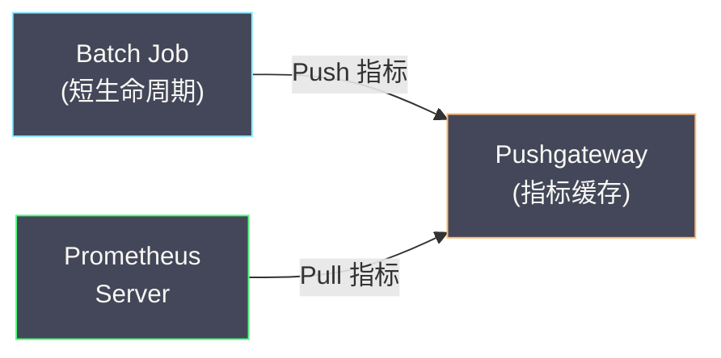
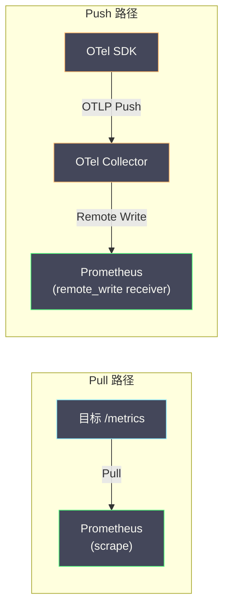
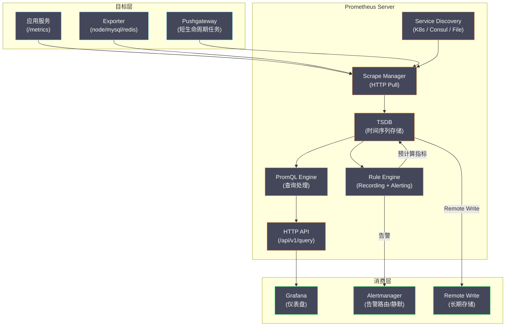

# 02 Prometheus 数据模型与采集原理

**摘要：**

[[Prometheus]] 之所以能在云原生监控领域一统江湖，核心在于两个设计决策：**简洁的时间序列数据模型**和**基于 Pull 的采集模型**。时间序列数据模型将所有指标统一为"名称 + 标签 + 时间戳 + 数值"的四元组，标签体系赋予了指标强大的多维查询能力；Pull 模型让 Prometheus 主动从目标拉取指标，天然适配 [[Kubernetes]] 的动态服务发现。本文从 Prometheus 的诞生背景出发，深入剖析时间序列数据模型的设计细节、Pull vs Push 的工程权衡、Service Discovery 机制如何与 Kubernetes 深度集成，以及 scrape 的完整生命周期。

---

## 第 1 章 Prometheus 的诞生与定位

### 1.1 从 Borgmon 到 Prometheus

Prometheus 的诞生与 Google 内部的监控系统 **Borgmon** 有直接关系。Google 的 [[Borg]] 容器编排系统（Kubernetes 的前身）配套了一个名为 Borgmon 的监控系统，它使用一种类似代数表达式的查询语言来定义告警规则和仪表盘——这正是 [[PromQL]] 的灵感来源。

2012 年，前 Google SRE 工程师 Matt T. Proud 和 Julius Volz 在 SoundCloud 公司创建了 Prometheus。他们面临的问题是：SoundCloud 的微服务架构运行在动态调度的容器中，传统的基于主机的监控系统（如 Nagios、Zabbix）无法适应容器的快速创建和销毁。他们需要一个**原生支持动态目标发现、多维标签查询**的监控系统。

2016 年，Prometheus 成为 CNCF 的第二个毕业项目（仅次于 Kubernetes），确立了其在云原生监控领域的标准地位。

### 1.2 Prometheus 的核心特征

| 特征 | 说明 |
| :--- | :--- |
| **多维数据模型** | 指标名称 + 键值对标签，支持灵活的多维查询 |
| **PromQL** | 功能强大的查询语言，支持聚合、速率计算、预测 |
| **Pull 模型** | 主动从目标拉取指标，不需要目标主动推送 |
| **Service Discovery** | 原生集成 Kubernetes、Consul、DNS 等服务发现机制 |
| **本地存储** | 内置高效的 TSDB（时间序列数据库）|
| **告警引擎** | 内置 Recording Rule 和 Alerting Rule |
| **无外部依赖** | 单个二进制文件即可运行，不依赖外部数据库或消息队列 |

---

## 第 2 章 时间序列数据模型

### 2.1 数据模型的四元组

Prometheus 的数据模型极其简洁——每个数据点是一个四元组：

```
(metric_name, labels, timestamp, value)
```

- **metric_name**：指标名称，字符串（如 `http_requests_total`）
- **labels**：标签集，键值对的集合（如 `{service="order", method="POST", status="200"}`）
- **timestamp**：时间戳，毫秒精度的 Unix 时间戳
- **value**：数值，64 位浮点数

**metric_name 本身也是一个标签**——在 Prometheus 内部，`http_requests_total{service="order"}` 等价于 `{__name__="http_requests_total", service="order"}`。metric_name 只是 `__name__` 标签的语法糖。

### 2.2 时间序列的标识

一条时间序列由 **metric_name + 标签集** 唯一标识。两个数据点属于同一条时间序列，当且仅当它们的 metric_name 和所有标签完全相同。

```
# 以下是三条不同的时间序列：
http_requests_total{service="order", method="POST", status="200"}
http_requests_total{service="order", method="POST", status="500"}
http_requests_total{service="order", method="GET",  status="200"}

# 以下是同一条时间序列在不同时间的两个数据点：
http_requests_total{service="order", method="POST", status="200"} @ 14:00:00 → 1500
http_requests_total{service="order", method="POST", status="200"} @ 14:00:15 → 1523
```

### 2.3 标签的多维查询能力

标签赋予了 Prometheus 强大的多维查询能力。同一个指标通过不同的标签组合，可以从不同维度进行聚合和筛选：

```
# 按服务聚合：所有服务的总 QPS
sum(rate(http_requests_total[5m])) by (service)

# 按方法聚合：GET vs POST 的 QPS 对比
sum(rate(http_requests_total[5m])) by (method)

# 按状态码聚合：2xx vs 4xx vs 5xx 的比例
sum(rate(http_requests_total[5m])) by (status)

# 多维筛选：order-service 的 POST 请求中 5xx 的错误率
rate(http_requests_total{service="order", method="POST", status=~"5.."}[5m])
/ rate(http_requests_total{service="order", method="POST"}[5m])
```

这种多维查询能力是传统监控系统（如 Graphite 的点分命名空间 `servers.web01.cpu.idle`）无法实现的。Graphite 的命名空间是固定层级的——如果你一开始按 `server → metric` 的层级命名，后来想按 `metric → server` 聚合，就需要重新组织所有指标的命名结构。Prometheus 的标签是扁平的键值对，任何标签都可以用于聚合和筛选，不受层级约束。

### 2.4 内部标签与元数据标签

Prometheus 使用以双下划线开头的标签（`__xxx__`）作为**内部标签**，这些标签在 scrape 过程中使用，不会存储到 TSDB 中：

| 内部标签 | 含义 |
| :--- | :--- |
| `__name__` | 指标名称（唯一会被存储的内部标签）|
| `__address__` | 目标的 host:port |
| `__scheme__` | 采集协议（http/https）|
| `__metrics_path__` | 指标暴露路径（默认 /metrics）|
| `__param_<name>` | HTTP 请求参数 |
| `__meta_kubernetes_*` | Kubernetes Service Discovery 注入的元数据 |

在 `relabel_configs` 阶段，可以将内部标签的值复制到普通标签中。例如，将 Kubernetes Pod 的 `app` label 提取为 Prometheus 的 `service` 标签：

```yaml
relabel_configs:
  - source_labels: [__meta_kubernetes_pod_label_app]
    target_label: service
```

---

## 第 3 章 Pull vs Push：采集模型的工程权衡

### 3.1 Pull 模型的工作方式

Prometheus 使用 **Pull（拉取）** 模型采集指标：Prometheus Server 按固定间隔（scrape_interval，默认 15 秒）主动向每个监控目标发送 HTTP GET 请求，目标返回当前的所有指标数据。

```
Prometheus Server                        目标（如 order-service:8080）
      |                                            |
      |--- GET /metrics --------------------------->|
      |                                            |
      |<-- 200 OK --------------------------------|
      |   # HELP http_requests_total ...           |
      |   # TYPE http_requests_total counter       |
      |   http_requests_total{method="POST"} 1523  |
      |   http_requests_total{method="GET"} 892    |
      |   ...                                      |
```

目标需要暴露一个 HTTP 端点（通常是 `/metrics`），以 Prometheus 的文本格式（或 OpenMetrics 格式）返回所有指标。这个端点可以由 Prometheus 客户端库自动生成，也可以由 Exporter 提供。

### 3.2 为什么选择 Pull 而非 Push

在 Prometheus 出现之前，主流的监控系统（如 Graphite、StatsD、InfluxDB）大多使用 **Push（推送）** 模型——应用主动将指标数据推送到监控后端。Prometheus 选择 Pull 模型的原因涉及多个工程维度的权衡：

**优势一：监控系统掌握采集的主动权**

Pull 模型中，Prometheus 决定"采集谁"和"多久采集一次"。如果需要调整 scrape_interval 或添加新的监控目标，只需修改 Prometheus 的配置，不需要修改任何应用代码或配置。

Push 模型中，每个应用需要知道"推送到哪里"和"多久推送一次"——当监控后端迁移或扩缩容时，需要更新所有应用的配置。

**优势二：天然的健康检查**

Pull 模型自带"存活检测"——如果 Prometheus 无法从目标拉取指标（连接超时或返回错误），就意味着目标可能已经宕机。Prometheus 会自动标记 `up{job="xxx", instance="xxx"} = 0`。

Push 模型中，如果一个应用停止推送数据，监控系统无法区分"应用宕机了"和"应用没有新数据"——需要额外的存活检测机制。

**优势三：避免数据洪泛**

Pull 模型中，Prometheus 控制采集频率——即使目标产生了大量指标，Prometheus 也只在每个 scrape_interval 拉取一次，不会被数据淹没。

Push 模型中，如果一个有 bug 的应用以极高频率推送指标，可能导致监控后端过载。需要在后端做速率限制，增加了系统复杂度。

**优势四：更容易调试**

目标的 `/metrics` 端点可以直接在浏览器中访问——工程师可以手动 `curl http://target:port/metrics` 查看目标当前暴露的所有指标，这对于调试非常方便。

### 3.3 Pull 模型的局限与 Pushgateway

Pull 模型并非万能。以下场景中 Pull 模型存在困难：

**短生命周期任务（Batch Job）**：如果一个批处理任务只运行 30 秒就退出，而 Prometheus 的 scrape_interval 是 15 秒——Prometheus 可能在任务退出前只采集了一两次指标，甚至完全错过。

**防火墙/NAT 限制**：如果目标位于 Prometheus 无法直接访问的网络中（如位于 NAT 后面的客户端），Pull 模型无法工作。

Prometheus 为这些场景提供了 **Pushgateway**——一个中间缓存层，短生命周期任务可以在退出前将指标推送到 Pushgateway，Prometheus 再从 Pushgateway 拉取。



> [!warning] Pushgateway 的使用陷阱
> Pushgateway **不应该**被用作"将 Pull 转为 Push"的通用网关。它的问题在于：
> - **没有存活检测**：Pushgateway 会一直缓存上次推送的指标，即使推送方已经宕机，Prometheus 仍然能拉取到"看似正常"的数据
> - **指标堆积**：如果任务推送后没有清理，旧指标会一直留在 Pushgateway 中
> - **单点故障**：Pushgateway 本身如果宕机，所有通过它推送的指标都会丢失
>
> Pushgateway 只适合**短生命周期的批处理任务**，不适合长生命周期的服务。

### 3.4 OpenTelemetry 的 Push 与 Prometheus 的 Pull 的融合

[[OpenTelemetry]] 使用 Push 模型——应用通过 OTel SDK 将指标推送到 OTel Collector，Collector 再通过 Remote Write 协议推送到 Prometheus 兼容后端（如 Prometheus、Mimir、Thanos）。

这种 Push → Push 的链路如何与 Prometheus 的 Pull 模型共存？答案是 **Remote Write**——Prometheus 支持从外部接收 Remote Write 请求，将接收到的指标数据写入本地 TSDB。OTel Collector 通过 `prometheusremotewrite` exporter 将指标以 Remote Write 协议推送到 Prometheus。



这意味着在现代的可观测性架构中，Pull 和 Push 并非互斥——Prometheus 同时支持两种模式，团队可以根据场景选择最合适的方式。

---

## 第 4 章 Service Discovery：动态目标发现

### 4.1 为什么需要 Service Discovery

在传统的监控系统中，监控目标是**静态配置**的——在配置文件中列出每台服务器的 IP 和端口：

```yaml
# 静态配置：手动列出所有目标
scrape_configs:
  - job_name: "order-service"
    static_configs:
      - targets:
          - "10.0.0.1:8080"
          - "10.0.0.2:8080"
          - "10.0.0.3:8080"
```

这在物理机/虚拟机时代勉强可用（服务器的 IP 相对固定），但在容器化/Kubernetes 时代完全不可行：
- Pod 随时可能被调度到不同的 Node，IP 地址动态变化
- HPA（Horizontal Pod Autoscaler）根据负载动态增减 Pod 数量
- 滚动更新时旧 Pod 销毁、新 Pod 创建

Service Discovery 让 Prometheus **自动发现**当前存活的监控目标，无需手动维护配置。

### 4.2 Kubernetes Service Discovery

Kubernetes SD 是 Prometheus 最重要的服务发现机制。Prometheus 通过 Kubernetes API Server 获取集群中的资源信息，支持以下发现角色（role）：

| Role | 发现对象 | 典型用途 |
| :--- | :--- | :--- |
| `node` | 所有 Node | 监控 Node Exporter（主机指标）|
| `pod` | 所有 Pod | 监控应用暴露的 /metrics 端点 |
| `service` | 所有 Service | 通过 Service 的 ClusterIP 监控 |
| `endpoints` | 所有 Endpoints | 监控 Service 背后的每个 Pod |
| `endpointslice` | 所有 EndpointSlice | endpoints 的升级版（大规模集群）|
| `ingress` | 所有 Ingress | 黑盒监控（探测 URL 可达性）|

**最常用的模式是 `pod` role + annotation 过滤**——通过 Pod 的 annotation 告诉 Prometheus"这个 Pod 需要被监控"以及"从哪个端口和路径采集"：

```yaml
# Pod 的 annotation
metadata:
  annotations:
    prometheus.io/scrape: "true"        # 标记需要被采集
    prometheus.io/port: "8080"          # 指标暴露端口
    prometheus.io/path: "/metrics"       # 指标暴露路径
```

```yaml
# Prometheus 配置：基于 Pod annotation 的自动发现
scrape_configs:
  - job_name: "kubernetes-pods"
    kubernetes_sd_configs:
      - role: pod
    relabel_configs:
      # 只采集有 prometheus.io/scrape=true annotation 的 Pod
      - source_labels: [__meta_kubernetes_pod_annotation_prometheus_io_scrape]
        action: keep
        regex: true
      # 从 annotation 中提取端口
      - source_labels: [__meta_kubernetes_pod_annotation_prometheus_io_port]
        action: replace
        target_label: __address__
        regex: (.+)
        replacement: ${1}
      # 从 annotation 中提取路径
      - source_labels: [__meta_kubernetes_pod_annotation_prometheus_io_path]
        action: replace
        target_label: __metrics_path__
        regex: (.+)
      # 将 Pod 的 namespace 和 name 作为标签
      - source_labels: [__meta_kubernetes_namespace]
        target_label: namespace
      - source_labels: [__meta_kubernetes_pod_name]
        target_label: pod
```

这样，当新的 Pod 启动并带有 `prometheus.io/scrape: "true"` annotation 时，Prometheus 会在下一次 SD 刷新时自动发现并开始采集——无需任何手动配置。

### 4.3 Relabeling：元数据到标签的映射

**Relabeling** 是 Prometheus 最强大也最复杂的配置机制。它在 scrape 之前（`relabel_configs`）和 scrape 之后（`metric_relabel_configs`）对标签进行转换、过滤和修改。

Relabeling 的核心操作：

| Action | 说明 |
| :--- | :--- |
| `replace` | 用正则替换标签值 |
| `keep` | 只保留匹配正则的目标/指标 |
| `drop` | 丢弃匹配正则的目标/指标 |
| `labelmap` | 将匹配正则的标签名重命名 |
| `labeldrop` | 删除匹配正则的标签 |
| `labelkeep` | 只保留匹配正则的标签 |
| `hashmod` | 对标签值取 hash 后取模（用于分片）|

**实用场景举例**：

```yaml
# 场景一：丢弃高基数指标（如包含 le 标签的 histogram bucket 太多）
metric_relabel_configs:
  - source_labels: [__name__]
    regex: "expensive_histogram_bucket"
    action: drop

# 场景二：将 Kubernetes namespace 提取为 env 标签
relabel_configs:
  - source_labels: [__meta_kubernetes_namespace]
    regex: "(production|staging|dev)"
    target_label: env

# 场景三：按 hash 分片采集（多个 Prometheus 实例分担负载）
relabel_configs:
  - source_labels: [__address__]
    modulus: 3          # 3 个 Prometheus 实例
    target_label: __tmp_hash
    action: hashmod
  - source_labels: [__tmp_hash]
    regex: "0"          # 当前实例只采集 hash % 3 == 0 的目标
    action: keep
```

### 4.4 其他 Service Discovery 机制

除了 Kubernetes，Prometheus 还支持：

| SD 机制 | 适用场景 |
| :--- | :--- |
| **Consul SD** | 使用 HashiCorp Consul 做服务注册的环境 |
| **DNS SD** | 通过 DNS SRV 记录发现服务 |
| **File SD** | 从 JSON/YAML 文件中读取目标列表（适合与 CMDB 集成）|
| **EC2 SD** | AWS EC2 实例自动发现 |
| **Azure SD** | Azure VM 自动发现 |
| **HTTP SD** | 从 HTTP 端点获取目标列表（最灵活的自定义 SD）|

---

## 第 5 章 Scrape 的完整生命周期

### 5.1 一次 Scrape 的详细过程

当 Prometheus 到达一个目标的 scrape 时间点时，执行以下步骤：

```
1. 目标发现（Service Discovery）
   → SD 模块定期从 Kubernetes API / Consul / 文件中获取目标列表
   → 生成目标的 __address__、__metrics_path__、__scheme__ 等内部标签

2. Relabeling（relabel_configs）
   → 对目标的内部标签执行 relabel 规则
   → 生成最终的 instance 标签（通常等于 __address__）
   → 如果 relabel 结果为 drop，跳过该目标

3. 发送 HTTP 请求
   → GET {scheme}://{address}{metrics_path}
   → 带上 scrape_timeout 超时设置
   → 支持 Basic Auth、Bearer Token、TLS 客户端证书

4. 解析响应
   → 按 Prometheus 文本格式或 OpenMetrics 格式解析指标
   → 每一行解析为一个 (metric_name, labels, value) 三元组

5. Metric Relabeling（metric_relabel_configs）
   → 对解析出的每个指标执行 metric_relabel 规则
   → 可以丢弃不需要的指标、修改标签值

6. 追加到 TSDB
   → 为每个指标数据点附加当前时间戳
   → 写入 TSDB 的 Head Block（内存）

7. 更新 up 指标
   → 如果 scrape 成功：up{job="xxx", instance="xxx"} = 1
   → 如果 scrape 失败：up{job="xxx", instance="xxx"} = 0

8. 更新 scrape 元指标
   → scrape_duration_seconds：本次 scrape 耗时
   → scrape_samples_scraped：本次 scrape 采集到的指标数量
   → scrape_series_added：本次 scrape 新增的时间序列数量
```

### 5.2 Exposition Format：指标暴露格式

目标的 `/metrics` 端点返回的数据格式是 **Prometheus Exposition Format**：

```
# HELP http_requests_total The total number of HTTP requests.
# TYPE http_requests_total counter
http_requests_total{method="POST",status="200"} 1523 1704067200000
http_requests_total{method="POST",status="500"} 42
http_requests_total{method="GET",status="200"} 892

# HELP http_request_duration_seconds HTTP request duration in seconds.
# TYPE http_request_duration_seconds histogram
http_request_duration_seconds_bucket{method="POST",le="0.01"} 500
http_request_duration_seconds_bucket{method="POST",le="0.05"} 4800
http_request_duration_seconds_bucket{method="POST",le="0.1"} 4950
http_request_duration_seconds_bucket{method="POST",le="+Inf"} 5000
http_request_duration_seconds_sum{method="POST"} 250.5
http_request_duration_seconds_count{method="POST"} 5000
```

每一行的格式是：`metric_name{label1="value1",label2="value2"} value [timestamp]`

- `# HELP`：指标的描述文本
- `# TYPE`：指标类型（counter/gauge/histogram/summary/untyped）
- 时间戳是可选的——如果不提供，Prometheus 使用当前 scrape 的时间

### 5.3 Exporter：第三方系统的指标适配器

并非所有系统都原生暴露 Prometheus 格式的指标。对于不可修改的第三方系统（如 MySQL、Redis、Nginx、Linux 内核），Prometheus 社区开发了大量的 **Exporter**——一个独立的进程，连接到目标系统，将目标系统的内部指标转换为 Prometheus 格式暴露。

| Exporter | 监控目标 | 典型指标 |
| :--- | :--- | :--- |
| **node_exporter** | Linux 主机 | CPU/内存/磁盘/网络/文件系统 |
| **mysqld_exporter** | MySQL | 查询数/慢查询数/连接数/InnoDB 指标 |
| **redis_exporter** | Redis | 命中率/内存使用/连接数/命令统计 |
| **nginx_exporter** | Nginx | 活跃连接数/请求数/响应状态码 |
| **blackbox_exporter** | 任意 HTTP/TCP/ICMP | 可达性/延迟/证书过期时间 |
| **jmx_exporter** | JVM 应用 | GC/堆内存/线程数/类加载 |
| **kafka_exporter** | Kafka | 消费者积压/分区数/ISR |

Exporter 的部署模式通常有两种：

**Sidecar 模式**：Exporter 与目标应用运行在同一个 Pod 中（作为 sidecar 容器），通过 localhost 连接目标应用。

**独立部署**：Exporter 作为独立的 Deployment 运行，通过网络连接目标系统。适合 Exporter 需要独立扩缩容的场景。

### 5.4 客户端库：应用内埋点

对于自研的应用服务，推荐使用 Prometheus 客户端库**在应用代码中直接埋点**——这比 Exporter 更灵活、更高效。

```java
// Java Prometheus 客户端示例
import io.prometheus.client.Counter;
import io.prometheus.client.Histogram;

public class OrderService {
    // 定义指标
    private static final Counter requestsTotal = Counter.build()
        .name("http_requests_total")
        .help("Total HTTP requests")
        .labelNames("method", "status")
        .register();
    
    private static final Histogram requestDuration = Histogram.build()
        .name("http_request_duration_seconds")
        .help("HTTP request duration in seconds")
        .labelNames("method")
        .buckets(0.005, 0.01, 0.025, 0.05, 0.1, 0.25, 0.5, 1, 2.5, 5, 10)
        .register();
    
    public Response handleRequest(Request req) {
        Histogram.Timer timer = requestDuration.labels(req.getMethod()).startTimer();
        try {
            Response resp = processRequest(req);
            requestsTotal.labels(req.getMethod(), String.valueOf(resp.getStatus())).inc();
            return resp;
        } finally {
            timer.observeDuration();  // 自动记录耗时
        }
    }
}
```

主流语言都有官方或社区维护的客户端库：

| 语言 | 客户端库 |
| :--- | :--- |
| **Go** | `prometheus/client_golang`（官方）|
| **Java** | `prometheus/client_java`（官方）/ Micrometer |
| **Python** | `prometheus/client_python`（官方）|
| **Node.js** | `prom-client` |
| **Rust** | `prometheus/client_rust` |

> [!info] Micrometer：Java 生态的指标门面
> 在 Java/Spring Boot 生态中，**Micrometer** 扮演了类似 [[SLF4J]] 之于日志的角色——它是一个指标门面（Facade），支持多种后端（Prometheus、Datadog、InfluxDB 等）。Spring Boot Actuator 默认集成 Micrometer，只需添加 `micrometer-registry-prometheus` 依赖，即可在 `/actuator/prometheus` 端点暴露 Prometheus 格式的指标。

---

## 第 6 章 Prometheus 的整体架构

### 6.1 架构全景



### 6.2 Recording Rules：预计算加速查询

**Recording Rule** 允许将常用的 PromQL 表达式**预计算**并存储为新的时间序列。这解决了两个问题：

**问题一：复杂查询的响应时间**。例如，计算全局 P99 延迟需要聚合所有实例的 Histogram 桶——当实例数量很多时，查询可能需要几秒。Recording Rule 可以每隔一段时间预计算一次，查询时直接读取预计算结果。

**问题二：仪表盘加载时间**。一个 Grafana 仪表盘可能包含数十个面板，每个面板执行一条 PromQL 查询。如果每条查询都很复杂，仪表盘的加载时间会很长。

```yaml
# Recording Rule 示例
groups:
  - name: http_recording_rules
    interval: 30s
    rules:
      # 预计算：每个服务的 QPS
      - record: service:http_requests:rate5m
        expr: sum(rate(http_requests_total[5m])) by (service)
      
      # 预计算：每个服务的错误率
      - record: service:http_errors:ratio_rate5m
        expr: |
          sum(rate(http_requests_total{status=~"5.."}[5m])) by (service)
          / sum(rate(http_requests_total[5m])) by (service)
      
      # 预计算：每个服务的 P99 延迟
      - record: service:http_request_duration_seconds:p99
        expr: |
          histogram_quantile(0.99, 
            sum(rate(http_request_duration_seconds_bucket[5m])) by (service, le)
          )
```

Recording Rule 的命名约定是 `level:metric:operations`——`service:http_requests:rate5m` 表示"按 service 聚合的 http_requests 的 5 分钟速率"。

---

## 参考资料

1. Prometheus Documentation - Data Model：https://prometheus.io/docs/concepts/data_model/
2. Prometheus Documentation - Configuration：https://prometheus.io/docs/prometheus/latest/configuration/configuration/
3. Prometheus Documentation - Service Discovery：https://prometheus.io/docs/prometheus/latest/configuration/configuration/#kubernetes_sd_config
4. Julius Volz (2016). *PromCon 2016 - Prometheus Design and Philosophy*.
5. Brian Brazil (2018). *Prometheus: Up & Running*. O'Reilly Media.
6. Prometheus Documentation - Exposition Formats：https://prometheus.io/docs/instrumenting/exposition_formats/
7. Prometheus Documentation - Recording Rules：https://prometheus.io/docs/prometheus/latest/configuration/recording_rules/

---

> [!note] 思考题
> 1. PromQL 的 `rate()` 和 `irate()` 计算 Counter 的增长率。`rate()` 使用整个时间窗口的首尾值计算平均速率——平滑但延迟高。`irate()` 使用最近两个样本计算瞬时速率——灵敏但噪声大。在告警规则中你应该用 `rate()` 还是 `irate()`？在 Dashboard 中呢？
> 2. `histogram_quantile(0.99, rate(http_request_duration_seconds_bucket[5m]))` 计算 P99 延迟。但 Histogram 的桶边界（`le`）如果设置不当——如最大桶是 1s 但实际有 5s 的请求——P99 计算不准确。你如何设计 Histogram 的桶边界以覆盖实际的延迟分布？Prometheus 的 Native Histogram（实验特性）如何自适应桶边界？
> 3. PromQL 的 `by` 和 `without` 控制聚合维度。`sum(rate(http_requests_total[5m])) by (service)` 按 service 聚合请求率。如果忘记 `by`——聚合了所有维度——结果可能不是你期望的。在编写 PromQL 时你如何避免'维度丢失'的错误？Recording Rule 如何减少复杂查询的计算开销？
