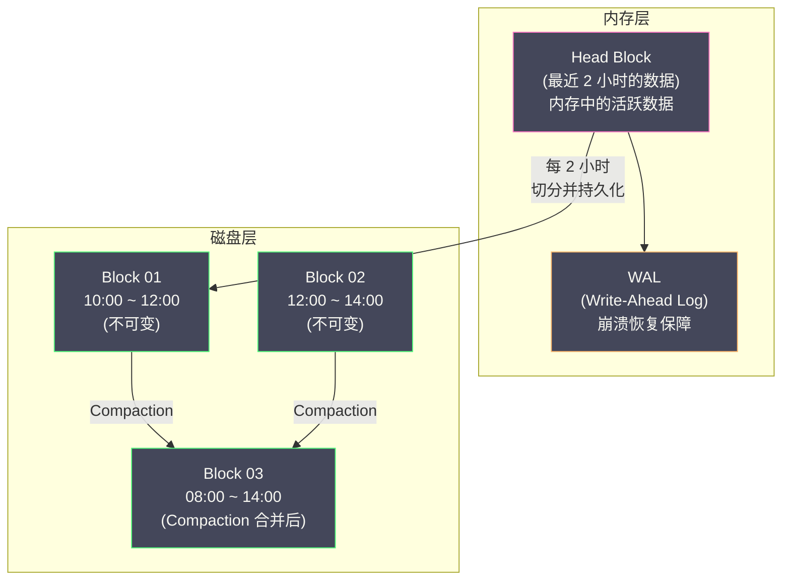

# 04 Prometheus TSDB 深度解析

**摘要：**

Prometheus 的内置 TSDB（Time Series Database）是其高性能的基石。与通用数据库不同，TSDB 针对时间序列数据的写入模式（高频追加、极少更新、按时间范围批量读取）做了极致优化。Prometheus TSDB 的核心设计包括：**Head Block**（内存中的最新数据）、**WAL**（Write-Ahead Log，崩溃恢复保障）、**持久化 Block**（磁盘上的不可变数据块）、以及 **Compaction**（后台合并压缩）。在数据编码层面，TSDB 采用了 Facebook 在 2015 年发表的 **Gorilla 论文**中的 XOR 压缩算法，将每个数据点的存储开销压缩到平均 1.37 字节——这意味着一条时间序列存储一年的数据只需要约 3 MB。本文从 TSDB 的整体架构出发，逐层剖析数据从写入到持久化到查询的完整生命周期。

---

## 第 1 章 TSDB 的整体架构

### 1.1 时间序列数据的特征

在深入 TSDB 之前，先理解时间序列数据与通用数据的本质区别——这些区别决定了 TSDB 的设计决策。

**特征一：写入模式是纯追加（Append-Only）**。时间序列数据按时间顺序到达，新数据点总是追加到序列末尾。几乎不存在"修改过去某个时间点的值"或"在中间插入数据"的操作。这意味着 TSDB 不需要支持随机写入——只需要高效的顺序追加。

**特征二：数据有明确的时效性**。最近的数据被频繁查询（"过去 5 分钟的 CPU 使用率"），历史数据查询频率急剧下降。这意味着 TSDB 可以将最新数据放在内存/SSD 中，历史数据放在更廉价的存储中。

**特征三：查询模式是批量顺序读取**。典型的查询是"读取某条时间序列在过去 1 小时内的所有数据点"——这是一个按时间范围的顺序扫描，不是按主键的随机查找。TSDB 的数据布局应该优化顺序扫描性能。

**特征四：相邻数据点高度相似**。同一条时间序列的相邻数据点通常非常接近（CPU 使用率从 73.5% 变到 73.8%），时间戳之间的间隔也是固定的（如 15 秒）。这种规律性为压缩算法提供了巨大的优化空间。

### 1.2 TSDB 的分层架构

Prometheus TSDB 的数据存储分为两层：**Head Block（内存层）**和 **Persistent Blocks（磁盘层）**。



---

## 第 2 章 Head Block：内存中的活跃数据

### 2.1 Head Block 的角色

Head Block 是 TSDB 中**唯一可写的数据区域**——所有新到达的数据点首先写入 Head Block。Head Block 驻留在内存中，默认保存**最近 2 小时**（`--storage.tsdb.min-block-duration`）的数据。

**为什么 Head Block 在内存中？**

因为写入性能。Prometheus 在每次 scrape 时可能同时写入数千到数万个数据点（取决于监控目标的数量和每个目标暴露的指标数），这些写入必须在毫秒级完成。如果每次写入都涉及磁盘 I/O，scrape 的吞吐量会成为瓶颈。内存写入的速度比 SSD 快 100 倍以上，完全满足高频写入的需求。

### 2.2 Head Block 的内部结构

Head Block 内部为每条时间序列维护一个 **memSeries** 对象：

```
memSeries {
    ref:      uint64          // 时间序列的内部引用 ID
    lset:     Labels          // 标签集（如 {__name__="http_requests_total", service="order"}）
    chunks:   []memChunk      // Chunk 列表（每个 Chunk 存储一段时间的数据点）
    headChunk: *memChunk      // 当前活跃的 Chunk（正在写入的）
    lastTs:   int64           // 最后一个数据点的时间戳（用于乱序检测）
}
```

**Chunk** 是数据点的容器。每个 Chunk 存储一段连续时间范围内的数据点，使用 Gorilla XOR 编码压缩。当一个 Chunk 写满（默认 120 个数据点，约 30 分钟的数据，按 15 秒 scrape 间隔计算）时，它被关闭（变为只读），一个新的 Chunk 被创建接替写入。

### 2.3 写入路径

当 Prometheus 完成一次 scrape 并需要写入数据点时：

```
1. Appender.Add(labels, timestamp, value)
   → 通过标签集查找（或创建）对应的 memSeries
   → 标签集到 memSeries 的映射使用一个并发安全的哈希表

2. 乱序检测
   → 检查 timestamp >= memSeries.lastTs
   → 如果 timestamp < lastTs，拒绝写入（Prometheus 2.x 默认不接受乱序数据）
   → Prometheus 2.39+ 支持可配置的乱序写入窗口

3. 追加到 headChunk
   → 使用 Gorilla XOR 编码将 (timestamp, value) 追加到当前 Chunk
   → 更新 memSeries.lastTs

4. 写入 WAL
   → 将原始数据点（未压缩）写入 WAL 文件
   → WAL 写入是顺序追加，性能极高

5. Appender.Commit()
   → 批量提交本次 scrape 的所有数据点
   → 更新内存中的倒排索引（用于按标签查找时间序列）
```

### 2.4 内存中的倒排索引

Head Block 在内存中维护了一个**倒排索引**，用于快速按标签查找时间序列。这个倒排索引的结构与 [[Elasticsearch]] 的倒排索引概念类似，但实现更轻量：

```
倒排索引：
  "service" = "order"    → [series_ref_1, series_ref_3, series_ref_7]
  "service" = "payment"  → [series_ref_2, series_ref_5]
  "method"  = "POST"     → [series_ref_1, series_ref_2]
  "method"  = "GET"      → [series_ref_3, series_ref_5, series_ref_7]
  "__name__" = "http_requests_total" → [series_ref_1, series_ref_2, series_ref_3, ...]
```

当 PromQL 查询 `http_requests_total{service="order", method="POST"}` 时：
1. 查找 `__name__="http_requests_total"` → 得到一个 series_ref 集合 A
2. 查找 `service="order"` → 得到集合 B
3. 查找 `method="POST"` → 得到集合 C
4. 计算 A ∩ B ∩ C → 得到匹配的时间序列

集合交集操作使用 **Roaring Bitmap** 或排序数组的归并来实现，效率很高。

---

## 第 3 章 WAL：崩溃恢复保障

### 3.1 为什么需要 WAL

Head Block 的数据在内存中——如果 Prometheus 进程崩溃或服务器掉电，内存中的数据会丢失。WAL（Write-Ahead Log）的作用是**在数据写入内存之前，先将原始数据顺序写入磁盘**。这样即使崩溃，重启后可以从 WAL 中恢复 Head Block 的数据。

**WAL 的设计原则**：WAL 只需要支持高效的顺序追加和顺序读取——写入时追加到文件末尾（不需要随机写），恢复时从头到尾顺序读取（不需要随机读）。这种纯顺序的 I/O 模式即使在 HDD 上也能达到很高的吞吐量。

### 3.2 WAL 的文件结构

WAL 存储在 Prometheus 数据目录下的 `wal/` 子目录中：

```
data/
  wal/
    00000001    # WAL 段文件（128 MB）
    00000002
    00000003    # 当前正在写入的段
  chunks_head/
    000001      # Head Chunk 的 mmap 文件
```

每个 WAL 段文件大小为 128 MB。写满后创建新段。WAL 中的记录有三种类型：

- **Series Record**：记录新时间序列的创建（标签集 → series_ref 的映射）
- **Samples Record**：记录数据点（series_ref + timestamp + value）
- **Tombstones Record**：记录删除操作

### 3.3 WAL 与 Head Chunk 的 mmap

Prometheus 2.19+ 引入了 **Head Chunk mmap** 优化——将 Head Block 中已经关闭的（只读的）Chunk 通过 [[mmap]] 映射到磁盘文件 `chunks_head/`，从而释放 JVM/Go 堆内存。

这个优化的意义在于：Head Block 保存 2 小时的数据，其中只有最后一个 Chunk（约 30 分钟的数据）是活跃的——前面的 3 个 Chunk 是只读的。通过 mmap，这 3 个只读 Chunk 的内存可以由操作系统的 [[Page Cache]] 管理——如果内存紧张，OS 可以将它们换出到磁盘；查询时再按需加载。

```
Head Block 的内存布局（优化后）：

活跃 Chunk（30 min）  → Go 堆内存（不可 mmap，正在写入）
只读 Chunk 1（30 min）→ mmap（磁盘文件 + Page Cache）
只读 Chunk 2（30 min）→ mmap（磁盘文件 + Page Cache）
只读 Chunk 3（30 min）→ mmap（磁盘文件 + Page Cache）
```

---

## 第 4 章 Gorilla XOR 编码：极致的数据压缩

### 4.1 为什么需要专门的压缩算法

通用压缩算法（如 gzip、zstd）可以压缩任意数据，但它们不了解时间序列数据的特征——相邻数据点的时间戳间隔固定、数值变化微小。针对这些特征设计的专用压缩算法可以达到远超通用算法的压缩比。

Facebook 在 2015 年发表的论文《Gorilla: A Fast, Scalable, In-Memory Time Series Database》提出了两种编码技术：**Delta-of-Delta 时间戳编码**和 **XOR 数值编码**。Prometheus TSDB 采用了这两种编码。

### 4.2 Delta-of-Delta 时间戳编码

**思路**：如果 scrape 间隔固定为 15 秒，那么相邻数据点的时间戳差值（delta）几乎总是 15。进一步地，delta 的 delta（delta-of-delta，简称 DoD）几乎总是 0。

```
原始时间戳序列：
  t0 = 1704067200
  t1 = 1704067215   delta = 15    DoD = N/A（第一个）
  t2 = 1704067230   delta = 15    DoD = 0
  t3 = 1704067245   delta = 15    DoD = 0
  t4 = 1704067261   delta = 16    DoD = 1（偶尔的 scrape 抖动）
  t5 = 1704067275   delta = 14    DoD = -2
```

编码规则：
- 如果 DoD = 0 → 存储 1 个 bit：`0`
- 如果 DoD 在 [-63, 64] → 存储 `10` + 7 位有符号整数 = 9 bits
- 如果 DoD 在 [-255, 256] → 存储 `110` + 9 位 = 12 bits
- 如果 DoD 在 [-2047, 2048] → 存储 `1110` + 12 位 = 16 bits
- 其他 → 存储 `1111` + 32 位 = 36 bits

在正常情况下（scrape 间隔稳定），绝大多数 DoD = 0，每个时间戳只需要 **1 bit**。即使偶尔有抖动（DoD = ±1 或 ±2），也只需要 9 bits。

### 4.3 XOR 数值编码

**思路**：同一条时间序列的相邻数值通常非常接近（如 CPU 使用率从 73.5% 变到 73.8%）。将相邻的两个 64 位浮点数做 XOR 运算，结果中大部分位都是 0（因为两个数的符号位、指数位、高位尾数都相同）。

```
数值序列（IEEE 754 二进制表示）：
  v0 = 73.5  → 0 10000000101 0010011000000000000000000000000000000000000000000000
  v1 = 73.8  → 0 10000000101 0010011001100110011001100110011001100110011001100110

  XOR = v0 ⊕ v1 → 0 00000000000 0000000001100110011001100110011001100110011001100110
                                   ^^^^^^^^^^^^^^^^^^^^^^^^^^^^^^^^^^^^^^^^^^^^^^^^
                                   前导零很多，有效位集中在后面
```

编码规则：
- 如果 XOR = 0（值完全相同）→ 存储 1 bit：`0`
- 如果 XOR ≠ 0 且前导零和尾部零的范围与上一个 XOR 相同 → 存储 `10` + 有效位
- 否则 → 存储 `11` + 5 位前导零数量 + 6 位有效位长度 + 有效位

在实际的监控数据中，相邻值相同（XOR = 0）的比例很高（如一个空闲的服务，QPS 可能连续多个采样点都是 0）。即使值有变化，XOR 的有效位通常很少，平均每个值只需要约 **0.37 字节**。

### 4.4 压缩效果

结合时间戳和数值的编码，每个数据点的平均存储开销：

```
时间戳：~1 bit（大部分 DoD = 0）= 0.125 字节
数值：  ~3 bits（平均）           = 0.375 字节
总计：  ~4 bits                   ≈ 0.5 字节/数据点（最佳情况）

实际平均（Gorilla 论文数据）：   ≈ 1.37 字节/数据点
```

作为对比，未压缩的数据点需要 16 字节（8 字节时间戳 + 8 字节数值）。Gorilla 编码实现了约 **12:1 的压缩比**。

**实际存储估算**：

```
假设：
  活跃时间序列数 = 100,000
  scrape 间隔 = 15 秒
  数据保留 = 15 天

每条序列的数据点数 = 15 × 24 × 3600 / 15 = 86,400 点
每条序列的存储量 = 86,400 × 1.37 字节 ≈ 115 KB
总存储量 = 100,000 × 115 KB ≈ 11 GB

对比未压缩：100,000 × 86,400 × 16 字节 ≈ 129 GB
```

> [!info] Gorilla 编码的局限
> Gorilla 编码假设"相邻数据点相似"——如果数据跳变剧烈（如每个数据点都是完全不同的随机数），压缩效果会大打折扣。但在监控场景中，这种情况极少出现。

---

## 第 5 章 Persistent Block：磁盘上的不可变数据

### 5.1 Block 的生成

当 Head Block 中的数据超过 2 小时（`min-block-duration`）时，TSDB 将最早的 2 小时数据从 Head Block 中"切出"，压缩后写入磁盘，生成一个**持久化 Block**。

每个 Block 是一个目录，包含以下文件：

```
data/
  01BKGV7JBM69T2G1BGBGM6KB12/     # Block 目录（ULID 作为名称）
    meta.json                       # 元信息（时间范围、数据统计）
    index                           # 倒排索引文件
    chunks/
      000001                        # Chunk 数据文件
    tombstones                      # 删除标记
```

### 5.2 meta.json

```json
{
    "ulid": "01BKGV7JBM69T2G1BGBGM6KB12",
    "minTime": 1704067200000,
    "maxTime": 1704074400000,
    "stats": {
        "numSamples": 5000000,
        "numSeries": 50000,
        "numChunks": 200000
    },
    "compaction": {
        "level": 1,
        "sources": ["01BKGV7JBM69T2G1BGBGM6KB12"]
    },
    "version": 1
}
```

- `minTime` / `maxTime`：Block 覆盖的时间范围
- `compaction.level`：压缩层级（1 = 原始 Block，2+ = 合并后的 Block）
- `compaction.sources`：合并的源 Block 列表

### 5.3 Index 文件结构

Block 的 `index` 文件包含了按标签查找时间序列所需的全部索引信息：

```
Index 文件结构（简化）：

┌─────────────┐
│ Symbol Table │  所有标签名和标签值的字符串去重表
├─────────────┤
│ Series       │  每条时间序列的标签集 + Chunk 引用列表
├─────────────┤
│ Label Index  │  每个标签名下的所有标签值列表
├─────────────┤
│ Postings     │  倒排索引：标签对 → 时间序列 ID 列表
├─────────────┤
│ Posting      │
│ Offset Table │  快速定位 Postings 条目的偏移表
├─────────────┤
│ TOC          │  Table of Contents：各部分的偏移量
└─────────────┘
```

**Symbol Table**：将所有标签名和标签值映射为整数 ID，避免在 Series 和 Postings 中重复存储字符串。例如，`"service"` → 1，`"order"` → 2，`"method"` → 3。

**Postings（倒排索引）**：与 Head Block 内存中的倒排索引功能相同，但序列化到了磁盘上。每个 (标签名, 标签值) 对应一个排序的时间序列 ID 列表。

### 5.4 Chunks 文件

Chunks 文件存储实际的数据点，使用 Gorilla XOR 编码。每个 Chunk 包含一段连续时间范围的数据点，最大 120 个数据点。

查询时，TSDB 首先通过 Index 文件的倒排索引找到匹配的时间序列，然后根据 Series 中的 Chunk 引用定位到 Chunks 文件中的具体位置，读取并解压数据。

---

## 第 6 章 Compaction：后台合并压缩

### 6.1 为什么需要 Compaction

随着时间推移，磁盘上会积累越来越多的 Block（每 2 小时一个）。如果不做合并：
- 保留 15 天的数据 = 180 个 Block
- 每次查询需要打开 180 个 Block 的索引文件并合并结果
- 查询性能随 Block 数量线性下降

**Compaction** 将多个相邻的小 Block 合并为一个大 Block，减少 Block 数量，同时优化数据布局。

### 6.2 Compaction 策略

Prometheus TSDB 的 Compaction 策略类似于 [[LSM Tree]] 的分层合并：

```
Level 1（原始 Block，每个 2 小时）：
  [10:00-12:00] [12:00-14:00] [14:00-16:00] [16:00-18:00]

Level 2（合并为 6 小时）：
  [10:00-16:00]              [16:00-22:00]

Level 3（合并为更大的范围）：
  [10:00-22:00]
```

合并过程中执行以下优化：
- **删除过期数据**：物理删除已超过保留期（`--storage.tsdb.retention.time`）的数据点
- **应用 Tombstones**：物理删除通过 Admin API 标记删除的数据
- **重新编码 Chunks**：合并后的 Chunk 可能比原始 Chunk 有更好的压缩比（因为数据更连续）
- **重建索引**：合并多个 Block 的倒排索引为一个统一的索引

### 6.3 Compaction 的 I/O 影响

Compaction 是 I/O 密集型操作——需要读取多个源 Block、合并数据、写入新 Block。在高负载的 Prometheus 实例上，Compaction 可能与查询争抢磁盘 I/O，导致查询延迟抖动。

缓解方法：
- 使用 SSD 而非 HDD（随机读写性能更好）
- 确保 Prometheus 数据目录有足够的空闲磁盘空间（Compaction 需要同时存储源 Block 和目标 Block）
- 监控 `prometheus_tsdb_compactions_total` 和 `prometheus_tsdb_compaction_duration_seconds` 指标

---

## 第 7 章 查询路径

### 7.1 查询的执行过程

当 PromQL 引擎执行一条查询时，TSDB 层需要提供符合条件的时间序列数据。查询路径如下：

```
1. PromQL 引擎解析查询，确定需要的标签匹配器和时间范围

2. TSDB 确定需要查询的 Block
   → 根据查询的时间范围，筛选 minTime/maxTime 与之重叠的 Block
   → 如果时间范围包含最近 2 小时，还需要查询 Head Block

3. 对每个 Block 执行倒排索引查找
   → Head Block：在内存中的倒排索引中查找
   → Persistent Block：读取 index 文件中的 Postings
   → 对多个标签匹配器的结果做集合交集

4. 读取匹配的 Chunk 数据
   → Head Block：直接从内存或 mmap 中读取 Chunk
   → Persistent Block：从 chunks/ 文件中读取 Chunk

5. 解压 Chunk，提取指定时间范围内的数据点

6. 合并来自多个 Block 的数据（按时间排序，去重）

7. 返回给 PromQL 引擎进行后续计算（rate、sum、histogram_quantile 等）
```

### 7.2 查询性能的关键因素

**因素一：活跃时间序列数量**。活跃时间序列越多，倒排索引越大，交集运算越慢。这也是控制标签基数的重要原因之一。

**因素二：查询的时间范围**。时间范围越大，需要查询的 Block 越多，需要加载的 Chunk 越多。

**因素三：Page Cache 命中率**。Persistent Block 的 index 和 chunks 文件通过 mmap 映射到内存——如果操作系统的 [[Page Cache]] 命中率高（文件已在内存中），查询速度接近内存访问；如果 Page Cache 未命中，需要从磁盘读取，延迟显著增加。

> [!warning] 内存规划的关键
> Prometheus 的内存使用不仅包括 Go 进程的堆内存，还包括操作系统为 mmap 文件分配的 Page Cache。在容量规划时，应确保**操作系统有足够的可用内存给 Page Cache**——经验法则是给 Prometheus 进程分配的内存之外，至少再留**等量的内存给 Page Cache**。
> 
> 如果 Prometheus 运行在 Kubernetes 中，容器的 memory limit 应该同时考虑 Go 堆内存和 Page Cache。

---

## 第 8 章 数据保留与删除

### 8.1 保留策略

Prometheus 支持两种保留策略（可以同时使用，取先到者）：

```
# 按时间保留（默认 15 天）
--storage.tsdb.retention.time=15d

# 按磁盘大小保留（如限制为 100 GB）
--storage.tsdb.retention.size=100GB
```

当数据超过保留限制时，TSDB 删除最早的 Block（整个目录删除）。由于 Block 是不可变的独立目录，删除操作是 O(1) 的——不需要逐条删除数据点。

### 8.2 通过 Admin API 删除数据

Prometheus 支持通过 Admin API 删除特定时间序列的数据：

```
# 删除 order-service 在指定时间范围内的所有数据
POST /api/v1/admin/tsdb/delete_series
  match[]=http_requests_total{service="order-service"}
  start=2024-01-01T00:00:00Z
  end=2024-01-02T00:00:00Z
```

这个操作**不会立即物理删除数据**——它只是在对应 Block 的 `tombstones` 文件中标记删除范围。被标记的数据在查询时会被跳过，在下次 Compaction 时才会被物理删除。

### 8.3 存储目录结构总览

```
data/
  wal/                              # WAL 目录
    00000001                        # WAL 段文件
    00000002
    checkpoint.000001/              # WAL 检查点
  chunks_head/                      # Head Chunk 的 mmap 文件
    000001
  01BKGV7JBM69T2G1BGBGM6KB12/      # Persistent Block
    meta.json
    index
    chunks/
      000001
    tombstones
  01BKGTZQ1SYQJTR4PB43C8PD98/      # 另一个 Persistent Block
    ...
  lock                              # 文件锁（防止多个 Prometheus 实例访问同一数据目录）
```

---

## 参考资料

1. Prometheus TSDB Design：https://github.com/prometheus/prometheus/blob/main/tsdb/docs/format/README.md
2. Tuomas Pelkonen et al. (2015). *Gorilla: A Fast, Scalable, In-Memory Time Series Database*. VLDB.
3. Fabian Reinartz (2017). *Writing a Time Series Database from Scratch*. PromCon Munich.
4. Ganesh Vernekar (2019). *Prometheus TSDB: Past, Present, and Future*. KubeCon EU.
5. Brian Brazil (2018). *Prometheus: Up & Running*, Chapter 20: TSDB. O'Reilly Media.
6. Prometheus Documentation - Storage：https://prometheus.io/docs/prometheus/latest/storage/

---

> [!note] 思考题
> 1. Exporter 是将非 Prometheus 格式的指标转化为 Prometheus 格式的适配器。Node Exporter（系统指标）、MySQL Exporter（数据库指标）、Redis Exporter（Redis 指标）是最常用的。在选择 Exporter 时你关注什么（如是否由官方维护、指标覆盖度、性能开销）？如果没有现成的 Exporter，自己编写一个需要多少工作量？
> 2. 自定义业务指标（如订单处理延迟、支付成功率）需要在应用中集成 Prometheus Client Library。`Counter`、`Gauge`、`Histogram` 和 `Summary` 四种指标类型各适合什么场景？`Histogram` 和 `Summary` 的区别是什么——为什么官方推荐 Histogram 而非 Summary？
> 3. 指标命名规范——Prometheus 的 Naming Convention 要求使用 `snake_case`、包含单位后缀（如 `_seconds`、`_bytes`）、Counter 使用 `_total` 后缀。好的命名使指标自解释——如 `http_requests_total` 比 `requests` 更清晰。在你的项目中如何推行统一的命名规范？
