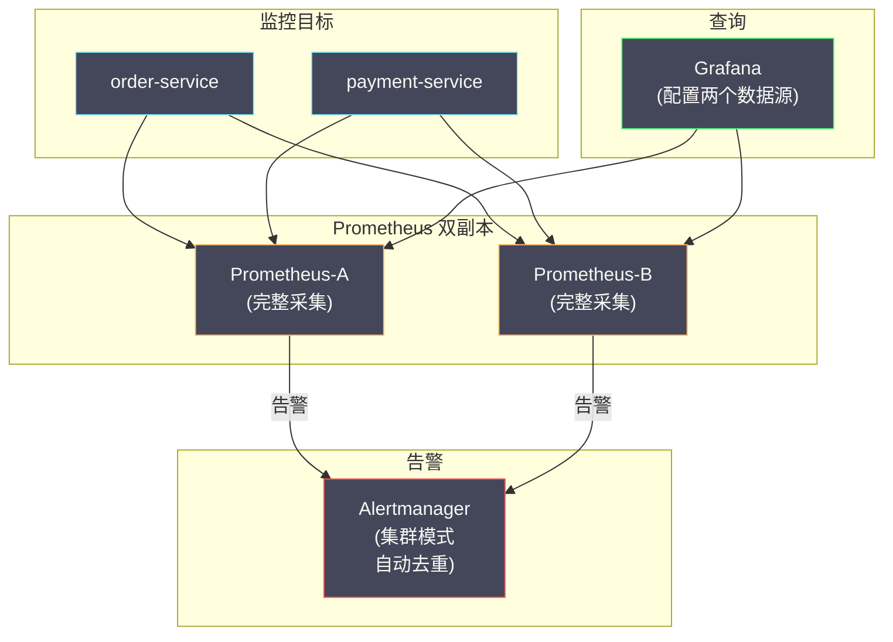
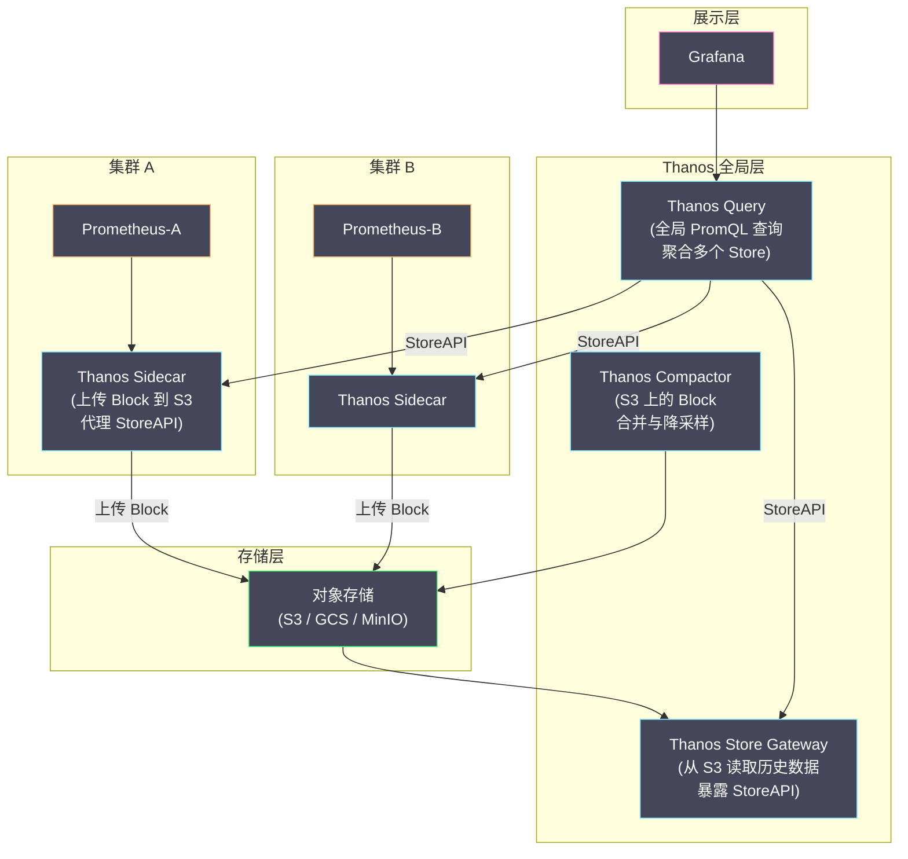
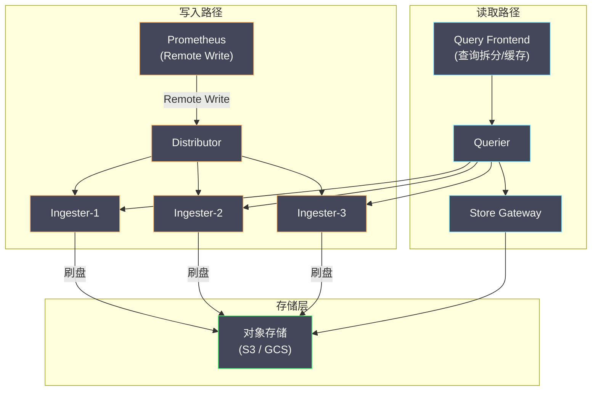
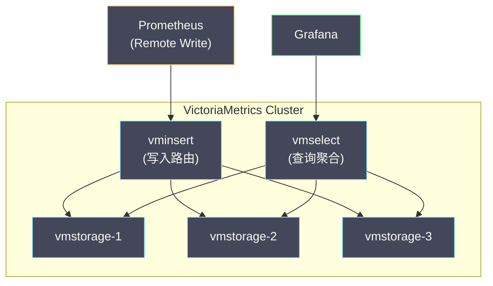
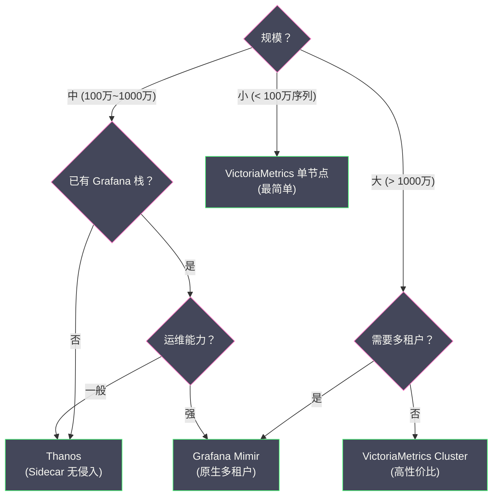

# 05 Prometheus 高可用与长期存储

**摘要：**

单实例 [[Prometheus]] 的设计哲学是"简单可靠"——单个二进制文件、本地存储、无外部依赖。但这种简单性在生产环境中会遇到两个硬约束：**单点故障**（Prometheus 宕机 = 监控盲区）和**存储上限**（本地磁盘容量有限，无法保留数月甚至数年的历史数据）。本文深入分析 Prometheus 高可用的基本方案（双副本 + Alertmanager 去重），然后系统对比三种主流的长期存储扩展方案——[[Thanos]]、[[Grafana Mimir]] 和 [[VictoriaMetrics]]，剖析它们各自的架构设计、核心组件、以及在不同规模下的选型建议。最后介绍 Remote Write 协议——连接 Prometheus 与外部长期存储的桥梁。

---

## 第 1 章 单实例 Prometheus 的瓶颈

### 1.1 单点故障问题

Prometheus 的本地 TSDB 存储在单机磁盘上，不支持内置的数据复制或集群模式。如果 Prometheus 实例所在的节点宕机（硬件故障、内核 Panic、OOM Kill），会导致：

- **监控盲区**：从宕机到恢复期间，没有指标数据被采集
- **告警失效**：Alerting Rule 无法执行，告警不会触发
- **数据丢失风险**：如果磁盘损坏，WAL 和 Block 数据不可恢复

对于生产环境的监控系统来说，"监控系统本身不可用"是不可接受的——它意味着在最需要监控的时刻（系统故障时）恰恰看不到任何数据。

### 1.2 存储容量瓶颈

单实例 Prometheus 的存储受限于本地磁盘容量。参考 [[04 Prometheus TSDB 深度解析]] 中的估算：10 万条活跃时间序列保留 15 天约需 11 GB——看似不大。但在大规模集群中：

- 活跃时间序列可能达到百万级（大量微服务 × 多维标签）
- 业务要求保留 90 天甚至 1 年的历史数据（用于容量规划和年度趋势分析）
- 多个 Kubernetes 集群的指标需要集中查询

此时单实例的本地磁盘远远不够。

### 1.3 全局视图缺失

如果团队管理多个 Kubernetes 集群（如多区域部署），通常每个集群部署一个 Prometheus 实例。工程师需要一个**全局视图**——跨所有集群查询指标、在一个仪表盘中展示所有集群的状态。单实例 Prometheus 无法提供这种跨集群的全局查询能力。

---

## 第 2 章 基本高可用：双副本方案

### 2.1 方案概述

Prometheus 官方推荐的最简单高可用方案是**运行两个完全相同的 Prometheus 实例**，它们使用完全相同的配置，独立采集相同的目标。



### 2.2 Alertmanager 的去重机制

两个 Prometheus 实例会产生**重复的告警**——同一条告警规则在两个实例上都会触发。[[Alertmanager]] 的集群模式（通过 [[Gossip 协议]] 同步状态）自动对重复告警进行去重，确保每条告警只发送一次通知。

```yaml
# Alertmanager 集群配置
alertmanager:
  cluster:
    peers:
      - alertmanager-0:9094
      - alertmanager-1:9094
      - alertmanager-2:9094
```

### 2.3 双副本方案的局限

**局限一：数据不完全一致**。两个 Prometheus 实例独立采集，由于网络抖动和 scrape 时间的微小差异，两个实例的数据不完全相同——同一时刻的同一指标可能有微小的数值差异。这在绝大多数场景中可以忽略，但在需要精确对比时可能造成困惑。

**局限二：不解决存储容量问题**。两个实例各自独立存储——总存储量反而翻倍。历史数据保留期仍然受限于本地磁盘。

**局限三：不提供全局视图**。Grafana 配置两个 Prometheus 数据源后，查询时只会使用其中一个——不支持跨两个实例的合并查询。

---

## 第 3 章 Remote Write：连接外部存储的桥梁

### 3.1 Remote Write 协议

**Remote Write** 是 Prometheus 将数据推送到外部长期存储的标准协议。当启用 Remote Write 时，Prometheus 在每次 scrape 后，将新数据点通过 HTTP POST 请求（Protocol Buffers 编码 + Snappy 压缩）发送到远端存储。

```yaml
# Prometheus 配置 Remote Write
remote_write:
  - url: "http://thanos-receive:19291/api/v1/receive"
    queue_config:
      capacity: 10000       # 内存队列容量
      max_shards: 30         # 最大并发发送数
      min_shards: 1
      max_samples_per_send: 5000
    write_relabel_configs:   # 可选：在发送前过滤/修改指标
      - source_labels: [__name__]
        regex: "go_.*"
        action: drop         # 不发送 go_ 开头的内部指标
```

### 3.2 Remote Write 的内部机制

Remote Write 使用一个**内存队列 + 分片发送**的架构来保证可靠传输：

```
scrape 写入 TSDB
       ↓
  WAL Watcher（监听 WAL 中的新数据）
       ↓
  内存队列（QueueManager）
       ↓
  分片发送（多个 goroutine 并行 POST）
       ↓
  远端存储
```

**WAL Watcher** 监听 WAL 文件的变化，将新写入的数据点读出并放入内存队列。**QueueManager** 管理多个发送分片（shard），每个分片是一个独立的 goroutine，负责将数据批量发送到远端。

如果远端存储暂时不可用（网络故障或远端过载），QueueManager 会缓冲数据并重试。但内存队列的容量有限——如果远端长时间不可用导致队列溢满，最早的数据会被丢弃。为了应对这种情况，Prometheus 2.29+ 引入了 **WAL-based Remote Write**——直接从 WAL 文件中读取数据而非依赖内存队列，利用 WAL 的磁盘存储作为更大的缓冲。

### 3.3 Remote Read

与 Remote Write 对应，**Remote Read** 允许 Prometheus 在查询时从远端存储读取历史数据。当 PromQL 查询的时间范围超出本地 TSDB 的保留期时，Prometheus 会向远端发送 Remote Read 请求，获取历史数据并与本地数据合并。

但 Remote Read 在实践中使用较少——因为 Thanos/Mimir/VictoriaMetrics 通常提供自己的查询接口（兼容 PromQL），Grafana 直接连接这些查询接口，不需要经过 Prometheus 的 Remote Read。

---

## 第 4 章 Thanos：Sidecar 模式的长期存储

### 4.1 Thanos 的设计哲学

[[Thanos]] 由 Improbable 公司在 2017 年开源，核心设计哲学是**在不修改 Prometheus 的前提下，通过 Sidecar 模式扩展其能力**。Thanos 不替代 Prometheus——它与 Prometheus 共存，为 Prometheus 添加全局查询和长期存储能力。

### 4.2 核心组件



**Thanos Sidecar**：与 Prometheus 部署在同一个 Pod 中。它有两个职责：
- **上传 Block**：当 Prometheus TSDB 生成新的持久化 Block 后，Sidecar 将 Block 上传到对象存储
- **代理 StoreAPI**：将 Prometheus 本地的最新数据（Head Block 中尚未上传的数据）通过 gRPC StoreAPI 暴露出来

**Thanos Query（Querier）**：全局查询入口，兼容 Prometheus 的 HTTP API 和 PromQL。Query 从多个 StoreAPI 源（Sidecar、Store Gateway、其他 Query）获取数据并合并去重。Grafana 连接 Thanos Query 作为数据源，即可实现跨集群的全局查询。

**Thanos Store Gateway**：从对象存储中读取历史 Block 数据，通过 StoreAPI 暴露给 Query。Store Gateway 会缓存 Block 的索引文件到本地磁盘，避免每次查询都从对象存储下载索引。

**Thanos Compactor**：在对象存储层面执行 Block 的合并（Compaction）和降采样（Downsampling）。降采样将高分辨率的数据（如每 15 秒一个点）聚合为低分辨率（如每 5 分钟或每 1 小时一个点），大幅减少历史数据的存储量和查询开销。

### 4.3 去重机制

当多个 Prometheus 实例采集相同目标（双副本高可用）时，对象存储中会存在重复的 Block。Thanos Query 通过 **external_labels** 和 **replica 标签**识别并去重：

```yaml
# Prometheus-A 的配置
global:
  external_labels:
    cluster: "us-east-1"
    replica: "A"

# Prometheus-B 的配置
global:
  external_labels:
    cluster: "us-east-1"
    replica: "B"
```

Thanos Query 在合并数据时，识别出 `replica` 标签不同但其余标签相同的时间序列，取其中一份作为结果——实现了自动去重。

### 4.4 Thanos 的优势与局限

**优势**：
- 对 Prometheus 无侵入——Sidecar 模式不修改 Prometheus 的任何行为
- 利用对象存储实现几乎无限的历史数据保留
- 降采样功能显著减少长期查询的开销
- 社区成熟，CNCF Incubating 项目

**局限**：
- 组件较多（Sidecar、Query、Store Gateway、Compactor），运维复杂度高
- Block 上传有延迟（每 2 小时一个 Block）——对象存储中的数据滞后于 Prometheus 本地数据约 2 小时
- 写入路径仍然依赖 Prometheus——不支持直接接收 Remote Write

---

## 第 5 章 Grafana Mimir：云原生的水平扩展

### 5.1 Mimir 的设计哲学

[[Grafana Mimir]] 是 Grafana Labs 在 2022 年开源的长期指标存储，前身是 Cortex 项目。Mimir 的设计哲学与 Thanos 不同——它不是作为 Prometheus 的"附加组件"，而是一个**独立的、水平可扩展的指标存储后端**。Prometheus 通过 Remote Write 将数据推送到 Mimir，Mimir 负责存储、查询和告警。

### 5.2 核心架构

Mimir 采用微服务架构，核心组件包括：

**Distributor（分发器）**：接收来自 Prometheus 的 Remote Write 请求，对数据进行验证（标签格式、时间戳范围、速率限制），然后根据时间序列的标签 hash 路由到对应的 Ingester。

**Ingester（摄入器）**：在内存中缓冲最新数据，定期将数据块刷写到对象存储。Ingester 使用一致性 hash ring 实现分片，每条时间序列由 N 个 Ingester 副本同时处理（默认 N=3），通过 Quorum 写入保证数据可靠性。

**Store Gateway**：从对象存储中读取历史数据，缓存索引文件到本地磁盘。

**Querier（查询器）**：执行 PromQL 查询，同时从 Ingester（最新数据）和 Store Gateway（历史数据）获取数据并合并。

**Compactor**：在对象存储上执行 Block 的合并和清理。



### 5.3 Mimir 的核心优势

**水平扩展**：Mimir 的每个组件（Distributor、Ingester、Querier、Store Gateway）都可以独立水平扩展。写入量增加时增加 Ingester，查询量增加时增加 Querier——不需要重新分片或迁移数据。

**多租户原生支持**：Mimir 从设计之初就支持多租户——每个租户的数据完全隔离，可以独立配置速率限制和保留策略。这使得 Mimir 非常适合作为组织级别的共享指标平台。

**高可用写入**：Ingester 通过 3 副本 Quorum 写入（写入成功需要至少 2 个副本确认），即使 1 个 Ingester 宕机也不会丢数据。

**Query Frontend 优化**：Query Frontend 将大时间范围的查询拆分为多个小查询并行执行，并缓存查询结果——显著提升大范围查询的响应速度。

### 5.4 Mimir 的局限

- **运维复杂度高**：微服务架构意味着更多的组件需要部署和监控
- **依赖对象存储**：Mimir 不支持纯本地存储模式——必须配置 S3/GCS/MinIO
- **资源消耗**：Ingester 需要较多的内存（缓冲活跃数据），在小规模部署中可能显得"大材小用"

---

## 第 6 章 VictoriaMetrics：高性能的替代方案

### 6.1 VictoriaMetrics 的定位

[[VictoriaMetrics]]（简称 VM）是一个高性能的时间序列数据库，兼容 Prometheus 的数据模型和查询协议。它既可以作为 Prometheus 的 Remote Write 长期存储，也可以**直接替代 Prometheus**（自带 scrape 功能和兼容 PromQL 的 MetricsQL 查询语言）。

### 6.2 单节点 vs 集群模式

**VictoriaMetrics 单节点**：一个二进制文件包含了存储、查询和采集所有功能。单节点模式下 VM 的性能通常远超同等资源的 Prometheus——因为 VM 的存储引擎针对时间序列做了比 Prometheus TSDB 更激进的压缩优化（官方声称压缩比是 Prometheus 的 7 倍以上）。

**VictoriaMetrics Cluster**：分为三个组件：
- **vminsert**：接收 Remote Write 写入
- **vmstorage**：数据存储（可水平分片）
- **vmselect**：查询处理



### 6.3 VictoriaMetrics 的核心优势

**极致的压缩和性能**：VM 的自研存储引擎在压缩比和查询速度上都优于 Prometheus TSDB。根据社区基准测试，VM 在相同数据量下通常只需要 Prometheus 1/7 的磁盘空间和 1/3 的内存。

**运维简单**：单节点模式只需一个二进制文件，配置比 Thanos 和 Mimir 简单得多。即使是集群模式，组件数量也比 Mimir 少。

**MetricsQL**：VM 的查询语言 MetricsQL 完全兼容 PromQL，并在此基础上增加了一些实用功能（如 `rollup_rate`、`range_median` 等），以及更宽松的语法。

**成本效益**：VM 的高压缩比和低资源消耗意味着在相同的硬件上可以存储更多数据、保留更长时间。

### 6.4 VictoriaMetrics 的局限

- **非 CNCF 项目**：社区规模和生态不如 Thanos 和 Mimir
- **部分高级功能需要企业版**：如集群版的降采样、告警去重等
- **集群模式不支持数据复制**：vmstorage 节点宕机时，该分片的数据暂时不可查询（但不丢失，节点恢复后数据可用）

---

## 第 7 章 三种方案的选型对比

### 7.1 综合对比表

| 维度 | Thanos | Grafana Mimir | VictoriaMetrics |
| :--- | :--- | :--- | :--- |
| **架构模式** | Sidecar + 全局查询 | 独立的微服务后端 | 单节点 / 轻量集群 |
| **与 Prometheus 的关系** | 附加组件（不修改 Prometheus）| Remote Write 后端（替代本地存储）| 可替代 Prometheus 或作为后端 |
| **对象存储** | 必需 | 必需 | 可选（本地磁盘或对象存储）|
| **多租户** | 有限支持 | 原生支持 | 企业版支持 |
| **降采样** | ✅ Compactor 内置 | ❌ 不支持（计划中）| ✅ 企业版支持 |
| **写入高可用** | 依赖 Prometheus 双副本 | Ingester 3 副本 Quorum | 集群版无副本 |
| **运维复杂度** | 高（5+ 组件）| 高（5+ 组件）| 低（单节点 1 组件 / 集群 3 组件）|
| **压缩效率** | 与 Prometheus 相同 | 与 Prometheus 相同 | 远优于 Prometheus |
| **社区生态** | CNCF Incubating | Grafana Labs 主导 | 独立社区 |
| **许可证** | Apache 2.0 | AGPL 3.0 | Apache 2.0（OSS）|

### 7.2 选型建议



**小规模（< 100 万活跃时间序列）**：VictoriaMetrics 单节点是最佳选择——部署简单、性能优异、成本最低。一个 4C16G 的 VM 单节点通常可以轻松处理百万级时间序列。

**中规模（100 万~1000 万）**：如果团队已有 Grafana 栈且运维能力强，Mimir 是最完善的选择；如果希望最小化对现有 Prometheus 的改动，Thanos 的 Sidecar 模式更合适；如果追求性价比，VictoriaMetrics Cluster 是很好的折中。

**大规模（> 1000 万）**：Mimir 和 VictoriaMetrics Cluster 都能胜任。需要多租户时选 Mimir，追求运维简单和成本效率时选 VM。

---

## 参考资料

1. Thanos Documentation：https://thanos.io/tip/thanos/getting-started.md/
2. Grafana Mimir Documentation：https://grafana.com/docs/mimir/latest/
3. VictoriaMetrics Documentation：https://docs.victoriametrics.com/
4. Prometheus Remote Write Specification：https://prometheus.io/docs/concepts/remote_write_spec/
5. Bartek Plotka, Fabian Reinartz (2019). *Thanos - Highly Available Prometheus Setup with Long Term Storage Capabilities*. KubeCon EU.
6. Grafana Labs (2022). *Introducing Grafana Mimir*. Grafana Blog.
7. VictoriaMetrics Benchmarks：https://docs.victoriametrics.com/articles/benchmarks.html

---

> [!note] 思考题
> 1. Prometheus 的 TSDB 将数据分为 2 小时一个 Block——Block 内的数据不可变。WAL（Write-Ahead Log）记录最近的写入。Compaction 将多个小 Block 合并为大 Block 以提高查询效率。在什么场景下 Compaction 的 IO 开销需要关注？
> 2. Prometheus 的本地存储不支持高可用——单实例崩溃后数据丢失。Thanos Sidecar 将 Block 上传到对象存储实现长期存储和高可用。Thanos Query 可以跨多个 Prometheus 实例查询——实现全局视图。Thanos 的 Store Gateway 如何从对象存储查询历史数据？查询延迟与本地存储相比差多少？
> 3. VictoriaMetrics 是 Prometheus 的替代方案——兼容 PromQL 且存储效率更高（压缩率是 Prometheus 的 2-5 倍）。VictoriaMetrics 支持集群模式（水平扩展）。在什么规模下你会考虑从 Prometheus 迁移到 VictoriaMetrics？迁移的兼容性问题有哪些？
