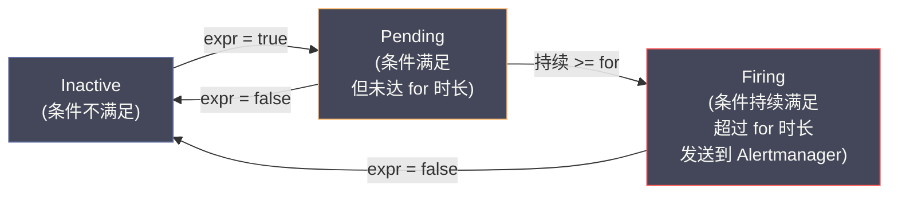

# 06 Grafana 仪表盘与告警工程化

**摘要：**

指标数据本身不产生价值——只有当它们被可视化为趋势图、热力图、TopK 列表，并在异常时触发告警通知到工程师手中，指标才能真正发挥作用。[[Grafana]] 是可观测性领域事实上的统一可视化层，几乎所有的指标后端（[[Prometheus]]、[[Thanos]]、[[Grafana Mimir]]、[[VictoriaMetrics]]）都以 Grafana 作为前端展示。但"能用 Grafana"和"用好 Grafana"之间有巨大差距——一个设计良好的仪表盘能让工程师在 10 秒内判断系统健康状态，而一个糟糕的仪表盘只会增加认知负担。本文从仪表盘设计原则出发，介绍变量与模板化、面板类型选择、告警规则设计，以及 [[Alertmanager]] 的路由、分组与静默机制，帮助团队将仪表盘和告警从"能用"提升到"好用"。

---

## 第 1 章 仪表盘设计原则

### 1.1 仪表盘的目标受众

设计仪表盘之前，首先要明确"谁在看这个仪表盘"以及"他们想回答什么问题"。不同的受众有不同的需求：

| 受众 | 核心问题 | 仪表盘特征 |
| :--- | :--- | :--- |
| **值班 SRE（On-Call）** | 系统现在健不健康？哪里出了问题？ | RED 指标为主，醒目的状态颜色，时间范围默认"最近 1 小时" |
| **服务 Owner** | 我的服务运行得怎么样？有没有性能退化？ | 详细的服务指标、延迟分位数、依赖健康度 |
| **平台/Infra 团队** | 集群资源使用情况？容量还够吗？ | USE 指标，节点级别的 CPU/内存/磁盘 |
| **管理层** | 系统整体可用性如何？SLO 达标了吗？ | SLO 达标率、Error Budget 剩余、趋势对比 |

**一个仪表盘不应该试图服务所有受众**。为不同受众创建不同的仪表盘，每个仪表盘聚焦回答特定的问题集。

### 1.2 信息层级：从概览到详情

好的仪表盘遵循"**从上到下，从概览到详情**"的信息层级：

**第一行（Overview Row）**：最重要的全局指标——总 QPS、全局错误率、全局 P99 延迟。工程师扫一眼就能判断"系统整体是否正常"。使用 Stat 面板或 Gauge 面板，配合颜色阈值（绿色 = 正常，黄色 = 警告，红色 = 严重）。

**第二行（Service-level Row）**：按服务维度展示 RED 指标——每个服务的 QPS、错误率、P99。使用时间序列面板（Time Series Panel），每条曲线代表一个服务。

**第三行（Detail Row）**：详细的分维度指标——按 HTTP 方法、状态码、端点路径分别展示。使用表格面板（Table Panel）或热力图（Heatmap）。

**第四行（Infrastructure Row）**：底层资源指标——CPU、内存、磁盘、网络。只在排查基础设施瓶颈时才需要关注。

### 1.3 面板数量与认知负荷

每个仪表盘的面板数量应该控制在 **15~25 个**以内。过多的面板会导致：
- 页面加载时间过长（每个面板独立查询 Prometheus）
- 信息过载——工程师无法在短时间内消化所有信息
- 滚动过多——重要信息被埋在页面底部

如果一个仪表盘需要超过 25 个面板，考虑拆分为多个仪表盘，并通过 Grafana 的 **Dashboard Links** 在仪表盘之间建立跳转关系。

---

## 第 2 章 变量与模板化

### 2.1 为什么需要变量

如果团队有 50 个微服务，为每个服务创建一个独立的仪表盘是不可维护的——50 个仪表盘的 PromQL 查询几乎完全相同，只是 `service` 标签的值不同。任何查询的修改都需要重复 50 次。

**变量（Variables）** 允许在仪表盘中定义可选参数，在所有面板的查询中引用这个参数。工程师在仪表盘顶部的下拉菜单中选择服务名，所有面板自动切换到该服务的数据。

### 2.2 变量类型

| 变量类型 | 数据来源 | 典型用途 |
| :--- | :--- | :--- |
| **Query** | PromQL 查询结果 | 从 Prometheus 动态获取服务列表 |
| **Custom** | 手动定义的值列表 | 固定的环境列表（prod, staging, dev）|
| **Datasource** | Grafana 中配置的数据源列表 | 多集群切换 |
| **Interval** | 时间间隔 | 动态调整 rate() 的范围 |
| **Text box** | 用户输入的文本 | 按 Trace ID 搜索 |

**最常用的 Query 变量示例**：

```
# 变量名：service
# 查询：获取所有有 http_requests_total 指标的服务名
label_values(http_requests_total, service)

# 变量名：namespace
# 查询：获取所有命名空间
label_values(kube_pod_info, namespace)

# 变量名：instance
# 查询：获取指定服务的所有实例（级联变量，依赖 $service）
label_values(http_requests_total{service="$service"}, instance)
```

### 2.3 在查询中使用变量

变量通过 `$variable_name` 或 `${variable_name}` 语法引用：

```
# 单选变量
rate(http_requests_total{service="$service"}[5m])

# 多选变量（All 选项会展开为正则）
rate(http_requests_total{service=~"$service"}[5m])

# Interval 变量（动态调整 rate 范围）
rate(http_requests_total{service="$service"}[$__rate_interval])
```

> [!info] $__rate_interval 的重要性
> `$__rate_interval` 是 Grafana 内置的特殊变量——它根据当前的 scrape_interval 和仪表盘的时间范围自动计算 `rate()` 的最佳范围。手动写 `rate(xxx[5m])` 在 scrape_interval = 30s 的情况下可能只有 10 个数据点；而 `$__rate_interval` 保证至少有 4 个数据点，避免速率计算的统计失真。**生产环境中应始终使用 `$__rate_interval` 替代硬编码的时间范围。**

### 2.4 模板化仪表盘的最佳实践

**实践一：使用级联变量**。先选 `namespace`，再选 `service`（根据 namespace 过滤），再选 `instance`（根据 service 过滤）。级联变量使得仪表盘可以从粗到细逐步钻取。

**实践二：提供"All"选项**。允许用户选择"所有服务"查看全局视图，或选择单个服务查看详情。在查询中使用正则匹配 `{service=~"$service"}` 来支持多选。

**实践三：Repeating Rows/Panels**。Grafana 支持根据变量值自动重复行或面板。例如，选择了 3 个服务后，自动生成 3 行相同结构的面板，每行展示一个服务的详细指标。

---

## 第 3 章 面板类型选择

### 3.1 常用面板类型

| 面板类型 | 适用场景 | 典型指标 |
| :--- | :--- | :--- |
| **Time Series** | 展示随时间变化的趋势 | QPS、延迟、CPU 使用率 |
| **Stat** | 展示单个数值的当前状态 | 当前错误率、当前 P99 |
| **Gauge** | 展示值在范围中的位置 | 磁盘使用率（0~100%）|
| **Bar Gauge** | 多个值的横向对比 | 各服务的错误率排名 |
| **Table** | 展示多维度的详细数据 | 每个端点的 QPS、错误率、P99 |
| **Heatmap** | 展示分布随时间的变化 | 请求延迟分布 |
| **State Timeline** | 展示状态的时间线 | 服务 up/down 状态 |
| **Alert List** | 展示当前活跃的告警 | 告警列表 |

### 3.2 Heatmap：延迟分布的最佳可视化

Heatmap（热力图）是展示 Histogram 数据最直观的方式。X 轴是时间，Y 轴是延迟桶的边界，颜色深浅表示该时间段内落入该桶的请求数量。

```
# Heatmap 的数据源查询
sum(increase(http_request_duration_seconds_bucket{service="$service"}[$__rate_interval])) by (le)
```

Heatmap 的优势在于它能同时展示**分布形状**和**分布随时间的变化**——P99 从 200ms 突然跳到 2s 的情况在 Heatmap 上一目了然（会看到一条突然出现的高延迟色带），而在普通的 P99 折线图上可能不那么直观。

### 3.3 面板配置技巧

**颜色阈值（Thresholds）**：为 Stat 和 Gauge 面板配置颜色阈值，让工程师无需阅读数字就能判断状态：
- 错误率：绿色 < 0.1%，黄色 0.1%~1%，红色 > 1%
- P99 延迟：绿色 < 500ms，黄色 500ms~2s，红色 > 2s
- 磁盘使用率：绿色 < 70%，黄色 70%~85%，红色 > 85%

**Legend 格式化**：在 Time Series 面板中，默认的 Legend 是完整的标签集（如 `{service="order-service", method="POST", status="200"}`），非常长且难以阅读。通过 Legend 格式化模板提取关键信息：
- `{{service}} - {{method}}` → `order-service - POST`
- `{{instance}}` → `10.0.0.1:8080`

**单位设置**：始终为面板设置正确的单位（秒、字节、百分比）。Grafana 会自动进行单位转换（如 `0.005` 秒显示为 `5ms`，`1073741824` 字节显示为 `1 GiB`）。

---

## 第 4 章 Prometheus 告警规则

### 4.1 告警规则的结构

Prometheus 的告警规则定义在 YAML 配置文件中：

```yaml
groups:
  - name: service_alerts
    rules:
      - alert: HighErrorRate
        expr: |
          sum(rate(http_requests_total{status=~"5.."}[5m])) by (service)
          / sum(rate(http_requests_total[5m])) by (service) > 0.01
        for: 5m
        labels:
          severity: critical
        annotations:
          summary: "服务 {{ $labels.service }} 错误率过高"
          description: "{{ $labels.service }} 的 5xx 错误率已达 {{ $value | humanizePercentage }}，持续超过 5 分钟"
          runbook_url: "https://wiki.internal/runbooks/high-error-rate"
```

**expr**：PromQL 表达式。当表达式的结果 > 0（或满足指定的比较条件）时，告警进入 Pending 状态。

**for**：持续时间。告警必须在 `for` 指定的时间内持续满足条件，才会从 Pending 变为 Firing。这个设计是为了**避免瞬时抖动导致的误报**——一个 1 秒的错误率尖峰不应该触发告警。

**labels**：附加到告警上的标签，用于 Alertmanager 的路由和分组。`severity` 是最常用的路由标签。

**annotations**：告警的描述信息，支持 Go 模板语法引用标签值和指标值。`runbook_url` 链接到操作手册——这是告警工程化的关键实践。

### 4.2 告警状态机



### 4.3 好的告警规则的特征

**特征一：可操作（Actionable）**。收到告警后，工程师应该能够采取具体的行动。"CPU 使用率 > 80%"本身不可操作——80% 可能是正常的（批处理场景）。"服务 P99 延迟 > SLO 阈值 持续 5 分钟"是可操作的——它意味着用户体验正在下降，需要排查。

**特征二：有上下文（Contextual）**。告警的 annotations 应该包含足够的上下文信息——当前值是多少、阈值是多少、影响了哪个服务/集群、操作手册的链接。值班工程师不应该需要先打开 Grafana 才能理解告警的含义。

**特征三：不抖动（Non-flapping）**。告警不应该频繁触发和恢复（这被称为"告警抖动"或 flapping）。常见的抖动原因：
- `for` 时长设置太短（如 1m），瞬时波动就能触发
- 阈值设置在系统正常波动范围的边界上
- 使用了 `irate()` 而非 `rate()`

解决方法：增加 `for` 时长、调整阈值留出余量、使用 `rate()` 平滑短期波动。

**特征四：分级（Severity-tiered）**。不是所有告警都需要立即响应。常用的分级：

| Severity | 含义 | 响应方式 |
| :--- | :--- | :--- |
| `critical` | 用户可感知的服务中断 | 立即响应，电话/PagerDuty |
| `warning` | 潜在风险，尚未影响用户 | 工作时间处理，Slack/邮件 |
| `info` | 信息性通知 | 记录，不需要立即处理 |

---

## 第 5 章 Alertmanager：告警的路由与通知

### 5.1 Alertmanager 的角色

[[Alertmanager]] 是 Prometheus 生态中专门处理告警通知的组件。Prometheus 负责**评估告警规则**（判断条件是否满足），Alertmanager 负责**告警的去重、分组、路由和通知**。

这种分离设计使得多个 Prometheus 实例可以共享一个 Alertmanager 集群——即使 Prometheus 双副本各自独立触发相同的告警，Alertmanager 也只发送一次通知。

### 5.2 告警路由（Routing）

Alertmanager 通过**路由树（Routing Tree）**将不同的告警发送到不同的通知渠道：

```yaml
route:
  receiver: "default-slack"          # 默认接收器
  group_by: ["alertname", "service"] # 按 alertname + service 分组
  group_wait: 30s                    # 等待 30 秒收集同组告警
  group_interval: 5m                 # 同组告警的通知间隔
  repeat_interval: 4h                # 未恢复告警的重复通知间隔
  
  routes:
    # critical 告警 → PagerDuty
    - match:
        severity: critical
      receiver: "pagerduty-oncall"
      group_wait: 10s                # critical 告警等待时间更短
      repeat_interval: 1h
    
    # 特定团队的告警 → 团队 Slack 频道
    - match_re:
        service: "order.*|payment.*"
      receiver: "trade-team-slack"
    
    # warning 告警 → 邮件
    - match:
        severity: warning
      receiver: "email-oncall"
      repeat_interval: 12h
```

### 5.3 分组（Grouping）

`group_by` 是 Alertmanager 最重要的配置之一。它将匹配相同 `group_by` 标签的告警合并为一条通知，避免"告警风暴"。

**没有分组的场景**：如果 50 个服务同时触发 `HighErrorRate` 告警，值班工程师会收到 50 条独立的通知——手机疯狂震动，但每条通知的信息价值都很低。

**有分组的场景**：`group_by: ["alertname"]` 将 50 条 `HighErrorRate` 告警合并为一条通知，内容中列出所有受影响的服务。工程师只需处理一条通知，立即看到全局影响范围。

`group_wait` 控制"等多久再发送"——在收到第一条告警后等待 30 秒，收集同组的其他告警，然后一次性发送。这样如果 50 个服务在 30 秒内陆续触发告警，它们会被合并为一条通知。

### 5.4 静默（Silences）

**静默（Silence）** 允许在指定时间范围内屏蔽匹配特定标签的告警通知。典型使用场景：

- **计划内维护**：升级 Kubernetes 集群前，静默该集群的所有告警
- **已知问题**：某个服务正在修复中，静默其告警避免重复通知
- **误报**：告警规则有 bug 导致误报，在修复规则前先静默

```
# 通过 Alertmanager API 创建 Silence
POST /api/v2/silences
{
  "matchers": [
    {"name": "service", "value": "order-service", "isRegex": false}
  ],
  "startsAt": "2024-01-01T10:00:00Z",
  "endsAt": "2024-01-01T12:00:00Z",
  "createdBy": "engineer@company.com",
  "comment": "计划内维护：order-service 版本升级"
}
```

> [!warning] 静默的治理
> 静默是一把双刃剑——它可以屏蔽噪音，也可以掩盖真实问题。团队应该建立**静默治理**机制：
> - 每个静默必须填写原因（`comment`）和负责人（`createdBy`）
> - 静默的持续时间不应超过 24 小时（除非有明确的长期计划）
> - 定期审查活跃的静默列表，清理过期或不再需要的静默
> - 监控 `alertmanager_silences_active` 指标，防止静默数量失控

### 5.5 通知渠道（Receivers）

Alertmanager 支持多种通知渠道：

| 渠道 | 适用场景 |
| :--- | :--- |
| **PagerDuty** | Critical 告警，需要立即响应 |
| **Slack / 飞书 / 钉钉** | Warning 告警，团队协作 |
| **Email** | 低优先级告警，日报 |
| **Webhook** | 自定义集成（如写入数据库、触发自动化修复）|
| **OpsGenie** | 替代 PagerDuty 的告警管理平台 |

---

## 第 6 章 告警工程化的最佳实践

### 6.1 Runbook：告警的操作手册

每条告警规则都应该关联一个 **Runbook（操作手册）**——记录收到该告警后的具体排查和处理步骤。Runbook 通过告警的 `runbook_url` annotation 链接。

一个好的 Runbook 包含：
- **告警含义**：这条告警意味着什么？影响范围是什么？
- **排查步骤**：按优先级列出排查路径（先看什么、再看什么）
- **常见根因**：历史上这条告警通常是什么原因导致的
- **修复操作**：如何修复（重启服务、扩容、回滚）
- **升级路径**：如果值班工程师无法处理，应该联系谁

### 6.2 告警的 as-code 管理

告警规则和 Grafana 仪表盘应该像代码一样管理——存储在 Git 仓库中，通过 CI/CD 自动部署，经过 Code Review 才能合并。

**Prometheus 告警规则**：YAML 文件，存储在 Git 中，通过 ConfigMap 或 Prometheus Operator 的 PrometheusRule CRD 部署。

**Grafana 仪表盘**：JSON 文件，可以通过 Grafana 的 Provisioning 功能从文件系统自动加载，也可以通过 Grafana HTTP API 部署。

**Alertmanager 配置**：YAML 文件，存储在 Git 中，通过 Secret 或 Alertmanager Operator 部署。

```
monitoring-config/
  prometheus/
    rules/
      service-alerts.yaml
      infrastructure-alerts.yaml
  alertmanager/
    alertmanager.yaml
  grafana/
    dashboards/
      service-overview.json
      infrastructure.json
    provisioning/
      datasources.yaml
      dashboards.yaml
```

### 6.3 告警的度量与持续改进

告警系统本身也需要被监控和持续改进。关键指标：

```
# 告警触发频率：哪些告警最频繁触发？
count by (alertname) (ALERTS{alertstate="firing"})

# 告警持续时间：告警从触发到恢复的平均时间
# （需要从 Alertmanager 的日志或 API 中统计）

# 告警静默比例：有多大比例的告警被静默了？
# 高静默率意味着告警规则质量差或阈值设置不合理
```

定期（如每月）进行**告警审计**：
- 哪些告警从未触发？→ 可能阈值设置过宽，或监控的场景已不存在
- 哪些告警频繁触发但无人处理？→ 要么是噪音（删除或调整），要么是团队已习惯忽略（危险信号）
- 哪些故障没有触发告警？→ 需要补充新的告警规则

---

## 参考资料

1. Grafana Documentation - Dashboards：https://grafana.com/docs/grafana/latest/dashboards/
2. Grafana Documentation - Variables：https://grafana.com/docs/grafana/latest/dashboards/variables/
3. Prometheus Documentation - Alerting Rules：https://prometheus.io/docs/prometheus/latest/configuration/alerting_rules/
4. Alertmanager Documentation - Configuration：https://prometheus.io/docs/alerting/latest/configuration/
5. Rob Ewaschuk (2012). *My Philosophy on Alerting*. Google SRE.
6. Google SRE Book, Chapter 6 - Monitoring Distributed Systems：https://sre.google/sre-book/monitoring-distributed-systems/
7. Grafana Best Practices - Dashboard Design：https://grafana.com/docs/grafana/latest/best-practices/
