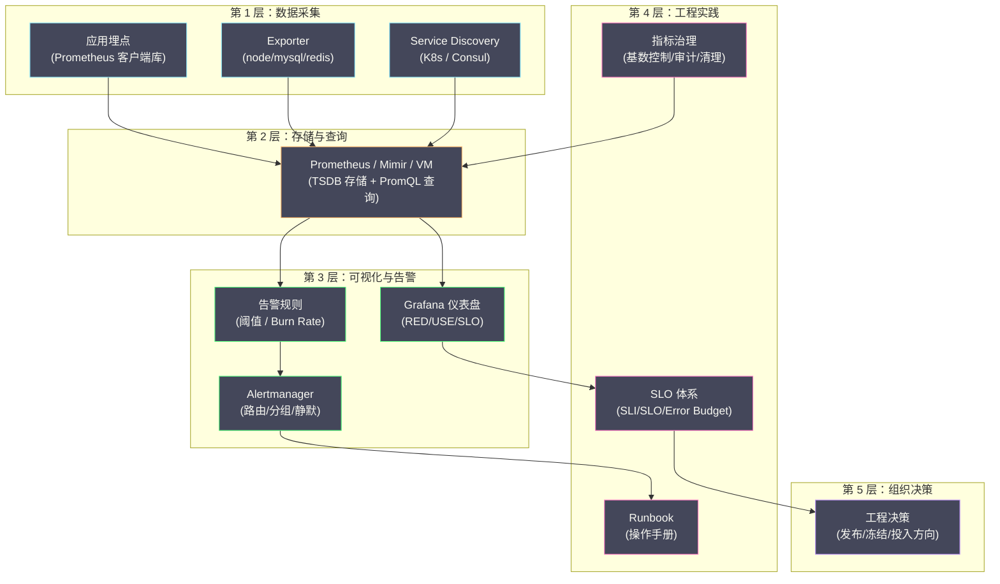

# 07 指标工程落地与 SLO 体系

**摘要：**

前六篇文章从指标的定义、Prometheus 的数据模型与采集、PromQL 查询、TSDB 存储、高可用方案，到 Grafana 仪表盘与告警，完成了"指标系统怎么搭建"的技术链路。但技术链路只是基础——更根本的问题是"**指标系统怎么用好**"。本文作为指标子专栏的收官之作，聚焦两个工程主题：一是**指标治理**——如何管控指标的数量和质量，避免时间序列爆炸导致的性能与成本危机；二是 **SLO 体系**——如何将指标转化为可量化的服务质量目标，用 Error Budget 驱动工程决策，实现"在可靠性与迭代速度之间找到最优平衡点"。

---

## 第 1 章 指标治理：管控时间序列的增长

### 1.1 时间序列爆炸的根因

在 [[01 为什么需要指标]] 和 [[02 Prometheus 数据模型与采集原理]] 中我们反复强调了标签基数（Cardinality）的问题。这里从工程治理的角度做一个系统梳理。

**时间序列数量 = 指标名称数 × 标签组合数**。

一个微服务暴露 100 个指标，每个指标有 `method`（5 个值）× `status`（10 个值）× `instance`（20 个实例）= 1000 种标签组合，该服务的时间序列数为 100 × 1000 = 100,000。如果集群中有 50 个这样的服务，总时间序列数就是 500 万——这已经开始给 Prometheus 造成显著的内存和 CPU 压力。

时间序列爆炸的常见根因：

**根因一：高基数标签**。将用户 ID、订单 ID、IP 地址、完整 URL 路径等高基数值作为标签。一个标签有 10 万个不同的值，其他标签的组合会被放大 10 万倍。

**根因二：Histogram 桶数过多**。每个 Histogram 桶是一条独立的时间序列。如果一个 Histogram 有 20 个桶，配合 `method`（5 值）× `status`（10 值）× `instance`（20 个），单个 Histogram 指标就会产生 20 × 5 × 10 × 20 = 20,000 条时间序列。

**根因三：指标命名不规范**。开发者随意创建新指标而不复用已有的——同一个功能可能有 `order_process_time`、`order_processing_duration`、`order_latency` 三个含义相同的指标。

**根因四：废弃指标未清理**。服务迭代过程中，旧的指标不再使用但仍然暴露——它们占用时间序列配额但没有人查看。

### 1.2 时间序列爆炸的后果

当活跃时间序列数突破 Prometheus 的承受能力时：

- **内存溢出**：Head Block 的倒排索引和活跃 Chunk 占用大量内存，可能导致 OOM Kill
- **scrape 超时**：目标的 `/metrics` 端点返回的数据量太大，超过 scrape_timeout
- **查询缓慢**：PromQL 需要加载的时间序列越多，查询延迟越高
- **存储成本膨胀**：更多的时间序列 = 更大的 TSDB 磁盘占用

### 1.3 治理手段

**手段一：指标注册制**

建立团队级别的**指标注册表**——所有新指标必须经过审核才能上线。注册表记录每个指标的名称、类型、标签列表、所有者、用途和创建日期。这样可以避免重复指标和高基数标签在源头进入系统。

**手段二：metric_relabel_configs 过滤**

在 Prometheus 的 scrape 配置中使用 `metric_relabel_configs` 在采集时丢弃不需要的指标：

```yaml
scrape_configs:
  - job_name: "order-service"
    metric_relabel_configs:
      # 丢弃所有 go_ 和 process_ 开头的内部指标
      - source_labels: [__name__]
        regex: "(go|process)_.*"
        action: drop
      
      # 丢弃特定的高基数 Histogram
      - source_labels: [__name__]
        regex: "http_request_duration_seconds_bucket"
        source_labels: [le]
        regex: "(0.001|0.002|0.003)"  # 过于密集的桶
        action: drop
```

**手段三：Recording Rules 降维**

使用 Recording Rule 将高维数据预聚合为低维数据，然后只保留低维的预聚合结果，丢弃高维的原始数据：

```yaml
# 预聚合：按 service 聚合（丢弃 instance、pod 等维度）
- record: service:http_requests:rate5m
  expr: sum(rate(http_requests_total[5m])) by (service, method, status)
```

**手段四：监控指标本身**

Prometheus 暴露了自身的运行指标，用于监控时间序列的增长：

```
# 当前活跃时间序列数
prometheus_tsdb_head_series

# 每次 scrape 新增的时间序列数（突增意味着新指标上线或标签爆炸）
prometheus_tsdb_head_series_created_total

# 每个 job 的 scrape 采样点数
scrape_samples_scraped

# 每个 job 的 scrape 耗时
scrape_duration_seconds
```

为这些指标设置告警：

```yaml
- alert: HighCardinalityWarning
  expr: prometheus_tsdb_head_series > 2000000
  for: 10m
  labels:
    severity: warning
  annotations:
    summary: "活跃时间序列数超过 200 万"
```

**手段五：定期审计**

通过 PromQL 找出占用时间序列最多的指标和标签：

```
# 每个指标名称的时间序列数（找出"大户"）
count by (__name__) ({__name__=~".+"})

# 每个 job 的时间序列数
count by (job) ({__name__=~".+"})
```

---

## 第 2 章 SLI：服务级别指标

### 2.1 什么是 SLI

**SLI（Service Level Indicator，服务级别指标）** 是对用户体验的**可量化度量**。它不是任意的系统指标——它必须直接反映用户感知到的服务质量。

Google SRE 在《Site Reliability Engineering》一书中将 SLI 定义为：

> SLI 是对服务某个方面的可量化度量，通常表示为"好的事件"与"总事件"的比值。

例如：
- **可用性 SLI** = 成功请求数 / 总请求数（HTTP 状态码 < 500 的比例）
- **延迟 SLI** = 延迟 < 阈值的请求数 / 总请求数（如 P99 < 500ms 的请求比例）
- **吞吐量 SLI** = 成功处理的请求数 / 期望处理的请求数

### 2.2 如何选择 SLI

**原则一：SLI 必须反映用户体验**。"CPU 使用率"不是好的 SLI——CPU 高可能意味着资源被充分利用（好事），也可能意味着即将过载（坏事）。"请求成功率"是好的 SLI——它直接反映用户是否得到了正确的响应。

**原则二：SLI 应该尽可能在用户侧度量**。在负载均衡器或 API 网关处采集的成功率比在应用内部采集的更接近真实用户体验——因为它包含了应用宕机（请求根本没到达应用）的情况。

**原则三：不同类型的服务有不同的核心 SLI**。

| 服务类型 | 核心 SLI |
| :--- | :--- |
| **请求驱动型**（HTTP API、gRPC）| 可用性（成功率）、延迟（P99 < 阈值的比例）|
| **数据处理型**（ETL、Batch Job）| 新鲜度（数据延迟 < 阈值的比例）、正确性 |
| **存储系统** | 可用性、延迟、持久性（数据不丢失的概率）|
| **流式处理** | 吞吐量（处理速率 ≥ 到达速率的时间比例）、延迟 |

### 2.3 SLI 的 PromQL 实现

```
# 可用性 SLI：过去 30 天的请求成功率
sum(rate(http_requests_total{status!~"5.."}[30d]))
/ sum(rate(http_requests_total[30d]))

# 延迟 SLI：过去 30 天中延迟 < 500ms 的请求比例
sum(rate(http_request_duration_seconds_bucket{le="0.5"}[30d]))
/ sum(rate(http_request_duration_seconds_count[30d]))
```

---

## 第 3 章 SLO：服务级别目标

### 3.1 什么是 SLO

**SLO（Service Level Objective，服务级别目标）** 是对 SLI 设定的**目标值**。它定义了"多好才算好够"。

```
SLO = SLI ≥ 目标值（在指定的时间窗口内）
```

例如：
- **可用性 SLO**：在 30 天滚动窗口内，请求成功率 ≥ 99.9%
- **延迟 SLO**：在 30 天滚动窗口内，P99 延迟 < 500ms 的请求比例 ≥ 99%

### 3.2 SLO 的目标值如何确定

**不是越高越好**。99.99%（四个 9）的可用性意味着每月只允许 4.3 分钟的不可用——这要求极其冗余的架构、自动化的故障恢复、完善的容灾方案。成本极高。

**SLO 应该基于用户的实际期望和业务需求**：

| SLO 目标 | 每月允许的不可用时间 | 适用场景 |
| :--- | :--- | :--- |
| 99%（两个 9）| 7.3 小时 | 内部工具、非关键服务 |
| 99.9%（三个 9）| 43.8 分钟 | 大多数在线服务 |
| 99.95% | 21.9 分钟 | 核心交易服务 |
| 99.99%（四个 9）| 4.3 分钟 | 支付、身份认证等关键基础设施 |
| 99.999%（五个 9）| 26 秒 | 极少数服务（电信级）|

**SLO 的设定方法**：
1. 先观察当前的 SLI 实际表现（如过去 90 天的可用性是 99.95%）
2. 将 SLO 设定为略低于当前表现（如 99.9%）——留出改进空间
3. 与业务方确认这个目标是否满足用户期望
4. 随着系统成熟逐步提高 SLO

> [!note] SLO 不是承诺
> SLO 是团队内部的工程目标，不是对外的法律承诺。对外的法律承诺是 **SLA（Service Level Agreement）**——它通常比 SLO 宽松（如内部 SLO 99.95%，对外 SLA 99.9%），因为 SLA 违反意味着经济赔偿。SLO 的目的是在 SLA 被违反之前及早发现并修复问题。

---

## 第 4 章 Error Budget：可靠性与迭代速度的平衡

### 4.1 什么是 Error Budget

**Error Budget（错误预算）= 1 - SLO 目标**。它量化了"我们还能容忍多少不可靠"。

```
如果 SLO = 99.9%
则 Error Budget = 1 - 99.9% = 0.1%

在 30 天窗口内：
  总请求数 = 1,000,000
  允许失败的请求数 = 1,000,000 × 0.1% = 1,000 个
  或者：允许的不可用时间 = 30 × 24 × 60 × 0.1% ≈ 43 分钟
```

### 4.2 Error Budget 的工程价值

Error Budget 最深刻的价值在于：**它将"可靠性"从一个模糊的追求转化为一个可量化的资源，可以像钱一样"花"。**

**当 Error Budget 充裕时**（如本月才用了 10%）：团队可以更激进地发布新功能、做基础设施变更、进行混沌工程实验。因为即使这些操作导致一些故障，Error Budget 也能覆盖。

**当 Error Budget 即将耗尽时**（如本月已用了 80%）：团队应该暂停功能开发，将精力集中在稳定性改进上——修复已知的可靠性问题、增加冗余、改进监控。

**当 Error Budget 耗尽时**：触发"可靠性冻结"——停止一切非稳定性相关的变更，直到 Error Budget 回到安全水位。

这种机制解决了 SRE 领域最核心的矛盾——**开发团队想快速迭代（需要频繁发布），运维团队想保持稳定（不想有任何变更）**。Error Budget 给了一个客观的裁判：Budget 有余就可以发布，Budget 不足就必须停下来修可靠性。

### 4.3 Error Budget 的 PromQL 实现

```
# Error Budget 消耗比例（基于请求的 SLI）
# SLO = 99.9%，30 天滚动窗口

# 实际错误率
(
  1 - (
    sum(rate(http_requests_total{status!~"5.."}[30d]))
    / sum(rate(http_requests_total[30d]))
  )
)
# 除以允许的错误率
/ (1 - 0.999)

# 结果：
# 0.5 = 已消耗 50% 的 Error Budget
# 1.0 = Error Budget 恰好耗尽
# 1.2 = 已超额消耗 20%
```

---

## 第 5 章 Burn Rate 告警：基于 Error Budget 的智能告警

### 5.1 传统告警的局限

传统的阈值告警（如"错误率 > 1% 持续 5 分钟"）存在两个问题：

**问题一：灵敏度固定**。阈值设低了会误报频繁（噪音），设高了会漏报（真正的严重故障被忽略）。

**问题二：不关联 SLO**。告警阈值与 SLO 没有数学关系——"错误率 > 1%"意味着什么？如果 SLO 是 99.9%，错误率 1% 已经是 SLO 允许的 10 倍；如果 SLO 是 99%，错误率 1% 恰好在 SLO 边界上。同样的阈值在不同的 SLO 下含义完全不同。

### 5.2 Burn Rate 的定义

**Burn Rate（燃烧率）** 是"Error Budget 的消耗速度"——它表示"如果以当前的错误率持续下去，Error Budget 会在多久内耗尽"。

```
Burn Rate = 实际错误率 / SLO 允许的错误率
```

例如，SLO = 99.9%（允许错误率 0.1%）：
- 实际错误率 0.1% → Burn Rate = 1（正常，刚好用完 30 天的 Budget）
- 实际错误率 0.5% → Burn Rate = 5（5 倍速消耗，6 天就会耗尽 30 天的 Budget）
- 实际错误率 1.0% → Burn Rate = 10（10 倍速，3 天耗尽）
- 实际错误率 10% → Burn Rate = 100（100 倍速，7.2 小时耗尽）

### 5.3 多窗口 Burn Rate 告警

Google SRE 推荐使用**多窗口多 Burn Rate**的告警策略——同时检查长窗口和短窗口，在灵敏度和误报率之间取得平衡：

| 告警级别 | 长窗口 | 短窗口 | Burn Rate | 含义 |
| :--- | :--- | :--- | :--- | :--- |
| **Critical（Page）** | 1h | 5m | 14.4 | 如果持续，2 天内耗尽月度 Budget |
| **Critical（Page）** | 6h | 30m | 6 | 如果持续，5 天内耗尽 |
| **Warning（Ticket）** | 1d | 2h | 3 | 如果持续，10 天内耗尽 |
| **Warning（Ticket）** | 3d | 6h | 1 | 当前消耗速率恰好会在月底耗尽 |

**为什么需要"长窗口 + 短窗口"？**

只用长窗口的问题：1 小时前有一个 10 分钟的故障导致长窗口的错误率升高，但故障已经恢复——此时不应该告警。短窗口可以确认"当前仍然有问题"。

只用短窗口的问题：5 分钟的短窗口容易受瞬时波动影响导致误报。长窗口提供"趋势性"的判断。

两者结合：**长窗口确认"Error Budget 的消耗是显著的"，短窗口确认"问题当前仍在持续"**。

### 5.4 Burn Rate 告警的 PromQL 实现

```yaml
# SLO = 99.9%（Error Budget = 0.1%）

# Critical: Burn Rate = 14.4，长窗口 1h + 短窗口 5m
- alert: SLOBurnRateCritical
  expr: |
    (
      sum(rate(http_requests_total{status=~"5.."}[1h])) by (service)
      / sum(rate(http_requests_total[1h])) by (service)
    ) > (14.4 * 0.001)
    and
    (
      sum(rate(http_requests_total{status=~"5.."}[5m])) by (service)
      / sum(rate(http_requests_total[5m])) by (service)
    ) > (14.4 * 0.001)
  for: 2m
  labels:
    severity: critical
  annotations:
    summary: "{{ $labels.service }} 的 Error Budget 正以 14.4 倍速消耗"

# Warning: Burn Rate = 3，长窗口 1d + 短窗口 2h
- alert: SLOBurnRateWarning
  expr: |
    (
      sum(rate(http_requests_total{status=~"5.."}[1d])) by (service)
      / sum(rate(http_requests_total[1d])) by (service)
    ) > (3 * 0.001)
    and
    (
      sum(rate(http_requests_total{status=~"5.."}[2h])) by (service)
      / sum(rate(http_requests_total[2h])) by (service)
    ) > (3 * 0.001)
  for: 15m
  labels:
    severity: warning
  annotations:
    summary: "{{ $labels.service }} 的 Error Budget 正以 3 倍速消耗"
```

> [!info] Burn Rate 告警的自动化生成
> 手动为每个服务编写多窗口 Burn Rate 告警非常繁琐。社区提供了自动化工具：
> - **sloth**（https://github.com/slok/sloth）：根据 SLO 定义自动生成 Prometheus Recording Rules 和 Alerting Rules
> - **pyrra**（https://github.com/pyrra-dev/pyrra）：SLO 管理平台，提供 Web UI 来定义 SLO，自动生成告警规则和 Grafana 仪表盘

---

## 第 6 章 SLO 仪表盘设计

### 6.1 核心面板

一个好的 SLO 仪表盘应该包含以下核心面板：

**面板一：当前 SLI 值**（Stat 面板）
- 显示当前 30 天滚动窗口的 SLI 值（如 99.95%）
- 颜色阈值：绿色 ≥ SLO，黄色 ≥ SLO - 0.05%，红色 < SLO - 0.05%

**面板二：Error Budget 剩余**（Gauge 面板）
- 显示 Error Budget 的剩余百分比（如"剩余 65%"）
- 从 100% → 0% 递减

**面板三：Error Budget 消耗趋势**（Time Series 面板）
- X 轴是时间（30 天），Y 轴是累计消耗的 Error Budget
- 理想的消耗曲线是一条从 0% 到 100% 的直线（均匀消耗）
- 如果曲线在月初就急剧上升，说明月初有严重故障

**面板四：Burn Rate 时间序列**（Time Series 面板）
- 展示不同时间窗口的 Burn Rate
- 用水平线标注告警阈值（14.4 和 3）

**面板五：SLO 违约事件列表**（Table 面板）
- 列出过去 30 天内 SLI 低于 SLO 的时间段
- 关联到对应的故障报告或链路追踪

### 6.2 SLO 报告

每月生成 SLO 报告，供团队和管理层审阅：

```
╔══════════════════════════════════════════════╗
║           SLO 月度报告：2024 年 1 月          ║
╠═══════════════╦═══════╦═══════╦══════════════╣
║ 服务          ║ SLO   ║ 实际  ║ Budget 消耗  ║
╠═══════════════╬═══════╬═══════╬══════════════╣
║ order-service ║ 99.9% ║ 99.95%║   50%        ║
║ payment       ║ 99.95%║ 99.97%║   40%        ║
║ user-service  ║ 99.9% ║ 99.85%║  150% ⚠️     ║
║ search        ║ 99%   ║ 99.5% ║   50%        ║
╚═══════════════╩═══════╩═══════╩══════════════╝
```

user-service 的 Error Budget 超额消耗——这意味着下个月应该优先改进 user-service 的可靠性。

---

## 第 7 章 指标工程的全景视图

### 7.1 从采集到行动的完整链路



### 7.2 指标子专栏回顾

| 篇目 | 核心内容 | 解决的问题 |
| :--- | :--- | :--- |
| [[01 为什么需要指标]] | 指标的定义、四种类型、USE/RED 方法论 | 该监控什么？ |
| [[02 Prometheus 数据模型与采集原理]] | 时间序列模型、Pull vs Push、Service Discovery | 数据怎么来的？ |
| [[03 PromQL 深度解析]] | 向量、rate/irate、聚合、histogram_quantile | 数据怎么查的？ |
| [[04 Prometheus TSDB 深度解析]] | Head Block、WAL、Gorilla 编码、Compaction | 数据怎么存的？ |
| [[05 Prometheus 高可用与长期存储]] | Thanos、Mimir、VictoriaMetrics | 大规模怎么扩展？ |
| [[06 Grafana 仪表盘与告警工程化]] | 仪表盘设计、变量模板、Alertmanager | 数据怎么看、异常怎么通知？ |
| **本篇** | 指标治理、SLO/SLI/Error Budget、Burn Rate | 指标系统怎么用好？ |

---

## 参考资料

1. Google SRE Book, Chapter 4 - Service Level Objectives：https://sre.google/sre-book/service-level-objectives/
2. Google SRE Workbook, Chapter 5 - Alerting on SLOs：https://sre.google/workbook/alerting-on-slos/
3. Alex Hidalgo (2020). *Implementing Service Level Objectives*. O'Reilly Media.
4. sloth - SLO Generator：https://github.com/slok/sloth
5. pyrra - SLO Management：https://github.com/pyrra-dev/pyrra
6. Prometheus Best Practices - Naming：https://prometheus.io/docs/practices/naming/
7. Prometheus Best Practices - Instrumentation：https://prometheus.io/docs/practices/instrumentation/
